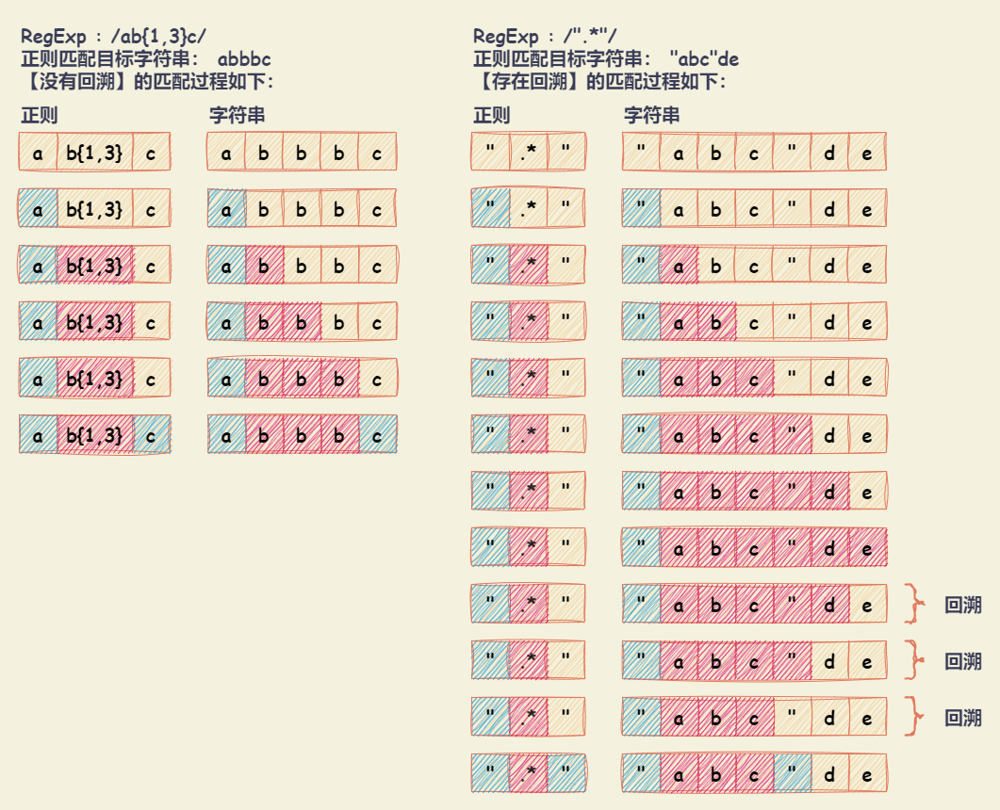

# RegExp

正则表达式是用于匹配字符串中字符组合的模式。在 JavaScript 中，正则表达式也是对象。

正则表达式可以被用于 `RegExp` 的 `exec` 和 `test` 方法，以及 `String` 的 `match`、`matchAll`、`replace`、`search` 和 `split` 方法。

## 位置匹配

对位置的理解，可以理解为空字符 `""` ，相邻字符之间的位置。

```javascript
// 'hello' 字符串等价于如下形式：
'hello' == '' + 'h' + '' + 'e' + '' + 'l' + '' + 'l' + '' + 'o' + ''
// 同时，也等价于如下形式：
'hello' == '' + '' + 'hello'
```

### ^ 和 $

- `^` ：匹配字符串的开始位置，在多行匹配中匹配行开始位置。
- `$` ：匹配字符串的结束位置，在多行匹配中匹配行结束位置。

```javascript
'hello'.replace(/^|$/g, '#') // '#hello#'

// 多行匹配模式（即，使用修饰符 m）
'hello\nworld\njavascript'.replace(/^|$/gm, '#')
// '#hello#\n#world#\n#javascript#'

let fruits = ['Apple', 'Watermelon', 'Orange', 'Avocado', 'Strawberry']
// /^[^A]/ 表示匹配不以 'A' 开头的字符串
// 其中，[^A] 表示匹配不是 'A' 的字符
fruits.filter((fruit) => /^[^A]/.test(fruit))
// [ 'Watermelon', 'Orange', 'Strawberry' ]
```

### \b 和 \B

- `\b` ：匹配单词边界。即包括介于 `\w` 与 `\W` 、`\w` 与 `^` 、 `\w` 与 `$` 之间的位置。
- `\B` ：匹配非单词边界。即包括介于 `\w` 与 `\w` 、 `\W` 与 `\W` 、 `\W` 与 `$` 之间的位置。

```javascript
'[JavaScript] Lesson_01.mp4'.replace(/\b/g, '#')
// '[#JavaScript#] #Lesson_01#.#mp4#'

'[JavaScript] Lesson_01.mp4'.replace(/\B/g, '#')
// '#[J#a#v#a#S#c#r#i#p#t]# L#e#s#s#o#n#_#0#1.m#p#4'

let fruitsWithDescription = ['Red apple', 'Orange orange', 'Green Avocado']
// /(en|ed)\b/ 表示匹配以 'en' 或 'ed' 结尾的字符串
fruitsWithDescription.filter((descr) => /(en|ed)\b/.test(descr))
// [ 'Red apple', 'Green Avocado' ]
```

### x(?=y) 、 x(?!y) 、 (?<=y)x 、 (?<!y)x

- `x(?=y)` ：`x` 后面是 `y` 时匹配 `x`。
- `x(?!y)` ：`x` 后面不是 `y` 时匹配 `x`。
- `(?<=y)x` ：`x` 前面是 `y` 时匹配 `x`。
- `(?<!y)x` ：`x` 前面不是 `y` 时匹配 `x`。

```javascript
// /(?=l)/ 可以理解为 '' 后面是 'l' 时匹配 ''，即匹配字符 'l' 前面的位置
'hello'.replace(/(?=l)/g, '#') // 'he#l#lo'
// /e(?=l)/ 表示 'e' 后面是 'l' 时匹配 'e'
'hello'.replace(/e(?=l)/g, '#') // 'h#llo'

// /(?!l)/ 可以理解为 '' 后面不是 'l' 时匹配 ''，即匹配字符后面不是 'l' 的位置
'hello'.replace(/(?!l)/g, '#') // '#h#ell#o#'
// /h(?!l)/ 表示 'h' 后面不是 'l' 时匹配 'h'
'hello'.replace(/h(?!l)/g, '#') // '#ello'

// /(?<=l)/ 可以理解为 '' 前面是 'l' 时匹配 ''，即匹配字符 'l' 后面的位置
'hello'.replace(/(?<=l)/g, '#') // 'hel#l#o'
// /(?<=l)o/ 表示 'o' 前面是 'l' 时匹配 'o'
'hello'.replace(/(?<=l)o/g, '#') // 'hell#'

// /(?<!l)/ 可以理解为 '' 前面不是 'l' 时匹配 ''，即匹配字符前面不是 'l' 的位置，
'hello'.replace(/(?<!l)/g, '#') // '#h#e#llo#'
// /(?<!l)e/ 表示 'e' 前面不是 'l' 时匹配 'e'
'hello'.replace(/(?<!l)e/g, '#') // 'h#llo'
```

### 相关示例

```javascript
// 不匹配任何字符
// 该正则要求只有一个字符，但字符后面是匹配开始位置，这样的字符串不存在
let mismatchingRegExp = /.^/

// 金额格式化 - 千分位
let numberFormatByThousandsRegExp = /\B(?=(\d{3})+\b)/g
'12345678'.replace(numberFormatByThousandsRegExp, ',') // '12,345,678'
'12345678 12345678'.replace(numberFormatByThousandsRegExp, ',') // '12,345,678 12,345,678'

// 验证密码规则：密码长度 6-12 位，由数字、小写字符和大写字母组成，但必须至少包括 2 种字符
let passwordVerifyRegExpOne =
  /((?=.*[0-9])(?=.*[a-z])|(?=.*[0-9])(?=.*[A-Z])|(?=.*[a-z])(?=.*[A- Z]))^[0-9A-Za-z]{6,12}$/
passwordVerifyRegExpOne.test('1234567') // false ，全是数字
passwordVerifyRegExpOne.test('abcdef') // false ，全是小写字母
passwordVerifyRegExpOne.test('ABDCEF') // false ，全是大写字母
passwordVerifyRegExpOne.test('abc12') // false ，不满 6 位
passwordVerifyRegExpOne.test('abc123') // true
passwordVerifyRegExpOne.test('abc123ABC') // true

let passwordVerifyRegExpTwo = /(?!^[0-9]{6,12}$)^[0-9A-Za-z]{6,12}$/
passwordVerifyRegExpTwo.test('1234567') // false ，全是数字
passwordVerifyRegExpTwo.test('abcdef') // false ，全是小写字母
passwordVerifyRegExpTwo.test('ABDCEF') // false ，全是大写字母
passwordVerifyRegExpTwo.test('abc12') // false ，不满 6 位
passwordVerifyRegExpTwo.test('abc123') // true
passwordVerifyRegExpTwo.test('abc123ABC') // true
```

## 字符类与量词

### 字符组

- `[xyz] 或 [a-c]` ：匹配**包含**在方括号中的任何字符。可以使用使用连字符（`-`）指定字符范围。
- `[^xyz] 或 [^a-c]` ：匹配**未包含**在方括号中的任何字符。可以使用使用连字符（`-`）指定字符范围。

注意：

- 连字符（`-`）出现在方括号中的第一个或最后一个字符，则作为普通字符包含在字符类中。
- 插入符号（`^`）仅在开头会被转义（表示排除）。
- 正则表达式 `[-().^+]` 表示查找 `-().^+` 中的任何字符。

### 分支选择

- `x|y` ：匹配 `'x'` 或 `'y'` 。每个由管道符 (`|`) 分隔的部分称为一个可选项。

### 字符类简写

- `.` ：匹配除终止符之外的任何单个字符。终止符包括 `\n` （换行符）、 `\r` （回车符）、 `\u2028` （行分隔符）、 `\u2029` （段落分隔符）。
- `\d` ：相当于 `[0-9]`。匹配任何数字 (阿拉伯数字)。
- `\D` ：相当于 `[^0-9]`。匹配任何非数字 (阿拉伯数字) 的字符。
- `\w` ：相当于 `[A-Za-z0-9_]`。匹配基本拉丁字母中的任何字母数字字符，包括下划线。
- `\W` ：相当于 `[^A-Za-z0-9_]`。匹配任何不是来自基本拉丁字母的单词字符。
- `\s` ：相当于 `[\f\n\r\t\v\u0020\u00a0\u1680\u2000-\u200a\u2028\u2029\u202f\u205f\u3000\ufeff]`。匹配单个空白字符，包括空格、制表符、换页符、换行符和其他 Unicode 空格。
- `\S` ：相当于 `[^\f\n\r\t\v\u0020\u00a0\u1680\u2000-\u200a\u2028\u2029\u202f\u205f\u3000\ufeff]`。匹配除空格以外的单个字符。
- `\t` ：匹配水平制表符。
- `\r` ：匹配回车符。
- `\n` ：匹配换行符。
- `\v` ：匹配垂直制表符。
- `\f` ：匹配换页符。
- `[\b]` ：匹配退格键。注意 `\b` 为匹配单词边界。
- `\0` ：匹配一个 NUL 字符。注意不要在此后面加上另一个数字。
- `\cX` ：使用插入符号匹配控制字符，其中 `X` 是 `A–Z` 中的一个字母（对应于代码点 `U+0001 – U+001F`）。
- `\xhh` ：匹配与代码 `hh`（表示两个十六进制数字）对应的字符。
- `\uhhhh` ：匹配与值 `hhhh`（表示四个十六进制数字）对应的 UTF-16 代码单元。
- `\u{hhhh} 或 \u{hhhhh}` ：（仅当设置了 `u` 修饰符时）匹配与 Unicode 值 `U+hhhh` 或 `U+hhhhh`（十六进制数字）对应的字符。
- `\p{UnicodeProperty} 或 \P{UnicodeProperty}` ：根据字符的 Unicode 字符属性匹配字符。

### 量词

- `x*` ：将前一项 `'x'` 匹配 **0 次或更多次**。
- `x+` ：将前一项 `'x'` 匹配 **1 次或更多次**。
- `x?` ：将前一项 `'x'` 匹配 **0 次或 1 次**。
- `x{n}` ：其中 `n` 是一个正整数，将前一项 `'x'` 匹配 **n 次**。
- `x{n,}` ：其中 `n` 是一个正整数，将前一项 `'x'` 匹配 **至少 n 次**。
- `x{n,m}` ：其中 `n` 是 0 或一个正整数，`m` 是一个正整数，`m > n`。将前一项 `'x'` 匹配**至少 n 次**，匹配**最多 m 次**。
- 量词后添加 `?` 号表示**非贪婪匹配，一旦匹配到就会停止**。比如：`x*?` 、`x+?` 、`x??` 、`x{n}?` 、`x{n,}?` 、`x{n,m}?`

### 相关示例

```javascript
// 匹配 16 进制颜色值
let hexColorRegExp = /#([0-9a-fA-F]{6}|[0-9a-fA-F]{3})/g
'#ffbbad #Fc01DF #FFF #ffE'.match(hexColorRegExp)
// ['#ffbbad', '#Fc01DF', '#FFF', '#ffE']

// 匹配时间
let timeRegExp = /^(0?[0-9]|1[0-9]|[2][0-3]):(0?[0-9]|[1-5][0-9])$/
timeRegExp.test('23:59') // true
timeRegExp.test('02:07') // true
timeRegExp.test('7:9') // true

// 匹配日期
let dateCapturingGroupRegExp = /^[0-9]{4}-(0[1-9]|1[0-2])-(0[1-9]|[12][0-9]|3[01])$/
dateCapturingGroupRegExp.test('2017-06-10') // true

// 匹配 window 路径
let windowPathRegExp =
  /^[a-zA-Z]:\\([^\\:*<>|"?\r\n/]+\\)*([^\\:*<>|"?\r\n/]+)?$/
windowPathRegExp.test('F:\\study\\javascript\\regex\\regular expression.pdf') // true
windowPathRegExp.test('F:\\study\\javascript\\regex\\') // true
windowPathRegExp.test('F:\\study\\javascript') // true
windowPathRegExp.test('F:\\') // true

// 匹配 id
let idRegExp = /id=".*?"/
'<div id="container" class="main"></div'.match(regex)[0]
// id="container"
```

## 分组与范围

### 分组

- `(x)` ：捕获组，匹配 `x` 并记住**匹配结果**。正则表达式可以有多个捕获组，在匹配的结果数组中，其成员的顺序与捕获组中左括号的顺序相同。**可以**使用元素索引（`[1], ..., [n]`，`[0]` 为完整的匹配项）或预定义 RegExp 对象的属性（`$1, ..., $9`）访问匹配结果。
- `(?<Name>x)` ：具名捕获组。匹配 `x` 并将其存储在返回的匹配项的 `groups` 属性中，属性位于 `<Name>` 指定的名称下。
- `(?:x)` ：非捕获组。匹配 `x` 但**不记住匹配结果**。在匹配的结果数组中，其成员的顺序与捕获组中左括号的顺序相同。**无法**通过元素索引（`[1], ..., [n]`，`[0]` 为完整的匹配项）或预定义 RegExp 对象的属性（`$1, ..., $9`）访问匹配结果。

```javascript
let dateCapturingGroupRegExp = /(\d{4})-(\d{2})-(\d{2})/
let dateNamedCapturingGroupRegExp =
  /(?<year>\d{4})-(?<month>\d{2})-(?<day>\d{2})/
let dateNonCapturingGroupRegExp = /(\d{4})-(?:\d{2})-(?:\d{2})/

let dateStr = '2023-06-12'
let dateCapturingGroup = dateStr.match(dateCapturingGroupRegExp)
// ['2023-06-12', '2023', '06', '12', index: 0, input: '2023-06-12', groups: undefined]

let dateNamedCapturingGroup = dateStr.match(dateNamedCapturingGroupRegExp)
// ['2023-06-12', '2023', '06', '12', index: 0, input: '2023-06-12', groups: {year: '2023', month: '06', day: '12'}]

let dateNonCapturingGroup = dateStr.match(dateNonCapturingGroupRegExp)
// ['2023-06-12', '2023', index: 0, input: '2023-06-12', groups: undefined]

dateCapturingGroup[0] // '2023-06-12'
dateCapturingGroup[1] // '2023'
dateCapturingGroup[2] // '06'
dateCapturingGroup[3] // '12'

let dateStrFormatChangeOne = dateStr.replace(
  dateCapturingGroupRegExp,
  '$2/$3/$1'
)
// 06/12/2023

let dateStrFormatChangeTwo = dateStr.replace(
  dateCapturingGroupRegExp,
  function () {
    return RegExp.$2 + '/' + RegExp.$3 + '/' + RegExp.$1
  }
)
// 06/12/2023

let dateStrFormatChangeThree = dateStr.replace(
  dateCapturingGroupRegExp,
  function (match, year, month, day) {
    return month + '/' + day + '/' + year
  }
)
// 06/12/2023
```

### 反向引用

- `\n` ：数字反向引用，其中 `n` 是一个正整数。对正则表达式中与 `n` 括号匹配的最后一个子字符串的反向引用 (计算左括号)。
- `\k<Name>` ：具名组反向引用。对正则表达式中与 `<Name>` 匹配的最后一个子字符串的反向引用。

```javascript
// 分组嵌套时，以左括号为准
let backReferenceRegExpOne = /^((\d)(\d(\d)))\1\2\3\4$/
'1231231233'.replace(backReferenceRegExpOne, function () {
  return RegExp.$1 + '/' + RegExp.$2 + '/' + RegExp.$3 + '/' + RegExp.$4
})
// '123/1/23/3'

// \10 表示第 10 个分组
// 匹配 \1 和 0 ，需使用 (?:\1)0 或 \1(?:0)
let backReferenceRegExpTwo = /(1)(2)(3)(4)(5)(6)(7)(8)(9)(#) \10+/
backReferenceRegExpTwo.test("123456789# ######") // true

// 如果不存在分组时，正则不会报错，会匹配反向引用的字符本身
let backReferenceRegExpThree = /\1\2\3\4\5\6\7\8\9/
backReferenceRegExpThree.test('\1\2\3\4\5\6\7\8\9') // true
'\1\2\3\4\5\6\7\8\9'.split('') // ['\x01', '\x02', '\x03', '\x04', '\x05', '\x06', '\x07', '8', '9']

// 分组后存在量词时，分组反向引用最终捕获到的数据是最后一次的匹配
let backReferenceRegExpFour = /(\d)+ \1/
backReferenceRegExpFour.test('12345 1') // false
backReferenceRegExpFour.test('12345 5') // true

// 具名组反向引用，最终捕获到的数据是最后一次的匹配
const backReferenceNamedRegExp = /^(?<word>[a-z]+)!\k<word>!\1$/
backReferenceNamedRegExp.test('abc!abc!abc') // true
backReferenceNamedRegExp.test('abc!abc!a') // false
backReferenceNamedRegExp.test('abc!abc!ab') // false
```

### 相关示例

```javascript
// 模拟 trim 方法
function trim(str) {
  // 匹配到开头和结尾的空白符，替换成空字符
  return str.replace(/^\s+|\s+$/g, '')

  // 另外一种方法：
  // 匹配整个字符串，使用引用来提取出相应的数据
  // return str.replace(/^\s*(.*?)\s*$/g, '$1')
}
trim('  foobar   ') // 'foobar'

// 将每个单词的首字母转换为大写
function titleize(str) {
  return str.toLowerCase().replace(/(?:^|\s)\w/g, function (c) {
    return c.toUpperCase()
  })
}
titleize('my name is epeli') // 'My Name Is Epeli'

// 驼峰化
function camelize(str) {
  return str.replace(/[-_\s]+(.)?/g, function (match, c) {
    return c ? c.toUpperCase() : ''
  })
}
camelize('-moz-transform') // 'MozTransform'

// 中划线化
function dasherize(str) {
  return str
    .replace(/([A-Z])/g, '-$1')
    .replace(/[-_\s]+/g, '-')
    .toLowerCase()
}
dasherize('MozTransform') // '-moz-transform'

// HTML 转义：将 HTML 特殊字符转换成等值的实体
function escapeHTML(str) {
  var escapeChars = {
    '<': 'lt',
    '>': 'gt',
    '"': 'quot',
    '&': 'amp',
    "'": '#39',
  }
  return str.replace(
    new RegExp('[' + Object.keys(escapeChars).join('') + ']', 'g'),
    function (match) {
      return '&' + escapeChars[match] + ';'
    }
  )
}
escapeHTML('<div>Blah blah blah</div>')
// '&lt;div&gt;Blah blah blah&lt;/div&gt'

// HTML 反转义：实体字符转换为等值的 HTML
function unescapeHTML(str) {
  var htmlEntities = {
    nbsp: ' ',
    lt: '<',
    gt: '>',
    quot: '"',
    amp: '&',
    apos: "'",
  }
  return str.replace(/\&([^;]+);/g, function (match, key) {
    if (key in htmlEntities) {
      return htmlEntities[key]
    }
    return match
  })
}
unescapeHTML('&lt;div&gt;Blah blah blah&lt;/div&gt;')
// '<div>Blah blah blah</div>'

// 匹配成对标签
// > 开标签使用 [^>]+ 的的是为了反向引用，闭标签使用反向引用 <\/\1>
// > [\d\D] 表示匹配的字符是数字或者不是数字，即匹配任何字符
let htmlTagRegex = /<([^>]+)>[\d\D]*<\/\1>/
let string1 = '<title>regular expression</title>'
let string2 = '<p>bye bye</p>'
let string3 = '<title>wrong!</p>'
htmlTagRegex.test(string1) // true
htmlTagRegex.test(string2) // true
htmlTagRegex.test(string3) // false
```

## Unicode 属性转义（Unicode property escapes）

Unicode property escapes 正则表达式 支持根据 Unicode 属性进行匹配，可以用它来匹配出表情、标点符号、字母（甚至适用特定语言或文字）等。同一符号可以拥有多种 Unicode 属性，属性则有 binary ("boolean-like") 和 non-binary 之分。

```md
// Non-binary 属性
\p{Unicode 属性值}
\p{Unicode 属性名=Unicode 属性值}

// Binary and non-binary 属性
\p{UnicodeBinary 属性名}

// \P 为 \p 取反
\P{Unicode 属性值}
\P{UnicodeBinary 属性名}
```

- `UnicodeBinary 属性名` ：Binary 属性名。例如 ASCII. Alpha, Math, Diacritic, Emoji, Hex_Digit, Math, White_space, 等。
- `Unicode 属性名` ：Non-binary 属性名。
- `Unicode 属性值` ：例如，对应 General_Category 属性名的属性值 Decimal_Number 可以写作 Nd, digit, 或 Decimal_Number 。

```javascript
const sentence = 'A ticket to 大阪 costs ¥2000 👌.'

const regexpEmojiPresentation = /\p{Emoji_Presentation}/gu
sentence.match(regexpEmojiPresentation) // [ '👌' ]
```

## 使用标志（修饰符）

- `g` ：全局搜索（global）。默认情况下，第一次匹配成功之后，就会停止匹配。使用 `g` 修饰符后，将匹配所有符合条件的结果。
- `i` ：不区分大小写搜索。默认情况下，匹配区分大小写。使用 `i` 修饰符后，忽略大小写（ignoreCase）。
- `m` ：多行搜索（multiline）。默认情况下，`^` 和 `$` 匹配字符串的开始和结尾位置。使用 `m` 修饰符后，`^` 和 `$` 除了匹配开始和结尾位置外，还会匹配换行符（`\n`）。
- `s` ：允许 `.` 匹配换行符。默认情况下，`.` 匹配除终止符之外的任何单个字符。使用 `s` 修饰符，`.` 可以匹配任意单个字符。其中，终止符包括 `\n` （换行符）、 `\r` （回车符）、 `\u2028` （行分隔符）、 `\u2029` （段落分隔符）。
- `d` ：可以在 `exec()` 、`match()` 的返回结果添加 `indices` 属性，在该属性上面可以获取对应匹配字符的开始位置和结束位置。
- `y` ：执行“粘性 (sticky)”搜索，后一次匹配从上一次匹配成功的下一个位置开始。
- `u` ：使用 Unicode 码的模式进行匹配，用于正确处理 `\uFFFF` 的 Unicode 字符（即四个字节的 UTF-16 编码）。
- `v` ：增强 Unicode 属性类的运算，提供两种运算：
  - 差集运算（`[A--B]`）：A 集合减去 B 集合
  - 交集运算（`[A&&B]`）：A 集合与 B 集合的交集

## 正则表达式回溯法原理

> 回溯法（探索与回溯法）是一种选优搜索法，又称为试探法，按选优条件向前搜索，以达到目标。但当探索到某一步时，发现原先选择并不优或达不到目标，就退回一步重新选择，这种走不通就退回再走的技术为回溯法，而满足回溯条件的某个状态的点称为“回溯点”。



## 正则表达式优先级

- 转义符（**优先级 1**）： `\`
- 括号与方括号（**优先级 2**）： `(...)`、`(?:...)`、`(?=...)`、`(?!...)`、`[...]`
- 量词（**优先级 3**）： `{m}`、`{m,n}`、`{m,}`、`?`、`*`、`+`
- 位置和序列（**优先级 4**）： `^`、`$`、`\元字符`、`一般字符`
- 管道符（**优先级 5**）： `|`

## 使用正则表达式方法

### RegExp.prototype.exec()

**语法：** `RegExp.exec(str)`

**描述：** 在一个指定字符串 `str` 中执行一个搜索匹配。返回一个结果数组或 `null`。

**参数：** 要匹配正则表达式的字符串 `str`。

**返回值：**

- 如果匹配成功，`exec()` 方法返回一个数组，并更新正则表达式对象的 `lastIndex` 属性。
  - 返回的数组
    - 数组第一项为完全匹配成功的文本。
    - 从数组第二项起，后续每项都对应一个匹配的捕获组。
  - 额外的属性
    - `index` ：匹配到的字符位于原始字符串的基于 0 的索引值。
    - `input` ：匹配的原始字符串。
    - `groups` ：一个命名捕获组对象，其键是名称，值是捕获组。若没有定义命名捕获组，则 `groups` 的值为 `undefined`。
    - `indices` ：仅在设置了 `d` 标志位时存在。它是一个数组，其中每一个元素表示一个子字符串的边界。每个子字符串匹配本身就是一个数组，其中第一个元素表示起始索引，第二个元素表示结束索引。

- 如果匹配失败，`exec()` 方法返回 `null`，并将正则表达式的 `lastIndex` 重置为 0。

### RegExp.prototype.test()

**语法：** `RegExp.test(str)`

**描述：** 用来查看正则表达式与指定的字符串 `str` 是否匹配。返回 `true` 或 `false`。

**参数：** 要匹配正则表达式的字符串 `str`。

**返回值：** 如果正则表达式与指定的字符串匹配，返回 `true`；否则 `false`。

### String.prototype.match()

**语法：** `str.match(regexp)`

**描述：** 检索字符串 `str` 与正则表达式进行匹配的结果。

**参数：** 一个正则表达式对象 `regexp` 或者任何具有 `Symbol.match` 方法的对象。

- 如果 `regexp` 不是 `RegExp` 对象并且对象上无 `Symbol.match` 方法，则会使用 `new RegExp(regexp)` 将其隐式地转换为 `RegExp`。
- 如果你没有给出任何参数并直接使用 `match()` 方法，将会得到一个包含空字符串的数组：`[""]`，因为这等价于 `match(/(?:)/)`。

**返回值：** 一个 `Array`。其内容取决于是否存在全局（`g`）标志，如果没有匹配，则返回 `null`。

- 如果使用 `g` 标志，则将返回与完整正则表达式匹配的所有结果，但不会返回捕获组。
- 如果没有使用 `g` 标志，则只返回第一个完整匹配及其相关捕获组。在这种情况下，`match()` 方法将返回与 `RegExp.prototype.exec()` 相同的结果（一个带有一些额外属性的数组）。

### String.prototype.search()

**语法：** `str.search(regexp)`

**描述：** 用于在 `String` 对象中执行正则表达式的搜索，寻找匹配项。

**参数：** 一个正则表达式对象 `regexp` 或者任何具有 `Symbol.match` 方法的对象。

- 如果 `regexp` 不是 `RegExp` 对象并且对象上无 `Symbol.match` 方法，则会使用 `new RegExp(regexp)` 将其隐式地转换为 `RegExp`。

**返回值：** 如果匹配成功，则返回正则表达式在字符串中首次匹配的索引；否则，返回 `-1`。

### String.prototype.replace()

**语法：** `str.search(pattern, replacement)`

**描述：** 返回一个新字符串，其中一个、多个或所有匹配的 `pattern` 被替换为 `replacement`。

- `pattern` 可以是字符串或 `RegExp`，`replacement` 可以是字符串或一个在每次匹配时调用的函数。
- 如果 `pattern` 是字符串，则只会替换第一个匹配项。
- 原始的字符串不会改变。

**参数：**

- `pattern` ：可以是字符串或者一个带有 `Symbol.replace` 方法的对象（典型的例子是正则表达式），任何没有 `Symbol.replace` 方法的值都会被强制转换为字符串。
- `replacement` ：可以是字符串或函数。
  - 如果是字符串，它将替换由 `pattern` 匹配的子字符串。
  - 如果是函数，将为每个匹配调用该函数，并将其返回值用作替换文本。

**返回值：** 返回一个新的字符串，其中一个、多个或所有的匹配项都被指定的替换项替换。

### String.prototype.split()

**语法：** `split(separator, limit)`

**描述：** 接受一个模式 `separator`，通过搜索模式将字符串分割成一个有序的子串列表，将这些子串放入一个数组，并返回该数组。

**参数：**

- `separator` ：描述每个分割应该发生在哪里的模式。可以是 `undefined`，一个字符串，或者一个具有 `Symbol.split` 方法的对象（典型的例子是正则表达式）。
  - 省略 `separator` 或传递 `undefined` 会导致 `split()` 返回一个只包含所调用字符串数组。
  - 所有不是 `undefined` 的值或不具有 `@@split` 方法的对象，都被强制转换为字符串。
- `limit` ：可选值。一个非负整数，指定数组中包含的子字符串的数量限制。当提供此参数时，`split` 方法会在指定 `separator` 每次出现时分割该字符串，但在已经有 `limit` 个元素时停止分割。任何剩余的文本都不会包含在数组中。
  - 如果在达到极限之前就达到了字符串的末端，那么数组包含的条目可能少于 `limit`。
  - 如果 `limit` 为 `0`，则返回 `[]`。

**返回值：** 在给定字符串中出现 `separator` 的每一个点上进行分割而成的字符串数组。
