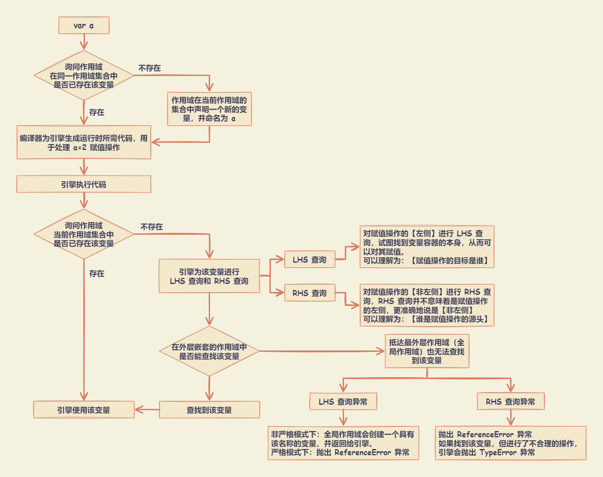
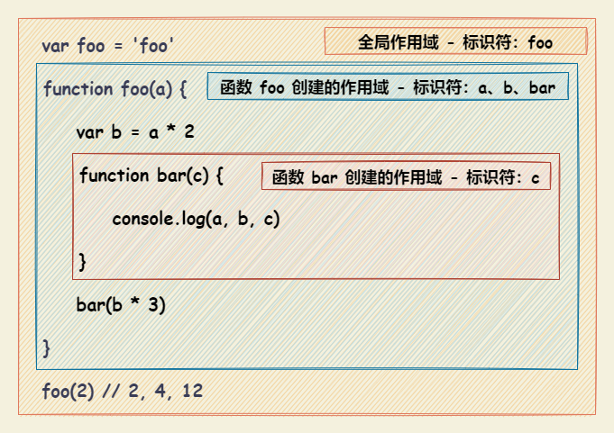
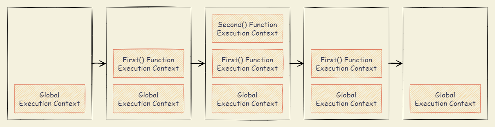
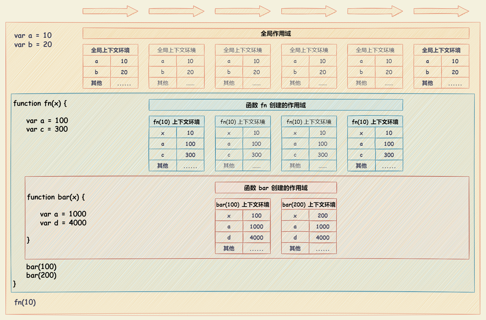
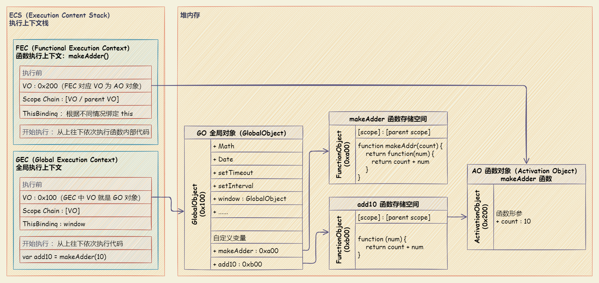
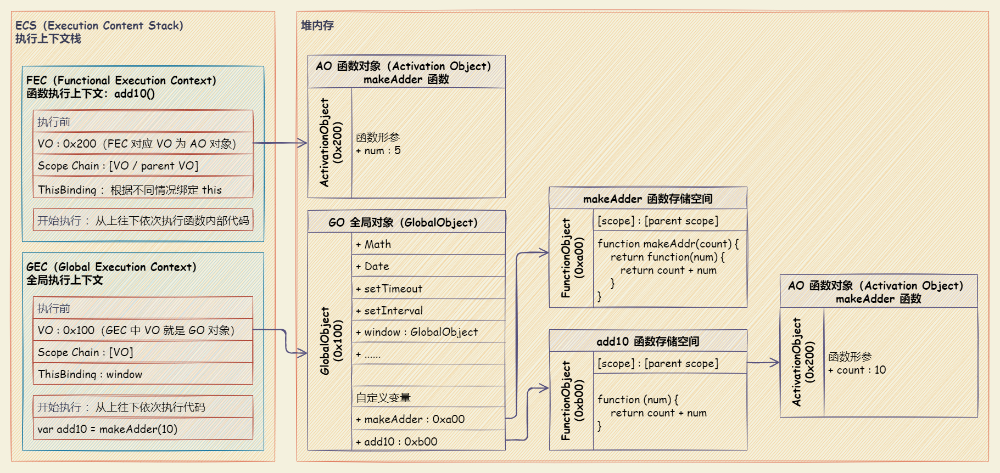

# 作用域与闭包

## 编译原理

在传统编译语言的流程中，程序中一段源代码在执行之前会经历三个步骤，统称为 **编译** 。

- **`分词/词法分析(Tokenizing/Lexing)`** ：该过程将代码字符串分解成有意义的代码块。被分解成的代码块成为 **`词法单元(token)`** 。

  ```javascript
  var a = 2;

  // 词法分析后的结构
  // 空格是否会被当做词法单元，取决于在语言中是否具有意义。
  [
    "var": "keyword",
    "a"  : "identifier",
    "="  : "assignment",
    "2"  : "integer",
    ";"  : "eos"(end of statement)
  ]
  ```

  - **`分词(tokenizing)`** 和 **`词法分析(Lexing)`** 之间的区别在于**词法单元的识别是通过有状态还是无状态的方式进行的。
    - 分词：是无状态的
    - 词法分析：是有状态的。
  - 词法单元生成器判断 `a` 是一个独立的词法单元还是其他词法单元的一部分时，调用的状态的解析规则，则这个过程被称为 **`词法分析`** 。

- **`解析/语法分析(Parsing)`** ：  该过程将词法单元流（数组）转换成一个由元素逐级嵌套所组成的代表了程序语法结构的树。生成的树被称为 **`抽象语法树(Abstract Syntax Tree, AST)`**。

  如果源码符合语法规则，会生成一个抽象语法树；如果源码存在语法错误，会抛出一个 “语法错误”。

  ```javascript
  {
    operation: "=",
    left: {
      keyword: "var",
      right: "a"
    },
    right: "2"
  }
  // 上面代码中，抽象语法树的一个节点是赋值操作符（=），它两侧的词义单位，分别成左侧子节点和右侧子节点
  ```

- **`代码生成`**：将 `抽象语法树 AST` 转换为可执行代码。

JavaScript 引擎要复杂得多。例如，在语法分析和代码生成阶段有特定的步骤来对运行性能进行优化，包括对冗余元素进行优化等。

**任何 JavaScript 代码片段在执行前都要进行编译（通常就在执行前）。编译器可以在代码生成的同时处理声明和值的定义。**

## 作用域

### 理解作用域

**作用域是一套规则，用于确定在何处以及如何查找变量（标识符）。**

- **引擎** ：负责整个 JavaScript 的编译及执行过程。
- **编译器** ：负责语法分析及代码生成等。
- **作用域** ：负责收集并维护有所有的标识符（变量）组成的一系列查询，并实施一套非常严格的规则，确定当前执行的代码对这些标识符的访问权限。



### 词法作用域

词法作用域：**定义在词法阶段的作用域**。即：**由在编写代码时将变量和块作用域写在哪里来决定的，因此当词法分析器处理代码时会保持作用域不变（大部分情况下是这样的）。**

- 遮蔽效应：在多层的嵌套作用域中可以定义同名的标识符，作用域查找会在找到第一个匹配的标识符时停止。即：**内部的标识符遮蔽了外部的标识符**。
- 无论函数在哪里被调用以及如何被调用，**函数的词法作用域都只由函数被声明时所处的位置决定。**

在运行时，修改（欺骗）词法作用域：

- `eval(string)` 函数 ：将传入的字符串当做 JavaScript 代码进行执行。返回字符串中代码的返回值。如果返回值为空，则返回 `undefined`。

  在执行 `eval(string)` 之后的代码时，引擎并不“知道”或“在意”前面的代码是以动态形式插入进来，并对词法作用域的环境进行修改的。**引擎只会如往常地进行词法作用域查找**。

  **避免使用 eval ！**

  ```javascript
  function foo(str, a) {
    // 欺骗词法作用域
    // 执行 eval() 中的 JavaScript 的代码
    // 其中，var b = 3 相当于在 foo 函数内部创建了一个变量 b，并遮蔽了外部作用域中的同名变量
    // 在严格模式下，eval() 运行时有自己的词法作用域，无法修改其所在的作用域
    eval(str)
    console.log(a, b)
  }
  var b = 2
  foo('var b = 3;', 1) // 1, 3
  ```

  与 `eval(string)` 效果相似的有：`new Function(arg0, arg1, /* … ,*/ argN, functionBody)` ，最后一个参数可以接受代码字符串，并将其转化为动态生成的函数。

- `with (expression) { statement }`：扩展一个语句的作用域链。

  - `expression` ：将给定的表达式添加到在评估语句时使用的作用域链上。表达式周围的括号是必需的。
  - `statement` ：任何语句。要执行多个语句，请使用一个块语句 (`{ ... }`) 对这些语句进行分组。

  `with` 可以将一个没有或有多个属性的对象处理为一个完全隔离的词法作用域，因此这个对象的属性也会被处理为定义在这个作用域中的词法标识符。

  **避免使用 with ！**

  ```javascript
  var obj = { a: 1, b: 2, c: 3 }
  // 修改 obj 中属性的值
  with (obj) {
    a = 3
    b = 4
    c = 5
  }
  console.log(obj) // { a: 3, b: 4, c: 5 }

  function foo(obj) {
    with (obj) {
      a = 2
    }
  }
  var obj01 = { a: 3 }
  foo(obj01)
  console.log(obj01.a) // 2

  var obj02 = { b: 3 }
  foo(obj02)
  console.log(obj02.a) // undefined
  console.log(a) // 2 ，a 被泄露到全局作用域上了
  ```

- 使用 `eval` 和 `with` 会有性能问题的原因

  JavaScript 引擎会在编译阶段进行数项的性能优化。其中有些优化依赖于能够根据代码的词法进行静态分析，并预先确定所有变量和函数的定义位置，才能在执行过程中快速找到标识符。

  如果引擎在代码中发现了 `eval(string)` 或 `with (expression) { statement }`，它只能简单地假设关于标识符位置的判断都是无效的，因为无法在词法分析阶段明确知道 `eval(string)` 会接收到什么代码，这些代码会如何对作用域进行修改，也无法知道传递给 `with (expression) { statement }` 用来创建新词法作用域的对象的内容到底是什么。

  如果出现了 `eval(string)` 或 `with (expression) { statement }`，所有的优化可能都是无意义的，因此最简单的做法就是完全不做任何优化。

### 函数作用域

函数作用域：由函数创建的作用域，**属于该函数的全部变量都可以在整个函数的范围内使用及复用**。事实上，在嵌套的作用域中也可以使用。



- 最小授权或最小暴露原则：在软件设计中，应该最小限度地暴露必要内容，而将其他内容都 “隐藏” 起来，比如某个模块或对象的 API 设计。

  ```javascript
  // doSomethingElse() 函数是 doSomething() 函数内部具体实现的 “私有” 内容
  // 给予外部作用域对变量 b 和 doSomethingElse() 函数的 “访问权限” 不仅没有必要，而且可能是 “危险” 的
  // 因为它们可能被有意或无意地以非预期的方式使用，从而导致超出了 doSomething() 函数的适用条件

  function doSomething(a) {
    b = a + doSomethingElse(a * 2)
    console.log(b * 3)
  }
  function doSomethingElse(a) {
    return a - 1
  }
  var b
  doSomething(2) // 15
  ```

  ```javascript
  // 变量 b 和 doSomethingElse() 函数都无法从外部被访问，而只能被 doSomething() 函数所控制。
  // 功能性和最终效果都没有受影响，但是设计上将具体内容私有化了

  function doSomething(a) {
    function doSomethingElse(a) {
      return a - 1
    }
    var b
    b = a + doSomethingElse(a * 2)
    console.log(b * 3)
  }
  doSomething(2) // 15
  ```

- 规避冲突：避免同名标识符之间的冲突。

  - 全局命名空间：通常会在全局作用域中声明一个名字足够独特的变量，通常是一个对象。这个对象被用作库的命名空间，所有需要暴露给外界的功能都会成为这个对象（命名空间）的属性，而不是将自己的标识符暴漏在顶级的词法作用域中。

    ```javascript
    var MyReallyCoolLibrary = {
      awesome: 'stuff',
      doSomething: function () {
        // ...
      },
      doAnotherThing: function () {
        // ...
      },
    }
    ```

  - 模块管理：通过依赖管理器的机制，将库的标识符显式地导入到另外一个特定的作用域中。

    - 原生JS组织方案

      ```javascript
      var calculator = (function () {
        function add(a, b) {
          return a + b
        }
        return { add }
      })()

      (function (window) {
        //...
        // Expose jQuery to the global object
        window.jQuery = window.$ = jQuery;
      })(window);
      ```

    - 模块化方案：`CommonJS`、`CMD（Common Module Definition）`、`AMD（Async Module Definition）`、`UMD （Universal Module Definition）`、`ES6 Module`

### 全局作用域

全局作用域：脚本模式运行所有代码的默认作用域。

无论在何处声明变量，都会在执行任何代码之前进行处理，被称为变量提升（Hoisting）。

`var` 语句 ：用于声明一个函数范围或全局范围的变量，并可将其初始化为一个值（可选）。

- 用 `var` 声明的变量的作用域，是它当前的执行上下文及其闭包（嵌套函数），或者对于声明在任何函数外的变量来说是全局。
- 在全局上下文中，使用 `var` 声明的变量将作为全局对象的不可配置属性被添加。这意味着它的属性描述符无法被修改，也无法使用 `delete` 删除。
- 如果在声明前访问了变量，变量将会返回 `undefined`。
- `var` 声明的全局变量，可以通过 `window` 访问。

```javascript
var a = 123
b = 456

window.a // 123
window.b // 456

delete a // false
delete b // true
```

### 块级作用域

块级作用域：用一对花括号（通常是 `{ ... }` 内部）创建出来的作用域。

- `let` 语句 ：声明一个块级作用域的局部变量，并可以初始化为一个值（可选）。`let` 声明的变量不会在作用域中被提升，它是在编译时才初始化。
- `const` 语句 ：声明创建一个常量，其作用域可以是全局或本地声明的块。

从一个代码块的开始直到代码执行到声明变量的行之前，`let` 或 `const` 声明的变量都处于 **暂时性死区**（Temporal dead zone，TDZ）中。

- 当变量处于暂时性死区之中时，其尚未被初始化，尝试访问变量将抛出 `ReferenceError`。
- 当代码执行到声明变量所在的行时，变量被初始化为一个值。如果声明中未指定初始值，则变量将被初始化为 `undefined`。

### 变量声明和函数声明提升

- JavaScript 只会提升声明，不会提升其初始化。如果一个变量先被使用再被声明和赋值的话，使用时的值是 `undefined`。
- 每个作用域都会进行提升操作，函数提升优先于变量提升。
  - 函数提升会把**整个函数**提升到作用域顶部。
  - 变量提升只会把**声明**提升到作用域顶部，不会提升其初始化。

  ```javascript
  foo() // 1

  var foo
  function foo() {
    console.log(1)
  }
  foo = function () {
    console.log(2)
  }
  ```

- 一个普通块内部的函数声明，通常会被提升到所在作用域的顶部，不会被条件判断所控制。

  ```javascript
  foo() // 'b'

  var a = true
  if (a) {
    function foo() {
      console.log('a')
    }
  } else {
    function foo() {
      console.log('b')
    }
  }
  ```

## 作用域链

在 `A作用域` 中使用的 `变量x` ，却没有在 `A作用域` 中声明（即在其他作用域中声明的）。对于 `A作用域` 来说， `变量x` 就是一个**自由变量**，该自由变量的取值需要到**创建**这个函数的那个作用域中取值，而不是调用。

跨作用域寻找变量，直到全局作用域为止，如果在全局作用域中没有找到，则表示未定义。跨作用域寻找的链路被称为**作用域链**。

```javascript
var x = 10

function fn() {
  console.log(x)
}

function show(f) {
  var x = 20
  ;(function () {
    f() // 10
  })()
}

show(fn)
```

作用域链增强：某些语句会导致在作用域链前端临时添加一个上下文，这个上下文在代码执 行后会被删除。

- `try/catch` 语句的 `catch` 块 ：创建一个新的变量对象，这个变量对象会包含要抛出的错误对象的声明。
- `with` 语句 ：会向作用域链前端添加指定的对象。

  ```javascript
  function buildUrl() {
    let qs = '?debug=true'

    // with 语句将 location 对象作为上下文，因此 location 会被添加到作用域前端
    // with 语句中引用变量 href 时，实际上引用的是 location.href ，即自己变量对象的属性
    with (location) {
      let url = href + qs
    }

    return url
  }
  ```

## 执行上下文（栈）

### 执行上下文

JavaScript 执行上下文（执行上下文环境）：指 JavaScript 代码执行时所处的环境，包括变量、函数、对象等。即：**在执行代码之前，将所需要使用到所有变量、函数、对象等进行声明与赋值。**

- 全局执行上下文（Global Execution Context） ：默认的或者基本的执行上下文，任何不在函数内部的代码都在全局上下文中。主要创建一个全局的 `window` 对象（浏览器环境下），并设置 `this` 的值等于该全局对象。一个程序中只会有一个全局执行上下文。

  全局执行上下文环境的数据内容：

  | 环境数据 | 操作 |
  | :----------------------------------------------- | :---------------------------- |
  | 普通变量（包括函数表达式） 如：`var a = 10;` | 声明（默认赋值为`undefined`） |
  | 函数声明（包括函数表达式）如：`function fn() {}` | 赋值 |
  | this | 赋值 |

- 函数执行上下文（Functional Execution Context） ：每当一个函数被调用时, 都会为该函数创建一个新的上下文。每个函数都有它自己的执行上下文，不过是在函数被调用时创建的。函数上下文可以有任意多个。每当一个新的执行上下文被创建，它会按定义的顺序执行一系列步骤。

  函数体执行上下文环境数的据内容：在全局执行上下文环境的数据内容基础下，附加如下数据内容

  | 环境数据 | 操作 |
  | :------------------- | :--- |
  | 参数 | 赋值 |
  | arguments | 赋值 |
  | 自由变量的取值作用域 | 赋值 |

- `eval` 函数执行上下文 ：执行在 `eval` 函数内部的代码也会有它属于自己的执行上下文。

### 执行上下文栈（Execution Context Stack）

执行栈是一个后进先出（LIFO）的数据结构，用于管理 JavaScript 代码的执行顺序。

- 每当 JavaScript 代码开始执行时，都会创建一个全局执行上下文，并将其推入执行栈中。
- 当遇到函数调用时，会创建一个新的执行上下文，并将其推入执行栈的顶部，该执行上下文会包含函数的参数、局部变量和内部函数等信息。
- 当函数执行完毕后，其执行上下文会从执行栈中弹出，控制权会回到调用该函数的上下文中。**处于活动状态的执行上下文环境只有一个**。

执行栈的大小是有限制的，当执行栈的大小超过限制时，会发生栈溢出错误。

```javascript
let a = 'Hello World!'

function first() {
  console.log('Inside first function')
  second()
  console.log('Again inside first function')
}

function second() {
  console.log('Inside second function')
}

first()
console.log('Inside Global Execution Context')
```

浏览器加载上述示例代码时：

- JavaScript 引擎创建了一个全局执行上下文并把它压入当前执行栈。
- 当遇到 `first()` 函数调用时，JavaScript 引擎为该函数创建一个新的执行上下文并把它压入当前执行栈的顶部。
- 当从 `first()` 函数内部调用 `second()` 函数时，JavaScript 引擎为 `second()` 函数创建了一个新的执行上下文并把它压入当前执行栈的顶部。
- 当 `second()` 函数执行完毕，它的执行上下文会从当前栈弹出，并且控制流程到达下一个执行上下文，即 `first()` 函数的执行上下文。
- 当 `first()` 执行完毕，它的执行上下文从栈弹出，控制流程到达全局执行上下文。一旦所有代码执行完毕，JavaScript 引擎从当前栈中移除全局执行上下文。



## 作用域和上下文环境

一个作用域下可能包含若干个上下文环境。

- 作用域中变量的值是在执行过程中产生与确定的，而**作用域在函数创建时就确定了**。
- **如果要查找一个作用域下某个变量的值，就需要找到这个作用域对应的执行上下文环境，再在其中寻找变量的值。**



## 闭包（closure）

### 闭包概述

闭包可以从内部函数访问外部函数的作用域。在 JavaScript 中，闭包会随着函数的创建而被同时创建。

- 从广义的角度来说：JavaScript 中的函数都是闭包。
- 从狭义的角度来说：JavaScript 中一个函数，如果访问了外层作用域的变量，那么它是一个闭包。

函数在执行后，通常函数的整个内部作用域都被销毁，引擎通过垃圾回收机制用来释放不再使用的内存空间。而闭包可以阻止其被销毁，内部作用域依然存在，没有被回收。

### 执行过程

```javascript
function makeAdder(count) {
  return function (num) {
    return count + num
  }
}

var add10 = makeAdder(10)
add10(5) // 15
```

执行 JavaScript 代码过程如下：





- 初始化 `全局对象（GO，Global Object）`

  JavaScript 引擎在解析代码时，会在堆内存中创建一个 `全局对象（GO）`。

  - 所有作用域（scope）都可以访问全局对象。
  - 全局对象中包含了一些全局的方法和类，例如：`Math`、`Date`、`String`、`Array`、`setTimeout` 等。
  - 全局对象中的 `window` 属性指向该全局对象本身。
  - 全局对象会收集定义的全局变量，并设置为 `undefined` 。

- `执行上下文栈（ECS，Execution Context Stack）`

  JavaScript 引擎内部会有一个执行上下文栈，是用来执行代码的调用栈。

  在执行前，全局代码会构建一个 `全局执行上下文（GEC，Global Execution Context）`，会被放入 `执行上下文栈（ESC）` 中执行。

- 调用栈调用 `全局执行上下文（GEC，Global Execution Context）` 的过程

  - 初始化 `全局对象（GO）`
    - 在转成抽象语法树之前，会将全局定义的变量、函数等加入到 `全局对象（GO）` 中。
    - 变量不会真正赋值（表现为 `undefined` ），该过程称为变量的作用域提升（hoisting）。
  - 构建 `全局执行上下文（GEC）` 。代码执行前，将 `变量环境（VO，Variable Object，对应 Object）` 的内存地址指向 `全局对象（GO）`。
  - 将 `全局执行上下文（GEC）` 放入 `执行上下文栈（ECS）` 中。
  - 从上往下开始执行全局代码，依次对 `全局对象（GO）` 中的全局变量进行赋值。

- `函数执行上下文（FEC，Functional Execution Context）`

  - 在执行的过程中，执行到函数时，会根据函数体创建一个`函数执行上下文（FEC）` ，并且加入到 `执行上下文栈（ECS）` 中。

  - `函数执行上下文（FEC）` 包含内容如下：
    - `函数对象（AO，Activation Object）`：在解析函数时，会创建一个Activation Objec（AO）。`函数执行上下文（FEC）`中关联的 `变量环境（VO）` 就是 `全局对象（GO）`
    - `作用域链（Scope Chain）`：由函数 `变量环境（VO）` 和 父级 `变量环境（VO）` 组成，查找是一层层往外层查找
    - `this 指向（ThisBinding）`：`this` 绑定的值，在函数执行时确定

- 变量环境和记录

  - 早期 ECMA 的版本规范

    每一个执行上下文会被关联到一个 `变量环境（Variable Object，简称 VO）`，在源代码中的变量和函数声明会被作为属性添加到 `变量环境（VO）` 中。对应函数来说，参数也会被添加到 `变量环境（VO）` 中。

    - 所创建的 `全局对象（GO）` 或者 `函数对象（AO）` 都会被关联到 `变量环境（VO）` 上，可以通过 `变量环境（VO）` 查找到需要的属性。
    - 规定了 `变量环境（VO）` 为 `Object` 类型。

  - 最新 ECMA 的版本规范

    每一个执行上下文会关联到一个 `变量环境（Variable Environment，简称 VE）` ，在执行代码中变量和函数的声明会作为环境记录（Environment Record）添加到变量环境中。对于函数来说，参数也会被作为环境记录添加到变量环境中。

    - 相比于早期的版本规范，对于变量环境，已经去除了 `变量环境（VO）` 这个概念，提出了一个新的概念 `变量环境（VE）`
    - 没有规定 `变量环境（VE）` 必须为 `Object`，不同的 JavaScript 引擎可以使用不同的类型，作为一条环境记录添加进去即可
    - 新版本规范将变量环境改成了 `变量环境（VE）`，但是 JavaScript 的执行过程不变，只是关联的变量环境不同，将 `变量环境（VE）` 看成 `变量环境（VO）` 即可

### 闭包产生的场景

- **函数作为返回值**

  ```javascript
  function fn() {
    var max = 10
    return function bar(x) {
      if (x > max) {
        console.log(x)
      }
    }
  }
  var f1 = fn()
  f1(15)
  ```

- **函数作为参数传递**

  ```javascript
  var max = 10,
    fn = (function (x) {
      if (x > max) {
        console.log(x)
      }
    })(function (f) {
      var max = 100
      f(15)
    })(fn)
  // 执行 f(15) 时，max变量的取值是 10，而不是 100
  // 要去创建这个函数的作用域取值，而不是“父作用域”
  ```

在定时器、事件监听器、Ajax 请求、跨窗口通信、Web Workers 或者任何其他的异步（或者同步）任务中，只要使用了回调函数，实际上就是在使用闭包！

### 循环与闭包

```javascript
for (var i = 1; i <= 5; i++) {
  setTimeout(function timer() {
    console.log(i)
  }, i * 1000)
}
// 输出：6 6 6 6 6
```

- 原因
  - 条件首次成立时，`i` 的值是 `6`。因为延迟函数（`setTimeout`）的回调在循环结束时才执行，所以输出显示的是循环结束时 `i` 的最终值。
  - 根据作用域工作原理，尽管循环中的五个函数都在各个迭代中分别定义，但是它们都**被封锁在一个共享的全局作用域中**，因此实际上只有一个 `i` 。

- 解决方法

  - 立即执行函数

    立即执行函数（IIFE）会为每个迭代都生成一个新的作用域，使得延迟函数的回调可以将新的作用域封闭在每个迭代内部，每个迭代中都会含有一个具有正确值的变量提供访问。

    ```javascript
    for (var i = 1; i <= 5; i++) {
      ;(function (j) {
        setTimeout(function timer() {
          console.log(j)
        }, j * 1000)
      })(i)
    }
    ```

  - 使用 `let`

    `let` 语句声明一个块级作用域的局部变量。本质上是将一个块作用域转换成一个可以被关闭的作用域。

    ```javascript
    for (let i = 1; i <= 5; i++) {
      setTimeout(function timer() {
        console.log(i)
      }, i * 1000)
    }
    ```

### 利用闭包实现模块模式

利用闭包实现模块模式，其需要具备两个必要条件：

- 必须有外部的封闭函数，该函数必须至少被调用一次（每次调用都会创建一个新的模块实例）。
- 封闭函数必须返回至少一个内部函数，这样内部函数才能在私有作用域中形成闭包，并且可以访问或者修改私有的状态。

基于函数的模块并不是一个能被稳定识别的模式（编译器无法识别），它们的 API 语义只有在运行时才会被考虑进来。因此可以在运行时修改一个模块的 API 。

```javascript
// CoolModule 为独立的模块创建器，可以被调用任意多次，每次调用都会创建一个新的模块实例
// 模块也是普通的函数，可以接受参数
function CoolModule(id) {
  function identify() {
    console.log(id)
  }
  return { identify: identify }
}
var foo1 = CoolModule('foo 1')
```

```javascript
// 当只需要一个实例时，可以使用 立即执行函数 来实现单例模式。
// 通过在模块实例的内部保留对 公共API 对象的内部引用，
// 可以从内部对模块实例进行修改，包括添加或删除方法和属性，以及修改它们的值。
var foo = (function CoolModule(id) {
  function change() {
    // 修改公用API
    publicAPI.identify = identify2
  }
  function identify1() {
    console.log(id)
  }
  function identify2() {
    console.log(id.toUpperCase())
  }

  var publicAPI = {
    change: change,
    identify: identify1,
  }
  return publicAPI
})('foo module')
foo.identify() // foo module
foo.change()
foo.identify() // FOO MODULE
```

```javascript
// 模块的定义引入了包装函数（可以传入任何依赖），并且将返回值（即：模块的API）储存在一个根据名字来管理的模块列表中。
var MyModules = (function Manager() {
  var modules = {}
  function define(name, deps, impl) {
    for (var i = 0; i < deps.length; i++) {
      deps[i] = modules[deps[i]]
      modules[name] = impl.apply(impl, deps)
    }
  }
  function get(name) {
    return modules[name]
  }
  return {
    define: define,
    get: get,
  }
})()
MyModules.define('bar', [], function () {
  function hello(who) {
    return 'let me introduce：' + who
  }
  return {
    hello: hello,
  }
})
var bar = MyModules.get('bar')
console.log(bar.hellow('hippo')) // Let me introduce: hippo
```

ES6 模块机制：

- ES6 中为模块增加了一级语法支持。但通过模块系统进行加载时，ES6 会将文件当作独立的模块来处理。每个模块都可以导入其他模块或特定的 API 成员，同样也可以导出自己的 API 成员。
- ES6 的模块没有“行内”格式，必须被定义在独立的文件中（一个文件一个模块）。浏览器或引擎有一个默认的“模块加载器”可以在导入模块时异步地加载模块文件。

## this（动态作用域）

当一个函数被调用时，会创建一个活动记录（也称为执行上下文）。执行上下文会包含函数在哪里被调用（调用栈）、函数的调用方法、传入的参数等信息。

**`this` 就是执行上下文的其中一个属性，会在函数执行过程中用到**。既不指向函数自身也不指向函数的词法作用域，**实际上是在函数被调用时发生的绑定，它指向什么完全取决于函数在哪里被调用**。

调用位置就函数在代码中被调用的位置（而不是声明的位置）。最重要的是要**分析调用栈**（就是为了到达当前执行位置所调用的所有函数）

### this 的绑定规则

- 默认绑定

  **严格模式下，绑定到 `undefined`；否则绑定到全局对象 `window`。**

  - 普通函数调用：独立的函数调用，并没有进行任何的对象关联。
  - 函数调用链：一个函数中调用另外一个函数，所有的函数调用都没有被绑定到某个对象上。
  - 将函数作为参数，传入到另一个函数中：在真正函数调用的位置，并没有进行任何的对象绑定，只是一个独立函数的调用。

- 隐式绑定

  - 当函数引用有**上下文对象**时，隐式绑定规则会把函数调用中的 `this` 绑定到这个上下文对象。**对象属性引用链中，只有最顶层或者说最后一层会影响调用位置。**

    ```javascript
    function foo() {
      console.log(this.a)
    }
    var obj2 = { a: 42, foo: foo }
    var obj1 = { a: 2, obj2: obj2 }
    obj1.obj2.foo() // 42
    ```

  - 隐式丢失：**`this`会应用默认绑定**（严格模式下，绑定到 `undefined`；否则绑定到全局对象 `window`。）

    - 实际调用的是**函数本身**

      ```javascript
      function foo() {
        console.log(this.a)
      }
      var obj = { a: 42, foo: foo }
      var bar = obj.foo // 函数别名
      var a = 'oops, global' // a 是全局对象的属性
      bar() // 'oops, global'
      ```

    - 传入回调函数时

      ```javascript
      function foo() {
        console.log(this.a)
      }
      function doFoo(fn) {
        // fn 其实引用的是 foo
        fn() // <-- 调用位置
      }
      var obj = { a: 42, foo: foo }
      var bar = obj.foo // 函数别名
      var a = 'oops, global' // a 是全局对象的属性
      doFoo(bar) // 'oops, global'
      ```

    - 将函数传入 JavaScript 语言内置的函数，而不是传入自己声明的函数

      ```javascript
      function foo() {
        console.log(this.a)
      }
      var obj = { a: 42, foo: foo }
      var a = 'oops, global' // a 是全局对象的属性
      setTimeout(obj.foo, 100) // 'oops, global'
      ```

  - 显示绑定

    - `call`、`apply`、`bind`
      - 三者都是用来改变函数的 `this` 对象的指向的。
      - 三者第一个参数都是 `this` 要指向的对象（即，指定的上下文）。如果没有这个参数或参数为 `undefined` 或 `null`，则默认指向全局 `window` 。
      - 三者都可以利用后续参数传参。
        - `call` 、 `bind` 接受的是一个参数列表。
        - `apply` 接受的是一个包含多个参数的数组。
      - `call`、`apply` 是立即调用。`bind` 是返回对应函数，便于稍后调用。
    - 硬绑定：显式的强制绑定。（可解决 `this` 隐式丢失的问题）

      ```javascript
      // 硬绑定的典型应用场景：创建一个包裹函数，传入所有的参数并返回接收到的所有值
      function foo(something) {
        console.log('this.a : ', this.a)
        console.log('something : ', something)
        return this.a + something
      }
      var obj = { a: 2 }
      var bar = function () {
        return foo.apply(obj, arguments)
      }
      var b = bar(3)
      // this.a : 2
      // something : 3
      console.log(b) // 5

      // ============================================================

      // 创建一个可以重复使用的辅助函数
      function foo(something) {
        console.log('this.a : ', this.a)
        console.log('something : ', something)
        return this.a + something
      }
      // 简单的辅助绑定函数
      function bind(fn, obj) {
        return function () {
          return fn.apply(obj, arguments)
        }
      }
      var bar = bind(foo, obj)
      var b = bar(3)
      // this.a : 2
      // something : 3
      console.log(b) // 5
      ```

      由于硬绑定是一种非常常用的模式，所以在 ES5 中提供了内置的方法`Function.prototype.bind`，它的用法如下：

      ```javascript
      function foo(something) {
        console.log(this.a, something)
        return this.a + something
      }
      var obj = { a: 2 }
      var bar = foo.bind(obj) // 2 3
      console.log(b) // 5
      ```

    - API 调用的“上下文”（可解决 `this` 隐式丢失的问题）

      第三方库的许多函数，以及 JavaScript 语言和宿主环境中许多的内置函数，都提供了一个可选参数，通常称为“上下文”（context），其作用和 `bind(...)` 一样，确保回调函数使用指定的 `this` 。

      ```javascript
      function foo(el) {
        console.log(el, this.id)
      }
      var obj = { id: 'awesome' }
      // 调用 foo(...) 时把 this 绑定到 obj
      [1, 2, 3].forEach(foo, obj) 
      // 1 awesome
      // 2 awesome
      // 3 awesome
      ```

  - `new` 绑定

    使用 `new` 来调用函数（调用构造函数）时，会自动执行下面的操作。

    - 创建一个空的简单 JavaScript 对象（即，`{}`）。
    - 为新创建的对象添加属性 `__proto__`，将该属性链接至构造函数的原型对象（`prototype`）。
    - 将新创建的对象作为 `this` 的上下文。
    - 如果该函数没有返回对象，则返回 `this`。

### 判断 this 指向

根据优先级判断函数在某个调用位置应用的规则。可根据下面规则顺序判断：

- 函数是否在 `new` 中调用（`new` 绑定）？
  - 如果是，`this` 绑定的是新创建的对象。
  - 示例：`var bar = new foo()`
- 函数是否通过 `call` 、 `apply`（显示绑定）或者 `硬绑定` 调用？
  - 如果是，`this` 绑定的是指定的对象。
  - 示例： `var bar = foo.call(obj2)`
- 函数是否在某个上下文对象中调用（隐式绑定）？
  - 如果是，`this` 绑定的是那个上下文对象。
  - 示例：`var bar = obj1.foo()`
- 如果都不是的话，使用默认绑定。
  - 在严格模式下，绑定到 `undefined`，否则绑定到全局对象。
  - 示例：`var bar = foo()`

### 绑定规则例外的情况

- 箭头函数：不使用 `this` 的四种标准规则，而是根据外层（函数或者全局）作用域来决定 `this`。**箭头函数会继承外层函数调用的 `this` 绑定**。

- 被忽略的 `this`

  将 `null` 或者 `undefined` 作为 `this`的绑定对象传入 `call`、`apply`、`bind`，在调用时会被忽略，实际应用的是默认绑定规则。

  - 使用场景：

    - `apply(...)` “展开” 一个数组，并且当做参数传入一个函数
    - `bind(...)` 对参数进行柯里化（预先设置一些参数）

    ```javascript
    function foo(a, b) {
      console.log('a:' + a + ', b:' + b)
    }

    // 把数组 “展开” 成参数
    foo.apply(null, [2, 3]) // a:2, b:3

    // 使用 bind(...)进行柯里化
    var bar = foo.bind(null, 2)
    bar(3) // a:2, b:3
    ```

  - 副作用

    - 问题：使用 `null` 来忽略 `this` 绑定可能产生一些副作用。如果某个函数确实使用了 `this`（比如第三方库中的一个函数），那么默认绑定规则会把 `this` 绑定到全局对象（浏览器环境下为 `window`），会导致不可预计的后果（比如修改全局对象）。
    - 解决方法：传入一个特殊的对象（空对象），把 `this` 绑定到这个对象，不会对程序产生任何副作用。

      ```javascript
      function foo(a, b) {
        console.log('a:' + a + ', b:' + b)
      }

      // 创建一个空对象
      var ø = Object.create(null)

      // 把数组 “展开” 成参数
      foo.apply(ø, [2, 3]) // a:2, b:3

      // 使用 bind(...)进行柯里化
      var bar = foo.bind(ø, 2)
      bar(3) // a:2, b:3
      ```

- 间接引用：创建了一个函数的“间接引用”，调用这个函数应用了默认绑定规则（绑定到全局对象 `window`）。

  ```javascript
  function foo() {
    console.log(this.a)
  }
  var a = 2
  var o = { a: 3, foo: foo }
  var p = { a: 4 }

  o.foo() // 3
  ;(p.foo = o.foo)() // 2
  // p.foo = o.foo 的返回值是目标函数的引用，因此调用位置是 foo()
  ```

- 软绑定

  硬绑定会大大降低函数的灵活性，使用硬绑定之后，无法使用隐式绑定或者显式绑定来修改`this`。

  软绑定实现的效果是给默认绑定指定一个全局对象和 `undefined` 以外的值，那就可以实现和硬绑定相同的效果，同时保留隐式绑定或者显示绑定修改 `this` 的能力。

  ```javascript
  if (!Function.prototype.softBind) {
    // 对指定函数进行封装
    // 首先检查调用时的 this。
    // - 如果 this 绑定到全局对象或者 undefined，则把指定的默认对象 obj 绑定到 this
    // - 否则不会修改 this
    Function.prototype.softBind = function(obj) {
      var fn = this;
      // 捕获所有 curried 参数
      var curried = [].slice.call(arguments, 1);
      var bound = function() {
        return fn.apply(
          (!this || this === (window || global)) ? obj : this
          curried.concat.apply(curried, arguments)
        );
      }
      bound.prototype = Object.create(fn.prototype);
      return bound;
    };
  }

  function foo() { console.log("name: " + this.name) };
  var obj  = { name: "obj" },
      obj2 = { name: "obj2" },
      obj3 = { name: "obj3" };
  var fooOBJ = foo.softBind(obj);

  fooOBJ(); // name: obj
  obj2.foo = foo.softBind(obj);
  obj2.foo()l // name: obj2
  fooOBJ.call(obj3); // name: obj3
  setTimeout(obj2.foo, 10); // name: obj
  ```
