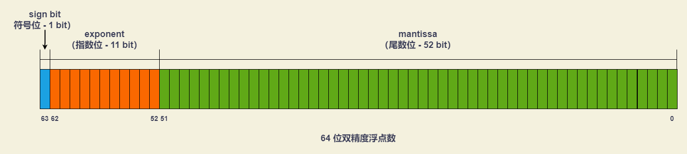

# 基础类型

## Undefined

一个没有被赋值的变量的类型是 `undefined`。如果方法或者是语句中操作的变量没有被赋值，则会返回 `undefined`。转为数值时为 `NaN`。

```javascript
// 变量声明了，但没有赋值
var foo
foo // undefined

// 对象没有赋值的属性
var obj = new Object()
obj.attr // undefined

// 调用函数时，应该提供的参数没有提供，该参数等于 undefined
function fun(a) {
  console.log(typeof a) // undefined
  return a
}
fun() // undefined

// 函数没有返回值时，默认返回 undefined
function fun() {}
fun() // undefined
```

## Null

`null` 值表示一个空对象指针，转为数值时为 `0`。

- 在定义将来要保存对象值的变量时，建议使用 `null` 来初始化，不要使用其他值。
- 调用函数时，某个参数未设置任何值，可以传入 `null`，表示该参数为空。

```javascript
typeof null // "object"
typeof undefined // "undefined"

null === undefined // false
null == undefined // true

null === null // true
null == null // true

!null //true
isNaN(1 + null) // false
isNaN(1 + undefined) // true
```

## Boolen

布尔值，取值仅能为 `true`（真）和 `false`（假）的数据类型。

```javascript
Boolean(undefined) // false
Boolean(null) // false
Boolean(0) // false
Boolean(-0) // false
Boolean(false) // false
Boolean(NaN) // false
Boolean('') // false

Boolean('false') // true
Boolean(3.14) // true
Boolean(true) // true
Boolean({}) // true
Boolean([]) // true
Boolean(new Boolean(false)) // true
Boolean(Symbol('foo')) // true
```

## Number

### 数值的编码

`Number` 是一种定义 64 位双精度浮点型的数字数据类型。



64 位浮点数是采用**科学计数法**来表示一个数字的格式：`(-1)^sign * 2^(exponent - 1023) * 1.mantissa`

- `sign bit`（符号位）决定了一个数的正负
- `exponent`（指数位）决定了数值的大小
- `mantissa`（尾数位）决定了数值的精度。

根据国际标准 IEEE 754，JavaScript 浮点数的 64 个二进制位，从最左边开始：

- `sign bit`（符号位）：第 1 位，表示整个数的正负值。`0` 表示正数，`1` 表示负数。
- `exponent`（指数位）：第 2 位到第 12 位（共 11 位），大小范围为 `[0 , 2047]`。

  科学计数法是可以表示大于 1 ，或者小于 1 的数（小数），即：**通过正负指数的值来标识显示**。

  由于指数位的 11 位不包括符号位，**为了达到正负的效果**，就引入了 **指数的偏移值**。
  
  指数具有**正负值 （来控制小数点左右移位）**，按照二进制中负数的规则（取反，补位），指数值为 `[0, 1023]` 区间内为正数，`[1024, 2047]` 内为负数（二进制中负数最高位为 1 ）。

  ```javascript
  // 为何负数是从 1024 开始？

  011 11111111 # 1023
  // 如果该二进制再继续增大，就进入了负数区域（最高位为 1）
  100 00000000 # 1024
  ```

  根据 IEEE 规范， 0 和 2047 两个最值需要做特殊用途，所以这里移除，所以整个规范的指数取值范围是： `[1, 2046]` 。

  引入指数的偏移值 `bias`（bias = 1023），可以是运算简单，则 `[-1022 + bias, 1023 + bias]` 等同于 `[1, 2046]`，抛去了符号位的影响，最终：1023 就变成了 0 ，1024 变成了 1。  

- `mantissa`（尾数位）：第 13 位到第 64 位（共 52 位），小数部分（即有效数字）。

  在科学计数法的显示下，分数部分（`fraction` ，也是 `mantissa` 部分之一）最高有效为是 `1` （个位数）

  ```javascript
  1000.001 (2)
  2^3 * 1.000001 (科学计数法标识)
  ```

  `mantissa` 会以 `000001` 来示意，会被规范成 `1.M` 格式 ，其中 `1` 会被隐藏掉，所以最大是表达 `53` 位的数（实际 `mantissa` 只有 `52` 位）

以下两种情况，JavaScript 会自动将数值转为科学计数法表示，其他情况都采用字面形式直接表示。

- 小数点前的数字多于 21 位
- 小数点后的零多于 5 个

```javascript
1234567890123456789012 // 1.2345678901234568e+21

0.0000003 // 3e-7
```

### 数值范围

根据国际标准 IEEE 754，64 位双精度浮点数 `exponent`（指数位）部分长度是 11 个二进制位，意味着指数位部分的最大值是 2047（2^11 - 1）。

通过科学计数法标识数值（通过正负指数的值来标识显示），由于指数位的 11 位不包括符号位，为了达到正负的效果，来控制小数点左右移位。按照二进制中负数的规则（取反，补位），指数值为 `[0, 1023]` 区间内为正数，`[1024, 2047]` 内为负数（二进制中负数最高位为 1 ）。

JavaScript 能够表示的数值范围为 `(2^1024, 2^-1023)`（开区间，不包含），超出这个范围的数无法表示。

- 正向溢出：如果一个数大于等于 `2^1024`，则会发生正向溢出。JavaScript 无法表示这么大的数，则会返回 `Infinity`。
- 负向溢出：如果一个数小于等于 `2^-1075` （指数部分最小值 -1023，再加上小数部分的 52 位），则会发生负向溢出。JavaScript 无法表示这么小的数，则会返回 `0`。

```javascript
Math.pow(2, 1024) // Infinity
Math.pow(2, -1075) // 0
```

### 数值的表示

使用字面量（literal）直接表示一个数值时，JavaScript 对整数提供了相关进制的表示方法：

- 十进制：没有前导 `0` 的数值。
- 八进制：有前缀 `0o` 或 `0O` 的数值，且只用到 `0-7` 的八个阿拉伯数字的数值。
- 十六进制：有前缀 `0x` 或 `0X` 的数值。
- 二进制：有前缀 `0b` 或 `0B` 的数值。

```javascript
123 // 十进制
0o377 // 八进制，255
0777 // 八进制（只用到 0-7 的八个阿拉伯数字的数值），511
0xff // 十六进制，255
0b11 // 二进制，3

0o88 // 八进制，报错，出现不属于该进制的数字
0xzz // 十六进制，报错，出现不属于该进制的数字
0b22 // 二进制，报错，出现不属于该进制的数字
```

ES2021，允许 JavaScript 的数值使用下划线（`_`）作为分隔符，小数和科学计数法也可以使用。使用时需注意：

- 不能放在数值的最前面（leading）或最后面（trailing）。
- 不能两个或两个以上的分隔符连在一起。
- 小数点的前后不能有分隔符。
- 科学计数法里面，表示指数的 `e` 或 `E` 前后不能有分隔符。
- 分隔符不能紧跟着进制的前缀 `0b`、`0B`、`0o`、`0O`、`0x`、`0X` 。
- 将字符串转成数值的函数，不支持数值分隔符。

```javascript
12345_00 === 1_234_500 // true
0b1010_0001_1000_0101 // 二进制
0xA0_B0_C0 // 十六进制
0.000_001 // 小数
1e10_000 // 科学计数法

Number('123_456') // NaN
parseInt('123_456') // 123

// 以下书写方式将会报错
3_.141
3._141
1_e12
1e_12
123__456
_1464301
1464301_
0_b111111000
0b_111111000
```

### 特殊数值

- 正零和负零

  JavaScript 的 64 位双精度浮点数之中，有一个二进制位是符号位，任何一个数都有一个对应的负值。

  在 JavaScript 内部存在 `+0` 和 `-0`，区别 64 位双精度浮点数表示法的符号位不同。

  注：`+0` 或 `-0` 当作分母时，返回的值是不相等的。

  ```javascript
  -0 === +0 // true
  0 === -0 // true
  0 === +0 // true

  +0 // 0
  -0 // 0
  (-0).toString() // '0'
  (+0).toString() // '0'

  (1 / +0) === (1 / -0) // false
  ```

- NaN

  `NaN` 表示非数字的值（Not a Number），用于表示本来要返回数值的操作失败了（而不是抛出错误）

  ```javascript
  5 - 'x' // NaN

  Math.acos(2) // NaN
  Math.log(-1) // NaN
  Math.sqrt(-1) // NaN

  0 / 0 // NaN

  typeof NaN // 'number'

  NaN === NaN // false
  [NaN].indexOf(NaN) // -1 。indexOf 方法内部使用的是严格相等运算符，所以该方法对 NaN 不成立
  Boolean(NaN) // false

  NaN + 32 // NaN
  NaN - 32 // NaN
  NaN * 32 // NaN
  NaN / 32 // NaN
  ```

- Infinity

  `Infinity` 是一个数值，表示无穷大。用来表示两种场景：

  - 一个正的数值太大，或一个负的数值太小，无法表示。
  - 非 0 数值除以 0，得到 `Infinity` 。

  `Infinity` 有正负之分，`Infinity` 表示正的无穷，`-Infinity` 表示负的无穷。

  `Infinity` 大于一切数值（除了 `NaN`），`-Infinity` 小于一切数值（除了 `NaN`）。

  ```javascript
  Math.pow(2, 1024) // Infinity，数值太大
  1 / 0 // Infinity，非 0 数值除以 0
  0 / 0 // NaN

  Infinity === -Infinity // false

  1 / -0 // -Infinity
  -1 / -0 // Infinity

  Infinity > 1000 // true
  -Infinity < -1000 // true

  Infinity > NaN // false
  Infinity < NaN // false

  -Infinity > NaN // false
  -Infinity < NaN // false

  5 * Infinity // Infinity
  5 - Infinity // -Infinity
  Infinity / 5 // Infinity
  5 / Infinity // 0

  0 * Infinity // NaN
  0 / Infinity // 0
  Infinity / 0 // Infinity

  Infinity + Infinity // Infinity
  Infinity * Infinity // Infinity
  Infinity - Infinity // NaN
  Infinity / Infinity // NaN

  null * Infinity // NaN
  null / Infinity // 0
  Infinity / null // Infinity

  undefined + Infinity // NaN
  undefined - Infinity // NaN
  undefined * Infinity // NaN
  undefined / Infinity // NaN
  Infinity / undefined // NaN
  ```

### Number 的相关属性

- `Number.EPSILON` ： 表示 1 与 Number 可表示的大于 1 的最小的浮点数之间的差值。值接近于 `2.2204460492503130808472633361816E-16` 或者 `2^-52`。

  ```javascript
  Math.abs(0.2 - 0.3 + 0.1) < Number.EPSILON // true

  // Polyfill
  if (Number.EPSILON === undefined) {
    Number.EPSILON = Math.pow(2, -52)
  }
  ```

- `Number.MAX_SAFE_INTEGER` ： 表示在 JavaScript 中最大的安全整数（`2^53 – 1` ，值为 `9007199254740991`）。

  ```javascript
  Number.MAX_SAFE_INTEGER // 9007199254740991
  Math.pow(2, 53) - 1 // 9007199254740991
  ```

- `Number.MAX_VALUE` ：表示在 JavaScript 里所能表示的最大数值。接近于 `1.79E+308`。大于 `MAX_VALUE` 的值代表 `"Infinity"`。

- `Number.MIN_SAFE_INTEGER` ： 代表在 JavaScript 中最小的安全的 integer 型数字 (`-(2^53 - 1)` ，值为 `-9007199254740991`)。

  ```javascript
  Number.MIN_SAFE_INTEGER // -9007199254740991
  -(Math.pow(2, 53) - 1) // -9007199254740991
  ```

- `Number.MIN_VALUE` ：表示在 JavaScript 中所能表示的最小（最接近 0）的正值。值约为 `5e-324`，小于 `MIN_VALUE` ("underflow values") 的值将会转换为 0。

- `Number.NaN` ：表示 “非数字”（Not-A-Number），和 `NaN` 相同。

- `Number.NEGATIVE_INFINITY` ：表示负无穷大。值和全局对象的 `Infinity` 属性的负值相同。

- `Number.POSITIVE_INFINITY` ：表示正无穷大。值同全局对象 `Infinity` 属性的值相同。

### Number 的相关方法

- `Number.parseInt(string, radix)` 方法：将其第一个参数转换为一个字符串，对该字符串进行解析，然后返回一个整数或 `NaN`。
  - `string` ：被解析的值。如果参数不是一个字符串，则将其转换为字符串 (使用 ToString 抽象操作)。
  - `radix` ：可选值，默认十进制。从 2 到 36 的整数，表示进制的基数。

  ```javascript
  // Number.parseInt 基本用法
  Number.parseInt('123') // 123
  Number.parseInt('   81') // 81，字符串头部有空格，空格会被自动去除
  Number.parseInt(1.23) // 1，如果不是字符串，则会先转为字符串再转换

  // 字符串转为整数，字符依次转换，如果遇到不能转为数字的字符，则不再转换去，返回已经转好的部分
  Number.parseInt('8a') // 8
  Number.parseInt('12**') // 12
  Number.parseInt('12.34') // 12
  Number.parseInt('15e2') // 15
  Number.parseInt('15px') // 15

  // 字符串的第一个字符不能转化为数字（后面跟着数字的正负号除外），返回 NaN
  Number.parseInt('abc') // NaN
  Number.parseInt('.3') // NaN
  Number.parseInt('') // NaN
  Number.parseInt('+') // NaN
  Number.parseInt('+1') // 1

  // 字符串以 0x 或 0X 开头，将其按照十六进制数解析
  Number.parseInt('0x10') // 16
  // 字符串以 0 开头，将其按照 10 进制解析
  Number.parseInt('011') // 11

  // 对于会自动转为科学计数法的数字，会将科学计数法的表示方法视为字符串
  Number.parseInt(1000000000000000000000.5) // 1，等同于 Number.parseInt('1e+21')
  Number.parseInt(0.0000008) // 8，等同于 Number.parseInt('8e-7')
  ```

  ```javascript
  // Number.parseInt 进制转换
  Number.parseInt('1000') // 1000，parseInt('1000', 10) 默认十进制
  Number.parseInt('1000', 2) // 8
  Number.parseInt('1000', 6) // 216
  Number.parseInt('1000', 8) // 512

  // Number.parseInt(string, radix) 中，如果 radix 参数不是数值，会被自动转为一个整数
  // 转换后的整数超出这个范围 2 到 36 之间，则返回 NaN
  // 如果 radix 为 0、undefined 和 null，则直接忽略
  Number.parseInt('10', 37) // NaN
  Number.parseInt('10', 1) // NaN
  Number.parseInt('10', 0) // 10
  Number.parseInt('10', null) // 10
  Number.parseInt('10', undefined) // 10

  // 如果字符串包含对于指定进制无意义的字符，则从最高位开始，只返回可以转换的数值
  // 如果最高位无法转换，则直接返回 NaN
  Number.parseInt('1546', 2) // 1，对于二进制而言，1 是有意义的字符，5、4、6都是无意义的字符
  Number.parseInt('546', 2) // NaN

  // 如果 Number.parseInt 的第一个参数不是字符串，会被先转为字符串
  Number.parseInt(0x11, 36) // 43
  // 等同于 Number.parseInt(String(0x11), 36)，即 Number.parseInt('17', 36)
  // 十六进制的 0x11 会被先转为十进制的 17，再转为字符串，再用三十六进制解读字符串17
  Number.parseInt(0x11, 2) // 1
  // 等同于 Number.parseInt(String(0x11), 2)，即 Number.parseInt('17', 2)
  // 十六进制的 0x11 会被先转为十进制的 17，再转为字符串，再用二进制解读字符串17

  Number.parseInt(011, 2) // NaN
  // 等同于 Number.parseInt(String(011), 2)，即 Number.parseInt(String(9), 2)
  // 011 会被先转为字符串 9，9 不是二进制的有效字符，所以返回 NaN
  ```

- `Number.parseFloat(string)` 方法：解析一个参数（必要时先转换为字符串）并返回一个浮点数。（注：如果给定值不能被转换成数值，则会返回 `NaN`。）

  ```javascript
  Number.parseFloat('3.14') // 3.14

  // 如果字符串符合科学计数法，则会进行相应的转换
  Number.parseFloat('314e-2') // 3.14
  Number.parseFloat('0.0314E+2') // 3.14

  // 字符串转为浮点数，字符依次转换，如果遇到不能转为数字的字符，则不再转换去，返回已经转好的部分
  Number.parseFloat('3.14more non-digit characters') // 3.14

  // parseFloat方法会自动过滤字符串前导的空格
  Number.parseFloat('\t\v\r12.34\n ') // 12.34

  // 如果参数不是字符串，则会先转为字符串再转换
  Number.parseFloat([1.23]) // 1.23，等同于 Number.parseFloat(String([1.23]))

  // 如果字符串的第一个字符不能转化为浮点数，则返回NaN
  Number.parseFloat([]) // NaN
  Number.parseFloat('FF2') // NaN
  Number.parseFloat('') // NaN

  // parseFloat的转换结果不同于Number函数

  Number.parseFloat(true)  // NaN
  Number(true) // 1

  Number.parseFloat(null) // NaN
  Number(null) // 0

  Number.parseFloat('') // NaN
  Number('') // 0

  Number.parseFloat('123.45#') // 123.45
  Number('123.45#') // NaN
  ```

- `Number.isNaN(value)` 方法：用来确定一个值是否为 `NaN` 。如果给定值为 `NaN` ，则返回值为 `true`；否则为 `false`。

  ```javascript
  Number.isNaN(NaN) // true
  Number.isNaN(123) // false

  // isNaN只对数值有效，如果传入其他值，会被先转成数值。
  // 传入字符串的时候，字符串会被先转成 NaN，所以最后返回 true
  Number.isNaN('Hello') // true，相当于 Number.isNaN(Number('Hello'))
  Number.isNaN({}) // true，等同于 Number.isNaN(Number({}))
  Number.isNaN(['xzy']) // true，等同于 Number.isNaN(Number(['xzy']))

  // 对于空数组和只有一个数值成员的数组，isNaN 返回 false
  Number.isNaN([]) // false
  Number.isNaN([123]) // false
  Number.isNaN(['123']) // false
  ```

  使用 `isNaN` 之前，最好判断一下数据类型

  ```javascript
  function isNaN(value) {
    return typeof value === 'number' && Number.isNaN(value);
  }
  ```

  判断 `NaN` 更可靠的方法是，利用 `NaN` 为唯一不等于自身的值的特点

  ```javascript
  function isNaN(value) {
    return value !== value;
  }
  ```

- `Number.isFinite(testValue)` 方法：用来判断被传入的参数值 `testValue` 是否为一个有限数值（finite number）

  - `Infinity`、`-Infinity`、`NaN` 和 `undefined` 会返回 `false`
  - 其他的数值都会返回 `true`

  ```js
  Number.isFinite(Infinity) // false
  Number.isFinite(-Infinity) // false
  Number.isFinite(NaN) // false
  Number.isFinite(undefined) // false
  Number.isFinite(null) // true
  Number.isFinite(-1) // true
  ```

- `Number.isInteger(value)` 方法：判断给定的参数是否为整数。如果被检测的值是整数，则返回 `true`，否则返回 `false`。注意 `NaN` 和正负 `Infinity` 不是整数。

  ```javascript
  Number.isInteger(0) // true
  Number.isInteger(1) // true
  Number.isInteger(-100000) // true

  Number.isInteger(0.1) // false
  Number.isInteger(Math.PI) // false

  // 如果参数不是数值，Number.isInteger 返回 false。
  Number.isInteger() // false
  Number.isInteger(null) // false
  Number.isInteger('10') // false
  Number.isInteger([1]) // false
  Number.isInteger(true) // false
  Number.isInteger(false) // false
  Number.isInteger(Infinity) // false
  Number.isInteger(-Infinity) // false

  // 由于 JavaScript 采用 IEEE 754 标准，数值存储为 64 位双精度格式，
  // 数值精度最多可以达到 53 个二进制位（1 个隐藏位与 52 个有效位）。
  // 如果数值的精度超过这个限度，第 54 位及后面的位就会被丢弃，Number.isInteger 可能会误判。
  Number.isInteger(3.0000000000000002) // true

  // 如果一个数值的绝对值小于 Number.MIN_VALUE（5E-324），
  // 即小于 JavaScript 能够分辨的最小值，会被自动转为 0。Number.isInteger 也会误判。
  Number.isInteger(5E-324) // false
  Number.isInteger(5E-325) // true ，5E-325 由于值太小，会被自动转为 0，返回true
  ```

- `Number.isSafeInteger(testValue)` 方法：判断传入的参数值是否是一个“安全整数”（safe integer）。
  
  一个安全整数是一个符合下面条件的整数：
  - 可以准确地表示为一个 IEEE-754 双精度数字，
  - 其 IEEE-754 表示不能是舍入任何其他整数以适应 IEEE-754 表示的结果。

  ```javascript
  Number.isSafeInteger(3) // true
  Number.isSafeInteger(1.2) // false
  Number.isSafeInteger(9007199254740990) // true
  Number.isSafeInteger(9007199254740992) // false

  Number.isSafeInteger(Number.MIN_SAFE_INTEGER) // true
  Number.isSafeInteger(Number.MIN_SAFE_INTEGER - 1) // false
  Number.isSafeInteger(Number.MAX_SAFE_INTEGER) // true
  Number.isSafeInteger(Number.MAX_SAFE_INTEGER + 1) // false

  Number.isSafeInteger('a') // false
  Number.isSafeInteger(null) // false
  Number.isSafeInteger(NaN) // false
  Number.isSafeInteger(Infinity) // false
  Number.isSafeInteger(-Infinity) // false
  ```

  验证运算结果是否落在安全整数的范围内，需要同时验证参与运算的每个值。

  ```javascript
  function trusty(left, right, result) {
    if (
      Number.isSafeInteger(left) &&
      Number.isSafeInteger(right) &&
      Number.isSafeInteger(result)
    ) {
      return result
    }
    throw new RangeError('Operation cannot be trusted!')
  }

  trusty(9007199254740993, 990, 9007199254740993 - 990)
  // RangeError: Operation cannot be trusted!

  trusty(1, 2, 3)
  // 3
  ```

- `numObj.toString([radix])` 方法：返回指定 `Number` 对象的字符串表示形式。
  - `radix` : 指定要用于数字到字符串的转换的基数 (从 2 到 36)。如果未指定 `radix` 参数，则默认值为 10。

  进行数字到字符串的转换时，建议用小括号将要转换的目标括起来，防止出错。

  ```javascript
  (12345).toString() // '12345'
  (12345.678).toString() // '12345.678'

  (123).toString(2) // '1111011'
  (245).toString(16) // 'f5'

  (-10).toString(2) // '-1010'
  (-0xff).toString(2) // '-11111111'
  ```

- `numObj.toFixed(digits)` 方法：使用定点表示法来格式化一个数值。
  - `digits` : 小数点后数字的个数，介于 `0` 到 `20`（包括）之间（实现环境可能支持更大范围）。如果忽略该参数，则默认为 `0`。

  ```javascript
  12345.6789.toFixed() // '12346' ：未设置 digits 参数，则默认为 0
  12345.6789.toFixed(1) // '12345.7' ：四舍五入
  12345.6789.toFixed(6) // '12345.678900' ： 使用 0 来填充小数部分
  (1.23e20).toFixed(2) // '123000000000000000000.00'

  // 数值大于 1e+21，方法会简单调用 Number.prototype.toString() 并返回一个指数记数法格式的字符串。
  (1.1e21).toFixed(4) // '1.1e+21'

  -(2.34).toFixed(1) // -2.3 ：由于操作符优先级，负数不会返回字符串
  (-2.34).toFixed(1) // '-2.3' ： 使用括号提高优先级，则返回字符串
  ```

- `numObj.toPrecision(precision)` 方法：以定点表示法或指数表示法表示的一个数值对象的字符串表示，四舍五入到 `precision` 参数指定的显示数字位数（1 - 100 之间）。

  ```javascript
  5.123456.toPrecision() // '5.123456'
  5.123456.toPrecision(1) // '5'
  5.123456.toPrecision(5) // '5.1235'

  0.000123.toPrecision(1) // '0.0001'
  0.000123.toPrecision(5) // '0.00012300'

  // 在某些情况下可能会返回科学计数法字符串
  1234.5.toPrecision(2) // '1.2e+3'
  ```

- `numObj.toExponential(fractionDigits)` 方法：以指数表示法返回该数值字符串表示形式。
  - `fractionDigits` : 可选值。一个整数，用来指定小数点后有几位数字，小数点后以 `fractionDigits` 提供的值来四舍五入。默认情况下用尽可能多的位数来显示数字。

  ```javascript
  77.12345.toExponential() // '7.712345e+1'
  77.12345.toExponential(0) // '8e+1'
  77.12345.toExponential(1) // '7.7e+1'
  77.12345.toExponential(5) // '7.71235e+1'
  77.12345.toExponential(6) // '7.712345e+1'
  77.12345.toExponential(7) // '7.7123450e+1'

  // 数值没有小数点和指数时
  // 方法一：应该在该数值与该方法之间隔开一个空格，以避免点号被解释为一个小数点。
  // 方法二：可以使用两个点号调用该方法。
  77 .toExponential() // '7.7e+1'
  (77).toExponential() // '7.7e+1'
  ```

- `toLocaleString(locales, options)` 方法：返回这个数字在特定语言环境下的表示字符串。在使用具有 `Intl.NumberFormat API` 支持的实现时，此方法仅仅简单调用了 `Intl.NumberFormat`。
  - `locales` ：可选值。缩写语言代码（BCP 47 language tag）的字符串或者这些字符串组成的数组。与 `Intl.NumberFormat()` 构造函数的 `locales` (en-US) 参数相同。
  - `options` ：可选值。调整输出格式的对象。与 `Intl.NumberFormat()` 构造函数的 `options` (en-US) 参数相同。

  ```javascript
  123456.789.toLocaleString() // '123,456.789'

  // nu 扩展字段要求编号系统，e.g. 中文十进制
  123456.789.toLocaleString("zh-Hans-CN-u-nu-hanidec") // '一二三,四五六.七八九'
  // 当请求不支持的语言时，例如巴厘语，加入一个备用语言，比如印尼语
  123456.789.toLocaleString(["ban", "id"]) // '123.456,789'

  123456.789.toLocaleString("de-DE", { style: "currency", currency: "EUR" }) // '123.456,79 €'

  // 使用带选项的主机默认语言进行数字格式化
  123456.789.toLocaleString(undefined, {
    minimumFractionDigits: 2,
    maximumFractionDigits: 2,
  })
  // "30,000.65" 英语为默认语言
  // "30.000,65" 德语为默认语言
  // "30 000,65" 法语为默认语言
  ```

### 数值精度相关问题

- `0.1 + 0.2 !== 0.3`

  ```javascript
  0.0001100110011001100110011001100110011001100110011001101 // 0.1 二进制
  0.001100110011001100110011001100110011001100110011001101 // 0.2 二进制

  0.0100110011001100110011001100110011001100110011001100111 // 0.1 + 0.3 = 0.30000000000000004
  0.010011001100110011001100110011001100110011001100110011 // 0.3 二进制
  ```

  类似的计算有：

  - `0.075.toFixed(2) === 0.08` 返回为 `false`
  - `0.075 * 3 === 0.22499999999999998` 返回为 `true`

  浮点数运算的精度问题导致等式左右的结果并不是严格相等，而是相差了个微小的值。

  实际上，这里错误的不是结论，而是比较的方法。正确的比较方法是使用 JavaScript 提供的最小精度值：`Math.abs(0.1 + 0.2 - 0.3) <= Number.EPSILON`

- 小数转换二进制进位

  ```javascript
  1.1.toString(2) // 1.000110011001100110011001100110011001100110011001101
  1.1.toString(2).length // 53

  0.1.toString(2) // 0.0001100110011001100110011001100110011001100110011001101
  0.1.toString(2).length // 57
  ```

## BigInt

### BigInt 基本使用

`BigInt` 提供了一种方法来表示大于 `2^53 - 1` 的整数，可以表示任意大的整数。可以用在一个整数字面量后面加 `n` 的方式定义一个 `BigInt`，或者调用函数 `BigInt()`，并传递一个整数值或字符串值。

- 不能用于 `Math` 对象中的方法
- 不能和任何 `Number` 实例混合运算，两者必须转换成同一种类型。`BigInt` 变量在转换成 `Number` 变量可能会丢失精度。

```javascript
const theBiggestInt = 9007199254740991n
const alsoHuge = BigInt(9007199254740991) // 9007199254740991n
const hugeString = BigInt("9007199254740991") // 9007199254740991n
const hugeHex = BigInt("0x1fffffffffffff") // 9007199254740991n
const hugeBin = BigInt("0b11111111111111111111111111111111111111111111111111111") // 9007199254740991n

typeof 1n === 'bigint' // true
typeof BigInt('1') === 'bigint' // true
typeof Object(1n) === 'object' // true ： 使用 Object 包装后， BigInt 被认为是一个普通 'object' 

// BigInt 与字符串混合运算时，会先转为字符串，再进行运算
'' + 123n // '123'
```

```javascript
// BigInt 和 Number 不是严格相等的，但是宽松相等的
0n === 0 // false
0n == 0 // true

// BigInt 和 Number 进行比较
0n < 1 // true
1n < 2 // true
2n > 1 // true
2n > 2 // false
2n >= 2 // true
2 > 2 // false

// BigInt 和 Boolean 进行比较
0n < true // true
0n == false // true

0n === Object(0n); // false
Object(0n) === Object(0n); // false

Boolean(0n) // false
0n || 12n // 12n
!12n // false
!0n // true

// Object 包装的 BigInt 使用 object 的比较规则进行比较，只用同一个对象在比较时才会相等
const o = Object(0n);
o === o // true

// BigInt 和 Number 混在一个数组内并排序
const mixed = [4n, 6, -12n, 10, 4, 0, 0n] // [4n, 6, -12n, 10, 4, 0, 0n]
mixed.sort() // [-12n, 0, 0n, 10, 4n, 4, 6]
```

BigInt 类型的 `+`、`-`、`*` 和 `**` 四个二元运算符，与 `Number` 类型的行为一致。除法运算 `/` 会舍去小数部分，返回一个整数。几乎所有的数值运算符都可以用在 `BigIn`t，但是有两个例外：

- 不带符号的右移位运算符 `>>>` 。`BigInt` 总是带有符号的，导致该运算无意义，完全等同于右移运算符 `>>` 。
- 一元的求正运算符 `+` 。一元运算符 `+` 在 asm.js 里面总是返回 `Number` 类型，为了不破坏 asm.js 就规定 `+1n` 会报错。

```javascript
1n + 1n // 2n
1n - 1n // 0n
1n * 2n // 2n
2n ** 2n // 4n
9n / 5n // 1n

1n + 1.3 // 报错：Uncaught TypeError: Cannot mix BigInt and other types, use explicit conversions
1n | 0 // 报错：Uncaught TypeError: Cannot mix BigInt and other types, use explicit conversions

Math.sqrt(4n) // 报错：Uncaught TypeError: Cannot convert a BigInt value to a number
Math.sqrt(Number(4n)) // 2 ，正确的写法
```

### BigInt 的相关方法

- `BigInt.asIntN(width, bigint)` 方法：将 `BigInt` 值转换为一个 `-2^(width-1)` 与 `2^(width-1)-1` 之间的有符号整数。
  - `width` ：可存储整数的位数
  - `bigint` ：要存储在指定位数上的整数

  ```javascript
  const max = 2n ** (64n - 1n) - 1n

  BigInt.asIntN(64, max) // 9223372036854775807n
  BigInt.asIntN(64, max + 1n) // -9223372036854775808n
  ```

- `BigInt.asUintN(width, bigint)` 方法：将 `BigInt` 转换为一个 `0` 和 `2^width-1` 之间的无符号整数。
  - `width` ：可存储整数的位数
  - `bigint` ：要存储在指定位数上的整数

  ```javascript
  const max = 2n ** 64n - 1n

  BigInt.asUintN(64, max) // 18446744073709551615n
  BigInt.asUintN(64, max + 1n) // 0n
  ```

## String

### String 简介

`String` 数据类型表示零或多个 16 位 Unicode 字符序列。可以使用双引号（ " ）、单引号（ ' ）或反引号（ ` ）

```javascript
'abc'
"abc"
'key = "value"' // 单引号字符串的内部，可以使用双引号

// 单引号（双引号）字符串的内部，使用单引号（双引号）需在前面加上反斜杠，用来转义
'Did she say \'Hello\'?'
"Did she say \"Hello\"?"
```

字符串 `length` 属性返回字符串的长度，该属性也是无法改变的，但也不会报错。

```javascript
var str = 'hello'
str.length // 5

str.length = 3
str.length // 5
```

字符串可以被视为字符数组，可使用数组的方括号运算符，用来返回某个位置的字符（位置编号从 `0` 开始）

```javascript
var str = 'hello'
str[0] // "h"
str[1] // "e"
str[4] // "o"

// 数组的方括号中，如果数字超过字符串的长度或不是数字，则返回 undefined
'hello'[1] // "e"
'hello'[5] // undefined
'hello'[-1] // undefined
'hello'['x'] // undefined

// 无法通过数组的方括号改变字符串之中的单个字符
var str = 'hello'
delete str[0]
str // "hello"
str[1] = 'a'
str // "hello"
```

### 字符转义

转义符（`\`，反斜杠）用于表示一些特殊字符

- `\0` ：null（`\u0000`）
- `\b` ：后退键（`\u0008`）
- `\f` ：换页符（`\u000C`）
- `\n` ：换行符（`\u000A`）
- `\r` ：回车键（`\u000D`）
- `\t` ：制表符（`\u0009`）
- `\v` ：垂直制表符（`\u000B`）
- `\'` ：单引号（`\u0027`）
- `\"` ：双引号（`\u0022`）
- `\\` ：反斜杠（`\u005C`）
- `\HHH` ：其中 `HHH` 是 `000` 到 `377` 范围内的 3 个八进制数。比如 `\251` 表示版权符号。
- `\xHH` ：其中 `HH` 是 `00` 到 `FF` 范围内的 2 个十六进制数字。比如 `\xA9` 表示版权符号。
- `\uXXXX` ：其中 `XXXX` 是 `0000` 到 `FFFF` 范围内的 4 个十六进制数字。比如 `\u00A9` 表示版权符号。
- `\u{X} ... \u{XXXXXX}` ：其中 `X` ... `XXXXXX` 是 `0` 到 `10FFFF` 范围内的 1 - 6 个十六进制数字。比如 `\u{A}` 与 `\n`（换行符）相同； `\u{21}` 是 `!` 。

```javascript
'\a' // "a"，非特殊字符前面使用反斜杠，则反斜杠会被省略
"Prev \\ Next" // "Prev \ Next"，反斜杠前加反斜杠，用来对自身转义

'\251' // "©"
'\xA9' // "©"
'\u00A9' // "©"

'\u{A}' // '\n'
'\u{21}' // !
'\u{20BB7}' // "𠮷"
'\u{41}\u{42}\u{43}' // "ABC"

'\z' === 'z'  // true
'\172' === 'z' // true
'\x7A' === 'z' // true
'\u007A' === 'z' // true
'\u{7A}' === 'z' // true
```

### 模板字符量

模板字面量是用反引号（`）分隔的字面量，允许多行字符串、带嵌入表达式的字符串插值和带标签的模板的特殊结构。

- 多行字符串：模板字面量会保持反引号内部的空格。

  ```javascript
  let templateLiterals = `
    first line
    second line
  `
  ```

- 字符串插值：通过使用占位符 `${expression}` 嵌入待替换的表达式。

  ```javascript
  const a = 5
  const b = 10
  const templateLiterals = `${a} + ${b} = ${a + b}`
  console.log(templateLiterals) // 5 + 10 = 15

  // 嵌套模板字面量
  const nestedTemplateLiterals = `header ${
    isLargeScreen() ? "" : `icon-${item.isCollapsed ? "expander" : "collapser"}`
  }`
  ```

- 带标签的模板（标签函数）：允许使用函数解析模板字面量。

  标签函数接收到的参数依次是原始字符串数组和对每个表达式求值的结果。

  ```javascript
  function simpleTag(strings, aValExpression, bValExpression, sumExpression) {
    console.log('strings : ', strings);
    console.log('aValExpression : ', aValExpression);
    console.log('bValExpression : ', bValExpression);
    console.log('sumExpression : ', sumExpression);
    return 'foobar';
  }

  function zipTag(strings, ...expressions) {
    return (
      strings[0] + expressions.map((e, i) => `${e}${strings[i + 1]}`).join('')
    )
  }

  let a = 6
  let b = 9

  simpleTag`${a} + ${b} = ${a + b}` // 返回 'foobar'
  // strings : [ '', ' + ', ' = ', '' ]
  // aValExpression : 6
  // bValExpression : 9
  // sumExpression : 15

  zipTag`${a} + ${b} = ${a + b}` // "6 + 9 = 15"
  ```

  在标签函数的第一个参数中，存在一个特殊的属性 `raw`，可以通过它来访问模板字符串的原始字符串，而无需转义特殊字符。

  ```javascript
  function tag(strings) {
    console.log(strings.raw[0])
  }

  tag`string text line 1 \n string text line 2`
  // string text line 1 \n string text line 2

  // 使用 String.raw() 方法创建原始字符串和使用默认模板函数和字符串连接创建是一样的。
  let str = String.raw`Hi\n${2+3}!` // "Hi\\n5!"
  ```

- 原始字符串

  使用默认的 `String.raw` 标签函数，可以直接获取原始的模板字面量内容（如换行符或 Unicode 字符），而不是被转换后的字符表示。

  ```javascript
  console.log(`\u00A9`) // ©
  console.log(String.raw`\u00A9`) // \u00A9

  console.log(`first line\nsecond line`)
  // first line 
  // second line
  console.log(String.raw`first line\nsecond line`)
  // first line\nsecond line
  ```

### 字符集（Unicode）

JavaScript 使用 Unicode 字符集。

JavaScript 引擎内部，所有字符都用 Unicode 表示。解析代码的时候，JavaScript 会自动识别一个字符是字面形式表示，还是 Unicode 形式表示。输出给用户的时候，所有字符都会转成字面形式。

```javascript
var f\u006F\u006F = 'abc' // foo 是 Unicode 形式表示
foo // "abc" ，foo 使用字面形式表示。JavaScript 会自动识别
```

每个字符在 JavaScript 内部都是以16位（即2个字节）的 UTF-16 格式储存。UTF-16 有两种长度：

- 对于码点在 `U+0000` 到 `U+FFFF` 之间的字符，长度为 16 位（即 2 个字节），JavaScript 认为是一个字符（`length` 属性为 1）。
- 对于码点在 `U+10000` 到 `U+10FFFF` 之间的字符，长度为 32 位（即 4 个字节），JavaScript 认为是两个字符（`length` 属性为 2）。

### Base64 转码

Base64 是一种编码方法，可以将任意值转成 `0-9`、`A-Z`、`a-z`、`+` 和 `/` 64 个字符组成的可打印字符。主要用于：

- ASCII 码 `0` 到 `31` 的符号都无法打印出来，可以使用 Base64 编码
- 以文本格式传递二进制数据，可以使用 Base64 编码
- 对二进制数据进行编码，可以使用 Base64 编码

在 JavaScript 中，有两个函数被分别用来处理解码和编码 Base64 字符串：

- `btoa()`：从二进制数据 “字符串” 创建一个 Base-64 编码的 ASCII 字符串
- `atob()`：解码 Base-64 编码的字符串数据

```javascript
var string = 'Hello World!';
btoa(string) // "SGVsbG8gV29ybGQh"
atob('SGVsbG8gV29ybGQh') // "Hello World!"

btoa('你好') // 报错，不适合非 ASCII 码的字符

// 将非 ASCII 码字符转为 Base64 编码，可先进行转码

function base64Encode(str) {
  return btoa(encodeURIComponent(str));
}

function base64Decode(str) {
  return decodeURIComponent(atob(str));
}

base64Encode('你好') // "JUU0JUJEJUEwJUU1JUE1JUJE"
base64Decode('JUU0JUJEJUEwJUU1JUE1JUJE') // "你好"
```

### String 的相关方法

#### 遍历字符串

- 字符串遍历：使用 `for...of` / `for...in` / 手动迭代进行字符串遍历

  ```javascript
  let str = 'abcdef'

  console.log([...str])
  // [ 'a', 'b', 'c', 'd', 'e', 'f' ]

  // 使用 for...of 循环进行迭代
  for (let val of str) {
    console.log(val)
  }
  // a b c d e f

  // 使用 for...in 循环进行迭代
  for (let key in str) {
    console.log(str[key])
  }
  // a b c d e f

  // 手动迭代：手动调用返回的迭代器对象的 next() 方法
  const strIter = str[Symbol.iterator]()
  console.log(strIter.next().value) // a
  console.log(strIter.next().value) // b
  ```

- `str.toString()` 方法：返回一个字符串。对于 `String` 对象，`toString()` 方法返回一个字符串来表示这个对象，和 `String.prototype.valueOf()` 方法的返回值相同。

  ```javascript
  const x = new String('Hello world')
  x.toString() // 'Hello world'
  ```

#### 字符串查找与匹配

- `str.match(regexp)` 方法：检索字符串与正则表达式进行匹配的结果，返回一个 `Array`，其内容取决于是否存在全局（`g`）标志，如果没有匹配，则返回 `null` 。
  - 如果 `regexp` 不是 `RegExp` 对象并且对象上无 `Symbol.match` 方法，则会使用 `new RegExp(regexp)` 将其隐式地转换为 `RegExp` 对象。
  - 如果 `regexp` 使用 `g` 标志，则将返回与完整正则表达式匹配的所有结果，但不会返回捕获组。
  - 如果 `regexp` 没有使用 `g` 标志，则只返回第一个完整匹配及其相关捕获组。
  - 如果 `regexp` 为空，直接使用 `str.match()` 方法，会得到一个包含空字符串的数组，等价于 `match(/(?:)/)` 。

  ```javascript
  const str1 = 'see Chapter 3.4.5.1'

  str1.match()
  // 输出为 : ['', index: 0, input: 'see Chapter 3.4.5.1', groups: undefined]
  str1.match(/chapter \d+(\.\d)*/i)
  // 输出为 : ['Chapter 3.4.5.1', '.1', index: 4, input: 'see Chapter 3.4.5.1', groups: undefined]
  str1.match(/see (chapter \d+(\.\d)*)/gi)
  // 输出为 : ['see Chapter 3.4.5.1']

  // 将 '3.4.5.1' 捕获到一个名为 Chapter 的组中
  const chapterMatch = str1.match(/(?<Chapter>\d+(\.\d)*)/)
  chapterMatch.groups // { Chapter: '3.4.5.1' }

  // 当 regexp 参数是一个字符串或一个数字时，
  // 会使用 new RegExp(regexp) 来隐式转换成一个 RegExp。
  const str2 = 'NaN 表示不是一个数字。Infinity 包括了 -Infinity 和 +Infinity。'
  str2.match('NaN')
  // 输出为 : ['NaN', index: 0, input: 'NaN 表示不是一个数字。Infinity 包括了 -Infinity 和 +Infinity。', groups: undefined]
  str2.match(null)
  // 输出为 : null

  // 特殊字符没有被正确转义，这可能会导致意想不到的结果
  "123".match("1.3")
  // 输出为 : ['123', index: 0, input: '123', groups: undefined]
  ```

- `str.matchAll(regexp)` 方法：返回一个迭代器，该迭代器包含了检索字符串与正则表达式进行匹配的所有结果（包括捕获组）。
  - 如果 `regexp` 不是 `RegExp` 对象并且对象上无 `Symbol.matchAll` 方法，则会使用 `new RegExp(regexp, 'g')` 将其隐式地转换为 `RegExp` 对象。
  - 如果 `regexp` 是一个正则表达式，那么它必须设置了全局（`g`）标志，否则会抛出 `TypeError` 异常。

  ```javascript
  const str = 'table football, foosball'
  const matches = str.matchAll(/foo[a-z]*/g)
  const arr = [...matches]
  arr[0] // ['football', index: 6, input: 'table football, foosball', groups: undefined]
  arr[1] // ['foosball', index: 16, input: 'table football, foosball', groups: undefined]
  ```

- `str.search(regexp)` 方法：返回正则表达式 `regexp` 在字符串中首次匹配项的索引，未匹配到则返回 `-1` 。如果传入一个非正则表达式对象 `regexp`，则会使用 `new RegExp(regexp)` 隐式地将其转换为正则表达式对象。

  ```javascript
  let str = 'hey JudE'
  str.search(/[A-Z]/g) // 4
  str.search(/[.]/g) // -1
  str.search('JudE') // 4
  ```

- `str.includes(searchString, position)` 方法：确定是否可以在一个字符串中找到另一个字符串（区分大小写），并根据情况返回 `true` 或 `false`。
  - `searchString` ：要在 `str` 中搜索的字符串。
    - 不能是正则表达式，非正则表达式的值都会被强制转换为字符串。
    - 该参数被省略或传入 `undefined`，则会在字符串中搜索 `"undefined"`
  - `position` ：可选值。在字符串中开始搜索 `searchString` 的位置（默认为 `0`）。

  ```javascript
  'Blue Whale'.includes('blue') // false : 区分大小写

  // 可以通过将原字符串和搜索字符串全部转换为小写来解决区分大小写的约束
  'Blue Whale'.toLowerCase().includes('blue') // true

  const str = 'To be, or not to be, that is the question.'
  str.includes('To be') // true
  str.includes('To be', 1) // false
  ```

- `str.indexOf(searchString, position)` 方法：在字符串中搜索指定子字符串（区分大小写），并返回其**第一次**出现的位置索引。如果没有找到，则返回 `-1`。
  - `searchString` ：要在 `str` 中搜索的字符串。
    - 所有的值都会被强制转换为字符串。
    - 该参数被省略或传入 `undefined`，则会在字符串中搜索 `"undefined"`
  - `position` ：可选值。指定子字符串在大于或等于 `position` 位置的第一次出现的索引，默认为 `0`。
    - 如果 `position` 大于调用字符串的长度，则不会搜索调用字符串。
    - 如果 `position` 小于 `0`，等同于 `position` 为 `0`。

  ```javascript
  'hello world'.indexOf('Hello') // -1 ：区分大小写

  'hello world'.indexOf('hello') // 0
  'hello world'.indexOf('hello', 0) // 0
  'hello world'.indexOf('world', 6) // 6
  'hello world'.indexOf('world', 7) // -1

  // 搜索空字符串时
  // > 如果没有第二个参数，或者第二个参数的值小于调用字符串的长度，则返回值与第二个参数的值相同
  // > 如果第二个参数的值大于或等于字符串的长度，则返回值是字符串的长度
  'hello world'.indexOf('') // 0
  'hello world'.indexOf('', 0) // 0
  'hello world'.indexOf('', 8) // 8
  'hello world'.indexOf('', 11) // 11
  'hello world'.indexOf('', 13) // 11
  ```

- `str.lastIndexOf(searchString, position)` 方法：在字符串中搜索指定子字符串（区分大小写），并返回其**最后一次**出现的位置索引。如果没有找到，则返回 `-1`。
  - `searchString` ：要在 `str` 中搜索的字符串。
    - 所有的值都会被强制转换为字符串。
    - 该参数被省略或传入 `undefined`，则会在字符串中搜索 `"undefined"` 。
  - `position` ：可选值。指定子字符串在大于或等于 `position` 位置的最后一次出现的索引，默认为 `+Infinity`。
    - 如果 `position` 大于调用字符串的长度，则搜索整个字符串。
    - 如果 `position` 小于 `0`，等同于 `position` 为 `0`，即该方法只在索引 `0` 处查找指定的子字符串。

  ```javascript
  'hello world, hello'.lastIndexOf('Hello') // -1 ：区分大小写

  'hello world, hello'.lastIndexOf('hello') // 13
  'hello world, hello'.lastIndexOf('hello', 0) // 0 ：在索引 0 处查找 hello
  'hello world, hello'.lastIndexOf('hello', 20) // 13
  'hello world, hello'.lastIndexOf('hello', -5) // 0 ：在索引 0 处查找 hello

  // 搜索空字符串时
  // > 如果没有第二个参数，或者第二个参数的值小于调用字符串的长度，则返回值与第二个参数的值相同
  // > 如果第二个参数的值大于或等于字符串的长度，则返回值是字符串的长度
  'hello world, hello'.lastIndexOf('') // 18
  'hello world, hello'.lastIndexOf('', 0) // 0
  'hello world, hello'.lastIndexOf('', 8) // 8
  'hello world, hello'.lastIndexOf('', 18) // 18
  'hello world, hello'.lastIndexOf('', 20) // 18
  ```

- `str.startsWith(searchString[, position])` 方法：用于判断一个字符串是否以指定字符串开始。是则返回 `true`，否则返回 `false` 。
  - `searchString` ：以搜索的作为结尾的字符串。
    - 不能是正则表达式，非正则表达式的值都会被强制转换为字符串。
    - 该参数被省略或传入 `undefined`，则会在字符串中搜索 `"undefined"`
  - `position` ：可选值。预期找到 `searchString` 的开始位置（即 `searchString` 最后一个字符的索引加 1）。默认为 `str.length` 。

  ```javascript
  const str = 'abcdefg'

  str.startsWith('abc') // true
  str.startsWith('cde') // false
  str.startsWith('efg', 4) // true
  str.startsWith(undefined) // false

  str.startsWith(/abc/) // Uncaught TypeError: First argument to String.prototype.startsWith must not be a regular expression
  ```

- `str.endsWith(searchString[, position])` 方法：用于判断一个字符串是否以指定字符串结尾。是则返回 `true`，否则返回 `false` 。
  - `searchString` ：以搜索的作为结尾的字符串。
    - 不能是正则表达式，非正则表达式的值都会被强制转换为字符串。
    - 该参数被省略或传入 `undefined`，则会在字符串中搜索 `"undefined"`
  - `position` ：可选值。预期找到 `searchString` 的末尾位置（即 `searchString` 最后一个字符的索引加 1）。默认为 `str.length` 。

  ```javascript
  const str = 'abcdefg'

  str.endsWith('efg') // true
  str.endsWith('cde') // false
  str.endsWith('cde', 5) // true
  str.endsWith(undefined) // false

  str.endsWith(/abc/) // Uncaught TypeError: First argument to String.prototype.endsWith must not be a regular expression
  ```

#### 字符串拼接与补充

- `str.concat(str1, str2, /* …, */ strN)` 方法：将字符串参数连接到调用的字符串，并返回一个新的字符串。
  - 对原字符串或返回的字符串所做的更改，不会影响另一个字符串。
  - 如果参数不是字符串类型，会将其参数强制转换为字符串进行连接。而加号运算符（`+`）首先将其操作数强制转换为原始值，然后再进行连接。

  ```javascript
  let str = 'abcdef'
  str.concat('ghijkl', 'mnopqr') // abcdefghijklmnopqr

  ''.concat(...['abcdef', 'ghijkl', 'mnopqr']) // abcdefghijklmnopqr
  ''.concat({}) // '[object Object]'
  ''.concat([]) // ''
  ''.concat(null) // 'null'
  ''.concat(true) // 'true'
  ''.concat(4, 5) // '45'
  ```

- `str.repeat(count)` 方法：返回指定字符串的指定数量 `count` （介于 `0` 和 `+Infinity` 之间的整数）副本的新字符串。

  ```javascript
  'abc'.repeat(0) // ''
  'abc'.repeat(1) // 'abc'
  'abc'.repeat(2) // 'abcabc'
  'abc'.repeat(3.5) // 'abcabcabc' （ count 将被转换为整数 ）

  ({ toString: () => 'abc', repeat: String.prototype.repeat }).repeat(2)
  // 'abcabc' （ repeat() 是一个通用方法 ）

  'abc'.repeat(-1) // Uncaught RangeError: Invalid count value: -1
  'abc'.repeat(1 / 0) // Uncaught RangeError: Invalid count value: Infinity
  ```

- `str.padStart(targetLength, padString)` 方法：从当前字符串**开头开始填充**给定的字符串（如果需要会重复填充），直到达到给定的长度。
  - `targetLength`：当前 `str` 填充后的长度。如果该值小于或等于 `str.length`，则会直接返回当前 `str`。
  - `padString` ：可选值，默认值为 `''` （`U+0020`）。用于填充当前 `str` 的字符串。 如果 `padString` 太长，无法适应 `targetLength`，则会被截断：
    - 对于从左到右的语言，左侧的部分将会被保留；
    - 对于从右到左的语言，右侧的部分将会被保留。

  ```javascript
  'abc'.padStart(10) // '       abc'
  'abc'.padStart(10, 'foo') // 'foofoofabc'
  'abc'.padStart(6, '123465') // '123abc'
  'abc'.padStart(8, '0') // '00000abc'
  'abc'.padStart(1) // 'abc'
  ```

- `str.padEnd(targetLength, padString)` 方法：从当前字符串**末尾开始填充**给定的字符串（如果需要会重复填充），直到达到给定的长度。
  - `targetLength`：当前 `str` 填充后的长度。如果该值小于或等于 `str.length`，则会直接返回当前 `str`。
  - `padString` ：可选值，默认值为 `''` （`U+0020`）。用于填充当前 `str` 的字符串。 如果 `padString` 太长，无法适应 `targetLength`，则会被截断：
    - 对于从左到右的语言，左侧的部分将会被保留；
    - 对于从右到左的语言，右侧的部分将会被保留。

  ```javascript
  'abc'.padEnd(10) // 'abc       '
  'abc'.padEnd(10, 'foo') // 'abcfoofoof'
  'abc'.padEnd(6, '123456') // 'abc123'
  'abc'.padEnd(1) // 'abc'
  ```

#### 获取指定位置字符与码元值

- `str.at(index)` 方法：返回位于指定位置 `index` （允许正整数和负整数） 的单个 UTF-16 码元组成的新的 `String` 。
  - 如果 `index` 为负整数时，返回字符从字符串末端开始倒数。
  - 如果找不到指定的索引，则返回 `undefined` 。

  ```javascript
  let str = 'abcdef'

  str.at(-7) // undefined
  str.at(-6) // 'a'
  str.at(-1) // 'f'
  str.at(0) // 'a'
  str.at(1) // 'b'
  str.at(6) // undefined
  ```

- `str.charAt(index)` 方法：返回一个由给定索引 `index` 处的单个 UTF-16 码元构成的新字符串。
  - 如果 `index` 超出了 `[0, str.length - 1]` （闭区间）的范围，返回一个空字符串。
  - 如果 `index` 不是一个数值，会被转换为 `0` 。

  Unicode 码位的范围从 `0` (`0x0000`) 到 `1114111` (`0x10FFFF`)。`charAt()` 方法返回一个其值小于 `65536` (`0xFFFF`) 的字符，更高的码位是由一对 16 位代理伪字符表示的。为了获取值大于 `65536` (`0xFFFF`) 的完整字符，需检索 `charAt(i)` 以及 `charAt(i + 1)` （类似于操作一个由两个字符组成的字符串一样），或者使用 `codePointAt(i)` 和 `String.fromCodePoint()` 代替。

  ```javascript
  let str = 'abcdef'

  str.charAt(-1) // ''
  str.charAt(0) // 'a'
  str.charAt(5) // 'f'
  str.charAt(6) // ''

  str.charAt(undefined) // 'a'
  str.charAt(null) // 'a'
  str.charAt({}) // 'a'
  ```

- `str.charCodeAt(index)` 方法：返回一个由给定索引 `index` 处的 UTF-16 编码单元的数字（即：`0` (`0x0000`) 到 `65535` (`0xFFFF`) 之间的 Unicode 编码点值）。
  - 如果 `index` 超出了 `[0, str.length - 1]` （闭区间）的范围，返回 `NaN`。
  - 如果 `index` 不是一个数值，会被转换为 `0` 。

  UTF-16 编码单元匹配能用一个 UTF-16 编码单元表示的 Unicode 码点。如果 Unicode 码点不能用一个 UTF-16 编码单元表示（其值大于 `65535` (`0xFFFF`)），则返回的编码单元回事这个码点代理对的第一个编码单元。

  ```javascript
  let str = 'abcdef'

  str.charCodeAt(-1) // NaN
  str.charCodeAt(0) // 97 : 'a'
  str.charCodeAt(5) // 102 : 'f'
  str.charCodeAt(6) // NaN

  str.charCodeAt(undefined) // 97 : 'a'
  str.charCodeAt(null) // 97 : 'a'
  str.charCodeAt({}) // 97 : 'a'
  ```

- `str.codePointAt(index)` 方法：返回一个由给定索引 `index` 处的 Unicode 编码点值的非负整数。
  - 如果 `index` 超出了 `[0, str.length - 1]` （闭区间）的范围，则返回 `undefined`。
  - 如果 `index` 不是一个数值，会被转换为 `0` 。
  - 如果在索引处开始没有 UTF-16 代理对，将直接返回在索引处 `index` 的编码单元。

  在 JavaScript 中，字符以 UTF-16 的格式储存，每个字符固定为 2 个字节。Surrogate Pair （代理对） 是 UTF-16 中用于扩展字符而使用的编码方式，是一种采用 4 个字节 (2 个 UTF-16 编码) 来表示一个字符。

  ```javascript
  let str = 'abcdef'

  str.codePointAt(-1) // undefined
  str.codePointAt(0) // 97 : 'a'
  str.codePointAt(5) // 102 : 'f'
  str.codePointAt(6) // undefined

  str.codePointAt(undefined) // 97 : 'a'
  str.codePointAt(null) // 97 : 'a'
  str.codePointAt({}) // 97 : 'a'

  '\uD800\uDC00'.codePointAt(0) // 65536

  '𠮷a'.codePointAt(0) // 134071 : '𠮷'
  '𠮷a'.codePointAt(1) // 57271 : '\uDFB7'
  '𠮷a'.codePointAt(2) // 97 : 'a'
  // 字符 'a' 在字符串 '𠮷a' 中正确位置序号应该是 1 ，codePointAt() 方法传入为 2
  // 解决的方法是使用 for...of 循环 或者 扩展运算符 (...) 正确识别 32 位的 UTF-16 字符
  let str = '𠮷a'
  for (let item of str) {
    console.log(item.codePointAt(0).toString(16))
  }
  // 20bb7
  // 61
  let strArr = [...str]
  strArr.forEach((item) => console.log(item.codePointAt(0).toString(16)))
  // 20bb7
  // 61

  // codePointAt() 方法可以测试一个字符由两个字节还是由四个字节组成
  function is32Bit(c) {
    return c.codePointAt(0) > 0xffff
  }
  is32Bit('𠮷') // true
  is32Bit('a') // false
  ```

- `String.fromCharCode(num1[, ...[, numN]])` 方法：返回由指定的 UTF-16 代码单元序列创建的字符串。范围介于 `0` (`0x0000`) 到 `65535` (`0xFFFF`) 之间，大于 `0xFFFF` 的数字将被截断，不进行有效性检查。

  ```javascript
  String.fromCharCode(97, 98, 99) // 'abc'
  String.fromCharCode(8212) // '—' ： 8212 是 0x2014 的十进制表示
  String.fromCharCode(0x2014) // '—'
  String.fromCharCode(0x12014) // '—' ：数字 1 被剔除并忽略

  // 在 UTF-16 中，补充字符需要两个代码单元（即一个代理对）
  String.fromCharCode(55356, 57091) // '🌃'
  String.fromCharCode(0xd83c, 0xdf03) // '🌃'
  String.fromCharCode(0xd834, 0xdf06, 0x61, 0xd834, 0xdf07)
  ```

- `String.fromCodePoint(num1[, ...[, numN]])` 方法：返回使用指定的代码点序列创建的字符串。

  ```javascript
  String.fromCodePoint(97, 98, 99) // 'abc'
  String.fromCodePoint(0x404) // 'Є'
  String.fromCodePoint(0x2f804) // '你'
  String.fromCodePoint(194564) // '你'
  String.fromCodePoint(0x1d306, 0x61, 0x1d307)

  String.fromCodePoint('_') // Uncaught RangeError: Invalid code point NaN
  String.fromCodePoint(Infinity) // Uncaught RangeError: Invalid code point Infinity
  String.fromCodePoint(-1) // Uncaught RangeError: Invalid code point -1
  String.fromCodePoint(3.14) // Uncaught RangeError: Invalid code point 3.14
  String.fromCodePoint(3e-2) // Uncaught RangeError: Invalid code point 0.03
  String.fromCodePoint(NaN) // Uncaught RangeError: Invalid code point NaN
  ```

#### 字符串分割

- `str.split(separator, limit)` 方法：按照给定的分割规则 `separator` 分割字符串，返回一个分割出来的子字符串组成的数组。
  - `separator` ：描述分割规则。可以接受如下参数：
    - `undefined` ：返回只包含所调用字符串的数组。
    - `newSubStr` ：字符串。
      - 如果是空字符串（`''`），所调用字符串会被分割成一个由其 UTF-16 字符（字符串的每一个字符）组成的数组
      - 如果是非空字符串，所调用字符串会被所有匹配的 `newSubStr` 分割。
      - 如果 `separator` 出现在字符串开始，仍具有分割效果，会导致一个空字符串出现在返回数组中的第一个位置。
      - 如果 `separator` 出现在字符串结尾，仍具有分割效果，会导致一个空字符串出现在返回数组中的最后一个位置。
    - 具有 `Symbol.split` 方法的对象 ：典型的例子是正则表达式。
  - `limit` ：可选值。指定数组中包含子字符串的数量限制（非负整数）。如果数组已有 `limit` 个元素时会停止分割，剩余的字符串不会包含在数组中。

  ```javascript
  var str = 'abcdefg' // str.length 为 42

  str.split('') // ['a', 'b', 'c', 'd', 'e', 'f', 'g']
  str.split('', 3) // ['a', 'b', 'c']

  str.split('abc') // ['', 'defg']
  str.split('d') // ['abc', 'efg']
  str.split('efg') // ['abcd', '']
  str.split(/cde/) // ['ab', 'fg']
  str.split('123') // ['abcdefg']

  ''.split('') // []
  ```

#### 字符串截取

- `str.slice(beginIndex[, endIndex])` 方法：提取某个字符串的一部分，并返回一个新的字符串，且不会改动原字符串。
  - `beginIndex` ：从 `beginIndex` 索引（以 `0` 为基数）处开始提取原字符串中的字符。
    - 如果 `beginIndex` 为负值，则会被当做 `str.length + beginIndex`
  - `endIndex` ：可选值。在 `endIndex` 索引（以 `0` 为基数）处结束提取字符串。
    - 如果忽略 `endIndex`，`slice()` 会一直提取到字符串末尾。
    - 如果 `endIndex` 为负值，则会被当做 `str.length + endIndex`

  ```javascript
  var str = 'To be, or not to be, that is the question.' // str.length 为 42
  str.slice(3, 12) // 'be, or no'
  str.slice(3, -5) // 'be, or not to be, that is the ques'
  str.slice(10) // 'not to be, that is the question.'
  str.slice(33, 46) // 'question.'
  str.slice(42) // '' 

  str.slice(0, -10) // 'To be, or not to be, that is the'

  str.slice(-9) // 'question.'
  str.slice(-9, -1) // 'question'
  str.slice(-10, -12) // ''
  ```

- `str.substring(indexStart[, indexEnd])` 方法：返回一个字符串在开始索引 `indexStart` 到结束索引 `indexEnd` （可选值，不包括） 之间的一个子集，或从开始索引直到字符串的末尾的一个子集。
  - 如果 `indexStart` 等于 `indexEnd`，`substring()` 方法返回一个空字符串 `''`
  - 如果省略 `indexEnd`，`substring()` 方法提取字符一直到字符串末尾
  - 任一参数（`indexStart` 或者 `indexEnd`）大于 `0` 或者 `NaN`，则被当做 `0`
  - 任一参数（`indexStart` 或者 `indexEnd`）大于 `str.length`，则被当做 `str.length`
  - 如果 `indexStart` 大于 `indexEnd`，`substring()` 方法执行效果类似于两个参数调换

  ```javascript
  let str = 'abcdefg'

  str.substring(0, 3) // 'abc'
  str.substring(3, 0) // 'abc'
  str.substring(3, -3) // 'abc'
  str.substring(3, NaN) // 'abc'
  str.substring(-2, 3) // 'abc'
  str.substring(NaN, 3) // 'abc'

  str.substring(4, 7) // 'efg'
  str.substring(7, 4) // 'efg'

  str.substring(4, 4) // ''

  str.substring(0, 6) // 'abcdef'

  str.substring(0, 7) // 'abcdefg'
  str.substring(0, 10) // 'abcdefg'

  str.substring(str.length - 3) // 'efg'
  ```

#### 字符串替换

- `str.replace(pattern, replacement)` 方法：返回一个由替换值（`replacement`）替换部分或所有的模式（`pattern`）匹配项后的新字符串。
  - 模式（`pattern`）：可以是一个字符串或者一个正则表达式。
    - `substr` ：一个将被 `newSubStr` 替换的 字符串，仅第一个匹配项会被替换。
    - `regexp` ：一个 `RegExp` 对象或者其字面量。
  - 替换值（`replacement`）：可以是一个字符串或者一个每次匹配都调用的回调函数。
    - `newSubStr` ：用于替换掉第一个参数在原字符串中的匹配部分的字符串。该字符串中可以内插一些特殊的变量名。
      - `$$` ：插入一个 `'$'`。
      - `$&` ：插入匹配的子串。
      - `` $` `` ：插入当前匹配的子串左边的内容。
      - `$'` ：插入当前匹配的子串右边的内容。
      - `$n` ：假如第一个参数是 `RegExp` 对象，并且 `n` 是个小于 `100` 的非负整数（索引是从 `1` 开始），则插入第 `n` 个括号匹配的字符串。如果第 `n` 个分组不存在，则会把匹配到到内容替换为字面量。比如不存在第 `3` 个分组，则会用 `'$3'` 替换匹配到的内容。
      - `$<Name>` ：`Name` 是一个分组名称。如果在正则表达式中并不存在分组（或者没有匹配），这个变量将被处理为空字符串。
    - `function` ：一个用来创建新子字符串的函数，该函数的返回值将替换掉第一个参数匹配到的结果。该函数的参数如下：（参数的个数依赖于 `replace()` 第一个参数是否是一个正则表达式（`RegExp`）对象，以及该正则表达式中指定了多少个括号子串）
      - `match` ：匹配的子串。（对应于 `$&`。）
      - `p1, p2, ...` ：假如 `replace()` 方法的第一个参数是一个 `RegExp` 对象，则代表第 `n` 个括号匹配的字符串。比如：使用 `/(\a+)(\b+)/` 进行匹配，则 `p1` 为匹配的 `\a+` ，`p2` 为匹配的 `\b+`。
      - `offset` ：匹配到的子字符串在原字符串中的偏移量。比如：原字符串为 `abcd`，匹配到的子字符串为 `bc` ，则该参数为 `1` 。
      - `string` ：被匹配的原字符串。
      - NamedCaptureGroup ：命名捕获组匹配的对象。

  ```javascript
  'abc12345#$*%'.replace(/abc/i, 'ABC') // ABC12345#$*%

  'John Smith'.replace(/(\w+)\s(\w+)/, '$2, $1') // Smith John

  'abc12345#$*%'.replace(
    /([^\d]*)(\d*)([^\w]*)/,
    (match, p1, p2, p3, offset, string) => {
      console.log('match : ', match) // match : abc12345#$*%
      console.log('p1 : ', p1) // p1 : abc
      console.log('p2 : ', p2) // p2 : 12345
      console.log('p3 : ', p3) // p3 : #$*%
      console.log('offset : ', offset) // offset : 0
      console.log('string : ', string) // string : abc12345#$*%

      const newString = [p1, p2, p3].join(' - ')
      return newString // abc - 12345 - #$*%
    }
  )

  ```

- `str.replaceAll(pattern, replacement)` 方法：返回一个由替换值（`replacement`）替换部分或所有的模式（`pattern`）匹配项后的新字符串。
  - 模式（`pattern`）：可以是一个字符串或者一个正则表达式。
    - `substr` ：一个将被 `newSubStr` 替换的 字符串，仅第一个匹配项会被替换。
    - `regexp` ：一个 `RegExp` 对象或者其字面量。**必须设置全局（`g`）标志**。
  - 替换值（`replacement`）：可以是一个字符串或者一个每次匹配都调用的回调函数。
    - `newSubStr` ：用于替换掉第一个参数在原字符串中的匹配部分的字符串。该字符串中可以内插一些特殊的变量名。
    - `function` ：一个用来创建新子字符串的函数，该函数的返回值将替换掉第一个参数匹配到的结果。该函数的参数如下：（参数的个数依赖于 `replace()` 第一个参数是否是一个正则表达式（`RegExp`）对象，以及该正则表达式中指定了多少个括号子串）

  ```javascript
  "aabbcc".replaceAll(/b/g, ".") // 'aa..cc'
  ```

#### 去除字符串首尾空白符

- `str.trim()` 方法：从字符串的两端清除空格，返回一个新的字符串。空格是指所有的空白字符（空格、tab、不换行空格等）以及所有行终止符字符（如 LF、CR 等）

  ```javascript
  '   foo  '.trim() // 'foo'
  ```

- `str.trimStart()` / `str.trimLeft()` 方法：删除字符串开始的空白字符。
  
  ```javascript
  '   foo  '.trimEnd() // 'foo  '
  ```

- `str.trimEnd()` / `str.trimRight()` 方法：删除字符串末尾的空白字符。

  ```javascript
  '   foo  '.trimEnd() // '   foo'
  ```

#### 字符串大小写转换

- `str.toLowerCase()` 方法：将字符串值转为小写形式，并返回转换后的新字符串。

  ```javascript
  'ALPHABET'.toLowerCase() // 'alphabet'
  ```

- `str.toUpperCase()` 方法：将字符串值转为大写形式，并返回转换后的新字符串。

  ```javascript
  'alphabet'.toUpperCase() // 'ALPHABET'
  ```

- `str.toLocaleLowerCase([locale, locale, ...])` 方法：根据任何指定区域语言环境 `[locale, locale, ...]` （可选值）设置的大小写映射，把字符串转换为小写的格式，并返回转换后的字符串。

  ```javascript
  'ALPHABET'.toLocaleLowerCase() // 'alphabet'
  '\u0130'.toLocaleLowerCase('en-US') // i
  ```

- `str.toLocaleUpperCase([locale, locale, ...])` 方法：根据任何指定区域语言环境 `[locale, locale, ...]` （可选值）设置的大小写映射，把字符串转换为大写格式，并返回转换后的字符串。

  ```javascript
  'alphabet'.toLocaleUpperCase() // 'ALPHABET'

  'i\u0307'.toLocaleUpperCase('lt-LT') // 'I'
  ```

#### 其他方法

- `str.isWellFormed()` 方法：返回一个表示该字符串是否包含单独的代理项的布尔值。不包含返回 `true`，否则返回 `false` 。

  ```javascript
  // 单独的高位代理
  'ab\uD800'.isWellFormed() // false
  'ab\uD800c'.isWellFormed() // false

  // 单独的低位代理
  '\uDFFFab'.isWellFormed() // false
  'c\uDFFFab'.isWellFormed() // false

  // 格式正确
  'abc'.isWellFormed() // true
  'ab\uD83D\uDE04c'.isWellFormed() // true
  ```

- `str.toWellFormed()` 方法：返回一个新字符串，原字符串中所有单独的代理项在新字符串中会被替换为 Unicode 替换字符 `U+FFFD`。

  ```javascript
  // 单独的高位代理
  'ab\uD800'.toWellFormed() // 'ab�'
  'ab\uD800c'.toWellFormed() // 'ab�c'

  // 单独的低位代理
  '\uDFFFab'.toWellFormed() // '�ab'
  'c\uDFFFab'.toWellFormed() // 'c�ab'

  // 格式正确
  'abc'.toWellFormed() // abc
  'ab\uD83D\uDE04c'.toWellFormed() // 'ab😄c'

  // 避免 encodeURI() 错误
  // 如果传递的字符串格式不正确， encodeURI 会抛出错误
  // 可以先通过使用 toWellFormed() 将字符串转换为格式正确的字符串来避免这种情况
  encodeURI('https://example.com/search?q=\uD800'.toWellFormed())
  // 'https://example.com/search?q=%EF%BF%BD'
  ```

- `str.localeCompare(compareString, locales, options)` 方法：返回一个数字。如果引用字符串 `str` 存在于比较字符串 `compareString` 之前则返回为负数；之后则返回为正数；相等则返回 `0`。
  - `compareString` ：与 `str` 进行比较的字符串。
    - 所有的值都会被强制转换为字符串。
    - 该参数被省略或传入 `undefined`，则会在字符串中搜索 `"undefined"` 。
  - `locales` ：可选值。表示缩写语言代码（BCP 47 language tag）的字符串，或由此类字符串组成的数组。
  - `options` ：可选值。一个调整输出格式的对象。

  ```javascript
  // 字母 "a" 在 "c" 之前，产生负值
  'a'.localeCompare('c') // -1

  // 按字母顺序，"check" 一词出现在 "against" 之后，产生正值
  'check'.localeCompare('against') // 1

  // "a" 和 "a" 相等，产生中性值 0
  'a'.localeCompare('a') // 0
  ```

- `str.normalize([form])` 方法：按照指定的一种 Unicode 正规形式将当前字符串规范化。（如果该值不是字符串，则首先将其转换为一个字符串）。
  - `form` ：可选值。支持四种 Unicode 正规形式 `"NFC"` （默认值）、`"NFD"`、`"NFKC"` 或 `"NFKD"`。
    - `NFC`，默认参数，表示“标准等价合成”（Normalization Form Canonical Composition），返回多个简单字符的合成字符。所谓“标准等价”指的是视觉和语义上的等价。
    - `NFD`，表示“标准等价分解”（Normalization Form Canonical Decomposition），即在标准等价的前提下，返回合成字符分解的多个简单字符。
    - `NFKC`，表示“兼容等价合成”（Normalization Form Compatibility Composition），返回合成字符。所谓“兼容等价”指的是语义上存在等价，但视觉上不等价，比如“囍”和“喜喜”。（这只是用来举例，normalize方法不能识别中文。）
    - `NFKD`，表示“兼容等价分解”（Normalization Form Compatibility Decomposition），即在兼容等价的前提下，返回合成字符分解的多个简单字符。

  ```javascript
  let str = '\u1E9B\u0323'

  str.normalize()
  str.normalize('NFC')
  str.normalize('NFD')
  str.normalize('NFKC')
  str.normalize('NFKD')
  ```

## Symbol

### Symbol 基本使用

`Symbol(description)` 函数会返回 `symbol` 类型的值，`symbol` 值都是唯一的。

- `description` ：可选的，字符串类型。对 `symbol` 的描述，可用于调试但不是访问 `symbol` 本身。

一个 `symbol` 值能作为对象属性的标识符，这是该数据类型仅有的目的。`symbol` 不会被自动转换为字符串。

```javascript
let sym = Symbol()
typeof sym // symbol

let genericSymbol = Symbol()
let otherGenericSymbol = Symbol()
genericSymbol == otherGenericSymbol // false

let fooSymbol = Symbol('foo')
let otherFooSymbol = Symbol('foo')
fooSymbol == otherFooSymbol // false

let newSymbol = new Symbol() // TypeError: Symbol is not a constructor
```

### 全局 Symbol 注册表

使用 `Symbol()` 函数，不会在整个代码库中创建一个可用的全局的 `symbol` 类型。

创建跨文件可用的 `symbol`，使用 `Symbol.for()` 方法和 `Symbol.keyFor()` 方法从全局的 `symbol` 注册表设置和取得 `symbol`。

- `Symbol.for(key)` ：根据给定的键 `key`，来从运行时的 `symbol` 注册表中找到对应的 `symbol`，如果找到了，则返回它，否则，新建一个与该键关联的 `symbol`，并放入全局 `symbol` 注册表中。
- `Symbol.keyFor(sym)` ：用来获取全局 `symbol` 注册表中与某个 `symbol` 关联的键。

```javascript
Symbol.for("foo") // 创建一个全局 symbol 并放入 symbol 注册表中，键为 "foo"
Symbol.for("foo") // 从 symbol 注册表中读取键为 "foo" 的 symbol

Symbol.for("bar") === Symbol.for("bar") // true
Symbol("bar") === Symbol("bar") // false，Symbol() 函数每次都会返回新的一个 symbol

// 为了防止冲突，最好给要放入 symbol 注册表中的 symbol 带上键前缀
Symbol.for("mdn.foo")
Symbol.for("mdn.bar")

// ========================================
// ========================================

var globalSym = Symbol.for("foo")
Symbol.keyFor(globalSym) // "foo"

var localSym = Symbol()
Symbol.keyFor(localSym) // undefined
```

### 使用 Symbol 作为属性

凡是可以使用字符串或数值作为属性的地方，都可以使用 `Symbol`。包括：

- 对象字面量属性
- `Object.defineProperty()` / `Object.defineProperties()` 定义的属性

在对象中查找 `Symbol` 属性：

- `Object.getOwnPropertyNames()` 返回对象实例的常规属性数组
- `Object.getOwnPropertySymbols()` 返回对象实例的 `Symbol` 属性数组
- `Reflect.ownKeys()` 返回常规属性和 `Symbol` 属性数组
- `symbol` 属性不参与 `for..in` 循环

```javascript
let fooSym = Symbol('foo')
let barSym = Symbol('bar')
let bazSym = Symbol('baz')
let quxSym = Symbol('qux')

let obj = {
  [fooSym]: 'foo value',
}
// obj[fooSym] = 'foo value'

Object.defineProperty(obj, barSym, { value: 'bar value' })
Object.defineProperties(obj, {
  [bazSym]: { value: 'baz value' },
  [quxSym]: { value: 'qux value' },
})

console.log(obj)
// {Symbol(foo): 'foo value', Symbol(bar): 'bar value', Symbol(baz): 'baz value', Symbol(qux): 'qux value'}

obj['a'] = '123'

console.log(Object.getOwnPropertyNames(obj))
// ['a']
console.log(Object.getOwnPropertySymbols(obj))
// [Symbol(foo), Symbol(bar), Symbol(baz), Symbol(qux)]
console.log(Reflect.ownKeys(obj))
// ['a', Symbol(foo), Symbol(bar), Symbol(baz), Symbol(qux)]
```

### Symbol 的相关属性

- `Symbol.asyncIterator` ：该符号指定了一个对象的默认异步迭代器。如果一个对象设置了这个属性，则是异步可迭代对象，可用于 `for await...of` 循环。

  ```javascript
  const myAsyncIterable = new Object()
  myAsyncIterable[Symbol.asyncIterator] = async function*() {
      yield "hello";
      yield "async";
      yield "iteration!";
  };

  (async () => {
      for await (const x of myAsyncIterable) {
          console.log(x);
          // expected output:
          //    "hello"
          //    "async"
          //    "iteration!"
      }
  })();
  ```

- `Symbol.prototype.description` ：返回 `Symbol` 对象的可选描述的字符串。

  ```javascript
  Symbol('desc').toString() // "Symbol(desc)"
  Symbol('desc').description // "desc"
  Symbol('').description // ""
  Symbol().description // undefined

  Symbol.iterator.toString() // "Symbol(Symbol.iterator)"
  Symbol.iterator.description // "Symbol.iterator"

  Symbol.for('foo').toString() // "Symbol(foo)"
  Symbol.for('foo').description // "foo"
  ```

- `Symbol.hasInstance` ：判断某对象是否为某构造器的实例。可用于自定义 `instanceof` 操作符在某个类上的行为。

  ```javascript
  function Foo() {}
  let f = new Foo()
  console.log(f instanceof Foo) // true
  console.log(Foo[Symbol.hasInstance](f)) // true

  // 自定义的 instanceof 行为
  class MyArray {
    static [Symbol.hasInstance](instance) {
      return Array.isArray(instance)
    }
  }
  console.log([] instanceof MyArray) // true
  console.log(MyArray[Symbol.hasInstance]([])) // true
  ```

- `Symbol.isConcatSpreadable` ：内置的 `Symbol.isConcatSpreadable` 符号，用于配置某对象作为 `Array.prototype.concat()` 方法的参数时，是否展开其数组元素。

  - 对于数组对象，默认情况下，使用 `concat` 时，会按数组元素展开，然后进行连接（数组元素作为新数组的元素）。重置 `Symbol.isConcatSpreadable` 可以改变默认行为。
  - 对于类似数组的对象，使用 `concat` 时，该对象整体作为新数组的元素，重置 `Symbol.isConcatSpreadable` 可改变默认行为。

  ```javascript
  let alpha = ['a', 'b', 'c']
  let numeric = [1, 2, 3]

  let alphaNumeric = alpha.concat(numeric)
  console.log(alphaNumeric) // ['a', 'b', 'c', 1, 2, 3]

  // 设置 Symbol.isConcatSpreadable 为 false
  // 不展开数组元素进行连接
  numeric[Symbol.isConcatSpreadable] = false
  alphaNumeric = alpha.concat(numeric)
  console.log(alphaNumeric) // ['a', 'b', 'c', Array(3)]

  let fakeArray = {
    length: 2,
    0: 'hello',
    1: 'world',
  }

  // 对于类数组 (array-like) 对象，默认不展开
  // 设置 Symbol.isConcatSpreadable 为 true，展开其元素用于连接
  let alphaFakeArray = alpha.concat(fakeArray)
  console.log(alphaFakeArray) //  ['a', 'b', 'c', 'hello', 'world']
  ```

- `Symbol.iterator` ：为每一个对象定义了默认的迭代器。可以被 `for...of` 循环使用。

  `for...of` 循环会利用该函数执行迭代操作。循环时，会调用以 `Symbol.iterator` 为键的函数，并默认这个函数会返回一个实现迭代器 API 的对象。

  ```javascript
  class Emitter {
    constructor(max) {
      this.max = max
      this.idx = 0
    }
    *[Symbol.iterator]() {
      while (this.idx < this.max) {
        yield this.idx++
      }
    }
  }

  let emitter = new Emitter(5)
  for (const key of emitter) {
    console.log(key)
  }
  // 0 1 2 3 4
  ```

- `Symbol.match` ：指定了匹配的是正则表达式而不是字符串。`String.prototype.match()` 方法会调用此函数。

  `String.prototype.match()` 方法会使用以 `Symbol.match` 为键的函数来对正则表达式求值。

  ```javascript
  console.log(RegExp.prototype[Symbol.match]) // ƒ [Symbol.match]() { [native code] }
  console.log('foobar'.match(/bar/)) // [ 'bar', index: 3, input: 'foobar', groups: undefined ]

  class StringMatcher {
    constructor(str) {
      this.str = str
    }

    [Symbol.match](target) {
      return target.includes(this.str)
    }
  }
  console.log('foobar'.match(new StringMatcher('foo'))) // true
  ```

  `String.prototype.startsWith()`，`String.prototype.endsWith()` 和 `String.prototype.includes()` 会检查其第一个参数是否是正则表达式，是正则表达式就抛出一个 `TypeError`。如果设置 `Symbol.match` 为 false（或者一个假值），表示该对象不打算用作正则表达式对象。

  ```javascript
  let fooRegExp = /foo/
  fooRegExp[Symbol.match] = false

  console.log('/foo/'.startsWith(fooRegExp)) // true
  console.log('/baz/'.endsWith(fooRegExp)) // false
  ```

- `Symbol.matchAll` ：指定方法返回一个迭代器，根据字符串生成正则表达式的匹配项。可以被 `String.prototype.matchAll()` 方法调用。

  ```javascript
  const str = '2016-01-02|2019-03-07'
  const numbers = {
    *[Symbol.matchAll](str) {
      for (const n of str.matchAll(/[0-9]+/g)) yield n[0]
    },
  }
  console.log(Array.from(str.matchAll(numbers)))
  // ["2016", "01", "02", "2019", "03", "07"]
  ```

- `Symbol.replace` ：指定了当一个字符串替换所匹配字符串时所调用的方法。可以被 `String.prototype.replace()` 方法会调用此方法。

  ```javascript
  console.log(RegExp.prototype[Symbol.replace]) // ƒ [Symbol.replace]() { [native code] }
  console.log('foobarbaz'.replace(/bar/, 'qux')) // fooquxbaz

  class StringReplacer {
    constructor(str) {
      this.str = str
    }
    [Symbol.replace](target, replacement) {
      return target.split(this.str).join(replacement)
    }
  }
  console.log('barfoobaz'.replace(new StringReplacer('foo'), 'qux')) // barquxbaz
  ```

- `Symbol.search` ：指定了一个搜索方法，接受用户输入的正则表达式，返回该正则表达式在字符串中匹配到的下标。可以被 `String.prototype.search()` 调用。

  ```javascript
  console.log(RegExp.prototype[Symbol.search]) // ƒ [Symbol.search]() { [native code] }
  console.log('foobar'.search(/bar/)) // 3

  class StringSearcher {
    constructor(str) {
      this.str = str
    }

    [Symbol.search](target) {
      return target.indexOf(this.str)
    }
  }
  console.log('foobar'.search(new StringSearcher('foo')))
  ```

- `Symbol.species` ：函数值属性，其被构造函数用以创建派生对象。

  在内置类型中最常用，用于对内置类型实例方法的返回值暴露实例化派生对象的方法。

  用 `Symbol.species` 定义静态的获取器（`getter`）方法，可以覆盖新创建实例的原型定义。

  ```javascript
  class Bar extends Array {}
  class Baz extends Array {
    static get [Symbol.species]() {
      return Array
    }
  }

  let bar = new Bar()
  console.log(bar instanceof Array) // true
  console.log(bar instanceof Bar) // true

  bar = bar.concat('bar')
  console.log(bar instanceof Array) // true
  console.log(bar instanceof Bar) // true

  let baz = new Baz()
  console.log(baz instanceof Array) // true
  console.log(baz instanceof Baz) // true

  baz = baz.concat('baz')
  console.log(baz instanceof Array) // true
  console.log(baz instanceof Baz) // false
  ```

- `Symbol.split` ：指向一个正则表达式的索引处分割字符串的方法。可以被 `String.prototype.split()` 调用。

  `String.prototype.split()` 方法会使用以 `Symbol.split` 为键的函数来对正则表达式求值。

  ```javascript
  console.log(RegExp.prototype[Symbol.split]) // ƒ [Symbol.split]() { [native code] }
  console.log('foobarbaz'.split(/bar/)) // ['foo', 'baz']

  var regExpObj = {
    pat: 'in',
    [Symbol.split](str) {
      return str.split(this.pat)
    },
  }
  'dayinlove'.split(regExpObj) // ["day", "love"]

  class StringSplitter {
    constructor(str) {
      this.str = str
    }
    [Symbol.split](target) {
      return target.split(this.str)
    }
  }
  console.log('barfoobaz'.split(new StringSplitter('foo'))) // ["bar", "baz"]
  ```

- `Symbol.toPrimitive` ：内置的 `symbol` 属性，其指定了一种接受首选类型并返回对象原始值的表示的方法。它被所有的强类型转换制算法优先调用。

  很多内置操作都会尝试强制将对象转换为原始值，包括字符串、数值和未指定的原始类型。

  对于一个自定义对象实例，通过在该实例的 `Symbol.toPrimitive` 属性上定义一个函数可以改变默认行为。

  ```javascript
  const obj1 = {}
  console.log(+obj1) // NaN
  console.log(`${obj1}`) // [object Object]
  console.log(obj1 + '') // [object Object]

  // 声明一个对象，手动赋予了 Symbol.toPrimitive 属性
  const obj2 = {
    // hint 表示要转换到的原始值的预期类型
    // hint 参数的取值是 "number"、"string" 和 "default" 中的任意一个
    // > "number" hint 用于强制【数字类型】转换算法
    // > "string" hint 用于强制【字符串类型】转换算法
    // > "default" hint 用于强制【原始值】转换算法
    [Symbol.toPrimitive](hint) {
      if (hint === 'number') {
        return 10
      }
      if (hint === 'string') {
        return 'hello'
      }
      return true
    },
  }
  console.log(+obj2) // 10 — hint 参数值是 "number"
  console.log(`${obj2}`) // hello — hint 参数值是 "string"
  console.log(obj2 + '') // true — hint 参数值是 "default"
  ```

  没有 `@@toPrimitive` 属性的对象通过以不同的顺序调用 `valueOf()` 和 `toString()` 方法将其转换为原始值。`@@toPrimitive` 允许完全控制原始转换过程。

- `Symbol.toStringTag` ：内置通用（well-known）`symbol` 是一个字符串值属性，用于创建对象的默认字符串描述。由 `Object.prototype.toString()` 方法内部访问。

  ```javascript
  Object.prototype.toString.call(undefined) // '[object Undefined]'
  Object.prototype.toString.call(null) // '[object Null]'
  Object.prototype.toString.call(true) // '[object Boolean]'
  Object.prototype.toString.call(3.14) // '[object Number]'
  Object.prototype.toString.call('str') // '[object String]'
  Object.prototype.toString.call({ a: 100 }) // '[object Object]'
  Object.prototype.toString.call([1, 2, 3]) // '[object Array]'
  Object.prototype.toString.call(function () {}) // '[object Function]'
  Object.prototype.toString.call(new Map()) // '[object Map]'
  Object.prototype.toString.call(new Set()) // '[object Set]'
  Object.prototype.toString.call(function* () {}) // '[object GeneratorFunction]'
  Object.prototype.toString.call(Promise.resolve()) // '[object Promise]'
  Object.prototype.toString.call(new Date()) // '[object Date]'
  Object.prototype.toString.call(/regex/) // '[object RegExp]'

  class ValidatorClass {
    get [Symbol.toStringTag]() {
      return 'Validator'
    }
  }
  Object.prototype.toString.call(new ValidatorClass()) // "[object Validator]"

  const buttonDom = document.createElement('button');
  console.log(buttonDom.toString()); // "[object HTMLButtonElement]"
  console.log(buttonDom[Symbol.toStringTag]);  // HTMLButtonElement
  ```

- `Symbol.unscopables` ：用于指定对象值，其对象自身和继承的从关联对象的 `with` 环境绑定中排除的属性名称。

  设置该符号并让其映射对应属性的键值为 `true`，可以阻止该属性出现在 `with` 环境绑定中。

  不推荐使用 `with`，因此也不推荐使用 `Symbol.unscopables`。

  ```javascript
  let o = { foo: 'bar' }

  with (o) {
    console.log(foo) // bar
  }

  o[Symbol.unscopables] = {
    foo: true,
  }

  with (o) {
    console.log(foo) // ceError: foo is not defined
  }
  ```

### Symbol 的相关方法

- `Symbol.prototype[@@toPrimitive]` ：可将 `Symbol` 对象转换为原始值。

  `Symbol()[Symbol.toPrimitive](hint)` 指定的 `Symbol` 对象的原始值。

  `hint` 参数未使用时，`Symbol` 的 `[@@toPrimitive]()` 方法返回 `Symbol` 对象的原始值作为数据类型返回。

  ```javascript
  const sym = Symbol("example");
  sym === sym[Symbol.toPrimitive](); // true
  ```

- `Symbol.for(key)` ：根据给定的键 `key`，来从运行时的 `symbol` 注册表中找到对应的 `symbol`，如果找到了，则返回它，否则，新建一个与该键关联的 `symbol`，并放入全局 `symbol` 注册表中。

  ```javascript
  Symbol.for("foo") // 创建一个全局 symbol 并放入 symbol 注册表中，键为 "foo"
  Symbol.for("foo") // 从 symbol 注册表中读取键为 "foo" 的 symbol

  Symbol.for("bar") === Symbol.for("bar") // true
  Symbol("bar") === Symbol("bar") // false，Symbol() 函数每次都会返回新的一个 symbol

  // 为了防止冲突，最好给要放入 symbol 注册表中的 symbol 带上键前缀
  Symbol.for("mdn.foo")
  Symbol.for("mdn.bar")
  ```

- `Symbol.keyFor(sym)` ：用来获取全局 `symbol` 注册表中与某个 `symbol` 关联的键。

  ```javascript
  var globalSym = Symbol.for("foo")
  Symbol.keyFor(globalSym) // "foo"

  var localSym = Symbol()
  Symbol.keyFor(localSym) // undefined
  ```

- `Symbol.prototype.toString()` ：返回当前 symbol 对象的字符串表示

  `Symbol` 对象拥有自己的 `toString` 方法，因而遮蔽了原型链上的 `Object.prototype.toString()`。

  ```javascript
  // symbol 原始值不能转换为字符串，所以只能先转换成它的包装对象，再调用 toString() 方法
  Symbol('foo') + 'bar' // TypeError: Cannot convert a Symbol value to a string

  Symbol('foo').toString() + 'bar' // "Symbol(foo)bar"
  Object(Symbol('foo')).toString() + 'bar' // "Symbol(foo)bar"

  Symbol('desc').toString() // "Symbol(desc)"
  // 内置通用（well-known）symbol
  Symbol.iterator.toString() // "Symbol(Symbol.iterator)
  // global symbols
  Symbol.for('foo').toString() // "Symbol(foo)"
  ```

- `Symbol.prototype.valueOf()` ：返回当前 `symbol` 对象所包含的 `symbol` 原始值。

  ```javascript
  Object(Symbol('foo')) + 'bar'
  // TypeError: Cannot convert a Symbol value to a string
  // 无法隐式的调用 valueOf() 方法

  Object(Symbol('foo')).valueOf() + 'bar'
  // TypeError: Cannot convert a Symbol value to a string
  // 手动调用 valueOf() 方法，虽然转换成了原始值，但 symbol 原始值不能转换为字符串

  Object(Symbol('foo')).toString() + 'bar'
  // "Symbol(foo)bar"，需要手动调用 toString() 方法才行
  ```
