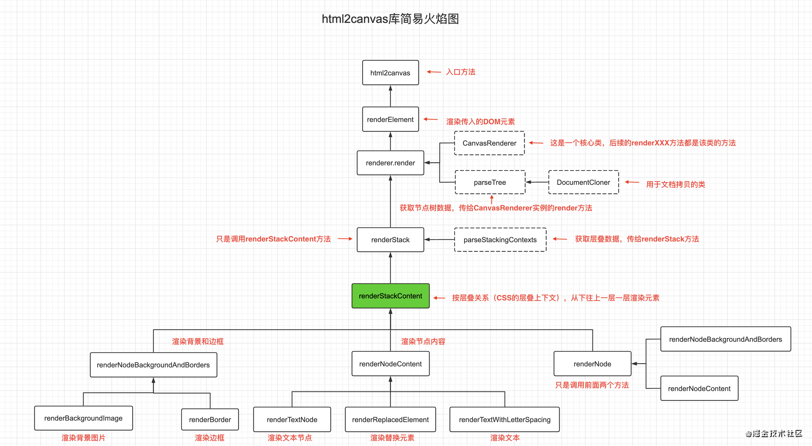

# 网页截屏

## [Puppeteer](http://puppeteerjs.com/)

Puppeteer 是一个 Node 库，它提供了一个高级 API 来通过 DevTools 协议控制 Chromium 或 Chrome。Puppeteer 默认以 headless 模式运行。可实现：

- 生成页面 PDF。
- 抓取 SPA（单页应用）并生成预渲染内容（即“SSR”（服务器端渲染））。
- 自动提交表单，进行 UI 测试，键盘输入等。
- 创建一个时时更新的自动化测试环境。 使用最新的 JavaScript 和浏览器功能直接在最新版本的Chrome中执行测试。
- 捕获网站的 timeline trace，用来帮助分析性能问题。
- 测试浏览器扩展。

Puppeteer 是通过 WebSocket 给浏览器发送遵循 Chrome Devtools Protocol 的数据，命令浏览器去执行一些操作。然后，浏览器再通过 WebSocket 把结果返回给 Puppeteer。这个过程是异步的。

```javascript
const puppeteer = require('puppeteer');

(async () => {
  // 创建一个 Browser 类的实例
  const browser = await puppeteer.launch();
  // 返回一个新的 Page 对象。Page 在一个默认的浏览器上下文中被创建。
  const page = await browser.newPage();
  await page.setViewport({ // 设置视窗大小
    width: 600,
    height: 800
  });
  await page.goto('https://example.com'); // 打开页面
  await page.screenshot({path: 'example.png'}); // path: 截屏文件保存路径

  await browser.close();
})();
```

## [dom-to-image](https://github.com/tsayen/dom-to-image)

SVG 的 `<foreignObject>` 标签可以包裹任意的 HTML 内容。为了渲染一个节点，主要进行了以下步骤：

- 递归地拷贝原始 DOM 节点和后代节点
- 把原始节点以及后代节点的样式递归的应用到对应的拷贝后的节点和后代节点上
- 字体处理
- 图片处理
- 序列化拷贝后的节点，把它插入到 `<foreignObject>` 里面，然后组成一个 SVG ，然后生成一个 `data URL`
- 如果想得到 PNG 内容或原始像素值，可以先使用 `data URL` 创建一个图片，使用一个离屏 canvas 渲染这张图片，然后从 canvas 中获取想要的数据

## [html2canvas](https://html2canvas.hertzen.com/)

[html2canvas实现浏览器截图的原理（包含源码分析的通用方法）](https://juejin.cn/post/6908255717317148685)



## 参考

[JavaScript实现网页截屏方法总结](https://segmentfault.com/a/1190000037673677)
