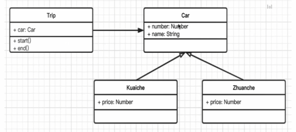
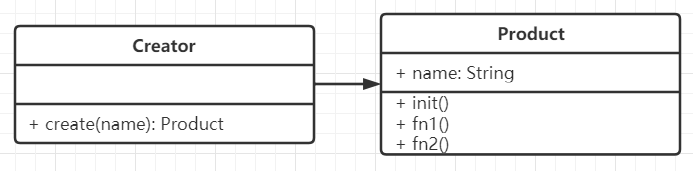
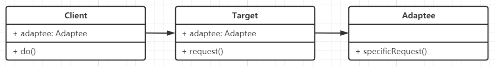
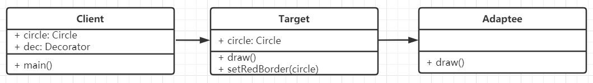
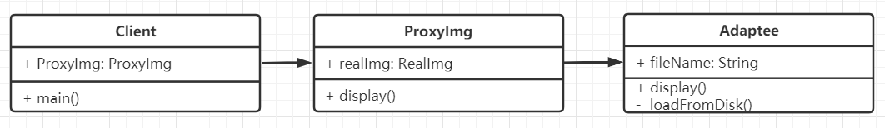
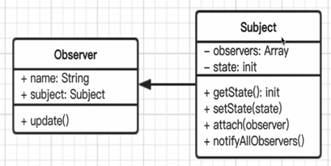
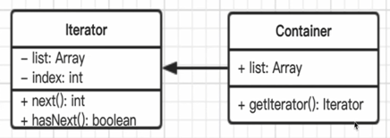
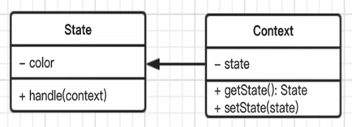
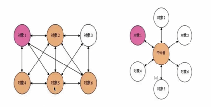

# JavaScript设计模式

## 面向对象

概念：类、对象（实例）

### 三要素

+ 继承：子类继承父类
+ 封装：数据的权限和保密（public 完全开发、protected 对子类开发、private 对自己开发）
  + 减少耦合，不该外露的不外露
  + 利用数据、接口的权限管理
  + ES6目前不支持，一般认为 _ 开头的属性是 private
+ 多态：同一接口的不同实现，保持子类的开发性和灵活性，面向接口编程。JavaScript应用极少，需要接口 Java 等语言的接口、重写、重载等功能

### 为什么使用面向对象

+ 程序执行：顺序、判断、循环 —— 结构化
+ 面向对象 —— 数据结构化
+ 对于计算机，结构化的才是最简单的
+ 编程应该简单和抽象

### UML类图

UML类图基本符号的含义：

+ 类(class)：一般是用三层矩形框表示，第一层表示类的名称，第二层表示的是字段和属性，第三层则是类的方法第一层中，如果是抽象类，需用斜体显示。类的属性、操作中的可见性使用+、#、－分别表示public、protected、private
+ 包(Package)：是一种常规用途的组合机制。在UML中用一个Tab框表示，Tab里写上包的名称，框里则用来放一些其他子元素，比如类，子包等等。
+ 接口(Interface)：表示的是一系列的操作集合，它指定了一个类所提供的服务。一个接口只指明了实现这一接口的分类器实例应该支持的特性，并没有指定其所刻画的特性是如何实现的。

UML中描述对象和类之间相互的关系：

+ 泛化(Generalization)：表示的是类之间的**继承**关系，注意是子类指向父类。
+ 关联(Association)：表示的是类与类之间存在某种特定的对应关系。
+ 聚合(Aggregation)：是关联关系的一种特例，表示的是整体与部分之间的关系，部分不能离开整体单独存在。
+ 组合(Composition)：是聚合的一种特殊形式，表示的是类之间更强的组合关系。
+ 依赖(Dependency)：表示的是类之间的调用关系。

可参考：[UML类图常用符号及关系详解](https://www.edrawsoft.cn/uml-class-symbols/)

## 设计原则

### <<UNIX/LINUX设计哲学>>

+ 准则1：小即是美
+ 准则2：让每个程序只做好一件事
+ 准则3：快速建立原型
+ 准则4：舍弃高效率而取可移植性
+ 准则5：采用纯文本来存储数据
+ 准则6：充分利用软件的杠杆效应（软件复用）
+ 准则7：使用 shell 脚本来提高杠杆效应和可移植性
+ 准则8：避免强制性的用户界面
+ 准则9：让每个程序都称为过滤器
+ 小准则
  + 允许用户定制环境
  + 尽量使操作系统内核小而轻量化
  + 使用小写字母并尽量简短
  + 沉默是金
  + 各部分之和大于整体
  + 寻求 90% 的解决方案

### SOLID 设计原则

+ S - 单一职责原则
  + 一个程序只做好一件事
  + 如果功能过于复杂就拆分开，每个部分保持独立
+ O - 开放封闭原则
  + 对扩展开发，对修改封闭
  + 增加需求时，扩展新代码，而非修改已有代码
+ L - 李氏置换原则
  + 子类能覆盖父类
  + 父类能出现的地方，子类就能出现
  + JS中使用较少（弱类型 & 继承使用较少）
+ I - 接口独立原则
  + 保持接口的单一独立，避免出现“胖接口”
  + JS中没有接口（typescript例外），使用较少
  + 类似单一职责原则，这里更关注接口
+ D - 依赖导致原则
  + 面向接口编程，依赖于抽象而不依赖于具体
  + 使用方只关注接口而不关注具体类的实现
  + JS使用较少（没有接口 & 弱类型）

### 设计模式类型

+ 创建型
  + 工厂模式（工厂方法模式、抽象工厂模式、建造者模式）
  + 单例模式
  + 原型模式
+ 组合型
  + 适配器模式
  + 装饰器模式
  + 代理模式
  + 外观模式
  + 桥接模式
  + 组合模式
  + 享元模式
+ 行为型
  + 策略模式
  + 模板方法模式
  + 观察者模式
  + 迭代器模式
  + 职责连模式
  + 命令模式
  + 备忘录模式
  + 状态模式
  + 访问者模式
  + 中介者模式
  + 解释器模式

### 面试题

+ 第一题
  + 打车时，可以打专车或者快车。任何车都有车牌号和名称。
  + 不同车价格不同，快车每公里1元，专车每公里2元。
  + 行程开始时，显示车辆信息
  + 行程结束时，显示打车金额（假定行程就5公里）
  + 画出UML类图，用ES6语法写出该示例？

  

  ``` javascript
  // 车
  class Car {
    constructor(number, name) {
      this.number = number
      this.name = name
    }
  }
  // 快车
  class Kuaiche extends Car {
    constructor(number, name) {
      super(number, name)
      this.price = 1
    }
  }
  // 专车
  class Zhuanche extends Car {
    constructor(number, name) {
      super(number, name)
      this.price = 2
    }
  }
  // 提示
  class Trip {
    constructor(car) {
      this.car = car
    }
    start() {
      console.log(`行程开始，名称${this.car.name}，车牌号：${this.car.price}`)
    }
    end() {
      console.log(`行程结束，价格：${this.car.price * 5}`)
    }
  }
  let car = new Kuaiche(100, '桑塔纳')
  let trip = new Trip(car)
  trip.start()
  trip.end()
  ```

+ 第二题
  + 某停车场，分3层，每层100车位
  + 每个车位都能监控到车辆的驶入和离开
  + 车辆进入前，显示每层的空余车位数量
  + 车辆进入时，摄像头可识别车牌号和时间
  + 车辆出来时，出口显示器显示车牌号和停车时长
  
  

  ``` javascript
  // 车辆
  class Car {
    constructor(num) {
      this.num = num
    }
  }
  class Camera {
    shot(car) {
      return {
        num: car.num,
        inTime: Date.now()
      }
    }
  }
  // 出口显示屏
  class Screen {
    shot(car, inTime) {
      console.log('车牌号', car.num)
      console.log('停车时间', Date.now() - inTime)
    }
  }
  // 停车场
  class Park {
    constructor(floors) {
      this.floors = floors || []
      this.camera = new Camera()
      this.screen = new Screen()
      this.carList = {} // 存储摄像头拍摄返回的车辆信息
    }
    in(car) {
      // 通过摄像头获取信息
      const info = this.camera.shot(car)
      // 停到某个停车位
      const i = parseInt(Math.random() * 100 % 100)
      const place = this.floors[0].places[i]
      place.in()
      info.place = place
      // 记录信息
      this.carList[car.num] = info
    }
    out(car) {
      // 获取信息
      const info = this.carList[car.num]
      // 将停车位清空
      const place = info.place
      place.out()
      // 显示时间
      this.screen.shot(car, info.inTime)
      // 清空记录
      delete this.carList[car.num]
    }
    emptyNum() {
      return this.floors.map(floor => {
        return `${floor.index} 层还有 ${floor.emptyPlaceNum()} 个空闲车位`
      }).join('\n')
    }
  }
  // 层
  class Floor {
    constructor(index, places) {
      this.index = index
      this.places = places || []
    }
    // 空车位数量
    emptyPlaceNum() {
      let num = 0
      this.places.forEach(p => {
        if (p.empty) {
          num = num + 1
        }
      })
      return num
    }
  }
  // 车位 - 车位是否为空
  class Place {
    constructor() {
      this.empty = true
    }
    in() {
      this.empty = false
    }
    out() {
      this.empty = true
    }
  }

  // 初始化停车场
  const floors = []
  for (let i = 0; i < 3; i++) {
    const places = []
    for (let j = 0; j < 100; j++) {
      places[j] = new Place()
    }
    floors[i] = new Floor(i + 1, places)
  }
  const park = new Park(floors)
  // 初始化车辆
  const car1 = new Car(100)
  const car2 = new Car(200)
  const car3 = new Car(300)
  console.log('第一辆车进入')
  console.log(park.emptyNum())
  park.in(car1)
  console.log('第二辆车进入')
  console.log(park.emptyNum())
  park.in(car2)
  console.log('第一辆车离开')
  park.out(car1)
  console.log('第二辆车离开')
  park.out(car2)
  console.log('第三辆车进入')
  console.log(park.emptyNum())
  park.in(car3)
  console.log('第三辆车离开')
  park.out(car3)
  ```

## 设计模式

### 工厂模式(FactoryMethod)

将 `new` 操作单独封装。遇到 `new` 时，就要考虑是否该使用工厂模式

构造函数和创造者分离。符合开放封闭原则。



``` javascript
class Product {
  constructor(name) {
    this.name = name
  }
  init() { alert('init') }
  fn1() { alert('fn1') }
  fn2() { alert('fn2') }
}

class Creator {
  create(name) {
    return new Product(name)
  }
}

let creator = new Creator()
let p = creator.create('p1')
p.init()
p.fn1()
```

+ jQuery - `$('div')`

  ``` javascript
  class jQuery {
    constructor(selector) {
      let slice = Array.prototype.slice
      let dom = slice.call(document.querySelectorAll(selector))
      let len = dom ? dom.length : 0
      for (let i = 0; i < len; i++) {
        this[i] = dom[i]
      }
      this.length = len
      this.selector = selector || ''
    }
    append(node) { }
    addClass(name) { }
    html(data) { }
    //... // 此处省略若干 API
  }
  window.$ = function (selector) {
    return new jQuery(selector)
  }
  ```

+ React.createElement

``` javascript
var profile = <div>
  
  <h3>{[user.firstName, user.lastName].join(' ')}</h3>
</div>

var profile = React.createElement("div", null,
  React.createElement("img", { src: "avator.png", className: "profile" }),
  React.createElement("h3", null, [user.firstName, user.lastName].join(' '))
)

class Vnode(tag, attrs, children) {
  // ... 省略内部代码 ...
}
React.createElement = function (tag, attrs, children) {
  return new Vnode(tag, attrs, children)
}
```

+ Vue 异步组件

``` javascript
Vue.component('async-example', function (resolve, reject) {
  setTimeout(function () {
    resolve({ template: '<div>I am async!</div>' })
  }, 1000)
})
```

### 单例模式(Singleton)

系统中被唯一使用，一个类只有一个实例。示例：登录框，购物车

符合单一职责原则，只实例化唯一的对象。没法具体开放封闭原则，但是绝对不违反开放封闭原则。

+ 单例模式需要用到 java 的特性（private）
+ ES6 中没有 （typescript除外）
+ 只能用 java 代码来演示 UML 图的内容

``` javascript
class SingleObject {
  login() {
    console.log('login...')
  }
}
SingleObject.getInstance = (function () {
  let instance
  return function () {
    if (!instance) {
      instance = new SingleObject();
    }
    return instance
  }
})()

let obj1 = SingleObject.getInstance()
obj1.login()
let obj2 = SingleObject.getInstance()
obj2.login()
console.log(obj1 === obj2)
```

+ jQuery 只有一个 `$`

  ``` javascript
  // jQuery 只有一个 $
  if (window.jQuery != null) {
    return window.jQuery
  } else {
    // 初始化...
  }
  ```

+ 模拟登录框

``` javascript
class LoginForm {
  constructor() {
    this.state = "hide";
  }
  show() {
    if (this.state === "show") {
      alert("已经显示");
      return;
    }
    this.state = "show";
    console.log("登录框已显示");
  }
  hide() {
    if (this.state === "hide") {
      alert("已经隐藏");
      return;
    }
    this.state = "hide";
    console.log("登录框已隐藏");
  }
}
LoginForm.getInstance = (function () {
  let instance;
  return function () {
    if (!instance) {
      instance = new LoginForm();
    }
    return instance;
  };
})();

// 一个页面中调用登录框
let login1 = LoginForm.getInstance();
login1.show();
// 另一个页面中调用登录框
let login2 = LoginForm.getInstance();
login2.show();
// 两者是否相等
console.log("login1 === login2", login1 === login2);
```

+ 其他
  + 购物车（和登录框类似）
  + vuex 和 redux 中的 store

### 适配器模式(Adapter)

将一个类的接口转换成客户希望的另外一个接口，使得原本由于接口不兼容而不能一起工作的那些类能一起工作。

将旧接口和使用者进行分离。符合开放封闭原则



``` javascript
class Adaptee {
  specificRequest() {
    return '德国标准插头'
  }
}
class Target {
  constructor() {
    this.adaptee = new Adaptee
  }
  request() {
    let info = this.adaptee.specificRequest()
    return `${info} - 转换器 - 中国标准插头`
  }
}
let target = new Target()
let res = target.request()
console.log(res)
```

场景

+ 封装旧接口

``` javascript
// 自己封装的 ajax，使用方法如下
ajax({
  url: '/getData',
  type: 'Post',
  dataType: 'json'
})
  .done(function () {})
// 之前的旧接口
// $.ajax({...})
```

+ vue computed

### 装饰器模式(Decorator)

为对象添加新功能，不改变其原有的结构和功能

将现有对象和装饰器分离，两者独立存在。符合开放封闭原则



``` javascript
class Circle {
  draw() {
    console.log('画一个圆形')
  }
}
class Decorator {
  constructor(circle) {
    this.circle = circle
  }
  draw() {
    this.circle.draw()
    this.setRedBorder(circle)
  }
  setRedBorder(circle) {
    console.log('设置红色边框')
  }
}
let circle = new Circle()
circle.draw()
let dec = new Decorator(circle)
dec.draw()
```

场景

+ ES7 装饰器

``` javascript
function mixins(...list) {
  return function (target) {
    Object.assign(target.prototype, ...list)
  }
}
const Foo = {
  foo() { alert('foo') }
}

@mixins(Foo)
class MyClass {}

let obj = new MyClass();
obj.foo() // 'foo'
```

+ core-decorators

### 代理模式(Proxy)

使用者无权访问目标对象，中间加代理，通过代理做授权和控制

代理类和目标类分离，隔离开目标类和使用者，符合开放封闭原则



``` javascript
class ReadImg {
  constructor(fileName) {
    this.fileName = fileName
    this.loadFormDisk() // 初始化，即从硬盘中加载 - 模拟
  }
  display() {
    console.log('display...' + this.fileName)
  }
  loadFormDisk() {
    console.log('loading...' + this.fileName)
  }
}
class ProxyImg {
  constructor(fileName) {
    this.realImg = new ReadImg(fileName)
  }
  display() {
    this.realImg.display()
  }
}
let proxyImg = new ProxyImg('1.png')
proxyImg.display()
```

场景

+ 网页事件代理
+ jQuery - `$.proxy`
+ ES6 Proxy

比较

+ 代理模式 vs 适配器模式
  + 适配器模式：提供一个不同的接口
  + 代理模式：提供一模一样的接口
+ 代理模式 vs 装饰器模式
  + 装饰器模式：扩展功能，原有功能不变且可直接使用
  + 代理模式：显示原有功能，但是经过限制或者阉割之后的

### 外观模式(Facade)

为子系统中的一组接口提供了一个高层接口，使用者使用这个高层接口

不符合单一职责原则和开放封闭原则，因此谨慎使用，不可滥用

### 观察者模式(Observer)

发布 & 订阅；一对多。

主题和观察者分离，不是主动触发而是被动监听，两者解耦。符合开发封闭原则。



``` javascript
// 主题，接收状态变化，触发每个观察者
class Subject {
  constructor() {
    this.state = 0;
    this.observers = [];
  }
  getState() {
    return this.state;
  }
  setState(state) {
    this.state = state;
    this.notifyAllObservers();
  }
  attach(observer) {
    this.observers.push(observer);
  }
  notifyAllObservers() {
    this.observers.forEach((observer) => {
      observer.update();
    });
  }
}
// 观察者，等待被触发
class Observer {
  constructor(name, subject) {
    this.name = name;
    this.subject = subject;
    this.subject.attach(this);
  }
  update() {
    console.log(`${this.name} update, state: ${this.subject.getState()}`);
  }
}
// 测试代码
let s = new Subject();
let o1 = new Observer("o1", s);
let o2 = new Observer("o2", s);
let o3 = new Observer("o3", s);
s.setState(1);
s.setState(2);
s.setState(3);
```

场景

+ 网页事件绑定
+ Promise
+ jQuery callbacks
+ nodejs 自定义事件

``` javascript
const EventEmitter = require('events').EventEmitter
const emitter1 = new EventEmitter()
emitter1.on('some', () => {
  // 监听 some 事件
  console.log('some event is occured 1')
})
emitter1.on('some', () => {
  // 监听 some 事件
  console.log('some event is occured 2')
})
// 触发 some 事件
emitter1.emit('some')
```

+ 其他场景
  + nodejs中：处理 http 请求；多进程通讯
  + vue 和 React 组件生命周期触发
  + vue watch

### 迭代器模式(Iterator)

顺序访问一个集合，使用者无需知道集合的内部结构（封装）

迭代器对象和目标对象分离；迭代器将使用者与目标对象隔离开；符合开放封闭原则。



``` javascript
class Iterator {
  constructor(conatiner) {
    this.list = conatiner.list
    this.index = 0
  }
  next() {
    if (this.hasNext()) {
      return this.list[this.index++]
    }
    return null
  }
  hasNext() {
    if (this.index >= this.list.length) {
      return false
    }
    return true
  }
}
class Container {
  constructor(list) {
    this.list = list
  }
  getIterator() {
    return new Iterator(this)
  }
}
let container = new Container([1, 2, 3, 4, 5])
let iterator = container.getIterator()
while(iterator.hasNext()) {
  console.log(iterator.next())
}
```

场景

+ jQuery each
+ ES6 Iterator

### 状态模式(State)

一个对象有状态变化，每次状态变化都会触发一个逻辑，不能总是用 `if...else` 来控制



``` javascript
class State {
  constructor(color) {
    this.color = color
  }
  handle(context) {
    console.log(`turn to ${this.color} light`)
    context.setState(this)
  }
}

class Context {
  constructor() {
    this.state = null
  }
  setState(state) {
    this.state = state
  }
  getState() {
    return this.state
  }
}

let context = new Context()
let greed = new State('greed')
let yellow = new State('yellow')
let red = new State('red')

// 绿灯亮了
greed.handle(context)
console.log(context.getState())
// 黄灯亮了
yellow.handle(context)
console.log(context.getState())
// 红灯亮了
red.handle(context)
console.log(context.getState())
```

场景

+ 有限状态机
  + 有限个状态、以及在这些状态之间的变化。如交通信号灯
  + 使用开源 lib：javascript-state-machine

  ``` javascript
  // 有限状态机 - “收藏” 和 “取消”
  var fsm = new StateMachine({
    init: '收藏', // 初始状态，待收藏
    transitions: [
      { name: 'doStore', from: '收藏', to: '取消收藏' },
      { name: 'deleteStore', from: '取消收藏', to: '收藏' }
    ],
    methods: {
      // 执行收藏
      onDoStore: function () {
        alert('收藏成功')
        updateText()
      },
      // 取消收藏
      onDeleteStore: function () {
        alert('已取消收藏')
        updateText()
      }
    }
  })
  var $btn = $('btn')
  // 点击事件
  $btn.click(function () {
    if (fsm.is('收藏')) {
      fsm.doStore()
    } else {
      fsm.deleteStore()
    }
  })
  // 更新文案
  function updateText() {
    $btn.text(fsm.state)
  }
  // 初始化文案
  updateText()
  ```

+ 写一个简单的 Promise
  + Promise 就是有限状态机。Promise 三种状态：pending fullfilled rejected
  + pending -> fullfilled 或者 pending -> rejected
  + 不能逆向变化

  ``` javascript
  import StateMachine from 'javascript-state-machine'
  // 状态机模型
  let fsm = new StateMachine({
    init: 'pending', // 初始化状态
    transitions: [
      { name: 'resolve', from: 'pending', to: 'fullfilled' },
      { name: 'reject', from: 'pending', to: 'rejected' }
    ],
    methods: {
      // 监听 resolve
      onResolve: function (state, data) {
        // state - 当前状态机示例；data - fsm.resolve(xxx) 传递的参数
        data.succesList.forEach(fn => fn())
      },
      // 监听 reject
      onReject: function (state, data) {
        // state - 当前状态机示例；data - fsm.reject(xxx) 传递的参数
        data.failList.forEach(fn => fn())
      }
    }
  })
  // 定义 Promise
  class MyPromise {
    constructor(fn) {
      this.succesList = []
      this.failList = []
      fn(function () {
        // resolve 函数
        fsm.resolve(this)
      }, function () {
        // reject 函数
        fsm.reject(this)
      })
    }
    then(succesFn, failFn) {
      this.succesList.push(succesFn)
      this.failList.push(failFn)
    }
  }

  function loadImg(src) {
    const promise = new Promise(function (resolve, reject) {
      let img = document.createElement('img)
      img.onload = function () {
        resolve(img)
      }
      img.onerror = function () {
        reject()
      }
      img.src = src
    })
    return promise
  }
  let src = ''
  let result = loadImg(src)
  result.then(function () {
    console.log('ok1')
  }, function () {
    console.log('fail1')
  })
  ```

### 其他设计模式

+ 原型模式
  
  clone 自己，生成一个新对象。java 默认有 clone 接口，不用自己实现。

  示例：Object.create
+ 桥接模式
  
  用于把抽象化与实现化解耦，使得二者可以独立变化

  抽象和实现分离，解耦。符合开放封闭原则
+ 组合模式
  
  生成树形结构，表示“整体 - 部分”关系，让整体和部分都具有一致的操作方式

  将整体和单个节点的操作抽象出来，符合开放封闭原则

  示例：虚拟 DOM 中的 vnode 是这种形式，但数据类型简单
+ 享元模式
  
  共享内存（主要考虑内存，而非效率），相同的数据，共享使用

  将相同的部分抽取出来，符合开放封闭原则
+ 策略模式

  不同策略分开处理，避免出现大量 `if...else` 或者 `switch...case`

  不同策略，分开处理，而不是混合在一起。符合开放封闭原则
+ 模板方法模式
+ 职责链模式
  
  一步操作可能分为多个职责角色来完成；把这些角色都分开，然后用一个链串起来；将发起者和各个处理着进行隔离

  发起者于各个处理着进行隔离，符合开放封闭原则
+ 命令模式
  
  执行命令时，发布者和执行者分开；中间加入命令对象，作为中转站。

  【发送者】 ---发出命令，调用命令对象---> 【命令对象】 ---接收命令，调用接受者对应接口---> 【接受者】

  命令对象于执行对象分开，解耦。符合开放封闭原则

+ 备忘录模式

  随时记录一个对象的状态辩护，随时可以回复之前的某个状态（如撤销）

  状态对象于使用者分开，解耦。符合开放封闭原则。

+ 中介者模式

  

  各关联对象通过中介者隔离，符合开放封闭原则

+ 访问者模式：将数据操作和数据结构进行分离
+ 解释器模式：描述语言语法如何定义，如何解释和编译，用于专业场景
