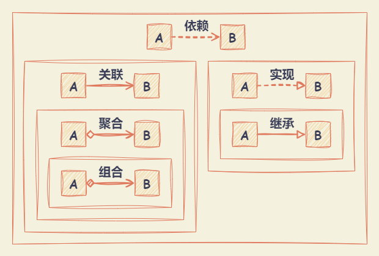
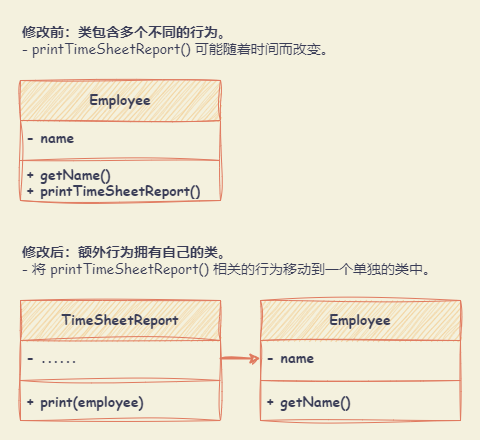
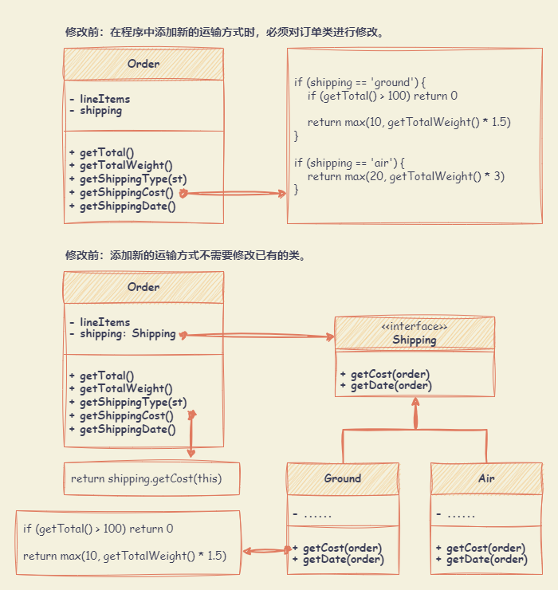
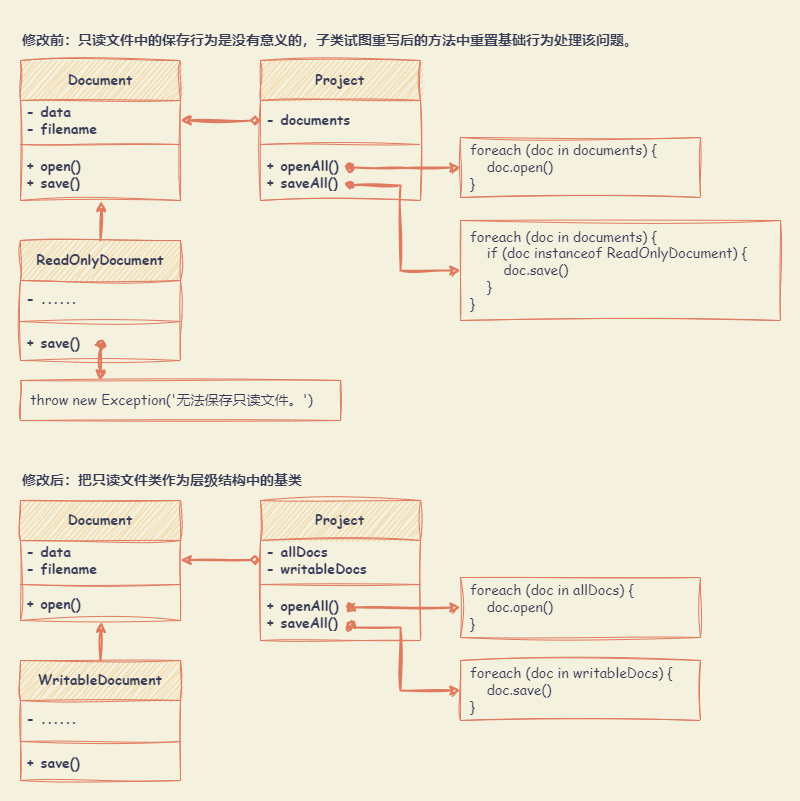
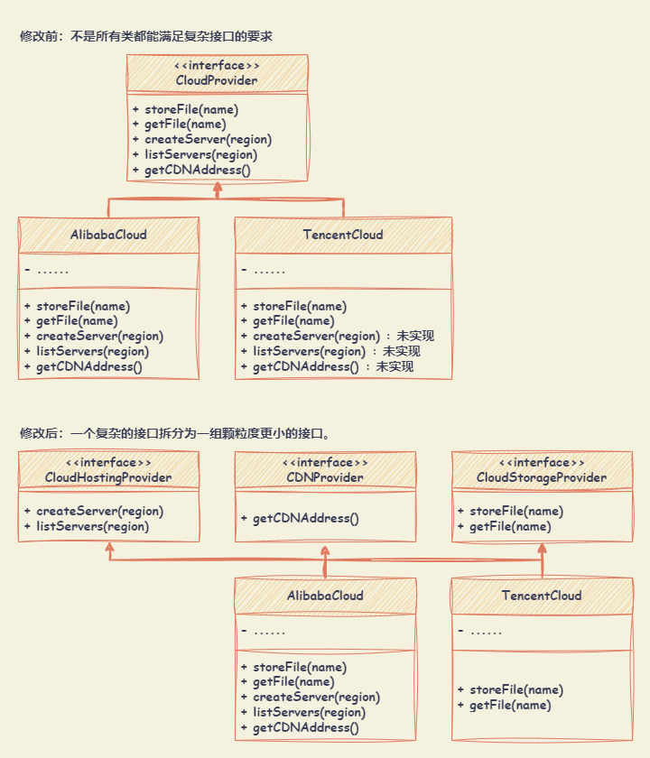
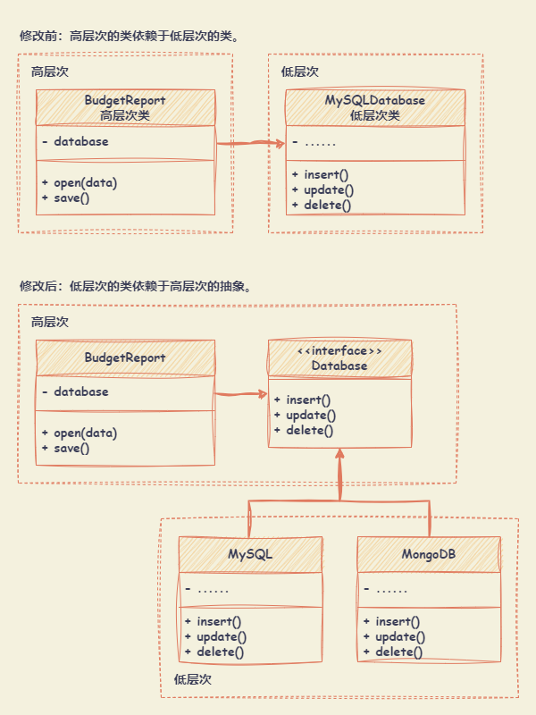

# 设计原则

## 面向对象程序设计

面向对象程序设计（OOP，Object-oriented programming）是种具有对象概念的编程典范，同时也是一种程序开发的抽象方针。

- 它可能包含数据、特性、代码与方法。
- 对象则指的是类（class）的实例。
- 它将对象作为程序的基本单元，将程序和数据封装其中，以提高软件的重用性、灵活性和扩展性，对象里的程序可以访问及经常修改对象相关连的数据。

面向对象程序设计的基本概念：

- **类与对象**：
  - 类：定义事物的抽象特点。类的定义包含了数据的形式以及对数据的操作。
  - 对象：类的实例（Instance），可以调用类中的方法。
- **封装**：通过限制只有特定类的对象可以访问该特定类的成员，通常利用接口实现消息的传入传出。通常来说，成员的访问权限被分为 3 种：公有成员（public）、私有成员（private）以及保护成员（protected）。
- **继承**：根据已有类创建新类，子类继承父类。
  - 子类比父类要更加具体化。
  - 如果父类实现了某个接口，那么其所有子类都必须实现该接口。
- **多态**：由继承而产生的相关的不同的类，其对象对同一消息会做出不同的响应。程序能够检测对象所属的实际类，并在当前上下文不知道其真实类型的情况下调用其实现的能力。

对象之间的关系（从弱到强）：

- **依赖**：对类 B 进行修改会影响到类 A 。
- **关联**：对象 A 知道对象 B。类 A 依赖于类 B。
- **聚合**：对象 A 知道对象 B 且由 B 构成。类 A 依赖于类 B。
- **组合**：对象 A 知道对象 B 、由 B 构成而且管理着 B 的生命周 期。类 A 依赖于类 B。
- **实现**：类 A 定义的方法由接口 B 声明。对象 A 可被视为对象 B。类 A 依赖于类 B。
- **继承**：类 A 继承类 B 的接口和实现，但是可以对其进行扩展。对象 A 可被视为对象 B。类 A 依赖于类 B。

## 相关设计原则

- 封装变化的内容：找到程序中的变化内容，并将其与不变的内容区分开。主要目的是将变更造成的影响最小化。
- 面向接口进行开发，而不是面向实现；依赖于抽象类型，而不是具体类。
- 组合优于继承。

## SOLID 设计原则

### 单一职责原则（SRP, Single Responsibility Principle）
  
**就一个类而言，应该仅有一个引起它变化的原因。**

尽量让每个类只负责软件中的一个功能，并将该功能完全封装在该类中。

- 该原则降低了单个类或者对象的复杂度，提高了代码可复用度，有利于单元测试，当一个职责变更时，不会影响其他的职责。
- 当职责把对象分解成更小的粒度时，会增大对象之间相互联系的难度。

### 开放封闭原则（OCP, Open Closed Principle）

**对于扩展，类应该是 “开放” 的；对于修改，类应该是 “封闭” 的。**

- 如果对一个类进行扩展，可以创建它的子类并对其做扩展（如：新增方法或成员变量、重新基类行为等）。
- 如果某个类已完成定义（即，其接口已明确定义且以后不会修改），则该类应该是封闭的。

### 里氏替换原则（LSP, Liskov Substitution Principle）

**子类型（subtype）必须能够替换掉它们的基类型（base type）。**

子类必须保持与父类行为的兼容。在重写一个方法时，要对基类行为进行扩展，而不是将其完全替换。

### 接口隔离原则（ISP, Interface Segregation Principle）

**不应该强迫客户依赖于其不用的方法。**

尽量缩小接口的范围，使得类不必实现其不需要的行为。需要将 “臃肿” 的方法拆分为多个颗粒度更小的具体方法，类仅需实现其实际需要的方法。

### 依赖倒置原则（DIP, Dependence Inversion Principle）

**高层次的类不应该依赖于低层次的类。两者都应该依赖于抽象接口。抽象接口不应依赖于具体实现。具体实现应该依赖于抽象接口。**

- 低层次的类：实现基础操作（例如：磁盘操作、传输网络数据和连接数据库等）。
- 高层次的类：包含复杂业务逻辑以指导低层次类执行特定操作。

