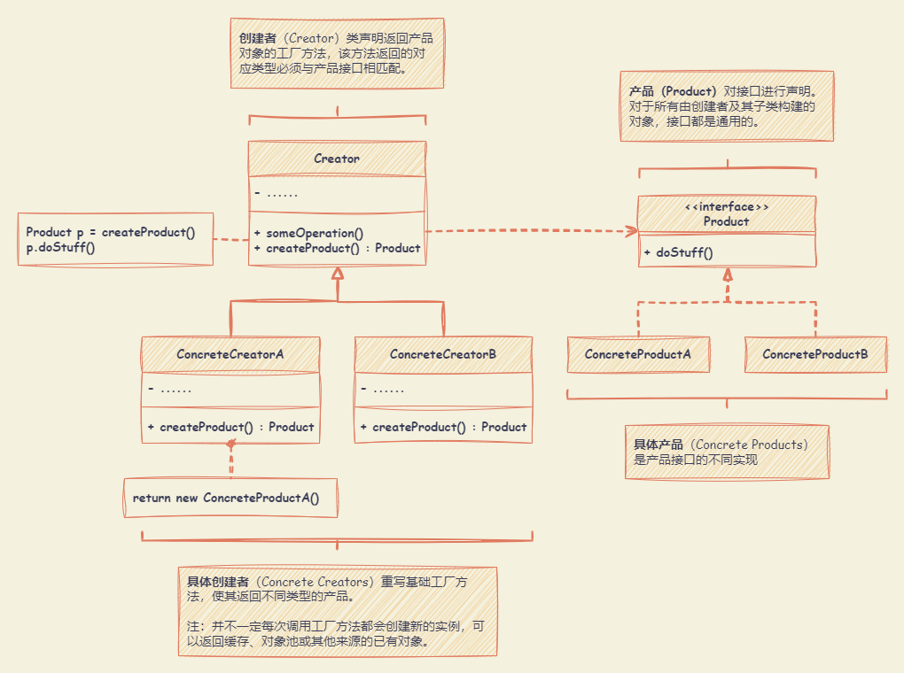
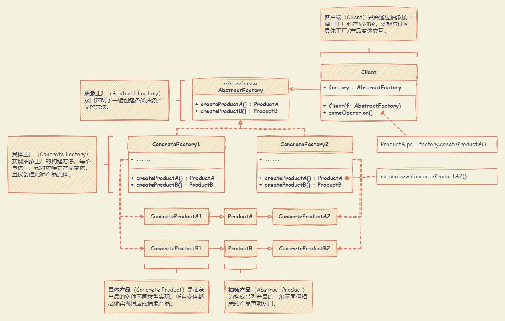
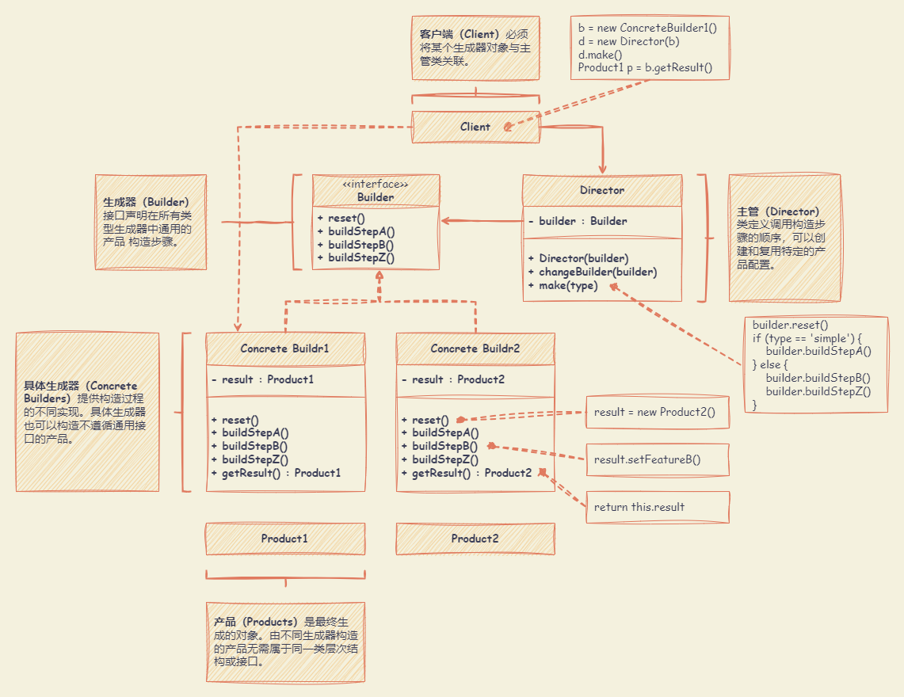
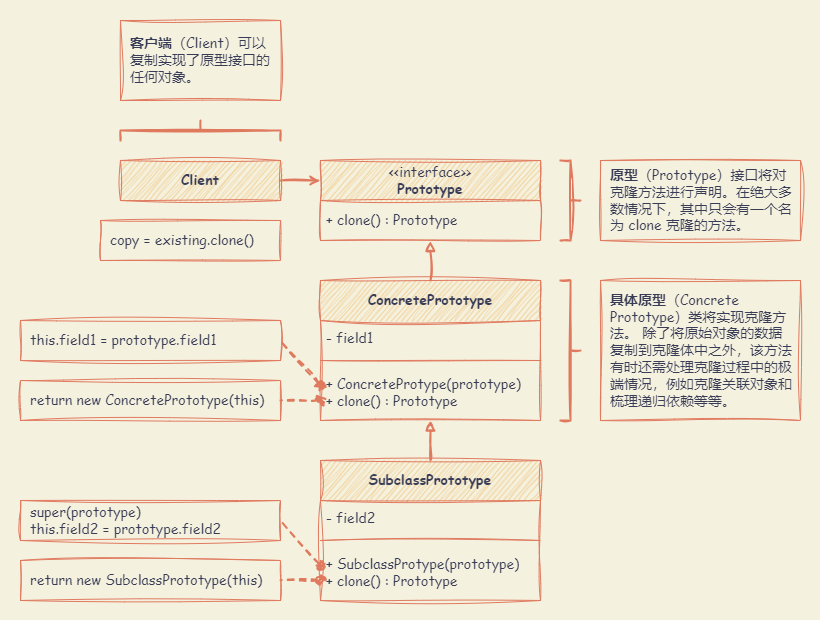
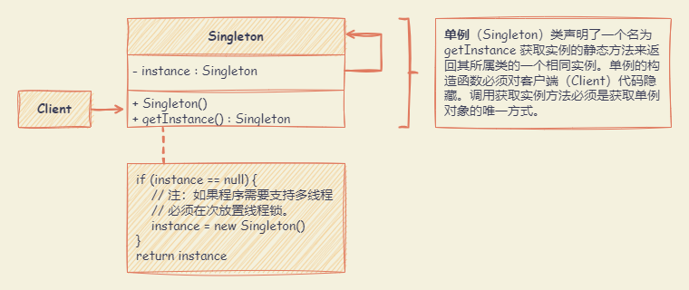

# 创建型设计模式

创建型模式提供创建对象的机制，增加已有代码的灵活性和可复用性。

## 工厂模式 （Factory Method）

**在父类中提供一个创建对象的方法，允许子类决定实例化对象的类型。**

适合应用场景：

- 无法预知对象确切类别及其依赖关系时。可以将创建产品的代码与实际使用产品的代码分离，从而能在不影响其他代码的情况下扩展产品创建部分代码。
- 希望用户能扩展软件库或框架的内部组件时。在使用子类替代标准组件时，可以将各框架中构造组件的代码集中到单个工厂方法中，并在继承该组件之外允许任何人对该方法进行重写。
- 希望复用现有对象来节省系统资源，而不是每次都重新创建对象。

优点：

- 避免创建者和具体产品之间的紧密耦合。
- 单一职责原则。可以将产品创建代码放在程序的单一位置，从而使得代码更容易维护。
- 开闭原则。无需更改现有客户端代码，可以在程序中引入新的产品类型。

缺点：

- 需要引入许多新的子类，代码可能会因此变得更复杂。最好的情况是将该模式引入创建者类的现有层次结构中。



:::: details 代码示例

::: code-tabs

@tab js

```js
class Creator {
  someOperation() {
    const product = this.factoryMethod()
    return `Creator: The same creator's code has just worked with ${product.operation()}`
  }
}

class ConcreteCreator1 extends Creator {
  factoryMethod() {
    return new ConcreteProduct1()
  }
}

class ConcreteCreator2 extends Creator {
  factoryMethod() {
    return new ConcreteProduct2()
  }
}

class ConcreteProduct1 {
  operation() {
    return '{Result of the ConcreteProduct1}'
  }
}

class ConcreteProduct2 {
  operation() {
    return '{Result of the ConcreteProduct2}'
  }
}

function clientCode(creator) {
  // ...
  console.log("Client: I'm not aware of the creator's class, but it still works.")
  console.log(creator.someOperation())
  // ...
}

console.log('App: Launched with the ConcreteCreator1.')
clientCode(new ConcreteCreator1())

console.log('App: Launched with the ConcreteCreator2.')
clientCode(new ConcreteCreator2())
```

@tab ts

```ts
// Creator 声明了工厂方法，该方法用于返回 Product 类的对象。
// 创建者 Creator 类的子类通常会提供该方法的实现。
abstract class Creator {
  // 创建者 Creator 也可以提供工厂方法的默认实现。
  public abstract factoryMethod(): Product

  // 创建者的主要职责并不是创建产品。
  // 通常，创建者包含一些依赖于工厂方法返回的 Product 对象的核心业务逻辑。
  // 子类可以通过重载工厂方法并从中返回不同类型的产品来间接改变业务逻辑。
  public someOperation(): string {
    // 调用工厂方法创建的 Product 对象
    const product = this.factoryMethod()
    // 使用产品
    return `Creator: The same creator's code has just worked with ${product.operation()}`
  }
}

// 具体创建者可以重载工厂方法，以更改生成产品的类型。
class ConcreteCreator1 extends Creator {
  // 尽管该方法实际返回的是具体产品，但其签名仍使用抽象产品类型。
  // 创建者就可以独立于具体的产品类别。
  public factoryMethod(): Product {
    return new ConcreteProduct1()
  }
}

class ConcreteCreator2 extends Creator {
  public factoryMethod(): Product {
    return new ConcreteProduct2()
  }
}

// 产品接口声明了所有具体产品必须实现的操作。
interface Product {
  operation(): string
}

// 具体产品提供了产品接口的各种实现。
class ConcreteProduct1 implements Product {
  public operation(): string {
    return '{Result of the ConcreteProduct1}'
  }
}

class ConcreteProduct2 implements Product {
  public operation(): string {
    return '{Result of the ConcreteProduct2}'
  }
}

// 客户端代码通过具体创建者的基本接口与具体创建者的实例协同工作。
// 只要客户端继续通过基础接口与创建者协同工作，就可以将创建者的任何子类传递给客户端。
function clientCode(creator: Creator) {
  // ...
  console.log("Client: I'm not aware of the creator's class, but it still works.")
  console.log(creator.someOperation())
  // ...
}

// 应用程序会根据配置或环境选择创建器的类型。
console.log('App: Launched with the ConcreteCreator1.')
clientCode(new ConcreteCreator1())

console.log('App: Launched with the ConcreteCreator2.')
clientCode(new ConcreteCreator2())
```

:::

::::

## 抽象工厂模式 （Abstract Factory）

**创建一系列相关的对象，而无需指定其具体类。**

适合应用场景：

- 如果代码需要与多个不同系列的相关产品交互，但是由于无法提前获取相关信息，或者出于对未来扩展性的考虑，不希望代码基于产品的具体类进行构建。抽象工厂提供了一个接口，可用于创建每个系列产品的对象。只要代码通过该接口创建对象，那么就不会生成与应用程序已生成的产品类型不一致的产品。
- 如果有一个基于一组抽象方法的类，且其主要功能因此变得不明确时。在设计良好的程序中，每个类仅负责一件事。如果一个类与多种类型产品交互，就可以考虑将工厂方法抽取到独立的工厂类或具备完整功能的抽象工厂类中。

优点：

- 确保同一工厂生成的产品相互匹配。
- 避免客户端和具体产品代码的耦合。
- 单一职责原则。可以将产品生成代码抽取到同一位置，使得代码易于维护。
- 开闭原则。向应用程序中引入新产品变体时，无需修改客户端代码。

缺点：

- 由于采用该模式需要向应用中引入众多接口和类，代码可能会比之前更加复杂。



:::: details 代码示例

::: code-tabs

@tab js

```js
class ConcreteFactory1 {
  createProductA() {
    return new ConcreteProductA1()
  }
  createProductB() {
    return new ConcreteProductB1()
  }
}

class ConcreteFactory2 {
  createProductA() {
    return new ConcreteProductA2()
  }
  createProductB() {
    return new ConcreteProductB2()
  }
}

class ConcreteProductA1 {
  usefulFunctionA() {
    return 'The result of the product A1.'
  }
}

class ConcreteProductA2 {
  usefulFunctionA() {
    return 'The result of the product A2.'
  }
}

class ConcreteProductB1 {
  usefulFunctionB() {
    return 'The result of the product B1.'
  }
  anotherUsefulFunctionB(collaborator) {
    const result = collaborator.usefulFunctionA()
    return `The result of the B1 collaborating with the (${result})`
  }
}

class ConcreteProductB2 {
  usefulFunctionB() {
    return 'The result of the product B2.'
  }
  anotherUsefulFunctionB(collaborator) {
    const result = collaborator.usefulFunctionA()
    return `The result of the B2 collaborating with the (${result})`
  }
}

function clientCode(factory) {
  const productA = factory.createProductA()
  const productB = factory.createProductB()
  console.log(productB.usefulFunctionB())
  console.log(productB.anotherUsefulFunctionB(productA))
}

console.log('Client: Testing client code with the first factory type...')
clientCode(new ConcreteFactory1())

console.log('Client: Testing the same client code with the second factory type...')
clientCode(new ConcreteFactory2())
```

@tab ts

```ts
// 抽象工厂接口声明了一系列返回不同抽象产品的方法。
// 这些产品被称为一个系列，并通过一个高级主题或概念相互关联。一个系列的产品通常可以相互协作。
// 一个产品系列可能有多个变体，但其中一个变体的产品与另一个变体的产品不兼容。
interface AbstractFactory {
  createProductA(): AbstractProductA

  createProductB(): AbstractProductB
}

// 具体工厂生产属于单一变体的产品系列。
// 工厂保证所生产的产品是兼容的。
// 注：具体工厂方法的签名返回的是抽象产品，而在方法内部实例化的是具体产品。
class ConcreteFactory1 implements AbstractFactory {
  public createProductA(): AbstractProductA {
    return new ConcreteProductA1()
  }

  public createProductB(): AbstractProductB {
    return new ConcreteProductB1()
  }
}

// 每个具体工厂都有一个相应的产品变体。
class ConcreteFactory2 implements AbstractFactory {
  public createProductA(): AbstractProductA {
    return new ConcreteProductA2()
  }

  public createProductB(): AbstractProductB {
    return new ConcreteProductB2()
  }
}

// 产品系列中的每个不同产品都应有一个基础接口。产品的所有变体都必须实现该接口。
interface AbstractProductA {
  usefulFunctionA(): string
}

// 具体产品由相应的具体工厂创建。
class ConcreteProductA1 implements AbstractProductA {
  public usefulFunctionA(): string {
    return 'The result of the product A1.'
  }
}

class ConcreteProductA2 implements AbstractProductA {
  public usefulFunctionA(): string {
    return 'The result of the product A2.'
  }
}

// 所有产品都可以相互交互，但只有同一具体变体的产品之间才能进行适当的交互。
interface AbstractProductB {
  // AbstractProductB 可以做自己的事情
  usefulFunctionB(): string

  // 也可以与 AbstractProductA 协作。
  // 抽象工厂确保其创建的所有产品都是相同的变体，因此是兼容的。
  anotherUsefulFunctionB(collaborator: AbstractProductA): string
}

// 具体产品由相应的具体工厂创建。
class ConcreteProductB1 implements AbstractProductB {
  public usefulFunctionB(): string {
    return 'The result of the product B1.'
  }

  // ConcreteProductB1 只能与 ConcreteProductA1 正常工作。
  // 不过，它接受任何 AbstractProductA 的实例作为参数。
  public anotherUsefulFunctionB(collaborator: AbstractProductA): string {
    const result = collaborator.usefulFunctionA()
    return `The result of the B1 collaborating with the (${result})`
  }
}

class ConcreteProductB2 implements AbstractProductB {
  public usefulFunctionB(): string {
    return 'The result of the product B2.'
  }

  // ConcreteProductB2 只能与 ConcreteProductA2 正常工作。
  // 不过，它接受任何 AbstractProductA 的实例作为参数。
  public anotherUsefulFunctionB(collaborator: AbstractProductA): string {
    const result = collaborator.usefulFunctionA()
    return `The result of the B2 collaborating with the (${result})`
  }
}

// 客户端代码只能通过抽象类型来处理工厂和产品： 抽象工厂（AbstractFactory）和抽象产品（AbstractProduct）。
// 可以向客户端代码传递任何工厂或产品子类，而不会破坏客户端代码。
function clientCode(factory: AbstractFactory) {
  const productA = factory.createProductA()
  const productB = factory.createProductB()

  console.log(productB.usefulFunctionB())
  console.log(productB.anotherUsefulFunctionB(productA))
}

// 客户端代码可以处理任何具体的工厂类。
console.log('Client: Testing client code with the first factory type...')
clientCode(new ConcreteFactory1())

console.log('Client: Testing the same client code with the second factory type...')
clientCode(new ConcreteFactory2())
```

:::

::::

## 生成器模式 （Builder）

**能够分步骤创建复杂对象。该模式允许你使用相同的创建代码生成不同类型和形式的对象。**

适合应用场景：

- 使用生成器模式可避免 “重叠构造函数（telescopic constructor）” 的出现。假设构造函数中有个十个可选参数，重载该构造函数，新建几个只有较少参数的简化版本，但这些构造函数仍需调用主构造函数，传递一些默认值来代替省略的参数。生成器模式可以分步骤生产对象，允许仅使用必须得步骤。应用该模式后，不需要将过多的参数传入构造函数。
- 使用代码创建不同形式的产品时，可使用生成器模式。基本生成器接口定义了所有可能得制造步骤，具体生成器将实现这些步骤来制造特定形式的产品。同时，主管类将负责管理制造步骤的顺序。
- 使用生成器构造组合树或其他复杂对象。生成器在执行制造步骤时，不能对外发布未完成的产品，可以避免客户端代码获取到不完整结果对象的情况。

优点：

- 可以分步创建对象，暂缓创建步骤或递归运行创建步骤。
- 生成不同形式的产品时，可以复用相同的制造代码。
- 单一职责原则。可以将复杂构造代码从产品的业务逻辑中分离出来。

缺点：

- 该模式需要新增多个类，代码整体复杂程度会有所增加。



:::: details 代码示例

::: code-tabs

@tab js

```js
class ConcreteBuilder1 {
  constructor() {
    this.reset()
  }
  reset() {
    this.product = new Product1()
  }
  producePartA() {
    this.product.parts.push('PartA1')
  }
  producePartB() {
    this.product.parts.push('PartB1')
  }
  producePartC() {
    this.product.parts.push('PartC1')
  }
  getProduct() {
    const result = this.product
    this.reset()
    return result
  }
}

class Product1 {
  constructor() {
    this.parts = []
  }
  listParts() {
    console.log(`Product parts: ${this.parts.join(', ')}\n`)
  }
}

class Director {
  setBuilder(builder) {
    this.builder = builder
  }
  buildMinimalViableProduct() {
    this.builder.producePartA()
  }
  buildFullFeaturedProduct() {
    this.builder.producePartA()
    this.builder.producePartB()
    this.builder.producePartC()
  }
}

function clientCode(director) {
  const builder = new ConcreteBuilder1()
  director.setBuilder(builder)

  console.log('Standard basic product:')
  director.buildMinimalViableProduct()
  builder.getProduct().listParts()

  console.log('Standard full featured product:')
  director.buildFullFeaturedProduct()
  builder.getProduct().listParts()

  console.log('Custom product:')
  builder.producePartA()
  builder.producePartC()
  builder.getProduct().listParts()
}
const director = new Director()
clientCode(director)
```

@tab ts

```ts
// 生成器接口指定了创建产品对象不同部分的方法。
interface Builder {
  producePartA(): void
  producePartB(): void
  producePartC(): void
}

// 具体生成器类遵循生成器接口，并提供生成步骤的具体实现。
class ConcreteBuilder1 implements Builder {
  private product: Product1

  // 一个新的生成器实例应包含一个空白的产品对象，该对象将用于进一步组装。
  constructor() {
    this.reset()
  }

  public reset(): void {
    this.product = new Product1()
  }

  // 所有生产步骤都使用同一个产品实例。
  public producePartA(): void {
    this.product.parts.push('PartA1')
  }

  public producePartB(): void {
    this.product.parts.push('PartB1')
  }

  public producePartC(): void {
    this.product.parts.push('PartC1')
  }

  // 具体生成器应该提供自己的方法来检索结果。
  // 因为各种类型的构建器可能会创建完全不同的产品，而这些产品并不遵循相同的接口。
  // 因此，这些方法不能在基础生成器接口中声明。
  // 通常情况下，在将最终结果返回给客户端后，生成器实例就可以开始生产另一个产品了。
  // 这就是在 getProduct 方法体的末尾调用重置方法的通常做法。
  // 不过，这种行为并不是强制性的，可以让构建器等待客户端代码的显式重置调用，然后再处理之前的结果。
  public getProduct(): Product1 {
    const result = this.product
    this.reset()
    return result
  }
}

// 只有当产品相当复杂并需要大量配置时，使用构建器模式才有意义。
// 与其他创建模式不同的是，不同的具体构建器可能会生成不相关的产品。换句话说，不同构建器的结果可能并不总是遵循相同的界面。
class Product1 {
  public parts: string[] = []

  public listParts(): void {
    console.log(`Product parts: ${this.parts.join(', ')}\n`)
  }
}

// Director 负责按特定顺序执行构建步骤。它在按照特定顺序或配置生产产品时很有帮助。
// 严格来说，Director 类是可选的，因为客户端可以直接控制构建器。
class Director {
  private builder: Builder

  // Director 可与客户端代码传递给它的任何构建器实例协同工作。
  // 这样，客户代码就可以改变新组装产品的最终类型。
  public setBuilder(builder: Builder): void {
    this.builder = builder
  }

  // Director 可以使用相同的构建步骤构建多个产品变体。
  public buildMinimalViableProduct(): void {
    this.builder.producePartA()
  }

  public buildFullFeaturedProduct(): void {
    this.builder.producePartA()
    this.builder.producePartB()
    this.builder.producePartC()
  }
}

// 客户端代码会创建一个构建器对象，将其传递给总监，然后启动构建流程。
// 最终结果将从构建器对象中获取。
function clientCode(director: Director) {
  const builder = new ConcreteBuilder1()
  director.setBuilder(builder)

  console.log('Standard basic product:')
  director.buildMinimalViableProduct()
  builder.getProduct().listParts()

  console.log('Standard full featured product:')
  director.buildFullFeaturedProduct()
  builder.getProduct().listParts()

  // 构建器模式可以在没有 Director 类的情况下使用。
  console.log('Custom product:')
  builder.producePartA()
  builder.producePartC()
  builder.getProduct().listParts()
}

const director = new Director()
clientCode(director)
```

:::

::::

## 原型模式 （Prototype）

**能够复制已有对象，而又无需使代码依赖它们所属的类。**

适合应用场景：

- 需要复制一些对象，同时又需要代码独立于这些对象所属的具体类，可以使用原型模式。
- 如果子类的区别仅在于其对象的初始化方式，可以使用该模式来减少子类的数量。创建这些子类的目的可能是为了创建特定类型的对象。

优点：

- 克隆对象，而无需与它们所属的具体类相耦合。
- 克隆预生成原型，避免反复运行初始化代码。
- 更方便地生成复杂对象。
- 用继承以外的方式来处理复杂对象的不同配置。

缺点

- 克隆包含循环引用的复杂对象可能会非常麻烦。



:::: details 代码示例

::: code-tabs

@tab js

```js
class Prototype {
  clone() {
    const clone = Object.create(this)
    clone.component = Object.create(this.component)
    clone.circularReference = Object.assign(
      Object.assign({}, this.circularReference),
      { prototype: Object.assign({}, this) }
    )
    return clone
  }
}

class ComponentWithBackReference {
  constructor(prototype) {
    this.prototype = prototype
  }
}

function clientCode() {
  const p1 = new Prototype()
  p1.primitive = 245
  p1.component = new Date()
  p1.circularReference = new ComponentWithBackReference(p1)
  const p2 = p1.clone()
  if (p1.primitive === p2.primitive) {
    console.log('Primitive field values have been carried over to a clone. Yay!')
  } else {
    console.log('Primitive field values have not been copied. Booo!')
  }
  if (p1.component === p2.component) {
    console.log('Simple component has not been cloned. Booo!')
  } else {
    console.log('Simple component has been cloned. Yay!')
  }
  if (p1.circularReference === p2.circularReference) {
    console.log('Component with back reference has not been cloned. Booo!')
  } else {
    console.log('Component with back reference has been cloned. Yay!')
  }
  if (p1.circularReference.prototype === p2.circularReference.prototype) {
    console.log(
      'Component with back reference is linked to original object. Booo!'
    )
  } else {
    console.log('Component with back reference is linked to the clone. Yay!')
  }
}

clientCode()
```

@tab ts

```ts
class Prototype {
  public primitive: any
  public component: object
  public circularReference: ComponentWithBackReference

  public clone(): this {
    const clone = Object.create(this)

    clone.component = Object.create(this.component)

    // 克隆具有反向引用嵌套对象的对象需要特殊处理。
    // 克隆完成后，嵌套对象应指向克隆对象，而不是原始对象。
    clone.circularReference = {
      ...this.circularReference,
      prototype: { ...this },
    }

    return clone
  }
}

class ComponentWithBackReference {
  public prototype

  constructor(prototype: Prototype) {
    this.prototype = prototype
  }
}

function clientCode() {
  const p1 = new Prototype()
  p1.primitive = 245
  p1.component = new Date()
  p1.circularReference = new ComponentWithBackReference(p1)

  const p2 = p1.clone()
  if (p1.primitive === p2.primitive) {
    console.log('Primitive field values have been carried over to a clone. Yay!')
  } else {
    console.log('Primitive field values have not been copied. Booo!')
  }
  if (p1.component === p2.component) {
    console.log('Simple component has not been cloned. Booo!')
  } else {
    console.log('Simple component has been cloned. Yay!')
  }

  if (p1.circularReference === p2.circularReference) {
    console.log('Component with back reference has not been cloned. Booo!')
  } else {
    console.log('Component with back reference has been cloned. Yay!')
  }

  if (p1.circularReference.prototype === p2.circularReference.prototype) {
    console.log(
      'Component with back reference is linked to original object. Booo!'
    )
  } else {
    console.log('Component with back reference is linked to the clone. Yay!')
  }
}

clientCode()
```

:::

::::

## 单例模式 （Singleton）

**能够保证一个类只有一个实例，并提供一个访问该实例的全局节点。**

适合应用场景：

- 如果程序中的某个类对于所有客户端只有一个可用的实例，可以使用单例模式。单例模式禁止通过除特殊构建方法以外的任何方式来创建自身类的对象。该方法可以创建一个新对象，但如果该对象已经被创建，则返回已有的对象。
- 需要更加严格地控制全局变量，可以使用单例模式。

优点：

- 保证一个类只有一个实例。
- 获得了一个指向该实例的全局访问节点。
- 仅在首次请求单例对象时对其进行初始化。

缺点：

- 违反了单一职责原则。
- 单例模式可能掩盖不良设计，比如程序各组件之间相互了解过多等。
- 该模式在多线程环境下需要进行特殊处理， 避免多个线程多次创建单例对象。
- 单例的客户端代码单元测试可能会比较困难， 因为许多测试框架以基于继承的方式创建模拟对象。 于单例类的构造函 是私有的，而且绝大部分语言无法重写静态方法， 所以需要仔细考虑模拟单例的方法。要么干脆不编写测试代码， 或者不使用单例模式。



:::: details 代码示例

::: code-tabs

@tab js

```js
class Singleton {
  constructor() {}

  static getInstance() {
    if (!Singleton.instance) {
      Singleton.instance = new Singleton()
    }
    return Singleton.instance
  }

  someBusinessLogic() {
    // ...
  }
}

function clientCode() {
  const s1 = Singleton.getInstance()
  const s2 = Singleton.getInstance()

  if (s1 === s2) {
    console.log('Singleton works, both variables contain the same instance.')
  } else {
    console.log('Singleton failed, variables contain different instances.')
  }
}

clientCode()
```

@tab ts

```ts
// 单例类定义了 getInstance 方法，可让客户端访问唯一的单例实例。
class Singleton {
  private static instance: Singleton

  // 单例的构造函数应始终是私有的，以防止使用 new 操作符直接调用构造函数。
  private constructor() {}

  // 静态方法可控制对单例实例的访问。
  // 通过这种实现方式，您可以对 Singleton 类进行子类化，同时只保留每个子类的一个实例。
  public static getInstance(): Singleton {
    if (!Singleton.instance) {
      Singleton.instance = new Singleton()
    }

    return Singleton.instance
  }

  // 任何单例都应定义一些可在其实例上执行的业务逻辑。
  public someBusinessLogic() {
    // ...
  }
}

function clientCode() {
  const s1 = Singleton.getInstance()
  const s2 = Singleton.getInstance()

  if (s1 === s2) {
    console.log('Singleton works, both variables contain the same instance.')
  } else {
    console.log('Singleton failed, variables contain different instances.')
  }
}

clientCode()
```

:::

::::
