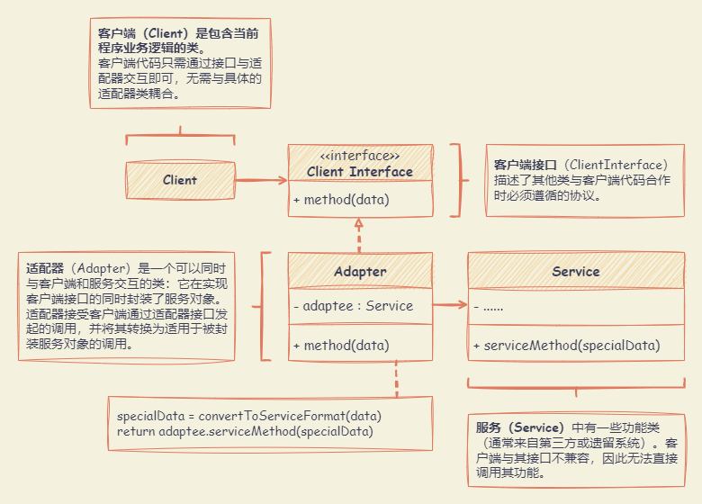
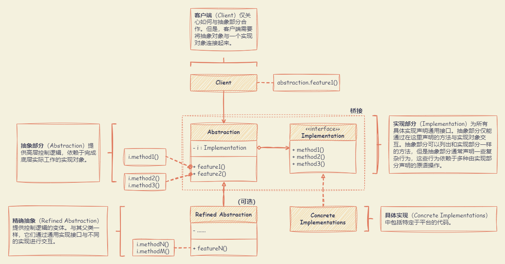
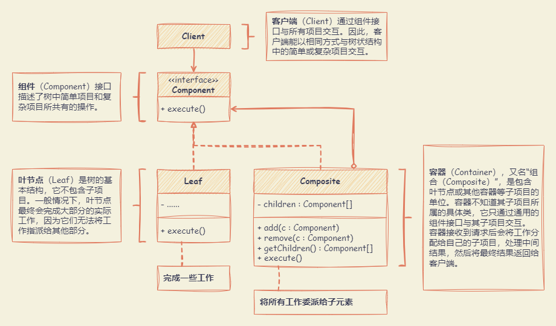
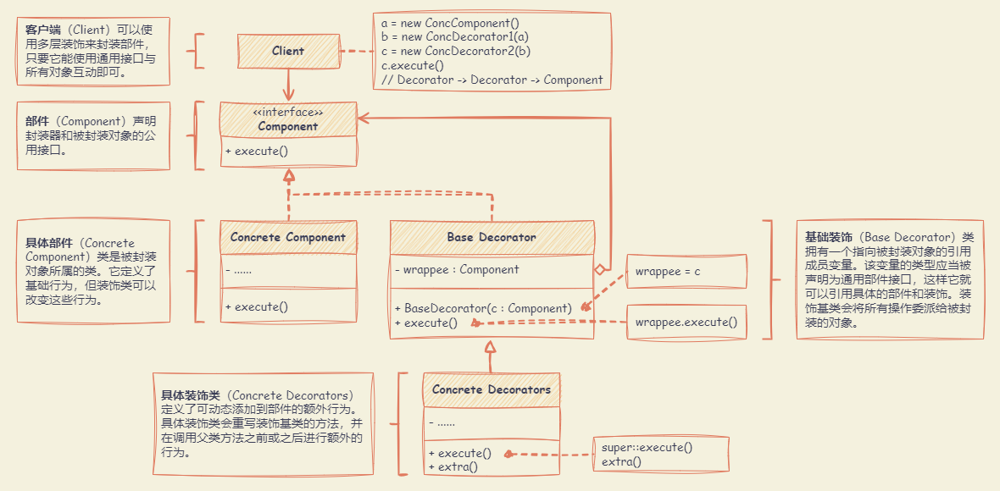
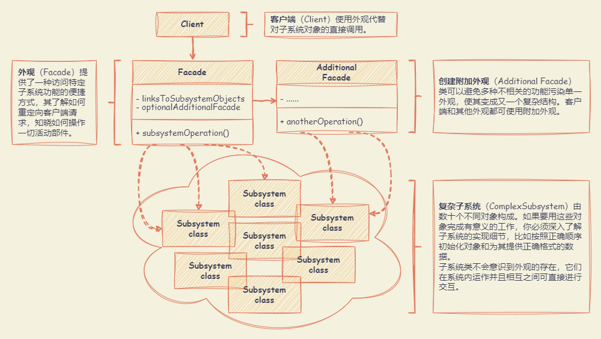
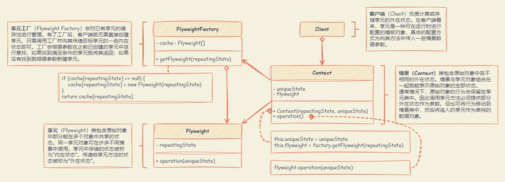
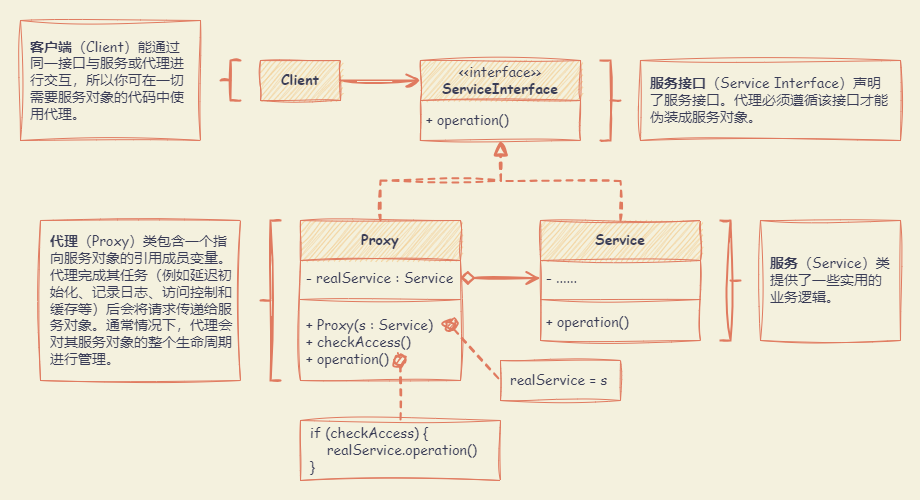

# 结构型设计模式

结构型模式介绍如何将对象和类组装成较大的结构，并同时保持结构的灵活和高效。

## 适配器模式 （Adapter）

**能使接口不兼容的对象能够相互合作。**

适合应用场景：

- 希望使用某个类，但是其接口与其他代码不兼容时，可以使用适配器类。适配器模式允许创建一个中间层类，其可作为代码与遗留类、第三方类或提供怪异接口的类之间的转换器。
- 需要复用这样一些类，他们处于同一个继承体系，并且他们又有了额外的一些共同的方法，但是这些共同的方法不是所有在这一继承体系中的子类所具有的共性。可以将缺少功能的对象封装在适配器中，从而动态地获取所需功能。

优点：

- 单一职责原则。可以将接口或数据转换代码从程序主要业务逻辑中分离。
- 开闭原则。只要客户端代码通过客户端接口与适配器进行交互，就能在不修改现有客户端代码的情况下在程序中添加新类型的适配器。

缺点：

- 代码整体复杂度增加，因为需要新增一系列接口和类。有时直接更改服务类使其与其他代码兼容会更简单。



:::: details 代码示例

::: code-tabs#language

@tab js

```js
class Target {
  request() {
    return "Target: The default target's behavior."
  }
}

class Adaptee {
  specificRequest() {
    return '.eetpadA eht fo roivaheb laicepS'
  }
}

class Adapter extends Target {
  constructor(adaptee) {
    super()
    this.adaptee = adaptee
  }
  request() {
    const result = this.adaptee.specificRequest().split('').reverse().join('')
    return `Adapter: (TRANSLATED) ${result}`
  }
}

function clientCode(target) {
  console.log(target.request())
}

console.log('Client: I can work just fine with the Target objects:')
const target = new Target()
clientCode(target)

const adaptee = new Adaptee()
console.log("Client: The Adaptee class has a weird interface. See, I don't understand it:")
console.log(`Adaptee: ${adaptee.specificRequest()}`)

console.log('Client: But I can work with it via the Adapter:')
const adapter = new Adapter(adaptee)
clientCode(adapter)
```

@tab ts

```ts
// 目标定义了客户端代码使用的特定域接口。
class Target {
  public request(): string {
    return "Target: The default target's behavior."
  }
}

// Adaptee 包含一些有用的行为，但其接口与现有的客户端代码不兼容。
// 在客户端代码使用 Adaptee 之前，需要对其进行一些调整。
class Adaptee {
  public specificRequest(): string {
    return '.eetpadA eht fo roivaheb laicepS'
  }
}

// 适配器使 Adaptee 的接口与 Target 的接口兼容。
class Adapter extends Target {
  private adaptee: Adaptee

  constructor(adaptee: Adaptee) {
    super()
    this.adaptee = adaptee
  }

  public request(): string {
    const result = this.adaptee.specificRequest().split('').reverse().join('')
    return `Adapter: (TRANSLATED) ${result}`
  }
}

// 客户端代码支持所有遵循目标接口的类。
function clientCode(target: Target) {
  console.log(target.request())
}

console.log('Client: I can work just fine with the Target objects:')
const target = new Target()
clientCode(target)

const adaptee = new Adaptee()
console.log("Client: The Adaptee class has a weird interface. See, I don't understand it:")
console.log(`Adaptee: ${adaptee.specificRequest()}`)

console.log('Client: But I can work with it via the Adapter:')
const adapter = new Adapter(adaptee)
clientCode(adapter)
```

:::

::::

## 桥接模式 （Bridge）

**将一个大类或一系列紧密相关的类拆分为抽象和实现两个独立的层次结构，从而能在开发时分别使用。**

适合应用场景：

- 拆分或重组一个具有多重功能的庞杂类（例如，能与多个数据库服务器进行交互的类）时，可使用桥接模式。
- 在几个独立维度上扩展一个类时，可使用桥接模式。桥接建议将每个维度抽取为独立的类层次。初始类将相关工作委派给属于对应类层次的对象，无需自己完成所有工作。
- 需要在运行时切换不同实现方法，可使用桥接模式。

优点：

- 可以创建与平台无关的类和程序。
- 客户端代码仅与高层抽象部分进行互动，不会接触到平台的详细信息。
- 开闭原则。可以新增抽象部分和实现部分，且它们之间不会相互影响。
- 单一职责原则。抽象部分专注于处理高层逻辑，实现部分处理平台细节。

缺点：

- 对高内聚的类使用该模式可能会让代码更加复杂。



:::: details 代码示例

::: code-tabs#language

@tab js

```js
class Abstraction {
  constructor(implementation) {
    this.implementation = implementation
  }

  operation() {
    const result = this.implementation.operationImplementation()
    return `Abstraction: Base operation with:\n${result}`
  }
}

class ExtendedAbstraction extends Abstraction {
  operation() {
    const result = this.implementation.operationImplementation()
    return `ExtendedAbstraction: Extended operation with:\n${result}`
  }
}

class ConcreteImplementationA {
  operationImplementation() {
    return "ConcreteImplementationA: Here's the result on the platform A."
  }
}

class ConcreteImplementationB {
  operationImplementation() {
    return "ConcreteImplementationB: Here's the result on the platform B."
  }
}

function clientCode(abstraction) {
  // ..
  console.log(abstraction.operation())
  // ..
}

let implementation = new ConcreteImplementationA()
let abstraction = new Abstraction(implementation)
clientCode(abstraction)

implementation = new ConcreteImplementationB()
abstraction = new ExtendedAbstraction(implementation)
clientCode(abstraction)
```

@tab ts

```ts
// 抽象定义了两个类层次结构中 "控制 "部分的接口。
// 它维护对实现层次结构对象的引用，并将所有实际工作委托给该对象。
class Abstraction {
  protected implementation: Implementation

  constructor(implementation: Implementation) {
    this.implementation = implementation
  }

  public operation(): string {
    const result = this.implementation.operationImplementation()
    return `Abstraction: Base operation with:\n${result}`
  }
}

// 可以在不改变实现类的情况下扩展抽象类。
class ExtendedAbstraction extends Abstraction {
  public operation(): string {
    const result = this.implementation.operationImplementation()
    return `ExtendedAbstraction: Extended operation with:\n${result}`
  }
}

// 实现定义了所有实现类的接口。不必与抽象的接口相匹配。事实上，这两个接口可以完全不同。
// 通常，实现接口只提供基本操作，而抽象接口则根据这些基本操作定义更高级别的操作。
interface Implementation {
  operationImplementation(): string
}

// 每个具体实现都对应一个特定的平台，并使用该平台的应用程序接口实现实现接口。
class ConcreteImplementationA implements Implementation {
  public operationImplementation(): string {
    return "ConcreteImplementationA: Here's the result on the platform A."
  }
}

class ConcreteImplementationB implements Implementation {
  public operationImplementation(): string {
    return "ConcreteImplementationB: Here's the result on the platform B."
  }
}

// 在初始化阶段，抽象对象会与特定的实现对象建立链接，除此之外，客户端代码只能依赖于抽象类。
// 这样，客户端代码就能支持任何抽象与实现的组合。
function clientCode(abstraction: Abstraction) {
  // ..

  console.log(abstraction.operation())
  // ..
}

// 客户端代码应能与任何预配置的抽象-实现组合一起工作。
let implementation = new ConcreteImplementationA()
let abstraction = new Abstraction(implementation)
clientCode(abstraction)

implementation = new ConcreteImplementationB()
abstraction = new ExtendedAbstraction(implementation)
clientCode(abstraction)
```

:::

::::

## 组合模式 （Composite）

**可以将对象组合成树状结构，并且能像使用独立对象一样使用它们。**

适合应用场景：

- 需要实现树状对象结构，可以使用组合模式。该模式提供了两种共享公共接口的基本元素类型：简单叶节点和复杂容器。容器中可以包含叶节点和其他容器。可以构建树状嵌套递归对象结构。
- 希望客户端代码以相同方式处理简单和复杂元素时，可以使用组合模式。该模式定义的所有元素共用同一个接口。在这一接口下，客户端不必在意其所使用的对象的具体类。

优点：

- 可以利用多态和递归机制更方便地使用复杂树结构。
- 开闭原则。无需更改现有代码，就可以在应用中添加新元素，使其成为对象树的一部分。

缺点：

- 对于功能差异较大的类，提供公共接口或许会有困难。在特定情况下，需要过度一般化组件接口，使其变得令人难以理解。



:::: details 代码示例

::: code-tabs#language

@tab js

```js
class Component {
  setParent(parent) {
      this.parent = parent;
  }
  getParent() {
      return this.parent;
  }
  add(component) { }
  remove(component) { }
  isComposite() {
      return false;
  }
}

class Leaf extends Component {
  operation() {
      return 'Leaf';
  }
}

class Composite extends Component {
  constructor() {
      super(...arguments);
      this.children = [];
  }
  add(component) {
      this.children.push(component);
      component.setParent(this);
  }
  remove(component) {
      const componentIndex = this.children.indexOf(component);
      this.children.splice(componentIndex, 1);
      component.setParent(null);
  }
  isComposite() {
      return true;
  }
  operation() {
      const results = [];
      for (const child of this.children) {
          results.push(child.operation());
      }
      return `Branch(${results.join('+')})`;
  }
}

function clientCode(component) {
  // ...
  console.log(`RESULT: ${component.operation()}`);
  // ...
}

const simple = new Leaf();
console.log('Client: I\'ve got a simple component:');
clientCode(simple);

const tree = new Composite();
const branch1 = new Composite();
branch1.add(new Leaf());
branch1.add(new Leaf());
const branch2 = new Composite();
branch2.add(new Leaf());
tree.add(branch1);
tree.add(branch2);
console.log('Client: Now I\'ve got a composite tree:');
clientCode(tree);

function clientCode2(component1, component2) {
  // ...
  if (component1.isComposite()) {
      component1.add(component2);
  }
  console.log(`RESULT: ${component1.operation()}`);
  // ...
}

console.log('Client: I don\'t need to check the components classes even when managing the tree:');
clientCode2(tree, simple);
```

@tab ts

```ts
// 基本组件类声明了组合中简单对象和复杂对象的通用操作。
abstract class Component {
  protected parent!: Component | null

  // 作为选项，基本组件可以声明一个接口，用于设置和访问树形结构中组件的父对象。它还可以为这些方法提供一些默认实现。
  public setParent(parent: Component | null) {
    this.parent = parent
  }

  public getParent(): Component | null {
    return this.parent
  }

  // 在某些情况下，在基组件类中直接定义子组件管理操作会很有好处。
  // 这样，即使在对象树组装过程中，也无需向客户端代码公开任何具体的组件类。
  // 缺点是叶级组件的这些方法将是空的。
  public add(component: Component): void {}

  public remove(component: Component): void {}

  // 可以提供一种方法，让客户端代码知道组件是否可以有子组件。
  public isComposite(): boolean {
    return false
  }

  // 基础组件可以实现一些默认行为，也可以将其留给具体类来处理（将包含该行为的方法声明为 "抽象"）。
  public abstract operation(): string
}

// 叶子类代表组件的终端对象。叶子不能有任何子对象。
// 通常，Leaf 对象执行实际工作，而 Composite 对象只委托其子组件执行工作。
class Leaf extends Component {
  public operation(): string {
    return 'Leaf'
  }
}

// 复合类代表可能有子节点的复杂组件。
// 通常，复合对象将实际工作委托给其子对象，然后 "汇总 "结果。
class Composite extends Component {
  protected children: Component[] = []

  // 复合对象可以在其子对象列表中添加或删除其他组件（包括简单或复杂组件）。
  public add(component: Component): void {
    this.children.push(component)
    component.setParent(this)
  }

  public remove(component: Component): void {
    const componentIndex = this.children.indexOf(component)
    this.children.splice(componentIndex, 1)

    component.setParent(null)
  }

  public isComposite(): boolean {
    return true
  }

  // 复合对象以特定的方式执行其主要逻辑。
  // 它以递归方式遍历所有子对象，收集并汇总它们的结果。
  // 由于复合元素的子元素会将这些调用传递给它们的子元素，因此整个对象树都会被遍历。
  public operation(): string {
    const results = []
    for (const child of this.children) {
      results.push(child.operation())
    }

    return `Branch(${results.join('+')})`
  }
}

// 客户端代码通过基本接口与所有组件协同工作。
function clientCode(component: Component) {
  // ...

  console.log(`RESULT: ${component.operation()}`)

  // ...
}

// 这样，客户端代码就能支持简单的叶组件以及复杂的复合组件
const simple = new Leaf()
console.log("Client: I've got a simple component:")
clientCode(simple)

const tree = new Composite()
const branch1 = new Composite()
branch1.add(new Leaf())
branch1.add(new Leaf())
const branch2 = new Composite()
branch2.add(new Leaf())
tree.add(branch1)
tree.add(branch2)
console.log("Client: Now I've got a composite tree:")
clientCode(tree)

// 由于子代管理操作是在基本组件类中声明的
// 因此客户端代码可以与任何组件（简单或复杂）协同工作，而无需依赖于它们的具体类。
function clientCode2(component1: Component, component2: Component) {
  // ...

  if (component1.isComposite()) {
    component1.add(component2)
  }
  console.log(`RESULT: ${component1.operation()}`)

  // ...
}

console.log("Client: I don't need to check the components classes even when managing the tree:")
clientCode2(tree, simple)
```

:::

::::

## 装饰模式 （Decorator）

**通过将对象放入包含行为的特殊封装对象中来为原对象绑定新的行为。**

适合应用场景：

- 在无需修改代码的情况下即可使用对象，且希望在运行时为对象新增额外的行为，可以使用装饰模式。装饰能将业务逻辑组织为层次结构，可为各层创建一个装饰，在运行时将各种不同逻辑组合成对象。由于这些对象都遵循通用接口，客户端代码能以相同的方式使用这些对象。
- 用继承来扩展对象行为的方案难以实现或者根本不可行， 可以使用装饰模式。

优点：

- 无需创建新子类即可扩展对象的行为。
- 可以在运行时添加或删除对象的功能。
- 可以用多个装饰封装对象来组合几种行为。
- 单一职责原则。可以将实现了许多不同行为的一个大类拆分为多个较小的类。

缺点：

- 在封装器栈中删除特定封装器比较困难。
- 实现行为不受装饰栈顺序影响的装饰比较困难。
- 各层的初始化配置代码看上去可能会很糟糕。



:::: details 代码示例

::: code-tabs#language

@tab js

```js
class ConcreteComponent {
  operation() {
    return 'ConcreteComponent'
  }
}

class Decorator {
  constructor(component) {
    this.component = component
  }
  operation() {
    return this.component.operation()
  }
}

class ConcreteDecoratorA extends Decorator {
  operation() {
    return `ConcreteDecoratorA(${super.operation()})`
  }
}

class ConcreteDecoratorB extends Decorator {
  operation() {
    return `ConcreteDecoratorB(${super.operation()})`
  }
}

function clientCode(component) {
  // ...
  console.log(`RESULT: ${component.operation()}`)
  // ...
}

const simple = new ConcreteComponent()
console.log("Client: I've got a simple component:")
clientCode(simple)

const decorator1 = new ConcreteDecoratorA(simple)
const decorator2 = new ConcreteDecoratorB(decorator1)
console.log("Client: Now I've got a decorated component:")
clientCode(decorator2)
```

@tab ts

```ts
// 基本组件接口定义了可由装饰器改变的操作。
interface Component {
  operation(): string
}

// 具体组件提供了这些操作的默认实现。这些类可能有多种变体。
class ConcreteComponent implements Component {
  public operation(): string {
    return 'ConcreteComponent'
  }
}

// 基础装饰器类遵循与其他组件相同的接口。
// 该类的主要目的是为所有具体装饰器定义封装接口。
// 封装代码的默认实现可能包括一个用于存储封装组件的字段和初始化组件的方法。
class Decorator implements Component {
  protected component: Component

  constructor(component: Component) {
    this.component = component
  }

  // 装饰器将所有工作委托给被包装的组件。
  public operation(): string {
    return this.component.operation()
  }
}

// 具体装饰器调用被包装对象，并以某种方式改变其结果。
class ConcreteDecoratorA extends Decorator {

  // 装饰器可以调用操作的父实现，而不是直接调用封装对象。
  // 这种方法简化了装饰器类的扩展。
  public operation(): string {
    return `ConcreteDecoratorA(${super.operation()})`
  }
}

// 装饰器可以在调用封装对象之前或之后执行其行为。
class ConcreteDecoratorB extends Decorator {
  public operation(): string {
    return `ConcreteDecoratorB(${super.operation()})`
  }
}

// 客户端代码可与所有使用组件接口的对象协同工作。
// 这样，客户端代码就可以独立于它所使用的组件的具体类。
function clientCode(component: Component) {
  // ...

  console.log(`RESULT: ${component.operation()}`)

  // ...
}

// 客户端代码既能支持简单组件，也能支持装饰组件。
// 装饰器不仅可以封装简单的组件，还可以封装其他装饰器。
const simple = new ConcreteComponent()
console.log("Client: I've got a simple component:")
clientCode(simple)

const decorator1 = new ConcreteDecoratorA(simple)
const decorator2 = new ConcreteDecoratorB(decorator1)
console.log("Client: Now I've got a decorated component:")
clientCode(decorator2)
```

:::

::::

## 外观模式 （Facade）

**能为程序库、框架或其他复杂类提供一个简单的接口。**

适合应用场景：

- 需要一个指向复杂子系统的直接接口，且该接口的功能有限，可以使用外观模式。
- 需要将子系统组织为多层结构，可以使用外观模式。创建外观来定义子系统中各层次的入口。可以要求子系统仅使用外观来进行交互，以减少子系统之间的耦合。

- 优点：可以让代码独立于复杂子系统。

- 缺点：外观可能成为与程序中所有类都耦合的上帝对象。



:::: details 代码示例

::: code-tabs#language

@tab js

```js
class Facade {
  constructor(subsystem1, subsystem2) {
    this.subsystem1 = subsystem1 || new Subsystem1()
    this.subsystem2 = subsystem2 || new Subsystem2()
  }
  operation() {
    let result = 'Facade initializes subsystems:\n'
    result += this.subsystem1.operation1()
    result += this.subsystem2.operation1()
    result += 'Facade orders subsystems to perform the action:\n'
    result += this.subsystem1.operationN()
    result += this.subsystem2.operationZ()
    return result
  }
}

class Subsystem1 {
  operation1() {
    return 'Subsystem1: Ready!\n'
  }
  // ...
  operationN() {
    return 'Subsystem1: Go!\n'
  }
}

class Subsystem2 {
  operation1() {
    return 'Subsystem2: Get ready!\n'
  }
  // ...
  operationZ() {
    return 'Subsystem2: Fire!'
  }
}

function clientCode(facade) {
  // ...
  console.log(facade.operation())
  // ...
}

const subsystem1 = new Subsystem1()
const subsystem2 = new Subsystem2()
const facade = new Facade(subsystem1, subsystem2)
clientCode(facade)
```

@tab ts

```ts
// Facade 类为一个或多个子系统的复杂逻辑提供了一个简单的接口。
// Facade 将客户端请求委托给子系统内的相应对象。
// Facade 还负责管理它们的生命周期。所有这些都使客户端免受子系统复杂性的影响。
class Facade {
  protected subsystem1: Subsystem1

  protected subsystem2: Subsystem2

  // 根据应用程序的需要，可以向 Facade 提供现有的子系统对象，也可以强制 Facade 自行创建这些对象。
  constructor(subsystem1?: Subsystem1, subsystem2?: Subsystem2) {
    this.subsystem1 = subsystem1 || new Subsystem1()
    this.subsystem2 = subsystem2 || new Subsystem2()
  }

  // Facade 的方法是通向子系统复杂功能的便捷捷径。
  // 然而，客户端只能使用子系统功能的一小部分。
  public operation(): string {
    let result = 'Facade initializes subsystems:\n'
    result += this.subsystem1.operation1()
    result += this.subsystem2.operation1()
    result += 'Facade orders subsystems to perform the action:\n'
    result += this.subsystem1.operationN()
    result += this.subsystem2.operationZ()

    return result
  }
}

// 子系统可以直接接受来自界面或客户端的请求。
// 无论如何，对于子系统来说，Facade 只是另一个客户端，而不是子系统的一部分。
class Subsystem1 {
  public operation1(): string {
    return 'Subsystem1: Ready!\n'
  }

  // ...

  public operationN(): string {
    return 'Subsystem1: Go!\n'
  }
}

// 某些界面可以同时与多个子系统协同工作。
class Subsystem2 {
  public operation1(): string {
    return 'Subsystem2: Get ready!\n'
  }

  // ...

  public operationZ(): string {
    return 'Subsystem2: Fire!'
  }
}

// 客户端代码通过 Facade 提供的简单接口与复杂的子系统协同工作。
// 当一个分界面管理子系统的生命周期时，客户端可能根本不知道子系统的存在。
// 这种方法可以让复杂性得到控制。
function clientCode(facade: Facade) {
  // ...

  console.log(facade.operation())

  // ...
}

// 客户端代码可能已经创建了子系统的某些对象。
// 在这种情况下，值得用这些对象初始化 Facade，而不是让 Facade 创建新实例。
const subsystem1 = new Subsystem1()
const subsystem2 = new Subsystem2()
const facade = new Facade(subsystem1, subsystem2)
clientCode(facade)
```

:::

::::

## 享元模式 （Flyweight）

**摒弃了在每个对象中保存所有数据的方式，通过共享多个对象所共有的相同状态，能在有限的内存容量中载入更多对象。**

适合应用场景：

- 仅在程序必须支持大量对象且没有足够的内存容量时使用享元模式。应用该模式所获的收益大小取决于使用它的方式和情景。它在下列情况中最有效：
  - 程序需要生成数量巨大的相似对象
  - 将耗尽目标设备的所有内存
  - 对象中包含可抽取且能在多个对象间共享的重复状态

优点：如果程序中有很多相似对象，将可以节省大量内存。

缺点：

- 需要牺牲执行速度来换取内存，因为他人每次调用享元方法时都需要重新计算部分情景数据。
- 代码会变得更加复杂。



:::: details 代码示例

::: code-tabs#language

@tab js

```js
class Flyweight {
  constructor(sharedState) {
    this.sharedState = sharedState
  }
  operation(uniqueState) {
    const s = JSON.stringify(this.sharedState)
    const u = JSON.stringify(uniqueState)
    console.log(`Flyweight: Displaying shared (${s}) and unique (${u}) state.`)
  }
}

class FlyweightFactory {
  constructor(initialFlyweights) {
    this.flyweights = {}
    for (const state of initialFlyweights) {
      this.flyweights[this.getKey(state)] = new Flyweight(state)
    }
  }
  getKey(state) {
    return state.join('_')
  }
  getFlyweight(sharedState) {
    const key = this.getKey(sharedState)
    if (!(key in this.flyweights)) {
      console.log("FlyweightFactory: Can't find a flyweight, creating new one.")
      this.flyweights[key] = new Flyweight(sharedState)
    } else {
      console.log('FlyweightFactory: Reusing existing flyweight.')
    }
    return this.flyweights[key]
  }
  listFlyweights() {
    const count = Object.keys(this.flyweights).length
    console.log(`\nFlyweightFactory: I have ${count} flyweights:`)
    for (const key in this.flyweights) {
      console.log(key)
    }
  }
}

const factory = new FlyweightFactory([
  ['Chevrolet', 'Camaro2018', 'pink'],
  ['Mercedes Benz', 'C300', 'black'],
  ['Mercedes Benz', 'C500', 'red'],
  ['BMW', 'M5', 'red'],
  ['BMW', 'X6', 'white'],
  // ...
])

factory.listFlyweights()

// ...

function addCarToPoliceDatabase(ff, plates, owner, brand, model, color) {
  console.log('\nClient: Adding a car to database.')
  const flyweight = ff.getFlyweight([brand, model, color])
  flyweight.operation([plates, owner])
}

addCarToPoliceDatabase(factory, 'CL234IR', 'James Doe', 'BMW', 'M5', 'red')
addCarToPoliceDatabase(factory, 'CL234IR', 'James Doe', 'BMW', 'X1', 'red')
factory.listFlyweights()
```

@tab ts

```ts
// Flyweight 存储了属于多个真实业务实体的共同部分状态（也称为内在状态）。
// Flyweight 通过其方法参数接受其余状态（外在状态，每个实体独有）。
class Flyweight {
  private sharedState: any

  constructor(sharedState: any) {
    this.sharedState = sharedState
  }

  public operation(uniqueState): void {
    const s = JSON.stringify(this.sharedState)
    const u = JSON.stringify(uniqueState)
    console.log(`Flyweight: Displaying shared (${s}) and unique (${u}) state.`)
  }
}

// Flyweight 工厂创建并管理 Flyweight 对象。它确保正确共享 Flyweight。
// 当客户请求一个 Flyweight 时，工厂要么返回一个现有实例，要么创建一个新实例（如果还不存在）。
class FlyweightFactory {
  private flyweights: { [key: string]: Flyweight } = <any>{}

  constructor(initialFlyweights: string[][]) {
    for (const state of initialFlyweights) {
      this.flyweights[this.getKey(state)] = new Flyweight(state)
    }
  }

  // 返回给定状态的 Flyweight 字符串哈希值。
  private getKey(state: string[]): string {
    return state.join('_')
  }

  // 返回具有给定状态的现有 Flyweight 或创建一个新的 Flyweight。
  public getFlyweight(sharedState: string[]): Flyweight {
    const key = this.getKey(sharedState)

    if (!(key in this.flyweights)) {
      console.log("FlyweightFactory: Can't find a flyweight, creating new one.")
      this.flyweights[key] = new Flyweight(sharedState)
    } else {
      console.log('FlyweightFactory: Reusing existing flyweight.')
    }

    return this.flyweights[key]
  }

  public listFlyweights(): void {
    const count = Object.keys(this.flyweights).length
    console.log(`\nFlyweightFactory: I have ${count} flyweights:`)
    for (const key in this.flyweights) {
      console.log(key)
    }
  }
}

// 客户端代码通常会在应用程序的初始化阶段创建一堆预填充的 Flyweight。
const factory = new FlyweightFactory([
  ['Chevrolet', 'Camaro2018', 'pink'],
  ['Mercedes Benz', 'C300', 'black'],
  ['Mercedes Benz', 'C500', 'red'],
  ['BMW', 'M5', 'red'],
  ['BMW', 'X6', 'white'],
  // ...
])
factory.listFlyweights()

// ...

function addCarToPoliceDatabase(
  ff: FlyweightFactory,
  plates: string,
  owner: string,
  brand: string,
  model: string,
  color: string
) {
  console.log('\nClient: Adding a car to database.')
  const flyweight = ff.getFlyweight([brand, model, color])

  // 客户端代码会存储或计算外在状态，并将其传递给 Flyweight 方法。
  flyweight.operation([plates, owner])
}

addCarToPoliceDatabase(factory, 'CL234IR', 'James Doe', 'BMW', 'M5', 'red')

addCarToPoliceDatabase(factory, 'CL234IR', 'James Doe', 'BMW', 'X1', 'red')

factory.listFlyweights()
```

:::

::::

## 代理模式 （Proxy）

**能够提供对象的替代品或其占位符。代理控制着对于原对象的访问，并允许在将请求提交给对象前后进行一些处理。**

适合应用场景：

- 延迟初始化（虚拟代理）。如果有一个偶尔使用的重量级服务对象，一直保持该对象运行会消耗系统资源时，可使用代理模式。无需在程序启动时就创建该对象，可将对象的初始化延迟到真正有需要的时候。
- 访问控制（保护代理）。如果只希望特定客户端使用服务对象，这里的对象可以是操作系统中非常重要的部分，而客户端则是各种已启动的程序（包括恶意程序），此时可使用代理模式。代理可仅在客户端凭据满足要求时将请求传递给服务对象。
- 本地执行远程服务（远程代理）。适用于服务对象位于远程服务器上的情形。代理通过网络传递客户端请求，负责处理所有与网络相关的复杂细节。
- 记录日志请求（日志记录代理）。适用于需要保存对于服务对象的请求历史记录时。代理可以在向服务传递请求前进行记录。缓存请求结果（缓存代理）。适用于需要缓存客户请求结果并对缓存生命周期进行管理时，特别是当返回结果的体积非常大时。代理可对重复请求所需的相同结果进行缓存，还可使用请求参数作为索引缓存的键值。
- 智能引用。可在没有客户端使用某个重量级对象时立即销毁该对象。代理会将所有获取了指向服务对象或其结果的客户端记录在案。代理会时不时地遍历各个客户， 检查它们是否仍在运行。如果相应的客户端列表为空，代理就会销毁该服务对象，释放底层系统资源。代理还可以记录客户端是否修改了服务对象。其他客户端还可以复用未修改的对象。

优点：

- 可以在客户端毫无察觉的情况下控制服务对象。
- 客户端对服务对象的生命周期没有特殊要求，可以对生命周期进行管理。
- 即使服务对象还未准备好或不存在，代理也可以正常工作。
- 开闭原则。可以在不对服务或客户端做出修改的情况下创建新代理。

缺点：

- 代码可能会变得复杂，因为需要新建许多类。
- 服务响应可能会延迟。



:::: details 代码示例

::: code-tabs#language

@tab js

```js
class RealSubject {
  request() {
    console.log('RealSubject: Handling request.')
  }
}
class Proxy {
  constructor(realSubject) {
    this.realSubject = realSubject
  }
  request() {
    if (this.checkAccess()) {
      this.realSubject.request()
      this.logAccess()
    }
  }
  checkAccess() {
    console.log('Proxy: Checking access prior to firing a real request.')
    return true
  }
  logAccess() {
    console.log('Proxy: Logging the time of request.')
  }
}
function clientCode(subject) {
  // ...
  subject.request()
  // ...
}
console.log('Client: Executing the client code with a real subject:')
const realSubject = new RealSubject()
clientCode(realSubject)

console.log('Client: Executing the same client code with a proxy:')
const proxy = new Proxy(realSubject)
clientCode(proxy)
```

@tab ts

```ts
// 主体接口声明了 RealSubject 和代理的共同操作。
// 只要客户端使用此接口与 RealSubject 协作，就可以将代理而不是真实主题传递给客户端。
interface Subject {
  request(): void
}

// RealSubject 包含一些核心业务逻辑。
// 通常，RealSubjects 能够执行一些有用的工作，但也可能非常缓慢或敏感 
// 例如，校正输入数据。代理可以解决这些问题，而无需修改 RealSubject 的代码。
class RealSubject implements Subject {
  public request(): void {
    console.log('RealSubject: Handling request.')
  }
}

// 代理的接口与 RealSubject 相同。
class Proxy implements Subject {
  private realSubject: RealSubject

  // 代理维护一个指向 RealSubject 类对象的引用。
  // 它可以是懒加载的，也可以是客户端传递给代理的。
  constructor(realSubject: RealSubject) {
    this.realSubject = realSubject
  }

  // 代理模式最常见的应用是懒加载、缓存、控制访问、日志记录等。
  // 代理可以执行这些操作之一，然后根据结果将执行结果传递给链接的 RealSubject 对象中的相同方法。
  public request(): void {
    if (this.checkAccess()) {
      this.realSubject.request()
      this.logAccess()
    }
  }

  private checkAccess(): boolean {
    console.log('Proxy: Checking access prior to firing a real request.')

    return true
  }

  private logAccess(): void {
    console.log('Proxy: Logging the time of request.')
  }
}


// 客户端代码应该通过 "主体 "接口与所有对象（包括主体和代理）协同工作，以便同时支持真实主体和代理。
// 然而，在现实生活中，客户端大多是直接与真实主体一起工作的。
// 在这种情况下，为了更轻松地实现该模式，可以从真实主体的类中扩展代理。
function clientCode(subject: Subject) {
  // ...

  subject.request()

  // ...
}

console.log('Client: Executing the client code with a real subject:')
const realSubject = new RealSubject()
clientCode(realSubject)

console.log('Client: Executing the same client code with a proxy:')
const proxy = new Proxy(realSubject)
clientCode(proxy)
```

:::

::::
