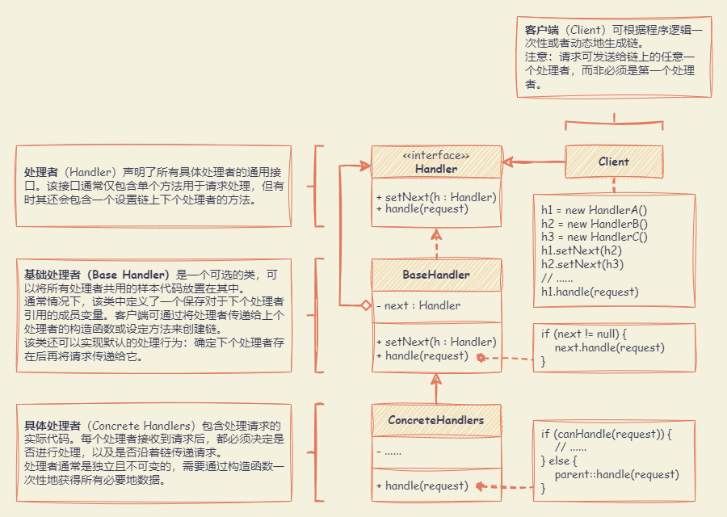
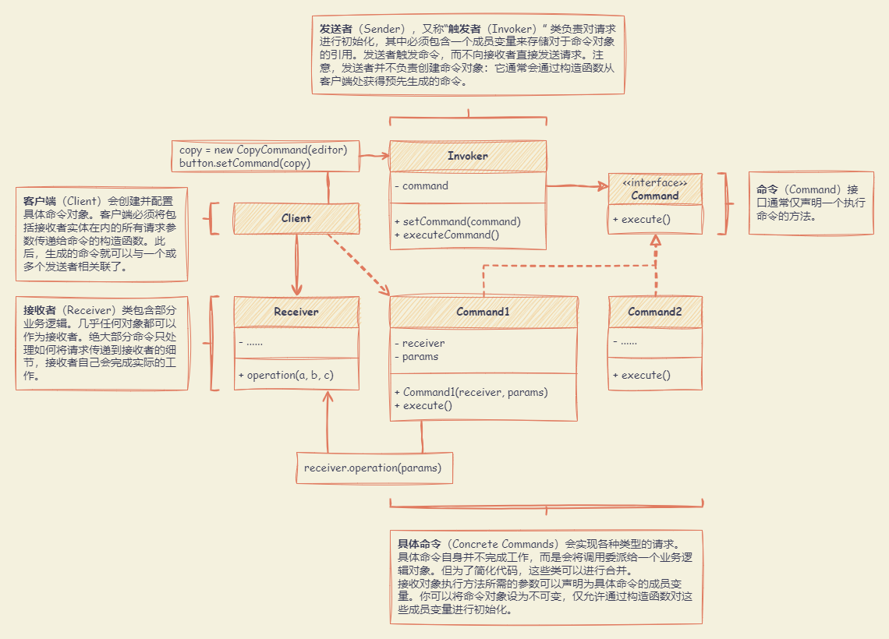
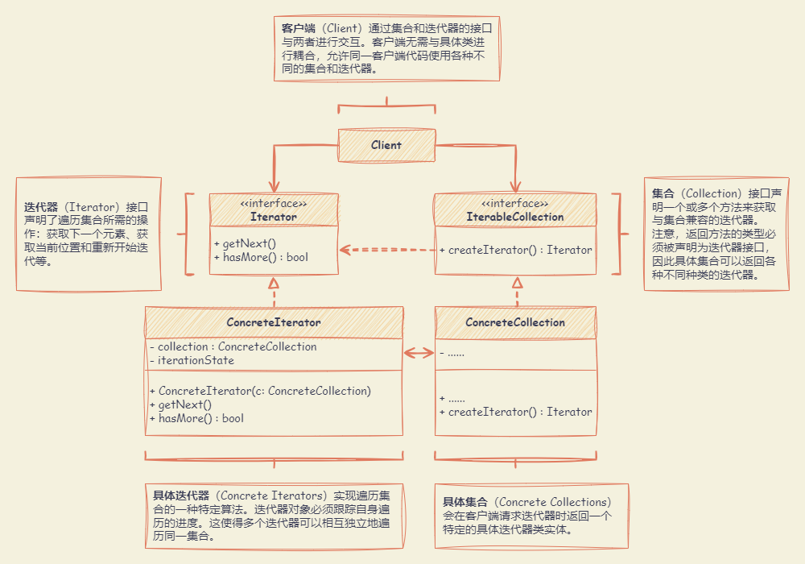
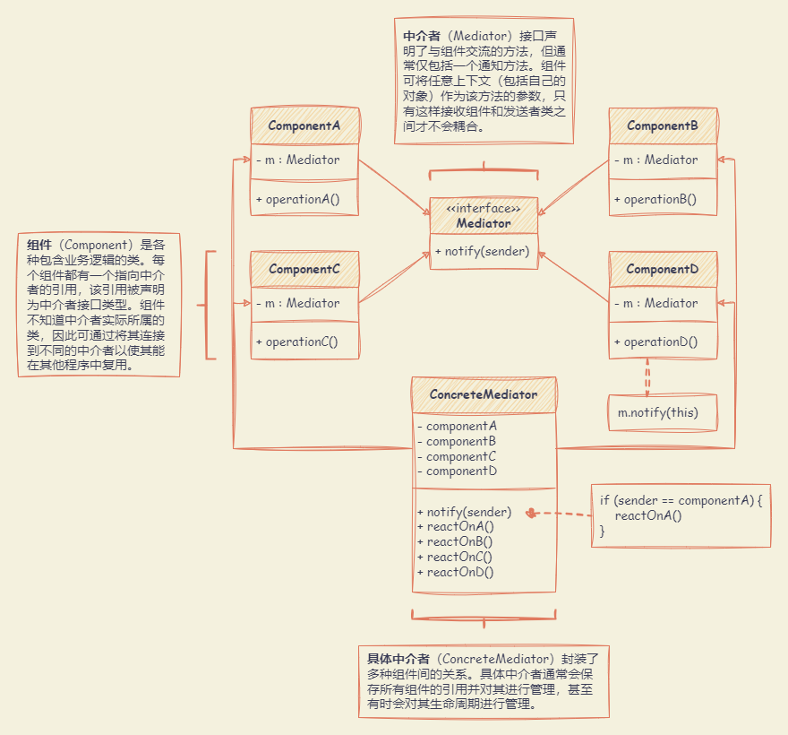
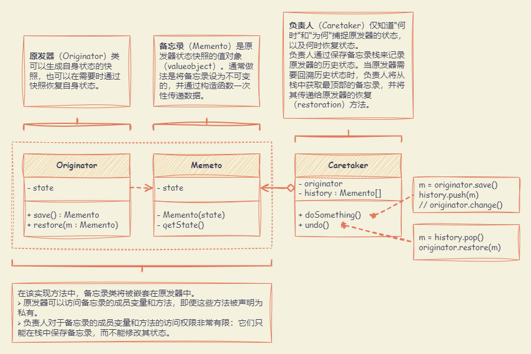
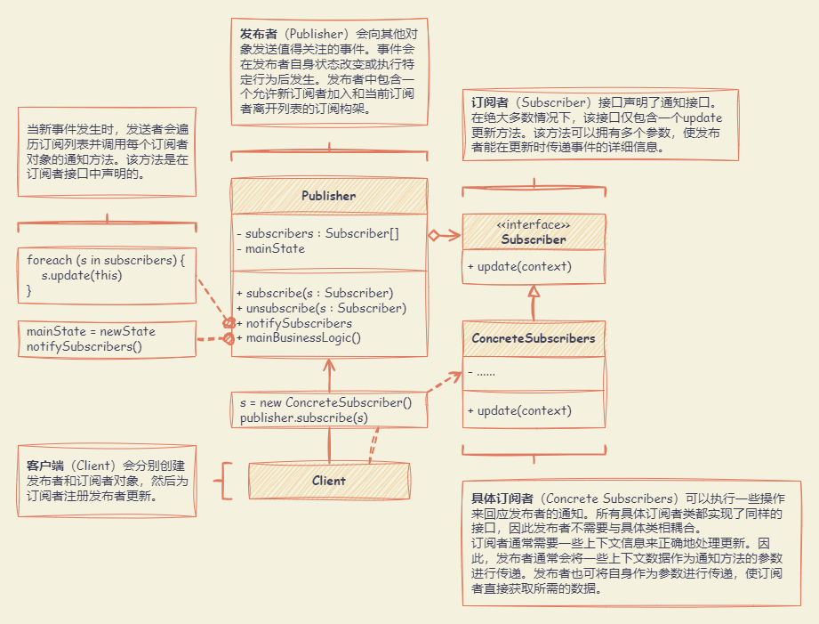
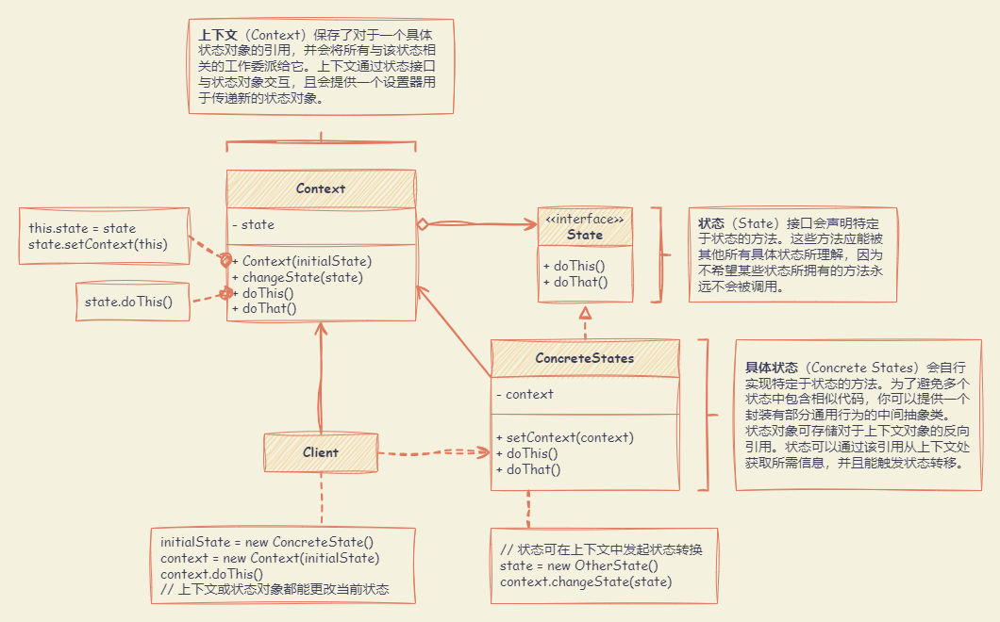
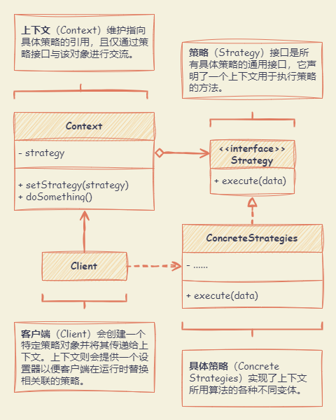
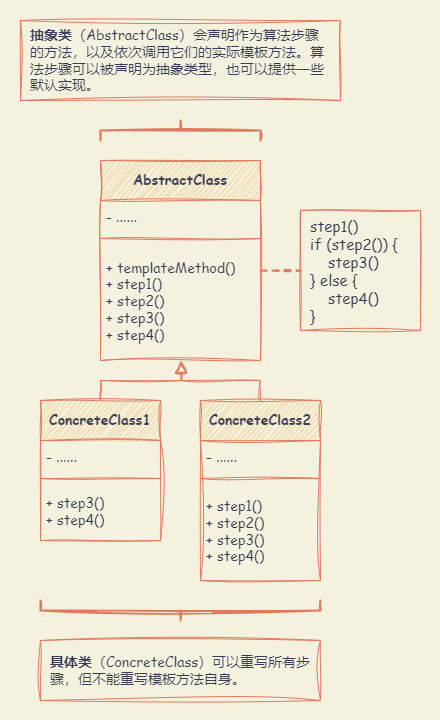
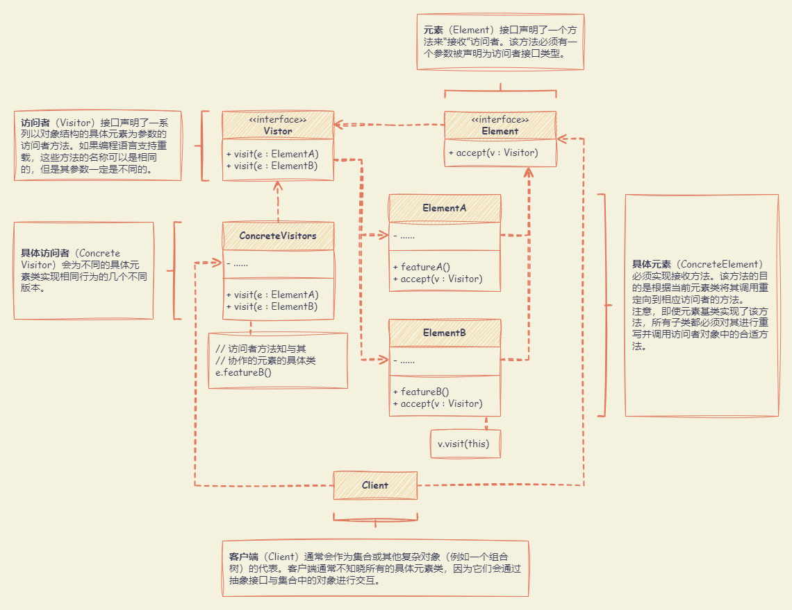

# 行为型设计模式

行为模式负责对象间的高效沟通和职责委派。

## 职责链模式 （Chain of Responsibility）

**允许将请求沿着处理者链进行发送。收到请求后，每个处理者均可对请求进行处理，或将其传递给链上的下个处理者。**

适合应用场景：

- 当程序需要使用不同方式处理不同种类请求，而且请求类型和顺序预先未知时，可以使用责任链模式。该模式能将多个处理者连接成一条链。接收到请求后，它会“询问”每个处理者是否能够对其进行处理。这样所有处理者都有机会来处理请求。
- 当必须按顺序执行多个处理者时，可以使用责任链模式。无论以何种顺序将处理者连接成一条链，所有请求都会严格按照顺序通过链上的处理者。
- 如果所需处理者及其顺序必须在运行时进行改变，可以使用责任链模式。如果在处理者类中有对引用成员变量的设定方法，将能动态地插入和移除处理者，或者改变其顺序。

优先：

- 可以控制请求处理的顺序。
- 单一职责原则。可对发起操作和执行操作的类进行解耦。
- 开闭原则。可以在不更改现有代码的情况下在程序中新增处理者。

缺点：部分请求可能未被处理。



:::: details 代码示例

::: code-tabs#language

@tab js

```js
class AbstractHandler {
  setNext(handler) {
    this.nextHandler = handler
    return handler
  }
  handle(request) {
    if (this.nextHandler) {
      return this.nextHandler.handle(request)
    }
    return null
  }
}

class MonkeyHandler extends AbstractHandler {
  handle(request) {
    if (request === 'Banana') {
      return `Monkey: I'll eat the ${request}.`
    }
    return super.handle(request)
  }
}

class SquirrelHandler extends AbstractHandler {
  handle(request) {
    if (request === 'Nut') {
      return `Squirrel: I'll eat the ${request}.`
    }
    return super.handle(request)
  }
}

class DogHandler extends AbstractHandler {
  handle(request) {
    if (request === 'MeatBall') {
      return `Dog: I'll eat the ${request}.`
    }
    return super.handle(request)
  }
}

function clientCode(handler) {
  const foods = ['Nut', 'Banana', 'Cup of coffee']
  for (const food of foods) {
    console.log(`Client: Who wants a ${food}?`)
    const result = handler.handle(food)
    if (result) {
      console.log(`  ${result}`)
    } else {
      console.log(`  ${food} was left untouched.`)
    }
  }
}

const monkey = new MonkeyHandler()
const squirrel = new SquirrelHandler()
const dog = new DogHandler()

monkey.setNext(squirrel).setNext(dog)

console.log('Chain: Monkey > Squirrel > Dog\n')
clientCode(monkey)

console.log('Subchain: Squirrel > Dog\n')
clientCode(squirrel)
```

@tab ts

```ts
// 处理程序接口声明了一个用于构建处理程序链的方法。
// 它还声明了一个执行请求的方法。
interface Handler {
  setNext(handler: Handler): Handler

  handle(request: string): string
}

// 默认的链行为可以在基本处理程序类中实现。
abstract class AbstractHandler implements Handler {
  private nextHandler: Handler

  public setNext(handler: Handler): Handler {
    this.nextHandler = handler

    // 从这里返回一个处理程序可以让我们以一种方便的方式链接处理程序，就像下面这样：
    // monkey.setNext(squirrel).setNext(dog)
    return handler
  }

  public handle(request: string): string {
    if (this.nextHandler) {
      return this.nextHandler.handle(request)
    }

    return null
  }
}

// 所有具体处理程序要么处理请求，要么将请求传递给链中的下一个处理程序。
class MonkeyHandler extends AbstractHandler {
  public handle(request: string): string {
    if (request === 'Banana') {
      return `Monkey: I'll eat the ${request}.`
    }
    return super.handle(request)
  }
}

class SquirrelHandler extends AbstractHandler {
  public handle(request: string): string {
    if (request === 'Nut') {
      return `Squirrel: I'll eat the ${request}.`
    }
    return super.handle(request)
  }
}

class DogHandler extends AbstractHandler {
  public handle(request: string): string {
    if (request === 'MeatBall') {
      return `Dog: I'll eat the ${request}.`
    }
    return super.handle(request)
  }
}

// 客户端代码通常适合使用单一处理程序。
// 在大多数情况下，它甚至不知道处理程序是链的一部分。
function clientCode(handler: Handler) {
  const foods = ['Nut', 'Banana', 'Cup of coffee']

  for (const food of foods) {
    console.log(`Client: Who wants a ${food}?`)

    const result = handler.handle(food)
    if (result) {
      console.log(`  ${result}`)
    } else {
      console.log(`  ${food} was left untouched.`)
    }
  }
}

// 客户端代码的另一部分构建了实际的链。
const monkey = new MonkeyHandler()
const squirrel = new SquirrelHandler()
const dog = new DogHandler()

monkey.setNext(squirrel).setNext(dog)

// 客户端应能向任何处理程序发送请求，而不仅仅是链中的第一个处理程序。
console.log('Chain: Monkey > Squirrel > Dog\n')
clientCode(monkey)

console.log('Subchain: Squirrel > Dog\n')
clientCode(squirrel)
```

:::

::::

## 命令模式 （Command）

**可将请求转换为一个包含与请求相关的所有信息的独立对象。该转换能根据不同的请求将方法参数化、延迟请求执行或将其放入队列中，且能实现可撤销操作。**

适合应用场景：

- 需要通过操作来参数化对象，可使用命令模式。该模式可将特定的方法调用转化为独立对象。可以将命令作为方法的参数进行传递、将命令保存在其他对象中，或者在运行时切换已连接的命令等。
- 将操作放入队列中、操作的执行或者远程执行操作，可使用命令模式。同其他对象一样，命令也可以实现序列化（序列化的意思是转化为字符串），从而能方便地写入文件或数据库中。一段时间后，该字符串可被恢复成为最初的命令对象。使用同样的方式，还可以将命令放入队列、记录命令或者通过网络发送命令。
- 实现操作回滚功能，可使用命令模式。为了能够回滚操作，需要实现已执行操作的历史记录功能。命令历史记录是一种包含所有已执行命令对象及其相关程序状态备份的栈结构。

优点：

- 单一职责原则。可以解耦触发和执行操作的类。
- 开闭原则。可以在不修改已有客户端代码的情况下在程序中创建新的命令。
- 可以实现撤销和恢复功能。
- 可以实现操作的延迟执行。
- 可以将一组简单命令组合成一个复杂命令。

缺点：代码可能会变得更加复杂，因为在发送者和接收者之间增加了一个全新的层次。



:::: details 代码示例

::: code-tabs#language

@tab js

```js
class SimpleCommand {
  constructor(payload) {
    this.payload = payload
  }
  execute() {
    console.log(
      `SimpleCommand: See, I can do simple things like printing (${this.payload})`
    )
  }
}

class ComplexCommand {
  constructor(receiver, a, b) {
    this.receiver = receiver
    this.a = a
    this.b = b
  }
  execute() {
    console.log(
      'ComplexCommand: Complex stuff should be done by a receiver object.'
    )
    this.receiver.doSomething(this.a)
    this.receiver.doSomethingElse(this.b)
  }
}

class Receiver {
  doSomething(a) {
    console.log(`Receiver: Working on (${a}.)`)
  }
  doSomethingElse(b) {
    console.log(`Receiver: Also working on (${b}.)`)
  }
}

class Invoker {
  setOnStart(command) {
    this.onStart = command
  }
  setOnFinish(command) {
    this.onFinish = command
  }
  doSomethingImportant() {
    console.log('Invoker: Does anybody want something done before I begin?')
    if (this.isCommand(this.onStart)) {
      this.onStart.execute()
    }
    console.log('Invoker: ...doing something really important...')
    console.log('Invoker: Does anybody want something done after I finish?')
    if (this.isCommand(this.onFinish)) {
      this.onFinish.execute()
    }
  }
  isCommand(object) {
    return object.execute !== undefined
  }
}

const invoker = new Invoker()
invoker.setOnStart(new SimpleCommand('Say Hi!'))
const receiver = new Receiver()
invoker.setOnFinish(new ComplexCommand(receiver, 'Send email', 'Save report'))

invoker.doSomethingImportant()
```

@tab ts

```ts
// 命令接口声明了一种执行命令的方法。
interface Command {
  execute(): void
}

// 有些命令可以自行执行简单的操作。
class SimpleCommand implements Command {
  private payload: string

  constructor(payload: string) {
    this.payload = payload
  }

  public execute(): void {
    console.log(`SimpleCommand: See, I can do simple things like printing (${this.payload})`)
  }
}

// 有些命令可以将更复杂的操作委托给其他对象（称为 "接收者"）。
class ComplexCommand implements Command {
  private receiver: Receiver

  // 启动接收器方法所需的上下文数据。
  private a: string

  private b: string

  // 复杂命令可以通过构造函数接受一个或多个接收器对象以及任何上下文数据。
  constructor(receiver: Receiver, a: string, b: string) {
    this.receiver = receiver
    this.a = a
    this.b = b
  }

  // 命令可以委托接收器的任何方法。
  public execute(): void {
    console.log('ComplexCommand: Complex stuff should be done by a receiver object.')
    this.receiver.doSomething(this.a)
    this.receiver.doSomethingElse(this.b)
  }
}

// 接收器类包含一些重要的业务逻辑。
// 它们知道如何执行与执行请求相关的各种操作。
// 事实上，任何类都可以作为接收器。
class Receiver {
  public doSomething(a: string): void {
    console.log(`Receiver: Working on (${a}.)`)
  }

  public doSomethingElse(b: string): void {
    console.log(`Receiver: Also working on (${b}.)`)
  }
}

// 调用者与一个或多个命令相关联。它向命令发送请求。
class Invoker {
  private onStart: Command

  private onFinish: Command

  // 初始化命令。
  public setOnStart(command: Command): void {
    this.onStart = command
  }

  public setOnFinish(command: Command): void {
    this.onFinish = command
  }

  // 调用者不依赖于具体的命令或接收器类。
  // 调用者通过执行命令将请求间接传递给接收者。
  public doSomethingImportant(): void {
    console.log('Invoker: Does anybody want something done before I begin?')
    if (this.isCommand(this.onStart)) {
      this.onStart.execute()
    }

    console.log('Invoker: ...doing something really important...')

    console.log('Invoker: Does anybody want something done after I finish?')
    if (this.isCommand(this.onFinish)) {
      this.onFinish.execute()
    }
  }

  private isCommand(object): object is Command {
    return object.execute !== undefined
  }
}

// 客户端代码可以使用任何命令对调用者进行参数化。
const invoker = new Invoker()
invoker.setOnStart(new SimpleCommand('Say Hi!'))
const receiver = new Receiver()
invoker.setOnFinish(new ComplexCommand(receiver, 'Send email', 'Save report'))

invoker.doSomethingImportant()
```

:::

::::

## 迭代器模式 （Iterator）

**能在不暴露集合底层表现形式（列表、栈和树等）的情况下，遍历集合中所有的元素。**

适合应用场景：

- 当集合背后为复杂的数据结构，且对客户端隐藏其复杂性时（出于使用便利性或安全性的考虑），可以使用迭代器模式。
- 希望减少程序中重复的遍历代码，可以使用迭代器模式。
- 希望代码能够遍历不同的甚至是无法预知的数据结构，可以使用迭代器模式。

优点：

- 单一职责原则。通过将体积庞大的遍历算法代码抽取为独立的类，可对客户端代码和集合进行整理。
- 开闭原则。可实现新型的集合和迭代器并将其传递给现有代码，无需修改现有代码。
- 可以并行遍历同一集合，因为每个迭代器对象都包含其自身的遍历状态。
- 可以暂停遍历并在需要时继续。

缺点：

- 如果程序只与简单的集合进行交互，应用该模式可能会矫枉过正。
- 对于某些特殊集合，使用迭代器可能比直接遍历的效率低。



:::: details 代码示例

::: code-tabs#language

@tab js

```js
class AlphabeticalOrderIterator {
  constructor(collection, reverse = false) {
    this.position = 0
    this.reverse = false
    this.collection = collection
    this.reverse = reverse
    if (reverse) {
      this.position = collection.getCount() - 1
    }
  }
  rewind() {
    this.position = this.reverse ? this.collection.getCount() - 1 : 0
  }
  current() {
    return this.collection.getItems()[this.position]
  }
  key() {
    return this.position
  }
  next() {
    const item = this.collection.getItems()[this.position]
    this.position += this.reverse ? -1 : 1
    return item
  }
  valid() {
    if (this.reverse) {
      return this.position >= 0
    }
    return this.position < this.collection.getCount()
  }
}

class WordsCollection {
  constructor() {
    this.items = []
  }
  getItems() {
    return this.items
  }
  getCount() {
    return this.items.length
  }
  addItem(item) {
    this.items.push(item)
  }
  getIterator() {
    return new AlphabeticalOrderIterator(this)
  }
  getReverseIterator() {
    return new AlphabeticalOrderIterator(this, true)
  }
}

const collection = new WordsCollection()
collection.addItem('First')
collection.addItem('Second')
collection.addItem('Third')

const iterator = collection.getIterator()

console.log('Straight traversal:')
while (iterator.valid()) {
  console.log(iterator.next())
}

console.log('Reverse traversal:')
const reverseIterator = collection.getReverseIterator()
while (reverseIterator.valid()) {
  console.log(reverseIterator.next())
}
```

@tab ts

```ts
interface Iterator<T> {
  // 返回当前元素。
  current(): T

  // 返回当前元素并向前移动到下一个元素。
  next(): T

  // 返回当前元素的键值。
  key(): number

  // 检查当前位置是否有效。
  valid(): boolean

  // 将迭代器倒退至第一个元素。
  rewind(): void
}

interface Aggregator {
  // 读取外部迭代器。
  getIterator(): Iterator<string>
}

// 具体迭代器实现了各种遍历算法。这些类始终存储当前遍历位置。

class AlphabeticalOrderIterator implements Iterator<string> {
  private collection: WordsCollection

  // 存储当前遍历位置。
  // 迭代器可能有很多其他字段用于存储迭代状态，尤其是当它要处理某种特定的集合时。
  private position: number = 0

  // 该变量表示遍历方向。
  private reverse: boolean = false

  constructor(collection: WordsCollection, reverse: boolean = false) {
    this.collection = collection
    this.reverse = reverse

    if (reverse) {
      this.position = collection.getCount() - 1
    }
  }

  public rewind() {
    this.position = this.reverse ? this.collection.getCount() - 1 : 0
  }

  public current(): string {
    return this.collection.getItems()[this.position]
  }

  public key(): number {
    return this.position
  }

  public next(): string {
    const item = this.collection.getItems()[this.position]
    this.position += this.reverse ? -1 : 1
    return item
  }

  public valid(): boolean {
    if (this.reverse) {
      return this.position >= 0
    }

    return this.position < this.collection.getCount()
  }
}

// 具体集合提供了一种或几种与集合类兼容的方法，用于检索新的迭代器实例。
class WordsCollection implements Aggregator {
  private items: string[] = []

  public getItems(): string[] {
    return this.items
  }

  public getCount(): number {
    return this.items.length
  }

  public addItem(item: string): void {
    this.items.push(item)
  }

  public getIterator(): Iterator<string> {
    return new AlphabeticalOrderIterator(this)
  }

  public getReverseIterator(): Iterator<string> {
    return new AlphabeticalOrderIterator(this, true)
  }
}

// 客户端代码可能知道，也可能不知道 Concrete Iterator 或 Collection 类，这取决于你想在程序中保持的间接程度。
const collection = new WordsCollection()
collection.addItem('First')
collection.addItem('Second')
collection.addItem('Third')

const iterator = collection.getIterator()

console.log('Straight traversal:')
while (iterator.valid()) {
  console.log(iterator.next())
}

console.log('Reverse traversal:')
const reverseIterator = collection.getReverseIterator()
while (reverseIterator.valid()) {
  console.log(reverseIterator.next())
}
```

:::

::::

## 中介者模式 （Mediator）

**减少对象之间混乱无序的依赖关系。该模式会限制对象之间的直接交互，迫使它们通过一个中介者对象进行合作。**

适合应用场景：

- 当一些对象和其他对象紧密耦合以致难以对其进行修改时，可使用中介者模式。该模式让你将对象间的所有关系抽取成为一个单独的类，以使对于特定组件的修改工作独立于其他组件。
- 当组件因过于依赖其他组件而无法在不同应用中复用时，可使用中介者模式。
- 如果为了能在不同情景下复用一些基本行为，导致需要被迫创建大量组件子类时，可使用中介者模式。由于所有组件间关系都被包含在中介者中，因此无需修改组件就能方便地新建中介者类以定义新的组件合作方式。

优点：

- 单一职责原则。可以将多个组件间的交流抽取到同一位置，使其更易于理解和维护。
- 开闭原则。无需修改实际组件就能增加新的中介者。可以减轻应用中多个组件间的耦合情况。
- 可以更方便地复用各个组件。

缺点：一段时间后，中介者可能会演化成为上帝对象。



:::: details 代码示例

::: code-tabs#language

@tab js

```js
class ConcreteMediator {
  constructor(c1, c2) {
    this.component1 = c1
    this.component1.setMediator(this)
    this.component2 = c2
    this.component2.setMediator(this)
  }
  notify(sender, event) {
    if (event === 'A') {
      console.log('Mediator reacts on A and triggers following operations:')
      this.component2.doC()
    }
    if (event === 'D') {
      console.log('Mediator reacts on D and triggers following operations:')
      this.component1.doB()
      this.component2.doC()
    }
  }
}

class BaseComponent {
  constructor(mediator) {
    this.mediator = mediator
  }
  setMediator(mediator) {
    this.mediator = mediator
  }
}

class Component1 extends BaseComponent {
  doA() {
    console.log('Component 1 does A.')
    this.mediator.notify(this, 'A')
  }
  doB() {
    console.log('Component 1 does B.')
    this.mediator.notify(this, 'B')
  }
}

class Component2 extends BaseComponent {
  doC() {
    console.log('Component 2 does C.')
    this.mediator.notify(this, 'C')
  }
  doD() {
    console.log('Component 2 does D.')
    this.mediator.notify(this, 'D')
  }
}

const c1 = new Component1()
const c2 = new Component2()
const mediator = new ConcreteMediator(c1, c2)

console.log('Client triggers operation A.')
c1.doA()

console.log('Client triggers operation D.')
c2.doD()
```

@tab ts

```ts
// 调解器接口声明了组件用来通知调解器各种事件的方法。
// 调解器可对这些事件做出反应，并将执行结果传递给其他组件。
interface Mediator {
  notify(sender: object, event: string): void
}

// 具体的调解器通过协调多个组件来实现合作行为。
class ConcreteMediator implements Mediator {
  private component1: Component1

  private component2: Component2

  constructor(c1: Component1, c2: Component2) {
    this.component1 = c1
    this.component1.setMediator(this)
    this.component2 = c2
    this.component2.setMediator(this)
  }

  public notify(sender: object, event: string): void {
    if (event === 'A') {
      console.log('Mediator reacts on A and triggers following operations:')
      this.component2.doC()
    }

    if (event === 'D') {
      console.log('Mediator reacts on D and triggers following operations:')
      this.component1.doB()
      this.component2.doC()
    }
  }
}

// 基础组件提供了在组件对象中存储调解器实例的基本功能。
class BaseComponent {
  protected mediator: Mediator

  constructor(mediator?: Mediator) {
    this.mediator = mediator!
  }

  public setMediator(mediator: Mediator): void {
    this.mediator = mediator
  }
}

// 具体组件实现各种功能。它们不依赖于其他组件。
// 它们也不依赖于任何具体的调解器类。
class Component1 extends BaseComponent {
  public doA(): void {
    console.log('Component 1 does A.')
    this.mediator.notify(this, 'A')
  }

  public doB(): void {
    console.log('Component 1 does B.')
    this.mediator.notify(this, 'B')
  }
}

class Component2 extends BaseComponent {
  public doC(): void {
    console.log('Component 2 does C.')
    this.mediator.notify(this, 'C')
  }

  public doD(): void {
    console.log('Component 2 does D.')
    this.mediator.notify(this, 'D')
  }
}

const c1 = new Component1()
const c2 = new Component2()
const mediator = new ConcreteMediator(c1, c2)

console.log('Client triggers operation A.')
c1.doA()

console.log('Client triggers operation D.')
c2.doD()
```

:::

::::

## 备忘录模式 （Memento）

**允许在不暴露对象实现细节的情况下，保存和恢复对象之前的状态。**

适合应用场景：

- 需要创建对象状态快照来恢复其之前的状态时，可以使用备忘录模式。该模式允许你复制对象中的全部状态（包括私有成员变量），并将其独立于对象进行保存。
- 当直接访问对象的成员变量、获取器或设置器将导致封装被突破时，可以使用备忘录模式。备忘录让对象自行负责创建其状态的快照。任何其他对象都不能读取快照，有效地保障了数据的安全性。

优点：

- 可以在不破坏对象封装情况的前提下创建对象状态快照。
- 可以通过让负责人维护原发器状态历史记录来简化原发器代码。

缺点：

- 如果客户端过于频繁地创建备忘录，程序将消耗大量内存。
- 负责人必须完整跟踪原发器的生命周期，这样才能销毁弃用的备忘录。
- 绝大部分动态编程语言（例如 PHP、Python 和 JavaScript）不能确保备忘录中的状态不被修改。



:::: details 代码示例

::: code-tabs#language

@tab js

```js
class Originator {
  constructor(state) {
    this.state = state
    console.log(`Originator: My initial state is: ${state}`)
  }
  doSomething() {
    console.log("Originator: I'm doing something important.")
    this.state = this.generateRandomString(30)
    console.log(`Originator: and my state has changed to: ${this.state}`)
  }
  generateRandomString(length = 10) {
    const charSet = 'abcdefghijklmnopqrstuvwxyzABCDEFGHIJKLMNOPQRSTUVWXYZ'
    return Array.apply(null, { length })
      .map(() => charSet.charAt(Math.floor(Math.random() * charSet.length)))
      .join('')
  }
  save() {
    return new ConcreteMemento(this.state)
  }
  restore(memento) {
    this.state = memento.getState()
    console.log(`Originator: My state has changed to: ${this.state}`)
  }
}

class ConcreteMemento {
  constructor(state) {
    this.state = state
    this.date = new Date().toISOString().slice(0, 19).replace('T', ' ')
  }
  getState() {
    return this.state
  }
  getName() {
    return `${this.date} / (${this.state.substr(0, 9)}...)`
  }
  getDate() {
    return this.date
  }
}

class Caretaker {
  constructor(originator) {
    this.mementos = []
    this.originator = originator
  }
  backup() {
    console.log("\nCaretaker: Saving Originator's state...")
    this.mementos.push(this.originator.save())
  }
  undo() {
    if (!this.mementos.length) {
      return
    }
    const memento = this.mementos.pop()
    console.log(`Caretaker: Restoring state to: ${memento.getName()}`)
    this.originator.restore(memento)
  }
  showHistory() {
    console.log("Caretaker: Here's the list of mementos:")
    for (const memento of this.mementos) {
      console.log(memento.getName())
    }
  }
}

const originator = new Originator('Super-duper-super-puper-super.')
const caretaker = new Caretaker(originator)

caretaker.backup()
originator.doSomething()

caretaker.backup()
originator.doSomething()

caretaker.backup()
originator.doSomething()

caretaker.showHistory()

console.log("\nClient: Now, let's rollback!\n")
caretaker.undo()

console.log('\nClient: Once more!\n')
caretaker.undo()
```

@tab ts

```ts
// 发起者持有一些重要的状态，这些状态可能会随着时间的推移而改变。
// 它还定义了一种将状态保存在纪念物中的方法和另一种从纪念物中恢复状态的方法。
class Originator {
  // 为简单起见，起源器的状态保存在一个变量中。
  private state: string

  constructor(state: string) {
    this.state = state
    console.log(`Originator: My initial state is: ${state}`)
  }

  // 发起者的业务逻辑可能会影响其内部状态。
  // 因此，客户端应在通过 save() 方法启动业务逻辑方法之前备份状态。
  public doSomething(): void {
    console.log("Originator: I'm doing something important.")
    this.state = this.generateRandomString(30)
    console.log(`Originator: and my state has changed to: ${this.state}`)
  }

  private generateRandomString(length: number = 10): string {
    const charSet = 'abcdefghijklmnopqrstuvwxyzABCDEFGHIJKLMNOPQRSTUVWXYZ'

    return Array.apply(null, { length })
      .map(() => charSet.charAt(Math.floor(Math.random() * charSet.length)))
      .join('')
  }

  // 将当前状态保存在一个纪念品中。
  public save(): Memento {
    return new ConcreteMemento(this.state)
  }

  // 从记忆对象中恢复 Originator 的状态。
  public restore(memento: Memento): void {
    this.state = memento.getState()
    console.log(`Originator: My state has changed to: ${this.state}`)
  }
}

// 备忘录接口提供了一种检索备忘录元数据（如创建日期或名称）的方法。
// 不过，它并不公开起始者的状态。
interface Memento {
  getState(): string

  getName(): string

  getDate(): string
}

// Concrete Memento 包含用于存储发起者状态的基础设施。
class ConcreteMemento implements Memento {
  private state: string

  private date: string

  constructor(state: string) {
    this.state = state
    this.date = new Date().toISOString().slice(0, 19).replace('T', ' ')
  }

  // 发端程序在恢复状态时会使用这种方法。
  public getState(): string {
    return this.state
  }

  // 其余的方法则由看护者用来显示元数据。
  public getName(): string {
    return `${this.date} / (${this.state.substr(0, 9)}...)`
  }

  public getDate(): string {
    return this.date
  }
}

// 看护人并不依赖于具体的记忆类。
// 因此，它无法访问存储在记忆体中的发起者状态。
// 它通过基本的纪念碑接口与所有纪念碑协同工作。
class Caretaker {
  private mementos: Memento[] = []

  private originator: Originator

  constructor(originator: Originator) {
    this.originator = originator
  }

  public backup(): void {
    console.log("\nCaretaker: Saving Originator's state...")
    this.mementos.push(this.originator.save())
  }

  public undo(): void {
    if (!this.mementos.length) {
      return
    }
    const memento = this.mementos.pop()

    console.log(`Caretaker: Restoring state to: ${memento.getName()}`)
    this.originator.restore(memento)
  }

  public showHistory(): void {
    console.log("Caretaker: Here's the list of mementos:")
    for (const memento of this.mementos) {
      console.log(memento.getName())
    }
  }
}

const originator = new Originator('Super-duper-super-puper-super.')
const caretaker = new Caretaker(originator)

caretaker.backup()
originator.doSomething()

caretaker.backup()
originator.doSomething()

caretaker.backup()
originator.doSomething()

caretaker.showHistory()

console.log("\nClient: Now, let's rollback!\n")
caretaker.undo()

console.log('\nClient: Once more!\n')
caretaker.undo()
```

:::

::::

## 观察者模式 （Observer）

**允许定义一种订阅机制，可在对象事件发生时通知多个 “观察” 该对象的其他对象。**

适合应用场景：

- 当一个对象状态的改变需要改变其他对象，或实际对象是事先未知的或动态变化的时，可使用观察者模式。观察者模式允许任何实现了订阅者接口的对象订阅发布者对象的事件通知。
- 当应用中的一些对象必须观察其他对象时，可使用该模式。但仅能在有限时间内或特定情况下使用。订阅列表是动态的，因此订阅者可随时加入或离开该列表。

优点：

- 开闭原则。无需修改发布者代码就能引入新的订阅者类（如果是发布者接口则可轻松引入发布者类）。
- 可以在运行时建立对象之间的联系。

缺点：订阅者的通知顺序是随机的。



:::: details 代码示例

::: code-tabs#language

@tab js

```js
class ConcreteSubject {
  constructor() {
    this.observers = []
  }
  attach(observer) {
    const isExist = this.observers.includes(observer)
    if (isExist) {
      return console.log('Subject: Observer has been attached already.')
    }
    console.log('Subject: Attached an observer.')
    this.observers.push(observer)
  }
  detach(observer) {
    const observerIndex = this.observers.indexOf(observer)
    if (observerIndex === -1) {
      return console.log('Subject: Nonexistent observer.')
    }
    this.observers.splice(observerIndex, 1)
    console.log('Subject: Detached an observer.')
  }
  notify() {
    console.log('Subject: Notifying observers...')
    for (const observer of this.observers) {
      observer.update(this)
    }
  }
  someBusinessLogic() {
    console.log("\nSubject: I'm doing something important.")
    this.state = Math.floor(Math.random() * (10 + 1))
    console.log(`Subject: My state has just changed to: ${this.state}`)
    this.notify()
  }
}

class ConcreteObserverA {
  update(subject) {
    if (subject instanceof ConcreteSubject && subject.state < 3) {
      console.log('ConcreteObserverA: Reacted to the event.')
    }
  }
}

class ConcreteObserverB {
  update(subject) {
    if (
      subject instanceof ConcreteSubject &&
      (subject.state === 0 || subject.state >= 2)
    ) {
      console.log('ConcreteObserverB: Reacted to the event.')
    }
  }
}

const subject = new ConcreteSubject()

const observer1 = new ConcreteObserverA()
subject.attach(observer1)

const observer2 = new ConcreteObserverB()
subject.attach(observer2)

subject.someBusinessLogic()
subject.someBusinessLogic()

subject.detach(observer2)

subject.someBusinessLogic()
```

@tab ts

```ts
// 主题接口声明了一组管理订阅者的方法。
interface Subject {
  // 将观察者附加到主题。
  attach(observer: Observer): void

  // 将观察者从主题中分离。
  detach(observer: Observer): void

  // 将事件通知所有观察者。
  notify(): void
}

// 主体拥有一些重要的状态，并在状态发生变化时通知观察者。
class ConcreteSubject implements Subject {
  // @type {number} 
  // 为简单起见，对所有订阅者都至关重要的主题状态存储在此变量中。
  public state: number

  // @type {Observer[]} 订阅者列表。
  // 在现实生活中，订阅者列表可以存储得更全面（按事件类型分类等）。
  private observers: Observer[] = []

  // 订阅管理方法。
  public attach(observer: Observer): void {
    const isExist = this.observers.includes(observer)
    if (isExist) {
      return console.log('Subject: Observer has been attached already.')
    }

    console.log('Subject: Attached an observer.')
    this.observers.push(observer)
  }

  public detach(observer: Observer): void {
    const observerIndex = this.observers.indexOf(observer)
    if (observerIndex === -1) {
      return console.log('Subject: Nonexistent observer.')
    }

    this.observers.splice(observerIndex, 1)
    console.log('Subject: Detached an observer.')
  }

  // 触发每个订阅者的更新。
  public notify(): void {
    console.log('Subject: Notifying observers...')
    for (const observer of this.observers) {
      observer.update(this)
    }
  }

  // 通常，订阅逻辑只是主题真正能做的事情的一小部分。
  // 主题通常包含一些重要的业务逻辑，这些逻辑会在重要事件即将发生（或发生后）时触发通知方法。
  public someBusinessLogic(): void {
    console.log("\nSubject: I'm doing something important.")
    this.state = Math.floor(Math.random() * (10 + 1))

    console.log(`Subject: My state has just changed to: ${this.state}`)
    this.notify()
  }
}

// 观察者接口声明了更新方法，供主体使用。
interface Observer {
  // 从主体接收更新。
  update(subject: Subject): void
}

// 具体的观察者会对其所连接的主体发出的更新做出反应。
class ConcreteObserverA implements Observer {
  public update(subject: Subject): void {
    if (subject instanceof ConcreteSubject && subject.state < 3) {
      console.log('ConcreteObserverA: Reacted to the event.')
    }
  }
}

class ConcreteObserverB implements Observer {
  public update(subject: Subject): void {
    if (subject instanceof ConcreteSubject && (subject.state === 0 || subject.state >= 2)) {
      console.log('ConcreteObserverB: Reacted to the event.')
    }
  }
}

const subject = new ConcreteSubject()

const observer1 = new ConcreteObserverA()
subject.attach(observer1)

const observer2 = new ConcreteObserverB()
subject.attach(observer2)

subject.someBusinessLogic()
subject.someBusinessLogic()

subject.detach(observer2)

subject.someBusinessLogic()
```

:::

::::

## 状态模式 （State）

**能在一个对象的内部状态变化时改变其行为，使其看上去就像改变了自身所属的类一样。**

适合应用场景：

- 如果对象需要根据自身当前状态进行不同行为，同时状态的数量非常多且与状态相关的代码会频繁变更的话，可使用状态模式。将所有特定于状态的代码抽取到一组独立的类中。可以在独立于其他状态的情况下添加新状态或修改已有状态，从而减少维护成本。
- 如果某个类需要根据成员变量的当前值改变自身行为，而需要使用大量的条件语句时，可使用状态模式。将条件语句的分支抽取到相应状态类的方法中。同时，还可以清除主要类中与特定状态相关的临时成员变量和帮手方法代码。
- 当相似状态和基于条件的状态机转换中存在许多重复代码时，可使用状态模式。能够生成状态类层次结构，通过将公用代码抽取到抽象基类中来减少重复。

优点：

- 单一职责原则。将与特定状态相关的代码放在单独的类中。
- 开闭原则。无需修改已有状态类和上下文就能引入新状态。
- 通过消除臃肿的状态机条件语句简化上下文代码。

缺点：如果状态机只有很少的几个状态，或者很少发生改变，那么应用该模式可能会显得小题大作。



:::: details 代码示例

::: code-tabs#language

@tab js

```js
class Context {
  constructor(state) {
    this.transitionTo(state)
  }
  transitionTo(state) {
    console.log(`Context: Transition to ${state.constructor.name}.`)
    this.state = state
    this.state.setContext(this)
  }
  request1() {
    this.state.handle1()
  }
  request2() {
    this.state.handle2()
  }
}

class State {
  setContext(context) {
    this.context = context
  }
}

class ConcreteStateA extends State {
  handle1() {
    console.log('ConcreteStateA handles request1.')
    console.log('ConcreteStateA wants to change the state of the context.')
    this.context.transitionTo(new ConcreteStateB())
  }
  handle2() {
    console.log('ConcreteStateA handles request2.')
  }
}

class ConcreteStateB extends State {
  handle1() {
    console.log('ConcreteStateB handles request1.')
  }
  handle2() {
    console.log('ConcreteStateB handles request2.')
    console.log('ConcreteStateB wants to change the state of the context.')
    this.context.transitionTo(new ConcreteStateA())
  }
}

const context = new Context(new ConcreteStateA())
context.request1()
context.request2()
```

@tab ts

```ts
// Context 定义了客户感兴趣的接口。
// 它还维护着一个 State 子类实例的引用，该实例代表 Context 的当前状态。
class Context {
  // @type {State} 状态 对 Context 当前状态的引用。
  private state: State

  constructor(state: State) {
    this.transitionTo(state)
  }

  // Context 允许在运行时更改 State 对象。
  public transitionTo(state: State): void {
    console.log(`Context: Transition to ${(<any>state).constructor.name}.`)
    this.state = state
    this.state.setContext(this)
  }

  // Context 会将其部分行为委托给当前的 State 对象。
  public request1(): void {
    this.state.handle1()
  }

  public request2(): void {
    this.state.handle2()
  }
}

// 基本状态类声明了所有具体状态都应实现的方法，还提供了与状态相关联的上下文对象的反向引用。
// 状态可使用该反向引用将 Context 转换到另一个状态。
abstract class State {
  protected context: Context

  public setContext(context: Context) {
    this.context = context
  }

  public abstract handle1(): void

  public abstract handle2(): void
}

// 具体状态实现与上下文状态相关联的各种行为。
class ConcreteStateA extends State {
  public handle1(): void {
    console.log('ConcreteStateA handles request1.')
    console.log('ConcreteStateA wants to change the state of the context.')
    this.context.transitionTo(new ConcreteStateB())
  }

  public handle2(): void {
    console.log('ConcreteStateA handles request2.')
  }
}

class ConcreteStateB extends State {
  public handle1(): void {
    console.log('ConcreteStateB handles request1.')
  }

  public handle2(): void {
    console.log('ConcreteStateB handles request2.')
    console.log('ConcreteStateB wants to change the state of the context.')
    this.context.transitionTo(new ConcreteStateA())
  }
}

const context = new Context(new ConcreteStateA())
context.request1()
context.request2()
```

:::

::::

## 策略模式 （Strategy）

**定义一系列算法，并将每种算法分别放入独立的类中，以使算法的对象能够相互替换。**

适合应用场景：

- 使用对象中各种不同的算法变体，并希望能在运行时切换算法时，可使用策略模式。该模式能够将对象关联至可以不同方式执行特定子任务的不同子对象，从而以间接方式在运行时更改对象行为。
- 有仅在执行某些行为时略有不同的相似类时，可使用策略模式。该模式能将不同行为抽取到一个独立类层次结构中，并将原始类组合成同一个，从而减少重复代码。
- 如果算法在上下文的逻辑中不是特别重要，使用策略模式能将类的业务逻辑与其算法实现细节隔离开来。策略模式能将各种算法的代码、内部数据和依赖关系与 其他代码隔离开来。不同客户端可通过一个简单接口执行算法，并能在运行时进行切换。
- 当类中使用了复杂条件运算符以在同一算法的不同变体中切换时，可使用策略模式。策略模式将所有继承自同样接口的算法抽取到独立类中，因此不再需要条件语句。原始对象并不实现所有算法的变体，而是将执行工作委派给其中的一个独立算法对象。

优点：

- 可以在运行时切换对象内的算法。
- 可以将算法的实现和使用算法的代码隔离开来。
- 可以使用组合来代替继承。
- 开闭原则。无需对上下文进行修改就能够引入新的策略。

缺点：

- 如果算法极少发生改变，那么没有任何理由引入新的类和接口。使用该模式只会让程序过于复杂。
- 客户端必须知晓策略间的不同 —— 它需要选择合适的策略。
- 许多现代编程语言支持函数类型功能，允许在一组匿名函数中实现不同版本的算法。这样，使用这些函数的方式就和使用策略对象时完全相同，无需借助额外的类和接口来保持代码简洁。



:::: details 代码示例

::: code-tabs#language

@tab js

```js
class Context {
  constructor(strategy) {
    this.strategy = strategy
  }
  setStrategy(strategy) {
    this.strategy = strategy
  }
  doSomeBusinessLogic() {
    // ...
    console.log("Context: Sorting data using the strategy (not sure how it'll do it)")
    const result = this.strategy.doAlgorithm(['a', 'b', 'c', 'd', 'e'])
    console.log(result.join(','))
    // ...
  }
}
class ConcreteStrategyA {
  doAlgorithm(data) {
    return data.sort()
  }
}
class ConcreteStrategyB {
  doAlgorithm(data) {
    return data.reverse()
  }
}

const context = new Context(new ConcreteStrategyA())
console.log('Client: Strategy is set to normal sorting.')
context.doSomeBusinessLogic()

console.log('Client: Strategy is set to reverse sorting.')
context.setStrategy(new ConcreteStrategyB())
context.doSomeBusinessLogic()
```

@tab ts

```ts
// Context 定义了客户感兴趣的接口。
class Context {
  // @type {Strategy} Context 会维护一个策略对象的引用。
  // 上下文不知道策略的具体类别。它应通过策略接口与所有策略协同工作。
  private strategy: Strategy

  // 通常，Context 会通过构造函数接受策略，但也会提供一个设置器在运行时更改策略。
  constructor(strategy: Strategy) {
    this.strategy = strategy
  }

  // 通常情况下，Context 允许在运行时替换策略对象。
  public setStrategy(strategy: Strategy) {
    this.strategy = strategy
  }

  // Context 将部分工作委托给策略对象，而不是自己执行多个版本的算法。
  public doSomeBusinessLogic(): void {
    // ...

    console.log("Context: Sorting data using the strategy (not sure how it'll do it)")
    const result = this.strategy.doAlgorithm(['a', 'b', 'c', 'd', 'e'])
    console.log(result.join(','))

    // ...
  }
}

// 策略接口声明了某些算法的所有支持版本所共有的操作。
// Context 使用该接口调用由具体策略定义的算法。
interface Strategy {
  doAlgorithm(data: string[]): string[]
}

// 具体策略在遵循基本策略接口的同时实现算法。
// 该接口使它们在上下文中可以互换。
class ConcreteStrategyA implements Strategy {
  public doAlgorithm(data: string[]): string[] {
    return data.sort()
  }
}

class ConcreteStrategyB implements Strategy {
  public doAlgorithm(data: string[]): string[] {
    return data.reverse()
  }
}

// 客户端代码会选择一个具体策略，并将其传递给上下文。
// 客户端应了解不同策略之间的差异，以便做出正确的选择。
const context = new Context(new ConcreteStrategyA())
console.log('Client: Strategy is set to normal sorting.')
context.doSomeBusinessLogic()

console.log('Client: Strategy is set to reverse sorting.')
context.setStrategy(new ConcreteStrategyB())
context.doSomeBusinessLogic()
```

:::

::::

## 模版方法模式 （Template Method）

**在超类中定义了一个算法的框架，允许子类在不修改结构的情况下重写算法的特定步骤。**

适合应用场景：

- 希望客户端扩展某个特定算法步骤，而不是整个算法或其结构时，可使用模板方法模式。模板方法将整个算法转换为一系列独立的步骤，以便子类能对其进行扩展，同时还可让超类中所定义的结构保持完整。
- 当多个类的算法除一些细微不同之外几乎完全一样时，可使用模版方法模式。但其后果就是，只要算法发生变化，可能需要修改所有的类。在将算法转换为模板方法时，可将相似的实现步骤提取到超类中以去除重复代码。子类间各不同的代码可继续保留在子类中。

优点：

- 可仅允许客户端重写一个大型算法中的特定部分，使得算法其他部分修改对其所造成的影响减小。
- 可将重复代码提取到一个超类中。

缺点：

- 部分客户端可能会受到算法框架的限制。
- 通过子类抑制默认步骤实现可能会导致违反里氏替换原则。
- 模板方法中的步骤越多，其维护工作就可能会越困难。



:::: details 代码示例

::: code-tabs#language

@tab js

```js
class AbstractClass {
  templateMethod() {
    this.baseOperation1()
    this.requiredOperations1()
    this.baseOperation2()
    this.hook1()
    this.requiredOperation2()
    this.baseOperation3()
    this.hook2()
  }
  baseOperation1() {
    console.log('AbstractClass says: I am doing the bulk of the work')
  }
  baseOperation2() {
    console.log('AbstractClass says: But I let subclasses override some operations')
  }
  baseOperation3() {
    console.log('AbstractClass says: But I am doing the bulk of the work anyway')
  }
  hook1() {}
  hook2() {}
}

class ConcreteClass1 extends AbstractClass {
  requiredOperations1() {
    console.log('ConcreteClass1 says: Implemented Operation1')
  }
  requiredOperation2() {
    console.log('ConcreteClass1 says: Implemented Operation2')
  }
}

class ConcreteClass2 extends AbstractClass {
  requiredOperations1() {
    console.log('ConcreteClass2 says: Implemented Operation1')
  }
  requiredOperation2() {
    console.log('ConcreteClass2 says: Implemented Operation2')
  }
  hook1() {
    console.log('ConcreteClass2 says: Overridden Hook1')
  }
}

function clientCode(abstractClass) {
  // ...
  abstractClass.templateMethod()
  // ...
}

console.log('Same client code can work with different subclasses:')
clientCode(new ConcreteClass1())

console.log('Same client code can work with different subclasses:')
clientCode(new ConcreteClass2())
```

@tab ts

```ts
// 抽象类定义了一个模板方法，其中包含某种算法的骨架，由调用（通常）抽象基本操作组成。
// 具体子类应实现这些操作，但模板方法本身应保持不变。
abstract class AbstractClass {
  // 模板方法定义了算法的骨架。
  public templateMethod(): void {
    this.baseOperation1()
    this.requiredOperations1()
    this.baseOperation2()
    this.hook1()
    this.requiredOperation2()
    this.baseOperation3()
    this.hook2()
  }

  protected baseOperation1(): void {
    console.log('AbstractClass says: I am doing the bulk of the work')
  }

  protected baseOperation2(): void {
    console.log('AbstractClass says: But I let subclasses override some operations')
  }

  protected baseOperation3(): void {
    console.log('AbstractClass says: But I am doing the bulk of the work anyway')
  }

  // 这些操作必须在子类中实现。
  protected abstract requiredOperations1(): void

  protected abstract requiredOperation2(): void

  // 这些是 "钩子"。
  // 子类可以覆盖它们，但不是必须的，因为钩子已经有默认的（但空的）实现。
  // 钩子在算法的某些关键位置提供了额外的扩展点。
  protected hook1(): void {}

  protected hook2(): void {}
}

// 具体类必须实现基类的所有抽象操作。
// 它们也可以用默认实现覆盖某些操作。
class ConcreteClass1 extends AbstractClass {
  protected requiredOperations1(): void {
    console.log('ConcreteClass1 says: Implemented Operation1')
  }

  protected requiredOperation2(): void {
    console.log('ConcreteClass1 says: Implemented Operation2')
  }
}

// 通常，具体类只覆盖基类操作的一部分。
class ConcreteClass2 extends AbstractClass {
  protected requiredOperations1(): void {
    console.log('ConcreteClass2 says: Implemented Operation1')
  }

  protected requiredOperation2(): void {
    console.log('ConcreteClass2 says: Implemented Operation2')
  }

  protected hook1(): void {
    console.log('ConcreteClass2 says: Overridden Hook1')
  }
}

// 客户端代码调用模板方法来执行算法。
// 客户端代码不必知道所处理对象的具体类别，只要通过基类的接口处理对象即可。
function clientCode(abstractClass: AbstractClass) {
  // ...
  abstractClass.templateMethod()
  // ...
}

console.log('Same client code can work with different subclasses:')
clientCode(new ConcreteClass1())

console.log('Same client code can work with different subclasses:')
clientCode(new ConcreteClass2())
```

:::

::::

## 访问者模式 （Visitor）

**将算法与其所作用的对象隔离开来。**

适合应用场景：

- 需要对一个复杂对象结构（例如对象树）中的所有元素执行某些操作，可使用访问者模式。访问者模式通过在访问者对象中为多个目标类提供相同操作的变体，能在属于不同类的一组对象上执行同一操作。
- 可使用访问者模式来清理辅助行为的业务逻辑。该模式会将所有非主要的行为抽取到一组访问者类中，使得程序的主要类能更专注于主要的工作。
- 当某个行为仅在类层次结构中的一些类中有意义，而在其他类中没有意义时，可使用该模式。将该行为抽取到单独的访问者类中，只需实现接收相关类的对象作为参数的访问者方法并将其他方法留空即可。

优点：

- 开闭原则。可以引入在不同类对象上执行的新行为，且无需对这些类做出修改。
- 单一职责原则。可将同一行为的不同版本移到同一个类中。
- 访问者对象可以在与各种对象交互时收集一些有用的信息。当你想要遍历一些复杂的对象结构（例如对象树），并在结构中的每个对象上应用访问者时，这些信息可能会有所帮助。

缺点：

- 每次在元素层次结构中添加或移除一个类时，都要更新所有的访问者。
- 在访问者同某个元素进行交互时，它们可能没有访问元素私有成员变量和方法的必要权限。



:::: details 代码示例

::: code-tabs#language

@tab js

```js
class ConcreteComponentA {
  accept(visitor) {
    visitor.visitConcreteComponentA(this)
  }
  exclusiveMethodOfConcreteComponentA() {
    return 'A'
  }
}

class ConcreteComponentB {
  accept(visitor) {
    visitor.visitConcreteComponentB(this)
  }
  specialMethodOfConcreteComponentB() {
    return 'B'
  }
}

class ConcreteVisitor1 {
  visitConcreteComponentA(element) {
    console.log(`${element.exclusiveMethodOfConcreteComponentA()} + ConcreteVisitor1`)
  }
  visitConcreteComponentB(element) {
    console.log(`${element.specialMethodOfConcreteComponentB()} + ConcreteVisitor1`)
  }
}

class ConcreteVisitor2 {
  visitConcreteComponentA(element) {
    console.log(`${element.exclusiveMethodOfConcreteComponentA()} + ConcreteVisitor2`)
  }
  visitConcreteComponentB(element) {
    console.log(`${element.specialMethodOfConcreteComponentB()} + ConcreteVisitor2`)
  }
}

function clientCode(components, visitor) {
  // ...
  for (const component of components) {
    component.accept(visitor)
  }
  // ...
}

const components = [new ConcreteComponentA(), new ConcreteComponentB()]

console.log('The client code works with all visitors via the base Visitor interface:')
const visitor1 = new ConcreteVisitor1()
clientCode(components, visitor1)

console.log('It allows the same client code to work with different types of visitors:')
const visitor2 = new ConcreteVisitor2()
clientCode(components, visitor2)
```

@tab ts

```ts
interface Component {
  // 组件接口声明了一个 accept 方法，该方法应将基本访问者接口作为参数。
  accept(visitor: Visitor): void
}

// 每个具体组件都必须以调用与组件类相对应的访问者方法的方式实现 accept 方法。
class ConcreteComponentA implements Component {
  // 注意，调用的是与当前类名匹配的 visitConcreteComponentA 。
  // 通过这种方式，我们可以让访问者知道它所使用的组件的类。
  public accept(visitor: Visitor): void {
    visitor.visitConcreteComponentA(this)
  }

  // 具体组件可能有其基类或接口中不存在的特殊方法。
  // 访问者仍然可以使用这些方法，因为它知道组件的具体类。
  public exclusiveMethodOfConcreteComponentA(): string {
    return 'A'
  }
}

class ConcreteComponentB implements Component {
  // 此处相同： visitConcreteComponentB => ConcreteComponentB
  public accept(visitor: Visitor): void {
    visitor.visitConcreteComponentB(this)
  }

  public specialMethodOfConcreteComponentB(): string {
    return 'B'
  }
}

// 访问者接口声明了一组与组件类相对应的访问方法。
// 访问方法的签名允许访问者识别其所处理的组件的确切类别。
interface Visitor {
  visitConcreteComponentA(element: ConcreteComponentA): void

  visitConcreteComponentB(element: ConcreteComponentB): void
}

// 具体访问者实现同一算法的多个版本，可与所有具体组件类协同工作。
// 在复杂的对象结构（如复合树）中使用访问者模式，可以体验到该模式的最大优势。
// 在这种情况下，在对结构中的各种对象执行访问者方法时，存储一些算法的中间状态可能会有所帮助。
class ConcreteVisitor1 implements Visitor {
  public visitConcreteComponentA(element: ConcreteComponentA): void {
    console.log(`${element.exclusiveMethodOfConcreteComponentA()} + ConcreteVisitor1`)
  }

  public visitConcreteComponentB(element: ConcreteComponentB): void {
    console.log(`${element.specialMethodOfConcreteComponentB()} + ConcreteVisitor1`)
  }
}

class ConcreteVisitor2 implements Visitor {
  public visitConcreteComponentA(element: ConcreteComponentA): void {
    console.log(`${element.exclusiveMethodOfConcreteComponentA()} + ConcreteVisitor2`)
  }

  public visitConcreteComponentB(element: ConcreteComponentB): void {
    console.log(`${element.specialMethodOfConcreteComponentB()} + ConcreteVisitor2`)
  }
}

// 客户端代码可以对任意元素集执行访问者操作，而无需弄清楚它们的具体类别。
// 接受操作会引导调用访问者对象中的相应操作。
function clientCode(components: Component[], visitor: Visitor) {
  // ...
  for (const component of components) {
    component.accept(visitor)
  }
  // ...
}

const components = [new ConcreteComponentA(), new ConcreteComponentB()]

console.log('The client code works with all visitors via the base Visitor interface:')
const visitor1 = new ConcreteVisitor1()
clientCode(components, visitor1)

console.log('It allows the same client code to work with different types of visitors:')
const visitor2 = new ConcreteVisitor2()
clientCode(components, visitor2)
```

:::

::::
