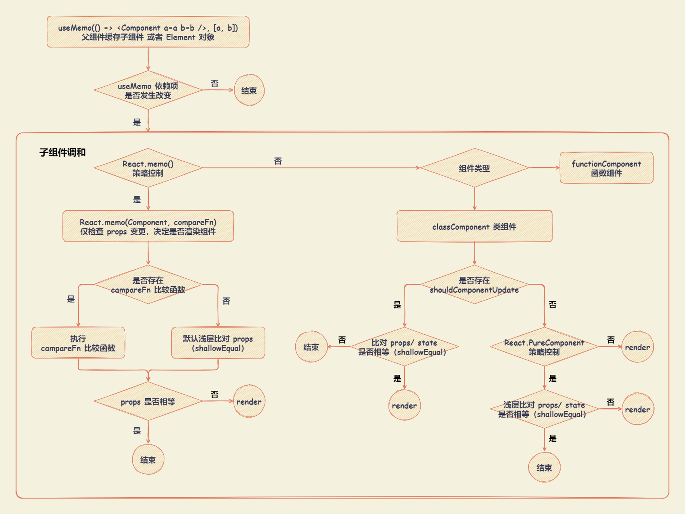

# React 渲染控制

`render` 的作用是根据一次更新中产生的新状态值，通过 `React.createElement` 替换成新的状态，得到新的 `React Element` 对象。在新的 `Element` 对象上，保存了最新状态值。 `createElement` 会产生一个全新的 `props`。

React 会调和由 `render` 函数产生 `chidlren`，将子代 `Element` 变成 `Fiber`（在该过程中，如果存在 `alternate`，会复用 `alternate` 进行克隆，如果没有 `alternate` ，则会创建一个），将 `props` 变成 `pendingProps` ，至此当前组件更新完毕。如果 `children` 是组件，会继续重复上一步，直到全部 `Fiber` 调和完毕，完成 `render` 阶段。

- `props` 与 `pendingProps`

  - `props` ：函数组件的参数
  - Fiber 的 `pendingProps` ：函数初始化时设置的 `props`
  - Fiber 的 `memoizedProps` ：函数执行结束时 `props` 的值

  当刚进入函数时 `pendingProps` 值等于 `memoizedProps` 值，表示 Fiber 之前的输出可以重用，从而避免一些不必要的 work。

- `alternate`

  Fiber 的 `alternate` 是 `cloneFiber` 的函数惰性的创建的，与总是创建一个新对象不同，`cloneFiber` 将尝试重用 Fiber 的 `alternate`（如果存在的话），以实现最小化内存分配。

  在任何时候，一个组件实例最多有两个与之对应的 Fiber 对象：当前即将渲染的（`current Fiber`）和 `workInProgress Fiber`，`diff` 产生出的变化会标记在 `workInProgress Fiber` 上。

  - `current Fiber` 的 `alternate` 是 `workInProgress Fiber`
  - `workInProgress Fiber` 的 `alternate` 是 `current Fiber`

  `workInProgress` 构造完毕，得到了新的 Fiber，然后把 `current` 指针指向 `workInProgress`，丢掉旧的 `Fiber`。

## useMemo

### useMemo 使用

```js
const memoizedValue = useMemo(() => computeExpensiveValue(a, b), [a, b])
```

`useMemo` 返回一个 `memoized` 值（将函数返回值缓存）。把 “创建” 函数和依赖项数组作为参数传入 `useMemo`，它仅会在某个依赖项改变时，才重新计算 `memoized` 值。这种优化有助于避免在每次渲染时都进行高开销的计算。

- “创建” 函数 ：函数的返回值作为缓存值
- 依赖项数组 ： 存放当前 `useMemo` 的依赖项，在函数组件下一次执行的时候，会对依赖项的状态进行比对，如果发生改变，则重新执行 “创建” 函数，得到新的缓存值。
- 返回值 ： `memoized` 值，执行 “创建” 函数。如果依赖项数组中，有依赖项改变，返回重新执行 “创建” 函数产生的值，否则取上一次缓存值。

```js
function Child(props) {
  const { number } = props

  console.log('Child 组件渲染')
  return <div>number: {number}</div>
}

function Parent() {
  const [numberA, setNumberA] = useState(0)
  const [numberB, setNumberB] = useState(0)

  return (
    <div>
      {useMemo(
        () => (
          <Child number={numberA} />
        ),
        [numberA]
      )}
      <button onClick={() => setNumberA(numberA + 1)}> numberA++ </button>
      <button onClick={() => setNumberB(numberB + 1)}> numberB++ </button>
    </div>
  )
}
```

### useMemo 实现原理

- `useMemo` 会记录上一次执行 “创建” 函数的返回值，并把它绑定在函数组件对应的 `Fiber` 对象上，只要组件不销毁，缓存值就一直存在。
- 依赖项数组中，如果有一项改变，就会重新执行 “创建” 函数，返回值作为新的值记录到 `Fiber` 对象上。

### useMemo 应用场景

- 可以缓存 `Element` 对象，从而达到按条件渲染组件，优化性能的作用。
- 如果组件中，不期望每次 `render` 都重新计算一些值,可以利用 `useMemo` 缓存起来。
- 可以把函数和属性缓存起来，作为 `PureComponent` 的绑定方法，或者配合其他 Hooks 一起使用。

## React.PureComponent

### React.PureComponent 使用

`React.PureComponent` 与 `React.Component` 的区别在于 `React.PureComponent` 中以**浅层对比** `prop` 和 `state` 的方式，实现了 `shouldComponentUpdate()` 函数。

- `React.PureComponent` 中的 `shouldComponentUpdate()` 仅作对象的浅层比较。

  如果对象中包含复杂的数据结构，则有可能因为无法检查深层的差别，产生错误的比对结果。在深层数据结构发生变化时，可以调用 `forceUpdate()` 来确保组件被正确地更新。也可以考虑使用 [immutable](https://immutable-js.com/) 对象加速嵌套数据的比较。

- `React.PureComponent` 中的 `shouldComponentUpdate()` 将跳过所有子组件树的 `prop` 更新。

```js
class Child extends React.PureComponent {
  constructor(props) {
    super(props)
  }

  state = {
    nickname: 'nickname',
    age: 18,
    obj: {
      number: 1,
    },
  }

  changeObjNumber = () => {
    const { obj } = this.state
    obj.number++
    this.setState({ obj })
  }

  render() {
    console.log('Child 组件渲染')

    return (
      <div style={{ margin: '10px 0', padding: '10px', border: '1px solid' }}>
        <div> 【Child】 </div>
        <div> 【props】 number : {this.props.number} </div>
        <div> 【state】 nickname : {this.state.nickname} </div>
        <div> 【state】 age : {this.state.age} </div>
        <div> 【state】 obj.number : {this.state.obj.number} </div>
        <button onClick={() => this.setState({ nickname: 'nickname' })}>
          state 相同情况
        </button>
        <button onClick={() => this.setState({ age: this.state.age + 1 })}>
          state 不同情况
        </button>
        <button onClick={this.changeObjNumber}>state 为引用数据类型时</button>
      </div>
    )
  }
}

function Parent() {
  const [numberA, setNumberA] = useState(0)
  const [numberB, setNumberB] = useState(0)

  return (
    <div style={{ padding: '10px', border: '1px solid' }}>
      <div>【Parent】</div>

      <button onClick={() => setNumberA(numberA + 1)}>
        numberA++ : {numberA}
      </button>
      <button onClick={() => setNumberB(numberB + 1)}>
        numberB++ : {numberB}
      </button>

      {useMemo(
        () => (
          <Child number={numberA} />
        ),
        [numberA]
      )}
    </div>
  )
}
```

### React.PureComponent 原理

基于 `React.PureComponent` 继承的 React 类组件，原型链上会有 `isPureReactComponent` 属性。该属性在更新组件 `updateClassInstance` 方法中，通过调用检查是否更新的函数 `checkShouldComponentUpdate` 使用到。

```js {18}
// packages\react\src\ReactBaseClasses.js

/**
 * Convenience component with default shallow equality check for sCU.
 */
function PureComponent(props, context, updater) {
  this.props = props
  this.context = context
  // If a component has string refs, we will assign a different object later.
  this.refs = emptyObject
  this.updater = updater || ReactNoopUpdateQueue
}

const pureComponentPrototype = (PureComponent.prototype = new ComponentDummy())
pureComponentPrototype.constructor = PureComponent
// Avoid an extra prototype jump for these methods.
assign(pureComponentPrototype, Component.prototype)
pureComponentPrototype.isPureReactComponent = true
```

在 `checkShouldComponentUpdate` 函数中

- 通过 `isPureReactComponent` 判断当前组件是否为纯组件的，如果是， `React.PureComponent` 会浅比较 `props` 和 `state` 是否相等。
- `shouldComponentUpdate` 的权重大于 `React.PureComponent`。

通过 `shallowEqual` 进行浅比较流程

- 首先，直接比较新老 `props` 或者新老 `state` 是否相等。如果相等，则不更新组件。
- 接着，判断新老 `state` 或者 `props` ，当不为对象或者为 `null` 的，则直接返回 `false` ，更新组件。
- 然后，通过 `Object.keys` 将新老 `props` 或者新老 `state` 的属性名 `key` 变成数组，判断数组的长度是否相等，如果不相等，证明有属性增加或者减少，则更新组件。
- 最后，遍历老 `props` 或者老 `state` ，判断对应的新 `props` 或新 `state` ，有没有与之对应并且相等的（这个相等是浅比较），如果有不对应或者不相等，则直接返回 `false` ，更新组件。

```js {23}
// packages\react-reconciler\src\ReactFiberClassComponent.old.js

function checkShouldComponentUpdate(
  workInProgress,
  ctor,
  oldProps,
  newProps,
  oldState,
  newState,
  nextContext
) {
  const instance = workInProgress.stateNode
  if (typeof instance.shouldComponentUpdate === 'function') {
    let shouldUpdate = instance.shouldComponentUpdate(
      newProps,
      newState,
      nextContext
    )

    return shouldUpdate
  }

  if (ctor.prototype && ctor.prototype.isPureReactComponent) {
    return (
      !shallowEqual(oldProps, newProps) || !shallowEqual(oldState, newState)
    )
  }

  return true
}
```

### React.PureComponent 注意事项

- 避免使用箭头函数。不要给 `React.PureComponent` 子组件绑定箭头函数

  因为父组件每一次 `render` ，如果使用箭头函数绑定的话，都会重新生成一个新的箭头函数。 `React.PureComponent` 对比新老 `props` 时，因为是新的函数，所以会判断不相等，而让组件直接渲染，`React.PureComponent` 作用终会失效。

  ```js
  // 避免使用 ！！！
  class Child extends React.PureComponent {}

  export default class Parent extends React.Component {
    render = () => <Child callback={() => {}} />
  }
  ```

- 在 `React.PureComponent` 组件的父组件是函数组件的情况，绑定函数使用 `useCallback` 或者 `useMemo` 处理。

  用 class + function 组件开发项目，如果父组件是函数，子组件是 `React.PureComponent` 组件，绑定函数时，因为函数组件每一次执行，如果不处理，还会声明一个新的函数，`React.PureComponent` 对比同样会失效。

  ```js
  class Child extends React.PureComponent {}

  // 避免使用 ！！！
  export default function () {
    /* 每一次函数组件执行重新声明一个新的 callback */
    /* React.PureComponent浅比较会认为不想等，促使组件更新  */
    const callback = function handerCallback() {}
    return <Child callback={callback} />
  }

  // 推荐使用 ！！！
  export default function (){
    const callback = React.useCallback(function handerCallback(){},[])
    return <Child callback={callback}  />
  }
  ```

注： `useCallback()` 相关知识点

`useCallback()` 返回一个 `memoized` 回调函数。把内联回调函数及依赖项数组作为参数传入 `useCallback`，它将返回该回调函数的 `memoized` 版本，该回调函数仅在某个依赖项改变时才会更新。

```js
const memoizedCallback = useCallback(() => {
  doSomething(a, b)
}, [a, b])
```

`useCallback()` 和 `useMemo()` 的区别：

- `useCallback(fn, deps)` 相当于 `useMemo(() => fn, deps)` 。
- `useCallback` 第一个参数就是缓存的内容，`useMemo` 需要执行第一个函数，返回值为缓存的内容。比起 `useCallback` ， `useMemo` 更像是缓存了一段逻辑，或者说执行这段逻辑获取的结果。

## React.memo

### React.memo 使用

```js
function MyComponent(props) {
  /* 使用 props 渲染 */
}

function areEqual(prevProps, nextProps) {
  /*
    比较函数。根据一次更新中 props 是否相同决定原始组件是否重新渲染。
    > 返回 true，组件不渲染
    > 返回 false，组件重新渲染
  */
}

export default React.memo(MyComponent, areEqual)
```

`React.memo` 仅检查 `props` 变更，决定是否渲染组件。接受两个参数：

- 第一个参数 `Component` 原始组件本身，适合类组件和函数组件。
- 第二个参数 `compare` 比较函数，可以根据一次更新中 `props` 是否相同决定原始组件是否重新渲染（和 `shouldComponentUpdate` 相反）。默认情况下，其只会对复杂对象做浅层对比。
  - 返回 `true`，组件不渲染
  - 返回 `false`，组件重新渲染

如果组件被 `React.memo` 包裹，且其组件实现中拥有 `useState`，`useReducer` 或 `useContext` 的 Hook，当 `state` 或 `context` 发生变化时，仍会重新渲染。

### React.memo 实现原理

使用 `React.memo` 包裹的组件, Element 会被标识为 `REACT_MEMO_TYPE` 类型的 Element 标签。在 Element 变成 Fiber 的时候， Fiber 会被标记成 `MemoComponent` 的类型。

```js
// packages\react\src\ReactMemo.js

export function memo<Props>(
  type: React$ElementType,
  compare?: (oldProps: Props, newProps: Props) => boolean
) {
  const elementType = {
    $$typeof: REACT_MEMO_TYPE,
    type,
    compare: compare === undefined ? null : compare,
  }
  return elementType
}
```

React 对 `MemoComponent` 类型的 Fiber 有单独的更新处理逻辑 `updateMemoComponent` 。

- 通过 `React.memo` 第二个参数 `compare` 比较函数，判断是否执行更新。
  - 如果没有那么第二个参数，那么以浅比较 `props` 为 `diff` 规则。
  - 如果相等，当前 Fiber 完成工作，停止向下调和节点，所以被包裹的组件即将不更新。
- `React.memo` 可以理解为包了一层的高阶组件，它的阻断更新机制，是通过控制下一级 `children` ，也就是 `React.memo` 包装的组件，是否继续调和渲染，来达到目的的。

```js
// packages\react-reconciler\src\ReactFiberBeginWork.old.js

function updateMemoComponent(
  current: Fiber | null,
  workInProgress: Fiber,
  Component: any,
  nextProps: any,
  renderLanes: Lanes
): null | Fiber {
  if (current === null) {
    const type = Component.type
    if (
      isSimpleFunctionComponent(type) &&
      Component.compare === null &&
      // SimpleMemoComponent codepath doesn't resolve outer props either.
      Component.defaultProps === undefined
    ) {
      let resolvedType = type
      // If this is a plain function component without default props,
      // and with only the default shallow comparison, we upgrade it
      // to a SimpleMemoComponent to allow fast path updates.
      workInProgress.tag = SimpleMemoComponent
      workInProgress.type = resolvedType
      return updateSimpleMemoComponent(
        current,
        workInProgress,
        resolvedType,
        nextProps,
        renderLanes
      )
    }
    const child = createFiberFromTypeAndProps(
      Component.type,
      null,
      nextProps,
      workInProgress,
      workInProgress.mode,
      renderLanes
    )
    child.ref = workInProgress.ref
    child.return = workInProgress
    workInProgress.child = child
    return child
  }
  const currentChild = ((current.child: any): Fiber) // This is always exactly one child
  const hasScheduledUpdateOrContext = checkScheduledUpdateOrContext(
    current,
    renderLanes
  )
  if (!hasScheduledUpdateOrContext) {
    // This will be the props with resolved defaultProps,
    // unlike current.memoizedProps which will be the unresolved ones.
    const prevProps = currentChild.memoizedProps
    // Default to shallow comparison
    let compare = Component.compare
    compare = compare !== null ? compare : shallowEqual
    if (compare(prevProps, nextProps) && current.ref === workInProgress.ref) {
      return bailoutOnAlreadyFinishedWork(current, workInProgress, renderLanes)
    }
  }
  // React DevTools reads this flag.
  workInProgress.flags |= PerformedWork
  const newChild = createWorkInProgress(currentChild, nextProps)
  newChild.ref = workInProgress.ref
  newChild.return = workInProgress
  workInProgress.child = newChild
  return newChild
}
```

## shouldComponentUpdate

当 `props` 或 `state` 发生变化时，`shouldComponentUpdate(nextProps, nextState)` 会在渲染执行之前被调用。根据 `shouldComponentUpdate()` 的返回值，判断 React 组件的输出是否受当前 `state` 或 `props` 更改的影响。

- 返回为 `true` : 组件会被重新渲染，默认行为。
- 返回为 `false` : 组件不会被重新渲染，不会调用 `UNSAFE_componentWillUpdate()`，`render()` 和 `componentDidUpdate()`。返回 `false` 并不会阻止子组件在 `state` 更改时重新渲染。

此方法仅作为性能优化的方式而存在。不要企图依靠此方法来“阻止”渲染，因为这可能会产生 bug。应该考虑使用内置的 `PureComponent` 组件，而不是手动编写 `shouldComponentUpdate()`。`React.PureComponent` 会对 `props` 和 `state` 进行浅层比较，并减少了跳过必要更新的可能性。

如果子组件的 `props` 是引用数据类型，不能直观比较是否相等。使用 immutable.js 可以解决此问题，immutable.js 不可变的状态，对 Immutable 对象的任何修改或添加删除操作都会返回一个新的 Immutable 对象。

后续版本，React 可能会将 `shouldComponentUpdate()` 视为提示而不是严格的指令，并且，当返回 `false` 时，仍可能导致组件重新渲染。

## 打破渲染限制

### forceUpdate

```js
component.forceUpdate(callback)
```

调用 `forceUpdate()` 可以让组件强制重新渲染。

`forceUpdate()` 会跳过 `React.PureComponent` 的浅比较和 `shouldComponentUpdate()` 自定义比较。其原理是组件中调用 `forceUpdate()` 时候，全局会开启一个 `hasForceUpdate` 的开关。当组件更新的时候，检查这个开关是否打开，如果打开，就直接跳过 `shouldUpdate` 。

### context

当项目中使用了 `Context`，并在对应组件中消费了 `context`，当 `context` 发生变化时，组件会重新渲染。

## 渲染控制流程图



## 注意事项

- 在正常情况下，无须过分在乎 React 没有必要的渲染。

  执行 render 不等于真正的浏览器渲染视图，render 阶段执行是在 JavaScript 当中，JavaScript 中运行代码远快于浏览器的 Rendering 和 Painting ，同时 React 还提供了 diff 算法等手段，复用真实 DOM 。

- 采用渲染节流的情况

  - 数据可视化的模块组件（展示大量数据）。

    因为一次更新，可能伴随大量的 diff ，数据量越大也就越浪费性能，所以对于数据展示模块组件，有必要采取 `React.memo` ， `shouldComponentUpdate` 等方案控制自身组件渲染。

  - 含有大量表单的页面。

    - React 一般会采用受控组件的模式管理表单数据层，表单数据层完全托管于 `props` 或是 `state` ，而用户操作表单往往是频繁的，需要频繁改变数据层，所以很有可能让整个页面组件高频率 render 。
    - 最好单独抽离组件，独自管理自己的数据层，可以让 `state` 改变，波及的范围更小。

  - app `root` 根组件。

    根组件渲染会波及到整个组件树重新 render ，子组件 render ，一是浪费性能，二是可能执行 `useEffect` ，`componentWillReceiveProps` 等钩子，造成意想不到的情况发生。
