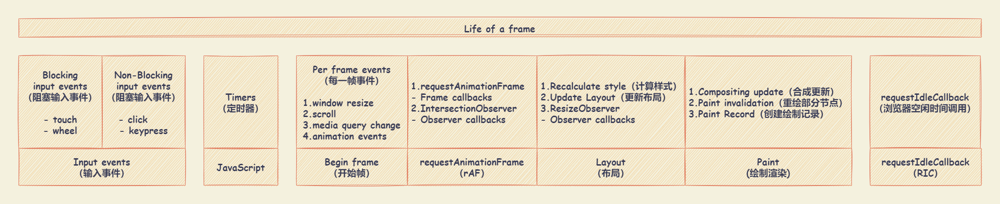
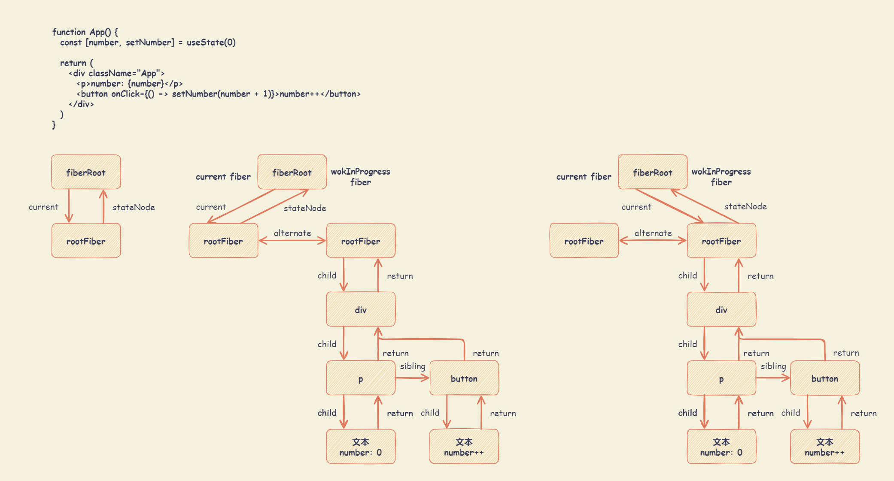
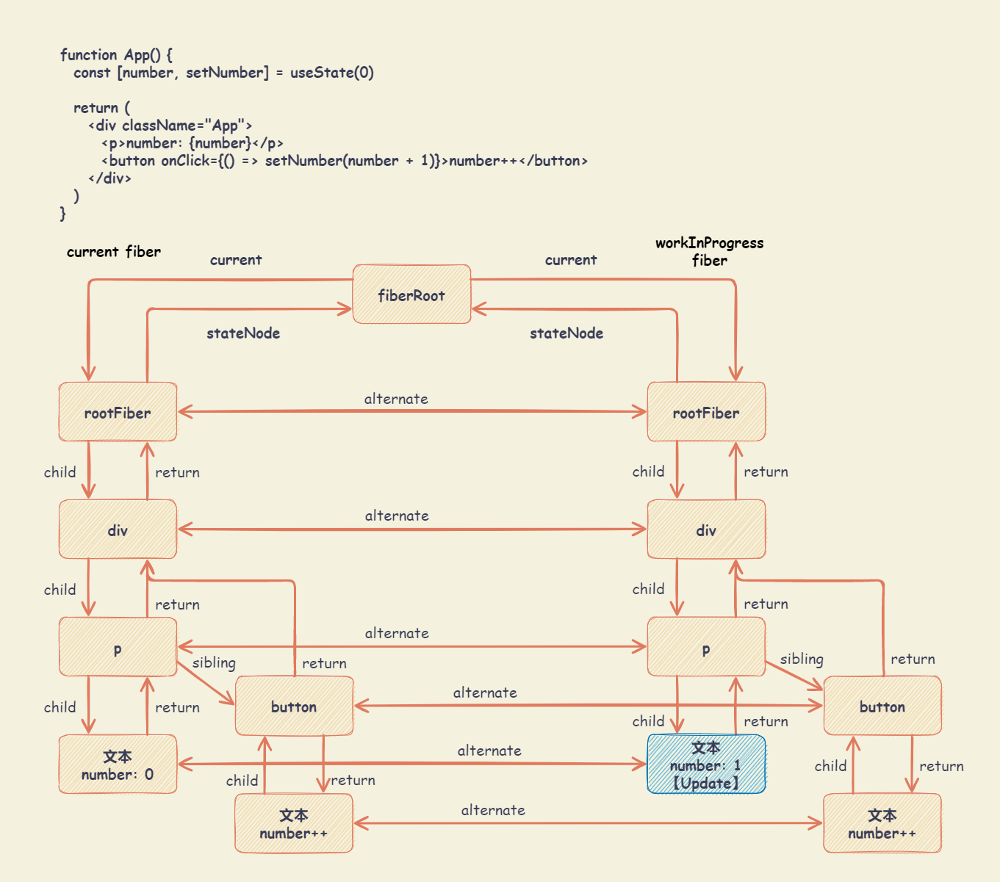

# Fiber

## React 理念

> React 是用 JavaScript 构建快速响应的大型 Web 应用程序的首选方式。

React 关键是实现快速响应。制约快速响应的因素有：

- CPU 瓶颈。当遇到大计算量的操作或者设备性能不足使页面掉帧，导致卡顿。

  - 原因

    JavaScript 引擎是单线程运行的，负责解析和执行 JavaScript 脚本程序。与 GUI 渲染线程互斥，防止渲染出现不可预期的结果。另外，异步 I/O 操作底层实际上可能是多线程的在驱动。

    主流浏览器刷新频率是 60Hz （赫兹，频率的单位），即每 16.67ms （= 1000ms / 60Hz）浏览器刷新一次。每 16.67ms 时间内，需要完成的工作如下：

    - 输入事件（Input events）
      - Blocking input events （阻塞输入事件）：如 `touch` 或 `wheel`
      - Non-Blocking input events （非阻塞输入事件）：如 `click` 或 `keypress`
    - JavaScript 引擎解析执行：执行定时器（Timers）事件等回调
    - 帧开始（Begin frame）：每一帧事件（Per frame events），如 `window resize` 、 `scroll` 、 `media query change` 、 `animation events`
    - rAF（requestAnimationFrame）：执行一个动画，并且要求浏览器在下次重绘之前调用指定的回调函数更新动画。
    - 页面布局（Layout） ：计算样式（Recalculate style）、更新布局（Update Layout）和 ResizeObserver（监视 Element 内容盒或边框盒或者 SVGElement 边界尺寸的变化）
    - 绘制渲染（Paint）：合成更新（Compositing update）、重绘部分节点（Paint invalidation）和创建绘制记录（Paint Record）
    - 执行 RIC （RequestIdleCallback）：插入一个函数，该函数将在浏览器空闲时期被调用

      在浏览器繁忙的时候，可能不会有盈余时间，`requestIdleCallback` 回调可能就不会被执行。 为了避免饿死，可以通过 `requestIdleCallback` 的第二个参数指定一个超时时间。

      同时，不建议在 `requestIdleCallback` 中进行 DOM 操作，因为这可能导致样式重新计算或重新布局(比如，操作 DOM 后马上调用 `getBoundingClientRect`)，时间很难预估，很有可能导致回调执行超时，从而掉帧。

    

    注：如果上述任意步骤占用时间过长，总时间超过过 16.67ms ，就会看到明显的卡顿。

  - 解决方案

    当 JavaScript 长时间执行时（如大量计算等），就会出现阻塞样式计算、绘制等工作，出现页面脱帧现象。

    React 通过 Fiber 架构，使 Reconciliation （调和） 过程变成可中断的异步更新。

    在浏览器每一帧的时间中，预留了时间给 JavaScript 线程，React 将渲染更新过程拆分为多个子任务。当预留时间不够用时，React 将线程控制权交还给浏览器执行样式布局和样式绘制等任务，进行 UI 渲染，React 则等待下一帧时间继续被中断的工作。

- I/O 瓶颈。发送网络请求后，由于需要等待数据返回才能进一步操作导致不能快速响应。

  React 的解决方案是将人机交互研究的结果整合到真实的 UI 中 (opens new window)。

  研究表明，在屏幕之间切换时显示过多的中间加载状态会使切换的速度变慢。从研究得知，悬停和文本输入之类的交互需要在很短的时间内处理，而点击和页面转换可以等待稍长时间而不会感到迟缓。

  React 实现了 `Suspense` (opens new window)功能及配套的 hook —— `useDeferredValue`

## React 架构

React 架构分为三层：

- Scheduler （调度器） ：任务调度器，根据任务的优先级对任务进行调用执行，高优任务优先进入 Reconciler。
- Reconciler （协调器） ：负责找出变化的组件。
- Renderer （渲染器） ：负责将变化的组件渲染到页面上。

### Scheduler （调度器）

以浏览器每一帧渲染的时间中是否有剩余时间作为任务中断的标准，可以通过 `window.requestIdleCallback()` API ，该 API 通过插入一个函数，这个函数将在浏览器空闲时期被调用。

部分浏览器已实现该 API （即：`requestIdleCallback`），但是该 API 以下问题：

- 浏览器兼容性
- 触发频率不稳定，受很多因素影响。如，当浏览器切换标签后，之前标签页注册的 `requestIdleCallback` 触发的频率会变得很低

React 实现了功能更完备的 `requestIdleCallback` polyfill （即 Scheduler），除了在空闲时触发回调的功能外，Scheduler 还提供了多种调度优先级供任务设置。

- `requestAnimationFrame` ：执行一个动画，并且要求浏览器在下次重绘之前调用指定的回调函数更新动画。
- `MessageChannel` ：创建一个新的消息通道，并通过它的两个 MessagePort 属性发送数据。

注： [Scheduler](https://github.com/facebook/react/blob/main/packages/scheduler/README.md) 是独立于 React 的。

### Reconciler （协调器）

在 React v15 中， Reconciler 是递归处理虚拟 DOM 的。同时，Reconciler 和 Renderer 是交替工作的，更新一旦开始，中途就无法中断。每当有更新发生时，Reconciler 会做如下工作：

- 调用函数组件、或 class 组件的 render 方法，将返回的 JSX 转化为虚拟 DOM
- 将虚拟 DOM 和上次更新时的虚拟 DOM 对比
- 通过对比找出本次更新中变化的虚拟 DOM
- 通知 Renderer 将变化的虚拟 DOM 渲染到页面上

在 React v16+ 中， Reconciler 与 Renderer 不再是交替工作。

- 当 Scheduler 将任务交给 Reconciler 后，Reconciler 会为变化的虚拟 DOM 打上代表增/删/更新的标记。
- 整个 Scheduler 与 Reconciler 的工作都在内存中进行，只有当所有组件都完成 Reconciler 的工作，才会统一交给 Renderer。

注： [react-reconciler](https://github.com/facebook/react/blob/main/packages/react-reconciler/README.md) 是独立于 React 的。

### Renderer （渲染器）

更新发生时，Renderer 根据 Reconciler 为虚拟 DOM 打的标记，同步执行对应的 DOM 操作。

由于 React 支持跨平台，所以不同平台有不同的 Renderer。

- [ReactDOM](https://github.com/facebook/react/blob/main/packages/react-dom/README.md) 渲染器，负责在浏览器环境渲染
- [ReactNative](https://github.com/facebook/react/blob/main/packages/react-native-renderer/index.js) 渲染器，渲染 App 原生组件
- [ReactTest](https://github.com/facebook/react/blob/main/packages/react-test-renderer/README.md) 渲染器，渲染出纯 Js 对象用于测试
- [ReactArt](https://github.com/facebook/react/blob/main/packages/react-art/README.md) 渲染器，渲染到 Canvas, SVG 或 VML (IE8)

## Fiber 架构的心智模型

### 代数效应

代数效应是函数式编程中的一个概念，用于将副作用从函数调用中分离。

对于代数效应的解释与示例，可参考如下文章：

- [通俗易懂的代数效应](https://overreacted.io/zh-hans/algebraic-effects-for-the-rest-of-us/)
- [写给大家的代数效应入门](https://github.com/xitu/gold-miner/blob/master/TODO1/algebraic-effects-for-the-rest-of-us.md)
- [干货｜详解 Algebraic Effects 代数效应](https://zhuanlan.zhihu.com/p/380855727)

### 代数效应在 React 中的应用

- React Hooks ：类似与 `useState`、`useReducer`、`useRef` 等 Hook，不需要关注 `FunctionComponent` 的 `state` 在 Hook 中如何保存，React 会自己处理。

- `React.Suspense` ：使得组件可以“等待”某些操作结束后，再进行渲染。可以通过 `fallback` 属性指定加载指示器（loading indicator）。

### 代数效应与 Generator

React 15 到 React 16，Reconciler （协调器）将同步更新的架构变为异步可中断更新。更新在执行过程中可能会被打断（浏览器时间分片用尽或有更高优任务插队），当可以继续执行时恢复之前执行的中间状态。

浏览器原生支持类似的实现，即 `Generator`。`Generator` 存在一些缺陷，因此，React 没有采用 `Generator` 实现协调器

- 类似 `async`，`Generator` 也是**传染性**的，使用了 `Generator` 则上下文的其他函数也需要作出改变。
- `Generator` **不能在栈中间让出**。比如，在嵌套的函数调用中间让出, 首先，需要将这些函数都包装成 `Generator`，另外，这种栈中间的让出处理起来也比较麻烦，难以理解。除了语法开销，现有的生成器实现开销比较大。
- `Generator` 执行的中间状态是**上下文关联**的，很难再中间恢复这些状态。

可参考 [Couldn't you just use generator functions like other scheduling frameworks have done?](https://github.com/facebook/react/issues/7942)

### 代数效应与 Fiber

Fiber 称为纤程，纤程可以看作是协程的一种。

- 在 JavaScript 中，协程的实现便是 `Generator` 。协程本身是没有并发或者并行能力的（需要配合线程），它只是一种控制流程的让出机制。
- 可以将纤程(`Fiber`)、协程(`Generator`)理解为代数效应思想在 JavaScript 中的体现。

React Fiber 可以理解为 React 内部实现的一套**状态更新机制**。

- 支持任务不同优先级，可中断与恢复，并且恢复后可以复用之前的中间状态。
- 每个任务更新单元为 `React Element` 对应的 `Fiber` 节点。

## Fiber 实现原理

### Fiber 的含义

- 从 **架构** 角度
  - React 15 的 Reconciler 采用递归的方式执行，数据保存在递归调用栈中，被称为 `stack Reconciler`。
  - React 16 的 Reconciler 基于 Fiber 节点实现，被称为 `Fiber Reconciler`。
- 从 **静态的数据结构** 角度，每个 Fiber 节点对应一个 React element，保存了该组件的类型（函数组件、类组件、原生组件等）、对应的 DOM 节点等信息。
- 从 **动态的工作单元** 角度，每个 Fiber 节点保存了本次更新中该组件改变的状态、要执行的工作（需要被删除、被插入页面中、被更新等）。

### Fiber 的结构

```js
// react\packages\react-reconciler\src\ReactFiber.new.js

function FiberNode(
  tag: WorkTag,
  pendingProps: mixed,
  key: null | string,
  mode: TypeOfMode
) {
  // ===== Instance - 作为静态数据结构的属性 =====

  // 标识 React 元素的类型，Fiber 对应组件的类型有 FunctionComponent / ClassComponent / HostComponent ...
  this.tag = tag
  // key 属性
  this.key = key
  // 大部分情况同 type，某些情况不同，比如 FunctionComponent 使用 React.memo 包裹
  this.elementType = null
  /**
   * 异步组件 resolve 之后返回的内容，一般是 function 或 class
   * 对于 FunctionComponent，指函数本身；对于 ClassComponent，指 class；对于 HostComponent，指 DOM节点 tagName 。
   */
  this.type = null
  /**
   * Fiber 对应的真实 DOM 节点，不同类型的实例都会记录在 stateNode 上
   * > DOM 组件对应 DOM 节点实例
   * > ClassComponent 对应 Class 实例
   * > FunctionComponent 没有实例，所以 StateNode 值为 null
   * state 更新了或 props 更新了均会更新到 stateNode 上
   */
  this.stateNode = null

  // ===== Fiber - 用于连接其他 Fiber节点形成 Fiber 树 =====

  /**
   * 指向父级 Fiber 节
   * 因为作为一个工作单元，return 指节点执行完 completeWork 后会返回的下一个节点。
   * 子 Fiber节点及其兄弟节点完成工作后会返回其父级节点，所以用 return 指代父级节点。
   */
  this.return = null
  // 指向自己的子 Fiber 节点
  this.child = null
  // 指向自己的第一个兄弟 Fiber 节点，兄弟节点的 return 指向同一个父节点
  this.sibling = null
  this.index = 0

  this.ref = null

  // ===== 作为动态的工作单元的属性 =====

  // 新的变动带来的新的 Props，即 nextProps
  this.pendingProps = pendingProps
  // 上次渲染完成之后的 Props，即 props
  this.memoizedProps = null
  // 该 Fiber 对应的组件产生的 Update 会存放在这个队列里
  this.updateQueue = null
  // 上次渲染的时候的 State，即 state
  // 新的 state 由 updateQueue 计算得出，并覆盖 memoizedState
  this.memoizedState = null
  // 一个列表，存在该 Fiber 依赖的 contexts、events
  this.dependencies = null

  /**
   * mode 有 conCurrentMode 和 strictMode，用于描述当前 Fiber 和其他子树的 Bitfield
   * 共存的模式表示这个子树是否默认是异步渲染的
   * Fiber 刚被创建时，会继承父 Fiber
   * 其他标识也可以在创建的时候被设置，但是创建之后不该被修改，特别是它的子 Fiber 创建之前
   */
  this.mode = mode

  // ===== 副作用，标记组件需要更新、执行生命周期的工具 =====

  // Fiber 节点包含的副作用标识
  this.flags = NoFlags
  // 子树包含的副作用标识，避免深度遍历
  this.subtreeFlags = NoFlags
  // 删除的节点，用于执行 unmount 钩子
  this.deletions = null

  // ===== 调度优先级相关 =====

  // 优先级相关，用于计算过期时间
  this.lanes = NoLanes
  this.childLanes = NoLanes

  /**
   * 指向该 fiber 在另一次更新时对应的 fiber
   * 在 Fiber 树更新的过程中，每个 Fiber 都会有一个跟其对应的 Fiber
   * 当前屏幕上显示内容对应的 Fiber 树称为 current Fiber 树，正在内存中构建的 Fiber 树称为 workInProgress Fiber 树
   * 在渲染完成之后它们会交换位置
   */
  this.alternate = null
}
```

### 双缓存 Fiber 树

React 使用 **双缓存** 来完成 Fiber 树的构建与替换 —— 对应 DOM 树的创建与更新。

在 React 中最多会同时存在两棵 Fiber 树：

- 当前屏幕上显示内容对应的 Fiber 树，称为 `current Fiber` 树。`current Fiber` 树中的 Fiber 节点被称为 `currentFiber` 。
- 正在内存中构建的 Fiber 树，称为 `workInProgress Fiber` 树。`workInProgress Fiber` 树中的 Fiber 节点被称为 `workInProgressFiber` 。

`currentFiber` 与 `workInProgressFiber`通过 `alternate` 属性相连接。

React 应用的根节点通过使 `current` 指针，在不同 Fiber 树的 `rootFiber` 间切换，完成 `current Fiber` 树指向的切换。即，当 `workInProgress Fiber` 树构建完成，交给 `Renderer` 渲染在页面上后，应用根节点的 `current` 指针指向 `workInProgress Fiber` 树，此时 `workInProgress Fiber` 树就变为 `current Fiber` 树。

每次状态更新都会产生新的 `workInProgress Fiber` 树，通过 `current` 与 `workInProgress` 的替换，完成 DOM 更新。

### Fiber mount

- 首先，执行 ReactDOM `createRoot()` API 会创建 `fiberRoot` 和 `rootFiber` 。其中， `fiberRoot` 是整个应用的根节点，`rootFiber` 是 `<App/>` 所在组件树的根节点。

  在应用中，可以多次调用 ReactDOM `createRoot()` API 渲染不同的组件树，会拥有不同的 `rootFiber` 。但是，整个应用的根节点只有一个（即：`fiberRoot`）。

  `fiberRoot` 的 `current` 会指向当前页面上已渲染内容对应 Fiber 树，即 `current Fiber` 树。

  由于是首屏渲染，页面中还没有挂载任何 DOM，所以 `fiberRoot.current` 指向的 `rootFiber` 没有任何子 Fiber 节点（即 `current Fiber` 树为空）

  ::: details createFiberRoot

  ```js
  // react\packages\react-reconciler\src\ReactFiberRoot.old.js

  export function createFiberRoot(
    containerInfo: any,
    tag: RootTag,
    hydrate: boolean,
    initialChildren: ReactNodeList,
    hydrationCallbacks: null | SuspenseHydrationCallbacks,
    isStrictMode: boolean,
    concurrentUpdatesByDefaultOverride: null | boolean,
    // TODO: We have several of these arguments that are conceptually part of the
    // host config, but because they are passed in at runtime, we have to thread
    // them through the root constructor. Perhaps we should put them all into a
    // single type, like a DynamicHostConfig that is defined by the renderer.
    identifierPrefix: string,
    onRecoverableError: null | ((error: mixed) => void),
    transitionCallbacks: null | TransitionTracingCallbacks
  ): FiberRoot {
    const root: FiberRoot = (new fiberRoot(
      containerInfo,
      tag,
      hydrate,
      identifierPrefix,
      onRecoverableError
    ): any)
    if (enableSuspenseCallback) {
      root.hydrationCallbacks = hydrationCallbacks
    }

    if (enableTransitionTracing) {
      root.transitionCallbacks = transitionCallbacks
    }

    // Cyclic construction. This cheats the type system right now because
    // stateNode is any.
    const uninitializedFiber = createHostrootFiber(
      tag,
      isStrictMode,
      concurrentUpdatesByDefaultOverride
    )
    root.current = uninitializedFiber
    uninitializedFiber.stateNode = root

    if (enableCache) {
      const initialCache = createCache()
      retainCache(initialCache)

      // The pooledCache is a fresh cache instance that is used temporarily
      // for newly mounted boundaries during a render. In general, the
      // pooledCache is always cleared from the root at the end of a render:
      // it is either released when render commits, or moved to an Offscreen
      // component if rendering suspends. Because the lifetime of the pooled
      // cache is distinct from the main memoizedState.cache, it must be
      // retained separately.
      root.pooledCache = initialCache
      retainCache(initialCache)
      const initialState: RootState = {
        element: initialChildren,
        isDehydrated: hydrate,
        cache: initialCache,
        transitions: null,
        pendingSuspenseBoundaries: null,
      }
      uninitializedFiber.memoizedState = initialState
    } else {
      const initialState: RootState = {
        element: initialChildren,
        isDehydrated: hydrate,
        cache: (null: any), // not enabled yet
        transitions: null,
        pendingSuspenseBoundaries: null,
      }
      uninitializedFiber.memoizedState = initialState
    }

    initializeUpdateQueue(uninitializedFiber)

    return root
  }
  ```

  :::

- 接着，进入 `render` 阶段，根据组件返回的 JSX ，在内存中依次创建 Fiber 节点并连接在一起构建 Fiber 树，称为 `workInProgress Fiber` 树。

  在构建 `workInProgress Fiber` 树时，会尝试复用 `current Fiber` 树中已有的 Fiber 节点内的属性，在首屏渲染时，只有 `rootFiber` 存在对应的 `current fiber`（即 `rootFiber.alternate`）

- 已构建完的 `workInProgress Fiber` 树在 `commit` 阶段渲染到页面。`fiberRoot` 的 `current` 指针指向 `workInProgress Fiber` 树使其变为 `current Fiber` 树。



### Fiber update

- 当触发状态改变时，会开启一次新的 `render` 并创建新的 `workInProgress Fiber` 树。

  `workInProgress fiber` 的创建可以复用 `current Fiber` 树对应的节点数据。决定是否复用的过程就是 Diff 算法。

- `workInProgress Fiber` 树在 `render` 阶段完成构建后，进入 `commit` 阶段渲染到页面上。渲染完毕后，`workInProgress Fiber` 树变为 `current Fiber` 树。


