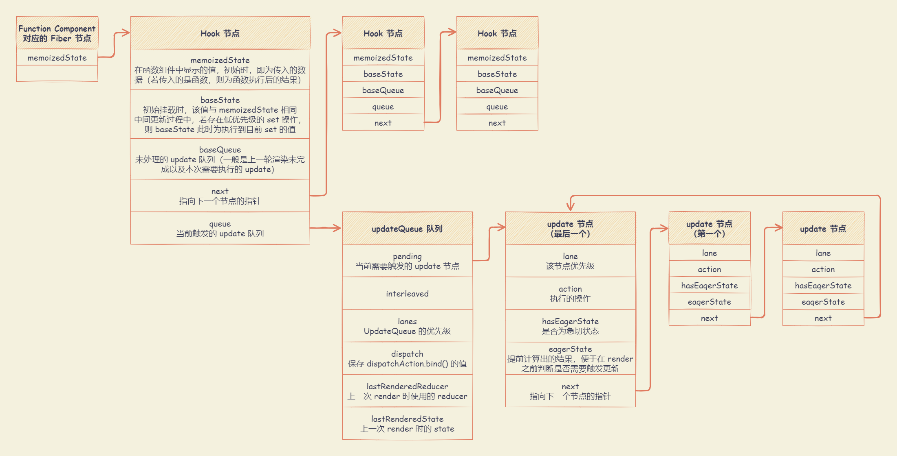

# Hooks 原理

## 函数组件触发

在 React Fiber Reconciler （调和）过程中，对于 `FunctionComponent` 类型（函数组件）的 `Fiber` ，会调用 `updateFunctionComponent()` 更新 `Fiber` 。

::: details updateFunctionComponent(current, workInProgress, Component, nextProps, renderLanes) 函数

```js
function updateFunctionComponent(
  current,
  workInProgress,
  Component,
  nextProps: any,
  renderLanes
) {
  let context
  if (!disableLegacyContext) {
    const unmaskedContext = getUnmaskedContext(workInProgress, Component, true)
    context = getMaskedContext(workInProgress, unmaskedContext)
  }

  let nextChildren
  let hasId
  prepareToReadContext(workInProgress, renderLanes)
  if (enableSchedulingProfiler) {
    markComponentRenderStarted(workInProgress)
  }
  if (__DEV__) {
    // ... 省略 DEV 环境代码
  } else {
    nextChildren = renderWithHooks(
      current,
      workInProgress,
      Component,
      nextProps,
      context,
      renderLanes
    )
    hasId = checkDidRenderIdHook()
  }
  if (enableSchedulingProfiler) {
    markComponentRenderStopped()
  }

  if (current !== null && !didReceiveUpdate) {
    bailoutHooks(current, workInProgress, renderLanes)
    return bailoutOnAlreadyFinishedWork(current, workInProgress, renderLanes)
  }

  if (getIsHydrating() && hasId) {
    pushMaterializedTreeId(workInProgress)
  }

  // React DevTools reads this flag.
  workInProgress.flags |= PerformedWork
  reconcileChildren(current, workInProgress, nextChildren, renderLanes)
  return workInProgress.child
}
```

:::

在 `updateFunctionComponent()` 函数内部，会调用 `renderWithHooks()` 函数处理函数组件。在该函数中：

- 通过 `currentlyRenderingFiber` 缓存当前函数组件对应的 `Fiber` 节点，函数执行完后置为 `null`。这样切分后的功能函数不必以传参的方式获取当前处理中的 `Fiber`。
- 通过 `current === null || current.memoizedState === null` 区分 `mount` 和 `update` 阶段。

  - `mount` 阶段：`ReactCurrentDispatcher.current = HooksDispatcherOnMount`

    在执行函数组件初始化时，会使用 `HooksDispatcherOnMount` 对象中定义的 Hooks ，并通过 `mountWorkInProgressHook()` 函数构造 `workInProgressHook`（当前处理中的 `Hook`），并将其挂载到 `currentlyRenderingFiber.memoizedState` （`FunctionComponent` 对应 `Fiber` 保存的 Hooks 链表）。

    `HooksDispatcherOnMount` 对象中所有的 Hooks 都是用于初始化的。一边执行一边将这些 Hooks 添加到单向链表中，然后形成链表挂载在函数组件的 Fiber 节点上（即 `fiber.memoizedState`）。

  - `update` 阶段：`ReactCurrentDispatcher.current = HooksDispatcherOnUpdate`

    在执行函数组件更新时，会使用 `HooksDispatcherOnUpdate` 对象中定义的 Hooks，并通过 `updateWorkInProgressHook()` 函数从 `workInProgressFiber.memoizedState` 中获取 Hooks 链表，并从 Hooks 的链表中获取到当前位置上次渲染后和本次将要渲染的两个 Hook 节点。可以通过对比依赖项是否发生了变化，再来决定这个 Hook 是否继续执行，是否需要进行重新的刷新。

    - `currentHook`: `current` 树中的 Hook （即，当前正在使用的 Hook）
    - `workInProgressHook`: `workInProgress` 树中的 Hook （即，将要执行的 Hook）

- 通过 `Component (props, secondArg)` 执行函数组件，函数中的每一个 Hooks 也将依次执行。

  每个 hooks 内部能够读取当前 `Fiber` 信息，因为函数初始化时，已经把当前 `Fiber` 赋值给 `currentlyRenderingFiber`，每个 Hooks 内部读取的就是 `currentlyRenderingFiber` 的内容。

  注：函数组件中的每个 Hook 都是按照顺序，依次从链表中获取的。React 本身是不知道函数组件内部逻辑的，假如将 Hooks 放到了 if 判断、循环、或者函数中，每次的渲染，都可能会因为不同的执行逻辑，导致某些 Hook 不执行，进而导致 Hook 的错乱。

::: details renderWithHooks(current, workInProgress, Component, props, secondArg, nextRenderLanes) 函数

```js
// These are set right before calling the component.
let renderLanes: Lanes = NoLanes
// The work-in-progress fiber. I've named it differently to distinguish it from
// the work-in-progress hook.
// 当前当前函数组件对应的 Fiber 节点
let currentlyRenderingFiber: Fiber = (null: any)

// Hooks are stored as a linked list on the fiber's memoizedState field. The
// current hook list is the list that belongs to the current fiber. The
// work-in-progress hook list is a new list that will be added to the
// work-in-progress fiber.
let currentHook: Hook | null = null
let workInProgressHook: Hook | null = null

// Whether an update was scheduled at any point during the render phase. This
// does not get reset if we do another render pass; only when we're completely
// finished evaluating this component. This is an optimization so we know
// whether we need to clear render phase updates after a throw.
let didScheduleRenderPhaseUpdate: boolean = false
// Where an update was scheduled only during the current render pass. This
// gets reset after each attempt.
// TODO: Maybe there's some way to consolidate this with
// `didScheduleRenderPhaseUpdate`. Or with `numberOfReRenders`.
let didScheduleRenderPhaseUpdateDuringThisPass: boolean = false

const RE_RENDER_LIMIT = 25

export const ContextOnlyDispatcher: Dispatcher = {
  readContext,

  useCallback: throwInvalidHookError,
  useContext: throwInvalidHookError,
  useEffect: throwInvalidHookError,
  useImperativeHandle: throwInvalidHookError,
  useInsertionEffect: throwInvalidHookError,
  useLayoutEffect: throwInvalidHookError,
  useMemo: throwInvalidHookError,
  useReducer: throwInvalidHookError,
  useRef: throwInvalidHookError,
  useState: throwInvalidHookError,
  useDebugValue: throwInvalidHookError,
  useDeferredValue: throwInvalidHookError,
  useTransition: throwInvalidHookError,
  useMutableSource: throwInvalidHookError,
  useSyncExternalStore: throwInvalidHookError,
  useId: throwInvalidHookError,

  unstable_isNewReconciler: enableNewReconciler,
}

const HooksDispatcherOnMount: Dispatcher = {
  readContext,

  useCallback: mountCallback,
  useContext: readContext,
  useEffect: mountEffect,
  useImperativeHandle: mountImperativeHandle,
  useLayoutEffect: mountLayoutEffect,
  useInsertionEffect: mountInsertionEffect,
  useMemo: mountMemo,
  useReducer: mountReducer,
  useRef: mountRef,
  useState: mountState,
  useDebugValue: mountDebugValue,
  useDeferredValue: mountDeferredValue,
  useTransition: mountTransition,
  useMutableSource: mountMutableSource,
  useSyncExternalStore: mountSyncExternalStore,
  useId: mountId,

  unstable_isNewReconciler: enableNewReconciler,
}

const HooksDispatcherOnUpdate: Dispatcher = {
  readContext,

  useCallback: updateCallback,
  useContext: readContext,
  useEffect: updateEffect,
  useImperativeHandle: updateImperativeHandle,
  useInsertionEffect: updateInsertionEffect,
  useLayoutEffect: updateLayoutEffect,
  useMemo: updateMemo,
  useReducer: updateReducer,
  useRef: updateRef,
  useState: updateState,
  useDebugValue: updateDebugValue,
  useDeferredValue: updateDeferredValue,
  useTransition: updateTransition,
  useMutableSource: updateMutableSource,
  useSyncExternalStore: updateSyncExternalStore,
  useId: updateId,

  unstable_isNewReconciler: enableNewReconciler,
}

export function renderWithHooks<Props, SecondArg>(
  current: Fiber | null,
  workInProgress: Fiber,
  Component: (p: Props, arg: SecondArg) => any,
  props: Props,
  secondArg: SecondArg,
  nextRenderLanes: Lanes
): any {
  renderLanes = nextRenderLanes
  // 缓存当前函数组件对应的 Fiber 节点， renderWithHooks 结束置为 null
  currentlyRenderingFiber = workInProgress

  // 函数体每次执行时，重置 workInProgress.memoizedState，借以与 currentFiber.memoizedState 有差别
  workInProgress.memoizedState = null
  workInProgress.updateQueue = null
  workInProgress.lanes = NoLanes

  // The following should have already been reset
  // currentHook = null;
  // workInProgressHook = null;

  // didScheduleRenderPhaseUpdate = false;
  // localIdCounter = 0;

  // 警告：如果在 mount 过程中没有使用 hooks，在 update 过程中使用了。
  // 因为 memoizedState === nul，会将 update 渲染作为 mount，
  // 但是，它对于某些类型的组件（例如：React.lazy）是有效的

  // 使用 currentFiber.memoizedState 区分 mount / update 阶段
  // 只有至少使用一个有状态的 hooks 才有效
  // 没有状态的 hooks（例如：context）不会被添加到 memoizedState 中
  // 所以 memoizedState 在 mount / update 阶段时将为空

  // 使用 currentFiber.memoizedState 区分 mount / update 阶段，使用不同的 ReactCurrentDispatcher 实现
  // > mount 阶段： HooksDispatcherOnMount 将促使 useState 调用走 mountState 流程
  // > update 阶段： HooksDispatcherOnUpdate 将促使 useState 调用走 updateState 流程
  ReactCurrentDispatcher.current =
    current === null || current.memoizedState === null
      ? HooksDispatcherOnMount
      : HooksDispatcherOnUpdate

  // 调用渲染函数，获取 hook 或最新状态，渲染内容
  let children = Component(props, secondArg)

  // Check if there was a render phase update
  // 当有更新需要渲染时
  if (didScheduleRenderPhaseUpdateDuringThisPass) {
    // 使用 numberOfReRenders 计数器防止无限循环
    let numberOfReRenders: number = 0
    do {
      didScheduleRenderPhaseUpdateDuringThisPass = false
      localIdCounter = 0

      if (numberOfReRenders >= RE_RENDER_LIMIT) {
        throw new Error(
          'Too many re-renders. React limits the number of renders to prevent ' +
            'an infinite loop.'
        )
      }

      numberOfReRenders += 1

      // Start over from the beginning of the list
      currentHook = null
      workInProgressHook = null

      workInProgress.updateQueue = null

      // HooksDispatcherOnRerender 将促使 useState 调用走 rerenderState 流程
      ReactCurrentDispatcher.current = __DEV__
        ? HooksDispatcherOnRerenderInDEV
        : HooksDispatcherOnRerender

      // 调用渲染函数，获取最新状态，渲染内容
      children = Component(props, secondArg)
    } while (didScheduleRenderPhaseUpdateDuringThisPass)
  }

  // We can assume the previous dispatcher is always this one, since we set it
  // at the beginning of the render phase and there's no re-entrance.

  // 将 ReactCurrentDispatcher 置为 ContextOnlyDispatcher，避免 hook 在函数体外调用
  ReactCurrentDispatcher.current = ContextOnlyDispatcher

  // This check uses currentHook so that it works the same in DEV and prod bundles.
  // hookTypesDev could catch more cases (e.g. context) but only in DEV bundles.

  // didRenderTooFewHooks 为 true，表示有些 hook 未执行完全，过早的返回 state
  const didRenderTooFewHooks = currentHook !== null && currentHook.next !== null

  renderLanes = NoLanes
  currentlyRenderingFiber = (null: any)

  currentHook = null
  workInProgressHook = null

  didScheduleRenderPhaseUpdate = false
  // This is reset by checkDidRenderIdHook
  // localIdCounter = 0;

  if (didRenderTooFewHooks) {
    throw new Error(
      'Rendered fewer hooks than expected. This may be caused by an accidental ' +
        'early return statement.'
    )
  }

  if (enableLazyContextPropagation) {
    if (current !== null) {
      if (!checkIfWorkInProgressReceivedUpdate()) {
        // If there were no changes to props or state, we need to check if there
        // was a context change. We didn't already do this because there's no
        // 1:1 correspondence between dependencies and hooks. Although, because
        // there almost always is in the common case (`readContext` is an
        // internal API), we could compare in there. OTOH, we only hit this case
        // if everything else bails out, so on the whole it might be better to
        // keep the comparison out of the common path.
        const currentDependencies = current.dependencies
        if (
          currentDependencies !== null &&
          checkIfContextChanged(currentDependencies)
        ) {
          markWorkInProgressReceivedUpdate()
        }
      }
    }
  }
  return children
}
```

:::

引用的 React Hooks 都是从 `ReactCurrentDispatcher.current` 中获取的， React 通过赋予 `current` 不同的 `Hooks` 对象达到监控 `Hooks` 是否在函数组件内部调用。不同形态的 Hooks 如下：

- `ContextOnlyDispatcher` Hooks 对象 ： 防止开发者在函数组件外部调用 Hooks 。只要开发者调用了这个形态下的 Hooks ，就会抛出异常。

- `HooksDispatcherOnMount` Hooks 对象 ： 函数组件初始化（`mount`）使用的形态。Hooks 是函数组件和对应 `Fiber` 桥梁，该形态下的 Hooks 作用就是建立这个桥梁，初次建立其 Hooks 与 `Fiber` 之间的关系。

- `HooksDispatcherOnUpdate` Hooks 对象 ：函数组件的更新（`update`）使用的形态。组件更新时，需要 Hooks 去获取或者更新维护状态。

## Hooks 初始化

Hooks 通过使用 `HooksDispatcherOnMount` Hooks 对象，调用 `mountState` 、 `mountEffect` 等进行初始化节点的 `Hook`，将 `Hook` 和 `Fiber` 建立联系。

在执行函数组件初始化时，会使用 `HooksDispatcherOnMount` 对象中定义的 Hooks ，并通过 `mountWorkInProgressHook()` 函数构造 `workInProgressHook`（当前处理中的 `Hook`），并将其挂载到 `currentlyRenderingFiber.memoizedState` （`FunctionComponent` 对应 `Fiber` 保存的 Hooks 链表）。

`mountWorkInProgressHook()` 是为 `currentlyRenderingFiber` 指向的 `Fiber` 节点构建 Hooks 的链表。在该函数中：

- 若 `workInProgressHook` 为 `null`，表示 Hook 链表为空，则 `currentlyRenderingFiber.memoizedState` 指向到该节点
- 若 `workInProgressHook` 不为空，标识 Hook 链表上已经有节点了，直接放到该链表的后面，并让 `workInProgressHook` 重新指向到最后的节点

::: details mountWorkInProgressHook() 函数

```js
// workInProgressHook 指针永远指向到 Hook 链表的最后一个 Hook 节点
// 若 workInProgressHook 为 null，说明 Hook 链表上没有 Hook 节点
let workInProgressHook: Hook | null = null

function mountWorkInProgressHook(): Hook {
  const hook: Hook = {
    // 上次 render 时所用的 state
    memoizedState: null,

    // 已处理的 update 计算出的 state
    baseState: null,
    // 未处理的 update 队列（一般是上一轮渲染未完成的 update）
    baseQueue: null,
    // 当前触发的 update 队列，UpdateQueue 实例
    queue: null,

    // 指向下一个 hook，形成链表结构
    next: null,
  }

  if (workInProgressHook === null) {
    // This is the first hook in the list

    // 若为 Hook 链表中的第一个 Hook 节点，
    // 则，使用 currentlyRenderingFiber.memoizedState 指针指向到该 Hook
    // 注：currentlyRenderingFiber 是在 renderWithHooks() 函数中赋值的，是当前函数组件对应的 Fiber 节点
    currentlyRenderingFiber.memoizedState = workInProgressHook = hook
  } else {
    // Append to the end of the list

    // 若不是 Hook 链表的第一个节点，则放到链表的最后
    workInProgressHook = workInProgressHook.next = hook
  }

  // 返回 Hook 节点
  return workInProgressHook
}
```

:::

函数组件对应 `Fiber` 用 `memoizedState` 保存 Hooks 信息，每一个 Hooks 执行都会产生一个 Hooks 对象。

Hooks 对象中，保存着当前 Hooks 的信息，不同 Hooks 保存的形式不同。每一个 Hooks 通过 `hook.next` 链表建立起关系。`Hook` 为**无环单向链表**，其数据结构如下：



::: details Hook 数据结构

```js
export type Update<S, A> = {|
  // 该节点的优先级，即当前 Fiber 的优先级
  lane: Lane,
  // 执行的操作，可能直接是数值，也可能是函数
  action: A,
  // 是否是急切状态
  hasEagerState: boolean,
  // 提前计算出结果，便于在 render 之前判断是否要触发更新
  eagerState: S | null,
  // 指向到下一个节点的指针
  next: Update<S, A>,
|}

export type UpdateQueue<S, A> = {|
  // 当前需要触发的 update
  pending: Update<S, A> | null,
  interleaved: Update<S, A> | null,
  // UpdateQueue 的优先级，会 merge 更新队列的 lane
  lanes: Lanes,
  // 保存 dispatchAction.bind() 的值
  dispatch: (A => mixed) | null,
  // 上一次 render 的 reducer
  lastRenderedReducer: ((S, A) => S) | null,
  // 上一次 render 的 state
  lastRenderedState: S | null,
|}

export type Hook = {|
  // 在函数组件中显示的值，初始时，即为传入的数据（若传入的是函数，则为函数执行后的结果）
  memoizedState: any,
  // 初始挂载时，该值与 memoizedState 相同
  // 中间更新过程中，若存在低优先级的 set 操作，则 baseState 此时为执行到目前 set 的值
  baseState: any,
  // 未处理的 update 队列（一般是上一轮渲染未完成以及本次需要执行的 update）
  baseQueue: Update<any, any> | null,
  // 当前触发的 update 队列
  queue: any,
  // 指向下一个 hook，形成链表结构
  next: Hook | null,
|}
```

:::

`Hook` 与 `FunctionComponent Fiber` 都存在 `memoizedState` 属性：

- `fiber.memoizedState`：`FunctionComponent` 对应 `Fiber` 保存的 Hooks 链表。
- `hook.memoizedState`：Hooks 链表中保存的单一 `Hook` 对应的数据。不同类型 `Hook` 的 `memoizedState` 保存不同类型数据如下：

  - `useState` ：对于 `const [state, updateState] = useState(initialState)`，`memoizedState` 保存 `state` 的值

  - `useReducer` ：对于 `const [state, dispatch] = useReducer(reducer, {})`，`memoizedState` 保存 `state` 的值

  - `useEffect` ：`memoizedState` 保存包含 `useEffect` 回调函数、依赖项等的链表数据结构 `Effect`。`Effect` 链表同时会保存在 `fiber.updateQueue` 中

  - `useRef` ：对于 `useRef(1)`，`memoizedState` 保存`{ current: 1 }`

  - `useMemo` ：对于 `useMemo(callback, [depA])`，`memoizedState` 保存 `[callback(), depA]`

  - `useCallback`：对于 `useCallback(callback, [depA])`，`memoizedState` 保存 `[callback, depA]`。

    `useCallback` 与 `useMemo` 的区别是：

    - `useCallback` 保存的是 `callback` 函数本身
    - `useMemo` 保存的是 `callback` 函数的执行结果

  - `useContext` ：没有 `memoizedState`

## Hooks 更新

在执行函数组件更新时，会使用 `HooksDispatcherOnUpdate` 对象中定义的 Hooks，并通过 `updateWorkInProgressHook()` 函数从 `workInProgressFiber.memoizedState` 中获取 Hooks 链表，并从 Hooks 的链表中获取到当前位置上次渲染后和本次将要渲染的两个 Hook 节点。可以通过对比依赖项是否发生了变化，再来决定这个 Hook 是否继续执行，是否需要进行重新的刷新。

- `currentHook`: `current` 树中的 Hook （即，当前正在使用的 Hook）
- `workInProgressHook`: `workInProgress` 树中的 Hook （即，将要执行的 Hook）

在 `updateWorkInProgressHook()` 函数中：

- 初始时，在 `renderWithHooks()` 函数中，将 `workInProgress.memoizedState` 设置为空，相当于 `currentlyRenderingFiber.memoizedState` 设置为 `null` 。
- 若 `workInProgress` 树中的 `Fiber` 节点的下一个 `Hook` 存在，则直接使用；否则，从对应的 `current` 的 `Fiber` 节点克隆过来，然后将 `Hook` 构建出新的链表放到 `currentlyRenderingFiber.memoizedState` 上，方便下次更新时使用。
- 对应的 `current Fiber` 节点的里 `Hook` 也同步向后移动，因此，每次得到的都是两个 `hook`：`currentHook` 和 `workInProgressHook` 。

::: details updateWorkInProgressHook() 函数

```js
// The work-in-progress fiber. I've named it differently to distinguish it from
// the work-in-progress hook.

// 当前函数组件对应的 Fiber 节点
let currentlyRenderingFiber: Fiber = (null: any)

// Hooks are stored as a linked list on the fiber's memoizedState field. The
// current hook list is the list that belongs to the current fiber. The
// work-in-progress hook list is a new list that will be added to the
// work-in-progress fiber.
let currentHook: Hook | null = null
let workInProgressHook: Hook | null = null

function updateWorkInProgressHook(): Hook {
  // This function is used both for updates and for re-renders triggered by a
  // render phase update. It assumes there is either a current hook we can
  // clone, or a work-in-progress hook from a previous render pass that we can
  // use as a base. When we reach the end of the base list, we must switch to
  // the dispatcher used for mounts.
  // 函数既可用于更新，也可用于由渲染阶段的更新所引发的重新渲染。
  // 假设当前 Hook 可以克隆，或者有之前渲染过程中的 Hook 可以用复用。
  // 当到达 Hook 列表的末端时，必须切换到用于挂载的 dispatcher。

  let nextCurrentHook: null | Hook

  // 获取 currentlyRenderingFiber （当前函数组件对应的 Fiber 节点）下一个需要执行的 Hook
  if (currentHook === null) {
    // 当前没有正在执行的 Hook

    const current = currentlyRenderingFiber.alternate
    if (current !== null) {
      // 若当前 Fiber 节点不为空，则从 current.memoizedState 获取到 Hooks 的链表
      nextCurrentHook = current.memoizedState
    } else {
      nextCurrentHook = null
    }
  } else {
    // 当前有执行的 Hook，则获取其下一个 Hook
    // 因为 updateWorkInProgressHook() 会多次执行，当第一次执行时，就已经获取到了 Hooks 的头指针
    // 则，只需要通过 next 指针就可以获取到下一个 Hook 节点

    nextCurrentHook = currentHook.next
  }

  // workInProgressHook: 当前正在执行的hook；
  // nextWorkInProgressHook: 下一个将要执行的hook；

  let nextWorkInProgressHook: null | Hook
  // 若 workInProgressHook 为空，则使用头指针，否则，使用其 next 指向的 Hook
  if (workInProgressHook === null) {
    nextWorkInProgressHook = currentlyRenderingFiber.memoizedState
  } else {
    nextWorkInProgressHook = workInProgressHook.next
  }

  if (nextWorkInProgressHook !== null) {
    // There's already a work-in-progress. Reuse it.

    // 若 nextWorkInProgressHook 不为空，则将 workInProgressHook 指向到该节点
    workInProgressHook = nextWorkInProgressHook
    nextWorkInProgressHook = workInProgressHook.next

    currentHook = nextCurrentHook // // currentHook 指针同步向下移动
  } else {
    // Clone from the current hook.
    // 若 workInProgressHook 为空，则，从对应的 current Fiber 节点的 hook 里，克隆一份

    if (nextCurrentHook === null) {
      throw new Error('Rendered more hooks than during the previous render.')
    }

    currentHook = nextCurrentHook

    const newHook: Hook = {
      memoizedState: currentHook.memoizedState,

      baseState: currentHook.baseState,
      baseQueue: currentHook.baseQueue,
      queue: currentHook.queue,

      next: null,
    }

    if (workInProgressHook === null) {
      // This is the first hook in the list.
      currentlyRenderingFiber.memoizedState = workInProgressHook = newHook
    } else {
      // Append to the end of the list.
      workInProgressHook = workInProgressHook.next = newHook
    }
  }
  return workInProgressHook
}
```

:::

## useState / useReducer

### useState / useReducer 初始化阶段

`useState` Hook 通过 `mountState(initialState)` 进行初始化。在该函数中：

- 执行 `const hook = mountWorkInProgressHook()` 。通过 `mountWorkInProgressHook()` 创建 `Hook` 节点，并挂载到 `currentlyRenderingFiber.memoizedState` （`FunctionComponent` 对应 `Fiber` 保存的 Hooks 链表），并返回 `workInProgressHook`（当前处理中的 `Hook`）
- 判断 `initialState` 类型。如果为函数类型，则使用函数执行后的结果
- 创建一个 `queue` 结构，用于存放所有的 `setState()` 操作
- 通过 `dispatchSetState.bind(null, currentlyRenderingFiber, queue)` 执行当前节点的方法是 `basicStateReducer()` 函数，将 `Hook` 节点挂载到函数组件对应的 `Fiber` 节点上
- 返回 `useState` Hook 的初始值和 `set` 方法；

初始化时，`useState` 和 `useReducer` Hook 唯一的区别为 `queue` 参数的 `lastRenderedReducer` 字段。

- `useState()` Hook 的 `lastRenderedReducer` 为 `basicStateReducer`
- `useReducer()` Hook 的 `lastRenderedReducer` 为传入的 `reducer` 参数

::: details mountState(initialState) 函数 / mountReducer(reducer, initialArg, init) 函数

```js
// 当前当前函数组件对应的 Fiber 节点
let currentlyRenderingFiber: Fiber = (null: any)

// 对当前的 state 执行的基本操作，若传入的不是函数类型，则直接返回该值
// 若传入的是函数类型，返回执行该函数的结果
function basicStateReducer<S>(state: S, action: BasicStateAction<S>): S {
  // $FlowFixMe: Flow doesn't like mixed types
  return typeof action === 'function' ? action(state) : action
}

function mountState<S>(
  initialState: (() => S) | S
): [S, Dispatch<BasicStateAction<S>>] {
  // 创建一个 Hook 节点，并将其挂载到 currentlyRenderingFiber.memoizedState 链表的最后
  const hook = mountWorkInProgressHook()
  if (typeof initialState === 'function') {
    // $FlowFixMe: Flow doesn't like mixed types
    // 若传入的是函数，则使用执行该函数后得到的结果
    initialState = initialState()
  }

  // 设置 useState Hook 的初始值
  // > memoizedState 用来存储当前 Hook 要显示的数据
  // > baseState 用来存储执行 useState - setState() 的初始数据
  hook.memoizedState = hook.baseState = initialState

  // 为 useState Hook 添加一个 queue 结构，用于存放所有的 setState() 操作
  const queue: UpdateQueue<S, BasicStateAction<S>> = {
    pending: null,
    interleaved: null,
    lanes: NoLanes,
    dispatch: null,
    lastRenderedReducer: basicStateReducer, // 上次 render 后使用的reducer
    lastRenderedState: (initialState: any), // 上次 render 后的 state
  }
  hook.queue = queue
  const dispatch: Dispatch<BasicStateAction<S>> = (queue.dispatch =
    (dispatchSetState.bind(null, currentlyRenderingFiber, queue): any))

  // useState() 返回的数据
  return [hook.memoizedState, dispatch]
}

function mountReducer<S, I, A>(
  reducer: (S, A) => S,
  initialArg: I,
  init?: I => S
): [S, Dispatch<A>] {
  const hook = mountWorkInProgressHook()
  let initialState
  if (init !== undefined) {
    initialState = init(initialArg)
  } else {
    initialState = ((initialArg: any): S)
  }
  hook.memoizedState = hook.baseState = initialState
  const queue: UpdateQueue<S, A> = {
    pending: null,
    interleaved: null,
    lanes: NoLanes,
    dispatch: null,
    lastRenderedReducer: reducer,
    lastRenderedState: (initialState: any),
  }
  hook.queue = queue
  const dispatch: Dispatch<A> = (queue.dispatch = (dispatchReducerAction.bind(
    null,
    currentlyRenderingFiber,
    queue
  ): any))
  return [hook.memoizedState, dispatch]
}
```

:::

### useState / useReducer 调用阶段

执行 `const [state, setState] = useState(initialState)` 返回的 `setState()` 是 `dispatchSetState()` 函数派生出来的。

`dispatchSetState(fiber, queue, action)` 函数表示当前处理的是哪个 `Fiber` 节点，`action` 的操作放在哪个链表中。当执行 `useState()` 中的 `setState` 方法时，就能直接跟当前的 `Fiber` 节点和当前的 `Hook` 进行绑定。在函数中：

- 将所有执行的 `setState(action)` 里的参数 `action`，全部挂载到链表中。
- 若之前没有更新（比如：第一次渲染后的更新等），计算出新的 `state`，然后与之前的 `state` 对比，若没有更新，则直接退出。
- 若有更新，则标记该 `Fiber` 节点及所有的父级节点，刚才计算出的新的 `state` 可以在接下来的更新中使用。

::: details dispatchSetState(fiber, queue, action) 函数

```js
function dispatchSetState<S, A>(
  fiber: Fiber,
  queue: UpdateQueue<S, A>,
  action: A
) {
  // 获取当前 fiber 更新的优先级
  // 当前 action 要执行的优先级，就是触发当前 Fiber 更新的更新优先级
  const lane = requestUpdateLane(fiber)

  //  将 action 操作封装成一个 update 节点，用于后续构建链表使用
  const update: Update<S, A> = {
    lane, // 该节点的优先级，即当前fiber的优先级
    action, // action 操作，可能是数值，也可能是函数
    hasEagerState: false, // 是否是急切状态
    eagerState: null, // 提前计算出结果，便于在 render() 之前判断是否要触发更新
    next: (null: any), // 指向到下一个节点的指针
  }

  if (isRenderPhaseUpdate(fiber)) {
    // 判断是否是渲染阶段的更新。若是，则拼接到 queue.pending 的后面

    enqueueRenderPhaseUpdate(queue, update)
  } else {
    // 正常执行

    const alternate = fiber.alternate
    if (
      fiber.lanes === NoLanes &&
      (alternate === null || alternate.lanes === NoLanes)
    ) {
      // The queue is currently empty, which means we can eagerly compute the
      // next state before entering the render phase. If the new state is the
      // same as the current state, we may be able to bail out entirely.
      // 当前组件不存在更新，首次触发状态更新时，就能立刻计算出最新状态，进而与当前状态比较
      // 如果新状态与当前状态相同，则省去了后续render的过程。

      // 上次 render 后的 reducer，在 mount 时即 basicStateReducer
      const lastRenderedReducer = queue.lastRenderedReducer
      if (lastRenderedReducer !== null) {
        let prevDispatcher

        try {
          // 上次 render 后的 state，在 mount 时为传入的 initialState
          const currentState: S = (queue.lastRenderedState: any)
          // 计算新状态
          const eagerState = lastRenderedReducer(currentState, action)

          // Stash the eagerly computed state, and the reducer used to compute
          // it, on the update object. If the reducer hasn't changed by the
          // time we enter the render phase, then the eager state can be used
          // without calling the reducer again.

          // 表示该节点的数据已计算过了
          update.hasEagerState = true
          // 存储计算出来后的数据
          update.eagerState = eagerState

          if (is(eagerState, currentState)) {
            // 对比新旧状态是否不同
            // 状态没改变，当前 setState 无效，return 结束

            // Fast path. We can bail out without scheduling React to re-render.
            // It's still possible that we'll need to rebase this update later,
            // if the component re-renders for a different reason and by that
            // time the reducer has changed.
            // TODO: Do we still need to entangle transitions in this case?
            enqueueConcurrentHookUpdateAndEagerlyBailout(
              fiber,
              queue,
              update,
              lane
            )
            return
          }
        } catch (error) {
          // Suppress the error. It will throw again in the render phase.
        } finally {
          if (__DEV__) {
            ReactCurrentDispatcher.current = prevDispatcher
          }
        }
      }
    }

    // 将 update 加到 queue 链表末尾
    const root = enqueueConcurrentHookUpdate(fiber, queue, update, lane)
    if (root !== null) {
      const eventTime = requestEventTime()
      // 调度 Fiber 更新
      scheduleUpdateOnFiber(root, fiber, lane, eventTime)
      entangleTransitionUpdate(root, queue, lane)
    }
  }

  markUpdateInDevTools(fiber, lane, action)
}
```

:::

::: details dispatchReducerAction(fiber, queue, action) 函数

```js
function dispatchReducerAction<S, A>(
  fiber: Fiber,
  queue: UpdateQueue<S, A>,
  action: A
) {
  const lane = requestUpdateLane(fiber)

  const update: Update<S, A> = {
    lane,
    action,
    hasEagerState: false,
    eagerState: null,
    next: (null: any),
  }

  if (isRenderPhaseUpdate(fiber)) {
    enqueueRenderPhaseUpdate(queue, update)
  } else {
    const root = enqueueConcurrentHookUpdate(fiber, queue, update, lane)
    if (root !== null) {
      const eventTime = requestEventTime()
      scheduleUpdateOnFiber(root, fiber, lane, eventTime)
      entangleTransitionUpdate(root, queue, lane)
    }
  }

  markUpdateInDevTools(fiber, lane, action)
}
```

:::

### useState / useReducer 更新阶段

更新时，`useState` 和 `useReducer` Hook 实际调用的是同一个函数 `updateReducer()` ，获取对应的 `Hook`，根据 `update` 计算该 `Hook` 的新 `state` 并返回。在函数中：

- 把上次遗留下来的低优先级任务（如果有的话）与当前的任务拼接（不对当前任务进行优先级的区分分）到 `baseQueue` 属性上

- 遍历 `baseQueue` 属性上所有的任务

  - 若符合当前优先级，则执行该 `update` 节点
  - 若不符合当前优先级，则将此节点到最后的所有节点都存储起来，便于下次渲染遍历，并将到此刻计算出的 `state` 作为下次更新时的基准 `state`

    在 React 内部，下次渲染的初始 `state`，可能并不是当前页面展示的 state，只有所有的任务都满足优先级完成执行后，两者才是一样

- 遍历完所有可以执行的任务后，得到一个新的 `newState`。然后，判断与之前的 `state` 是否一样，若不一样，则标记该 `Fiber` 节点需要更新，并返回新的 `newState` 和 `dispatch` 方法

::: details updateReducer(reducer, initialArg, init) 函数

```js
function updateState<S>(
  initialState: (() => S) | S
): [S, Dispatch<BasicStateAction<S>>] {
  return updateReducer(basicStateReducer, (initialState: any))
}

function updateReducer<S, I, A>(
  reducer: (S, A) => S,
  initialArg: I,
  init?: I => S
): [S, Dispatch<A>] {
  const hook = updateWorkInProgressHook()
  const queue = hook.queue

  if (queue === null) {
    throw new Error(
      'Should have a queue. This is likely a bug in React. Please file an issue.'
    )
  }

  queue.lastRenderedReducer = reducer

  const current: Hook = (currentHook: any)

  // The last rebase update that is NOT part of the base state.
  let baseQueue = current.baseQueue

  // The last pending update that hasn't been processed yet.
  const pendingQueue = queue.pending
  if (pendingQueue !== null) {
    // We have new updates that haven't been processed yet.
    // We'll add them to the base queue.

    // 若上次更新时，有遗留下来的低优先级任务，同时，当前也有要更新的任务
    // 则，将当前跟新的任务拼接到上次遗留任务的后面，然后放到 baseQueue 中

    if (baseQueue !== null) {
      // Merge the pending queue and the base queue.
      const baseFirst = baseQueue.next
      const pendingFirst = pendingQueue.next
      baseQueue.next = pendingFirst
      pendingQueue.next = baseFirst
    }
    current.baseQueue = baseQueue = pendingQueue
    queue.pending = null
  }

  if (baseQueue !== null) {
    // We have a queue to process.
    // 当前次的更新时，更新链表不为空，则需要检查是否有可以在本地更新时要执行的任务

    const first = baseQueue.next
    let newState = current.baseState

    let newBaseState = null
    let newBaseQueueFirst = null
    let newBaseQueueLast = null
    let update = first
    do {
      const updateLane = update.lane
      if (!isSubsetOfLanes(renderLanes, updateLane)) {
        // Priority is insufficient. Skip this update. If this is the first
        // skipped update, the previous update/state is the new base
        // update/state.
        // 当前任务不满足优先级，存储起来，方便下次更新时使用

        const clone: Update<S, A> = {
          lane: updateLane,
          action: update.action,
          hasEagerState: update.hasEagerState,
          eagerState: update.eagerState,
          next: (null: any),
        }
        if (newBaseQueueLast === null) {
          newBaseQueueFirst = newBaseQueueLast = clone
          newBaseState = newState
        } else {
          newBaseQueueLast = newBaseQueueLast.next = clone
        }
        // Update the remaining priority in the queue.
        // TODO: Don't need to accumulate this. Instead, we can remove
        // renderLanes from the original lanes.
        currentlyRenderingFiber.lanes = mergeLanes(
          currentlyRenderingFiber.lanes,
          updateLane
        )
        markSkippedUpdateLanes(updateLane)
      } else {
        // This update does have sufficient priority.
        // 若任务优先级足够，则执行该任务
        // 若此时已经有低优先级的任务，为保证下次更新跳过这些任务，也会将这些任务存储起来

        if (newBaseQueueLast !== null) {
          const clone: Update<S, A> = {
            // This update is going to be committed so we never want uncommit
            // it. Using NoLane works because 0 is a subset of all bitmasks, so
            // this will never be skipped by the check above.
            lane: NoLane,
            action: update.action,
            hasEagerState: update.hasEagerState,
            eagerState: update.eagerState,
            next: (null: any),
          }
          newBaseQueueLast = newBaseQueueLast.next = clone
        }

        // Process this update.
        if (update.hasEagerState) {
          // If this update is a state update (not a reducer) and was processed eagerly,
          // we can use the eagerly computed state
          newState = ((update.eagerState: any): S)
        } else {
          const action = update.action
          newState = reducer(newState, action)
        }
      }
      update = update.next
    } while (update !== null && update !== first)

    if (newBaseQueueLast === null) {
      // 所有的任务都符合优先级，都执行完成
      // 则下次更新时的初始值，就是 do-while 后得到的 newState 的值。
      newBaseState = newState
    } else {
      // 若有低优先级的任务，则将链表的最后一个节点的 next 指向到头结点，形成单向环形链表
      newBaseQueueLast.next = (newBaseQueueFirst: any)
    }

    // Mark that the fiber performed work, but only if the new state is
    // different from the current state.
    if (!is(newState, hook.memoizedState)) {
      // 若新产生的 newState 跟之前的值不一样，则标记该 Fiber 节点需要更新
      markWorkInProgressReceivedUpdate()
    }

    // 整个 update 链表执行完成，得到 newState，用于本次渲染时使用
    hook.memoizedState = newState
    // 下次执行链表时的初始值
    hook.baseState = newBaseState
    // 新的 update 链表，可能为空
    hook.baseQueue = newBaseQueueLast

    queue.lastRenderedState = newState
  }

  // Interleaved updates are stored on a separate queue. We aren't going to
  // process them during this render, but we do need to track which lanes
  // are remaining.
  const lastInterleaved = queue.interleaved
  if (lastInterleaved !== null) {
    let interleaved = lastInterleaved
    do {
      const interleavedLane = interleaved.lane
      currentlyRenderingFiber.lanes = mergeLanes(
        currentlyRenderingFiber.lanes,
        interleavedLane
      )
      markSkippedUpdateLanes(interleavedLane)
      interleaved = ((interleaved: any).next: Update<S, A>)
    } while (interleaved !== lastInterleaved)
  } else if (baseQueue === null) {
    // `queue.lanes` is used for entangling transitions. We can set it back to
    // zero once the queue is empty.
    queue.lanes = NoLanes
  }

  // 返回最新的 state
  const dispatch: Dispatch<A> = (queue.dispatch: any)
  return [hook.memoizedState, dispatch]
}
```

:::

## useEffect

在 `render` 阶段，实际没有进行真正的 DOM 元素的增加、删除，React 需要进行的不同操作标识为不同的 `EffectTag` 。到 `commit` 阶段，统一处理副作用，包括 DOM 元素增删改，执行一些生命周期等。

Hooks 中的 `useEffect` 和 `useLayoutEffect` 也属于副作用。

### useEffect 初始化

`useEffect` Hook 通过 `mountEffect(create, deps)` 函数进行初始化。

在 `mountEffect(create, deps)` 函数内部，实际调用 `mountEffectImpl(fiberFlags, hookFlags, create, deps)` 函数进行相关逻辑处理。在该函数中：

- 执行 `const hook = mountWorkInProgressHook()` 。通过 `mountWorkInProgressHook()` 创建 `Hook` 节点，并挂载到 `currentlyRenderingFiber.memoizedState` （`FunctionComponent` 对应 `Fiber` 保存的 Hooks 链表），并返回 `workInProgressHook`（当前处理中的 `Hook`）
- 通过 `pushEffect()` 函数创建一个 `Effect`，并保存到当前 Hook 的 `hook.memoizedState` 属性下

  在 `pushEffect()` 函数中，如果存在多个 `Effect` 或者 `layoutEffect` 会形成一个副作用链表，绑定在函数组件 `Fiber` 节点的 `updateQueue` 上

::: details mountEffect(create, deps) 函数

```js
// 当前当前函数组件对应的 Fiber 节点
let currentlyRenderingFiber: Fiber = (null: any)

function mountEffect(
  create: () => (() => void) | void,
  deps: Array<mixed> | void | null
): void {
  return mountEffectImpl(
    PassiveEffect | PassiveStaticEffect,
    HookPassive,
    create,
    deps
  )
}

function mountEffectImpl(fiberFlags, hookFlags, create, deps): void {
  const hook = mountWorkInProgressHook()
  const nextDeps = deps === undefined ? null : deps
  currentlyRenderingFiber.flags |= fiberFlags
  hook.memoizedState = pushEffect(
    HookHasEffect | hookFlags,
    create, // useEffect 第一个参数，即：副作用函数
    undefined,
    nextDeps // useEffect 第二次参数，即：deps
  )
}

function createFunctionComponentUpdateQueue(): FunctionComponentUpdateQueue {
  return {
    lastEffect: null,
    stores: null,
  }
}

function pushEffect(tag, create, destroy, deps) {
  const effect: Effect = {
    tag,
    create,
    destroy,
    deps,
    // Circular
    next: (null: any),
  }
  let componentUpdateQueue: null | FunctionComponentUpdateQueue =
    (currentlyRenderingFiber.updateQueue: any)
  if (componentUpdateQueue === null) {
    componentUpdateQueue = createFunctionComponentUpdateQueue()
    currentlyRenderingFiber.updateQueue = (componentUpdateQueue: any)
    componentUpdateQueue.lastEffect = effect.next = effect
  } else {
    const lastEffect = componentUpdateQueue.lastEffect
    if (lastEffect === null) {
      componentUpdateQueue.lastEffect = effect.next = effect
    } else {
      const firstEffect = lastEffect.next
      lastEffect.next = effect
      effect.next = firstEffect
      componentUpdateQueue.lastEffect = effect
    }
  }
  return effect
}
```

:::

### useEffect 更新

`useEffect` Hook 通过 `updateEffect(create, deps)` 函数进行更新。

在 `updateEffect(create, deps)` 函数内部，实际调用 `updateEffectImpl(fiberFlags, hookFlags, create, deps)` 函数进行相关逻辑处理。

在 `updateEffectImpl()` 函数中，会判断 `deps` 依赖项是否发生变化。

- 如果没有发生变化，则只需更新副作用链表
- 如果发生变化，更新链表，同时，标识需要执行副作用的标签：`fiber => fiberEffectTag` 、`hook => HookHasEffect`。在 commit 阶段，会根据标签，重新执行副作用。

::: details updateEffect(create, deps) 函数

```js
// 当前当前函数组件对应的 Fiber 节点
let currentlyRenderingFiber: Fiber = (null: any)

function updateEffect(
  create: () => (() => void) | void,
  deps: Array<mixed> | void | null
): void {
  return updateEffectImpl(PassiveEffect, HookPassive, create, deps)
}

function updateEffectImpl(fiberFlags, hookFlags, create, deps): void {
  const hook = updateWorkInProgressHook()
  const nextDeps = deps === undefined ? null : deps
  let destroy = undefined

  if (currentHook !== null) {
    const prevEffect = currentHook.memoizedState
    destroy = prevEffect.destroy
    if (nextDeps !== null) {
      const prevDeps = prevEffect.deps
      if (areHookInputsEqual(nextDeps, prevDeps)) {
        // 如果 deps 依赖项项没有发生变化
        // 则，更新 Effect list ，无须设置 HookHasEffect 标识

        hook.memoizedState = pushEffect(hookFlags, create, destroy, nextDeps)
        return
      }
    }
  }

  // 如果 deps 依赖项发生改变，则赋予 EffectTag
  // 在 commit 阶段，就会再次执行 Effect

  currentlyRenderingFiber.flags |= fiberFlags

  hook.memoizedState = pushEffect(
    HookHasEffect | hookFlags,
    create,
    destroy,
    nextDeps
  )
}
```

:::

### EffectTag

React 会使用不同的 `EffectTag` 来标记不同的 `Effect`。在 `commit` 阶段，通过标识符，证明是 `useEffect` 还是 `useLayoutEffect`，然后 React 会同步处理 `useLayoutEffect` ，异步处理 `useEffect` 。

- 对于 `useEffect` 会标记 `UpdateEffect | PassiveEffect`。`UpdateEffect` 是证明此次更新需要更新 `Effect`， `HookPassive` 是 `useEffect` 的标识符
- 对于 `useLayoutEffect` 第一次更新会标识上 `HookLayout` 的标识符

如果函数组件需要更新副作用，会标记 `UpdateEffect`，`Hook` 存在 `HookHasEffect` 标记，就会更新对应 `Effect` 。在初始化或者 deps 依赖项不相等时，就会给当前 `Hook` 标记上 `HookHasEffect` ，所以会执行组件的副作用钩子。

## useRef

### useRef 初始化

`useRef` Hook 通过 `mountRef(initialValue)` 函数进行初始化。

```js
function mountRef<T>(initialValue: T): {| current: T |} {
  const hook = mountWorkInProgressHook()
  if (enableUseRefAccessWarning) {
    const ref = { current: initialValue }
    hook.memoizedState = ref // 创建 ref 对象
    return ref
  } else {
    const ref = { current: initialValue }
    hook.memoizedState = ref
    return ref
  }
}
```

### useRef 更新

`useRef` Hook 通过 `updateRef(initialValue)` 函数进行更新。

```js
function updateRef<T>(initialValue: T): {| current: T |} {
  const hook = updateWorkInProgressHook()
  return hook.memoizedState // 取出复用 ref 对象。
}
```

## useCallback

### useCallback 初始化

`useCallback` Hook 通过 `mountCallback(callback, deps)` 函数进行初始化。

在 `mountCallback()` 函数中，用数组的方式，把 `callback` 和依赖项 `deps` 存储到了 `Hook` 节点的 `memoizedState` 属性上，然后返回这个 `callback`。因此执行 `useCallback()` 的返回值就是这个传入 `callback`。

```js
function mountCallback<T>(callback: T, deps: Array<mixed> | void | null): T {
  // 创建一个新的 Hook 节点
  const hook = mountWorkInProgressHook()
  const nextDeps = deps === undefined ? null : deps
  // 将 callback 和依赖项 deps 进行存储
  hook.memoizedState = [callback, nextDeps]
  return callback
}
```

### useCallback 更新

`useCallback` Hook 通过 `updateCallback(callback, deps)` 函数进行更新。在函数中：

- 若前后两个依赖项都不为空，且依赖项没有发生变动，则直接返回之前存储的 `callback`，达到了缓存的目的。
- 若依赖项为空，或者依赖项发生了变化，则重新存储 `callback` 和依赖项 `deps`，然后返回最新的 `callback`。因此，若不设置依赖项，或者依赖项一直在变，则无法达到缓存的目的。

```js
function updateCallback<T>(callback: T, deps: Array<mixed> | void | null): T {
  const hook = updateWorkInProgressHook()
  const nextDeps = deps === undefined ? null : deps
  const prevState = hook.memoizedState

  // 若之前的数据不为空
  if (prevState !== null) {
    if (nextDeps !== null) {
      // 若依赖项不为空，且前后两个依赖项没有发生变化时
      // 则，直接返回之前的 callback(prevState[0])

      const prevDeps: Array<mixed> | null = prevState[1]
      if (areHookInputsEqual(nextDeps, prevDeps)) {
        // areHookInputsEqual() 用来对比前后两个依赖项中所有的数据是否发生了变化
        // 只要有一项的数据发生了变化（相同位置前后的两个数据不相等），则认为依赖项产生了变动

        return prevState[0]
      }
    }
  }

  // 若依赖项为空，或者依赖项发生了变动，则重新存储 callback 和 依赖项 deps
  // 然后，返回最新的 callback
  // 因此，若不设置依赖项，或者依赖项一直在变，则无法达到缓存的目的。
  hook.memoizedState = [callback, nextDeps]
  return callback
}
```

## useMemo

### useMemo 初始化

`useMemo` Hook 通过 `mountMemo(nextCreate, deps)` 函数进行初始化。在函数中，会执行回调函数 `callback()`，然后存储该函数的返回结果。

```js
function mountMemo<T>(
  nextCreate: () => T,
  deps: Array<mixed> | void | null
): T {
  // 创建一个新的 Hook 节点
  const hook = mountWorkInProgressHook()
  const nextDeps = deps === undefined ? null : deps

  // 计算 useMemo 里 callback 的返回值
  // 与 useCallback() 不同的地方是这里会执行回调函数 callback
  const nextValue = nextCreate()
  // 将返回值和依赖项 deps 进行存储
  hook.memoizedState = [nextValue, nextDeps]
  // 返回执行 callback() 的返回值
  return nextValue
}
```

### useMemo 更新

`useMemo` Hook 通过 `updateMemo(nextCreate, deps)` 函数进行更新。在函数中，对比两次的依赖项 `deps` 是否发生变化

- 当依赖项不为空，且没有变化时，直接返回缓存值
- 如果发生变化，执行最新的回调函数，存储该函数最新的返回结果，并返回

```js
function updateMemo<T>(
  nextCreate: () => T,
  deps: Array<mixed> | void | null
): T {
  const hook = updateWorkInProgressHook()
  const nextDeps = deps === undefined ? null : deps
  const prevState = hook.memoizedState
  if (prevState !== null) {
    // Assume these are defined. If they're not, areHookInputsEqual will warn.
    if (nextDeps !== null) {
      const prevDeps: Array<mixed> | null = prevState[1]
      if (areHookInputsEqual(nextDeps, prevDeps)) {
        // areHookInputsEqual() 用来对比前后两个依赖项中所有的数据是否发生了变化
        // 只要有一项的数据发生了变化（相同位置前后的两个数据不相等），则认为依赖项产生了变动

        // 若依赖项没有变化，则返回之前存储的结果
        return prevState[0]
      }
    }
  }

  // 重新计算 callback 的返回结果，并进行存储
  const nextValue = nextCreate()
  hook.memoizedState = [nextValue, nextDeps]
  return nextValue
}
```
