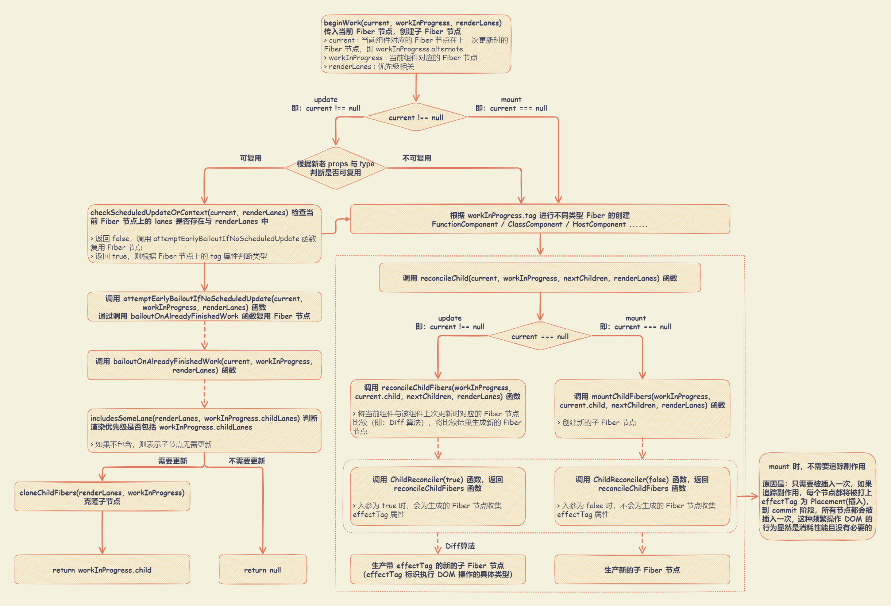
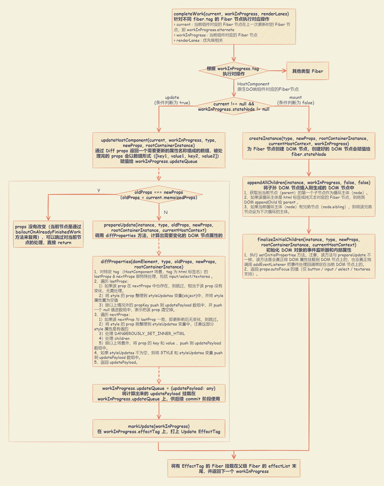

# Reconciler

在 React v16+ 中， Reconciler 与 Renderer 不再是交替工作。

- 当 Scheduler 将任务交给 Reconciler 后，Reconciler 会为变化的虚拟 DOM 打上代表增/删/更新的标记。
- 整个 Scheduler 与 Reconciler 的工作都在内存中进行，只有当所有组件都完成 Reconciler 的工作，才会统一交给 Renderer。

## Reconciler render 阶段

Reconciler `render` 阶段开始于 `performSyncWorkOnRoot` 或 `performConcurrentWorkOnRoot` 函数的调用。

- `performSyncWorkOnRoot` ：执行同步渲染任务。
- `performConcurrentWorkOnRoot` ：执行并发渲染任务。在函数中，会调用 `shouldYield` 函数判断是否需要中断遍历，使浏览器有时间渲染。如果当前浏览器帧没有剩余时间，则会终止循环，直到浏览器有空闲时间后再继续遍历。

::: details performSyncWorkOnRoot 与 performConcurrentWorkOnRoot 函数

```js
// react\packages\react-reconciler\src\ReactFiberWorkLoop.old.js

// ensureRootIsScheduled 用于 rootFiber 的任务调度。一个 root 只有一个任务在执行，每次更新和任务退出前都会调用此函数。
// 1. 计算新任务的过期时间、优先级
// 2. 无新任务，退出调度
// 3. 有历史任务：
//    3.1 新旧任务的优先级相同，继续执行旧任务，（新任务会在旧任务执行完成之后的同步刷新钩子中执行）
//    3.2 新旧任务的优先级不相同，取消旧任务
// 4. 根据不同的 Priority （优先级） 执行不同的调度(scheduleSyncCallback(同步) 或 scheduleCallback（异步）), 最后将返回值设置到 fiberRoot.callbackNode
function ensureRootIsScheduled(root: FiberRoot, currentTime: number) {
  // ......

  // Schedule a new callback.
  let newCallbackNode
  if (newCallbackPriority === SyncLane) {
    // Special case: Sync React callbacks are scheduled on a special
    // internal queue
    if (root.tag === LegacyRoot) {
      scheduleLegacySyncCallback(performSyncWorkOnRoot.bind(null, root))
    } else {
      scheduleSyncCallback(performSyncWorkOnRoot.bind(null, root))
    }
    // ......
  } else {
    let schedulerPriorityLevel
    // lanesToEventPriority ： 将 lane 优先级转换为 event 优先级
    // 以区间的形式，根据传入的 lane 返回对应的 event 优先级。比如，传入的优先级不大于 Discrete 优先级，就返回 Discrete 优先级，以此类推
    switch (lanesToEventPriority(nextLanes)) {
      case DiscreteEventPriority:
        // DiscreteEventPriority 离散事件优先级。click、keydown、focusin等，事件的触发不是连续，可以做到快速响应
        schedulerPriorityLevel = ImmediateSchedulerPriority
        break
      case ContinuousEventPriority:
        // ContinuousEventPriority 连续事件优先级。drag、scroll、mouseover等，事件的是连续触发的，快速响应可能会阻塞渲染，优先级较离散事件低
        schedulerPriorityLevel = UserBlockingSchedulerPriority
        break
      case DefaultEventPriority:
        // DefaultEventPriority 默认的事件优先级
        schedulerPriorityLevel = NormalSchedulerPriority
        break
      case IdleEventPriority:
        // IdleEventPriority 空闲的优先级
        schedulerPriorityLevel = IdleSchedulerPriority
        break
      default:
        schedulerPriorityLevel = NormalSchedulerPriority
        break
    }
    newCallbackNode = scheduleCallback(
      schedulerPriorityLevel,
      performConcurrentWorkOnRoot.bind(null, root)
    )
  }
}

// 执行同步渲染任务
function performSyncWorkOnRoot(root) {
  let exitStatus = renderRootSync(root, lanes)
}

// 执行并发渲染任务
function performConcurrentWorkOnRoot(root, didTimeout) {
  const shouldTimeSlice =
    !includesBlockingLane(root, lanes) &&
    !includesExpiredLane(root, lanes) &&
    (disableSchedulerTimeoutInWorkLoop || !didTimeout)

  // 退出状态
  // 默认情况下，并发更新总是使用时间切片
  let exitStatus = shouldTimeSlice
    ? renderRootConcurrent(root, lanes) // 执行可中断更新
    : renderRootSync(root, lanes) // 循环调用 workLoopSync 进行同步更新

  // ......

  // 退出前再次检测, 是否还有其他更新, 是否需要发起新调度
  ensureRootIsScheduled(root, now())

  // 下一个要渲染的任务，递归调用 performConcurrentWorkOnRoot自身 继续执行调度
  if (root.callbackNode === originalCallbackNode) {
    // The task node scheduled for this root is the same one that's
    // currently executed. Need to return a continuation.
    // 渲染被阻断, 返回一个新的 performConcurrentWorkOnRoot 函数, 等待下一次调用
    return performConcurrentWorkOnRoot.bind(null, root)
  }
  return null
}

// 执行同步更新
function renderRootSync(root: FiberRoot, lanes: Lanes) {
  // ......

  do {
    try {
      workLoopSync()
      break
    } catch (thrownValue) {
      handleError(root, thrownValue)
    }
  } while (true)

  // ......
}

// 执行可中断更新
function renderRootConcurrent(root: FiberRoot, lanes: Lanes) {
  // ......

  do {
    try {
      workLoopConcurrent()
      break
    } catch (thrownValue) {
      handleError(root, thrownValue)
    }
  } while (true)

  // ......
}

function workLoopSync() {
  // Already timed out, so perform work without checking if we need to yield.
  while (workInProgress !== null) {
    performUnitOfWork(workInProgress)
  }
}

function workLoopConcurrent() {
  // Perform work until Scheduler asks us to yield
  while (workInProgress !== null && !shouldYield()) {
    performUnitOfWork(workInProgress)
  }
}

function performUnitOfWork(unitOfWork: Fiber): void {
  // The current, flushed, state of this fiber is the alternate. Ideally
  // nothing should rely on this, but relying on it here means that we don't
  // need an additional field on the work in progress.
  const current = unitOfWork.alternate
  setCurrentDebugFiberInDEV(unitOfWork)

  let next
  if (enableProfilerTimer && (unitOfWork.mode & ProfileMode) !== NoMode) {
    startProfilerTimer(unitOfWork)
    next = beginWork(current, unitOfWork, subtreeRenderLanes)
    stopProfilerTimerIfRunningAndRecordDelta(unitOfWork, true)
  } else {
    next = beginWork(current, unitOfWork, subtreeRenderLanes)
  }

  resetCurrentDebugFiberInDEV()
  unitOfWork.memoizedProps = unitOfWork.pendingProps
  if (next === null) {
    // If this doesn't spawn new work, complete the current work.
    completeUnitOfWork(unitOfWork)
  } else {
    workInProgress = next
  }

  ReactCurrentOwner.current = null
}
```

:::

在 `performSyncWorkOnRoot` 或 `performConcurrentWorkOnRoot` 函数中，最终会调用 `performUnitOfWork(workInProgress)` 函数。

- `workInProgress` 表示当前已创建的 `workInProgress fiber` 。
- `performUnitOfWork(workInProgress)` 函数会创建下一个 `Fiber 节点` 并赋值给 `workInProgress`，并将 `workInProgress` 与已创建的 `Fiber 节点` 连接起来构成 Fiber 树。

Fiber Reconciler 通过遍历的方式实现可中断的递归，对于 `performUnitOfWork` 的工作可以分为两部分：“递”和“归”。“递”和“归”阶段会交错执行，直到“归”到 `rootFiber`，此时 Reconciler render 阶段完成。

- “递”阶段

  从 `rootFiber` 开始向下深度优先遍历，为遍历到的每个 `Fiber 节点` 调用 `beginWork` 方法。该方法根据传入的 `Fiber 节点` 创建 `子 Fiber 节点`，并将两个 `Fiber 节点` 连接起来。

- “归”阶段

  当遍历到叶子节点（即：没有子组件的组件）时，会进入“归”阶段，会调用 `completeWork` 方法处理 `Fiber 节点`。

  - 当某个 `Fiber 节点` 执行完 `completeWork`，如果其存在 `兄弟 Fiber 节点`（即 : `fiber.sibling !== null`），会进入其 `兄弟 Fiber` 的“递”阶段。
  - 如果不存在 `兄弟 Fiber`，会进入 `父级 Fiber` 的“归”阶段。

::: details performUnitOfWork 函数

```js
function performUnitOfWork(unitOfWork: Fiber): void {
  // The current, flushed, state of this fiber is the alternate. Ideally
  // nothing should rely on this, but relying on it here means that we don't
  // need an additional field on the work in progress.
  const current = unitOfWork.alternate
  setCurrentDebugFiberInDEV(unitOfWork)

  let next
  if (enableProfilerTimer && (unitOfWork.mode & ProfileMode) !== NoMode) {
    startProfilerTimer(unitOfWork)
    next = beginWork(current, unitOfWork, subtreeRenderLanes)
    stopProfilerTimerIfRunningAndRecordDelta(unitOfWork, true)
  } else {
    next = beginWork(current, unitOfWork, subtreeRenderLanes)
  }

  resetCurrentDebugFiberInDEV()
  unitOfWork.memoizedProps = unitOfWork.pendingProps
  if (next === null) {
    // If this doesn't spawn new work, complete the current work.
    completeUnitOfWork(unitOfWork)
  } else {
    workInProgress = next
  }

  ReactCurrentOwner.current = null
}

function completeUnitOfWork(unitOfWork: Fiber): void {
  // Attempt to complete the current unit of work, then move to the next
  // sibling. If there are no more siblings, return to the parent fiber.
  let completedWork = unitOfWork
  do {
    // The current, flushed, state of this fiber is the alternate. Ideally
    // nothing should rely on this, but relying on it here means that we don't
    // need an additional field on the work in progress.
    const current = completedWork.alternate
    const returnFiber = completedWork.return

    // Check if the work completed or if something threw.
    if ((completedWork.flags & Incomplete) === NoFlags) {
      setCurrentDebugFiberInDEV(completedWork)
      let next
      if (
        !enableProfilerTimer ||
        (completedWork.mode & ProfileMode) === NoMode
      ) {
        next = completeWork(current, completedWork, subtreeRenderLanes)
      } else {
        startProfilerTimer(completedWork)
        next = completeWork(current, completedWork, subtreeRenderLanes)
        // Update render duration assuming we didn't error.
        stopProfilerTimerIfRunningAndRecordDelta(completedWork, false)
      }
      resetCurrentDebugFiberInDEV()

      if (next !== null) {
        // Completing this fiber spawned new work. Work on that next.
        workInProgress = next
        return
      }
    } else {
      // This fiber did not complete because something threw. Pop values off
      // the stack without entering the complete phase. If this is a boundary,
      // capture values if possible.
      const next = unwindWork(current, completedWork, subtreeRenderLanes)

      // Because this fiber did not complete, don't reset its lanes.

      if (next !== null) {
        // If completing this work spawned new work, do that next. We'll come
        // back here again.
        // Since we're restarting, remove anything that is not a host effect
        // from the effect tag.
        next.flags &= HostEffectMask
        workInProgress = next
        return
      }

      if (
        enableProfilerTimer &&
        (completedWork.mode & ProfileMode) !== NoMode
      ) {
        // Record the render duration for the fiber that errored.
        stopProfilerTimerIfRunningAndRecordDelta(completedWork, false)

        // Include the time spent working on failed children before continuing.
        let actualDuration = completedWork.actualDuration
        let child = completedWork.child
        while (child !== null) {
          actualDuration += child.actualDuration
          child = child.sibling
        }
        completedWork.actualDuration = actualDuration
      }

      if (returnFiber !== null) {
        // Mark the parent fiber as incomplete and clear its subtree flags.
        returnFiber.flags |= Incomplete
        returnFiber.subtreeFlags = NoFlags
        returnFiber.deletions = null
      } else {
        // We've unwound all the way to the root.
        workInProgressRootExitStatus = RootDidNotComplete
        workInProgress = null
        return
      }
    }

    const siblingFiber = completedWork.sibling
    if (siblingFiber !== null) {
      // If there is more work to do in this returnFiber, do that next.
      workInProgress = siblingFiber
      return
    }
    // Otherwise, return to the parent
    completedWork = returnFiber
    // Update the next thing we're working on in case something throws.
    workInProgress = completedWork
  } while (completedWork !== null)

  // We've reached the root.
  if (workInProgressRootExitStatus === RootInProgress) {
    workInProgressRootExitStatus = RootCompleted
  }
}
```

:::

### “递”阶段 - beginWork



`beginWork(current, workInProgress, renderLanes)` 函数的作用是传入当前 `Fiber 节点`，创建 `子 Fiber 节点` 。

::: details beginWork 函数

```js
function beginWork(
  current: Fiber | null,
  workInProgress: Fiber,
  renderLanes: Lanes
): Fiber | null {
  if (current !== null) {
    const oldProps = current.memoizedProps
    const newProps = workInProgress.pendingProps

    if (
      oldProps !== newProps ||
      hasLegacyContextChanged() ||
      // Force a re-render if the implementation changed due to hot reload:
      (__DEV__ ? workInProgress.type !== current.type : false)
    ) {
      // If props or context changed, mark the fiber as having performed work.
      // This may be unset if the props are determined to be equal later (memo).
      didReceiveUpdate = true
    } else {
      // Neither props nor legacy context changes. Check if there's a pending
      // update or context change.
      const hasScheduledUpdateOrContext = checkScheduledUpdateOrContext(
        current,
        renderLanes
      )
      if (
        !hasScheduledUpdateOrContext &&
        // If this is the second pass of an error or suspense boundary, there
        // may not be work scheduled on `current`, so we check for this flag.
        (workInProgress.flags & DidCapture) === NoFlags
      ) {
        // No pending updates or context. Bail out now.
        didReceiveUpdate = false
        return attemptEarlyBailoutIfNoScheduledUpdate(
          current,
          workInProgress,
          renderLanes
        )
      }
      if ((current.flags & ForceUpdateForLegacySuspense) !== NoFlags) {
        // This is a special case that only exists for legacy mode.
        // See https://github.com/facebook/react/pull/19216.
        didReceiveUpdate = true
      } else {
        // An update was scheduled on this fiber, but there are no new props
        // nor legacy context. Set this to false. If an update queue or context
        // consumer produces a changed value, it will set this to true. Otherwise,
        // the component will assume the children have not changed and bail out.
        didReceiveUpdate = false
      }
    }
  } else {
    didReceiveUpdate = false

    if (getIsHydrating() && isForkedChild(workInProgress)) {
      // Check if this child belongs to a list of muliple children in
      // its parent.
      //
      // In a true multi-threaded implementation, we would render children on
      // parallel threads. This would represent the beginning of a new render
      // thread for this subtree.
      //
      // We only use this for id generation during hydration, which is why the
      // logic is located in this special branch.
      const slotIndex = workInProgress.index
      const numberOfForks = getForksAtLevel(workInProgress)
      pushTreeId(workInProgress, numberOfForks, slotIndex)
    }
  }

  // Before entering the begin phase, clear pending update priority.
  // TODO: This assumes that we're about to evaluate the component and process
  // the update queue. However, there's an exception: SimpleMemoComponent
  // sometimes bails out later in the begin phase. This indicates that we should
  // move this assignment out of the common path and into each branch.
  workInProgress.lanes = NoLanes

  switch (workInProgress.tag) {
    case IndeterminateComponent: {
      // ... 省略部分代码
    }
    case LazyComponent: {
      // ... 省略部分代码
    }
    case FunctionComponent: {
      // ... 省略部分代码
    }
    case ClassComponent: {
      // ... 省略部分代码
    }
    // ... 省略部分 case 相关代码
  }
}
```

:::

- `update` 时

  如果 `current` 存在（即 `current !== null`），在满足一定条件时可以复用 `current` 节点，就能克隆 `current.child` 作为 `workInProgress.child`，而不需要新建 `workInProgress.child` 。

  满足如下情况时 `didReceiveUpdate === false`，即可以直接复用前一次更新的 `子 Fiber`，不需要新建 `子 Fiber`

  - `oldProps === newProps && workInProgress.type === current.type` ，即 `props` 与 `fiber.type` 不变
  - `!includesSomeLane(renderLanes, updateLanes)`，即当前 `Fiber 节点` 优先级不够

- `mount` 时

  组件 `mount` 时，除 `fiberRoot` 以外，满足如下情况，会根据 `fiber.tag` 不同，创建不同类型的子 `Fiber 节点` 。

  - 首次渲染，不存在当前组件对应 `Fiber 节点` 在上一次更新时的 `Fiber 节点`（即 `current === null`）
  - 当不满足优化路径时

- `reconcileChildren(current, workInProgress, nextChildren, renderLanes)`

  对于常见的组件类型，如（`FunctionComponent` / `ClassComponent` / `HostComponent`），创建新的 `子 Fiber 节点`，会进入 `reconcileChildren` 方法。

  该方法会生成新的 `子 Fiber 节点` 并赋值给 `workInProgress.child`，作为本次 `beginWork` 返回值，并作为下次 `performUnitOfWork` 执行时 `workInProgress` 的传参。

  - 对于 `mount` 的组件，创建新的 `子 Fiber 节点`
  - 对于 `update` 的组件，将当前组件与该组件在上次更新时对应的 `Fiber 节点` 比较（即 Diff 算法），将比较的结果生成新 `Fiber 节点`

  ::: details reconcileChildren 函数

  ```js
  export function reconcileChildren(
    current: Fiber | null,
    workInProgress: Fiber,
    nextChildren: any,
    renderLanes: Lanes
  ) {
    if (current === null) {
      // If this is a fresh new component that hasn't been rendered yet, we
      // won't update its child set by applying minimal side-effects. Instead,
      // we will add them all to the child before it gets rendered. That means
      // we can optimize this reconciliation pass by not tracking side-effects.
      workInProgress.child = mountChildFibers(
        workInProgress,
        null,
        nextChildren,
        renderLanes
      )
    } else {
      // If the current child is the same as the work in progress, it means that
      // we haven't yet started any work on these children. Therefore, we use
      // the clone algorithm to create a copy of all the current children.

      // If we had any progressed work already, that is invalid at this point so
      // let's throw it out.
      workInProgress.child = reconcileChildFibers(
        workInProgress,
        current.child,
        nextChildren,
        renderLanes
      )
    }
  }
  ```

  :::

- `EffectTag`

  `render` 阶段是在内存中进行，结束后会通知 `Renderer` 执行 DOM 操作，执行 DOM 操作的具体类型保存在 `fiber.effectTag` 中。

  ```js
  // 通过二进制表示 effectTag，可以方便的使用位操作为 fiber.effectTag 赋值多个 effect

  // DOM 需要插入到页面中
  export const Placement = /*                    */ 0b00000000000000000000000010
  // DOM 需要更新
  export const Update = /*                       */ 0b00000000000000000000000100
  // DOM 需要删除
  export const Deletion = /*                     */ 0b00000000000000000000001000
  // ......
  ```

  如果要通知 `Renderer` 将 `Fiber 节点` 对应的 DOM 节点插入页面中，需要满足两个条件：

  - `fiber.stateNode` 存在，即 `Fiber 节点` 中保存了对应的 DOM 节点。
  - `(fiber.effectTag & Placement) !== 0`，即 `Fiber 节点` 存在 `Placement effectTag` 。

  `mount` 时，`fiber.stateNode === null`，且在 `reconcileChildren` 中调用的 `mountChildFibers` 不会为 `Fiber 节点` 赋值 `effectTag`。在首屏渲染中：

  - `fiber.stateNode` 会在 `completeWork` 中创建。
  - 假设 `mountChildFibers` 也会赋值 `effectTag`，可以预见 `mount` 时整棵 `Fiber` 树所有节点都会有 `Placement effectTag`。在 `mount` 时，只有 `rootFiber` 会赋值 `Placement effectTag`，在 `commit` 阶段只会执行一次插入操作。

### “归”阶段 - completeWork



`completeWork(current, workInProgress, renderLanes)` 针对不同 `fiber.tag` 的 `Fiber 节点` 执行对应操作。主要分析页面渲染所必须的 `HostComponent`（即，原生 DOM 组件对应的 Fiber 节点）

::: details completeWork 函数

```js
function completeWork(
  current: Fiber | null,
  workInProgress: Fiber,
  renderLanes: Lanes
): Fiber | null {
  const newProps = workInProgress.pendingProps
  // Note: This intentionally doesn't check if we're hydrating because comparing
  // to the current tree provider fiber is just as fast and less error-prone.
  // Ideally we would have a special version of the work loop only
  // for hydration.
  popTreeContext(workInProgress)
  switch (workInProgress.tag) {
    case IndeterminateComponent:
    case LazyComponent:
    case SimpleMemoComponent:
    case FunctionComponent:
    case ForwardRef:
    case Fragment:
    case Mode:
    case Profiler:
    case ContextConsumer:
    case MemoComponent:
      bubbleProperties(workInProgress)
      return null
    case ClassComponent: {
      // ... 省略部分代码
      return null
    }
    case HostRoot: {
      // ... 省略部分代码
      updateHostContainer(current, workInProgress)
      // ... 省略部分代码
      return null
    }
    case HostComponent: {
      popHostContext(workInProgress)
      const rootContainerInstance = getRootHostContainer()
      const type = workInProgress.type
      if (current !== null && workInProgress.stateNode != null) {
        updateHostComponent(
          current,
          workInProgress,
          type,
          newProps,
          rootContainerInstance
        )

        if (current.ref !== workInProgress.ref) {
          markRef(workInProgress)
        }
      } else {
        if (!newProps) {
          if (workInProgress.stateNode === null) {
            throw new Error(
              'We must have new props for new mounts. This error is likely ' +
                'caused by a bug in React. Please file an issue.'
            )
          }

          // This can happen when we abort work.
          bubbleProperties(workInProgress)
          return null
        }

        const currentHostContext = getHostContext()
        // TODO: Move createInstance to beginWork and keep it on a context
        // "stack" as the parent. Then append children as we go in beginWork
        // or completeWork depending on whether we want to add them top->down or
        // bottom->up. Top->down is faster in IE11.
        const wasHydrated = popHydrationState(workInProgress)
        if (wasHydrated) {
          // TODO: Move this and createInstance step into the beginPhase
          // to consolidate.
          if (
            prepareToHydrateHostInstance(
              workInProgress,
              rootContainerInstance,
              currentHostContext
            )
          ) {
            // If changes to the hydrated node need to be applied at the
            // commit-phase we mark this as such.
            markUpdate(workInProgress)
          }
        } else {
          const instance = createInstance(
            type,
            newProps,
            rootContainerInstance,
            currentHostContext,
            workInProgress
          )

          appendAllChildren(instance, workInProgress, false, false)

          workInProgress.stateNode = instance

          // Certain renderers require commit-time effects for initial mount.
          // (eg DOM renderer supports auto-focus for certain elements).
          // Make sure such renderers get scheduled for later work.
          if (
            finalizeInitialChildren(
              instance,
              type,
              newProps,
              rootContainerInstance,
              currentHostContext
            )
          ) {
            markUpdate(workInProgress)
          }
        }

        if (workInProgress.ref !== null) {
          // If there is a ref on a host node we need to schedule a callback
          markRef(workInProgress)
        }
      }
      bubbleProperties(workInProgress)
      return null
    }
    case HostText: {
      // ... 省略部分代码
      return null
    }
    // ... 省略部分 case 代码
  }
}
```

:::

- `update` 时

  `update` 时（即 `current !== null && workInProgress.stateNode != null`），`Fiber 节点` 已经存在对应 DOM 节点，所以不需要生成 DOM 节点，要做的主要是处理 `props` 。

  - `onClick`、`onChange` 等回调函数的注册
  - 处理 `style prop`
  - 处理 `DANGEROUSLY_SET_INNER_HTML prop`
  - 处理 `children prop`
  - ......

  主要的逻辑是调用 `updateHostComponent` 方法。在该方法中，被处理完的 `props` 会被赋值给 `workInProgress.updateQueue`，并最终会在 `commit` 阶段被渲染在页面上。

  ```js
  workInProgress.updateQueue = (updatePayload: any)
  ```

  `updatePayload` 为数组形式，他的偶数索引的值为变化的 `prop key`，奇数索引的值为变化的 `prop value`。

- `mount` 时

  `mount` 时的主要逻辑包括：

  - 为 `Fiber 节点` 生成对应的 DOM 节点。通过调用 `createInstance` 方法为 `Fiber 节点` 创建 DOM 节点，创建好的 DOM 节点会赋值给 `fiber.stateNode` 。
  - 将子孙 DOM 节点插入刚生成的 DOM 节点中。`completeWork` 属于“归”阶段调用的函数，每次调用 `appendAllChildren` 方法时，都会将已生成的子孙 DOM 节点插入当前生成的 DOM 节点下。当“归”到 rootFiber 时，已经有一个构建好的离屏 DOM 树。
  - 与 update 逻辑中的 `updateHostComponent` 类似的处理 props 的过程。通过调用 `finalizeInitialChildren` 方法，初始化 DOM 对象的事件监听器和内部属性。

- `EffectList`

  `EffectList` 作为 DOM 操作的依据，`commit` 阶段需要找到所有有 `EffectTag` 的 `Fiber 节点` 并依次执行 `EffectTag` 对应操作。

  在 `completeWork` 的上层函数 `completeUnitOfWork` 中，每个执行完 `completeWork` 且存在 `EffectTag` 的 `Fiber 节点` 会被保存在 `EffectList` 的单向链表中。`EffectList` 中第一个 `Fiber 节点` 保存在 `fiber.firstEffect`，最后一个元素保存在 `fiber.lastEffect`。

  在“归”阶段，所有有 `EffectTag` 的 `Fiber 节点` 都会被追加在 `EffectList` 中，最终形成一条以 `rootFiber.firstEffect` 为起点的单向链表。在 `commit` 阶段只需要遍历 `EffectList` 就能执行所有 `effect` 了。

- `commitRoot(root)`

  在 `performSyncWorkOnRoot` 函数中 `fiberRoot` 被传递给 `commitRoot` 方法，开启 `commit` 阶段工作流程。

  ::: details commitRoot 函数

  ```js
  function commitRoot(
    root: FiberRoot,
    recoverableErrors: null | Array<CapturedValue<mixed>>,
    transitions: Array<Transition> | null
  ) {
    // TODO: This no longer makes any sense. We already wrap the mutation and
    // layout phases. Should be able to remove.
    const previousUpdateLanePriority = getCurrentUpdatePriority()
    const prevTransition = ReactCurrentBatchConfig.transition

    try {
      ReactCurrentBatchConfig.transition = null
      setCurrentUpdatePriority(DiscreteEventPriority)
      commitRootImpl(
        root,
        recoverableErrors,
        transitions,
        previousUpdateLanePriority
      )
    } finally {
      ReactCurrentBatchConfig.transition = prevTransition
      setCurrentUpdatePriority(previousUpdateLanePriority)
    }

    return null
  }
  ```

  :::

## Reconciler commit 阶段

`performSyncWorkOnRoot` 函数中调用 `commitRoot(root)` 是 `commit` 阶段的起点，`fiberRoot` 会作为入参。

Reconciler commit 阶段（即 `Renderer` 的工作流程）主要分为三部分：

- `before mutation` 阶段（执行 DOM 操作前）
- `mutation` 阶段（执行 DOM 操作）
- `layout` 阶段（执行 DOM 操作后）

在 `before mutation` 阶段之前和 `layout` 阶段之后还有一些额外工作，比如 `useEffect` 的触发、优先级相关的重置、`ref` 的绑定/解绑。

### before mutation

`before mutation` 阶段，遍历 `EffectList` 并调用 `commitBeforeMutationEffects` 函数处理。

主要调用函数调用链路：`commitRoot` 函数 --> `commitRootImpl` 函数 --> `commitBeforeMutationEffects` 函数 --> `commitBeforeMutationEffects_begin` 函数 --> `commitBeforeMutationEffects_complete` 函数 --> `commitBeforeMutationEffectsOnFiber` 函数

- 处理 DOM 节点渲染/删除后的 `autoFocus`、`blur` 逻辑。
- 调用 `getSnapshotBeforeUpdate` 生命周期钩子。

  `commitBeforeMutationEffectsOnFiber` 函数中，对于 `ClassComponent` 会调用实例的 `getSnapShotBeforeUpdate` 函数。

  从 React v16 开始，`componentWillXXX` 钩子函数前增加了 `UNSAFE_` 前缀，是因为 Stack Reconciler 重构为 Fiber Reconciler 后，`render` 阶段的任务可能中断/重新开始，对应的组件在 `render` 阶段的生命周期钩子（即 `componentWillXXX`）可能触发多次。为此，React 提供了替代的生命周期钩子 `getSnapshotBeforeUpdate`。

  `getSnapshotBeforeUpdate` 是在 `commit` 阶段内的 `before mutation` 阶段调用的，由于 `commit` 阶段是同步的，所以不会遇到多次调用的问题。

- 调度 useEffect

  在 `flushPassiveEffects` 方法内部会从全局变量 `rootWithPendingPassiveEffects` 获取 `EffectList`。

  `EffectList` 中保存了需要执行副作用的 `Fiber 节点`。其中副作用包括：插入 DOM 节点（Placement）、更新 DOM 节点（Update）、删除 DOM 节点（Deletion）。除此外，当一个 `FunctionComponent` 含有 `useEffect` 或 `useLayoutEffect`，对应的 `Fiber 节点` 也会被赋值 `effectTag`。

  整个`useEffect`异步调用分为三步：

  - `before mutation` 阶段之前，在 `scheduleCallback` 中调度 `flushPassiveEffects` 注册回调函数
  - `layout` 阶段之后，将 `EffectList` 赋值给 `rootWithPendingPassiveEffects` 全局变量，回调函数执行的时候才有值
  - `scheduleCallback` 触发 `flushPassiveEffects`，`flushPassiveEffects` 内部遍历 `rootWithPendingPassiveEffects`

  与 `componentDidMount`、`componentDidUpdate` 不同的是，在浏览器完成布局与绘制之后，传给 `useEffect` 的函数会延迟调用。这使得它适用于许多常见的副作用场景，比如设置订阅和事件处理等情况，因此不应在函数中执行阻塞浏览器更新屏幕的操作。可见，`useEffect` 异步执行的原因主要是防止同步执行时阻塞浏览器渲染。

  ::: details flushPassiveEffects 函数

  ```js
  export function flushPassiveEffects(): boolean {
    // Returns whether passive effects were flushed.
    // TODO: Combine this check with the one in flushPassiveEFfectsImpl. We should
    // probably just combine the two functions. I believe they were only separate
    // in the first place because we used to wrap it with
    // `Scheduler.runWithPriority`, which accepts a function. But now we track the
    // priority within React itself, so we can mutate the variable directly.
    if (rootWithPendingPassiveEffects !== null) {
      // Cache the root since rootWithPendingPassiveEffects is cleared in
      // flushPassiveEffectsImpl
      const root = rootWithPendingPassiveEffects
      // Cache and clear the remaining lanes flag; it must be reset since this
      // method can be called from various places, not always from commitRoot
      // where the remaining lanes are known
      const remainingLanes = pendingPassiveEffectsRemainingLanes
      pendingPassiveEffectsRemainingLanes = NoLanes

      const renderPriority = lanesToEventPriority(pendingPassiveEffectsLanes)
      const priority = lowerEventPriority(DefaultEventPriority, renderPriority)
      const prevTransition = ReactCurrentBatchConfig.transition
      const previousPriority = getCurrentUpdatePriority()

      try {
        ReactCurrentBatchConfig.transition = null
        setCurrentUpdatePriority(priority)
        return flushPassiveEffectsImpl()
      } finally {
        setCurrentUpdatePriority(previousPriority)
        ReactCurrentBatchConfig.transition = prevTransition

        // Once passive effects have run for the tree - giving components a
        // chance to retain cache instances they use - release the pooled
        // cache at the root (if there is one)
        releaseRootPooledCache(root, remainingLanes)
      }
    }
    return false
  }
  ```

  :::

::: details commitBeforeMutationEffects 函数

```js
export function commitBeforeMutationEffects(
  root: FiberRoot,
  firstChild: Fiber
) {
  focusedInstanceHandle = prepareForCommit(root.containerInfo)

  nextEffect = firstChild
  commitBeforeMutationEffects_begin()

  // We no longer need to track the active instance fiber
  const shouldFire = shouldFireAfterActiveInstanceBlur
  shouldFireAfterActiveInstanceBlur = false
  focusedInstanceHandle = null

  return shouldFire
}

function commitBeforeMutationEffects_begin() {
  while (nextEffect !== null) {
    const fiber = nextEffect

    // This phase is only used for beforeActiveInstanceBlur.
    // Let's skip the whole loop if it's off.
    if (enableCreateEventHandleAPI) {
      // TODO: Should wrap this in flags check, too, as optimization
      const deletions = fiber.deletions
      if (deletions !== null) {
        for (let i = 0; i < deletions.length; i++) {
          const deletion = deletions[i]
          commitBeforeMutationEffectsDeletion(deletion)
        }
      }
    }

    const child = fiber.child
    if (
      (fiber.subtreeFlags & BeforeMutationMask) !== NoFlags &&
      child !== null
    ) {
      child.return = fiber
      nextEffect = child
    } else {
      commitBeforeMutationEffects_complete()
    }
  }
}

function commitBeforeMutationEffects_complete() {
  while (nextEffect !== null) {
    const fiber = nextEffect
    setCurrentDebugFiberInDEV(fiber)
    try {
      commitBeforeMutationEffectsOnFiber(fiber)
    } catch (error) {
      captureCommitPhaseError(fiber, fiber.return, error)
    }
    resetCurrentDebugFiberInDEV()

    const sibling = fiber.sibling
    if (sibling !== null) {
      sibling.return = fiber.return
      nextEffect = sibling
      return
    }

    nextEffect = fiber.return
  }
}

function commitBeforeMutationEffectsOnFiber(finishedWork: Fiber) {
  const current = finishedWork.alternate
  const flags = finishedWork.flags

  if (enableCreateEventHandleAPI) {
    if (!shouldFireAfterActiveInstanceBlur && focusedInstanceHandle !== null) {
      // Check to see if the focused element was inside of a hidden (Suspense) subtree.
      // TODO: Move this out of the hot path using a dedicated effect tag.
      if (
        finishedWork.tag === SuspenseComponent &&
        isSuspenseBoundaryBeingHidden(current, finishedWork) &&
        doesFiberContain(finishedWork, focusedInstanceHandle)
      ) {
        shouldFireAfterActiveInstanceBlur = true
        beforeActiveInstanceBlur(finishedWork)
      }
    }
  }

  if ((flags & Snapshot) !== NoFlags) {
    setCurrentDebugFiberInDEV(finishedWork)

    switch (finishedWork.tag) {
      case FunctionComponent:
      case ForwardRef:
      case SimpleMemoComponent: {
        break
      }
      case ClassComponent: {
        if (current !== null) {
          const prevProps = current.memoizedProps
          const prevState = current.memoizedState
          const instance = finishedWork.stateNode
          // We could update instance props and state here,
          // but instead we rely on them being set during last render.
          // TODO: revisit this when we implement resuming.
          const snapshot = instance.getSnapshotBeforeUpdate(
            finishedWork.elementType === finishedWork.type
              ? prevProps
              : resolveDefaultProps(finishedWork.type, prevProps),
            prevState
          )
          instance.__reactInternalSnapshotBeforeUpdate = snapshot
        }
        break
      }
      case HostRoot: {
        if (supportsMutation) {
          const root = finishedWork.stateNode
          clearContainer(root.containerInfo)
        }
        break
      }
      case HostComponent:
      case HostText:
      case HostPortal:
      case IncompleteClassComponent:
        // Nothing to do for these component types
        break
      default: {
        throw new Error(
          'This unit of work tag should not have side-effects. This error is ' +
            'likely caused by a bug in React. Please file an issue.'
        )
      }
    }

    resetCurrentDebugFiberInDEV()
  }
}
```

:::

### mutation

`mutation` 阶段，遍历 `EffectList` ，执行函数。

主要调用函数调用链路：`commitRoot` 函数 --> `commitRootImpl` 函数 --> `commitMutationEffects` 函数 --> `commitMutationEffectsOnFiber` 函数

在 `commitMutationEffectsOnFiber(finishedWork.tag, root, lanes)` 函数中，根据 `finishedWork.tag` 执行不同的操作，对新增元素，更新元素，删除元素进行真实的 DOM 操作。

::: details

```js
function commitMutationEffectsOnFiber(
  finishedWork: Fiber,
  root: FiberRoot,
  lanes: Lanes
) {
  const current = finishedWork.alternate
  const flags = finishedWork.flags

  // The effect flag should be checked *after* we refine the type of fiber,
  // because the fiber tag is more specific. An exception is any flag related
  // to reconcilation, because those can be set on all fiber types.
  switch (finishedWork.tag) {
    case FunctionComponent:
    case ForwardRef:
    case MemoComponent:
    case SimpleMemoComponent: {
      // ... 省略部分代码
      return
    }
    case ClassComponent: {
      recursivelyTraverseMutationEffects(root, finishedWork, lanes)
      commitReconciliationEffects(finishedWork)

      if (flags & Ref) {
        if (current !== null) {
          safelyDetachRef(current, current.return)
        }
      }
      return
    }
    case HostComponent: {
      recursivelyTraverseMutationEffects(root, finishedWork, lanes)
      commitReconciliationEffects(finishedWork)

      if (flags & Ref) {
        if (current !== null) {
          safelyDetachRef(current, current.return)
        }
      }
      if (supportsMutation) {
        // TODO: ContentReset gets cleared by the children during the commit
        // phase. This is a refactor hazard because it means we must read
        // flags the flags after `commitReconciliationEffects` has already run;
        // the order matters. We should refactor so that ContentReset does not
        // rely on mutating the flag during commit. Like by setting a flag
        // during the render phase instead.
        if (finishedWork.flags & ContentReset) {
          const instance: Instance = finishedWork.stateNode
          try {
            resetTextContent(instance)
          } catch (error) {
            captureCommitPhaseError(finishedWork, finishedWork.return, error)
          }
        }

        if (flags & Update) {
          const instance: Instance = finishedWork.stateNode
          if (instance != null) {
            // Commit the work prepared earlier.
            const newProps = finishedWork.memoizedProps
            // For hydration we reuse the update path but we treat the oldProps
            // as the newProps. The updatePayload will contain the real change in
            // this case.
            const oldProps = current !== null ? current.memoizedProps : newProps
            const type = finishedWork.type
            // TODO: Type the updateQueue to be specific to host components.
            const updatePayload: null | UpdatePayload =
              (finishedWork.updateQueue: any)
            finishedWork.updateQueue = null
            if (updatePayload !== null) {
              try {
                commitUpdate(
                  instance,
                  updatePayload,
                  type,
                  oldProps,
                  newProps,
                  finishedWork
                )
              } catch (error) {
                captureCommitPhaseError(
                  finishedWork,
                  finishedWork.return,
                  error
                )
              }
            }
          }
        }
      }
      return
    }
    case HostText: {
      // ... 省略部分代码
      return
    }
    case HostRoot: {
      recursivelyTraverseMutationEffects(root, finishedWork, lanes)
      commitReconciliationEffects(finishedWork)

      if (flags & Update) {
        if (supportsMutation && supportsHydration) {
          if (current !== null) {
            const prevRootState: RootState = current.memoizedState
            if (prevRootState.isDehydrated) {
              try {
                commitHydratedContainer(root.containerInfo)
              } catch (error) {
                captureCommitPhaseError(
                  finishedWork,
                  finishedWork.return,
                  error
                )
              }
            }
          }
        }
        if (supportsPersistence) {
          const containerInfo = root.containerInfo
          const pendingChildren = root.pendingChildren
          try {
            replaceContainerChildren(containerInfo, pendingChildren)
          } catch (error) {
            captureCommitPhaseError(finishedWork, finishedWork.return, error)
          }
        }
      }
      return
    }
    // ... 省略部分 case 代码
    default: {
      recursivelyTraverseMutationEffects(root, finishedWork, lanes)
      commitReconciliationEffects(finishedWork)

      return
    }
  }
}
```

:::

### layout

`layout` 阶段，在 DOM 渲染完成（`mutation` 阶段完成）后执行的，触发的生命周期钩子和 `Hook` 可以直接访问到已经改变后的 DOM，即可以参与 DOM layout 的阶段。

主要调用函数调用链路：`commitRoot` 函数 --> `commitRootImpl` 函数 --> `commitLayoutEffects` 函数 --> `commitLayoutEffects_begin` 函数 --> `commitLayoutMountEffects_complete` 函数 --> `commitLayoutEffectOnFiber` 函数

在 `commitLayoutEffectOnFiber(finishedRoot, current, finishedWork, committedLanes)` 方法中：

- 根据 `fiber.tag` 对不同类型的节点分别处理。
  - 对于 `ClassComponent`，通过 `current === null` 区分是 `mount` 与 `update`，调用 `componentDidMount` 或 `componentDidUpdate` 。
  - 对于 `FunctionComponent` 及相关类型（指特殊处理后的 `FunctionComponent`，比如 `ForwardRef`、`React.memo` 包裹的 `FunctionComponent`），调用 `useLayoutEffect Hook` 回调函数，调度 `useEffect` 的销毁与回调函数
  - ......
- 通过调用 `commitAttachRef` 函数获取 DOM 实例，更新 ref 。

  ::: details commitAttachRef 函数

  ```js
  function commitAttachRef(finishedWork: Fiber) {
    const ref = finishedWork.ref
    if (ref !== null) {
      const instance = finishedWork.stateNode
      let instanceToUse
      switch (finishedWork.tag) {
        case HostComponent:
          instanceToUse = getPublicInstance(instance)
          break
        default:
          instanceToUse = instance
      }
      // Moved outside to ensure DCE works with this flag
      if (enableScopeAPI && finishedWork.tag === ScopeComponent) {
        instanceToUse = instance
      }
      if (typeof ref === 'function') {
        let retVal
        if (
          enableProfilerTimer &&
          enableProfilerCommitHooks &&
          finishedWork.mode & ProfileMode
        ) {
          try {
            startLayoutEffectTimer()
            retVal = ref(instanceToUse)
          } finally {
            recordLayoutEffectDuration(finishedWork)
          }
        } else {
          retVal = ref(instanceToUse)
        }
      } else {
        ref.current = instanceToUse
      }
    }
  }
  ```

:::

::: details

```js
function commitLayoutEffectOnFiber(
  finishedRoot: FiberRoot,
  current: Fiber | null,
  finishedWork: Fiber,
  committedLanes: Lanes
): void {
  if ((finishedWork.flags & LayoutMask) !== NoFlags) {
    switch (finishedWork.tag) {
      case FunctionComponent:
      case ForwardRef:
      case SimpleMemoComponent: {
        if (
          !enableSuspenseLayoutEffectSemantics ||
          !offscreenSubtreeWasHidden
        ) {
          // At this point layout effects have already been destroyed (during mutation phase).
          // This is done to prevent sibling component effects from interfering with each other,
          // e.g. a destroy function in one component should never override a ref set
          // by a create function in another component during the same commit.
          if (
            enableProfilerTimer &&
            enableProfilerCommitHooks &&
            finishedWork.mode & ProfileMode
          ) {
            try {
              startLayoutEffectTimer()
              commitHookEffectListMount(
                HookLayout | HookHasEffect,
                finishedWork
              )
            } finally {
              recordLayoutEffectDuration(finishedWork)
            }
          } else {
            commitHookEffectListMount(HookLayout | HookHasEffect, finishedWork)
          }
        }
        break
      }
      case ClassComponent: {
        const instance = finishedWork.stateNode
        if (finishedWork.flags & Update) {
          if (!offscreenSubtreeWasHidden) {
            if (current === null) {
              // We could update instance props and state here,
              // but instead we rely on them being set during last render.
              // TODO: revisit this when we implement resuming.
              if (
                enableProfilerTimer &&
                enableProfilerCommitHooks &&
                finishedWork.mode & ProfileMode
              ) {
                try {
                  startLayoutEffectTimer()
                  instance.componentDidMount()
                } finally {
                  recordLayoutEffectDuration(finishedWork)
                }
              } else {
                instance.componentDidMount()
              }
            } else {
              const prevProps =
                finishedWork.elementType === finishedWork.type
                  ? current.memoizedProps
                  : resolveDefaultProps(
                      finishedWork.type,
                      current.memoizedProps
                    )
              const prevState = current.memoizedState
              // We could update instance props and state here,
              // but instead we rely on them being set during last render.
              // TODO: revisit this when we implement resuming.
              if (
                enableProfilerTimer &&
                enableProfilerCommitHooks &&
                finishedWork.mode & ProfileMode
              ) {
                try {
                  startLayoutEffectTimer()
                  instance.componentDidUpdate(
                    prevProps,
                    prevState,
                    instance.__reactInternalSnapshotBeforeUpdate
                  )
                } finally {
                  recordLayoutEffectDuration(finishedWork)
                }
              } else {
                instance.componentDidUpdate(
                  prevProps,
                  prevState,
                  instance.__reactInternalSnapshotBeforeUpdate
                )
              }
            }
          }
        }

        // TODO: I think this is now always non-null by the time it reaches the
        // commit phase. Consider removing the type check.
        const updateQueue: UpdateQueue<*> | null =
          (finishedWork.updateQueue: any)
        if (updateQueue !== null) {
          // We could update instance props and state here,
          // but instead we rely on them being set during last render.
          // TODO: revisit this when we implement resuming.
          commitUpdateQueue(finishedWork, updateQueue, instance)
        }
        break
      }
      case HostRoot: {
        // TODO: I think this is now always non-null by the time it reaches the
        // commit phase. Consider removing the type check.
        const updateQueue: UpdateQueue<*> | null =
          (finishedWork.updateQueue: any)
        if (updateQueue !== null) {
          let instance = null
          if (finishedWork.child !== null) {
            switch (finishedWork.child.tag) {
              case HostComponent:
                instance = getPublicInstance(finishedWork.child.stateNode)
                break
              case ClassComponent:
                instance = finishedWork.child.stateNode
                break
            }
          }
          commitUpdateQueue(finishedWork, updateQueue, instance)
        }
        break
      }

      // ... 省略部分 case 代码

      case HostComponent: {
        const instance: Instance = finishedWork.stateNode

        // Renderers may schedule work to be done after host components are mounted
        // (eg DOM renderer may schedule auto-focus for inputs and form controls).
        // These effects should only be committed when components are first mounted,
        // aka when there is no current/alternate.
        if (current === null && finishedWork.flags & Update) {
          const type = finishedWork.type
          const props = finishedWork.memoizedProps
          commitMount(instance, type, props, finishedWork)
        }

        break
      }

      // ... 省略部分 case 代码

      default:
        throw new Error(
          'This unit of work tag should not have side-effects. This error is ' +
            'likely caused by a bug in React. Please file an issue.'
        )
    }
  }

  if (!enableSuspenseLayoutEffectSemantics || !offscreenSubtreeWasHidden) {
    if (enableScopeAPI) {
      // TODO: This is a temporary solution that allowed us to transition away
      // from React Flare on www.
      if (finishedWork.flags & Ref && finishedWork.tag !== ScopeComponent) {
        commitAttachRef(finishedWork)
      }
    } else {
      if (finishedWork.flags & Ref) {
        commitAttachRef(finishedWork)
      }
    }
  }
}
```

:::

在 `mutation` 阶段结束后，`layout` 阶段开始前，会执行 `root.current = finishedWork` 切换 `fiberRoot` 指向的 `current Fiber` 树（`workInProgress Fiber` 树在 `commit` 阶段完成渲染后会变为 `current Fiber` 树）。原因如下：

- `componentWillUnmount` 会在 `mutation` 阶段执行。此时 `current Fiber` 树还指向前一次更新的 `Fiber` 树，在生命周期钩子内获取的 DOM 还是更新前的。
- `componentDidMount` 和 `componentDidUpdate` 会在 `layout` 阶段执行。此时 `current Fiber` 树已经指向更新后的 `Fiber` 树，在生命周期钩子内获取的 DOM 就是更新后的。
