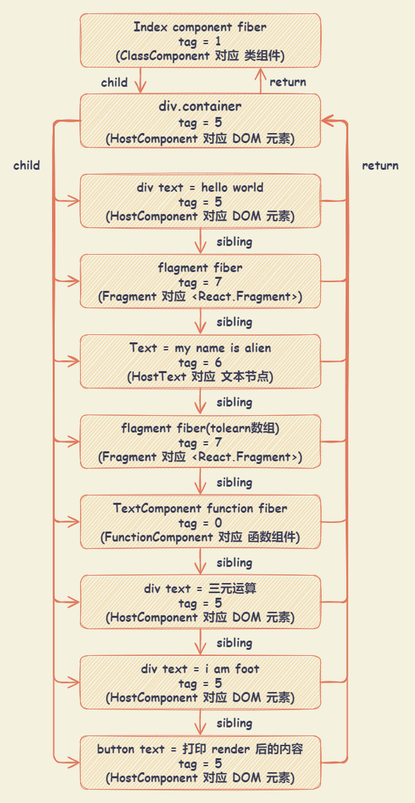

# JSX

JSX 是一种嵌入式的类似 XML 的语法。它可以被转换成合法的 JavaScript，尽管转换的语义是依据不同的实现而定的。

## JSX 简介

### JSX 嵌入表达式

在 JSX 语法中，可以在大括号（ `{ xxx }` ）内放置任何有效的 JavaScript 表达式。

```js
function formatName(user) {
  return user.firstName + ' ' + user.lastName
}

const user = {
  firstName: 'Harper',
  lastName: 'Perez',
}

const element = <h1>Hello, {formatName(user)}!</h1>
```

### JSX 中指定属性

在属性中嵌入 JavaScript 表达式时，不要在大括号外面加上引号。应该仅使用引号（对于字符串值）或大括号（对于表达式）中的一个，对于同一属性不能同时使用这两种符号。

因为 JSX 语法上更接近 JavaScript 而不是 HTML，所以 React DOM 使用 `camelCase`（小驼峰命名）来定义属性的名称，而不使用 HTML 属性名称的命名约定。

```js
const element = <a href="https://www.reactjs.org"> link </a>
const element = </img>
```

### JSX 防止注入攻击

React DOM 在渲染所有输入内容之前，默认会进行转义。所有的内容在渲染之前都被转换成了字符串，可以有效地防止 `XSS（cross-site-scripting, 跨站脚本）` 攻击。

### JSX 表示对象 - React 元素

```js
const element = <h1 className="greeting">Hello, world!</h1>

// ========== 等效于 ==========

const element = React.createElement(
  'h1',
  { className: 'greeting' },
  'Hello, world!'
)
```

### 指定 React 元素类型

大写字母开头的 JSX 标签是 React 组件（例如： `<Foo />`），标签会被编译为对命名变量的直接引用。

- 以小写字母开头的元素，代表一个 HTML 内置组件，比如 `<div>` 或者 `<span>` 会生成相应的字符串 `'div'` 或者 `'span'` 传递给 `React.createElement`（作为参数）
- 以大写字母开头的元素，对应着在 JavaScript 引入或自定义的组件，如 `<Foo />` 会编译为 `React.createElement(Foo)`。

如果 React Runtime 模式为 `Classic Runtime` 模式，则需要引入 React （`import React from 'react'`）

在 JSX 中，在一个模块中导出许多 React 组件时，可以使用点语法来引用一个 React 组件。

```js {8}
const MyComponents = {
  DatePicker: function DatePicker(props) {
    return <div>Imagine a {props.color} datepicker here.</div>
  },
}

function BlueDatePicker() {
  return <MyComponents.DatePicker color="blue" />
}
```

通过通用表达式来（动态）决定元素类型，需要首先将它赋值给大写字母开头的变量。这通常用于根据 `prop` 来渲染不同组件的情况下。

```js
import { PhotoStory, VideoStory } from './stories'

const components = {
  photo: PhotoStory,
  video: VideoStory,
}

function Story(props) {
  const SpecificStory = components[props.storyType] // JSX 类型可以是大写字母开头的变量。
  return <SpecificStory story={props.story} />
}
```

### JSX 中的 Props

- 包裹在 `{}` 中的 JavaScript 表达式作为一个 `prop` 传递给 JSX 元素

  ```js
  <MyComponent foo={1 + 2 + 3 + 4} />
  ```

- 使用字符串字面量赋值给 `prop`

  ```js
  <MyComponent message="hello world" />
  <MyComponent message={'hello world'} />
  ```

- 没给 `prop` 赋值，默认值为 `true`

  ```js
  <MyTextBox autocomplete /> // 不推荐，因为可能与 ES6 对象简写混淆
  <MyTextBox autocomplete={true} /> // 推荐
  ```

- 使用 `if` 语句以及 `for` 循环：if 语句以及 for 循环不是 JavaScript 表达式，不能在 JSX 中直接使用，可以用在 JSX 以外的代码中

  ```js
  function NumberDescriber(props) {
    let description
    if (props.number % 2 == 0) {
      description = <strong>even</strong>
    } else {
      description = <i>odd</i>
    }
    return (
      <div>
        {props.number} is an {description} number
      </div>
    )
  }
  ```

- 属性展开：谨慎使用，容易将不必要的 props 传递给不相关的组件

  ```js
  const Button = props => {
    const { kind, ...other } = props
    const className = kind === 'primary' ? 'PrimaryButton' : 'SecondaryButton'
    // 保留 kind 的 props 属性，不会被传递给 <button> DOM 元素，其他的 props 会通过 ...other 对象传递
    return <button className={className} {...other} />
  }

  const App = () => {
    return (
      <div>
        <Button kind="primary" onClick={() => console.log('clicked!')}>
          Hello World!
        </Button>
      </div>
    )
  }
  ```

### JSX 中的子元素

包含在开始和结束标签之间的 JSX 表达式内容，将作为特定属性 `props.children` 传递给外层组件。

- 字符串字面量作为子元素

  ```js
  // JSX 会移除行首尾的空格以及空行。与标签相邻的空行均会被删除，文本字符串之间的新行会被压缩为一个空格
  // 此时，props.children 为该字符串（Hello world!）
  <MyComponent>Hello world!</MyComponent>
  ```

- JavaScript 表达式作为子元素：可以将被包裹在 `{}` 中作为子元素

  ```js
  function Item(props) {
    return <li>{props.message}</li>
  }

  function TodoList() {
    const todos = ['finish doc', 'submit pr', 'nag dan to review']
    return (
      <ul>
        {todos.map(message => (
          <Item key={message} message={message} />
        ))}
      </ul>
    )
  }
  ```

- 函数作为子元素

  ```js
  function Repeat(props) {
    let items = []
    for (let i = 0; i < props.numTimes; i++) {
      // 把回调函数作为 props.children 进行传递
      items.push(props.children(i))
    }
    return <div>{items}</div>
  }

  function ListOfTenThings() {
    return (
      <Repeat numTimes={10}>
        {index => <div key={index}>This is item {index} in the list</div>}
      </Repeat>
    )
  }
  ```

- 布尔类型、`Null` 以及 `Undefined` 作为子元素将会忽略

  `true`, `false`, `null`, `undefined` 是合法的子元素，但并不会被渲染，有助于依据特定条件来渲染其他的 React 元素。

  ```js
  <div>
    {showHeader && <Header />}
    <Content />
  </div>
  ```

  注意的是有一些 `falsy` 值（在 `Boolean` 上下文中认定为 `false` 的值。如：`false`, `0`, `-0`, `0n`, `''`, `null`, `undefined`, `NaN`），仍然会被 React 渲染，如果需要渲染它们，则需要转为字符串。

  ```js
  // 当 props.messages 是空数组时，将会渲染为数字 0
  <div>
    { props.messages.length && <MessageList messages={props.messages} /> }
  </div>

  // 如果需要解决该问题，则要确保 && 之前的表达式总是布尔值
  <div>
    { props.messages.length > 0 && <MessageList messages={props.messages} /> }
  </div>
  ```

## JSX 编译

Babel 会把 JSX 转译成使用 `React.createElement()` 的形式，创建并返回指定类型的新 `React` 元素。

在 `React.createElement(type, [props], [...children])` 函数中：

- `type` ：如果是组件类型，会传入组件对应的类或函数；如果是 dom 元素类型，传入 `div` 或者 `span` 之类的字符串
- `[props]` ：一个对象，在 dom 类型中为标签属性，在组件类型中为 `props`
- `[...children]` ：依次为 `children`，根据顺序排列

::: details React 组件示例

```js
import * as React from 'react'

const toLearn = ['react', 'vue', 'webpack', 'nodejs']
const TextComponent = () => <div> hello , i am function component </div>

class Index extends React.Component {
  status = false /* 状态 */
  renderFoot = () => <div> i am foot</div>
  render() {
    /* 以下都是常用的jsx元素节 */
    return (
      <div style={{ marginTop: '100px' }}>
        {/* element 元素类型 */}
        <div>hello,world</div>
        {/* fragment 类型 */}
        <React.Fragment>
          <div> 👽👽 </div>
        </React.Fragment>
        {/* text 文本类型 */}
        hello, javascript
        {/* 数组节点类型 */}
        {toLearn.map(item => (
          <div key={item}>let us learn {item} </div>
        ))}
        {/* 组件类型 */}
        <TextComponent />
        {/* 三元运算 */}
        {this.status ? <TextComponent /> : <div>三元运算</div>}
        {/* 函数执行 */}
        {this.renderFoot()}
        <button onClick={() => console.log(this.render())}>
          打印render后的内容
        </button>
      </div>
    )
  }
}

export default Index
```

:::

::: details 通过 Babel 编译成 React.createElement() 形式

```js
const toLearn = ['react', 'vue', 'webpack', 'nodejs']
const TextComponent = () =>
  /*#__PURE__*/ React.createElement(
    'div',
    null,
    ' hello , i am function component '
  )
class Index extends React.Component {
  constructor(...args) {
    super(...args)
    _defineProperty(this, 'status', false)
    _defineProperty(this, 'renderFoot', () =>
      /*#__PURE__*/ React.createElement('div', null, ' i am foot')
    )
  }
  render() {
    /* 以下都是常用的jsx元素节 */
    return /*#__PURE__*/ React.createElement(
      'div',
      {
        style: {
          marginTop: '100px',
        },
      },
      /*#__PURE__*/ React.createElement('div', null, 'hello,world'),
      /*#__PURE__*/ React.createElement(
        React.Fragment,
        null,
        /*#__PURE__*/ React.createElement(
          'div',
          null,
          ' \uD83D\uDC7D\uD83D\uDC7D '
        )
      ),
      'hello, javascript',
      toLearn.map(item =>
        /*#__PURE__*/ React.createElement(
          'div',
          {
            key: item,
          },
          'let us learn ',
          item,
          ' '
        )
      ),
      /*#__PURE__*/ React.createElement(TextComponent, null),
      this.status
        ? /*#__PURE__*/ React.createElement(TextComponent, null)
        : /*#__PURE__*/ React.createElement(
            'div',
            null,
            '\u4E09\u5143\u8FD0\u7B97'
          ),
      this.renderFoot(),
      /*#__PURE__*/ React.createElement(
        'button',
        {
          onClick: () => console.log(this.render()),
        },
        '\u6253\u5370render\u540E\u7684\u5185\u5BB9'
      )
    )
  }
}
var _default = Index
exports.default = _default
```

:::

::: details 通过 React.createElement() 转换后的结构

```js
{$$typeof: Symbol(react.element), type: 'div', key: null, ref: null, props: {…}, …}

$$typeof: Symbol(react.element)
key: null
props:
  children: Array(8)
    0: {$$typeof: Symbol(react.element), type: 'div', key: null, ref: null, props: {…}, …}
    1: {$$typeof: Symbol(react.element), type: Symbol(react.fragment), key: null, ref: null, props: {…}, …}
    2: "hello, javascript"
    3: Array(4)
      0: {$$typeof: Symbol(react.element), type: 'div', key: 'react', ref: null, props: {…}, …}
      1: {$$typeof: Symbol(react.element), type: 'div', key: 'vue', ref: null, props: {…}, …}
      2: {$$typeof: Symbol(react.element), type: 'div', key: 'webpack', ref: null, props: {…}, …}
      3: {$$typeof: Symbol(react.element), type: 'div', key: 'nodejs', ref: null, props: {…}, …}
      length: 4
      [[Prototype]]: Array(0)
    4: {$$typeof: Symbol(react.element), key: null, ref: null, props: {…}, type: ƒ, …}
    5: {$$typeof: Symbol(react.element), type: 'div', key: null, ref: null, props: {…}, …}
    6: {$$typeof: Symbol(react.element), type: 'div', key: null, ref: null, props: {…}, …}
    7: {$$typeof: Symbol(react.element), type: 'button', key: null, ref: null, props: {…}, …}
    length: 8
    [[Prototype]]: Array(0)
  style: {marginTop: '100px'}
  [[Prototype]]: Object
ref: null
type: "div"
_owner: null
_store: {validated: false}
_self: null
_source: null
[[Prototype]]: Object
```

:::

JSX 转换规则如下：

| JSX 元素类型      | React.createElement() 转换后                        | Type 属性                     |
| :---------------- | :-------------------------------------------------- | :---------------------------- |
| Element 元素类型  | `react element` 类型                                | 标签字符串，例如 `div`        |
| `Fragments` 类型  | `react element` 类型                                | `Symbol(react.fragment)` 类型 |
| 文本类型          | 直接字符串                                          | 无                            |
| 数组类型          | 返回数组结构，里面元素被 `react.createElement` 转换 | 无                            |
| 组件类型          | `react element` 类型                                | 组件类或者组件函数本身        |
| 三元运算 / 表达式 | 先执行三元运算，然后按照上述规则处理                | 根据三元运算返回结果而定      |
| 函数执行          | 先执行函数，然后按照上述规则处理                    | 根据函数执行返回结果而定      |

在 React 的调和过程（Reconcilliation）中，通过 JSX 编译转换为 React element 对象的每一个子节点都会形成一个与之对应的 `fiber` 对象，然后通过 `sibling`、`return`、`child` 将每一个 `fiber` 对象联系起来。

- `child` ： 一个由父级 `fiber` 指向子级 `fiber` 的指针
- `return` ：一个子级 `fiber` 指向父级 `fiber` 的指针
- `sibling` : 一个 `fiber` 指向下一个兄弟 `fiber` 的指针

React 针对不同 React element 对象会产生不同 tag (种类) 的 `fiber` 对象：

```js
export const FunctionComponent = 0 // 函数组件
export const ClassComponent = 1 // 类组件
export const IndeterminateComponent = 2 // 初始化的时候不知道是函数组件还是类组件
export const HostRoot = 3 // Root Fiber 可以理解为根元素，通过 reactDom.render() 产生的根元素
export const HostPortal = 4 // 对应 ReactDOM.createPortal 产生的 Portal
export const HostComponent = 5 // dom 元素，比如 <div>
export const HostText = 6 // 文本节点
export const Fragment = 7 // 对应 <React.Fragment>
export const Mode = 8 // 对应 <React.StrictMode>
export const ContextConsumer = 9 // 对应 <Context.Consumer>
export const ContextProvider = 10 // 对应 <Context.Provider>
export const ForwardRef = 11 // 对应 React.ForwardRef
export const Profiler = 12 // 对应 <Profiler/ >
export const SuspenseComponent = 13 // 对应 <Suspense>
export const MemoComponent = 14 // 对应 React.memo 返回的组件
```

示例 JSX 最终形成的 fiber 结构图如下：



## JSX 可控性 render

::: details JSX 可控性 render 示例

```js
import React from 'react'

const toLearn = ['react', 'vue', 'webpack', 'nodejs']
const TextComponent = () => <div> hello , i am function component </div>

class Index extends React.Component {
  status = false /* 状态 */
  renderFoot = () => <div> i am foot</div>
  /* 控制渲染 */
  controlRender = () => {
    const reactElement = (
      <div style={{ marginTop: '100px' }} className="container">
        {/* element 元素类型 */}
        <div>hello,world</div>
        {/* fragment 类型 */}
        <React.Fragment>
          <div> 👽👽 </div>
        </React.Fragment>
        {/* text 文本类型 */}
        hello, javascript
        {/* 数组节点类型 */}
        {toLearn.map(item => (
          <div key={item}>let us learn {item} </div>
        ))}
        {/* 组件类型 */}
        <TextComponent />
        {/* 三元运算 */}
        {this.status ? <TextComponent /> : <div>三元运算</div>}
        {/* 函数执行 */}
        {this.renderFoot()}
        <button onClick={() => console.log(this.render())}>
          打印 render 后的内容
        </button>
      </div>
    )
    console.log('reactElement', reactElement)

    const { children } = reactElement.props

    /* 第1步 ： 使用 React.Children.toArray 扁平化，规范化 children 数组  */
    const flatChildren = React.Children.toArray(children)
    console.log('flatChildren', flatChildren)

    /* 第2步 ： 使用 React.Children.forEach 去遍历 children ，验证 React.element 元素节点，除去文本节点 */
    /* React.isValidElement 方法可以用来检测是否为 React element 元素 */
    const newChildren = []
    React.Children.forEach(flatChildren, item => {
      if (React.isValidElement(item)) newChildren.push(item)
    })

    /* 第3步 ： 用 React.createElement ，插入到 children 最后 */
    /* React.createElement 方法以 element 元素为样板克隆并返回新的 React element 元素 */
    const lastChildren = React.createElement(
      `div`,
      { className: 'last' },
      `say goodbye`
    )
    newChildren.push(lastChildren)

    /* 第4步 ： 已经修改了 children，通过 cloneElement 创建新的容器元素 */
    const newReactElement = React.cloneElement(reactElement, {}, ...newChildren)
    return newReactElement
  }
  render() {
    return this.controlRender()
  }
}

export default Index
```

:::

React 相关 API ：

- `React.isValidElement(object)` : 验证对象是否为 React 元素，返回值为 `true` 或 `false` 。
- `React.createElement(type, [props], [...children])` : 创建并返回指定类型的新 React 元素。
- `React.cloneElement(element, [config], [...children])` : 以 element 元素为样板克隆并返回新的 React 元素。
- `React.createFactory(type)` : 返回用于生成指定类型 React 元素的函数。
- `React.Children` 用于处理 `this.props.children` 不透明数据结构的实用方法
  - `React.Children.map(children, function[(thisArg)])` : 在 `children` 里的每个直接子节点上调用一个函数，并将 `this` 设置为 `thisArg`。
    - 如果 `children` 是一个数组，它将被遍历并为数组中的每个子节点调用该函数。
    - 如果子节点为 `null` 或是 `undefined`，则此方法将返回 `null` 或是 `undefined`，而不会返回数组。
  - `React.Children.forEach(children, function[(thisArg)])` : 与 `React.Children.map()` 类似，但它不会返回一个数组。
  - `React.Children.count(children)` : 返回 `children` 中的组件总数量，等同于通过 `map` 或 `forEach` 调用回调函数的次数。
  - `React.Children.only(children)` : 验证 `children` 是否只有一个子节点（一个 React 元素），如果有则返回它，否则此方法会抛出错误。
  - `React.Children.toArray(children)` : 将 `children` 这个复杂的数据结构以数组的方式扁平展开并返回，并为每个子节点分配一个 `key`。

## Babel 解析 JSX 流程

JSX 语法实现来源于这两个 babel 插件：

- `@babel/plugin-syntax-jsx` : 使 Babel 能够有效的解析 JSX 语法
- `@babel/plugin-transform-react-jsx` : 内部调用了 `@babel/plugin-syntax-jsx`，可以把 React JSX 转化成 JS 能够识别的 `createElement` 格式

React Runtime 模式

- `Automatic Runtime` 模式

  新的 JSX 转换不会将 JSX 转换为 `React.createElement`，而是自动从 React 的 package 中引入新的入口函数并调用。

  `plugin-syntax-jsx` 向文件中提前注入了 `_jsxRuntime` API，需要在 `.babelrc` 设置 `runtime: automatic` 。

  ```js
  // 使用 @babel/plugin-transform-react-jsx
  {
    "plugins": [
      ["@babel/plugin-transform-react-jsx", { "runtime": "automatic" }]
    ]
  }

  // 使用 @babel/preset-react
  {
    "presets": [
      ["@babel/preset-react", { "runtime": "automatic" }]
    ]
  }
  ```

  ```js
  function App() {
    return <h1>Hello World</h1>
  }

  // ========== 使用 Automatic Runtime 模式编译 ==========

  var _jsxRuntime = require('react/jsx-runtime')
  function App() {
    return /*#__PURE__*/ (0, _jsxRuntime.jsx)('h1', {
      children: 'Hello World',
    })
  }
  ```

- `Classic Runtime` 模式

  在经典模式下，使用 JSX 的文件需要引入 React ，不然就会报错。

  ```js
  import React from 'react'

  function App() {
    return <h1>Hello World</h1>
  }

  // ========== 使用 Automatic Runtime 模式编译 ==========

  var _react = _interopRequireDefault(require('react'))
  function _interopRequireDefault(obj) {
    return obj && obj.__esModule ? obj : { default: obj }
  }
  function App() {
    return /*#__PURE__*/ _react.default.createElement('h1', null, 'Hello World')
  }
  ```
