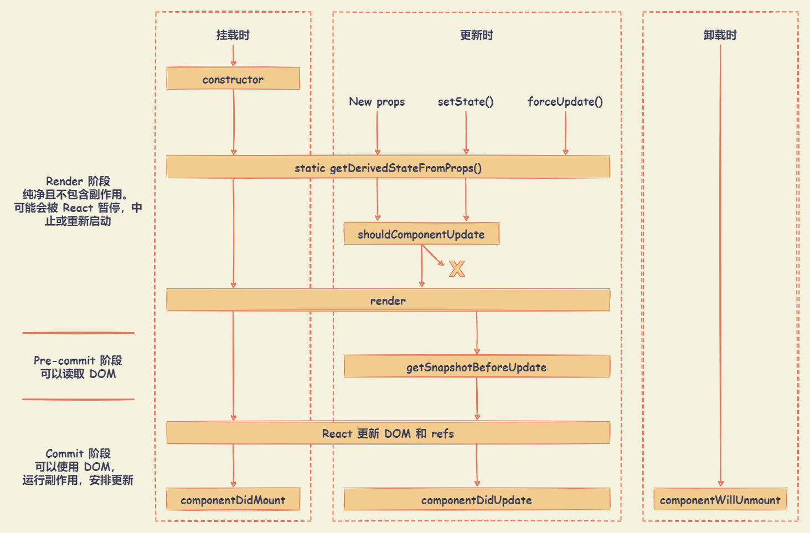

# React 生命周期

## 类组件生命周期



React 生命周期图示： <https://projects.wojtekmaj.pl/react-lifecycle-methods-diagram>

### constructor

在 React 组件挂载之前，会调用它的构造函数。在为 `React.Component` 子类实现构造函数时，应在其他语句之前调用 `super(props)`。

`constructor` 构造函数作用：

- 初始化 `state` 。比如，可以用来截取路由中的参数，赋值给 `state` 。
- 对类组件的事件进行处理。比如，绑定 `this` 、节流、防抖等。
- 对类组件进行一些必要生命周期的劫持，渲染劫持，该功能更适合反向继承的 HOC。

```js
class ExampleComponent extends React.Component {
  constructor(props) {
    // 执行 super , 在接下来的上下文中，获取到 props
    super(props)
    // 初始化 state : 通过给 this.state 赋值对象来初始化内部 state
    this.state = { counter: 0 }
    // 绑定 this : 为事件处理函数绑定实例
    this.handleAddClick = this.handleAddClick.bind(this)

    // 【禁止】不要在 constructor 构造函数中调用 this.setState()
    // 【禁止】避免将 props 的值复制给 state ，可以修改 props 值的 key
    // this.state = { color: props.color } // 避免 !!!
    // this.state = { email: props.defaultEmail } // 可修改 props 值的 key
  }

  handleAddClick() {
    console.log('【add】 handleClick')
    this.setState({ counter: this.state.counter + 1 })
  }

  // 使用箭头函数，可以不为事件处理函数绑定实例
  handleMinusClick = () => {
    console.log('【minus】 handleClick')
    this.setState({ counter: this.state.counter - 1 })
  }

  render() {
    return (
      <div>
        <div>counter : {this.state.counter}</div>
        <button onClick={this.handleAddClick}> add click </button>
        <button onClick={this.handleMinusClick}> minus click </button>
      </div>
    )
  }
}
```

### getDerivedStateFromProps

`getDerivedStateFromProps(props, state)` 生命周期函数

- 该函数应该返回一个对象来更新 `state`，如果返回 `null` 则不更新任何内容
- 该函数存在只有一个目的：**让组件在 `props` 变化时更新 `state`**
- 该函数在调用 `render` 方法之前调用，并且在初始挂载及后续更新时都会被调用
- 该函数无权访问到组件实例。可以通过提取组件 `props` 的纯函数及 `class` 之外的状态，在 `getDerivedStateFromProps()` 和其他 `class` 方法之间重用代码。

遵循有保守使用派生 `state` 规则。`getDerivedStateFromProps()` 适用于罕见的用例，即 `state` 的值在任何时候都取决于 props。

::: details 【Demo】基于 props 更新 state

```js
class ExampleComponent extends React.Component {
  // 在构造函数中初始化 state，或者使用属性初始化器。
  state = {
    isScrollingDown: false,
    lastRow: null,
  }

  static getDerivedStateFromProps(props, state) {
    if (props.currentRow !== state.lastRow) {
      return {
        isScrollingDown: props.currentRow > state.lastRow,
        lastRow: props.currentRow,
      }
    }

    // 返回 null 表示无需更新 state
    return null
  }
}
```

:::

::: details 【Demo】props 更新时获取外部数据

```js
class ExampleComponent extends React.Component {
  state = {
    externalData: null,
  }

  static getDerivedStateFromProps(props, state) {
    // 保存 prevId 在 state 中，以便我们在 props 变化时进行对比。
    // 清除之前加载的数据（这样我们就不会渲染旧的内容）。
    if (props.id !== state.prevId) {
      return {
        externalData: null,
        prevId: props.id,
      }
    }

    return null // 无需更新 state
  }

  componentDidMount() {
    this._loadAsyncData(this.props.id)
  }

  componentDidUpdate(prevProps, prevState) {
    if (this.state.externalData === null) {
      this._loadAsyncData(this.props.id)
    }
  }

  componentWillUnmount() {
    if (this._asyncRequest) {
      this._asyncRequest.cancel()
    }
  }

  render() {
    if (this.state.externalData === null) {
      // 渲染加载状态 ...
    } else {
      // 渲染真实 UI ...
    }
  }

  _loadAsyncData(id) {
    this._asyncRequest = loadMyAsyncData(id).then(externalData => {
      this._asyncRequest = null
      this.setState({ externalData })
    })
  }
}
```

:::

大部分使用派生 `state` （derived state，即：一个组件的 `state` 中的某个数据来自外部）导致的问题，不外乎两个原因：

- 直接复制 `props` 到 `state` 上
- 如果 `props` 和 `state` 不一致就更新 `state`

派生 `state` 会导致代码冗余，并使组件难以维护。相关场景可使用一下替代方案：

- 需要执行副作用（例如，数据提取或动画）以响应 `props` 中的更改，可改用 `componentDidUpdate` 生命周期。
- 使用 `componentWillReceiveProps` 仅在 `prop` 更改时重新计算某些数据，可使用 [memoization helper](https://zh-hans.reactjs.org/blog/2018/06/07/you-probably-dont-need-derived-state.html#what-about-memoization) 代替。
- 使用 `componentWillReceiveProps` 是为了在 `prop` 更改时，“重置”某些 `state`，可使用组件 [完全受控](https://zh-hans.reactjs.org/blog/2018/06/07/you-probably-dont-need-derived-state.html#recommendation-fully-controlled-component) 或 [使用 key 使组件完全不受控](https://zh-hans.reactjs.org/blog/2018/06/07/you-probably-dont-need-derived-state.html#recommendation-fully-uncontrolled-component-with-a-key) 代替。

**受控** 和 **非受控** 通常用来指代表单的 `inputs`，但是也可以用来描述数据频繁更新的组件。

- 用 `props` 传入数据的话，组件可以被认为是**受控**（因为组件被父级传入的 `props` 控制）
- 数据只保存在组件内部的 `state` 的话，是**非受控组件**（因为外部没办法直接控制 `state`）

### render

```js
class ExampleComponent extends React.Component {
  constructor(props) {
    // 执行 super , 在接下来的上下文中，获取到 props
    super(props)
  }

  render() {
    return (
      <div>
        <div>Hello World！！！</div>
        <MyComponent />
      </div>
    )
  }
}
```

`render()` 方法是 class 组件中唯一必须实现的方法。

当 render 被调用时，它会检查 this.props 和 this.state 的变化并返回以下类型之一：

- React 元素。通常通过 JSX 创建，无论是 DOM 元素还是自定义组件均为 React 元素。

  ```js
  class ExampleComponent extends React.Component {
    render() {
      return (
        <div>
          <div>Hello World！！！</div>
          <MyComponent />
        </div>
      )
    }
  }
  ```

- 数组或 `fragments`。 使得 `render` 方法可以返回多个元素。

  ```js
  class ExampleComponent extends React.Component {
    render() {
      return (
        // <React.Fragment></React.Fragment> 也可以使用新的短语法 <></>
        <React.Fragment>
          <ChildA />
          <ChildB />
          <ChildC />
        </React.Fragment>
      )
    }
  }
  ```

- `Portals`。可以渲染子节点到不同的 DOM 子树中。

  ::: details 使用 Portals 渲染一个 Modal 组件

  ```js
  const modalRoot = document.getElementById('modal-root')

  class Modal extends React.Component {
    constructor(props) {
      super(props)
      this.el = document.createElement('div')
    }

    componentDidMount() {
      // 在 Modal 的所有子元素被挂载后，
      // portal 元素会被嵌入到 DOM 树中，意味着子元素将被挂载到一个分离的 DOM 节点中。
      // ====================
      // 如果要求子组件在挂载时可以立刻接入 DOM 树，
      // 例如，衡量一个 DOM 节点，或者在后代节点中使用 'autoFocus'，
      // 则需添加 state 到 Modal 中，仅当 Modal 被插入 DOM 树中才能渲染子元素。
      modalRoot.appendChild(this.el)
    }

    componentWillUnmount() {
      modalRoot.removeChild(this.el)
    }

    render() {
      // ReactDOM.createPortal(child, container) 提供了一种将子节点渲染到存在于父组件以外的 DOM 节点
      // > child : 是任何可渲染的 React 子元素，例如一个元素，字符串或 fragment
      // > container : 一个 DOM 元素
      return ReactDOM.createPortal(this.props.children, this.el)
    }
  }

  class ExampleComponent extends React.Component {
    constructor(props) {
      super(props)
      this.state = {
        isShowModal: false,
      }
    }

    handleShowModal = () => {
      this.setState({ isShowModal: true })
    }
    handleHideModal = () => {
      this.setState({ isShowModal: false })
    }

    render() {
      const renderModal = () => {
        return (
          <Modal>
            <div>modal content</div>
            <button onClick={this.handleHideModal}>Hide Modal</button>
          </Modal>
        )
      }

      return (
        <div>
          <button onClick={this.handleShowModal}>Show Modal</button>
          {this.state.isShowModal ? renderModal() : null}
        </div>
      )
    }
  }
  ```

  :::

- 字符串或数值类型。在 DOM 中会被渲染为文本节点。
- 布尔类型或 `null`。什么都不渲染。

注：如果 `shouldComponentUpdate()` 返回 `false`，则不会调用 `render()`。

### componentDidMount

`componentDidMount()` 会在组件挂载后（插入 DOM 树中）立即调用。

- 可以处理一些关于 DOM 操作，比如基于 DOM 的事件监听器。
- 通过网络请求获取数据，渲染视图。
- 添加订阅。如果添加了订阅，记得在 `componentWillUnmount()` 里取消订阅。

```js
class ExampleComponent extends React.Component {
  componentDidMount() {
    /* 延时器 */
    this.timer = setTimeout(() => {
      console.log('componentDidMount timer')
    }, 3000)

    /* 事件监听 */
    this.divDomRef.current.addEventListener('click', this.handerClick)

    /* 数据请求 */
    this.fetchData()
  }

  componentWillUnmount() {
    clearTimeout(this.timer) /* 清除延时器 */

    /* 卸载事件监听器 */
    this.node.removeEventListener('click', this.handerClick)
  }

  handerClick = () => {}

  fetchData = () => {}

  render() {
    this.divDomRef = React.createRef()

    return (
      <div>
        <div ref={this.divDomRef}>Hello World！！！</div>
      </div>
    )
  }
}
```

在 `componentDidMount()` 里直接调用 `setState()` ，将触发额外渲染，但此渲染会发生在浏览器更新屏幕之前。如此保证了即使在 `render()` 两次调用的情况下，用户也不会看到中间状态。谨慎使用该模式，因为它会导致性能问题。通常，在 `constructor()` 中初始化 `state`。如果渲染依赖于 DOM 节点的大小或位置，比如实现 `modals` 和 `tooltips` 等情况下，可以使用此方式处理。

### getSnapshotBeforeUpdate

`getSnapshotBeforeUpdate(prevProps, prevState)` 在最近一次渲染输出（提交到 DOM 节点）之前调用。

- 使得组件能在发生更改之前从 DOM 中捕获一些信息（例如，滚动位置）。
- 此生命周期方法的任何返回值将作为参数传递给 `componentDidUpdate()`。

::: details 【Demo】以特殊方式处理滚动位置的聊天线程

```js
class ExampleComponent extends React.Component {
  constructor(props) {
    super(props)
    this.listRef = React.createRef()
  }

  getSnapshotBeforeUpdate(prevProps, prevState) {
    // 判断 list 是否新增元素，捕获滚动​​位置以便稍后调整滚动位置
    if (prevProps.list.length < this.props.list.length) {
      const list = this.listRef.current
      return list.scrollHeight - list.scrollTop
    }
    return null
  }

  componentDidUpdate(prevProps, prevState, snapshot) {
    // 如果 snapshot 有值，说明添加了新的 items，
    // 调整滚动位置使得这些新 items 不会将旧的 items 推出视图。
    //（这里的 snapshot 是 getSnapshotBeforeUpdate 的返回值）
    if (snapshot !== null) {
      const list = this.listRef.current
      list.scrollTop = list.scrollHeight - snapshot
    }
  }

  render() {
    return <div ref={this.listRef}>{/* ...contents... */}</div>
  }
}
```

:::

### componentDidUpdate

`componentDidUpdate(prevProps, prevState, snapshot)` 会在更新后会被立即调用。首次渲染不会执行此方法。

- 当组件更新后，可以在此处对 DOM 进行操作。
- 对更新前后的 `props` 进行了比较，也可以选择在此处进行网络请求。（例如，当 `props` 未发生变化时，则不会执行网络请求）。
- 在该生命周期中，可以调用 `setState()` ，但需要注意必须被包裹在一个条件语句里，否则会导致死循环。
- 如果组件实现了 `getSnapshotBeforeUpdate()` 生命周期，则它的返回值将作为 `componentDidUpdate()` 的第三个参数 `snapshot` 参数传递，否则此参数将为 `undefined`。

注：如果 `shouldComponentUpdate()` 返回值为 `false`，则不会调用 `componentDidUpdate()`。

### shouldComponentUpdate

当 `props` 或 `state` 发生变化时，`shouldComponentUpdate(nextProps, nextState)` 会在渲染执行之前被调用。

根据 `shouldComponentUpdate()` 的返回值，判断 React 组件的输出是否受当前 `state` 或 `props` 更改的影响。

- 返回为 `true` : 组件会被重新渲染，默认行为。
- 返回为 `false` : 组件不会被重新渲染，不会调用 `UNSAFE_componentWillUpdate()`，`render()` 和 `componentDidUpdate()`。返回 `false` 并不会阻止子组件在 `state` 更改时重新渲染。

```js
class ExampleComponent extends React.Component {
  shouldComponentUpdate(newProps, newState) {
    if (newProps.a !== this.props.a) {
      /* props中 a 属性发生变化，渲染组件 */
      return true
    } else if (newState.b !== this.props.b) {
      /* state 中 b 属性发生变化，渲染组件 */
      return true
    } else {
      /* 否则组件不渲染 */
      return false
    }
  }

  render() {
    return (
      <div>
        <div>Hello World！！！</div>
      </div>
    )
  }
}
```

此方法仅作为性能优化的方式而存在。不要企图依靠此方法来“阻止”渲染，因为这可能会产生 bug。应该考虑使用内置的 `PureComponent` 组件，而不是手动编写 `shouldComponentUpdate()`。`React.PureComponent` 会对 `props` 和 `state` 进行浅层比较，并减少了跳过必要更新的可能性。

后续版本，React 可能会将 `shouldComponentUpdate()` 视为提示而不是严格的指令，并且，当返回 `false` 时，仍可能导致组件重新渲染。

### componentWillUnmount

`componentWillUnmount()` 会在组件卸载及销毁之前直接调用。

在此方法中执行必要的清理操作，例如，清除 `timer`，取消网络请求或清除在 `componentDidMount()` 中创建的订阅等。

### UNSAFE_componentWillReceiveProps

::: warning

注：此生命周期之前名为 `componentWillReceiveProps`，React 已经不推荐使用，未来版本会被废弃。新方法名（`UNSAFE_componentWillReceiveProps`）在 React 16.9 和 React 17.x 中，仍可以继续使用。

可以使用 `rename-unsafe-lifecycles codemod` 将旧的生命周期方法名替换。例如 `componentWillMount` 会被替换为 `UNSAFE_componentWillMount`。

```shell
cd your_project
npx react-codemod rename-unsafe-lifecycles
```

:::

```js
UNSAFE_componentWillReceiveProps(nextProps)
```

`UNSAFE_componentWillReceiveProps(nextProps)` 会在已挂载的组件接收新的 `props` 之前被调用。

- 如果需要更新状态以及响应 `prop` 更改，可以比较 `this.props` 和 `nextProps`，并在该方法中使用 `this.setState()` 执行 `state` 转换。
- 如果父组件导致组件重新渲染，即使 `props` 没有更改，也会调用此方法。如果只想处理更改，请确保进行当前值与变更值的比较。
- 在挂载过程中，React 不会针对初始 `props` 调用 `UNSAFE_componentWillReceiveProps()`。
- 组件只会在组件的 `props` 更新时调用此方法。调用 `this.setState()` 通常不会触发 `UNSAFE_componentWillReceiveProps()`。

::: warning

使用此生命周期方法通常会出现 bug 和不一致性：

- 需要执行副作用（例如，数据提取或动画）以响应 `props` 中的更改，可改用 `componentDidUpdate` 生命周期。
- 使用 `componentWillReceiveProps` 仅在 `prop` 更改时重新计算某些数据，可使用 [memoization helper](https://zh-hans.reactjs.org/blog/2018/06/07/you-probably-dont-need-derived-state.html#what-about-memoization) 代替。
- 使用 `componentWillReceiveProps` 是为了在 `prop` 更改时，“重置”某些 `state`，可使用组件 [完全受控](https://zh-hans.reactjs.org/blog/2018/06/07/you-probably-dont-need-derived-state.html#recommendation-fully-controlled-component) 或 [使用 key 使组件完全不受控](https://zh-hans.reactjs.org/blog/2018/06/07/you-probably-dont-need-derived-state.html#recommendation-fully-uncontrolled-component-with-a-key) 代替。

:::

### UNSAFE_componentWillMount

::: warning

注：此生命周期之前名为 `componentWillMount`，React 已经不推荐使用，未来版本会被废弃。新方法名（`UNSAFE_componentWillMount`）在 React 16.9 和 React 17.x 中，仍可以继续使用。

:::

```js
UNSAFE_componentWillMount()
```

`UNSAFE_componentWillMount()` 在挂载之前被调用，它在 `render()` 之前调用。

- 在此方法中同步调用 `setState()` 不会触发额外渲染。
- 建议使用 `constructor()` 来初始化 `state`。避免在此方法中引入任何副作用或订阅。如遇此种情况，请改用 `componentDidMount()`。
- 此方法是服务端渲染唯一会调用的生命周期函数。

### UNSAFE_componentWillUpdate

::: warning

注：此生命周期之前名为 `componentWillUpdate`，React 已经不推荐使用，未来版本会被废弃。新方法名（`UNSAFE_componentWillUpdate`）在 React 16.9 和 React 17.x 中，仍可以继续使用。

:::

```js
UNSAFE_componentWillUpdate(nextProps, nextState)
```

当组件收到新的 `props` 或 `state` 时，会在渲染之前调用 `UNSAFE_componentWillUpdate()`。

- 使用此作为在更新发生之前执行准备更新的机会。
- 初始渲染不会调用此方法。
- 如果在此方法中读取 DOM 信息（例如，为了保存滚动位置），则可以将此逻辑移至 `getSnapshotBeforeUpdate()` 中。

注：

- 不能此方法中调用 `this.setState()`
- 在 `UNSAFE_componentWillUpdate()` 返回之前，也不应该执行任何其他操作（例如，`dispatch` Redux 的 `action`）触发对 React 组件的更新
- 如果 `shouldComponentUpdate()` 返回 `false`，则不会调用 `UNSAFE_componentWillUpdate()`

## 函数组件生命周期

### useEffect

```js
useEffect(() => {
  // ... effect function
  return destoryCallback // destory function
}, deps)
```

- 第一个参数为 **callback 回调函数** 。可在回调函数中返回 destoryCallback 清除函数
  - **callback 回调函数** : 在组件渲染完毕之后执行的 effect （副作用）。默认情况下，effect 将在每轮渲染结束后执行。回到函数不会阻塞浏览器绘制视图。
  - **destoryCallback 清除函数** : 用于在行下一个 effect 之前，清除上一个 callback 回调函数产生的 effect 。通常应用于，组件卸载时，需要清除 effect 创建的诸如订阅或计时器 ID 等资源。
- 第二个参数作为 **依赖项数组**。只有当依赖项数组改变时，才会执行上一次 callback 回调函数返回的 destoryCallback 清除函数，和执行新的 effect （即：callback 回调函数）。
  - 默认情况下，effect 会在每轮组件渲染完成后执行。
  - 使用依赖项数组优化方式，需确保数组中包含了所有外部作用域中会发生变化且在 effect 中使用的变量，否则代码会引用到先前渲染中的旧变量。
  - 如果只需要执行只运行一次的 effect（仅在组件挂载和卸载时执行），依赖项可传递为一个空数组（`[]`）

```js
useEffect(() => {
  const subscription = props.source.subscribe()
  return () => {
    subscription.unsubscribe() // 清除订阅
  }
}, [props.source])
```

`useEffect` 回调函数 和 `componentDidMount` / `componentDidUpdate` 执行时机的区别：

- `useEffect` 对 React 执行栈来看是异步执行的，不会阻塞浏览器的绘制，而 `componentDidMount` / `componentDidUpdate` 是同步执行的。
- 在执行时机上 `，componentDidMount` / `componentDidUpdate` 和 `useLayoutEffect` 更类似。

### useLayoutEffect

`useLayoutEffect` 和 `useEffect` 不同的地方是采用了同步执行

```js
useLayoutEffect(() => {
  // ... effect function
  return destoryCallback // destory function
}, deps)
```

- `useLayoutEffect` 在 DOM 更新之后，浏览器执行绘制之前，其 callback 回调函数的更新计划会被同步执行。

  可使用它来读取 DOM 布局并同步触发重渲染，这样浏览器只会绘制一次。如果修改 DOM 布局放在 `useEffect` ，那 `useEffect` 执行是在浏览器绘制视图之后，然后又改 DOM ，就可能会导致浏览器再次回流和重绘，视图上可能会造成闪现突兀的效果。

- `useLayoutEffect` callback 回调函数中，代码执行会阻塞浏览器绘制。

对于 `useEffect` 和 `useLayoutEffect` 使用的选择：

- 修改 DOM ，改变布局使用 `useLayoutEffect`
- 其他情况，使用 `useEffect`

### useInsertionEffect

`useInsertionEffect` 在 DOM 更新之前执行。主要用于解决 CSS-in-JS 在渲染中注入样式的性能问题，避免了浏览器出现再次重回和重排的可能，解决了性能上的问题。

```js
import { useLayoutEffect, useInsertionEffect, useEffect } from 'react'

function ExampleComponent() {
  useEffect(() => {
    console.log('useEffect')
  }, [])

  useLayoutEffect(() => {
    console.log('useLayoutEffect')
  }, [])

  useInsertionEffect(() => {
    console.log('useInsertionEffect')
  }, [])

  return <div>ExampleComponent</div>
}

// 执行顺序如下：
// useInsertionEffect - 在所有 DOM 突变之前同步触发
// useLayoutEffect - 在 DOM 更新之后，浏览器执行绘制之前执行
// useEffect - 在组件渲染完毕之后执行
```

CSS-in-JS 的实现原理，以 Styled-components 为例：

- 通过 styled-components，可以使用 ES6 的标签模板字符串语法（Tagged Templates）为需要 styled 的 Component 定义一系列 CSS 属性。
- 当该组件的 JS 代码被解析执行的时候，styled-components 会动态生成一个 CSS 选择器，并把对应的 CSS 样式通过 style 标签的形式插入到 head 标签里面。
- 动态生成的 CSS 选择器会有一小段哈希值来保证全局唯一性来避免样式发生冲突。
- 这种模式下，本质上是动态生成 style 标签。

在 useLayoutEffect 中，使用 CSS-in-JS 带来的性能问题：

- 在 useLayoutEffect 中，此时 DOM 已经更新完成，布局也已经确定，只需要进行浏览器绘制。
- 使用 CSS-in-JS 动态生成 style 标签，则会再次影响布局，导致浏览器再次重回和重排。

```js
function ExampleComponent() {
  useInsertionEffect(() => {
    /* 动态创建 style 标签插入到 head 中 */
    const style = document.createElement('style')
    style.innerHTML = `
       .css-in-js{
         color: red;
         font-size: 20px;
       }
     `
    document.head.appendChild(style)
  }, [])

  return <div className="css-in-js">ExampleComponent</div>
}
```

::: warning

`useInsertionEffect` 应仅限于 css-in-js 库作者使用。优先考虑使用 `useEffect` 或 `useLayoutEffect` 来替代。

:::

### Hooks 替代生命周期方案

#### componentDidMount 替代方案

`useEffect` 依赖项数组为空数组（`[]`），只会执行一次的 effect（副作用），仅在组件挂载和卸载时执行。

```js
useEffect(() => {
  /* 可进行请求数据、事件监听、操纵 DOM、增加定时器，延时器 */
}, []) /* 注意：依赖项数组 deps = [] */
```

#### componentWillUnmount 替代方案

在 `componentDidMount` 的前提下，`useEffect` 第一个参数 callback 回调函数 的返回函数（即：destoryCallback 清除函数），可以作为 `componentWillUnmount` 使用。用于在行下一个 effect 之前，清除上一个 callback 回调函数产生的 effect 。通常应用于，组件卸载时，需要清除 effect 创建的诸如订阅或计时器 ID 等资源。

```js
useEffect(() => {
  /* 可进行请求数据、事件监听、操纵 DOM、增加定时器或延时器 */
  return function componentWillUnmount() {
    /* 解除事件监听器、清除定时器或延时器 */
  }
}, []) /* 注意：依赖项数组 deps = [] */
```

#### componentWillReceiveProps 替代方案

`useEffect` 与 `componentWillReceiveProps` 的区别：

- 两者的执行阶段根本不同。`useEffect` 是在 `render` 阶段，`componentWillReceiveProps` 是在 `commit` 阶段。
- `useEffect` 会初始化执行一次，但是 `componentWillReceiveProps` 只有组件更新 props 变化的时候才会执行。

```js
// 依赖项 props 变化，执行 effect ，模拟 componentWillReceiveProps
useEffect(() => {
  // ... effect function
}, [props])

// 可以针对 props 中的某一个属性进行追踪
// 当前仅当 props 中的 number 属性变化，执行当前 effect
useEffect(() => {
  // ... effect function
}, [props.number])
```

#### componentDidUpdate 替代方案

`useEffect` 和 `componentDidUpdate` 的区别：

- `useEffect` 是异步执行，`componentDidUpdate` 是同步执行 ，但都是在 `commit` 阶段。
- `useEffect` 会默认执行一次，而 `componentDidUpdate` 只有在组件更新完成后执行。

```js
// 组件更新完成，执行当前 effect
useEffect(() => {
  // ... effect function
}) /* 注意：没有依赖项数组 deps */
```

### Hooks 模拟生命周期示例

```js
import { useState, useEffect } from 'react'

function FunctionLifecycle(props) {
  const [num, setNum] = useState(0)
  useEffect(() => {
    /* 可进行请求数据、事件监听、操纵 DOM、增加定时器，延时器 */
    console.log('组件挂载完成，模拟 【componentDidMount】')
    return function componentWillUnmount() {
      /* 解除事件监听器 ，清除定时器，延时器 */
      console.log('组件销毁，模拟 【componentWillUnmount】')
    }
  }, []) /* 注意：依赖项数组 deps = [] */

  useEffect(() => {
    console.log('props 变化，模拟 【componentWillReceiveProps】')
  }, [props])

  useEffect(() => {
    console.log('组件更新完成，模拟 【componentDidUpdate】 ')
  })

  return (
    <div>
      <div> props : {props.number} </div>
      <div> states : {num} </div>
      <button onClick={() => setNum(state => state + 1)}>改变 state</button>
    </div>
  )
}

function ExampleComponent() {
  const [number, setNumber] = useState(0)
  const [isRender, setRender] = useState(true)
  return (
    <div>
      {isRender && <FunctionLifecycle number={number} />}
      <button onClick={() => setNumber(state => state + 1)}>改变 props</button>
      <button onClick={() => setRender(false)}>卸载组件</button>
    </div>
  )
}
```

### ScrollView 组件

::: details ScrollView 组件 Demo

```js
import React, { useState, useEffect } from 'react'
import { debounce } from 'lodash'

class ScrollView extends React.Component {
  /* ========== 自定义事件 ========== */
  /* 控制滚动条滚动 */
  handerScroll = e => {
    const { scroll } = this.props
    scroll && scroll(e)
    this.handerScrolltolower()
  }
  /* 判断滚动条是否到底部 */
  handerScrolltolower() {
    const { scrolltolower } = this.props
    const { scrollHeight, scrollTop, offsetHeight } = this.node
    if (scrollHeight === scrollTop + offsetHeight) {
      /* 到达容器底部位置 */
      scrolltolower && scrolltolower()
    }
  }
  node = null

  /* ========== 生命周期 ========== */
  constructor(props) {
    super(props)
    this.state = {
      list: [] /* 初始化 Data */,
    }
    this.handerScrolltolower = debounce(
      this.handerScrolltolower,
      200
    ) /* 防抖处理 */
  }
  /* 接收 props, 合并到 state */
  static getDerivedStateFromProps(newProps) {
    const { data } = newProps
    return {
      list: data.list || [],
    }
  }
  /* 性能优化，只有列表数据变化，渲染列表 */
  shouldComponentUpdate(newProps, newState) {
    return newState.list !== this.state.list
  }
  /* 获取更新前容器高度 */
  getSnapshotBeforeUpdate() {
    return this.node.scrollHeight
  }
  /* 获取更新后容器高度 */
  componentDidUpdate(prevProps, prevState, snapshot) {
    console.log('scrollView容器高度变化:', this.node.scrollHeight - snapshot)
  }
  /* 绑定事件监听器 - 监听scorll事件 */
  componentDidMount() {
    this.node.addEventListener('scroll', this.handerScroll)
  }
  /* 解绑事件监听器 */
  componentWillUnmount() {
    this.node.removeEventListener('scroll', this.handerScroll)
  }
  render() {
    const { list } = this.state
    const { component } = this.props
    return (
      <div className="scroll-view" ref={node => (this.node = node)}>
        <div>
          {list.map(
            item => React.createElement(component, { item, key: item.id }) // 渲染 Item 列表内容
          )}
        </div>
      </div>
    )
  }
}

/* Item 完全是单元项的渲染 UI */
function Item({ item }) {
  return (
    <div className="goods_item">
      
      <div className="item_content">
        <div className="goods_name">{item.giftName}</div>
        <div className="hold_price" />
        <div className="new_price">
          <div className="new_price">
            <div className="one view">¥ {item.price}</div>
          </div>
        </div>
        
      </div>
    </div>
  )
}

function ExampleComponent() {
  const [data, setData] = useState({
    list: [],
    page: 0,
    pageCount: 1,
  }) /* 记录列表数据 */

  /* 请求数据 */
  const getData = async () => {
    if (data.page === data.pageCount) return console.log('没有数据了～')
    const res = await fetchData(data.page + 1)
    if (res.code === 0)
      setData({
        ...res,
        list: res.page === 1 ? res.list : data.list.concat(res.list),
      })
  }

  /* 滚动到底部触发 */
  const handerScrolltolower = () => {
    console.log('scroll已经到底部')
    getData()
  }

  /* 初始化请求数据 */
  useEffect(() => {
    getData()
  }, [])

  return (
    <ScrollView
      data={data}
      component={Item} /* Item 渲染的单元组件 */
      scrolltolower={handerScrolltolower}
      scroll={() => {}}
    />
  )
}

export default ExampleComponent
```

:::
