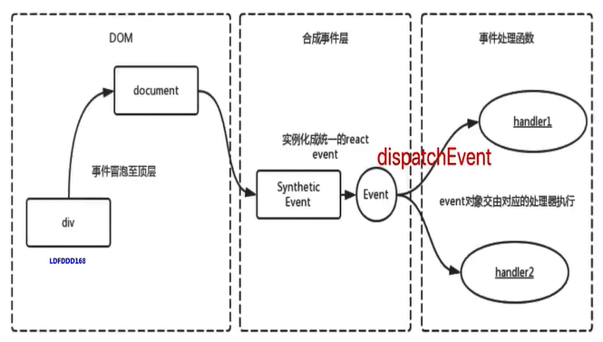
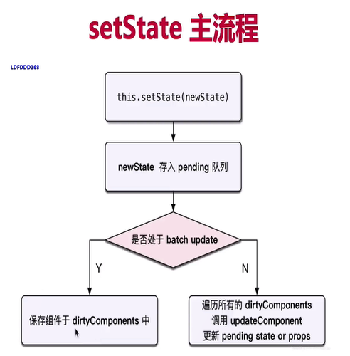
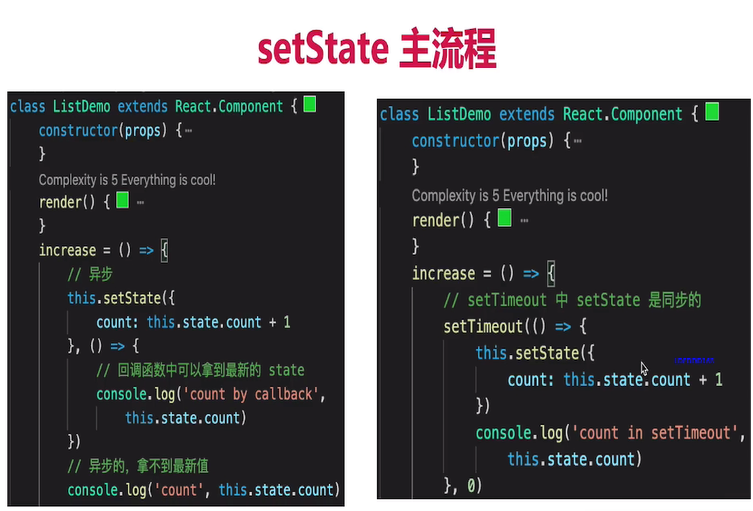
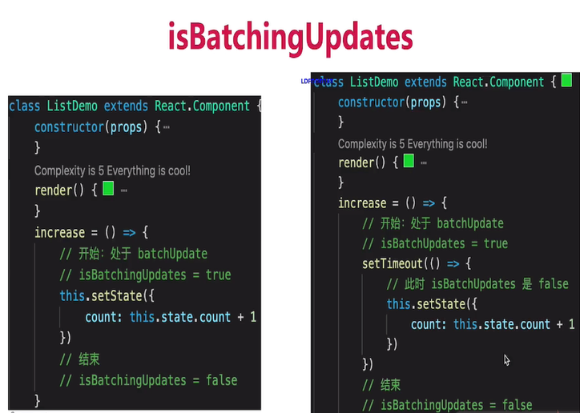
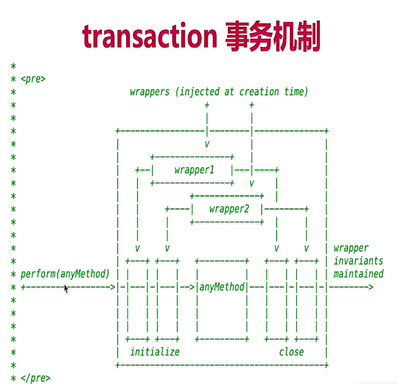
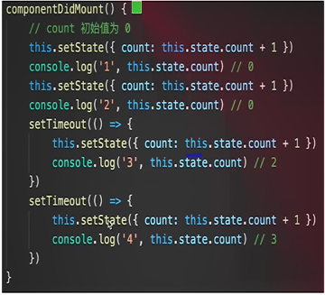

# React 基础

## 其他

- JSX
  - 变量、表达式
  - class style
  - 子元素和组件
  - 判断条件
  - 渲染列表
- React 事件为何 bind this

  ```javascript
  import React, { Component } from 'React'
  class Home extends Component {
    constructor(props) {
      super(props)
      this.state = {
        name: 'zhangsan',
        list: [
          { id: 'id-1', title: '标题1' },
          { id: 'id-2', title: '标题2' },
          { id: 'id-3', title: '标题3' },
        ],
      }
      this.clickHandle1 = this.clickHandle1.bind(this)
    }
    render() {
      return (
        <div>
          <p onClick={this.clickHandle1}>点击1</p>
          <p onClick={this.clickHandle2}>点击2</p>
          <a href="www.baidu.com" onClick={this.clickHandle3}>
            点击3
          </a>
          <ul>
            {this.state.list.map((item, index) => {
              return
              ;<li
                key={item.id}
                onClick={this.clickHandler4(item.id, item.title)}
              >
                index {index}; title {item.title}
              </li>
            })}
          </ul>
        </div>
      )
    }
    // this - 使用 bind
    clickHandle1() {
      console.log('this', this) // this 默认为 undefined
      this.setState({
        name: '测试',
      })
    }
    // this - 使用静态方法
    clickHandle2 = () => {
      this.setState({
        name: '测试',
      })
    }
    // event
    clickHandle3 = event => {
      event.preventDefault() // 阻止默认行为
      event.stopPropagation() // 阻止冒泡
      console.log('target', event.target) // 指向当前元素，即当前元素触发
      console.log('current target', event.currentTarget) // 指向当前元素，假象！！！

      // 注意，event 其实是 React 封装的。可以看 __proto__.constructor 是 SyntheticEvent 组合事件
      console.log('event', event) // 不是原生的 Event ，原生的 MouseEvent
      console.log('event.__proto__.constructor', event.__proto__.constructor)

      // 原生 event 如下。其 __proto__.constructor 是 MouseEvent
      console.log('nativeEvent', event.nativeEvent)
      console.log('nativeEvent target', event.nativeEvent.target) // 指向当前元素，即当前元素触发
      console.log('nativeEvent current target', event.nativeEvent.currentTarget) // 指向 document ！！！

      // 1. event 是 SyntheticEvent ，模拟出来 DOM 事件所有能力
      // 2. event.nativeEvent 是原生事件对象
      // 3. 所有的事件，都被挂载到 document 上
      // 4. 和 DOM 事件不一样，和 Vue 事件也不一样
    }

    // 传递参数
    clickHandler4(id, title, event) {
      console.log(id, title)
      console.log('event', event) // 最后追加一个参数，即可接收 event
    }
  }
  ```

- React 表单
  - 受控组件：表单的值受到了 this.setState 的控制
  - input textarea select 用 value
  - checked radio 用 checked
- React 父子组件通讯
  - props 传递数据
  - props 传递函数
  - props 类型检查
- setState

  - 不可变值：不能直接修改 state 的值
    - state 要在构造函数中定义
    - 不要直接修改 state ，使用不可变值（函数式编程，纯函数）
      - 不可变值 - 数组。(注意，不能直接对数组进行 push pop splice 等，这样违反不可变值)
      - 不可变值 - 对象。(注意，不能直接对对象进行属性设置，这样违反不可变值)
  - setState 可能是异步更新（有可能是同步更新）

    - 单独使用是异步的

      ```javascript
      this.setState(
        {
          count: this.state.count + 1,
        },
        () => {
          // 联想 Vue $nextTick - DOM
          console.log('count by callback', this.state.count) // 回调函数中可以拿到最新的 state
        }
      )
      console.log('count', this.state.count) // 异步的，拿不到最新值
      ```

    - setTimeout 中 setState 是同步的

      ```javascript
      setTimeout(() => {
        this.setState({
          count: this.state.count + 1,
        })
        console.log('count in setTimeout', this.state.count)
      }, 0)
      ```

    - 自己定义的 DOM 事件，setState 是同步的。再 componentDidMount 中

      ```javascript
      bodyClickHandler = () => {
        this.setState({
            count: this.state.count + 1
        })
        console.log('count in body event', this.state.count)
      }
      componentDidMount() {
        // 自己定义的 DOM 事件，setState 是同步的
        document.body.addEventListener('click', this.bodyClickHandler)
      }
      componentWillUnmount() {
        // 及时销毁自定义 DOM 事件
        document.body.removeEventListener('click', this.bodyClickHandler)
        // clearTimeout
      }
      ```

  - state 异步更新的话，更新前会被合并

    - 传入对象，会被合并（类似 Object.assign ）。执行结果只一次 +1

      ```javascript
      this.setState({
        count: this.state.count + 1,
      })
      this.setState({
        count: this.state.count + 1,
      })
      this.setState({
        count: this.state.count + 1,
      })
      ```

    - 传入函数，不会被合并。执行结果是 +3

      ```javascript
      this.setState((prevState, props) => {
        return {
          count: prevState.count + 1,
        }
      })
      this.setState((prevState, props) => {
        return {
          count: prevState.count + 1,
        }
      })
      this.setState((prevState, props) => {
        return {
          count: prevState.count + 1,
        }
      })
      ```

- [React 生命周期](https://projects.wojtekmaj.pl/react-lifecycle-methods-diagram/)
- React 高级特性

  - 函数组件
    - 纯函数，输入 props，输出 JSX
    - 没有实例，没有生命周期，没有 state
  - 非受控组件：不会随着 state 的改变而改变
    - ref （React.createRef()）
    - defaultValue defaultChecked
    - 手动操作 DOM 元素
    - 使用场景
      - 必须手动操作 DOM 元素，setState 实现不了
      - 文件上传 `<input type="file" />`
      - 某些富文本编辑器，需要传入 DOM 元素
  - Portals 使用场景
    - overflow: hidden
    - 父组件 z-index 值太小
    - fixed 需要放在 body 第一层级
  - context
  - 异步组件
    - import()
    - React.lazy
    - React.Suspense
  - 性能优化
    - shouldComponentUpdate
      - 默认返回 true，即 React 默认重新渲染所有子组件 （React 默认：父组件有更新，子组件无条件更新）
      - 必须配合 “不可变值” 一起使用
      - 有性能问题时再考虑使用
    - PureComponent 和 React.memo
      - PureComponent - shouldComponentUpdate 中实现了浅比较
      - memo，函数组件中的 PureComponent
      - 浅比较已使用大部分情况（尽量不要做深度比较）
    - 不可变值 immutable.js
      - 彻底拥抱“不可变值”
      - 基于共享数据（不是深拷贝），速度好
      - 需要一定学习成本
  - 高阶组件 HOC：不是一种功能，而是一种模式

    ```javascript
    const HOCFactory = Component => {
      class HOC extends React.Component {
        // 在此定义多个组件的公用逻辑
        render() {
          return <Component {...this.props} /> // 返回拼装的结果
        }
      }
      return HOC
    }
    const EnhancedComponent1 = HOCFactory(WrappedComponent1)
    const EnhancedComponent2 = HOCFactory(WrappedComponent2)
    ```

    redux connect 是个高阶组件

    ```javascript
    import { connect } from 'react-redux'
    // connect 是高阶组件
    const VisibleTodoList = connect(
      mapStateToProps,
      mapDispatchToProps
    )(TodoList)
    ```

  - Render Props

    ```javascript
    // Render Props 的核心思想
    // 通过一个函数将 class 组件的 state 作为 props 传递给纯函数组件
    class Factory extends React.Component {
      constructor() {
        this.state = {
          /* state 即多个组件的公共逻辑的数据 */
        }
      }
      /* 修改 state */
      render() {
        return <div>{this.props.render(this.state)}</div>
      }
    }

    const App = () => (
      <Factory
        render={
          /* render 是一个函数组件 */
          props => (
            <p>
              {props.a} {props.b} ...
            </p>
          )
        }
      />
    )
    ```

  - HOC vs Render Props
    - HOC: 模式简单，但会增加组件层级
    - Render Props：代码简洁，学习成本较高
    - 按需使用

- Redux 使用
  - 基本概念
  - 单项数据流
  - react-redux
  - 异步 action
  - 中间件
- React 原理

  - 函数式编程
    - 一种编程范式，概念比较多
    - 纯函数
    - 不可变值
  - vdom 和 diff
    - React.createElement 即 h 函数，返回 vnode
    - 第一个参数，可能是组件，也可能是 html tag
    - 组件名，首字母必须大写（React 规定）
  - jsx 本质（jsx 可以在[babel](https://www.babeljs.cn)官网查看）
    - jsx 等同于 vue 模板
    - vue 模板不是 html
    - jsx 不是 js
  - 合成事件
    
    - 所有事件挂载到 document 上
    - event 不是原生的，是 SyntheticEvent 合成事件对象
    - 和 Vue 事件不同，和 DOM 事件也不同
    - 为何要合成事件机制
      - 更好的兼容性和跨平台
      - 挂载到 document，减少内存消耗，避免频繁解绑
      - 方便事件的统一管理（如事务机制）
  - setState 和 batchUpdate

    - 有时异步（普通使用），有时同步（setTimeout、DOM 事件）
    - 有时合并（对象形式），有时不合并（函数形式）
    - 后者比较好理解（像 Object.assign）

    - setState 主流程
      

      

      

    - batchUpdate 机制
      - 能命中 batchUpdate 机制的情况
        - 生命周期（和它调用的函数）
        - React 中注册的事件（和它调用的函数）
        - React 可以“管理”的入口
      - 不能命中 batchUpdate 机制的情况
        - setTimeout setInterval 等（和它调用的函数）
        - 自定义的 DOM 事件（和它调用的函数）
        - React “管不到” 的入口
    - transaction 事务机制
      

      ```javascript
      class ListDemo extends React.Component {
        constructor(props) {}
        render() {}
        increase = () => {
          // 开始：处于 batchUpdate
          // isBatchUpdates = true
          // 其他任何操作
          // 结束
          // isBatchingUpdates = false
        }
      }
      ```

  - 组件渲染过程
    - props state
    - render() 生成 vnode
    - patch(elem, vnode)
  - 组件更新过程
    - setState(newState) --> dirtyComponents(可能有子组件)
    - render() 生成 newVnode
    - patch(vnode, newVnode)
      - reconciliation 阶段 - 执行 diff 算法，纯 js 计算
      - commit 阶段 - 将 diff 结构渲染 DOM
  - patch 不拆分阶段，可能会有的性能问题
    - js 是单线程，且和 DOM 渲染共用一个线程
    - 当组件足够复杂，组件更新时计算和渲染都压力大
    - 同时再有 DOM 操作需求（动画，鼠标拖拽等），将卡顿
  - 解决方案 fiber
    - 将 reconciliation 阶段进行任务拆分（commit 无法拆分）
    - DOM 需要渲染时暂停，空闲时恢复
    - window.requestIdleCallback

- React 组件如何通讯
  - 父子组件 props
  - 自定义事件
  - redux 和 context
- JSX 本质是什么（可对比 Vue 的模板编译）
  - createElement
  - 执行返回 vnode
- context 是什么，有何用途
  - 父组件，向其下所有子组件传递信息
  - 如一些简单的公用信息：主题色、语言等
  - 复杂的公用信息，请用 redux
- shouldComponentUpdate 的用途
  - 性能优化
  - 配合“不可变值”一起使用，否则会出错
- 描述 redux 单项数据流
- setState 是同步还是异步
  
