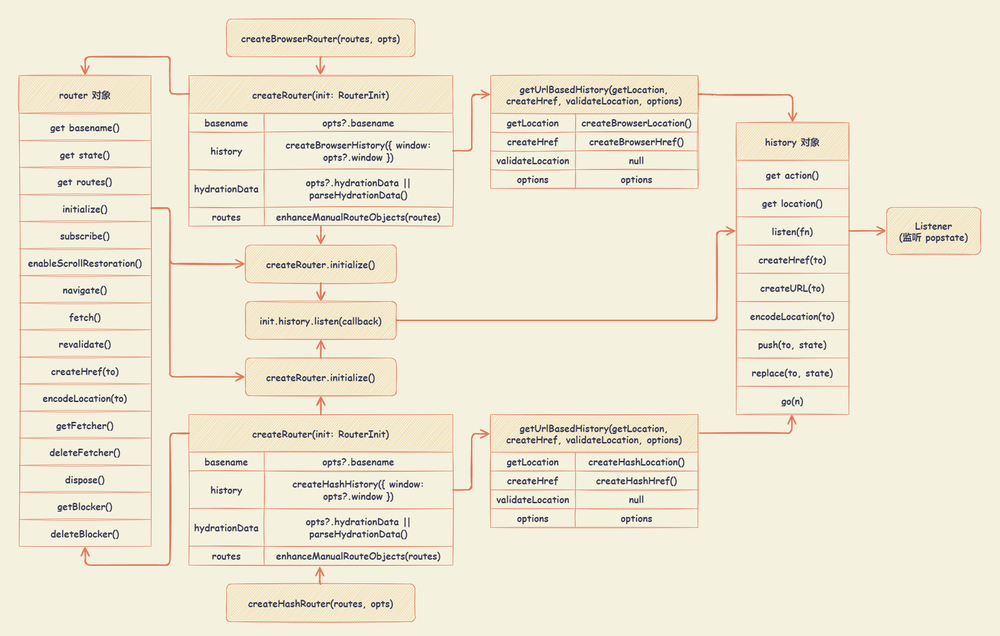

# React-Router v6.x

## 基础使用

```js
// router/index.js

import React from 'react'
import { createBrowserRouter, Navigate, useNavigate } from 'react-router-dom'

const List = React.lazy(() => import('../views/List'))
const Detail = React.lazy(() => import('../views/Detail'))

function Redirect({ to }) {
  let navigate = useNavigate()
  useEffect(() => {
    navigate(to)
  })
  return null
}

const localRoutes = [
  {
    path: '/',
    element: <Navigate to="/list" replace />, // 重定向
    // element: <Redirect to="/home" />,
  },
  {
    path: '/list',
    element: <List />,
    children: [
      {
        path: 'detail/:id',
        element: <Detail />,
      },
    ],
  },
  // 匹配不到路由进行重定向
  {
    path: '*',
    element: <Navigate to="/list" replace />,
  },
]

const router = createBrowserRouter(localRoutes)

export default router
```

```js
// App.js

import React, { Suspense } from 'react'
import { RouterProvider } from 'react-router-dom'

import router from './router'

export default function App() {
  return (
    <Suspense fallback={null}>
      <RouterProvider router={router} />
    </Suspense>
  )
}
```

```js
// List.js

import React, { useState } from 'react'
import { Outlet, useNavigate } from 'react-router-dom'

const List = props => {
  const navigate = useNavigate()
  const [count, setCount] = useState(0)

  return (
    <div>
      <div>【Router List】</div>
      <div>
        <button onClick={() => navigate('/list')}>to List</button>
        <button onClick={() => navigate('/list/detail/123456?a=1&b=2')}>
          to List-Detail
        </button>
      </div>
      <div>List count: {count}</div>
      <div style={{ padding: '10px', border: '1px solid #000' }}>
        <Outlet context={[count, setCount]} />
      </div>
    </div>
  )
}

export default List
```

```js
// Detail.js

import React, { useState, useEffect, useCallback } from 'react'
import {
  useResolvedPath,
  useHref,
  useParams,
  useOutletContext,
  useLocation,
  useSearchParams,
  useBeforeUnload,
} from 'react-router-dom'

const Detail = () => {
  // 根据当前位置，解析给定 to 值的路径名，即 { pathname, search, hash }
  const resolvedPath = useResolvedPath()
  // 返回一个 URL，该 URL 可以用来链接到指定的位置，即使是在 React 路由器之外
  const herf = useHref()
  // 获取当前 URL 的动态参数
  const params = useParams()
  // 父路由与子路由共享的状态或其他值
  // 可以在父组件通过 <Outlet context={[count, setCount]} /> 创建上下文
  const [count, setCount] = useOutletContext()
  // 获取当前路由的信息，即 { hash, key, pathname, search, state }
  const location = useLocation()
  // useSearchParams 用于读取和修改 URL 中的 query 字符串
  // 返回数组：当前的 location 的 search 参数、更新参数的函数
  // useSearchParams 基于 URLSearchParams 接口，先监听 location.search 变化，当触发 setSearchParams 时，根据入参创建新的 URLSearchParams 对象，再执行改变路由的方法，进而修改 location 对象
  const [searchParams, setSearchParams] = useSearchParams()

  console.log('resolvedPath : ', resolvedPath)
  // resolvedPath : {pathname: "/home/page1", search: "", hash: ""}
  console.log('herf : ', herf)
  // herf : /home/page1
  console.log('params : ', params)
  // params : {id: "123456"}
  console.log('searchParams : ', searchParams)
  console.log('searchParams a : ', searchParams.get('a'))
  // searchParams a : 1
  console.log('searchParams b : ', searchParams.get('b'))
  // searchParams b : 2

  // ========== 调用父组件提供 setCount 修改共享状态 ==========
  const increment = () => setCount(c => c + 1)

  // ========== 路由监听 ==========
  useEffect(() => {
    console.log('【Enter】 location : ', location)
    return () => {
      console.log('【Leave】 location : ', location)
    }
  }, [location])

  // ========== 修改 searchParams ==========
  const changeSearchParams = () => {
    setSearchParams({
      a: 'a',
      b: 'b',
    })
  }

  // ========== 离开页面之前，保存重要的应用状态 ==========
  const [inputVal, setInputVal] = useState('')

  // useBeforeUnload 是 window.onbeforeunload 的辅助工具
  // 可用于离开页面之前，在页面上保存重要的应用状态（类似于浏览器的本地存储）
  // window.onbeforeunload : 当浏览器窗口关闭或者刷新时，会触发 beforeunload 事件
  useBeforeUnload(
    useCallback(() => {
      console.log('useBeforeUnload inputVal', inputVal)
      localStorage.setItem('inputVal', inputVal)
    }, [inputVal])
  )

  useEffect(() => {
    const localInputVal = localStorage.getItem('inputVal')
    if (inputVal === '' && localInputVal != null) {
      setInputVal(localInputVal)
    }
  }, [inputVal])

  // ========== 监听 input change ==========
  const onChangeInput = event => {
    setInputVal(event.target.value)
  }

  return (
    <div>
      <div>【List - Detail】</div>
      <div>params id : {params.id}</div>
      <div>searchParams a : {searchParams.get('a')}</div>
      <div>searchParams b : {searchParams.get('b')}</div>
      <div>
        <label>input 输入 : </label>
        <input value={inputVal} onChange={onChangeInput} />
      </div>
      <button onClick={increment}>count++ : {count}</button>
      <br />
      <button onClick={changeSearchParams}>修改 searchParams</button>
    </div>
  )
}

export default Detail
```

## 实现原理


