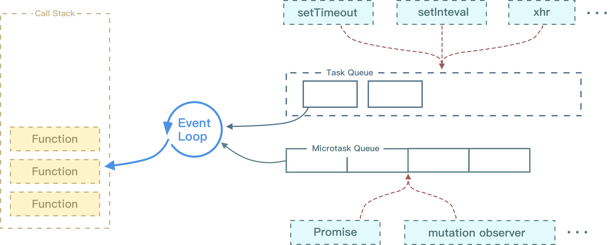
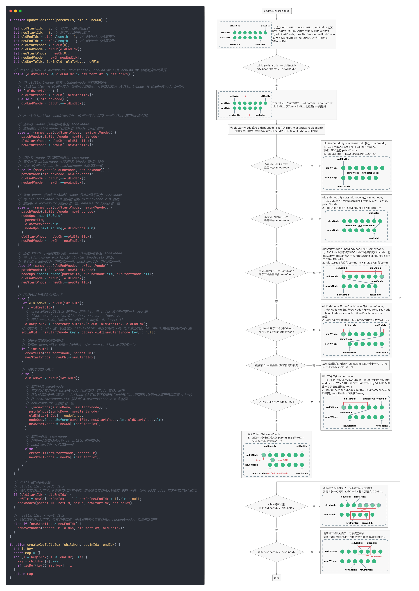
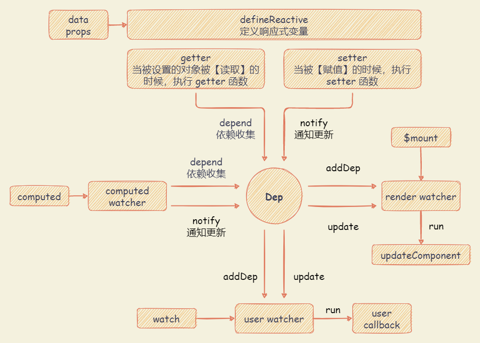

# Vue 响应式

## 响应式对象

### Object.defineProperty

`Object.defineProperty(obj, prop, descriptor)` 方法会直接在一个对象上定义一个新属性，或者修改一个对象的现有属性，并返回此对象。

- **参数**
  - `obj` : 要定义属性的对象。
  - `prop` : 需要操作的目标对象的属性名。
  - `descriptor` : 要定义或修改的属性描述符。
    - `enumerable` : 属性是否可枚举，默认 false 。
    - `configurable` : 属性是否可以被修改或者删除，默认 false 。
    - `writable` : 当且仅当该属性为 true 时，属性的值，才能被赋值运算符改变。属性值假如是数组时，将不受 push, splice 等方法的影响。默认为 false。
    - `value` : 该属性对应的值。
    - `get` : 属性的 getter 函数，如果没有 getter，则为 undefined。当访问该属性时，会调用此函数，默认为 undefined。
    - `set` : 属性的 setter 函数，如果没有 setter，则为 undefined。当属性值被修改时，会调用此函数，默认为 undefined。
- **返回值** ：被传递给函数的对象。
- **API 存在的缺陷**
  - 深度监听，需要递归到底，一次性计算量大
  - 对于对象，无法检测到属性的添加或移除。
  - 对于数组，无法检测到利用索引直接设置一个数组项和修改数组的长度。

### initState : 初始化属性并定义响应式对象

在 Vue 实例化的过程中，会调用 `this._init` （即： `Vue.prototype._init`）方法进行初始化。其中，会执行 `initState(vm)` 方法，初始化 `props`、`methods`、`data`、 `computed`、`watch` 等属性。

::: details 【Vue 实例化】过程：调用 initState 方法进行相关属性初始化

```typescript
// src\core\instance\state.ts
export function initState(vm: Component) {
  const opts = vm.$options
  if (opts.props) initProps(vm, opts.props)

  // Composition API
  initSetup(vm)

  if (opts.methods) initMethods(vm, opts.methods)
  if (opts.data) {
    initData(vm)
  } else {
    const ob = observe((vm._data = {}))
    ob && ob.vmCount++
  }
  if (opts.computed) initComputed(vm, opts.computed)
  if (opts.watch && opts.watch !== nativeWatch) {
    initWatch(vm, opts.watch)
  }
}
```

:::

- `initProps` : 初始化 `props` 配置。在遍历定义的 `props` 配置过程中：

  - 调用 `defineReactive` 方法，把每个 `prop` 对应的值变成响应式，可以通过 `vm._props.xxx` 访问到定义 `props` 中对应的属性。
  - 通过 `proxy` 方法，把 `vm._props.xxx` 的访问代理到 `vm.xxx` 上。

  ::: details initProps 方法：初始化 props 配置

  ```typescript
  // src\core\instance\state.ts
  function initProps(vm: Component, propsOptions: Object) {
    const propsData = vm.$options.propsData || {}
    const props = (vm._props = shallowReactive({}))
    // cache prop keys so that future props updates can iterate using Array
    // instead of dynamic object key enumeration.
    const keys: string[] = (vm.$options._propKeys = [])
    const isRoot = !vm.$parent
    // root instance props should be converted
    if (!isRoot) {
      toggleObserving(false)
    }
    for (const key in propsOptions) {
      keys.push(key)
      const value = validateProp(key, propsOptions, propsData, vm)
      /* istanbul ignore else */
      if (__DEV__) {
        const hyphenatedKey = hyphenate(key)
        if (
          isReservedAttribute(hyphenatedKey) ||
          config.isReservedAttr(hyphenatedKey)
        ) {
          warn(
            `"${hyphenatedKey}" is a reserved attribute and cannot be used as component prop.`,
            vm
          )
        }
        defineReactive(props, key, value, () => {
          if (!isRoot && !isUpdatingChildComponent) {
            warn(
              `Avoid mutating a prop directly since the value will be ` +
                `overwritten whenever the parent component re-renders. ` +
                `Instead, use a data or computed property based on the prop's ` +
                `value. Prop being mutated: "${key}"`,
              vm
            )
          }
        })
      } else {
        defineReactive(props, key, value)
      }
      // static props are already proxied on the component's prototype
      // during Vue.extend(). We only need to proxy props defined at
      // instantiation here.
      if (!(key in vm)) {
        proxy(vm, `_props`, key)
      }
    }
    toggleObserving(true)
  }
  ```

  :::

- `initData` : 初始化 `data` 配置。

  - 对定义 `data` 函数返回对象的遍历，通过 `proxy` 把每一个值 `vm._data.xxx` 都代理到 `vm.xxx` 上。
  - 调用 `observe` 方法观测整个 `data` 的变化，把 `data` 变成响应式，可以通过 `vm._data.xxx` 访问到定义 `data` 返回函数中对应的属性。

  ::: details initData 方法：初始化 data 配置

  ```typescript
  // src\core\instance\state.ts
  function initData(vm: Component) {
    let data: any = vm.$options.data
    data = vm._data = isFunction(data) ? getData(data, vm) : data || {}
    if (!isPlainObject(data)) {
      data = {}
      __DEV__ &&
        warn(
          'data functions should return an object:\n' +
            'https://v2.vuejs.org/v2/guide/components.html#data-Must-Be-a-Function',
          vm
        )
    }
    // proxy data on instance
    const keys = Object.keys(data)
    const props = vm.$options.props
    const methods = vm.$options.methods
    let i = keys.length
    while (i--) {
      const key = keys[i]
      if (__DEV__) {
        if (methods && hasOwn(methods, key)) {
          warn(
            `Method "${key}" has already been defined as a data property.`,
            vm
          )
        }
      }
      if (props && hasOwn(props, key)) {
        __DEV__ &&
          warn(
            `The data property "${key}" is already declared as a prop. ` +
              `Use prop default value instead.`,
            vm
          )
      } else if (!isReserved(key)) {
        proxy(vm, `_data`, key)
      }
    }
    // observe data
    const ob = observe(data)
    ob && ob.vmCount++
  }
  ```

  :::

### proxy : 属性代理

`proxy` 代理的作用是把 `props` 和 `data` 上的属性代理到 `vm` 实例上。通过 `Object.defineProperty` 把 `target[sourceKey][key]` 的读写变成了对 `target[key]` 的读写。

- 对于 `props` 而言，对 `vm._props.xxx` 的读写变成了 `vm.xxx` 的读写，则可以通过 `vm.xxx` 访问到定义在 `props` 中的 `xxx` 属性。
- 对于 `data` 而言，对 `vm._data.xxx` 的读写变成了对 `vm.xxx` 的读写，则可以通过 `vm.xxx` 访问到定义在 `data` 函数返回对象中的 `xxx` 属性。

::: details proxy : 属性代理

```typescript
// src\core\instance\state.ts
const sharedPropertyDefinition = {
  enumerable: true,
  configurable: true,
  get: noop,
  set: noop,
}

export function proxy(target: Object, sourceKey: string, key: string) {
  sharedPropertyDefinition.get = function proxyGetter() {
    return this[sourceKey][key]
  }
  sharedPropertyDefinition.set = function proxySetter(val) {
    this[sourceKey][key] = val
  }
  Object.defineProperty(target, key, sharedPropertyDefinition)
}
```

:::

### observe : 实例化 Observer 进行依赖收集和派发更新

`observe` 方法是用来监测数据的变化，主要是给非 VNode 的对象类型数据添加一个 `Observer`，如果已添加则直接返回。否则，在满足一定条件下，会实例化一个 `Observer` 对象实例。

::: details observe 方法 : 监测属性变化

```typescript
// src\core\observer\index.ts
/**
 * Attempt to create an observer instance for a value,
 * returns the new observer if successfully observed,
 * or the existing observer if the value already has one.
 */
export function observe(
  value: any,
  shallow?: boolean,
  ssrMockReactivity?: boolean
): Observer | void {
  if (!isObject(value) || isRef(value) || value instanceof VNode) {
    return
  }
  let ob: Observer | void
  if (hasOwn(value, '__ob__') && value.__ob__ instanceof Observer) {
    ob = value.__ob__
  } else if (
    shouldObserve &&
    (ssrMockReactivity || !isServerRendering()) &&
    (isArray(value) || isPlainObject(value)) &&
    Object.isExtensible(value) &&
    !value.__v_skip /* ReactiveFlags.SKIP */
  ) {
    ob = new Observer(value, shallow, ssrMockReactivity)
  }
  return ob
}
```

:::

`Observer` 是一个类，主要是给对象的属性添加 `getter` 和 `setter`，用于依赖收集和派发更新。在 `Observer` 中：

- 首先实例化 `Dep` 对象（`Dep` 类主要是进行依赖收集）
- 然后，通过执行 `def(value, '__ob__', this)` 把自身实例添加到数据对象 `value` 的 `__ob__` 属性上。

  `def` 函数是对 `Object.defineProperty` 的封装。

  ```typescript
  // src\core\util\lang.ts
  /**
   * Define a property.
   */
  export function def(
    obj: Object,
    key: string,
    val: any,
    enumerable?: boolean
  ) {
    Object.defineProperty(obj, key, {
      value: val,
      enumerable: !!enumerable,
      writable: true,
      configurable: true,
    })
  }
  ```

- 接下来，对 `value` 进行判断：
  - 对于数组，会调用 `observeArray` 方法，遍历数组，再次调用 `observe` 方法
  - 对于纯对象，会遍历对象的 `key` 调用 `defineReactive` 方法，定义响应式对象，给对象动态添加 `getter` 和 `setter` 。

::: details Observer 类

```typescript
// src\core\observer\index.ts
/**
 * Observer class that is attached to each observed
 * object. Once attached, the observer converts the target
 * object's property keys into getter/setters that
 * collect dependencies and dispatch updates.
 */
export class Observer {
  dep: Dep
  vmCount: number // number of vms that have this object as root $data

  constructor(public value: any, public shallow = false, public mock = false) {
    // this.value = value
    this.dep = mock ? mockDep : new Dep()
    this.vmCount = 0
    def(value, '__ob__', this)
    if (isArray(value)) {
      if (!mock) {
        if (hasProto) {
          /* eslint-disable no-proto */
          ;(value as any).__proto__ = arrayMethods
          /* eslint-enable no-proto */
        } else {
          for (let i = 0, l = arrayKeys.length; i < l; i++) {
            const key = arrayKeys[i]
            def(value, key, arrayMethods[key])
          }
        }
      }
      if (!shallow) {
        this.observeArray(value)
      }
    } else {
      /**
       * Walk through all properties and convert them into
       * getter/setters. This method should only be called when
       * value type is Object.
       */
      const keys = Object.keys(value)
      for (let i = 0; i < keys.length; i++) {
        const key = keys[i]
        defineReactive(value, key, NO_INIITIAL_VALUE, undefined, shallow, mock)
      }
    }
  }

  /**
   * Observe a list of Array items.
   */
  observeArray(value: any[]) {
    for (let i = 0, l = value.length; i < l; i++) {
      observe(value[i], false, this.mock)
    }
  }
}
```

:::

### defineReactive : 定义响应式对象

`defineReactive` 方法是定义一个响应式对象，给对象动态添加 `getter` 和 `setter` 。在 `defineReactive` 方法中：

- 首先，实例化 `Dep` 对象
- 再获取 `obj` 的属性描述符
- 然后，对子对象递归调用 `observe` 方法。这样能保证无论 `obj` 的结构多复杂，其所有子属性都能变成响应式的对象。在访问或修改 `obj` 中一个嵌套比较深的属性是，也能触发 `getter` 和 `setter`。
- 最后，利用 `Object.defineProperty` 去给 `obj` 的属性 `key` 添加 `getter` 和 `setter`。

::: details defineReactive 方法 : 定义响应式对象

```typescript
/**
 * Define a reactive property on an Object.
 */
export function defineReactive(
  obj: object,
  key: string,
  val?: any,
  customSetter?: Function | null,
  shallow?: boolean,
  mock?: boolean
) {
  const dep = new Dep()

  const property = Object.getOwnPropertyDescriptor(obj, key)
  if (property && property.configurable === false) {
    return
  }

  // cater for pre-defined getter/setters
  const getter = property && property.get
  const setter = property && property.set
  if (
    (!getter || setter) &&
    (val === NO_INIITIAL_VALUE || arguments.length === 2)
  ) {
    val = obj[key]
  }

  let childOb = !shallow && observe(val, false, mock)
  Object.defineProperty(obj, key, {
    enumerable: true,
    configurable: true,
    get: function reactiveGetter() {
      const value = getter ? getter.call(obj) : val
      if (Dep.target) {
        if (__DEV__) {
          dep.depend({
            target: obj,
            type: TrackOpTypes.GET,
            key,
          })
        } else {
          dep.depend()
        }
        if (childOb) {
          childOb.dep.depend()
          if (isArray(value)) {
            dependArray(value)
          }
        }
      }
      return isRef(value) && !shallow ? value.value : value
    },
    set: function reactiveSetter(newVal) {
      const value = getter ? getter.call(obj) : val
      if (!hasChanged(value, newVal)) {
        return
      }
      if (__DEV__ && customSetter) {
        customSetter()
      }
      if (setter) {
        setter.call(obj, newVal)
      } else if (getter) {
        // #7981: for accessor properties without setter
        return
      } else if (!shallow && isRef(value) && !isRef(newVal)) {
        value.value = newVal
        return
      } else {
        val = newVal
      }
      childOb = !shallow && observe(newVal, false, mock)
      if (__DEV__) {
        dep.notify({
          type: TriggerOpTypes.SET,
          target: obj,
          key,
          newValue: newVal,
          oldValue: value,
        })
      } else {
        dep.notify()
      }
    },
  })

  return dep
}
```

:::

## 依赖收集

### Dep

`Dep` 是一个 Class，定义了一些属性和方法。

`Dep` 有一个静态属性 `target`，是一个全局唯一的 `Watcher`，因为在同一时间只能有一个全局的 `Watcher` 被计算，其自身属性 `subs` 是一个 `Watcher` 数组。

`Dep` 实际上是对 `Watcher` 的一种管理，`Dep` 脱离 `Watcher` 单独存在。

::: details Dep 类

```typescript
// src\core\observer\dep.ts

import { remove } from '../util/index'

let uid = 0

/**
 * A dep is an observable that can have multiple
 * directives subscribing to it.
 * @internal
 */
export default class Dep {
  static target?: DepTarget | null
  id: number
  subs: Array<DepTarget>

  constructor() {
    this.id = uid++
    this.subs = []
  }

  addSub(sub: DepTarget) {
    this.subs.push(sub)
  }

  removeSub(sub: DepTarget) {
    remove(this.subs, sub)
  }

  depend(info?: DebuggerEventExtraInfo) {
    if (Dep.target) {
      Dep.target.addDep(this)
      if (__DEV__ && info && Dep.target.onTrack) {
        Dep.target.onTrack({
          effect: Dep.target,
          ...info,
        })
      }
    }
  }

  notify(info?: DebuggerEventExtraInfo) {
    // stabilize the subscriber list first
    const subs = this.subs.slice()
    if (__DEV__ && !config.async) {
      // subs aren't sorted in scheduler if not running async
      // we need to sort them now to make sure they fire in correct
      // order
      subs.sort((a, b) => a.id - b.id)
    }
    for (let i = 0, l = subs.length; i < l; i++) {
      if (__DEV__ && info) {
        const sub = subs[i]
        sub.onTrigger &&
          sub.onTrigger({
            effect: subs[i],
            ...info,
          })
      }
      subs[i].update()
    }
  }
}

// The current target watcher being evaluated.
// This is globally unique because only one watcher
// can be evaluated at a time.
Dep.target = null
const targetStack: Array<DepTarget | null | undefined> = []

export function pushTarget(target?: DepTarget | null) {
  targetStack.push(target)
  Dep.target = target
}

export function popTarget() {
  targetStack.pop()
  Dep.target = targetStack[targetStack.length - 1]
}
```

:::

### Watcher

`Watcher` 是一个 Class，在构造函数中，定义了一些 `Dep` 相关的属性，相关属性如下：

```typescript
this.deps = []
this.newDeps = []
this.depIds = new Set()
this.newDepIds = new Set()
```

- `this.deps` 和 `this.newDeps` 表示 `Watcher` 实例持有的 `Dep` 实例的数组
- `this.depIds` 和 `this.newDepIds` 分别代表 `this.deps` 和 `this.newDeps` 的 `id` Set （Set 是 ES6 的数据结构，其实现在 `core\util\env.js` 模块中）。

`Watcher` 还定义了一些原型的方法，和依赖收集相关的有 `get``、addDep` 和 `cleanupDeps` 方法。

::: details

```typescript
// src\core\observer\watcher.ts

let uid = 0

/**
 * A watcher parses an expression, collects dependencies,
 * and fires callback when the expression value changes.
 * This is used for both the $watch() api and directives.
 * @internal
 */
export default class Watcher implements DepTarget {
  vm?: Component | null
  expression: string
  cb: Function
  id: number
  deep: boolean
  user: boolean
  lazy: boolean
  sync: boolean
  dirty: boolean
  active: boolean
  deps: Array<Dep>
  newDeps: Array<Dep>
  depIds: SimpleSet
  newDepIds: SimpleSet
  before?: Function
  onStop?: Function
  noRecurse?: boolean
  getter: Function
  value: any
  post: boolean

  // dev only
  onTrack?: ((event: DebuggerEvent) => void) | undefined
  onTrigger?: ((event: DebuggerEvent) => void) | undefined

  constructor(
    vm: Component | null,
    expOrFn: string | (() => any),
    cb: Function,
    options?: WatcherOptions | null,
    isRenderWatcher?: boolean
  ) {
    recordEffectScope(
      this,
      // if the active effect scope is manually created (not a component scope),
      // prioritize it
      activeEffectScope && !activeEffectScope._vm
        ? activeEffectScope
        : vm
        ? vm._scope
        : undefined
    )
    if ((this.vm = vm) && isRenderWatcher) {
      vm._watcher = this
    }
    // options
    if (options) {
      this.deep = !!options.deep
      this.user = !!options.user
      this.lazy = !!options.lazy
      this.sync = !!options.sync
      this.before = options.before
      if (__DEV__) {
        this.onTrack = options.onTrack
        this.onTrigger = options.onTrigger
      }
    } else {
      this.deep = this.user = this.lazy = this.sync = false
    }
    this.cb = cb
    this.id = ++uid // uid for batching
    this.active = true
    this.post = false
    this.dirty = this.lazy // for lazy watchers
    this.deps = []
    this.newDeps = []
    this.depIds = new Set()
    this.newDepIds = new Set()
    this.expression = __DEV__ ? expOrFn.toString() : ''
    // parse expression for getter
    if (isFunction(expOrFn)) {
      this.getter = expOrFn
    } else {
      this.getter = parsePath(expOrFn)
      if (!this.getter) {
        this.getter = noop
        __DEV__ &&
          warn(
            `Failed watching path: "${expOrFn}" ` +
              'Watcher only accepts simple dot-delimited paths. ' +
              'For full control, use a function instead.',
            vm
          )
      }
    }
    this.value = this.lazy ? undefined : this.get()
  }

  /**
   * Evaluate the getter, and re-collect dependencies.
   */
  get() {
    pushTarget(this)
    let value
    const vm = this.vm
    try {
      value = this.getter.call(vm, vm)
    } catch (e: any) {
      if (this.user) {
        handleError(e, vm, `getter for watcher "${this.expression}"`)
      } else {
        throw e
      }
    } finally {
      // "touch" every property so they are all tracked as
      // dependencies for deep watching
      if (this.deep) {
        traverse(value)
      }
      popTarget()
      this.cleanupDeps()
    }
    return value
  }

  /**
   * Add a dependency to this directive.
   */
  addDep(dep: Dep) {
    const id = dep.id
    if (!this.newDepIds.has(id)) {
      this.newDepIds.add(id)
      this.newDeps.push(dep)
      if (!this.depIds.has(id)) {
        dep.addSub(this)
      }
    }
  }

  /**
   * Clean up for dependency collection.
   */
  cleanupDeps() {
    let i = this.deps.length
    while (i--) {
      const dep = this.deps[i]
      if (!this.newDepIds.has(dep.id)) {
        dep.removeSub(this)
      }
    }
    let tmp: any = this.depIds
    this.depIds = this.newDepIds
    this.newDepIds = tmp
    this.newDepIds.clear()
    tmp = this.deps
    this.deps = this.newDeps
    this.newDeps = tmp
    this.newDeps.length = 0
  }

  /**
   * Subscriber interface.
   * Will be called when a dependency changes.
   */
  update() {
    /* istanbul ignore else */
    if (this.lazy) {
      this.dirty = true
    } else if (this.sync) {
      this.run()
    } else {
      queueWatcher(this)
    }
  }

  /**
   * Scheduler job interface.
   * Will be called by the scheduler.
   */
  run() {
    if (this.active) {
      const value = this.get()
      if (
        value !== this.value ||
        // Deep watchers and watchers on Object/Arrays should fire even
        // when the value is the same, because the value may
        // have mutated.
        isObject(value) ||
        this.deep
      ) {
        // set new value
        const oldValue = this.value
        this.value = value
        if (this.user) {
          const info = `callback for watcher "${this.expression}"`
          invokeWithErrorHandling(
            this.cb,
            this.vm,
            [value, oldValue],
            this.vm,
            info
          )
        } else {
          this.cb.call(this.vm, value, oldValue)
        }
      }
    }
  }

  /**
   * Evaluate the value of the watcher.
   * This only gets called for lazy watchers.
   */
  evaluate() {
    this.value = this.get()
    this.dirty = false
  }

  /**
   * Depend on all deps collected by this watcher.
   */
  depend() {
    let i = this.deps.length
    while (i--) {
      this.deps[i].depend()
    }
  }

  /**
   * Remove self from all dependencies' subscriber list.
   */
  teardown() {
    if (this.vm && !this.vm._isBeingDestroyed) {
      remove(this.vm._scope.effects, this)
    }
    if (this.active) {
      let i = this.deps.length
      while (i--) {
        this.deps[i].removeSub(this)
      }
      this.active = false
      if (this.onStop) {
        this.onStop()
      }
    }
  }
}
```

:::

### 依赖收集过程分析

在 Vue 调用公共 `$mount` 方法（定义在 `src\platforms\web\runtime\index.ts` 模块）进行挂载的过程中，通过 `mountComponent` 函数，实例化一个渲染 `Watcher`，并在 `Watcher` 回调函数中，调用定义的 `updateComponent` 方法。

::: details mountComponent 函数

```typescript {54-56,75-81}
// src\core\instance\lifecycle.ts
export function mountComponent(
  vm: Component,
  el: Element | null | undefined,
  hydrating?: boolean
): Component {
  vm.$el = el
  if (!vm.$options.render) {
    // @ts-expect-error invalid type
    vm.$options.render = createEmptyVNode
    if (__DEV__) {
      /* istanbul ignore if */
      if (
        (vm.$options.template && vm.$options.template.charAt(0) !== '#') ||
        vm.$options.el ||
        el
      ) {
        warn(
          'You are using the runtime-only build of Vue where the template ' +
            'compiler is not available. Either pre-compile the templates into ' +
            'render functions, or use the compiler-included build.',
          vm
        )
      } else {
        warn(
          'Failed to mount component: template or render function not defined.',
          vm
        )
      }
    }
  }
  callHook(vm, 'beforeMount')

  let updateComponent
  /* istanbul ignore if */
  if (__DEV__ && config.performance && mark) {
    updateComponent = () => {
      const name = vm._name
      const id = vm._uid
      const startTag = `vue-perf-start:${id}`
      const endTag = `vue-perf-end:${id}`

      mark(startTag)
      const vnode = vm._render()
      mark(endTag)
      measure(`vue ${name} render`, startTag, endTag)

      mark(startTag)
      vm._update(vnode, hydrating)
      mark(endTag)
      measure(`vue ${name} patch`, startTag, endTag)
    }
  } else {
    updateComponent = () => {
      vm._update(vm._render(), hydrating)
    }
  }

  const watcherOptions: WatcherOptions = {
    before() {
      if (vm._isMounted && !vm._isDestroyed) {
        callHook(vm, 'beforeUpdate')
      }
    },
  }

  if (__DEV__) {
    watcherOptions.onTrack = e => callHook(vm, 'renderTracked', [e])
    watcherOptions.onTrigger = e => callHook(vm, 'renderTriggered', [e])
  }

  // we set this to vm._watcher inside the watcher's constructor
  // since the watcher's initial patch may call $forceUpdate (e.g. inside child
  // component's mounted hook), which relies on vm._watcher being already defined
  new Watcher(
    vm,
    updateComponent,
    noop,
    watcherOptions,
    true /* isRenderWatcher */
  )
  hydrating = false

  // flush buffer for flush: "pre" watchers queued in setup()
  const preWatchers = vm._preWatchers
  if (preWatchers) {
    for (let i = 0; i < preWatchers.length; i++) {
      preWatchers[i].run()
    }
  }

  // manually mounted instance, call mounted on self
  // mounted is called for render-created child components in its inserted hook
  if (vm.$vnode == null) {
    vm._isMounted = true
    callHook(vm, 'mounted')
  }
  return vm
}
```

:::

在实例化 `Watcher` 中，进入 `watcher` 的构造函数逻辑，执行 `this.get()` 方法，进入 `get` 函数。

::: details Watcher 类中定义的 get 函数

```typescript
// src\core\observer\watcher.ts

/**
 * Evaluate the getter, and re-collect dependencies.
  */
get() {
  pushTarget(this)
  let value
  const vm = this.vm
  try {
    value = this.getter.call(vm, vm)
  } catch (e: any) {
    if (this.user) {
      handleError(e, vm, `getter for watcher "${this.expression}"`)
    } else {
      throw e
    }
  } finally {
    // "touch" every property so they are all tracked as
    // dependencies for deep watching
    if (this.deep) {
      traverse(value)
    }
    popTarget()
    this.cleanupDeps()
  }
  return value
}
```

:::

::: details Dep 类的辅助函数： pushTarget 、 popTarget

```typescript
// src\core\observer\dep.ts

// The current target watcher being evaluated.
// This is globally unique because only one watcher
// can be evaluated at a time.
Dep.target = null
const targetStack: Array<DepTarget | null | undefined> = []

export function pushTarget(target?: DepTarget | null) {
  targetStack.push(target)
  Dep.target = target
}

export function popTarget() {
  targetStack.pop()
  Dep.target = targetStack[targetStack.length - 1]
}
```

:::

- 首先，执行 `pushTarget(this)`。在 `Dep` 类的辅助函数 `pushTarget` 函数中，实际上是把 `Dep.target` 赋值为当前渲染的 `watcher` 并压栈（为了恢复用）。
- 接着，执行 `value = this.getter.call(vm, vm)` ，对应执行的是 `mountComponent` 函数中定义 `updateComponent` 回调函数，即执行 `vm._update(vm._render(), hydrating)` 。

  - 先执行 `vm._render()` 方法，生成渲染 VNode，并在这个过程中会对 `vm` 上的数据访问，触发数据对象的 `getter`。
  - 每个对象值的 `getter` 都持有一个 `dep`，在触发 `getter` 的时候，会调用 `dep.depend()` 方法，执行 `Dep.target.addDep(this)` ，此时的 `Dep.target` 已经被赋值为渲染 `watcher` 。

    在 `Watcher` 类定义的 `addDep` 函数中，会进行逻辑判断（保证同一数据不会被添加多次）后执行 `dep.addSub(this)` （即执行 `Dep` 类的 `addSub` 函数中的 `this.subs.push(sub)` 逻辑）。相当于把当前的 `watcher` 订阅到这个数据持有的 `dep` 的 `subs` 中，目的是为后续数据变化时能通知到 `subs` 进行准备。

    ::: details Watcher 类中定义的 addDep 函数

    ```typescript
    // src\core\observer\watcher.ts

    /**
     * Add a dependency to this directive.
     */
    addDep(dep: Dep) {
      const id = dep.id
      if (!this.newDepIds.has(id)) {
        this.newDepIds.add(id)
        this.newDeps.push(dep)
        if (!this.depIds.has(id)) {
          dep.addSub(this)
        }
      }
    }
    ```

    :::

    ::: details Dep 类中定义的 addSub 函数

    ```typescript
    // src\core\observer\dep.ts

    /**
     * A dep is an observable that can have multiple
     * directives subscribing to it.
     * @internal
     */
    export default class Dep {
      static target?: DepTarget | null
      id: number
      subs: Array<DepTarget>

      constructor() {
        this.id = uid++
        this.subs = []
      }

      addSub(sub: DepTarget) {
        this.subs.push(sub)
      }

      // ... 省略一些其他方法： removeSub、depend、notify
    }
    ```

    :::

  - 在 `vm._render()` 过程中，会触发所有数据的 `getter`，这样实际上已经完成了一个依赖收集的过程。

- 在完成依赖收集后，会执行 `if (this.deep) { traverse(value) }` 。这个会递归去访问 `value` ，触发它所有子项的 `getter` 。
- 接着，执行 `popTarget()` 。在 `Dep` 类的辅助函数 `popTarget` 函数中，会把 `Dep.target` 恢复成上一个状态。因为在当前 `vm` 的数据依赖收集已经完成，那么对应的渲染 `Dep.target` 也需要改变。
- 最后，执行 `this.cleanupDeps()` 进行依赖清空。

  Vue 是数据驱动的，每次数据变化都会重新 `render` ，那么 `vm._render` 方法又会再次执行，并再次触发数据的 `getter`，所以 `Watcher` 在构造函数中会初始化 2 个 `Dep` 实例数组，`newDep` 表示新添加的 `Dep` 实例数组，而 `deps` 表示上一次添加的 `Dep` 实例数组。

  进行依赖清空，首先遍历 `deps`，移除对 `dep.subs` 数组中 `Wathcer` 的订阅，然后把 `newDepIds` 和 `depIds` 交换，`newDeps` 和 `deps` 交换，并把 `newDepIds` 和 `newDeps` 清空。

  ::: details Watcher 类中定义的 cleanupDeps 函数

  ```typescript
  // src\core\observer\watcher.ts

  /**
   * Clean up for dependency collection.
   */
  cleanupDeps() {
    let i = this.deps.length
    while (i--) {
      const dep = this.deps[i]
      if (!this.newDepIds.has(dep.id)) {
        dep.removeSub(this)
      }
    }
    let tmp: any = this.depIds
    this.depIds = this.newDepIds
    this.newDepIds = tmp
    this.newDepIds.clear()
    tmp = this.deps
    this.deps = this.newDeps
    this.newDeps = tmp
    this.newDeps.length = 0
  }
  ```

  :::

  在添加 `deps` 的定义过程，已经通过 `id` 去重避免重复订阅。对依赖进行清除主要是考虑到 `v-if` 根据条件渲染不同模块的场景：

  - 进行模板渲染的时候，会根据 `v-if` 去渲染不同子模块 `a` 和 `b`
  - 当满足某种条件渲染子模块 `a` 的时候，会访问到 `a` 中的数据，此时会对 `a` 使用的数据添加 `getter`，进行依赖收集，修改 `a` 的数据的时候，会通知对应订阅者。
  - 当改变条件渲染子模块 `b` 的时候，则会对 `b` 使用的数据添加 `getter`，如果没有移除依赖的过程，那么这个时候修改子模块 `a` 的数据，会通知 `a` 使用数据的订阅的回调。
  - 因此 Vue 设计了在每次添加完新的订阅，会移除掉旧的订阅，能保证在该场景下，如果渲染子模块 `b` 的时候，去修改子模块 `a` 的数据，`a` 数据订阅回调已经被移除了，所以不会有任何浪费。

## 派发更新

在执行 `defineReactive` 函数，通过 `Object.defineProperty` 定义响应式对象属性的 `setter` 函数，当属性值被修改时，会调用此函数。在定义的时候，主要涉及两个关键点：

- `childOb = !shallow && observe(newVal)` : 如果 `shallow` 为 `false`，会通过 `observe(newVal)` 将新设置的值变为响应式对象。
- `dep.notify()` : 通知所有的订阅者。

::: details defineReactive 方法 : 定义响应式对象

```typescript
// src\core\observer\index.ts

/**
 * Define a reactive property on an Object.
 */
export function defineReactive(
  obj: object,
  key: string,
  val?: any,
  customSetter?: Function | null,
  shallow?: boolean,
  mock?: boolean
) {
  const dep = new Dep()

  const property = Object.getOwnPropertyDescriptor(obj, key)
  if (property && property.configurable === false) {
    return
  }

  // cater for pre-defined getter/setters
  const getter = property && property.get
  const setter = property && property.set
  if (
    (!getter || setter) &&
    (val === NO_INIITIAL_VALUE || arguments.length === 2)
  ) {
    val = obj[key]
  }

  let childOb = !shallow && observe(val, false, mock)
  Object.defineProperty(obj, key, {
    enumerable: true,
    configurable: true,
    get: function reactiveGetter() {
      const value = getter ? getter.call(obj) : val
      if (Dep.target) {
        if (__DEV__) {
          dep.depend({
            target: obj,
            type: TrackOpTypes.GET,
            key,
          })
        } else {
          dep.depend()
        }
        if (childOb) {
          childOb.dep.depend()
          if (isArray(value)) {
            dependArray(value)
          }
        }
      }
      return isRef(value) && !shallow ? value.value : value
    },
    set: function reactiveSetter(newVal) {
      const value = getter ? getter.call(obj) : val
      if (!hasChanged(value, newVal)) {
        return
      }
      if (__DEV__ && customSetter) {
        customSetter()
      }
      if (setter) {
        setter.call(obj, newVal)
      } else if (getter) {
        // #7981: for accessor properties without setter
        return
      } else if (!shallow && isRef(value) && !isRef(newVal)) {
        value.value = newVal
        return
      } else {
        val = newVal
      }
      childOb = !shallow && observe(newVal, false, mock)
      if (__DEV__) {
        dep.notify({
          type: TriggerOpTypes.SET,
          target: obj,
          key,
          newValue: newVal,
          oldValue: value,
        })
      } else {
        dep.notify()
      }
    },
  })

  return dep
}
```

:::

在组件中对响应数据进行了修改，就会触发 `setter` 逻辑，最后调用 `dep.notify()` 方法（`Dep` 类的一个实例方法）。

在 `dep.notify()` 方法中，会遍历所有的 `subs` （即 `Watcher` 的实例数组），调用每一个 `watcher` 的 `update` 方法。

::: details Dep 类的实例方法 notify

```typescript
// src\core\observer\dep.ts

export default class Dep {
  // ...

  notify(info?: DebuggerEventExtraInfo) {
    // stabilize the subscriber list first
    const subs = this.subs.slice()
    if (__DEV__ && !config.async) {
      // subs aren't sorted in scheduler if not running async
      // we need to sort them now to make sure they fire in correct
      // order
      subs.sort((a, b) => a.id - b.id)
    }
    for (let i = 0, l = subs.length; i < l; i++) {
      if (__DEV__ && info) {
        const sub = subs[i]
        sub.onTrigger &&
          sub.onTrigger({
            effect: subs[i],
            ...info,
          })
      }
      subs[i].update()
    }
  }
}
```

:::

在 `Watcher` 类的实例方法 `update` 中， 对于 `Watcher` 的不同状态，会执行不同的逻辑。在一般组件数据更新的场景，会执行 `queueWatcher(this)` 。

::: details Watcher 类的实例方法 update

```typescript
export default class Watcher implements DepTarget {
  // ... 省略一些其他属性定义与方法

  /**
   * Subscriber interface.
   * Will be called when a dependency changes.
   */
  update() {
    /* istanbul ignore else */
    if (this.lazy) {
      this.dirty = true
    } else if (this.sync) {
      this.run()
    } else {
      queueWatcher(this)
    }
  }

  /**
   * Scheduler job interface.
   * Will be called by the scheduler.
   */
  run() {
    if (this.active) {
      const value = this.get()
      if (
        value !== this.value ||
        // Deep watchers and watchers on Object/Arrays should fire even
        // when the value is the same, because the value may
        // have mutated.
        isObject(value) ||
        this.deep
      ) {
        // set new value
        const oldValue = this.value
        this.value = value
        if (this.user) {
          const info = `callback for watcher "${this.expression}"`
          invokeWithErrorHandling(
            this.cb,
            this.vm,
            [value, oldValue],
            this.vm,
            info
          )
        } else {
          this.cb.call(this.vm, value, oldValue)
        }
      }
    }
  }
}
```

:::

在 `queueWatcher(watcher)` 方法中，会引入队列，是 Vue 在进行派发更新时的一个优化点，它并不会每次数据改变都会触发 `watcher` 的回调，而是把这些 `watcher` 先添加到一个队列里，然后在 `nextTick` 后执行 `flushSchedulerQueue` 。

- 首先，使用 `has` 对象保证同一个 `Watcher` 只添加一次
- 接着，对 `flushing` 进行判断
- 最后，通过 `waiting` 保证对 `nextTick(flushSchedulerQueue)` （在下一个 tick ，即异步的执行 `flushSchedulerQueue`） 的调用逻辑只有一次。

::: details queueWatcher 方法

```typescript
// src\core\observer\scheduler.ts

const queue: Array<Watcher> = []
let has: { [key: number]: true | undefined | null } = {}
let waiting = false
let flushing = false

/**
 * Push a watcher into the watcher queue.
 * Jobs with duplicate IDs will be skipped unless it's
 * pushed when the queue is being flushed.
 */
export function queueWatcher(watcher: Watcher) {
  const id = watcher.id
  if (has[id] != null) {
    return
  }

  if (watcher === Dep.target && watcher.noRecurse) {
    return
  }

  has[id] = true
  if (!flushing) {
    queue.push(watcher)
  } else {
    // if already flushing, splice the watcher based on its id
    // if already past its id, it will be run next immediately.
    let i = queue.length - 1
    while (i > index && queue[i].id > watcher.id) {
      i--
    }
    queue.splice(i + 1, 0, watcher)
  }
  // queue the flush
  if (!waiting) {
    waiting = true

    if (__DEV__ && !config.async) {
      flushSchedulerQueue()
      return
    }
    nextTick(flushSchedulerQueue)
  }
}
```

:::

在 `flushSchedulerQueue` 方法中，主要会进行以下逻辑处理：

- 队列排序。`queue.sort(sortCompareFn)` 对队列进行从小到达的排序，主要为了确保以下几点：
  - 组件的更新由父到子。因为父组件的创建过程优先于子组件，所以 `watcher` 的创建也是先父后子，执行顺序应该保持先父后子。
  - 用户自定义 `watcher` 要优先渲染 `watcher` 执行。因为自定义 `watcher` 是在渲染 `watcher` 之前创建的。
  - 如果一个组件在父组件的 `watcher` 执行期间被销毁，那么它对应的 `watcher` 执行都可以被跳过，所以父组件的 `watcher` 应该先执行。
- 队列遍历。对 `queue` 排序后，接着会对其进行遍历，获取对应的 `watcher` ，执行 `watcher.run()` 。

  在遍历的时候，每次都会对 `queue.length` 求值，因为在执行 `watcher.run()` 的时候，很可能会添加新的 `watcher`，这样会再次执行到 `queueWatcher` 。

  在添加新的 `watcher` 场景中，`queueWatcher` 方法中 `flushing` 为 `true`，会从后往前查找，找到第一个待插入 `watcher` 的 `id` 比当前队列中 `watcher` 的 `id` 大的位置。把 `watcher` 按照 `id` 插入到队列中，`queue` 的长度也会发生变化。

  `watcher.run()` 为 `Watcher` 类的实例方法。通过 `this.get()` （即 `Watcher` 类的实例方法 `get` ） 获取当前的值，进行判断。如果满足新旧值不等、新值是对象类型、 `deep` 模式中的任何一个，则执行 `watcher` 的回调。

  - 对于自定义 `watcher` 而言。执行回调函数的时候，会把第一个和第二个参数传入新值 `value` 和旧值 `oldValue`，这就是在自定义 `watcher` 的时候，能在回调函数的参数中拿到新旧值的原因。
  - 对于渲染 `watcher` 而言。执行回调函数的时候，对应执行的是 `mountComponent` 函数中定义 `updateComponent` 回调函数，即执行 `vm._update(vm._render(), hydrating)`。这就是当修改组件相关的响应式数据的时候，会触发组件重新渲染的原因，接着就会重新执行 `patch` 的过程，但它和首次渲染有所不同。

- 状态恢复。执行 `resetSchedulerState` 方法，其中主要是把控制流程状态的一些变量恢复到初始值，并把 `watcher` 队列清空。

::: details flushSchedulerQueue 方法

```typescript
// src\core\observer\scheduler.ts

const queue: Array<Watcher> = []
const activatedChildren: Array<Component> = []
let has: { [key: number]: true | undefined | null } = {}
let circular: { [key: number]: number } = {}
let waiting = false
let flushing = false
let index = 0

/**
 * Reset the scheduler's state.
 */
function resetSchedulerState() {
  index = queue.length = activatedChildren.length = 0
  has = {}
  if (__DEV__) {
    circular = {}
  }
  waiting = flushing = false
}

const sortCompareFn = (a: Watcher, b: Watcher): number => {
  if (a.post) {
    if (!b.post) return 1
  } else if (b.post) {
    return -1
  }
  return a.id - b.id
}

/**
 * Flush both queues and run the watchers.
 */
function flushSchedulerQueue() {
  currentFlushTimestamp = getNow()
  flushing = true
  let watcher, id

  // Sort queue before flush.
  // This ensures that:
  // 1. Components are updated from parent to child. (because parent is always
  //    created before the child)
  // 2. A component's user watchers are run before its render watcher (because
  //    user watchers are created before the render watcher)
  // 3. If a component is destroyed during a parent component's watcher run,
  //    its watchers can be skipped.
  queue.sort(sortCompareFn)

  // do not cache length because more watchers might be pushed
  // as we run existing watchers
  for (index = 0; index < queue.length; index++) {
    watcher = queue[index]
    if (watcher.before) {
      watcher.before()
    }
    id = watcher.id
    has[id] = null
    watcher.run()
    // in dev build, check and stop circular updates.
    if (__DEV__ && has[id] != null) {
      circular[id] = (circular[id] || 0) + 1
      if (circular[id] > MAX_UPDATE_COUNT) {
        warn(
          'You may have an infinite update loop ' +
            (watcher.user
              ? `in watcher with expression "${watcher.expression}"`
              : `in a component render function.`),
          watcher.vm
        )
        break
      }
    }
  }

  // keep copies of post queues before resetting state
  const activatedQueue = activatedChildren.slice()
  const updatedQueue = queue.slice()

  resetSchedulerState()

  // call component updated and activated hooks
  callActivatedHooks(activatedQueue)
  callUpdatedHooks(updatedQueue)

  // devtool hook
  /* istanbul ignore if */
  if (devtools && config.devtools) {
    devtools.emit('flush')
  }
}
```

:::

## nextTick

### JavaScript 在浏览器中的运行机制

**JavaScript 的执行是单线程的，非阻塞的：**

- 单线程 : JavaScript 在浏览器中主要用于与用户互动、操作 DOM 。如果是多线程需要处理很多复杂的问题，比如两个现场同时操作 DOM ，一个线程删除当前 DOM 节点，一个线程操作当前 DOM 节点，不知道以哪个线程为准。为了避免这种情况，所以 JavaScript 是单线程的。虽然， H5 提出了 web worker 标准，但是有很多限制，受主线程控制，是主线程的子线程。
- 非阻塞 : 通过事件循环（Event Loop）实现。

**事件循环（Event Loop）相关概念：**

- 执行栈 : 同步代码的执行，按照顺序添加到执行栈中。
- 事件队列 : 异步代码的执行，遇到异步事件不会等待执行返回结果，而是将这个事情挂起，继续执行执行栈中的其他任务。当异步事件返回结果时，会把它放到事件队列中，被放入事件队列不会立刻执行起回调，而是等待当前执行栈中所有的任务执行完毕，主线程空闲状态，主线程会去查找事件队列中是否有任务，如果有，则取出事件，并把这个事件对应的回调放在执行栈中，然后执行其中的同步代码。
- 宏任务与微任务 :

  页面渲染事件，各种 I/O 的完成事件等事件随时都会被添加到任务队列中，一直保持先进先出的原则执行。因为不能准确地控制这些事件被添加到队列中的位置，同时，存在有高优先级的任务需要执行，那么使用一种类型的任务就不合适，所以引入了微任务队列。

  - **宏任务（macrotask）** : `script 代码`、 `setTimeout`、 `setInterval`、 `setImmediate`、 `I/O` 以及 `UI rendering`
  - **微任务（microtask）** : `queueMicrotask`、 `promise.then`、 `MutationObserver`、 `process.nextTick` （Node 独有）。

  注：在 ES6 规范中，`microtask` 称为 `jobs`，`macrotask` 称为 `task`。

**事件循环（Event Loop）运行机制：**



在事件循环（Event Loop）中，每进行一次循环成为 `tick` ，关键步骤如下：

- 执行一次宏任务（macrotask）（执行栈中没有就从事件队列中获取）
- 执行过程中，如果遇到微任务（microtask），就会把它添加到微任务（microtask）的任务队列中。
- 宏任务（macrotask）执行完毕后，立即执行当前微任务队列中所有的微任务（microtask）（依次执行）
- 当前宏任务（macrotask）执行完毕后，开始检查渲染，然后 GUI 线程接管渲染
- 渲染完毕后，JavaScript 线程继续接管，开始下一个宏任务（从事件队列中获取）

异步任务的返回值会被放到一个任务队列中，根据异步事件的类型，事件会被放到对应的宏任务和微任务队列中。

当前执行栈为空时，主线程会查看微任务队列是否存在事件

- 存在，依次执行队列中的事件对应的回调，直到微任务队列为空。然后，取出宏任务中最前面的事件，将事件回调添加到当前执行栈。
- 不存在，依次在宏任务队里中，取出一个事件并把对应的回调添加到当前执行栈。

当前执行栈执行完毕后，会立刻处理所有微任务队列中的事件，然后，再从宏任务中取出一个事件。**同一次事件循环中，微任务永远在宏任务之前执行。**

## nextTick 的实现

Vue.js 中分别使用 `Promise` 、 `setTimeout` 、 `MutationObserver` 、 `setImmediate` 等方式在 **microtask（或是 task）** 中创建一个事件，目的是在当前调用栈执行完毕以后（不一定立即）才会去执行这个事件。

- 首先定义一个 `callbacks` 数组，用于存储 `nextTick`，在下一个 **microtask（或是 task）** 处理这些回调函数之前，所有 `cb` 都会被存储在 `callbacks` 数组中。
- 在 **microtask（或是 task）** 中创建一个事件 `flushCallbacks` 。 `flushCallbacks` 则会在执行时，将 `callbacks` 中的所有 `cb` 依次执行。

::: details nextTick 函数

```typescript
// src\core\util\next-tick.ts

/* globals MutationObserver */

import { noop } from 'shared/util'
import { handleError } from './error'
import { isIE, isIOS, isNative } from './env'

export let isUsingMicroTask = false

const callbacks: Array<Function> = []
let pending = false

function flushCallbacks() {
  pending = false
  const copies = callbacks.slice(0)
  callbacks.length = 0
  for (let i = 0; i < copies.length; i++) {
    copies[i]()
  }
}

// Here we have async deferring wrappers using microtasks.
// In 2.5 we used (macro) tasks (in combination with microtasks).
// However, it has subtle problems when state is changed right before repaint
// (e.g. #6813, out-in transitions).
// Also, using (macro) tasks in event handler would cause some weird behaviors
// that cannot be circumvented (e.g. #7109, #7153, #7546, #7834, #8109).
// So we now use microtasks everywhere, again.
// A major drawback of this tradeoff is that there are some scenarios
// where microtasks have too high a priority and fire in between supposedly
// sequential events (e.g. #4521, #6690, which have workarounds)
// or even between bubbling of the same event (#6566).
let timerFunc

// The nextTick behavior leverages the microtask queue, which can be accessed
// via either native Promise.then or MutationObserver.
// MutationObserver has wider support, however it is seriously bugged in
// UIWebView in iOS >= 9.3.3 when triggered in touch event handlers. It
// completely stops working after triggering a few times... so, if native
// Promise is available, we will use it:
/* istanbul ignore next, $flow-disable-line */
if (typeof Promise !== 'undefined' && isNative(Promise)) {
  const p = Promise.resolve()
  timerFunc = () => {
    p.then(flushCallbacks)
    // In problematic UIWebViews, Promise.then doesn't completely break, but
    // it can get stuck in a weird state where callbacks are pushed into the
    // microtask queue but the queue isn't being flushed, until the browser
    // needs to do some other work, e.g. handle a timer. Therefore we can
    // "force" the microtask queue to be flushed by adding an empty timer.
    if (isIOS) setTimeout(noop)
  }
  isUsingMicroTask = true
} else if (
  !isIE &&
  typeof MutationObserver !== 'undefined' &&
  (isNative(MutationObserver) ||
    // PhantomJS and iOS 7.x
    MutationObserver.toString() === '[object MutationObserverConstructor]')
) {
  // Use MutationObserver where native Promise is not available,
  // e.g. PhantomJS, iOS7, Android 4.4
  // (#6466 MutationObserver is unreliable in IE11)
  let counter = 1
  const observer = new MutationObserver(flushCallbacks)
  const textNode = document.createTextNode(String(counter))
  observer.observe(textNode, {
    characterData: true,
  })
  timerFunc = () => {
    counter = (counter + 1) % 2
    textNode.data = String(counter)
  }
  isUsingMicroTask = true
} else if (typeof setImmediate !== 'undefined' && isNative(setImmediate)) {
  // Fallback to setImmediate.
  // Technically it leverages the (macro) task queue,
  // but it is still a better choice than setTimeout.
  timerFunc = () => {
    setImmediate(flushCallbacks)
  }
} else {
  // Fallback to setTimeout.
  timerFunc = () => {
    setTimeout(flushCallbacks, 0)
  }
}

export function nextTick(): Promise<void>
export function nextTick<T>(this: T, cb: (this: T, ...args: any[]) => any): void
export function nextTick<T>(cb: (this: T, ...args: any[]) => any, ctx: T): void
/**
 * @internal
 */
export function nextTick(cb?: (...args: any[]) => any, ctx?: object) {
  let _resolve
  callbacks.push(() => {
    if (cb) {
      try {
        cb.call(ctx)
      } catch (e: any) {
        handleError(e, ctx, 'nextTick')
      }
    } else if (_resolve) {
      _resolve(ctx)
    }
  })
  if (!pending) {
    pending = true
    timerFunc()
  }
  // $flow-disable-line
  if (!cb && typeof Promise !== 'undefined') {
    return new Promise(resolve => {
      _resolve = resolve
    })
  }
}
```

:::

## 检测变化的注意事项

### 对象

对于使用 `Object.defineProperty` 实现响应式的对象，给该对象添加一个新属性的时候，是不能触发该响应式对象的 `setter` 。在该场景下，可以使用 Vue 全局 API `Vue.set` 方法。

`Vue.set(target, key, value)` 方法接收 3 个参数，`target` 表示数组或者普通对象，`key` 表示数组的下标或者对象的键值，`value` 表示添加的值。在该方法中：

- 首先，获取 `target.__ob__` 并赋值给 `ob`。`target.__ob__` 在 `Observer` 的构造函数执行时进行初始化的，表示 `Observer` 的一个实例。
- 接着，判断 `target` 是否为数组且 `key` 是否为一个合法的下标，则通过 `target.splice(key, 1, val)` 添加进数组并返回。
- 然后，判断 `key` 是否存在于 `target` 中，存在，则直接赋值并返回。
- 接着，判断 `ob` 是否存在，如果它不存在，则说明 `target` 不是一个响应式的对象，则直接赋值并返回。
- 最后，通过 `defineReactive(ob.value, key, val)` 把新添加的属性变成响应式对象。
- 然后，再通过 `ob.dep.notify()` 手动触发依赖通知。

  在 `defineReactive` 方法中，通过 `Object.defineProperty` 给属性添加 `getter` 的过程中，判断了 `childOb` ，并调用了 `childOb.dep.depend()` 收集了依赖，这就是执行 Vue.set 时通过 `ob.dep.notify()` 能够通知到 watcher ，从而让添加新的属性到对象也可以检测到变化。如果 `value` 是个数组，那么就通过 `dependArray` 对数组每个元素进行依赖收集。

::: details set 方法

```typescript
// src\core\observer\index.ts

/**
 * Set a property on an object. Adds the new property and
 * triggers change notification if the property doesn't
 * already exist.
 */
export function set<T>(array: T[], key: number, value: T): T
export function set<T>(object: object, key: string | number, value: T): T
export function set(
  target: any[] | Record<string, any>,
  key: any,
  val: any
): any {
  if (__DEV__ && (isUndef(target) || isPrimitive(target))) {
    warn(
      `Cannot set reactive property on undefined, null, or primitive value: ${target}`
    )
  }
  if (isReadonly(target)) {
    __DEV__ && warn(`Set operation on key "${key}" failed: target is readonly.`)
    return
  }
  const ob = (target as any).__ob__
  if (isArray(target) && isValidArrayIndex(key)) {
    target.length = Math.max(target.length, key)
    target.splice(key, 1, val)
    // when mocking for SSR, array methods are not hijacked
    if (ob && !ob.shallow && ob.mock) {
      observe(val, false, true)
    }
    return val
  }
  if (key in target && !(key in Object.prototype)) {
    target[key] = val
    return val
  }
  if ((target as any)._isVue || (ob && ob.vmCount)) {
    __DEV__ &&
      warn(
        'Avoid adding reactive properties to a Vue instance or its root $data ' +
          'at runtime - declare it upfront in the data option.'
      )
    return val
  }
  if (!ob) {
    target[key] = val
    return val
  }
  defineReactive(ob.value, key, val, undefined, ob.shallow, ob.mock)
  if (__DEV__) {
    ob.dep.notify({
      type: TriggerOpTypes.ADD,
      target: target,
      key,
      newValue: val,
      oldValue: undefined,
    })
  } else {
    ob.dep.notify()
  }
  return val
}
```

:::

### 数组

在以下场景中， Vue 不能检测到数组的变动：

- 利用索引设置数组的某一项，例如： `vm.items[indexOfItem] = newValue` ，但可以使用 `Vue.set(example1.items, indexOfItem, newValue)`
- 修改数组的长度，例如： `vm.items.length = newLength` ，但可以使用 `vm.items.splice(newLength)`

在 `Vue.set(target, key, value)` 中，当 `target` 是数组的时候，通过 `target.splice(key, 1, val)` 添加进数组并返回。通过 `splice` 可以让添加的对象变为响应式。

- 通过 `observer` 方法对观察对象进行实例化 `Observer`，在 `Observer` 类的构造函数中，对数组进行了处理：
- `Observer` 类的构造函数中，`value` 为数组时，通过 `hasProto` 判断对象中是否存在 `__proto__` :

  - 存在，则直接将 `value.__proto__` 修改为 `arrayMethods` 。`arrayMethods` 继承了 `Array`，然后，对数组中所有能改变数组自身的方法，如 `push`、`pop` 等这些方法进行重写。

    重写数组的相关方法会先执行自身原有逻辑，并对能增加数组长度的 3 个方法（`push`、`unshift`、`splice`）进行了判断。获取到插入的值，会把新添加的值变成一个响应式对象，并且再调用 `ob.dep.notify()` 手动触发依赖通知。

  - 不存在，则遍历 `arrayKeys` ，通过 `def` （即： `Object.defineProperty`）定义自身的属性值。

::: details Observer 类

```typescript
// src\core\observer\index.ts
import { arrayMethods } from './array'

const arrayKeys = Object.getOwnPropertyNames(arrayMethods)

/**
 * Observer class that is attached to each observed
 * object. Once attached, the observer converts the target
 * object's property keys into getter/setters that
 * collect dependencies and dispatch updates.
 */
export class Observer {
  dep: Dep
  vmCount: number // number of vms that have this object as root $data

  constructor(public value: any, public shallow = false, public mock = false) {
    // this.value = value
    this.dep = mock ? mockDep : new Dep()
    this.vmCount = 0
    def(value, '__ob__', this)
    if (isArray(value)) {
      if (!mock) {
        if (hasProto) {
          /* eslint-disable no-proto */
          ;(value as any).__proto__ = arrayMethods
          /* eslint-enable no-proto */
        } else {
          for (let i = 0, l = arrayKeys.length; i < l; i++) {
            const key = arrayKeys[i]
            def(value, key, arrayMethods[key])
          }
        }
      }
      if (!shallow) {
        this.observeArray(value)
      }
    } else {
      /**
       * Walk through all properties and convert them into
       * getter/setters. This method should only be called when
       * value type is Object.
       */
      const keys = Object.keys(value)
      for (let i = 0; i < keys.length; i++) {
        const key = keys[i]
        defineReactive(value, key, NO_INIITIAL_VALUE, undefined, shallow, mock)
      }
    }
  }

  /**
   * Observe a list of Array items.
   */
  observeArray(value: any[]) {
    for (let i = 0, l = value.length; i < l; i++) {
      observe(value[i], false, this.mock)
    }
  }
}
```

:::

::: details Observer 类中，对数组的相关处理逻辑

```typescript
/*
 * not type checking this file because flow doesn't play well with
 * dynamically accessing methods on Array prototype
 */

import { TriggerOpTypes } from '../../v3'
import { def } from '../util/index'

const arrayProto = Array.prototype
export const arrayMethods = Object.create(arrayProto)

const methodsToPatch = [
  'push',
  'pop',
  'shift',
  'unshift',
  'splice',
  'sort',
  'reverse',
]

/**
 * Intercept mutating methods and emit events
 */
methodsToPatch.forEach(function (method) {
  // cache original method
  const original = arrayProto[method]
  def(arrayMethods, method, function mutator(...args) {
    const result = original.apply(this, args)
    const ob = this.__ob__
    let inserted
    switch (method) {
      case 'push':
      case 'unshift':
        inserted = args
        break
      case 'splice':
        inserted = args.slice(2)
        break
    }
    if (inserted) ob.observeArray(inserted)
    // notify change
    if (__DEV__) {
      ob.dep.notify({
        type: TriggerOpTypes.ARRAY_MUTATION,
        target: this,
        key: method,
      })
    } else {
      ob.dep.notify()
    }
    return result
  })
})
```

:::

## 计算属性 VS 侦听属性

### computed

在 Vue 实例化的过程中，会调用 `this._init` （即： `Vue.prototype._init`）方法进行初始化。其中，会执行 `initState(vm)` 方法，初始化 `props`、`methods`、`data`、 `computed`、`watch` 等属性。

在 `initState(vm)` 方法中，执行 `if (opts.computed) initComputed(vm, opts.computed)` 对 `computed` 进行初始化。在 `initComputed` 中：

- 首先，创建 `vm._computedWatchers` 为一个空对象。
- 接着，对 `computed` 对象进行遍历，获取计算属性的 `userDef`，然后尝试获取 `userDef` 对应的 `getter` 函数，如果获取不到，则会在开发环境提示警告。
- 然后，对获取到的 `getter` 创建一个 `watcher` 。该 `watcher` 为 `computed watcher`，与渲染 `watcher` 不同。
- 最后，判断 `key` 是否为 `vm` 属性。
  - 是，则调用 `defineComputed(vm, key, userDef)`，利用 `Object.defineProperty` 给计算属性对应的 `key` 值添加 `getter` 和 `setter` ：
    - `getter` : 对应的是 `createComputedGetter(key)` 的返回值 `computedGetter` 函数，它就是计算属性对应的 `getter` 。
    - `setter` ： 通常是计算属性的一个对象，并且拥有 `set` 方法的时候才有，否则是一个空函数。
  - 否，则判断计算属性对应的 `key` 是否已被 `data` 或者 `prop` 占用，已被占用则在开发环境提示警告。

本质上计算属性是基于 `Watcher` 实现的，它是一个 `computed watcher` 。

::: details initComputed 方法 ： 初始化 computed

```typescript
// src\core\instance\state.ts

const computedWatcherOptions = { lazy: true }

function initComputed(vm: Component, computed: Object) {
  // $flow-disable-line
  const watchers = (vm._computedWatchers = Object.create(null))
  // computed properties are just getters during SSR
  const isSSR = isServerRendering()

  for (const key in computed) {
    const userDef = computed[key]
    const getter = isFunction(userDef) ? userDef : userDef.get
    if (__DEV__ && getter == null) {
      warn(`Getter is missing for computed property "${key}".`, vm)
    }

    if (!isSSR) {
      // create internal watcher for the computed property.
      watchers[key] = new Watcher(
        vm,
        getter || noop,
        noop,
        computedWatcherOptions
      )
    }

    // component-defined computed properties are already defined on the
    // component prototype. We only need to define computed properties defined
    // at instantiation here.
    if (!(key in vm)) {
      defineComputed(vm, key, userDef)
    } else if (__DEV__) {
      if (key in vm.$data) {
        warn(`The computed property "${key}" is already defined in data.`, vm)
      } else if (vm.$options.props && key in vm.$options.props) {
        warn(`The computed property "${key}" is already defined as a prop.`, vm)
      } else if (vm.$options.methods && key in vm.$options.methods) {
        warn(
          `The computed property "${key}" is already defined as a method.`,
          vm
        )
      }
    }
  }
}

const sharedPropertyDefinition = {
  enumerable: true,
  configurable: true,
  get: noop,
  set: noop,
}

export function defineComputed(
  target: any,
  key: string,
  userDef: Record<string, any> | (() => any)
) {
  const shouldCache = !isServerRendering()
  if (isFunction(userDef)) {
    sharedPropertyDefinition.get = shouldCache
      ? createComputedGetter(key)
      : createGetterInvoker(userDef)
    sharedPropertyDefinition.set = noop
  } else {
    sharedPropertyDefinition.get = userDef.get
      ? shouldCache && userDef.cache !== false
        ? createComputedGetter(key)
        : createGetterInvoker(userDef.get)
      : noop
    sharedPropertyDefinition.set = userDef.set || noop
  }
  if (__DEV__ && sharedPropertyDefinition.set === noop) {
    sharedPropertyDefinition.set = function () {
      warn(
        `Computed property "${key}" was assigned to but it has no setter.`,
        this
      )
    }
  }
  Object.defineProperty(target, key, sharedPropertyDefinition)
}

function createComputedGetter(key) {
  return function computedGetter() {
    const watcher = this._computedWatchers && this._computedWatchers[key]
    if (watcher) {
      if (watcher.dirty) {
        watcher.evaluate()
      }
      if (Dep.target) {
        if (__DEV__ && Dep.target.onTrack) {
          Dep.target.onTrack({
            effect: Dep.target,
            target: this,
            type: TrackOpTypes.GET,
            key,
          })
        }
        watcher.depend()
      }
      return watcher.value
    }
  }
}

function createGetterInvoker(fn) {
  return function computedGetter() {
    return fn.call(this, this)
  }
}
```

:::

### watch

在 Vue 实例化的过程中，会调用 `this._init` （即： `Vue.prototype._init`）方法进行初始化。其中，会执行 `initState(vm)` 方法，初始化 `props`、`methods`、`data`、 `computed`、`watch` 等属性。

在 `initState(vm)` 方法中，执行 `if (opts.watch && opts.watch !== nativeWatch) { initWatch(vm, opts.watch) }` 对 `watch` 进行初始化。在 `initWatch` 中：

- 首先，对 `watch` 对象进行遍历，获取到每一个 `handler` (即：`const handler = watch[key]`) ，因为 Vue 是支持 `watch` 的同一个 `key` 对应多个 `handler` 。
- 然后，判断 `handler` 是否为一个数组。是，则遍历数组，调用 `createWatcher` 方法；否，则直接调用 `createWatcher` 。

在 `createWatcher` 方法中，对 `handler` 类型进行判断，获取到最终的回调函数，然后调用 `vm.$watch(expOrFn, handler, options)` 函数。`$watch` 是 Vue 在初始化过程中挂载在原型上的方法，是在执行 `stateMixin` 时定义的。

侦听属性 `watch` 最终会调用 `$watch(expOrFn, cb, options)` 方法，在该方法中：

- 首先，判断 `cb` 如果是一个对象，则直接调用 `createWatcher` 方法。`$watch` 方法是用户可以直接调用的，它可以传递一个对象，也可以传递函数。
- 接着，执行 `const watcher = new Watcher(vm, expOrFn, cb, options)` 实例化一个 `watcher` （此处 `options.user = true`）。通过实例化 `watcher` 的方式，一旦 `watch` 的数据发生变化，最终会执行 `watcher` 的 `run` 方法，执行回调函数 `cb` 。
- 然后，判断是否设置 `immediate` 为 `true`，则会直接执行 `pushTarget()` 和 `popTarget()` 。
- 最后，返回一个 `unwatchFn` 方法，它会调用 `Watcher` 的实例方法 `teardown` 方法去移除这个 `watcher` 。

本质上侦听属性也是基于 `Watcher` 实现的，它是一个 `user watcher` 。

::: details initWatch 方法 ： 初始化 watch

```typescript
// src\core\instance\state.ts

function initWatch(vm: Component, watch: Object) {
  for (const key in watch) {
    const handler = watch[key]
    if (isArray(handler)) {
      for (let i = 0; i < handler.length; i++) {
        createWatcher(vm, key, handler[i])
      }
    } else {
      createWatcher(vm, key, handler)
    }
  }
}

function createWatcher(
  vm: Component,
  expOrFn: string | (() => any),
  handler: any,
  options?: Object
) {
  if (isPlainObject(handler)) {
    options = handler
    handler = handler.handler
  }
  if (typeof handler === 'string') {
    handler = vm[handler]
  }
  return vm.$watch(expOrFn, handler, options)
}

export function stateMixin(Vue: typeof Component) {
  // flow somehow has problems with directly declared definition object
  // when using Object.defineProperty, so we have to procedurally build up
  // the object here.
  const dataDef: any = {}
  dataDef.get = function () {
    return this._data
  }
  const propsDef: any = {}
  propsDef.get = function () {
    return this._props
  }
  if (__DEV__) {
    dataDef.set = function () {
      warn(
        'Avoid replacing instance root $data. ' +
          'Use nested data properties instead.',
        this
      )
    }
    propsDef.set = function () {
      warn(`$props is readonly.`, this)
    }
  }
  Object.defineProperty(Vue.prototype, '$data', dataDef)
  Object.defineProperty(Vue.prototype, '$props', propsDef)

  Vue.prototype.$set = set
  Vue.prototype.$delete = del

  Vue.prototype.$watch = function (
    expOrFn: string | (() => any),
    cb: any,
    options?: Record<string, any>
  ): Function {
    const vm: Component = this
    if (isPlainObject(cb)) {
      return createWatcher(vm, expOrFn, cb, options)
    }
    options = options || {}
    options.user = true
    const watcher = new Watcher(vm, expOrFn, cb, options)
    if (options.immediate) {
      const info = `callback for immediate watcher "${watcher.expression}"`
      pushTarget()
      invokeWithErrorHandling(cb, vm, [watcher.value], vm, info)
      popTarget()
    }
    return function unwatchFn() {
      watcher.teardown()
    }
  }
}
```

:::

### Watcher Options

#### deep watcher

在 `watcher`中，执行 `this.get()` 求值过程中，会判断 `this.deep`，如果为 `true` 则对 `watch` 的表达式或者函数求值后，调用 `traverse` 函数。

`traverse` 函数，实际上是对一个对象做深层递归遍历。在遍历过程中，对子对象的访问，会触发它们的 `getter` 过程，进行依赖收集，订阅它们变化的 `watcher`。在这个函数的遍历过程中，会把子响应式对象通过 `dep id` 记录到 `seenObjects`，避免重复访问，进行优化。在执行了 `traverse` 后，再对 `watch` 的对象内部任何一个值做修改，也会调用 `watcher` 的回调函数。

::: details traverse 函数

```typescript
// src\core\observer\traverse.ts

const seenObjects = new Set()

/**
 * Recursively traverse an object to evoke all converted
 * getters, so that every nested property inside the object
 * is collected as a "deep" dependency.
 */
export function traverse(val: any) {
  _traverse(val, seenObjects)
  seenObjects.clear()
  return val
}

function _traverse(val: any, seen: SimpleSet) {
  let i, keys
  const isA = isArray(val)
  if (
    (!isA && !isObject(val)) ||
    Object.isFrozen(val) ||
    val instanceof VNode
  ) {
    return
  }
  if (val.__ob__) {
    const depId = val.__ob__.dep.id
    if (seen.has(depId)) {
      return
    }
    seen.add(depId)
  }
  if (isA) {
    i = val.length
    while (i--) _traverse(val[i], seen)
  } else if (isRef(val)) {
    _traverse(val.value, seen)
  } else {
    keys = Object.keys(val)
    i = keys.length
    while (i--) _traverse(val[keys[i]], seen)
  }
}
```

:::

#### computed watcher

- 计算属性求值过程

  - 在初始化 `computed watcher` 实例的时候，传入的 `computedWatcherOptions` 为 `const computedWatcherOptions = { lazy: true }` 。
  - 在 `Watcher` 的构造函数中，执行 `this.value = this.lazy ? undefined : this.get()` 并不会立即求值。
  - 在执行 `vm._render()` 方法，生成渲染 VNode，并在这个过程中会对 `vm` 上的数据访问，触发计算属性的 `getter`，会获取到计算属性的 `watcher`，执行 `watcher.depend()` 。
  - 在计算属性的 `getter` 中，通过判断 `this.dirty`，如果为 `true` 则通过 `watcher.evaluate()` 实例方法，调用 `this.get()` 求值，然后把 `this.dirty` 设置为 `false` 。在求值过程中，会执行 `value = this.getter.call(vm, vm)`，实际上是执行计算属性定义的 `getter` 函数。

  注意：在计算属性中，依赖数据是响应对象，这里会触发他们的 `getter`，它们会把自身持有的 `dep` 添加到当前正在计算的 `watcher` 中，此时，`Dep.target` 就是 `computed watcher` 。

- 计算属性依赖数据变化后的逻辑
  - 当计算属性依赖的数据改之后，则会触发 `setter`，通知所有订阅它变化的 `watcher` 更新，执行 `watcher.update()` 方法，设置 `this.dirty = true`，只有当下次在访问该计算属性的时候才会重新求值。

::: details 初始化 computed watcher

```typescript {3,20-25}
// src\core\instance\state.ts

const computedWatcherOptions = { lazy: true }

function initComputed(vm: Component, computed: Object) {
  // $flow-disable-line
  const watchers = (vm._computedWatchers = Object.create(null))
  // computed properties are just getters during SSR
  const isSSR = isServerRendering()

  for (const key in computed) {
    const userDef = computed[key]
    const getter = isFunction(userDef) ? userDef : userDef.get
    if (__DEV__ && getter == null) {
      warn(`Getter is missing for computed property "${key}".`, vm)
    }

    if (!isSSR) {
      // create internal watcher for the computed property.
      watchers[key] = new Watcher(
        vm,
        getter || noop,
        noop,
        computedWatcherOptions
      )
    }

    // component-defined computed properties are already defined on the
    // component prototype. We only need to define computed properties defined
    // at instantiation here.
    if (!(key in vm)) {
      defineComputed(vm, key, userDef)
    } else if (__DEV__) {
      if (key in vm.$data) {
        warn(`The computed property "${key}" is already defined in data.`, vm)
      } else if (vm.$options.props && key in vm.$options.props) {
        warn(`The computed property "${key}" is already defined as a prop.`, vm)
      } else if (vm.$options.methods && key in vm.$options.methods) {
        warn(
          `The computed property "${key}" is already defined as a method.`,
          vm
        )
      }
    }
  }
}
```

:::

::: details Watcher 的实例方法

```typescript
// src\core\observer\watcher.ts

export default class Watcher implements DepTarget {
  // ...省略一些其他属性定义与方法

  /**
   * Subscriber interface.
   * Will be called when a dependency changes.
   */
  update() {
    /* istanbul ignore else */
    if (this.lazy) {
      this.dirty = true
    } else if (this.sync) {
      this.run()
    } else {
      queueWatcher(this)
    }
  }

  /**
   * Scheduler job interface.
   * Will be called by the scheduler.
   */
  run() {
    if (this.active) {
      const value = this.get()
      if (
        value !== this.value ||
        // Deep watchers and watchers on Object/Arrays should fire even
        // when the value is the same, because the value may
        // have mutated.
        isObject(value) ||
        this.deep
      ) {
        // set new value
        const oldValue = this.value
        this.value = value
        if (this.user) {
          const info = `callback for watcher "${this.expression}"`
          invokeWithErrorHandling(
            this.cb,
            this.vm,
            [value, oldValue],
            this.vm,
            info
          )
        } else {
          this.cb.call(this.vm, value, oldValue)
        }
      }
    }
  }

  /**
   * Depend on all deps collected by this watcher.
   */
  depend() {
    let i = this.deps.length
    while (i--) {
      this.deps[i].depend()
    }
  }

  /**
   * Evaluate the value of the watcher.
   * This only gets called for lazy watchers.
   */
  evaluate() {
    this.value = this.get()
    this.dirty = false
  }

  // ...省略一些其他属性定义与方法
}
```

:::

#### user watcher

通过 `vm.$watch` 创建的 `watcher` 是一个 `user watcher` 。参考 [watch](#watch)

#### sync watcher

当响应式数据发送变化后，触发了 `watcher.update()`，会把这个 `watcher` 推送到一个队列中，在 `nextTick` 后才会真正执行 `watcher` 的回调函数。而一旦设置了 `sync`，就可以在当前 `Tick` 中同步执行 `watcher` 的回调函数。

只有当需要 `watch` 的值的变化到执行 `watcher` 的回调函数是一个同步过程的时候,才会去设置 `sync` 为 `true`

::: details Watcher 的实例方法

```typescript
// src\core\observer\watcher.ts

export default class Watcher implements DepTarget {
  // ...省略一些其他属性定义与方法

  /**
   * Subscriber interface.
   * Will be called when a dependency changes.
   */
  update() {
    /* istanbul ignore else */
    if (this.lazy) {
      this.dirty = true
    } else if (this.sync) {
      this.run()
    } else {
      queueWatcher(this)
    }
  }

  // ...省略一些其他属性定义与方法
}
```

:::

## 组件更新

在 `_render` 过程中，通过 `vm.$createElement` 调用 `createElement` ，使用 `createComponent` 创建了组件 VNode 后，会调用 `vm._update` 执行 `vm.__patch__` 将 VNode 转换成真实 DOM 节点。

当响应式数据发生变化的时候，会触发渲染 `watcher` 的回调函数，从而执行组件渲染与更新过程。

- 在 `vm._render()` 渲染 VNode 过程中，通过 `vm.$createElement` 调用 `createElement` ，使用 `createComponent` 创建了组件 VNode
- 在 `vm._update()` 渲染真实 DOM 过程中，执行 `vm.__patch__`，调用 `patch(oldVnode, vnode, hydrating, removeOnly)` 函数，将 VNode 转换成真实 DOM 节点

::: details 【patch】过程：调用的 patch 函数

```typescript
// src\core\vdom\patch.ts

export function createPatchFunction(backend) {
  // ...省略一系列辅助方法代码

  return function patch(oldVnode, vnode, hydrating, removeOnly) {
    if (isUndef(vnode)) {
      if (isDef(oldVnode)) invokeDestroyHook(oldVnode)
      return
    }

    let isInitialPatch = false
    const insertedVnodeQueue: any[] = []

    if (isUndef(oldVnode)) {
      // empty mount (likely as component), create new root element
      isInitialPatch = true
      createElm(vnode, insertedVnodeQueue)
    } else {
      const isRealElement = isDef(oldVnode.nodeType)
      if (!isRealElement && sameVnode(oldVnode, vnode)) {
        // patch existing root node
        patchVnode(oldVnode, vnode, insertedVnodeQueue, null, null, removeOnly)
      } else {
        if (isRealElement) {
          // mounting to a real element
          // check if this is server-rendered content and if we can perform
          // a successful hydration.
          if (oldVnode.nodeType === 1 && oldVnode.hasAttribute(SSR_ATTR)) {
            oldVnode.removeAttribute(SSR_ATTR)
            hydrating = true
          }
          if (isTrue(hydrating)) {
            if (hydrate(oldVnode, vnode, insertedVnodeQueue)) {
              invokeInsertHook(vnode, insertedVnodeQueue, true)
              return oldVnode
            } else if (__DEV__) {
              warn(
                'The client-side rendered virtual DOM tree is not matching ' +
                  'server-rendered content. This is likely caused by incorrect ' +
                  'HTML markup, for example nesting block-level elements inside ' +
                  '<p>, or missing <tbody>. Bailing hydration and performing ' +
                  'full client-side render.'
              )
            }
          }
          // either not server-rendered, or hydration failed.
          // create an empty node and replace it
          oldVnode = emptyNodeAt(oldVnode)
        }

        // replacing existing element
        const oldElm = oldVnode.elm
        const parentElm = nodeOps.parentNode(oldElm)

        // create new node
        createElm(
          vnode,
          insertedVnodeQueue,
          // extremely rare edge case: do not insert if old element is in a
          // leaving transition. Only happens when combining transition +
          // keep-alive + HOCs. (#4590)
          oldElm._leaveCb ? null : parentElm,
          nodeOps.nextSibling(oldElm)
        )

        // update parent placeholder node element, recursively
        if (isDef(vnode.parent)) {
          let ancestor = vnode.parent
          const patchable = isPatchable(vnode)
          while (ancestor) {
            for (let i = 0; i < cbs.destroy.length; ++i) {
              cbs.destroy[i](ancestor)
            }
            ancestor.elm = vnode.elm
            if (patchable) {
              for (let i = 0; i < cbs.create.length; ++i) {
                cbs.create[i](emptyNode, ancestor)
              }
              // #6513
              // invoke insert hooks that may have been merged by create hooks.
              // e.g. for directives that uses the "inserted" hook.
              const insert = ancestor.data.hook.insert
              if (insert.merged) {
                // start at index 1 to avoid re-invoking component mounted hook
                for (let i = 1; i < insert.fns.length; i++) {
                  insert.fns[i]()
                }
              }
            } else {
              registerRef(ancestor)
            }
            ancestor = ancestor.parent
          }
        }

        // destroy old node
        if (isDef(parentElm)) {
          removeVnodes([oldVnode], 0, 0)
        } else if (isDef(oldVnode.tag)) {
          invokeDestroyHook(oldVnode)
        }
      }
    }

    invokeInsertHook(vnode, insertedVnodeQueue, isInitialPatch)
    return vnode.elm
  }
}
```

:::

在组件更新的过程中，执行 `patch(oldVnode, vnode, hydrating, removeOnly)` 的逻辑和首次渲染不一样，入参 `oldVnode` 不为空，并且和 `vnode` 都是 VNode 类型。通过 `sameVNode(oldVnode, vnode)` 函数，判断是否是相同的 VNode 来决定走不通的逻辑。

在 `sameVNode(oldVnode, vnode)` 函数中：

- 首先，判断两个 `vnode` 的 `key` 是否相等。如果不相等，则不相同。
- 接着，判断两个 `vnode` 的 `asyncFactory` 是否相等。如果不相等，则不相同。
- 然后，对于同步组件，则判断 `isComment`、 `data`、 `input` 类型等是否相同。

::: details 【patch】过程：辅助函数 sameVnode

```typescript
// src\core\vdom\patch.ts

function sameVnode(a, b) {
  return (
    a.key === b.key &&
    a.asyncFactory === b.asyncFactory &&
    ((a.tag === b.tag &&
      a.isComment === b.isComment &&
      isDef(a.data) === isDef(b.data) &&
      sameInputType(a, b)) ||
      (isTrue(a.isAsyncPlaceholder) && isUndef(b.asyncFactory.error)))
  )
}

function sameInputType(a, b) {
  if (a.tag !== 'input') return true
  let i
  const typeA = isDef((i = a.data)) && isDef((i = i.attrs)) && i.type
  const typeB = isDef((i = b.data)) && isDef((i = i.attrs)) && i.type
  return typeA === typeB || (isTextInputType(typeA) && isTextInputType(typeB))
}
```

:::

### 新旧节点不同

新旧节点不同，进行节点更新，本质上是要替换已存在的节点。

- 创建新节点：以当前 `oldVnode` 节点为参考节点，创建新的节点，并插入到 DOM 中。
- 更新父的占位符节点：获取当前 `vnode` 的父的占位符节点，先执行各个 `module` 的 `destroy` 钩子函数，如果当前站占位符是一个可挂载的节点，则执行 `module` 的 `create` 钩子函数。
- 删除旧节点：把 `oldVnode` 从当前 DOM 树中删除。如果父节点存在，则执行 `removeVnodes` 方法。

  在 `removeVnodes` 方法中，遍历待删除的 `vnodes` 进行删除，其中

  - `removeAndInvokeRemoveHook` 的作用是从 DOM 中移除节点并执行 `module` 的 `remove` 钩子函数，并对它的子节点递归调用 `removeAndInvokeRemoveHook` 函数
  - `invokeDestroyHook` 的作用是执行 `module` 的 `destroy` 钩子函数以及 `vnode` 的 `destroy` 钩子函数，并对它的子 `vnode` 递归调用 `invokeDestroyHook` 函数
  - `removeNode` 的作用是调用平台的 DOM API 去把真正的 DOM 节点移除

  组件的 `beforeDestroy` 和 `destroyed` 生命周期，就是在执行 `invokeDestroyHook` 过程中，执行了 `vnode` 的 `destroy` 钩子函数（其定义在 `src\core\vdom\create-component.ts` 模块的 `componentVNodeHooks` 常量中）。

::: details 【patch】过程：调用的 patch 函数

```typescript {53-66,68-96,98-103}
// src\core\vdom\patch.ts

export function createPatchFunction(backend) {
  // ...省略一系列辅助方法代码

  return function patch(oldVnode, vnode, hydrating, removeOnly) {
    if (isUndef(vnode)) {
      if (isDef(oldVnode)) invokeDestroyHook(oldVnode)
      return
    }

    let isInitialPatch = false
    const insertedVnodeQueue: any[] = []

    if (isUndef(oldVnode)) {
      // empty mount (likely as component), create new root element
      isInitialPatch = true
      createElm(vnode, insertedVnodeQueue)
    } else {
      const isRealElement = isDef(oldVnode.nodeType)
      if (!isRealElement && sameVnode(oldVnode, vnode)) {
        // patch existing root node
        patchVnode(oldVnode, vnode, insertedVnodeQueue, null, null, removeOnly)
      } else {
        if (isRealElement) {
          // mounting to a real element
          // check if this is server-rendered content and if we can perform
          // a successful hydration.
          if (oldVnode.nodeType === 1 && oldVnode.hasAttribute(SSR_ATTR)) {
            oldVnode.removeAttribute(SSR_ATTR)
            hydrating = true
          }
          if (isTrue(hydrating)) {
            if (hydrate(oldVnode, vnode, insertedVnodeQueue)) {
              invokeInsertHook(vnode, insertedVnodeQueue, true)
              return oldVnode
            } else if (__DEV__) {
              warn(
                'The client-side rendered virtual DOM tree is not matching ' +
                  'server-rendered content. This is likely caused by incorrect ' +
                  'HTML markup, for example nesting block-level elements inside ' +
                  '<p>, or missing <tbody>. Bailing hydration and performing ' +
                  'full client-side render.'
              )
            }
          }
          // either not server-rendered, or hydration failed.
          // create an empty node and replace it
          oldVnode = emptyNodeAt(oldVnode)
        }

        // replacing existing element
        const oldElm = oldVnode.elm
        const parentElm = nodeOps.parentNode(oldElm)

        // create new node
        createElm(
          vnode,
          insertedVnodeQueue,
          // extremely rare edge case: do not insert if old element is in a
          // leaving transition. Only happens when combining transition +
          // keep-alive + HOCs. (#4590)
          oldElm._leaveCb ? null : parentElm,
          nodeOps.nextSibling(oldElm)
        )

        // update parent placeholder node element, recursively
        if (isDef(vnode.parent)) {
          let ancestor = vnode.parent
          const patchable = isPatchable(vnode)
          while (ancestor) {
            for (let i = 0; i < cbs.destroy.length; ++i) {
              cbs.destroy[i](ancestor)
            }
            ancestor.elm = vnode.elm
            if (patchable) {
              for (let i = 0; i < cbs.create.length; ++i) {
                cbs.create[i](emptyNode, ancestor)
              }
              // #6513
              // invoke insert hooks that may have been merged by create hooks.
              // e.g. for directives that uses the "inserted" hook.
              const insert = ancestor.data.hook.insert
              if (insert.merged) {
                // start at index 1 to avoid re-invoking component mounted hook
                for (let i = 1; i < insert.fns.length; i++) {
                  insert.fns[i]()
                }
              }
            } else {
              registerRef(ancestor)
            }
            ancestor = ancestor.parent
          }
        }

        // destroy old node
        if (isDef(parentElm)) {
          removeVnodes([oldVnode], 0, 0)
        } else if (isDef(oldVnode.tag)) {
          invokeDestroyHook(oldVnode)
        }
      }
    }

    invokeInsertHook(vnode, insertedVnodeQueue, isInitialPatch)
    return vnode.elm
  }
}
```

:::

::: details 【patch】过程：辅助函数 removeVnodes 、 removeAndInvokeRemoveHook 、invokeDestroyHook

```typescript
// src\core\vdom\patch.ts
export function createPatchFunction(backend) {
  function removeVnodes(vnodes, startIdx, endIdx) {
    for (; startIdx <= endIdx; ++startIdx) {
      const ch = vnodes[startIdx]
      if (isDef(ch)) {
        if (isDef(ch.tag)) {
          removeAndInvokeRemoveHook(ch)
          invokeDestroyHook(ch)
        } else {
          // Text node
          removeNode(ch.elm)
        }
      }
    }
  }

  function removeAndInvokeRemoveHook(vnode, rm?: any) {
    if (isDef(rm) || isDef(vnode.data)) {
      let i
      const listeners = cbs.remove.length + 1
      if (isDef(rm)) {
        // we have a recursively passed down rm callback
        // increase the listeners count
        rm.listeners += listeners
      } else {
        // directly removing
        rm = createRmCb(vnode.elm, listeners)
      }
      // recursively invoke hooks on child component root node
      if (
        isDef((i = vnode.componentInstance)) &&
        isDef((i = i._vnode)) &&
        isDef(i.data)
      ) {
        removeAndInvokeRemoveHook(i, rm)
      }
      for (i = 0; i < cbs.remove.length; ++i) {
        cbs.remove[i](vnode, rm)
      }
      if (isDef((i = vnode.data.hook)) && isDef((i = i.remove))) {
        i(vnode, rm)
      } else {
        rm()
      }
    } else {
      removeNode(vnode.elm)
    }
  }

  function invokeDestroyHook(vnode) {
    let i, j
    const data = vnode.data
    if (isDef(data)) {
      if (isDef((i = data.hook)) && isDef((i = i.destroy))) i(vnode)
      for (i = 0; i < cbs.destroy.length; ++i) cbs.destroy[i](vnode)
    }
    if (isDef((i = vnode.children))) {
      for (j = 0; j < vnode.children.length; ++j) {
        invokeDestroyHook(vnode.children[j])
      }
    }
  }

  // 省略一些其他方法
}
```

:::

### 新旧节点相同

新旧节点相同，进行节点更新会调用 `patchVNode` 方法，把新的 `vnode` `patch` 到旧的 `vnode` 上。

- 执行 `prepatch` 钩子函数

  当更新的 `vnode` 是一个组件 `vnode` 的时候，会执行 `prepatch` 方法（其定义在 `src\core\vdom\create-component.ts` 模块的 `componentVNodeHooks` 常量中）。该方法会获取到新的 `vnode` 的组件配置以及组件实例，执行 `updateChildComponent` 方法（其定义在 `src\core\instance\lifecycle.ts` 模块中）。

  在 `updateChildComponent` 方法中，由于更新了 `vnode`，`vnode` 对应实例 `vm` 的一系列属性也会发生变化，包括占位符 `vm.$vnode` 的更新、`slot` 的更新、`listeners` 的更新、`props` 的更新等等。

- 执行 `update` 钩子函数

  执行完新的 `vnode` 的 `prepatch` 钩子函数，会执行所有 `module` 的 `update` 钩子函数以及用户自定义 `update` 钩子函数。

- 完成 `patch` 过程

  如果 `vnode` 是个文本节点且新旧文本不相同，则直接替换文本内容。

  如果不是文本节点，则判断它们的子节点，并分了几种情况处理：

  - `oldCh` 与 `ch` 都存在且不相同时，使用 `updateChildren` 函数更新子节点。
  - 如果只有 `ch` 存在，表示旧节点不需要了。如果旧的节点是文本节点则先将节点的文本清除，然后通过 `addVnodes` 将 `ch` 批量插入到新节点 `elm` 下。
  - 如果只有 `oldCh` 存在，表示更新的是空节点，则需要将旧的节点通过 `removeVnodes` 全部清除。
  - 当只有旧节点是文本节点的时候，则清除其节点文本内容。

- 执行 `postpatch` 钩子函数

  执行完 `patch` 过程后，会执行 `postpatch` 钩子函数，它是组件自定义的钩子函数，有则执行。

::: details 【patch】过程：辅助函数 patchVnode

```typescript {46-50,52-78}
// src\core\vdom\patch.ts

export function createPatchFunction(backend) {
  function patchVnode(
    oldVnode,
    vnode,
    insertedVnodeQueue,
    ownerArray,
    index,
    removeOnly?: any
  ) {
    if (oldVnode === vnode) {
      return
    }

    if (isDef(vnode.elm) && isDef(ownerArray)) {
      // clone reused vnode
      vnode = ownerArray[index] = cloneVNode(vnode)
    }

    const elm = (vnode.elm = oldVnode.elm)

    if (isTrue(oldVnode.isAsyncPlaceholder)) {
      if (isDef(vnode.asyncFactory.resolved)) {
        hydrate(oldVnode.elm, vnode, insertedVnodeQueue)
      } else {
        vnode.isAsyncPlaceholder = true
      }
      return
    }

    // reuse element for static trees.
    // note we only do this if the vnode is cloned -
    // if the new node is not cloned it means the render functions have been
    // reset by the hot-reload-api and we need to do a proper re-render.
    if (
      isTrue(vnode.isStatic) &&
      isTrue(oldVnode.isStatic) &&
      vnode.key === oldVnode.key &&
      (isTrue(vnode.isCloned) || isTrue(vnode.isOnce))
    ) {
      vnode.componentInstance = oldVnode.componentInstance
      return
    }

    let i
    const data = vnode.data
    if (isDef(data) && isDef((i = data.hook)) && isDef((i = i.prepatch))) {
      i(oldVnode, vnode)
    }

    const oldCh = oldVnode.children
    const ch = vnode.children
    if (isDef(data) && isPatchable(vnode)) {
      for (i = 0; i < cbs.update.length; ++i) cbs.update[i](oldVnode, vnode)
      if (isDef((i = data.hook)) && isDef((i = i.update))) i(oldVnode, vnode)
    }
    if (isUndef(vnode.text)) {
      if (isDef(oldCh) && isDef(ch)) {
        if (oldCh !== ch)
          updateChildren(elm, oldCh, ch, insertedVnodeQueue, removeOnly)
      } else if (isDef(ch)) {
        if (__DEV__) {
          checkDuplicateKeys(ch)
        }
        if (isDef(oldVnode.text)) nodeOps.setTextContent(elm, '')
        addVnodes(elm, null, ch, 0, ch.length - 1, insertedVnodeQueue)
      } else if (isDef(oldCh)) {
        removeVnodes(oldCh, 0, oldCh.length - 1)
      } else if (isDef(oldVnode.text)) {
        nodeOps.setTextContent(elm, '')
      }
    } else if (oldVnode.text !== vnode.text) {
      nodeOps.setTextContent(elm, vnode.text)
    }
    if (isDef(data)) {
      if (isDef((i = data.hook)) && isDef((i = i.postpatch))) i(oldVnode, vnode)
    }
  }

  // ...省略一些其他方法
}
```

:::

::: details updateChildComponent 函数

```typescript
// src\core\instance\lifecycle.ts

export function updateChildComponent(
  vm: Component,
  propsData: Record<string, any> | null | undefined,
  listeners: Record<string, Function | Array<Function>> | undefined,
  parentVnode: MountedComponentVNode,
  renderChildren?: Array<VNode> | null
) {
  if (__DEV__) {
    isUpdatingChildComponent = true
  }

  // determine whether component has slot children
  // we need to do this before overwriting $options._renderChildren.

  // check if there are dynamic scopedSlots (hand-written or compiled but with
  // dynamic slot names). Static scoped slots compiled from template has the
  // "$stable" marker.
  const newScopedSlots = parentVnode.data.scopedSlots
  const oldScopedSlots = vm.$scopedSlots
  const hasDynamicScopedSlot = !!(
    (newScopedSlots && !newScopedSlots.$stable) ||
    (oldScopedSlots !== emptyObject && !oldScopedSlots.$stable) ||
    (newScopedSlots && vm.$scopedSlots.$key !== newScopedSlots.$key) ||
    (!newScopedSlots && vm.$scopedSlots.$key)
  )

  // Any static slot children from the parent may have changed during parent's
  // update. Dynamic scoped slots may also have changed. In such cases, a forced
  // update is necessary to ensure correctness.
  let needsForceUpdate = !!(
    renderChildren || // has new static slots
    vm.$options._renderChildren || // has old static slots
    hasDynamicScopedSlot
  )

  const prevVNode = vm.$vnode
  vm.$options._parentVnode = parentVnode
  vm.$vnode = parentVnode // update vm's placeholder node without re-render

  if (vm._vnode) {
    // update child tree's parent
    vm._vnode.parent = parentVnode
  }
  vm.$options._renderChildren = renderChildren

  // update $attrs and $listeners hash
  // these are also reactive so they may trigger child update if the child
  // used them during render
  const attrs = parentVnode.data.attrs || emptyObject
  if (vm._attrsProxy) {
    // force update if attrs are accessed and has changed since it may be
    // passed to a child component.
    if (
      syncSetupProxy(
        vm._attrsProxy,
        attrs,
        (prevVNode.data && prevVNode.data.attrs) || emptyObject,
        vm,
        '$attrs'
      )
    ) {
      needsForceUpdate = true
    }
  }
  vm.$attrs = attrs

  // update listeners
  listeners = listeners || emptyObject
  const prevListeners = vm.$options._parentListeners
  if (vm._listenersProxy) {
    syncSetupProxy(
      vm._listenersProxy,
      listeners,
      prevListeners || emptyObject,
      vm,
      '$listeners'
    )
  }
  vm.$listeners = vm.$options._parentListeners = listeners
  updateComponentListeners(vm, listeners, prevListeners)

  // update props
  if (propsData && vm.$options.props) {
    toggleObserving(false)
    const props = vm._props
    const propKeys = vm.$options._propKeys || []
    for (let i = 0; i < propKeys.length; i++) {
      const key = propKeys[i]
      const propOptions: any = vm.$options.props // wtf flow?
      props[key] = validateProp(key, propOptions, propsData, vm)
    }
    toggleObserving(true)
    // keep a copy of raw propsData
    vm.$options.propsData = propsData
  }

  // resolve slots + force update if has children
  if (needsForceUpdate) {
    vm.$slots = resolveSlots(renderChildren, parentVnode.context)
    vm.$forceUpdate()
  }

  if (__DEV__) {
    isUpdatingChildComponent = false
  }
}
```

:::

### updateChildren 更新子节点



::: details 【patch】过程：辅助函数 updateChildren

```typescript
// src\core\vdom\patch.ts

export function createPatchFunction(backend) {
  // ...省略一些其他方法

  function updateChildren(
    parentElm,
    oldCh,
    newCh,
    insertedVnodeQueue,
    removeOnly
  ) {
    let oldStartIdx = 0
    let newStartIdx = 0
    let oldEndIdx = oldCh.length - 1
    let oldStartVnode = oldCh[0]
    let oldEndVnode = oldCh[oldEndIdx]
    let newEndIdx = newCh.length - 1
    let newStartVnode = newCh[0]
    let newEndVnode = newCh[newEndIdx]
    let oldKeyToIdx, idxInOld, vnodeToMove, refElm

    // removeOnly is a special flag used only by <transition-group>
    // to ensure removed elements stay in correct relative positions
    // during leaving transitions
    const canMove = !removeOnly

    if (__DEV__) {
      checkDuplicateKeys(newCh)
    }

    while (oldStartIdx <= oldEndIdx && newStartIdx <= newEndIdx) {
      if (isUndef(oldStartVnode)) {
        oldStartVnode = oldCh[++oldStartIdx] // Vnode has been moved left
      } else if (isUndef(oldEndVnode)) {
        oldEndVnode = oldCh[--oldEndIdx]
      } else if (sameVnode(oldStartVnode, newStartVnode)) {
        patchVnode(
          oldStartVnode,
          newStartVnode,
          insertedVnodeQueue,
          newCh,
          newStartIdx
        )
        oldStartVnode = oldCh[++oldStartIdx]
        newStartVnode = newCh[++newStartIdx]
      } else if (sameVnode(oldEndVnode, newEndVnode)) {
        patchVnode(
          oldEndVnode,
          newEndVnode,
          insertedVnodeQueue,
          newCh,
          newEndIdx
        )
        oldEndVnode = oldCh[--oldEndIdx]
        newEndVnode = newCh[--newEndIdx]
      } else if (sameVnode(oldStartVnode, newEndVnode)) {
        // Vnode moved right
        patchVnode(
          oldStartVnode,
          newEndVnode,
          insertedVnodeQueue,
          newCh,
          newEndIdx
        )
        canMove &&
          nodeOps.insertBefore(
            parentElm,
            oldStartVnode.elm,
            nodeOps.nextSibling(oldEndVnode.elm)
          )
        oldStartVnode = oldCh[++oldStartIdx]
        newEndVnode = newCh[--newEndIdx]
      } else if (sameVnode(oldEndVnode, newStartVnode)) {
        // Vnode moved left
        patchVnode(
          oldEndVnode,
          newStartVnode,
          insertedVnodeQueue,
          newCh,
          newStartIdx
        )
        canMove &&
          nodeOps.insertBefore(parentElm, oldEndVnode.elm, oldStartVnode.elm)
        oldEndVnode = oldCh[--oldEndIdx]
        newStartVnode = newCh[++newStartIdx]
      } else {
        if (isUndef(oldKeyToIdx))
          oldKeyToIdx = createKeyToOldIdx(oldCh, oldStartIdx, oldEndIdx)
        idxInOld = isDef(newStartVnode.key)
          ? oldKeyToIdx[newStartVnode.key]
          : findIdxInOld(newStartVnode, oldCh, oldStartIdx, oldEndIdx)
        if (isUndef(idxInOld)) {
          // New element
          createElm(
            newStartVnode,
            insertedVnodeQueue,
            parentElm,
            oldStartVnode.elm,
            false,
            newCh,
            newStartIdx
          )
        } else {
          vnodeToMove = oldCh[idxInOld]
          if (sameVnode(vnodeToMove, newStartVnode)) {
            patchVnode(
              vnodeToMove,
              newStartVnode,
              insertedVnodeQueue,
              newCh,
              newStartIdx
            )
            oldCh[idxInOld] = undefined
            canMove &&
              nodeOps.insertBefore(
                parentElm,
                vnodeToMove.elm,
                oldStartVnode.elm
              )
          } else {
            // same key but different element. treat as new element
            createElm(
              newStartVnode,
              insertedVnodeQueue,
              parentElm,
              oldStartVnode.elm,
              false,
              newCh,
              newStartIdx
            )
          }
        }
        newStartVnode = newCh[++newStartIdx]
      }
    }
    if (oldStartIdx > oldEndIdx) {
      refElm = isUndef(newCh[newEndIdx + 1]) ? null : newCh[newEndIdx + 1].elm
      addVnodes(
        parentElm,
        refElm,
        newCh,
        newStartIdx,
        newEndIdx,
        insertedVnodeQueue
      )
    } else if (newStartIdx > newEndIdx) {
      removeVnodes(oldCh, oldStartIdx, oldEndIdx)
    }
  }
}
```

:::

## Props

### Props 规范化

在初始化 `props` 之前，会对 `props` 进行一次 `normalize`。其发生在 `mergeOptions` 进行合并 `options` 和挂载到组件的实例 `this.$options` 的过程中。

在 `mergeOptions` 函数中，执行 `normalizeProps` 方法，对 `props` 进行一次 `normalize`，主要是将 `props` 转成对象格式。编写 `props` 支持对象与数组格式。

- 当 `props` 是一个数组时，每一个数组元素 `prop` 只能是一个 `string`，表示 `prop` 的 `key`。会把 `prop` 转换为驼峰格式，类型为空（`null`）。
- 当 `props` 是一个对象时，对于 `props` 中，每个 `prop` 的 `key`，会被转换为驼峰格式；`prop` 的 `value`，如果不是一个对象，则会被规范成一个对象。
- 如果 `props` 既不是数组也不是对象，就抛出一个警告。

```typescript
export default {
  props: ['name', 'nick-name'],
}
// ===== 通过 normalizeProps 会被规范为如下格式 =====
options.props = {
  name: { type: null },
  nickName: { type: null },
}

// ========================================

export default {
  props: {
    name: String,
    nickName: { type: Boolean },
  },
}
// ===== 通过 normalizeProps 会被规范为如下格式 =====
options.props = {
  name: { type: String },
  nickName: { type: Boolean },
}
```

::: details mergeOptions 函数以及 normalizeProps 函数

```typescript
// src\core\util\options.ts

/**
 * Ensure all props option syntax are normalized into the
 * Object-based format.
 */
function normalizeProps(options: Record<string, any>, vm?: Component | null) {
  const props = options.props
  if (!props) return
  const res: Record<string, any> = {}
  let i, val, name
  if (isArray(props)) {
    i = props.length
    while (i--) {
      val = props[i]
      if (typeof val === 'string') {
        name = camelize(val)
        res[name] = { type: null }
      } else if (__DEV__) {
        warn('props must be strings when using array syntax.')
      }
    }
  } else if (isPlainObject(props)) {
    for (const key in props) {
      val = props[key]
      name = camelize(key)
      res[name] = isPlainObject(val) ? val : { type: val }
    }
  } else if (__DEV__) {
    warn(
      `Invalid value for option "props": expected an Array or an Object, ` +
        `but got ${toRawType(props)}.`,
      vm
    )
  }
  options.props = res
}

/**
 * Merge two option objects into a new one.
 * Core utility used in both instantiation and inheritance.
 */
export function mergeOptions(
  parent: Record<string, any>,
  child: Record<string, any>,
  vm?: Component | null
): ComponentOptions {
  if (__DEV__) {
    checkComponents(child)
  }

  if (isFunction(child)) {
    // @ts-expect-error
    child = child.options
  }

  normalizeProps(child, vm)
  normalizeInject(child, vm)
  normalizeDirectives(child)

  // Apply extends and mixins on the child options,
  // but only if it is a raw options object that isn't
  // the result of another mergeOptions call.
  // Only merged options has the _base property.
  if (!child._base) {
    if (child.extends) {
      parent = mergeOptions(parent, child.extends, vm)
    }
    if (child.mixins) {
      for (let i = 0, l = child.mixins.length; i < l; i++) {
        parent = mergeOptions(parent, child.mixins[i], vm)
      }
    }
  }

  const options: ComponentOptions = {} as any
  let key
  for (key in parent) {
    mergeField(key)
  }
  for (key in child) {
    if (!hasOwn(parent, key)) {
      mergeField(key)
    }
  }
  function mergeField(key: any) {
    const strat = strats[key] || defaultStrat
    options[key] = strat(parent[key], child[key], vm, key)
  }
  return options
}
```

:::

### Props 初始化

在 Vue 执行 `this._init` 方法（实际调用为挂载在 Vue 原型上的 `Vue.prototype._init` 方法）进行初始化过程中，会在执行 `initState` 阶段，调用 `initProps(vm, propsOptions)` 初始化 `props` 。

::: details initState 阶段，执行 initProps 函数初始化 Props

```typescript {5}
// src\core\instance\state.ts

export function initState(vm: Component) {
  const opts = vm.$options
  if (opts.props) initProps(vm, opts.props)

  // Composition API
  initSetup(vm)

  if (opts.methods) initMethods(vm, opts.methods)
  if (opts.data) {
    initData(vm)
  } else {
    const ob = observe((vm._data = {}))
    ob && ob.vmCount++
  }
  if (opts.computed) initComputed(vm, opts.computed)
  if (opts.watch && opts.watch !== nativeWatch) {
    initWatch(vm, opts.watch)
  }
}

function initProps(vm: Component, propsOptions: Object) {
  const propsData = vm.$options.propsData || {}
  const props = (vm._props = shallowReactive({}))
  // cache prop keys so that future props updates can iterate using Array
  // instead of dynamic object key enumeration.
  const keys: string[] = (vm.$options._propKeys = [])
  const isRoot = !vm.$parent
  // root instance props should be converted
  if (!isRoot) {
    toggleObserving(false)
  }
  for (const key in propsOptions) {
    keys.push(key)
    const value = validateProp(key, propsOptions, propsData, vm)
    /* istanbul ignore else */
    if (__DEV__) {
      const hyphenatedKey = hyphenate(key)
      if (
        isReservedAttribute(hyphenatedKey) ||
        config.isReservedAttr(hyphenatedKey)
      ) {
        warn(
          `"${hyphenatedKey}" is a reserved attribute and cannot be used as component prop.`,
          vm
        )
      }
      defineReactive(props, key, value, () => {
        if (!isRoot && !isUpdatingChildComponent) {
          warn(
            `Avoid mutating a prop directly since the value will be ` +
              `overwritten whenever the parent component re-renders. ` +
              `Instead, use a data or computed property based on the prop's ` +
              `value. Prop being mutated: "${key}"`,
            vm
          )
        }
      })
    } else {
      defineReactive(props, key, value)
    }
    // static props are already proxied on the component's prototype
    // during Vue.extend(). We only need to proxy props defined at
    // instantiation here.
    if (!(key in vm)) {
      proxy(vm, `_props`, key)
    }
  }
  toggleObserving(true)
}
```

:::

使用 `initProps` 初始化 `props` 主要进行了属性校验、响应式处理和属性代理逻辑处理。

#### 属性校验

在 `initProps(vm, propsOptions)` 方法中，通过遍历 `propOptions` ，执行 `validateProp(key, propsOptions, propsData, vm)` 方法。`propsOptions` 为定义的 `props` 规范后生成的 `options.props` 对象，`propsData` 为从父组件传递的 `prop` 数据。

::: details validateProp 方法

```typescript
// src\core\util\props.ts

export function validateProp(
  key: string,
  propOptions: Object,
  propsData: Object,
  vm?: Component
): any {
  const prop = propOptions[key]
  const absent = !hasOwn(propsData, key)
  let value = propsData[key]
  // boolean casting
  const booleanIndex = getTypeIndex(Boolean, prop.type)
  if (booleanIndex > -1) {
    if (absent && !hasOwn(prop, 'default')) {
      value = false
    } else if (value === '' || value === hyphenate(key)) {
      // only cast empty string / same name to boolean if
      // boolean has higher priority
      const stringIndex = getTypeIndex(String, prop.type)
      if (stringIndex < 0 || booleanIndex < stringIndex) {
        value = true
      }
    }
  }
  // check default value
  if (value === undefined) {
    value = getPropDefaultValue(vm, prop, key)
    // since the default value is a fresh copy,
    // make sure to observe it.
    const prevShouldObserve = shouldObserve
    toggleObserving(true)
    observe(value)
    toggleObserving(prevShouldObserve)
  }
  if (__DEV__) {
    assertProp(prop, key, value, vm, absent)
  }
  return value
}
```

:::

`validateProp(key, propsOptions, propsData, vm)` 校验的目的为检查传递的数据是否满足 `prop` 的定义规范。主要处理 `Boolean` 类型数据、处理默认数据、`prop` 断言，并最终返回 `prop` 的值。

- **处理 `Boolean` 类型数据**

  ```typescript
  // boolean casting
  const booleanIndex = getTypeIndex(Boolean, prop.type)
  if (booleanIndex > -1) {
    if (absent && !hasOwn(prop, 'default')) {
      value = false
    } else if (value === '' || value === hyphenate(key)) {
      // only cast empty string / same name to boolean if
      // boolean has higher priority
      const stringIndex = getTypeIndex(String, prop.type)
      if (stringIndex < 0 || booleanIndex < stringIndex) {
        value = true
      }
    }
  }
  ```

  - 通过 `const booleanIndex = getTypeIndex(Boolean, prop.type)` 判断 `prop` 的类型定义是否为 `Boolean` 类型。

    `getTypeIndex(type, expectedTypes)` 函数获取到 `type` 和 `expectedTypes` 匹配的索引值并返回。在 `getTypeIndex` 函数中：

    - 如果 `expectedTypes` 是单个构造函数（例如：`props: { name: String }`），则执行 `isSameType` 判断是否是统一个类型。是，则返回 `0`；否，则返回 `-1`。
    - 如果 `expectedTypes` 是数组（例如：`props: { value: [String, Boolean] }`），则遍历数组，找到第一个同类型的，并返回它的索引。否则，返回 `-1`。

    ::: details getTypeIndex 函数

    ```typescript
    function getType(fn) {
      const match = fn && fn.toString().match(functionTypeCheckRE)
      return match ? match[1] : ''
    }

    function isSameType(a, b) {
      return getType(a) === getType(b)
    }

    function getTypeIndex(type, expectedTypes): number {
      if (!isArray(expectedTypes)) {
        return isSameType(expectedTypes, type) ? 0 : -1
      }
      for (let i = 0, len = expectedTypes.length; i < len; i++) {
        if (isSameType(expectedTypes[i], type)) {
          return i
        }
      }
      return -1
    }
    ```

    :::

  - 通过 `getTypeIndex` 获取到 `booleanIndex` 索引判断是否大于 `-1` ，判断 `prop` 的类型定义 `prop.type` 是否为 `Boolean` 类型。如果是，则：

    - 通过 `absent && !hasOwn(prop, 'default')` 判断，如果父组件没有传递 `prop` 的数据并且没有设置 `default` 的情况，则 `value` 为 `false`。
    - 通过判断 `value` （即 `propsData[key]`） 是否满足 `value === '' || value === hyphenate(key)`。如果满足，则先通过 `const stringIndex = getTypeIndex(String, prop.type)` 获取匹配 `String` 类型的索引，然后判断 `stringIndex < 0 || booleanIndex < stringIndex` 的值来决定 `value` 的值是否为 `true`。

      ```vue
      export default { name: String, nickName: [Boolean, String] }

      <!-- props 属性 nickName 满足 value === '' 的场景 -->
      <student name="Kate" nick-name></student>

      <!-- props 属性 nickName 满足 value === hyphenate(key) 的场景 -->
      <!-- nickName 的类型是 Boolean 或者 String，并且满足 booleanIndex < stringIndex，所以 nickName 这个 prop 的 value 为 true -->
      <student name="Kate" nick-name="nick-name"></student>
      ```

- **处理默认数据**

  ```typescript
  // check default value
  if (value === undefined) {
    value = getPropDefaultValue(vm, prop, key)
    // since the default value is a fresh copy,
    // make sure to observe it.
    const prevShouldObserve = shouldObserve
    toggleObserving(true)
    observe(value)
    toggleObserving(prevShouldObserve)
  }
  ```

  当 `value` 的值为 `undefined` 时，表示父组件没有传递这个 `prop`，则需要通过 `getPropDefaultValue(vm, prop, key)` 获取这个 `prop` 的默认值。在 `getPropDefaultValue` 函数中：

  - 检测如果 `prop` 没有定义 `default` 属性，则返回 `undefined`。该逻辑表示除了 `Boolean` 类型的数据，其余没有设置 `default` 属性的 `prop` 默认值为 `undefined`。
  - 在开发环境下，对 `prop` 的默认值是否为对象或者数组类型的判断。如果是，则提示警告。因为对象和数组类型的 `prop`，他们的默认值必须要返回一个工厂函数。
  - 接着，判断如果上一次组件渲染父组件传递的 `prop` 的值是 `undefined`，则直接返回上一次的默认值 `vm._props[key]` 。这样可以避免触发不必要的 `watcher` 的更新。
  - 最后，判断 `def` 如果是工厂函数且 `prop` 的类型不是 `Function` 时，返回工厂函数的返回值，否则直接返回 `def` 。

  ::: details getPropDefaultValue 函数

  ```typescript
  /**
   * Get the default value of a prop.
   */
  function getPropDefaultValue(
    vm: Component | undefined,
    prop: PropOptions,
    key: string
  ): any {
    // no default, return undefined
    if (!hasOwn(prop, 'default')) {
      return undefined
    }
    const def = prop.default
    // warn against non-factory defaults for Object & Array
    if (__DEV__ && isObject(def)) {
      warn(
        'Invalid default value for prop "' +
          key +
          '": ' +
          'Props with type Object/Array must use a factory function ' +
          'to return the default value.',
        vm
      )
    }
    // the raw prop value was also undefined from previous render,
    // return previous default value to avoid unnecessary watcher trigger
    if (
      vm &&
      vm.$options.propsData &&
      vm.$options.propsData[key] === undefined &&
      vm._props[key] !== undefined
    ) {
      return vm._props[key]
    }
    // call factory function for non-Function types
    // a value is Function if its prototype is function even across different execution context
    return isFunction(def) && getType(prop.type) !== 'Function'
      ? def.call(vm)
      : def
  }
  ```

  :::

- **`prop` 断言**

  ```typescript
  if (__DEV__) {
    assertProp(prop, key, value, vm, absent)
  }
  ```

  `assertProp` 函数的目的是断言这个 `prop` 是否合法。

  - 首先，判断如果 `prop` 定义了 `required` 属性，但父组件没有传递这个 `prop` 数据的话会报一个警告。
  - 接着，判断如果 `value` 为空且 `prop` 没有定义 `required` 属性，则直接返回。
  - 然后，对 `prop` 的类型进行校验。

    - 先获取 `prop` 中定义的类型 `type` ，并尝试把它转换成一个类型数组，然后依次遍历这个数组，执行 `assertType(value, type[i])` 获取断言结果，直到遍历完成或者 `valid` 为 `true` 的时候跳出循环。

      在 `assertType` 函数中，先通过 `getType(type)` 获取 `prop` 期望的类型 `expectedType`，然后再根据几种不同的情况对比 `prop` 的值 `value` 是否和 `expectedType` 匹配，最后返回匹配的结果。

    - 如果循环结束后 `valid` 仍然为 `false`，则说明 `prop` 的值 `value` 与 `prop` 定义的类型都不匹配，则输出一段通过 `getInvalidTypeMessage(name, value, expectedTypes)` 生成的警告信息。

  - 最后，如果当 `prop` 定义了 `validator` 自定义校验器，则执行 `validator` 校验器方法，如果校验不通过则输出警告信息。

  ::: details assertProp 函数

  ```typescript
  /**
   * Assert whether a prop is valid.
   */
  function assertProp(
    prop: PropOptions,
    name: string,
    value: any,
    vm?: Component,
    absent?: boolean
  ) {
    if (prop.required && absent) {
      warn('Missing required prop: "' + name + '"', vm)
      return
    }
    if (value == null && !prop.required) {
      return
    }
    let type = prop.type
    let valid = !type || (type as any) === true
    const expectedTypes: string[] = []
    if (type) {
      if (!isArray(type)) {
        type = [type]
      }
      for (let i = 0; i < type.length && !valid; i++) {
        const assertedType = assertType(value, type[i], vm)
        expectedTypes.push(assertedType.expectedType || '')
        valid = assertedType.valid
      }
    }

    const haveExpectedTypes = expectedTypes.some(t => t)
    if (!valid && haveExpectedTypes) {
      warn(getInvalidTypeMessage(name, value, expectedTypes), vm)
      return
    }
    const validator = prop.validator
    if (validator) {
      if (!validator(value)) {
        warn(
          'Invalid prop: custom validator check failed for prop "' +
            name +
            '".',
          vm
        )
      }
    }
  }

  const simpleCheckRE = /^(String|Number|Boolean|Function|Symbol|BigInt)$/

  function assertType(
    value: any,
    type: Function,
    vm?: Component
  ): {
    valid: boolean
    expectedType: string
  } {
    let valid
    const expectedType = getType(type)
    if (simpleCheckRE.test(expectedType)) {
      const t = typeof value
      valid = t === expectedType.toLowerCase()
      // for primitive wrapper objects
      if (!valid && t === 'object') {
        valid = value instanceof type
      }
    } else if (expectedType === 'Object') {
      valid = isPlainObject(value)
    } else if (expectedType === 'Array') {
      valid = isArray(value)
    } else {
      try {
        valid = value instanceof type
      } catch (e: any) {
        warn(
          'Invalid prop type: "' + String(type) + '" is not a constructor',
          vm
        )
        valid = false
      }
    }
    return {
      valid,
      expectedType,
    }
  }
  ```

  :::

#### 响应式处理

在 `initProps` 方法中，通过 `const value = validateProp(key, propsOptions, propsData, vm)` 对 `prop` 完成验证并且获取到 `prop` 的值后，通过 `defineReactive(props, key, value)` 把 `prop` 变成响应式。

注：在开发环境中，会校验 `prop` 的 `key` 是否是 HTML 的保留属性，并且在 `defineReactive` 的时候，会添加一个自定义 `setter`，当直接对 `prop` 赋值的时候会输出警告。

在 `initProps` 方法中，当 `vm` 是非根实例的时候，会先执行 `toggleObserving(false)`，其目的是为了响应式的优化。

#### 属性代理

在完成 `prop` 响应式处理后，会把 `prop` 的值添加到 `vm._props` 中。比如，key 为 `name` 的 `prop`，它的值会被保存在 `vm._props.name` 中，在组件中可以通过 `this.name` 访问到这个 `prop`。

注：对于非根实例的子组件而言，`prop` 的代理发生在 `Vue.extend` 阶段。

### Props 更新

当父组件传递给子组件的 `props` 值变化时，子组件对应的值也会改变，同时会触发子组件重新渲染。

#### 子组件 props 更新

在父组件的 `render` 过程中，会访问到 `prop` 数据，当 `prop` 数据变化一定会触发父组件的重新渲染。

在父组件重新渲染的最后，会执行 `patch` 过程，进而执行 `patchVnode` 函数（其定义在 `src\core\vdom\patch.ts` 模块中）。`patchVnode` 通常是一个递归过程，当它遇到组件 `vnode` 的时候，会执行组件更新过程的 `prepatch(oldVnode, vnode)` 钩子函数（其定义在 `src\core\vdom\create-component.ts` 中）。

在 `prepatch(oldVnode, vnode)` 钩子函数内部会调用 `updateChildComponent(child, options.propsData, options.listeners, vnode, options.children)` 方法来更新 `props`。主要逻辑是遍历 `propKeys`，然后执行 `props[key] = validateProp(key, propOptions, propsData, vm)` 重新验证和计算新的 `prop` 数据，更新 `vm._props`，也就是子组件的 `props`，这个就是子组件 props 的更新过程。

在组件的 `render` 过程中，对于组件节点会通过 `createComponent` 方法来创建组件 `vnode` 。在创建组件 `vnode` 的过程中，首先会从 `data` 中提取出 `propData`，然后在 `new VNode` 的时候，作为 `VNodeComponentOptions` 参数传入，所以可以通过 `vnode.componentOptions.propsData` 获取 `prop` 数据。

#### 子组件重新渲染

子组件重新渲染有 2 种情况，一个是 `prop` 值被修改，一个是对象类型的 `prop` 内部属性改变。

- `prop` 值被修改

  当执行 `props[key] = validateProp(key, propOptions, propsData, vm)` 更新子组件 `prop` 的时候，会触发 `prop` 的 `setter` 过程，只要在渲染子组件的时候访问过这个 `prop` 值，根据响应式原理，就会触发子组件的重新渲染。

- 对象类型的 `prop` 内部属性改变

  在子组件的渲染过程中，会访问这个对象 `prop`，所以这个对象 `prop` 在触发 `getter` 的时候，会把子组件的 `render watcher` 收集到依赖中。然后，当在父组件更新这个对象 `prop` 的某个属性的时候，会触发 `setter` 过程，也会通知子组件 `render watcher` 的 `update`，进而触发子组件的重新渲染。在该情况下，其实并没有触发子组件 `prop` 的更新。

### toggleObserving

在 `src\core\observer\index.ts` 模块中，并定义了 `shouldObserve` 变量，用于控制在 `observe` 的过程中，是否需要把当前值变成一个 `Observer` 对象。并通过 `toggleObserving` 函数改变 `shouldObserve` 的值。

```typescript
// src\core\observer\index.ts

/**
 * In some cases we may want to disable observation inside a component's
 * update computation.
 */
export let shouldObserve: boolean = true

export function toggleObserving(value: boolean) {
  shouldObserve = value
}
```

在 `initProps` 方法中，当 `vm` 是非根实例时：

- 先执行 `toggleObserving(false)`，将 `shouldObserve` 修改为为 `false`。
- 然后，对于每一个 prop 值，去执行 `defineReactive(props, key, value)` 去把它变成响应式。在 `defineReactive(obj, key, val, customSetter, shallow)` 中，会对 `val` 会执行 `observe` 函数，当 `val` 是对象或者数组时，会递归执行 `defineReactive` 将其子属性变成响应式，但是由于此时 `shouldObserve` 的值修改为了 `false`，这个递归过程被省略了。

  因为对于对象的 `prop` 值，子组件的 `prop` 值始终指向父组件的 `prop` 值，只要父组件的 `prop` 值变化，就会触发子组件的重新渲染，所以这个 `observe` 过程是可以省略的。最后再执行 `toggleObserving(true)` 恢复 `shouldObserve` 为 `true`。

在 `validateProp` 过程中，父组件没有传递 prop 值，会对默认值进行逻辑处理。因为这个值是一个拷贝，所以需要 `toggleObserving(true)`，然后执行 `observe(value)` 把值变成响应式。

在 `updateChildComponent` 过程中，和 `initProps` 的逻辑一样，不需要对引用类型 `props` 递归做响应式处理，所以也需要执行 `toggleObserving(false)`，将 `shouldObserve` 修改为为 `false`。

## 原理图


