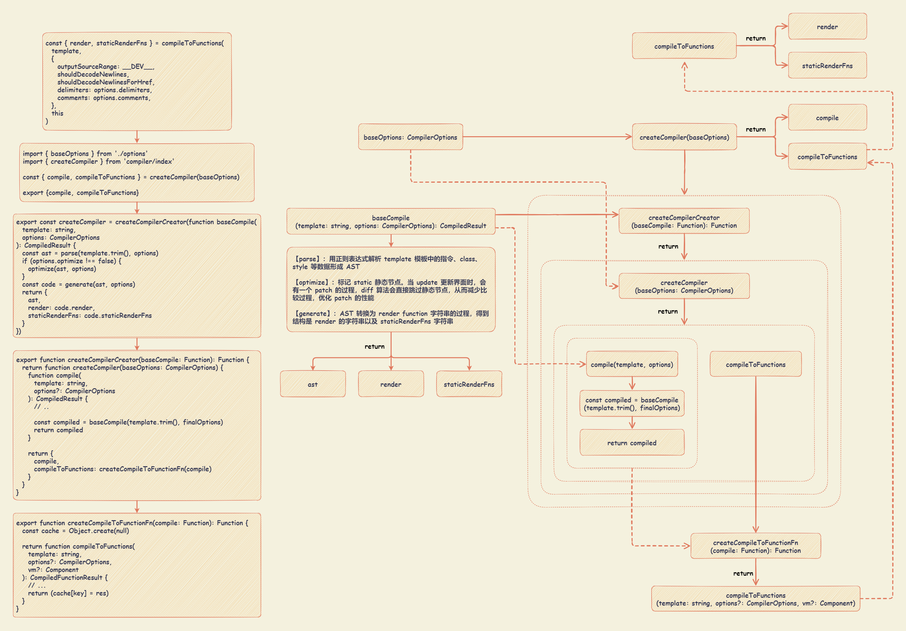

# Vue 编译

在 Vue 2.x 中，所有 Vue 组件的渲染都需要 `render` 方法，包括单文件组件（`.vue`）、`el` 或者 `template` 属性，最终都会转换成 `render` 方法。

在重写 `Vue.prototype.$mount` 方法中，通过调用 `compileToFunctions` 方法把模板 `template` 编译生成 `render` 以及 `staticRenderFns`。



`compileToFunctions` 方法实际上是 `createCompiler(baseOptions)` 方法的返回值，该方法接收一个编译配置参数。

::: details Vue.prototype.$mount

```typescript {55-65}
// src\platforms\web\runtime-with-compiler.ts

import { compileToFunctions } from './compiler/index'

const mount = Vue.prototype.$mount
Vue.prototype.$mount = function (
  el?: string | Element,
  hydrating?: boolean
): Component {
  el = el && query(el)

  /* istanbul ignore if */
  if (el === document.body || el === document.documentElement) {
    __DEV__ &&
      warn(
        `Do not mount Vue to <html> or <body> - mount to normal elements instead.`
      )
    return this
  }

  const options = this.$options
  // resolve template/el and convert to render function
  if (!options.render) {
    let template = options.template
    if (template) {
      if (typeof template === 'string') {
        if (template.charAt(0) === '#') {
          template = idToTemplate(template)
          /* istanbul ignore if */
          if (__DEV__ && !template) {
            warn(
              `Template element not found or is empty: ${options.template}`,
              this
            )
          }
        }
      } else if (template.nodeType) {
        template = template.innerHTML
      } else {
        if (__DEV__) {
          warn('invalid template option:' + template, this)
        }
        return this
      }
    } else if (el) {
      // @ts-expect-error
      template = getOuterHTML(el)
    }
    if (template) {
      /* istanbul ignore if */
      if (__DEV__ && config.performance && mark) {
        mark('compile')
      }

      const { render, staticRenderFns } = compileToFunctions(
        template,
        {
          outputSourceRange: __DEV__,
          shouldDecodeNewlines,
          shouldDecodeNewlinesForHref,
          delimiters: options.delimiters,
          comments: options.comments,
        },
        this
      )
      options.render = render
      options.staticRenderFns = staticRenderFns

      /* istanbul ignore if */
      if (__DEV__ && config.performance && mark) {
        mark('compile end')
        measure(`vue ${this._name} compile`, 'compile', 'compile end')
      }
    }
  }
  return mount.call(this, el, hydrating)
}
```

:::

::: details compileToFunctions 方法

```typescript
// src\platforms\web\compiler\index.ts

import { baseOptions } from './options'
import { createCompiler } from 'compiler/index'

const { compile, compileToFunctions } = createCompiler(baseOptions)

export { compile, compileToFunctions }
```

:::

在 `createCompiler` 方法中，通过调用 `createCompilerCreator` 方法的返回。

::: details createCompiler 方法

```typescript
// src\compiler\index.ts

import { parse } from './parser/index'
import { optimize } from './optimizer'
import { generate } from './codegen/index'
import { createCompilerCreator } from './create-compiler'
import { CompilerOptions, CompiledResult } from 'types/compiler'

// `createCompilerCreator` allows creating compilers that use alternative
// parser/optimizer/codegen, e.g the SSR optimizing compiler.
// Here we just export a default compiler using the default parts.
export const createCompiler = createCompilerCreator(function baseCompile(
  template: string,
  options: CompilerOptions
): CompiledResult {
  const ast = parse(template.trim(), options)
  if (options.optimize !== false) {
    optimize(ast, options)
  }
  const code = generate(ast, options)
  return {
    ast,
    render: code.render,
    staticRenderFns: code.staticRenderFns,
  }
})
```

:::

`createCompilerCreator(baseCompile)` 方法传入的参数是一个函数（即 `baseCompile`），返回一个 `createCompiler` 的函数。真正的编译过程都在这个 `baseCompile` 函数里执行的。

`createCompiler` 的函数，接收一个 `baseOptions` 的参数，返回一个对象。返回对象包括 `compile` 方法属性和 `compileToFunctions` 属性（对应的是 `Vue.prototype.$mount` 函数调用的 `compileToFunctions` 方法，其调用的是 `createCompileToFunctionFn(compile)` 方法的返回值）。

::: details createCompilerCreator 方法

```typescript
import { extend } from 'shared/util'
import { CompilerOptions, CompiledResult, WarningMessage } from 'types/compiler'
import { detectErrors } from './error-detector'
import { createCompileToFunctionFn } from './to-function'

export function createCompilerCreator(baseCompile: Function): Function {
  return function createCompiler(baseOptions: CompilerOptions) {
    function compile(
      template: string,
      options?: CompilerOptions
    ): CompiledResult {
      const finalOptions = Object.create(baseOptions)
      const errors: WarningMessage[] = []
      const tips: WarningMessage[] = []

      let warn = (
        msg: WarningMessage,
        range: { start: number; end: number },
        tip: string
      ) => {
        ;(tip ? tips : errors).push(msg)
      }

      if (options) {
        if (__DEV__ && options.outputSourceRange) {
          // $flow-disable-line
          const leadingSpaceLength = template.match(/^\s*/)![0].length

          warn = (
            msg: WarningMessage | string,
            range: { start: number; end: number },
            tip: string
          ) => {
            const data: WarningMessage = typeof msg === 'string' ? { msg } : msg
            if (range) {
              if (range.start != null) {
                data.start = range.start + leadingSpaceLength
              }
              if (range.end != null) {
                data.end = range.end + leadingSpaceLength
              }
            }
            ;(tip ? tips : errors).push(data)
          }
        }
        // merge custom modules
        if (options.modules) {
          finalOptions.modules = (baseOptions.modules || []).concat(
            options.modules
          )
        }
        // merge custom directives
        if (options.directives) {
          finalOptions.directives = extend(
            Object.create(baseOptions.directives || null),
            options.directives
          )
        }
        // copy other options
        for (const key in options) {
          if (key !== 'modules' && key !== 'directives') {
            finalOptions[key] = options[key as keyof CompilerOptions]
          }
        }
      }

      finalOptions.warn = warn

      const compiled = baseCompile(template.trim(), finalOptions)
      if (__DEV__) {
        detectErrors(compiled.ast, warn)
      }
      compiled.errors = errors
      compiled.tips = tips
      return compiled
    }

    return {
      compile,
      compileToFunctions: createCompileToFunctionFn(compile),
    }
  }
}
```

:::

`createCompileToFunctionFn(compile)` 方法接收 3 个参数：编译模板 `template`，编译配置 `options` 和 Vue 实例 `vm` 。核心的编译过程在于 `const compiled = compile(template, options)`。

`compile` 函数在执行 `createCompileToFunctionFn` 的时作为参数传入，它是 `createCompiler` 函数中定义的 `compile` 函数。在 `compile` 函数 中：

- 先处理配置参数
- 通过 `const compiled = baseCompile(template, finalOptions)` 执行编译过程，其中 `baseCompile` 在执行 `createCompilerCreator` 方法时作为参数传入。

在 `baseCompile` 进行编译的过程中，主要执行逻辑：

- 解析模板字符串生成 AST ： `const ast = parse(template.trim(), options)`
- 优化语法树 ： `optimize(ast, options)`
- 生成代码 ： `const code = generate(ast, options)`

编译入口逻辑绕的原因

- Vue.js 在不同的平台下都会有编译的过程，因此编译过程中的依赖的配置 `baseOptions` 会有所不同。
- 编译过程会多次执行，但这同一个平台下每一次的编译过程配置又是相同的，为了不让这些配置在每次编译过程都通过参数传入，Vue.js 利用了函数柯里化的技巧实现了 `baseOptions` 的参数保留。
- 同时，Vue.js 利用函数柯里化技巧把基础的编译过程函数抽出来，通过 `createCompilerCreator(baseCompile)` 的方式把真正编译的过程和其它逻辑如对编译配置处理、缓存处理等剥离开。

::: details createCompileToFunctionFn 方法

```typescript {62}
// src\compiler\to-function.ts

import { noop, extend } from 'shared/util'
import { warn as baseWarn, tip } from 'core/util/debug'
import { generateCodeFrame } from './codeframe'
import type { Component } from 'types/component'
import { CompilerOptions } from 'types/compiler'

type CompiledFunctionResult = {
  render: Function
  staticRenderFns: Array<Function>
}

function createFunction(code, errors) {
  try {
    return new Function(code)
  } catch (err: any) {
    errors.push({ err, code })
    return noop
  }
}

export function createCompileToFunctionFn(compile: Function): Function {
  const cache = Object.create(null)

  return function compileToFunctions(
    template: string,
    options?: CompilerOptions,
    vm?: Component
  ): CompiledFunctionResult {
    options = extend({}, options)
    const warn = options.warn || baseWarn
    delete options.warn

    /* istanbul ignore if */
    if (__DEV__) {
      // detect possible CSP restriction
      try {
        new Function('return 1')
      } catch (e: any) {
        if (e.toString().match(/unsafe-eval|CSP/)) {
          warn(
            'It seems you are using the standalone build of Vue.js in an ' +
              'environment with Content Security Policy that prohibits unsafe-eval. ' +
              'The template compiler cannot work in this environment. Consider ' +
              'relaxing the policy to allow unsafe-eval or pre-compiling your ' +
              'templates into render functions.'
          )
        }
      }
    }

    // check cache
    const key = options.delimiters
      ? String(options.delimiters) + template
      : template
    if (cache[key]) {
      return cache[key]
    }

    // compile
    const compiled = compile(template, options)

    // check compilation errors/tips
    if (__DEV__) {
      if (compiled.errors && compiled.errors.length) {
        if (options.outputSourceRange) {
          compiled.errors.forEach(e => {
            warn(
              `Error compiling template:\n\n${e.msg}\n\n` +
                generateCodeFrame(template, e.start, e.end),
              vm
            )
          })
        } else {
          warn(
            `Error compiling template:\n\n${template}\n\n` +
              compiled.errors.map(e => `- ${e}`).join('\n') +
              '\n',
            vm
          )
        }
      }
      if (compiled.tips && compiled.tips.length) {
        if (options.outputSourceRange) {
          compiled.tips.forEach(e => tip(e.msg, vm))
        } else {
          compiled.tips.forEach(msg => tip(msg, vm))
        }
      }
    }

    // turn code into functions
    const res: any = {}
    const fnGenErrors: any[] = []
    res.render = createFunction(compiled.render, fnGenErrors)
    res.staticRenderFns = compiled.staticRenderFns.map(code => {
      return createFunction(code, fnGenErrors)
    })

    // check function generation errors.
    // this should only happen if there is a bug in the compiler itself.
    // mostly for codegen development use
    /* istanbul ignore if */
    if (__DEV__) {
      if ((!compiled.errors || !compiled.errors.length) && fnGenErrors.length) {
        warn(
          `Failed to generate render function:\n\n` +
            fnGenErrors
              .map(
                ({ err, code }) => `${(err as any).toString()} in\n\n${code}\n`
              )
              .join('\n'),
          vm
        )
      }
    }

    return (cache[key] = res)
  }
}
```

:::

## parse 模板解析

`parse` 的目标是把 `template` 模板字符串转换成 AST 树，它是一种用 JavaScript 对象的形式来描述整个模板。

整个 `parse` 的过程是利用正则表达式顺序解析模板，当解析到开始标签、闭合标签、文本的时候都会分别执行对应的回调函数，来达到构造 AST 树的目的。

[AST Explorer](https://astexplorer.net/) ： web 工具，各种解析器生产 AST。

### 整体流程

`parse(template, options)` 定义在 `src\compiler\parser\index.ts` 模块中。

::: details 【parse】方法：将 template 模板字符串转换成 AST 树

```typescript
// src\compiler\parser\index.ts

/**
 * Convert HTML string to AST.
 */
export function parse(template: string, options: CompilerOptions): ASTElement {
  warn = options.warn || baseWarn

  platformIsPreTag = options.isPreTag || no
  platformMustUseProp = options.mustUseProp || no
  platformGetTagNamespace = options.getTagNamespace || no
  const isReservedTag = options.isReservedTag || no
  maybeComponent = (el: ASTElement) =>
    !!(
      el.component ||
      el.attrsMap[':is'] ||
      el.attrsMap['v-bind:is'] ||
      !(el.attrsMap.is ? isReservedTag(el.attrsMap.is) : isReservedTag(el.tag))
    )
  transforms = pluckModuleFunction(options.modules, 'transformNode')
  preTransforms = pluckModuleFunction(options.modules, 'preTransformNode')
  postTransforms = pluckModuleFunction(options.modules, 'postTransformNode')

  delimiters = options.delimiters

  const stack: any[] = []
  const preserveWhitespace = options.preserveWhitespace !== false
  const whitespaceOption = options.whitespace
  let root
  let currentParent
  let inVPre = false
  let inPre = false

  // ... 省略一些辅助方法： closeElement、trimEndingWhitespace、checkRootConstraints

  parseHTML(template, {
    warn,
    expectHTML: options.expectHTML,
    isUnaryTag: options.isUnaryTag,
    canBeLeftOpenTag: options.canBeLeftOpenTag,
    shouldDecodeNewlines: options.shouldDecodeNewlines,
    shouldDecodeNewlinesForHref: options.shouldDecodeNewlinesForHref,
    shouldKeepComment: options.comments,
    outputSourceRange: options.outputSourceRange,
    start(tag, attrs, unary, start, end) {
      // check namespace.
      // inherit parent ns if there is one
      const ns =
        (currentParent && currentParent.ns) || platformGetTagNamespace(tag)

      // handle IE svg bug
      /* istanbul ignore if */
      if (isIE && ns === 'svg') {
        attrs = guardIESVGBug(attrs)
      }

      let element: ASTElement = createASTElement(tag, attrs, currentParent)
      if (ns) {
        element.ns = ns
      }

      if (isForbiddenTag(element) && !isServerRendering()) {
        element.forbidden = true
      }

      // apply pre-transforms
      for (let i = 0; i < preTransforms.length; i++) {
        element = preTransforms[i](element, options) || element
      }

      if (!inVPre) {
        processPre(element)
        if (element.pre) {
          inVPre = true
        }
      }
      if (platformIsPreTag(element.tag)) {
        inPre = true
      }
      if (inVPre) {
        processRawAttrs(element)
      } else if (!element.processed) {
        // structural directives
        processFor(element)
        processIf(element)
        processOnce(element)
      }

      if (!root) {
        root = element
      }

      if (!unary) {
        currentParent = element
        stack.push(element)
      } else {
        closeElement(element)
      }
    },

    end(tag, start, end) {
      const element = stack[stack.length - 1]
      // pop stack
      stack.length -= 1
      currentParent = stack[stack.length - 1]
      closeElement(element)
    },

    chars(text: string, start?: number, end?: number) {
      if (!currentParent) {
        return
      }
      // IE textarea placeholder bug
      /* istanbul ignore if */
      if (
        isIE &&
        currentParent.tag === 'textarea' &&
        currentParent.attrsMap.placeholder === text
      ) {
        return
      }
      const children = currentParent.children
      if (inPre || text.trim()) {
        text = isTextTag(currentParent)
          ? text
          : (decodeHTMLCached(text) as string)
      } else if (!children.length) {
        // remove the whitespace-only node right after an opening tag
        text = ''
      } else if (whitespaceOption) {
        if (whitespaceOption === 'condense') {
          // in condense mode, remove the whitespace node if it contains
          // line break, otherwise condense to a single space
          text = lineBreakRE.test(text) ? '' : ' '
        } else {
          text = ' '
        }
      } else {
        text = preserveWhitespace ? ' ' : ''
      }
      if (text) {
        if (!inPre && whitespaceOption === 'condense') {
          // condense consecutive whitespaces into single space
          text = text.replace(whitespaceRE, ' ')
        }
        let res
        let child: ASTNode | undefined
        if (!inVPre && text !== ' ' && (res = parseText(text, delimiters))) {
          child = {
            type: 2,
            expression: res.expression,
            tokens: res.tokens,
            text,
          }
        } else if (
          text !== ' ' ||
          !children.length ||
          children[children.length - 1].text !== ' '
        ) {
          child = {
            type: 3,
            text,
          }
        }
        if (child) {
          children.push(child)
        }
      }
    },
    comment(text: string, start, end) {
      // adding anything as a sibling to the root node is forbidden
      // comments should still be allowed, but ignored
      if (currentParent) {
        const child: ASTText = {
          type: 3,
          text,
          isComment: true,
        }
        currentParent.children.push(child)
      }
    },
  })
  return root
}
```

:::

### 从 options 中获取方法和配置

`parse(template, options)` 函数输入的是 `template` 和 `options`，输出的是 AST 的根节点。其中，`template` 为模板字符串， `options` 是和平台相关的一些配置，定义在 `src\platforms\web\compiler\options.ts` 模块，这些属性和方法之所以放到 `platforms` 目录下，是因为它们在不同的平台（web 和 weex）的实现是不同的。

::: details parse(template, options) 中 options 的定义

```typescript
import {
  isPreTag,
  mustUseProp,
  isReservedTag,
  getTagNamespace,
} from '../util/index'

import modules from './modules/index'
import directives from './directives/index'
import { genStaticKeys } from 'shared/util'
import { isUnaryTag, canBeLeftOpenTag } from './util'
import { CompilerOptions } from 'types/compiler'

export const baseOptions: CompilerOptions = {
  expectHTML: true,
  modules,
  directives,
  isPreTag,
  isUnaryTag,
  mustUseProp,
  canBeLeftOpenTag,
  isReservedTag,
  getTagNamespace,
  staticKeys: genStaticKeys(modules),
}
```

:::

### parseHTML 解析 HTML 模板

对于 `template` 模板的解析主要是通过 `parseHTML` 函数，其定义在 `src\compiler\parser\html-parser.ts` 模块中。

`parseHTML` 函数通过循环解析 `template` ，使用正则表达式对标签、节点等进行匹配，针对不同情况进行不同处理，只到整个 `template` 解析完成。在匹配过程中，会利用 `advance` 函数记录字符串解析索引位置，直到字符串结束。

在循环解析整个 `template` 的过程中，会根据不同的情况，去执行不同的回调函数。

```typescript
// src\compiler\parser\html-parser.ts
export function parseHTML(html, options: HTMLParserOptions) {
  // ... 省略一些代码

  let index = 0

  function advance(n) {
    index += n
    html = html.substring(n)
  }
}
```

匹配过程中，通过正则表达式可以匹配注释节点、文档类型节点、开始闭合标签等。

```typescript
import { unicodeRegExp } from 'core/util/lang'
// export const unicodeRegExp =
//   /a-zA-Z\u00B7\u00C0-\u00D6\u00D8-\u00F6\u00F8-\u037D\u037F-\u1FFF\u200C-\u200D\u203F-\u2040\u2070-\u218F\u2C00-\u2FEF\u3001-\uD7FF\uF900-\uFDCF\uFDF0-\uFFFD/

// Regular Expressions for parsing tags and attributes
const attribute =
  /^\s*([^\s"'<>\/=]+)(?:\s*(=)\s*(?:"([^"]*)"+|'([^']*)'+|([^\s"'=<>`]+)))?/
const dynamicArgAttribute =
  /^\s*((?:v-[\w-]+:|@|:|#)\[[^=]+?\][^\s"'<>\/=]*)(?:\s*(=)\s*(?:"([^"]*)"+|'([^']*)'+|([^\s"'=<>`]+)))?/
const ncname = `[a-zA-Z_][\\-\\.0-9_a-zA-Z${unicodeRegExp.source}]*`
const qnameCapture = `((?:${ncname}\\:)?${ncname})`
const startTagOpen = new RegExp(`^<${qnameCapture}`)
const startTagClose = /^\s*(\/?)>/
const endTag = new RegExp(`^<\\/${qnameCapture}[^>]*>`)
const doctype = /^<!DOCTYPE [^>]+>/i
// #7298: escape - to avoid being passed as HTML comment when inlined in page
const comment = /^<!\--/
const conditionalComment = /^<!\[/
```

- 注释节点、文档类型节点

  - 对于注释和条件注释节点，前进至它们的末尾位置；
  - 对于文档类型节点，则前进它自身长度的距离。

  ::: details 【parseHTML】方法：匹配注释节点、文档类型节点

  ```typescript
  // src\compiler\parser\html-parser.ts

  export function parseHTML(html, options: HTMLParserOptions) {
    while (html) {
      last = html
      // Make sure we're not in a plaintext content element like script/style
      if (!lastTag || !isPlainTextElement(lastTag)) {
        let textEnd = html.indexOf('<')
        if (textEnd === 0) {
          // Comment:
          if (comment.test(html)) {
            const commentEnd = html.indexOf('-->')

            if (commentEnd >= 0) {
              if (options.shouldKeepComment && options.comment) {
                options.comment(
                  html.substring(4, commentEnd),
                  index,
                  index + commentEnd + 3
                )
              }
              advance(commentEnd + 3)
              continue
            }
          }

          // http://en.wikipedia.org/wiki/Conditional_comment#Downlevel-revealed_conditional_comment
          if (conditionalComment.test(html)) {
            const conditionalEnd = html.indexOf(']>')

            if (conditionalEnd >= 0) {
              advance(conditionalEnd + 2)
              continue
            }
          }

          // Doctype:
          const doctypeMatch = html.match(doctype)
          if (doctypeMatch) {
            advance(doctypeMatch[0].length)
            continue
          }

          // ...
        } else {
          // ...
        }
      }
    }

    // ...
  }
  ```

  :::

- 开始标签

  `parseStartTag` 函数：解析开始标签。

  - 通过正则表达式 `startTagOpen` 匹配到开始标签
  - 定义 `match` 对象，匹配开始标签中的属性并添加到 `match.attrs` 中，直到匹配到开始标签的闭合标签结束
  - 如果匹配到闭合标签，则获取一元斜线符，前进到闭合符尾（`/`），并把当前索引赋值给 `match.end`

  `handleStartTag` 函数：对 `parseStartTag` 函数匹配解析到的开始标签属性 `match` 进行处理。

  - 首先，判断开始标签是否是一元标签（例如：``、`<br/>`）
  - 接着，对 `match.attrs` 遍历并做了一些处理
  - 最后，判断如果非一元标签，则往 `stack` 中 push 一个对象，并把 `tagName` 赋值给 `lastTag`
  - 最终，调用 `options.start` 回调函数，并传入相关参数。

  ::: details 【parseHTML】方法：匹配开始标签

  ```typescript
  // src\compiler\parser\html-parser.ts

  export function parseHTML(html, options: HTMLParserOptions) {
    while (html) {
      last = html
      // Make sure we're not in a plaintext content element like script/style
      if (!lastTag || !isPlainTextElement(lastTag)) {
        let textEnd = html.indexOf('<')
        if (textEnd === 0) {
          // ...

          // Start tag:
          const startTagMatch = parseStartTag()
          if (startTagMatch) {
            handleStartTag(startTagMatch)
            if (shouldIgnoreFirstNewline(startTagMatch.tagName, html)) {
              advance(1)
            }
            continue
          }

          // ...
        }
      } else {
        // ...
      }
    }

    // ...

    function parseStartTag() {
      const start = html.match(startTagOpen)
      if (start) {
        const match: any = {
          tagName: start[1],
          attrs: [],
          start: index,
        }
        advance(start[0].length)
        let end, attr
        while (
          !(end = html.match(startTagClose)) &&
          (attr = html.match(dynamicArgAttribute) || html.match(attribute))
        ) {
          attr.start = index
          advance(attr[0].length)
          attr.end = index
          match.attrs.push(attr)
        }
        if (end) {
          match.unarySlash = end[1]
          advance(end[0].length)
          match.end = index
          return match
        }
      }
    }

    function handleStartTag(match) {
      const tagName = match.tagName
      const unarySlash = match.unarySlash

      if (expectHTML) {
        if (lastTag === 'p' && isNonPhrasingTag(tagName)) {
          parseEndTag(lastTag)
        }
        if (canBeLeftOpenTag(tagName) && lastTag === tagName) {
          parseEndTag(tagName)
        }
      }

      const unary = isUnaryTag(tagName) || !!unarySlash

      const l = match.attrs.length
      const attrs: ASTAttr[] = new Array(l)
      for (let i = 0; i < l; i++) {
        const args = match.attrs[i]
        const value = args[3] || args[4] || args[5] || ''
        const shouldDecodeNewlines =
          tagName === 'a' && args[1] === 'href'
            ? options.shouldDecodeNewlinesForHref
            : options.shouldDecodeNewlines
        attrs[i] = {
          name: args[1],
          value: decodeAttr(value, shouldDecodeNewlines),
        }
        if (__DEV__ && options.outputSourceRange) {
          attrs[i].start = args.start + args[0].match(/^\s*/).length
          attrs[i].end = args.end
        }
      }

      if (!unary) {
        stack.push({
          tag: tagName,
          lowerCasedTag: tagName.toLowerCase(),
          attrs: attrs,
          start: match.start,
          end: match.end,
        })
        lastTag = tagName
      }

      if (options.start) {
        options.start(tagName, attrs, unary, match.start, match.end)
      }
    }
  }
  ```

  :::

- 闭合标签

  首先，通过正则 `endTag` 匹配到闭合标签；然后，前进到闭合标签末尾；最后，执行 `parseEndTag` 方法对闭合标签做解析。

  `parseEndTag` 函数：解析闭合标签。与 `parseStartTag` 函数相反，对闭合标签的解析是倒序 `stack`，获取到第一个和当前 `endTag` 匹配的元素。

  - 如果是正常标签匹配，那么 `stack` 的最后一个元素应该和当前 `endTag` 匹配。匹配后，把栈到 `pos` 位置的都弹出，并从 `stack` 尾部拿到 `lastTag`。
  - 如果出现异常情况（例如：`<div><span></div>`），此时，当 `endTag` 为 `</div>` 时，从 `stack` 尾部找到的标签是 `<span>`，就不能匹配，则会报警告。
  - 最后调用了 `options.end` 回调函数，并传入相关参数。

  ::: details 【parseHTML】方法：匹配闭合标签

  ```typescript
  // src\compiler\parser\html-parser.ts

  export function parseHTML(html, options: HTMLParserOptions) {
    while (html) {
      last = html
      // Make sure we're not in a plaintext content element like script/style
      if (!lastTag || !isPlainTextElement(lastTag)) {
        let textEnd = html.indexOf('<')
        if (textEnd === 0) {
          // ...

          // End tag:
          const endTagMatch = html.match(endTag)
          if (endTagMatch) {
            const curIndex = index
            advance(endTagMatch[0].length)
            parseEndTag(endTagMatch[1], curIndex, index)
            continue
          }

          // ...
        }
      }
    }

    // ...

    function parseEndTag(tagName?: any, start?: any, end?: any) {
      let pos, lowerCasedTagName
      if (start == null) start = index
      if (end == null) end = index

      // Find the closest opened tag of the same type
      if (tagName) {
        lowerCasedTagName = tagName.toLowerCase()
        for (pos = stack.length - 1; pos >= 0; pos--) {
          if (stack[pos].lowerCasedTag === lowerCasedTagName) {
            break
          }
        }
      } else {
        // If no tag name is provided, clean shop
        pos = 0
      }

      if (pos >= 0) {
        // Close all the open elements, up the stack
        for (let i = stack.length - 1; i >= pos; i--) {
          if (__DEV__ && (i > pos || !tagName) && options.warn) {
            options.warn(`tag <${stack[i].tag}> has no matching end tag.`, {
              start: stack[i].start,
              end: stack[i].end,
            })
          }
          if (options.end) {
            options.end(stack[i].tag, start, end)
          }
        }

        // Remove the open elements from the stack
        stack.length = pos
        lastTag = pos && stack[pos - 1].tag
      } else if (lowerCasedTagName === 'br') {
        if (options.start) {
          options.start(tagName, [], true, start, end)
        }
      } else if (lowerCasedTagName === 'p') {
        if (options.start) {
          options.start(tagName, [], false, start, end)
        }
        if (options.end) {
          options.end(tagName, start, end)
        }
      }
    }

    // ...
  }
  ```

  :::

- 文本

  - 判断 `textEnd >= 0` ，满足则说明从当前位置到 `textEnd` 位置都是文本。并且如果 `<` 是纯文本中的字符，继续找到真正的文本结束的位置，然后前进到结束的位置。
  - 再继续，判断 `textEnd < 0` 的情况，则说明整个 `template` 解析完毕了，把剩余的 `html` 都赋值给了 `text`。
  - 最后，调用 `options.chars` 回调函数，并传 `text` 参数。

  ::: details 【parseHTML】方法：匹配文本

  ```typescript
  let textEnd = html.indexOf('<')

  let text, rest, next
  if (textEnd >= 0) {
    rest = html.slice(textEnd)
    while (
      !endTag.test(rest) &&
      !startTagOpen.test(rest) &&
      !comment.test(rest) &&
      !conditionalComment.test(rest)
    ) {
      // < in plain text, be forgiving and treat it as text
      next = rest.indexOf('<', 1)
      if (next < 0) break
      textEnd += next
      rest = html.slice(textEnd)
    }
    text = html.substring(0, textEnd)
  }

  if (textEnd < 0) {
    text = html
  }

  if (text) {
    advance(text.length)
  }

  if (options.chars && text) {
    options.chars(text, index - text.length, index)
  }
  ```

  :::

#### 处理开始标签

::: details 【parse】方法：处理开始标签

```typescript
// src\compiler\parser\index.ts

/**
 * Convert HTML string to AST.
 */
export function parse(template: string, options: CompilerOptions): ASTElement {
  parseHTML(template, {
    // ...

    start(tag, attrs, unary, start, end) {
      // check namespace.
      // inherit parent ns if there is one
      const ns =
        (currentParent && currentParent.ns) || platformGetTagNamespace(tag)

      // handle IE svg bug
      /* istanbul ignore if */
      if (isIE && ns === 'svg') {
        attrs = guardIESVGBug(attrs)
      }

      let element: ASTElement = createASTElement(tag, attrs, currentParent)
      if (ns) {
        element.ns = ns
      }

      if (isForbiddenTag(element) && !isServerRendering()) {
        element.forbidden = true
      }

      // apply pre-transforms
      for (let i = 0; i < preTransforms.length; i++) {
        element = preTransforms[i](element, options) || element
      }

      if (!inVPre) {
        processPre(element)
        if (element.pre) {
          inVPre = true
        }
      }
      if (platformIsPreTag(element.tag)) {
        inPre = true
      }
      if (inVPre) {
        processRawAttrs(element)
      } else if (!element.processed) {
        // structural directives
        processFor(element)
        processIf(element)
        processOnce(element)
      }

      if (!root) {
        root = element
      }

      if (!unary) {
        currentParent = element
        stack.push(element)
      } else {
        closeElement(element)
      }
    },

    // ...
  })
}
```

:::

当解析到开始标签的时，最后会执行 `start` 回调函数，函数主要就做 3 件事情：创建 AST 元素；处理 AST 元素；AST 树管理。

- 创建 AST 元素

  通过 `createASTElement` 方法创建一个 AST 元素，并添加了 `namespace`。每一个 AST 元素就是一个普通的 JavaScript 对象，其中：

  - `type` 表示 AST 元素类型
  - `tag` 表示标签名
  - `attrsList` 表示属性列表
  - `attrsMap` 表示属性映射表
  - `parent` 表示父的 AST 元素
  - `children` 表示子 AST 元素集合。

  ::: details 【parseHTML 的 start 回调方法】：创建 AST 元素

  ```typescript
  // src\compiler\parser\index.ts

  export function parse(template: string, options: CompilerOptions): ASTElement {
    parseHTML(template, {
      start(tag, attrs, unary, start, end) {
        // check namespace.
        // inherit parent ns if there is one
        const ns =
          (currentParent && currentParent.ns) || platformGetTagNamespace(tag)

        // handle IE svg bug
        /* istanbul ignore if */
        if (isIE && ns === 'svg') {
          attrs = guardIESVGBug(attrs)
        }

        let element: ASTElement = createASTElement(tag, attrs, currentParent)
        if (ns) {
          element.ns = ns
        }

        // ...
      }
    })
  }

  export function createASTElement(
    tag: string,
    attrs: Array<ASTAttr>,
    parent: ASTElement | void

  ): ASTElement {
    return {
      type: 1,
      tag,
      attrsList: attrs,
      attrsMap: makeAttrsMap(attrs),
      rawAttrsMap: {},
      parent,
      children: []
    }
  }
  ```

  :::

- 处理 AST 元素

  循环 `preTransforms` 模块，并获取模块中的元素赋值给 `element`。判断 `element` 是否包含各种指令，并通过 `processXXX` 进行处理，处理的结果就是扩展 AST 元素的属性。

  ::: details 【parseHTML 的 start 回调方法】：处理 AST 元素

  ```typescript
  // src\compiler\parser\index.ts

  export function parse(template: string, options: CompilerOptions): ASTElement {

    // ...

    transforms = pluckModuleFunction(options.modules, 'transformNode')
    preTransforms = pluckModuleFunction(options.modules, 'preTransformNode')
    postTransforms = pluckModuleFunction(options.modules, 'postTransformNode')

    parseHTML(template, {
      start(tag, attrs, unary, start, end) {

        // ...

        if (isForbiddenTag(element) && !isServerRendering()) {
          element.forbidden = true
          __DEV__ &&
            warn(
              'Templates should only be responsible for mapping the state to the ' +
                'UI. Avoid placing tags with side-effects in your templates, such as ' +
                `<${tag}>` +
                ', as they will not be parsed.',
              { start: element.start }
            )
        }

        // apply pre-transforms
        for (let i = 0; i < preTransforms.length; i++) {
          element = preTransforms[i](element, options) || element
        }

        if (!inVPre) {
          processPre(element)
          if (element.pre) {
            inVPre = true
          }
        }
        if (platformIsPreTag(element.tag)) {
          inPre = true
        }
        if (inVPre) {
          processRawAttrs(element)
        } else if (!element.processed) {
          // structural directives
          processFor(element)
          processIf(element)
          processOnce(element)
        }

        // ...
      }
    })
  }

  export function createASTElement(
    tag: string,
    attrs: Array<ASTAttr>,
    parent: ASTElement | void

  ): ASTElement {
    return {
      type: 1,
      tag,
      attrsList: attrs,
      attrsMap: makeAttrsMap(attrs),
      rawAttrsMap: {},
      parent,
      children: []
    }
  }
  ```

  :::

  - `processFor` ：从元素中获取到 `v-for` 指令的内容，分别解析出 `for`、`alias`、`iterator1`、`iterator2` 等属性的值并添加到 AST 的元素上。

    示例：`v-for="(item,index) in data"`，解析出的 `for` 是 `data`，`alias` 是 `item`，`iterator1` 是 `index`，没有 `iterator2`。

    ::: details 【processFor】方法：解析 v-for 指令

    ```typescript
    // src\compiler\parser\index.ts

    export function processFor(el: ASTElement) {
      let exp
      if ((exp = getAndRemoveAttr(el, 'v-for'))) {
        const res = parseFor(exp)
        if (res) {
          extend(el, res)
        } else if (__DEV__) {
          warn(`Invalid v-for expression: ${exp}`, el.rawAttrsMap['v-for'])
        }
      }
    }

    export const forAliasRE = /([\s\S]*?)\s+(?:in|of)\s+([\s\S]*)/
    export const forIteratorRE = /,([^,\}\]]*)(?:,([^,\}\]]*))?$/
    const stripParensRE = /^\(|\)$/g

    export function parseFor(exp: string): ForParseResult | undefined {
      const inMatch = exp.match(forAliasRE)
      if (!inMatch) return
      const res: any = {}
      res.for = inMatch[2].trim()
      const alias = inMatch[1].trim().replace(stripParensRE, '')
      const iteratorMatch = alias.match(forIteratorRE)
      if (iteratorMatch) {
        res.alias = alias.replace(forIteratorRE, '').trim()
        res.iterator1 = iteratorMatch[1].trim()
        if (iteratorMatch[2]) {
          res.iterator2 = iteratorMatch[2].trim()
        }
      } else {
        res.alias = alias
      }
      return res
    }
    ```

    :::

  - `processIf` ：从元素中获取到 `v-if` 指令的内容，如果获取到则给 AST 元素添加 `if` 属性和 `ifConditions` 属性；否则，尝试获取 `v-else` 指令及 `v-else-if` 指令的内容，如果拿到，则给 AST 元素分别添加 `else` 和 `elseif` 属性。

    ::: details

    ```typescript
    // src\compiler\parser\index.ts

    function processIf(el) {
      const exp = getAndRemoveAttr(el, 'v-if')
      if (exp) {
        el.if = exp
        addIfCondition(el, {
          exp: exp,
          block: el,
        })
      } else {
        if (getAndRemoveAttr(el, 'v-else') != null) {
          el.else = true
        }
        const elseif = getAndRemoveAttr(el, 'v-else-if')
        if (elseif) {
          el.elseif = elseif
        }
      }
    }

    export function addIfCondition(el: ASTElement, condition: ASTIfCondition) {
      if (!el.ifConditions) {
        el.ifConditions = []
      }
      el.ifConditions.push(condition)
    }
    ```

    :::

- AST 树管理

  在处理开始标签的时候，会为每一个标签创建一个 AST 元素，在不断解析模块创建 AST 元素的时候，会为它们建立父子关系，类似于 DOM 元素的父子关系。

  AST 树管理的目的是构建一颗 AST 树，本质上是要维护 `root` 根节点和当前父节点 `currentParent`。为了保证元素可以正确闭合，这里也利用了 `stack` 栈的数据结构，和解析模板时用到的 `stack` 类似。

  - 当在处理开始标签的时，判断如果有 `currentParent`，会把当前 AST 元素 `push` 到 `currentParent.children` 中，同时，把 AST 元素的 `parent` 指向 `currentParent`。
  - 接着，更新 `currentParent` 和 `stack`。判断当前如果不是一个一元标签（例如：``、`<br/>`），则会把它生成的 AST 元素 push 到 `stack` 中，并且把当前的 AST 元素赋值给 `currentParent`。

  `stack` 和 `currentParent` 除了在处理开始标签的时候会变化，在处理闭合标签的时候也会变化。

  ::: details 【parseHTML 的 start 回调方法】：AST 树管理

  ```typescript
  /**
  * Convert HTML string to AST.
  */
  export function parse(template: string, options: CompilerOptions): ASTElement {

    // ...

    function closeElement(element) {
      trimEndingWhitespace(element)
      if (!inVPre && !element.processed) {
        element = processElement(element, options)
      }
      // tree management
      if (!stack.length && element !== root) {
        // allow root elements with v-if, v-else-if and v-else
        if (root.if && (element.elseif || element.else)) {
          if (__DEV__) {
            checkRootConstraints(element)
          }
          addIfCondition(root, {
            exp: element.elseif,
            block: element
          })
        } else if (__DEV__) {
          warnOnce(
            `Component template should contain exactly one root element. ` +
              `If you are using v-if on multiple elements, ` +
              `use v-else-if to chain them instead.`,
            { start: element.start }
          )
        }
      }
      if (currentParent && !element.forbidden) {
        if (element.elseif || element.else) {
          processIfConditions(element, currentParent)
        } else {
          if (element.slotScope) {
            // scoped slot
            // keep it in the children list so that v-else(-if) conditions can
            // find it as the prev node.
            const name = element.slotTarget || '"default"'
            ;(currentParent.scopedSlots || (currentParent.scopedSlots = {}))[
              name
            ] = element
          }
          currentParent.children.push(element)
          element.parent = currentParent
        }
      }

      // final children cleanup
      // filter out scoped slots
      element.children = element.children.filter(c => !c.slotScope)
      // remove trailing whitespace node again
      trimEndingWhitespace(element)

      // check pre state
      if (element.pre) {
        inVPre = false
      }
      if (platformIsPreTag(element.tag)) {
        inPre = false
      }
      // apply post-transforms
      for (let i = 0; i < postTransforms.length; i++) {
        postTransforms[i](element, options)
      }
    }

    function checkRootConstraints(el) {
      if (el.tag === 'slot' || el.tag === 'template') {
        warnOnce(
          `Cannot use <${el.tag}> as component root element because it may ` +
            'contain multiple nodes.',
          { start: el.start }
        )
      }
      if (el.attrsMap.hasOwnProperty('v-for')) {
        warnOnce(
          'Cannot use v-for on stateful component root element because ' +
            'it renders multiple elements.',
          el.rawAttrsMap['v-for']
        )
      }
    }

    parseHTML(template, {

      // ...

      start(tag, attrs, unary, start, end) {

        // ...

        if (!root) {
          root = element
          if (__DEV__) {
            checkRootConstraints(root)
          }
        }

        if (!unary) {
          currentParent = element
          stack.push(element)
        } else {
          closeElement(element)
        }
      }
    })
  }
  ```

  :::

#### 处理闭合标签

当解析到闭合标签是，最后会执行 `end` 回调函数。从 `stack` 栈中弹出一个元素，并把 `stack` 最后一个元素赋值给 `currentParent`，这样可以保证当遇到闭合标签的时候，可以正确地更新 `stack` 的长度以及 `currentParent` 的值，这样就维护了整个 AST 树。

最后，执行 `closeElement(element)` 更新一下 `inVPre` 和 `inPre` 的状态，以及执行 `postTransforms` 函数。

::: details 【parseHTML 的 end 回调方法】方法：处理闭合标签

```typescript
// src\compiler\parser\index.ts

/**
 * Convert HTML string to AST.
 */
export function parse(template: string, options: CompilerOptions): ASTElement {

  function closeElement(element) {
    trimEndingWhitespace(element)
    if (!inVPre && !element.processed) {
      element = processElement(element, options)
    }
    // tree management
    if (!stack.length && element !== root) {
      // allow root elements with v-if, v-else-if and v-else
      if (root.if && (element.elseif || element.else)) {
        addIfCondition(root, {
          exp: element.elseif,
          block: element
        })
      }
    }
    if (currentParent && !element.forbidden) {
      if (element.elseif || element.else) {
        processIfConditions(element, currentParent)
      } else {
        if (element.slotScope) {
          // scoped slot
          // keep it in the children list so that v-else(-if) conditions can
          // find it as the prev node.
          const name = element.slotTarget || '"default"'
          ;(currentParent.scopedSlots || (currentParent.scopedSlots = {}))[
            name
          ] = element
        }
        currentParent.children.push(element)
        element.parent = currentParent
      }
    }

    // final children cleanup
    // filter out scoped slots
    element.children = element.children.filter(c => !c.slotScope)
    // remove trailing whitespace node again
    trimEndingWhitespace(element)

    // check pre state
    if (element.pre) {
      inVPre = false
    }
    if (platformIsPreTag(element.tag)) {
      inPre = false
    }
    // apply post-transforms
    for (let i = 0; i < postTransforms.length; i++) {
      postTransforms[i](element, options)
    }
  }

  parseHTML(template, {
    // ...

    end(tag, start, end) {
      const element = stack[stack.length - 1]
      // pop stack
      stack.length -= 1
      currentParent = stack[stack.length - 1]
      if (__DEV__ && options.outputSourceRange) {
        element.end = end
      }
      closeElement(element)
    },

    // ...
  })
}
```

:::

#### 处理文本内容

在解析模板过程中，会处理一些文本内容。文本构造的 AST 元素有 2 种类型：

- 一种是有表达式的，`type` 为 `2`。例如：`<span>{{item}}:{{index}}</span>`，`{{item}}:{{index}}` 是个表达式，会通过执行 `parseText(text, delimiters)` 对文本解析。
- 一种是纯文本，`type` 为 `3`

`parseText` 方法对文本解析：

- 首先，根据分隔符（默认是 `{{}}`）构造了文本匹配的正则表达式
- 然后，再循环匹配文本，遇到普通文本就 `push` 到 `rawTokens` 和 `tokens` 中。如果是表达式就转换成 `_s(${exp})` push 到 `tokens` 中，以及转换成 `{@binding:exp}` push 到 `rawTokens` 中。

在 `<span>{{item}}:{{index}}</span>` 中，对于文本表达式 `{{item}}:{{index}}` ：

- `token` 为 `[_s(item),'":"',_s(index)]`
- `rawTokens` 为 `[{'@binding': 'item'}, ':', {'@binding': 'index'}]`

::: details 【parseHTML 的 chars 回调方法】方法：处理文本内容

```typescript
// src\compiler\parser\index.ts

import { parseText } from './text-parser'

/**
 * Convert HTML string to AST.
 */
export function parse(template: string, options: CompilerOptions): ASTElement {
  parseHTML(template, {
    // ...

    chars(text: string, start?: number, end?: number) {
      if (!currentParent) {
        return
      }
      // IE textarea placeholder bug
      /* istanbul ignore if */
      if (
        isIE &&
        currentParent.tag === 'textarea' &&
        currentParent.attrsMap.placeholder === text
      ) {
        return
      }
      const children = currentParent.children
      if (inPre || text.trim()) {
        text = isTextTag(currentParent)
          ? text
          : (decodeHTMLCached(text) as string)
      } else if (!children.length) {
        // remove the whitespace-only node right after an opening tag
        text = ''
      } else if (whitespaceOption) {
        if (whitespaceOption === 'condense') {
          // in condense mode, remove the whitespace node if it contains
          // line break, otherwise condense to a single space
          text = lineBreakRE.test(text) ? '' : ' '
        } else {
          text = ' '
        }
      } else {
        text = preserveWhitespace ? ' ' : ''
      }
      if (text) {
        if (!inPre && whitespaceOption === 'condense') {
          // condense consecutive whitespaces into single space
          text = text.replace(whitespaceRE, ' ')
        }
        let res
        let child: ASTNode | undefined
        if (!inVPre && text !== ' ' && (res = parseText(text, delimiters))) {
          child = {
            type: 2,
            expression: res.expression,
            tokens: res.tokens,
            text
          }
        } else if (
          text !== ' ' ||
          !children.length ||
          children[children.length - 1].text !== ' '
        ) {
          child = {
            type: 3,
            text
          }
        }
        if (child) {
          children.push(child)
        }
      }
    },

    // ...
  })
}
```

:::

::: details 【parseText】方法：解析文本

```typescript
// src\compiler\parser\text-parser.ts

const defaultTagRE = /\{\{((?:.|\r?\n)+?)\}\}/g
const regexEscapeRE = /[-.*+?^${}()|[\]\/\\]/g

const buildRegex = cached(delimiters => {
  const open = delimiters[0].replace(regexEscapeRE, '\\$&')
  const close = delimiters[1].replace(regexEscapeRE, '\\$&')
  return new RegExp(open + '((?:.|\\n)+?)' + close, 'g')
})

export function parseText(
  text: string,
  delimiters?: [string, string]
): TextParseResult | void {
  //@ts-expect-error
  const tagRE = delimiters ? buildRegex(delimiters) : defaultTagRE
  if (!tagRE.test(text)) {
    return
  }
  const tokens: string[] = []
  const rawTokens: any[] = []
  let lastIndex = (tagRE.lastIndex = 0)
  let match, index, tokenValue
  while ((match = tagRE.exec(text))) {
    index = match.index
    // push text token
    if (index > lastIndex) {
      rawTokens.push((tokenValue = text.slice(lastIndex, index)))
      tokens.push(JSON.stringify(tokenValue))
    }
    // tag token
    const exp = parseFilters(match[1].trim())
    tokens.push(`_s(${exp})`)
    rawTokens.push({ '@binding': exp })
    lastIndex = index + match[0].length
  }
  if (lastIndex < text.length) {
    rawTokens.push((tokenValue = text.slice(lastIndex)))
    tokens.push(JSON.stringify(tokenValue))
  }
  return {
    expression: tokens.join('+'),
    tokens: rawTokens,
  }
}
```

:::

## optimize 优化 AST 树

`template` 模板经过 `parse` 过程后，会输出生成 AST 树，`optimize` 会对 AST 树。在 `optimize` 过程中，主要做 2 件事：

- `markStatic(root)` 标记静态节点
- `markStaticRoots(root, false)` 标记静态根

Vue 是数据驱动，响应式的，但模板中并不是所有数据都是响应式的，很多数据是首次渲染后不会再改变，这部分数据生成的 DOM 也不会改变，可以在 `patch` 过程中跳过这部分的比对。

::: details 【optimize】方法：优化 AST 树

```typescript
// src\compiler\optimizer.ts

/**
 * Goal of the optimizer: walk the generated template AST tree
 * and detect sub-trees that are purely static, i.e. parts of
 * the DOM that never needs to change.
 *
 * Once we detect these sub-trees, we can:
 *
 * 1. Hoist them into constants, so that we no longer need to
 *    create fresh nodes for them on each re-render;
 * 2. Completely skip them in the patching process.
 */
export function optimize(
  root: ASTElement | null | undefined,
  options: CompilerOptions
) {
  if (!root) return
  isStaticKey = genStaticKeysCached(options.staticKeys || '')
  isPlatformReservedTag = options.isReservedTag || no
  // first pass: mark all non-static nodes.
  markStatic(root)
  // second pass: mark static roots.
  markStaticRoots(root, false)
}
```

:::

### 标记静态节点

在执行 `markStatic` 方法标记静态节点过程中：

- 首先，执行 `node.static = isStatic(node)` 判断一个 AST 元素节点是否是静态的。
  - 如果是表达式，则是非静态的
  - 如果是纯文本，则是静态的
  - 对于一个普通元素，如果有 `pre` 属性，则使用了 `v-pre` 指令，是静态的
  - 如果同时满足一下条件，则表示这个 AST 节点是一个静态节点：
    - 没有使用 `v-if`、`v-for`
    - 没有使用其他指令（不包括 `v-once`）
    - 非内置组件，是平台保留的标签
    - 非带有 `v-for` 的 `template` 标签的直接子节点，节点的所有属性的 `key` 都满足静态 key
- 如果这个节点是一个普通元素，则遍历它所有的 `children`，递归执行 `markStatic`。
- 因为所有的 `elseif` 和 `else` 节点都不在 `children` 中， 如果节点的 `ifConditions` 不为空，则遍历 `ifConditions` 拿到所有条件中的 `block`，也就是它们对应的 AST 节点，递归执行 `markStatic`。在这些递归过程中，一旦子节点有不是 `static` 的情况，则它的父节点的 `static` 均变成 `false`。

::: details 【markStatic】方法：标记静态节点

```typescript
// src\compiler\optimizer.ts

function markStatic(node: ASTNode) {
  node.static = isStatic(node)
  if (node.type === 1) {
    // do not make component slot content static. this avoids
    // 1. components not able to mutate slot nodes
    // 2. static slot content fails for hot-reloading
    if (
      !isPlatformReservedTag(node.tag) &&
      node.tag !== 'slot' &&
      node.attrsMap['inline-template'] == null
    ) {
      return
    }
    for (let i = 0, l = node.children.length; i < l; i++) {
      const child = node.children[i]
      markStatic(child)
      if (!child.static) {
        node.static = false
      }
    }
    if (node.ifConditions) {
      for (let i = 1, l = node.ifConditions.length; i < l; i++) {
        const block = node.ifConditions[i].block
        markStatic(block)
        if (!block.static) {
          node.static = false
        }
      }
    }
  }
}

function isStatic(node: ASTNode): boolean {
  if (node.type === 2) {
    // expression
    return false
  }
  if (node.type === 3) {
    // text
    return true
  }
  return !!(
    node.pre ||
    (!node.hasBindings && // no dynamic bindings
      !node.if &&
      !node.for && // not v-if or v-for or v-else
      !isBuiltInTag(node.tag) && // not a built-in
      isPlatformReservedTag(node.tag) && // not a component
      !isDirectChildOfTemplateFor(node) &&
      Object.keys(node).every(isStaticKey))
  )
}
```

:::

### 标记静态根

在 `markStaticRoots` 方法中：

- 对于已经是 `static` 的节点或者是 `v-once` 指令的节点，`node.staticInFor = isInFor`。
- 对于有资格成为 `staticRoot` 的节点，除了本身是一个静态节点外，必须满足拥有 `children`，并且 `children` 不能只是一个文本节点，不然的话把它标记成静态根节点的收益就很小了。
- 接着，与标记静态节点的逻辑一样，遍历 `children` 以及 `ifConditions`，递归执行 `markStaticRoots`。

::: details 【markStaticRoots】方法：标记静态根

```typescript
// src\compiler\optimizer.ts

function markStaticRoots(node: ASTNode, isInFor: boolean) {
  if (node.type === 1) {
    if (node.static || node.once) {
      node.staticInFor = isInFor
    }
    // For a node to qualify as a static root, it should have children that
    // are not just static text. Otherwise the cost of hoisting out will
    // outweigh the benefits and it's better off to just always render it fresh.
    if (
      node.static &&
      node.children.length &&
      !(node.children.length === 1 && node.children[0].type === 3)
    ) {
      node.staticRoot = true
      return
    } else {
      node.staticRoot = false
    }
    if (node.children) {
      for (let i = 0, l = node.children.length; i < l; i++) {
        markStaticRoots(node.children[i], isInFor || !!node.for)
      }
    }
    if (node.ifConditions) {
      for (let i = 1, l = node.ifConditions.length; i < l; i++) {
        markStaticRoots(node.ifConditions[i].block, isInFor)
      }
    }
  }
}
```

:::

## generate 生成可执行代码

通过 `parse` 进行 `template` 模板解析创建 AST 树，以及 `optimize` 对 AST 树优化后，会执行 `generate` 生成可执行代码。

`generate` 函数通过 `genElement(ast, state)` 生成 `code`，再把 `code` 用 `with(this){return ${code}}` 包裹起来，`state` 是 `CodegenState` 的一个实例。

::: details 【generate】方法：生成可执行代码

```typescript
// src\compiler\codegen\index.ts

export function generate(
  ast: ASTElement | void,
  options: CompilerOptions
): CodegenResult {
  const state = new CodegenState(options)
  // fix #11483, Root level <script> tags should not be rendered.
  const code = ast
    ? ast.tag === 'script'
      ? 'null'
      : genElement(ast, state)
    : '_c("div")'
  return {
    render: `with(this){return ${code}}`,
    staticRenderFns: state.staticRenderFns,
  }
}
```

:::

示例如下：

```vue
<ul v-if="isShow" :class="bindCls" class="list">
  <li v-for="(item,index) in data" @click="clickItem(index)">
    {{item}}:{{index}}
  </li>
</ul>
```

经过编译之后，执行 `const code = generate(ast, options)` 生成的 `render` 如下：

```typescript
with (this) {
  return isShow
    ? _c(
        'ul',
        {
          staticClass: 'list',
          class: bindCls,
        },
        _l(data, function (item, index) {
          return _c(
            'li',
            {
              on: {
                click: function ($event) {
                  clickItem(index)
                },
              },
            },
            [_v(_s(item) + ':' + _s(index))]
          )
        })
      )
    : _e()
}
```

其中：

- `_c` 对应 `createElement` 创建 VNode
- `_l` 对应 `renderList` 渲染列表
- `_v` 对应 `createTextVNode` 创建文本 VNode
- `_e` 对应 `createEmptyVNode` 创建空的 VNode

`_c` 函数，在 Vue 初始化过程中，通过 `Vue.prototype._init` 执行 `initRender` 函数定义。

::: details 【initRender】函数：定义 \_c 函数

```typescript
// src\core\instance\render.ts

export function initRender(vm: Component) {
  // ...

  vm._c = (a, b, c, d) => createElement(vm, a, b, c, d, false)

  // ...
}
```

:::

`_l`、`_v`、`_e`函数，在 Vue 初始化过程中，通过 `renderMixin(Vue)` 执行 `installRenderHelpers(Vue.prototype)` 函数定义。

::: details 【installRenderHelpers】方法：定义 \_l、\_v、\_e 等函数

```typescript
// src\core\instance\render-helpers\index.ts

import { toNumber, toString, looseEqual, looseIndexOf } from 'shared/util'
import { createTextVNode, createEmptyVNode } from 'core/vdom/vnode'
import { renderList } from './render-list'
import { renderSlot } from './render-slot'
import { resolveFilter } from './resolve-filter'
import { checkKeyCodes } from './check-keycodes'
import { bindObjectProps } from './bind-object-props'
import { renderStatic, markOnce } from './render-static'
import { bindObjectListeners } from './bind-object-listeners'
import { resolveScopedSlots } from './resolve-scoped-slots'
import { bindDynamicKeys, prependModifier } from './bind-dynamic-keys'

export function installRenderHelpers(target: any) {
  target._o = markOnce
  target._n = toNumber
  target._s = toString
  target._l = renderList
  target._t = renderSlot
  target._q = looseEqual
  target._i = looseIndexOf
  target._m = renderStatic
  target._f = resolveFilter
  target._k = checkKeyCodes
  target._b = bindObjectProps
  target._v = createTextVNode
  target._e = createEmptyVNode
  target._u = resolveScopedSlots
  target._g = bindObjectListeners
  target._d = bindDynamicKeys
  target._p = prependModifier
}
```

:::

在重写 `Vue.prototype.$mount` 方法中，通过调用 `compileToFunctions` 方法把模板 `template` 编译生成 `render` 以及 `staticRenderFns`。

`compileToFunctions` 方法指向 `createCompileToFunctionFn` 的返回值。

在 `createCompileToFunctionFn` 中，通过把 `render` 代码串通过 `new Function` 的方式转换成可执行的函数，赋值给 `vm.options.render`。当组件通过 `vm._render` 生成 VNode ，就会执行 `render` 函数。

::: details 【createCompileToFunctionFn】方法：将 render 代码串转换成函数

```typescript
// src\compiler\to-function.ts

function createFunction(code, errors) {
  try {
    return new Function(code)
  } catch (err: any) {
    errors.push({ err, code })
    return noop
  }
}

export function createCompileToFunctionFn(compile: Function): Function {
  const cache = Object.create(null)

  return function compileToFunctions(
    template: string,
    options?: CompilerOptions,
    vm?: Component
  ): CompiledFunctionResult {
    options = extend({}, options)
    const warn = options.warn || baseWarn
    delete options.warn

    // check cache
    const key = options.delimiters
      ? String(options.delimiters) + template
      : template
    if (cache[key]) {
      return cache[key]
    }

    // compile
    const compiled = compile(template, options)

    // turn code into functions
    const res: any = {}
    const fnGenErrors: any[] = []
    res.render = createFunction(compiled.render, fnGenErrors)
    res.staticRenderFns = compiled.staticRenderFns.map(code => {
      return createFunction(code, fnGenErrors)
    })

    return (cache[key] = res)
  }
}
```

:::

### genElement

`genElement` 函数，判断当前 AST 元素节点的属性，执行不同的代码生成函数。

::: details 【genElement】方法：针对不同 AST 元素节点属性，执行不同生成代码函数

```typescript
// src\compiler\codegen\index.ts

export function genElement(el: ASTElement, state: CodegenState): string {
  if (el.parent) {
    el.pre = el.pre || el.parent.pre
  }

  if (el.staticRoot && !el.staticProcessed) {
    return genStatic(el, state)
  } else if (el.once && !el.onceProcessed) {
    return genOnce(el, state)
  } else if (el.for && !el.forProcessed) {
    return genFor(el, state)
  } else if (el.if && !el.ifProcessed) {
    return genIf(el, state)
  } else if (el.tag === 'template' && !el.slotTarget && !state.pre) {
    return genChildren(el, state) || 'void 0'
  } else if (el.tag === 'slot') {
    return genSlot(el, state)
  } else {
    // component or element
    let code
    if (el.component) {
      code = genComponent(el.component, el, state)
    } else {
      let data
      const maybeComponent = state.maybeComponent(el)
      if (!el.plain || (el.pre && maybeComponent)) {
        data = genData(el, state)
      }

      let tag: string | undefined
      // check if this is a component in <script setup>
      const bindings = state.options.bindings
      if (maybeComponent && bindings && bindings.__isScriptSetup !== false) {
        tag = checkBindingType(bindings, el.tag)
      }
      if (!tag) tag = `'${el.tag}'`

      const children = el.inlineTemplate ? null : genChildren(el, state, true)
      code = `_c(${tag}${
        data ? `,${data}` : '' // data
      }${
        children ? `,${children}` : '' // children
      })`
    }
    // module transforms
    for (let i = 0; i < state.transforms.length; i++) {
      code = state.transforms[i](el, code)
    }
    return code
  }
}
```

:::

### genIf

`genIf` 函数，主要是通过执行 `genIfConditions` 函数。

在 `genIfConditions(conditions, state, altGen, altEmpty)` 函数中：

- 依次从 `conditions` 获取第一个 `condition`
- 然后，通过对 `condition.exp` 生成一段三元运算符的代码，三元运算符 `:` 后是递归调用 `genIfConditions`，如果有多个 `conditions`，就生成多层三元运算逻辑。
- 暂不考虑 `v-once` 的情况，`genTernaryExp` 最终是调用了 `genElement`

```typescript
<ul v-if="isShow" :class="bindCls" class="list">
  <li v-for="(item,index) in data" @click="clickItem(index)">
    {{item}}:{{index}}
  </li>
</ul>

// ========== 通过 generate 生成可执行代码 ==========

with(this){
  return (isShow) ?
    _c('ul', {
        staticClass: "list",
        class: bindCls
      },
      _l((data), function(item, index) {
        return _c('li', {
          on: {
            "click": function($event) {
              clickItem(index)
            }
          }
        },
        [_v(_s(item) + ":" + _s(index))])
      })
    ) : _e()
}
```

在如上示例中，只有一个 `condition`，`exp` 为 `isShow`，生成伪代码为

```typescript
return isShow ? genElement(el, state) : _e()
```

::: details 【genIf】方法

```typescript
export function genIf(
  el: any,
  state: CodegenState,
  altGen?: Function,
  altEmpty?: string
): string {
  el.ifProcessed = true // avoid recursion
  return genIfConditions(el.ifConditions.slice(), state, altGen, altEmpty)
}

function genIfConditions(
  conditions: ASTIfConditions,
  state: CodegenState,
  altGen?: Function,
  altEmpty?: string
): string {
  if (!conditions.length) {
    return altEmpty || '_e()'
  }

  const condition = conditions.shift()!
  if (condition.exp) {
    return `(${condition.exp})?${genTernaryExp(
      condition.block
    )}:${genIfConditions(conditions, state, altGen, altEmpty)}`
  } else {
    return `${genTernaryExp(condition.block)}`
  }

  // v-if with v-once should generate code like (a)?_m(0):_m(1)
  function genTernaryExp(el) {
    return altGen
      ? altGen(el, state)
      : el.once
      ? genOnce(el, state)
      : genElement(el, state)
  }
}
```

:::

### genFor

`genFor` 函数，首先从 AST 元素节点中获取与 for 相关的一些属性，然后返回一个代码字符串。

```typescript
<ul v-if="isShow" :class="bindCls" class="list">
  <li v-for="(item,index) in data" @click="clickItem(index)">
    {{item}}:{{index}}
  </li>
</ul>

// ========== 通过 generate 生成可执行代码 ==========

with(this){
  return (isShow) ?
    _c('ul', {
        staticClass: "list",
        class: bindCls
      },
      _l((data), function(item, index) {
        return _c('li', {
          on: {
            "click": function($event) {
              clickItem(index)
            }
          }
        },
        [_v(_s(item) + ":" + _s(index))])
      })
    ) : _e()
}
```

在如上示例中，`exp` 是 `data`，`alias` 是 `item`，`iterator1`，生成伪代码为

```typescript
_l(data, function (item, index) {
  return genElement(el, state)
})
```

::: details 【genFor】方法

```typescript
export function genFor(
  el: any,
  state: CodegenState,
  altGen?: Function,
  altHelper?: string
): string {
  const exp = el.for
  const alias = el.alias
  const iterator1 = el.iterator1 ? `,${el.iterator1}` : ''
  const iterator2 = el.iterator2 ? `,${el.iterator2}` : ''

  el.forProcessed = true // avoid recursion
  return (
    `${altHelper || '_l'}((${exp}),` +
    `function(${alias}${iterator1}${iterator2}){` +
    `return ${(altGen || genElement)(el, state)}` +
    '})'
  )
}
```

:::

### genData & genChildren

在示例中，最外层是 `ul`，首先执行 `genIf`，最终调用了 `genElement(el, state)` 生成子节点。注意，这里的 `el` 仍然指向的是 `ul` 对应的 AST 节点，但此时的 `el.ifProcessed` 为 `true`，所以命中 `genElement(el, state)` 最后一个 `else` 逻辑。

::: details 【genElement】方法：针对不同 AST 元素节点属性，执行不同生成代码函数

```typescript {20-52}
// src\compiler\codegen\index.ts

export function genElement(el: ASTElement, state: CodegenState): string {
  if (el.parent) {
    el.pre = el.pre || el.parent.pre
  }

  if (el.staticRoot && !el.staticProcessed) {
    return genStatic(el, state)
  } else if (el.once && !el.onceProcessed) {
    return genOnce(el, state)
  } else if (el.for && !el.forProcessed) {
    return genFor(el, state)
  } else if (el.if && !el.ifProcessed) {
    return genIf(el, state)
  } else if (el.tag === 'template' && !el.slotTarget && !state.pre) {
    return genChildren(el, state) || 'void 0'
  } else if (el.tag === 'slot') {
    return genSlot(el, state)
  } else {
    // component or element
    let code
    if (el.component) {
      code = genComponent(el.component, el, state)
    } else {
      let data
      const maybeComponent = state.maybeComponent(el)
      if (!el.plain || (el.pre && maybeComponent)) {
        data = genData(el, state)
      }

      let tag: string | undefined
      // check if this is a component in <script setup>
      const bindings = state.options.bindings
      if (maybeComponent && bindings && bindings.__isScriptSetup !== false) {
        tag = checkBindingType(bindings, el.tag)
      }
      if (!tag) tag = `'${el.tag}'`

      const children = el.inlineTemplate ? null : genChildren(el, state, true)
      code = `_c(${tag}${
        data ? `,${data}` : '' // data
      }${
        children ? `,${children}` : '' // children
      })`
    }
    // module transforms
    for (let i = 0; i < state.transforms.length; i++) {
      code = state.transforms[i](el, code)
    }
    return code
  }
}
```

:::

- genData

  `genData` 函数，是根据 AST 元素节点的属性构造出一个 `data` 对象字符串，这个在创建 VNode 的时候会作为参数传入。

  在 `genElement(el, state)` 最后一个 `else` 逻辑中，会执行如下逻辑：

  ```typescript
  for (let i = 0; i < state.transforms.length; i++) {
    code = state.transforms[i](el, code)
  }
  ```

  其中，`state.dataGenFns` 初始化在 `CodegenState` 类中。实际上，是获取所有的 `modules` 中的 `genData` 函数，其中，`class modules` 和 `style modules` 定义了 `genData` 函数。比如定义在 `src\platforms\web\compiler\modules\class.ts` 中的 `genData` 方法。

  ```typescript
  // src\platforms\web\compiler\modules\class.ts

  function genData(el: ASTElement): string {
    let data = ''
    if (el.staticClass) {
      data += `staticClass:${el.staticClass},`
    }
    if (el.classBinding) {
      data += `class:${el.classBinding},`
    }
    return data
  }
  ```

  在如下示例中，`ul` AST 元素节点定义了 `el.staticClass` 和 `el.classBinding`，因此最终生成的 `data` 字符串为：`{ staticClass: "list", class: bindCls }`

  ```typescript
  <ul v-if="isShow" :class="bindCls" class="list">
    <li v-for="(item,index) in data" @click="clickItem(index)">
      {{item}}:{{index}}
    </li>
  </ul>

  // ========== 通过 generate 生成可执行代码 ==========

  with(this){
    return (isShow) ?
      _c('ul', {
          staticClass: "list",
          class: bindCls
        },
        _l((data), function(item, index) {
          return _c('li', {
            on: {
              "click": function($event) {
                clickItem(index)
              }
            }
          },
          [_v(_s(item) + ":" + _s(index))])
        })
      ) : _e()
  }
  ```

  ::: details 【CodegenState 类】

  ```typescript {18}
  // src\compiler\codegen\index.ts

  export class CodegenState {
    options: CompilerOptions
    warn: Function
    transforms: Array<TransformFunction>
    dataGenFns: Array<DataGenFunction>
    directives: { [key: string]: DirectiveFunction }
    maybeComponent: (el: ASTElement) => boolean
    onceId: number
    staticRenderFns: Array<string>
    pre: boolean

    constructor(options: CompilerOptions) {
      this.options = options
      this.warn = options.warn || baseWarn
      this.transforms = pluckModuleFunction(options.modules, 'transformCode')
      this.dataGenFns = pluckModuleFunction(options.modules, 'genData')
      this.directives = extend(extend({}, baseDirectives), options.directives)
      const isReservedTag = options.isReservedTag || no
      this.maybeComponent = (el: ASTElement) =>
        !!el.component || !isReservedTag(el.tag)
      this.onceId = 0
      this.staticRenderFns = []
      this.pre = false
    }
  }
  ```

  :::

- genChildren

  `genChildren` 函数，通过遍历 `children`，然后执行 `genNode` 方法，根据不同的 `type` 执行具体的方法。

  ::: details 【genChildren】方法

  ```typescript
  // src\compiler\codegen\index.ts

  export function genChildren(
    el: ASTElement,
    state: CodegenState,
    checkSkip?: boolean,
    altGenElement?: Function,
    altGenNode?: Function
  ): string | void {
    const children = el.children
    if (children.length) {
      const el: any = children[0]
      // optimize single v-for
      if (
        children.length === 1 &&
        el.for &&
        el.tag !== 'template' &&
        el.tag !== 'slot'
      ) {
        const normalizationType = checkSkip
          ? state.maybeComponent(el)
            ? `,1`
            : `,0`
          : ``
        return `${(altGenElement || genElement)(el, state)}${normalizationType}`
      }
      const normalizationType = checkSkip
        ? getNormalizationType(children, state.maybeComponent)
        : 0
      const gen = altGenNode || genNode
      return `[${children.map(c => gen(c, state)).join(',')}]${
        normalizationType ? `,${normalizationType}` : ''
      }`
    }
  }

  function genNode(node: ASTNode, state: CodegenState): string {
    if (node.type === 1) {
      return genElement(node, state)
    } else if (node.type === 3 && node.isComment) {
      return genComment(node)
    } else {
      return genText(node)
    }
  }

  export function genText(text: ASTText | ASTExpression): string {
    return `_v(${
      text.type === 2
        ? text.expression // no need for () because already wrapped in _s()
        : transformSpecialNewlines(JSON.stringify(text.text))
    })`
  }
  ```

  :::

  ```typescript
  <ul v-if="isShow" :class="bindCls" class="list">
    <li v-for="(item,index) in data" @click="clickItem(index)">
      {{item}}:{{index}}
    </li>
  </ul>

  // ========== 通过 generate 生成可执行代码 ==========

  with(this){
    return (isShow) ?
      _c('ul', {
          staticClass: "list",
          class: bindCls
        },
        _l((data), function(item, index) {
          return _c('li', {
            on: {
              "click": function($event) {
                clickItem(index)
              }
            }
          },
          [_v(_s(item) + ":" + _s(index))])
        })
      ) : _e()
  }
  ```

  在示例中：

  - `li` AST 元素节点是 `ul` AST 元素节点的 `children` 之一，满足 `(children.length === 1 && el.for && el.tag !== 'template' && el.tag !== 'slot')` 条件，因此通过 `genElement(el, state)` 生成 li AST 元素节点的代码，也就回到了之前调用 `genFor` 生成的代码：

    ```typescript
    return isShow
      ? _c(
          'ul',
          {
            staticClass: 'list',
            class: bindCls,
          },
          _l(data, function (item, index) {
            return genElement(el, state)
          })
        )
      : _e()
    ```

  - 在执行 `genElement(el, state)` 的时候，`el` 还是 `li` AST 元素节点，`el.forProcessed` 已为 `true`，所以会继续执行 `genData` 和 `genChildren` 的逻辑。由于 `el.events` 不为空，在执行 `genData` 的时候，会执行如下逻辑：

    ```typescript
    // src\compiler\codegen\index.ts
    export function genData(el: ASTElement, state: CodegenState): string {
      // ...

      if (el.events) {
        data += `${genHandlers(el.events, false, state.warn)},`
      }

      // ...
    }

    // src\compiler\codegen\events.ts
    export function genHandlers(
      events: ASTElementHandlers,
      isNative: boolean
    ): string {
      const prefix = isNative ? 'nativeOn:' : 'on:'
      let staticHandlers = ``
      let dynamicHandlers = ``
      for (const name in events) {
        const handlerCode = genHandler(events[name])
        //@ts-expect-error
        if (events[name] && events[name].dynamic) {
          dynamicHandlers += `${name},${handlerCode},`
        } else {
          staticHandlers += `"${name}":${handlerCode},`
        }
      }
      staticHandlers = `{${staticHandlers.slice(0, -1)}}`
      if (dynamicHandlers) {
        return (
          prefix + `_d(${staticHandlers},[${dynamicHandlers.slice(0, -1)}])`
        )
      } else {
        return prefix + staticHandlers
      }
    }
    ```

    执行 `genHandler` 函数，基本上是对修饰符 `modifier` 进行处理，最终 `genData` 生产 `data` 字符串如下：

    ```typescript
    {
      on: {
        "click": function($event) {
          clickItem(index)
        }
      }
    }
    ```

  - `li` AST 元素节点的 `children` 是 `type` 为 `2` 的表达式 AST 元素节点，则会执行到 `genText(node)` 逻辑。通过 `genChildren` 生产的代码字符串为 `[_v(_s(item) + ":" + _s(index))]`
