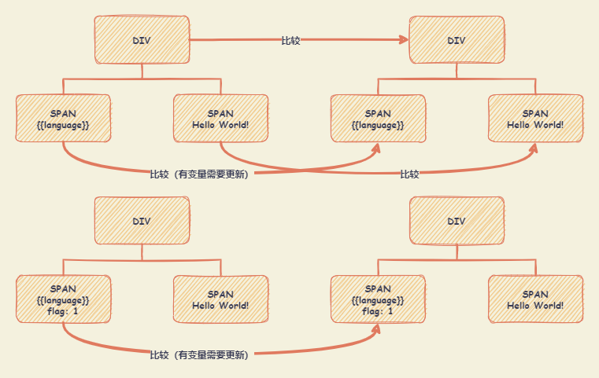

# Vue3 Composition API

## setup

`setup` 函数，接受两个参数。

+ `props` ： 父组件传递的属性。

  `props` 是响应式的，**不能使用 ES6 解构**，它会消除 prop 的响应式。

  如需要解构 prop，可使用 `toRefs` 函数。如果传递的参数为 **可选的 prop** ， `toRefs` 函数不会为该参数创建一个 `ref` ，可使用 `toRef` 代替（eg : `const title = toRef(props, 'title')`）。
+ `context` ： `context` 是一个普通 JavaScript 对象，包含三个属性
  + `attrs` ： Attribute
  + `slots` ： 父组件传递过来的插槽
  + `emit` ： 组件内部需要触发的自定义事件
  + `expose` ： 一个将暴露在公共组件实例上的 property 列表。

    默认情况下，通过 `$refs`、`$parent` 或 `$root` 访问到的公共实例与模板使用的组件内部实例是一样的。`expose` 选项将**限制**公共实例可以访问的 property。Vue 自身定义的 property，比如 `$el` 和 `$parent`，将始终可以被公共实例访问

  注：`attrs` 和 `slots` 是有状态的对象，它们总是会随组件本身的更新而更新。这意味着你应该避免对它们进行解构，并始终以 `attrs.x` 或 `slots.x` 的方式引用 property。

> TIPS
>
> **在 `setup()` 内部，`this` 不是该活跃实例的引用**，因为 `setup()` 是在解析其它组件选项之前被调用的，所以 `setup()` 内部的 `this` 的行为与其它选项中的 `this` 完全不同。这使得 `setup()` 在和其它选项式 API 一起使用时可能会导致混淆。

在生命周期钩子前面加上 `on` 来访问组件的生命周期钩子。在 `setup()` 内部调用生命周期钩子如下：

|    选项式 API     | Hook inside `setup` |
| :---------------: | :-----------------: |
|  `beforeCreate`   |     Not needed*     |
|     `created`     |     Not needed*     |
|   `beforeMount`   |   `onBeforeMount`   |
|     `mounted`     |     `onMounted`     |
|  `beforeUpdate`   |  `onBeforeUpdate`   |
|     `updated`     |     `onUpdated`     |
|  `beforeUnmount`  |  `onBeforeUnmount`  |
|    `unmounted`    |    `onUnmounted`    |
|  `errorCaptured`  |  `onErrorCaptured`  |
|  `renderTracked`  |  `onRenderTracked`  |
| `renderTriggered` | `onRenderTriggered` |

``` vue
<script setup>
import { ref, toRef, toRefs, useSlots, useAttrs } from 'vue';

const props = defineProps({
  title: String,
  desc: String,
  msg: String,
});
const emit = defineEmits(['change']);

onMounted(() => {
  console.log('Component is mounted!')
})

const { title, desc, msg } = toRefs(props);
console.log('title: ', title.value);
console.log('desc: ', desc.value);

// Attribute (非响应式对象，等同于 $attrs)
const attrs = useAttrs();
console.log('attrs: ', attrs);

// 插槽 (非响应式对象，等同于 $slots)
const slots = useSlots();
console.log('slots: ', slots);

const count = ref(10);
const onBtnClick = () => {
  count.value++;
  // 触发事件 (方法，等同于 $emit)
  emit('change', count.value);
};

// 暴露公共 property (函数)
defineExpose({ count });
</script>

<template>
  <h1>{{ msg }}</h1>
  <button type="button" @click="onBtnClick">count is: {{ count }}</button>
</template>
```

## 响应性 API

### 核心函数

+ `ref()` ： 接受一个值，将其用作内部值来返回一个响应式的、可更改的 `ref` 对象。只有一个属性 `.value` 用来指向内部的值。
  + 将一个对象赋值给 `ref`，这个对象将通过 `reactive()` 转为具有深层次响应性的对象。也意味着如果对象中包含了嵌套的 `ref`，它们将被深层地解包。
  + 在模板中引入 `ref` 的值，Vue **会自动解包**。
+ `reactive()` ： 返回一个对象的响应式代理。传入类型必须是 **对象或者数组**。
  + `reactive()` 响应式对象可以深层地 **解包** 任何为 `ref` 的属性，同时保持响应性。
  + 当访问到某个响应式数组或 `Map` 原生集合类型中为 `ref` 的元素时， **不会执行** `ref` 的解包。
  + 返回的对象以及其中嵌套的对象都会通过 `ES Proxy` 包裹，因此 **不等于** 源对象，建议只使用响应式代理。
  + 只需要保留对对象 **顶层次** 访问的响应性，可使用 `shallowReactive()` 作替代
  + 将一个 `ref` 赋值给为一个 `reactive()` 属性时，该 `ref` 会被自动解包
+ `readonly()` ： 接受一个对象（不论是响应式还是一般的）或是一个 `ref`，返回一个原值的只读代理。
  + 一个只读的代理是深层生效的，对 **任何内部层级** 的属性的访问都是 **只读** 的。
  + 与 `reactive()` 有相同的 `ref` **解包** 行为，而解包得的值也同样是 **只读** 的。
  + 需要 **避免** 深层级的转换行为，可使用 `shallowReadonly()` 作替代。

``` javascript
// ========== reactive() ==========

const count = ref(1);
const obj = reactive({ count });

// `reactive()` 响应式对象可以深层地 **解包** 任何为 `ref` 的属性，同时保持响应性
console.log(obj.count === count.value); // true

count.value++; // 会更新 `obj.count`
console.log(count.value); // 2
console.log(obj.count); // 2

// ========== reactive() ==========
// 当访问到某个响应式数组或 `Map` 原生集合类型中为 `ref` 的元素时， **不会执行** `ref` 的解包。

const books = reactive([ref('Vue 3 Guide')]);
console.log(books[0].value); // 需要使用 .value

const map = reactive(new Map([['count', ref(0)]]));
console.log(map.get('count').value); // 需要使用 .value

// ========== reactive() ==========

const count = ref(1);
const obj = reactive({});

// 将一个 `ref` 赋值给为一个 `reactive()` 属性时，该 `ref` 会被自动解包
obj.count = count;
console.log(obj.count); // 1
console.log(obj.count === count.value); // true

// ========== readonly() ==========

const original = reactive({ count: 0 });
const copy = readonly(original);

original.count++; // 更改源属性会触发依赖其只读副本的侦听器
copy.count++; // warning! （更改该只读副本将会失败，并会得到一个警告）
```

### 工具函数

+ `unref()` : 若参数值是一个 `ref` ，则取出内部的值，否则返回参数本身。 `val = isRef(val) ? val.value : val` 的语法糖。
+ `toRef()` ： 可以通过一个响应式对象的属性来创建一个 `ref`。
  + 创建得到的 `ref` **与源属性保持同步**（对源属性的更改将会同步更新 `ref`，反过来该 `ref` 的变动也会影响源属性）。
  + 在源属性已经不存在的情况下，也会返回一个可用的 `ref`。可用于处理**可选 `prop`** 。
+ `toRefs()` ： 将一个响应式对象 **转为一个简单对象** ，其中每个属性都是一个指向**源对象**相应属性的 `ref`，每个独立的 `ref` 都是由 `toRef()` 创建的。
  + 从一个组合式函数中返回响应式对象，需要解构或展开，而又不想丢失响应性时，可使用 `toRefs` 。
  + 如果要基于一个可能还不存在的属性创建，使用 `toRef` 来替代。
+ `isRef()` ： 检查某个值是否为 `ref`。
+ `isProxy()` ： 检查该对象是否为由 `reactive()`、`readonly()`、`shallowReactive()` 或 `shallowReadonly()` 创建的代理。
+ `isReactive()` ： 检查该对象是否为由 `reactive()` 或 `shallowReactive()` 创建的代理。
+ `isReadonly()` ： 检查该对象是否为由 `readonly()` 或 `shallowReadonly()` 创建的代理。

``` javascript
// ========== toRef() ==========
// 创建得到的 `ref` **与源属性保持同步**（对源属性的更改将会同步更新 `ref`，反过来该 `ref` 的变动也会影响源属性）
const state = reactive({ foo: 1, bar: 2 });
const fooRef = toRef(state, 'foo');
// const fooRef = ref(state.foo) // 这个 ref 不会 和 state.foo 保持同步

fooRef.value++; // 更改该 ref 会更新源属性
console.log(state.foo); // 2

state.foo++; // 更改源属性也会更新该 ref
console.log(fooRef.value); // 3

// ========== toRefs() ==========
const state = reactive({ foo: 1, bar: 2 });
const stateAsRefs = toRefs(state);
const ageRef = toRef(state, 'age');

// 这个 ref 和源属性已经“链接上了”
state.foo++;
console.log(stateAsRefs.foo.value); // 2

stateAsRefs.foo.value++;
console.log(state.foo); // 3
```

### 进阶函数

+ `shallowRef()` ： `ref()` 的浅层作用形式。
  + 浅层 `ref` 的内部值将会原样存储和暴露，并且不会被深层递归地转为响应式。只有对 `.value` 的访问是响应式的。
  + 常常用于对大型数据结构的性能优化或是与外部的状态管理系统集成。
+ `shallowReactive()` ： `reactive()` 的浅层作用形式。
  + 浅层响应式对象里只有根级别的属性是响应式的。属性的值会被原样存储和暴露，意味着属性为 `ref` 的值 **不会** 被自动解包了。
+ `shallowReadonly()` ： `readonly()` 的浅层作用形式。
  + 只有跟根层级的属性变为了只读。属性值都会被原样存储和暴露，意味着值为 `ref` 的属性 **不会** 被自动解包了。
+ `triggerRef()` ： 强制触发依赖于一个 `浅层 ref` 的副作用，常用在对浅层 `ref` 的内部值做了变更之后。
+ `customRef()` ： 创建一个自定义的 `ref`，显式声明对其依赖追踪和更新触发的控制方式。
  + `customRef()` 预期接受一个工厂函数，这个工厂函数接受 `track` 和 `trigger` 两个函数作为参数，并应该返回一个带 `get` 和 `set` 方法的对象。
  + 一般来说，`track()` 应该在 `get()` 方法中调用，而 `trigger()` 应该在 `set()` 中调用。
+ `toRaw()` ： 根据一个 Vue 创建的代理返回其原始对象。
  + 可以返回由 `reactive()`、`readonly()`、`shallowReactive()` 或者 `shallowReadonly()` 创建的代理对应的源对象
  + 可以用于临时读取而不引起代理访问/跟踪开销，或是写入而不触发更改的特殊方法
+ `markRaw()` ： 将一个对象标记为不可被转为代理的对象。返回也是该对象。

``` javascript
// ========== shallowRef() ==========
const state = shallowRef({ count: 1 });

state.value.count = 2; // 不会触发更改，也不会触发页面更新
state.value = { count: 2 }; // 会触发更改，同时会触发页面更新

// ========== shallowReactive() ==========

const state = shallowReactive({
  foo: 1,
  nested: { bar: 2 },
});

state.foo++; // 更改状态自身的属性是响应式的，同时会触发页面更新
isReactive(state.nested); // false - 嵌套对象不会被转为响应式
state.nested.bar++; // 不是响应式的，也不会触发页面更新

// ========== shallowReadonly() ==========

const state = shallowReadonly({
  foo: 1,
  nested: { bar: 2 },
});

state.foo++ // 更改状态自身的属性会失败
isReadonly(state.nested) // false
state.nested.bar++ // 可以更改下层嵌套对象

// ========== triggerRef() ==========

const shallow = shallowRef({
  greet: 'Hello, world'
})

shallow.value.greet = 'Hello, universe' // 不会触发界面更新，因为这个 ref 是浅层的
triggerRef(shallow) // 使用 triggerRef 后，会触发页面的更新

// ========== customRef() ==========

export function useDebouncedRef(value, delay = 200) {
  let timeout;
  return customRef((track, trigger) => {
    return {
      get() {
        track(); // 通知 Vue 追踪变化该数据变化
        return value;
      },
      set(newValue) {
        clearTimeout(timeout);
        timeout = setTimeout(() => {
          value = newValue;
          trigger(); // 通知 Vue 重新解析模板，更新页面
        }, delay);
      },
    };
  });
}

// ========== toRaw() ==========

const foo = {}
const reactiveFoo = reactive(foo)

console.log(toRaw(reactiveFoo) === foo) // true

// ========== markRaw() ==========
const foo = markRaw({});
console.log(isReactive(reactive(foo))); // false

const bar = reactive({ foo }); // 也适用于嵌套在其他响应性对象
console.log(isReactive(bar.foo)); // false
```

## Vue3 的提升

### diff方法优化：PathFlag(静态标记)

+ Vue2 中的虚拟DOM是进行全量对比
+ Vue3 中新增静态标记(PathFlag)，只对比带有 PathFlag 的节点，并且可以通过 PathFlag 的信息得知当前节点要对比的具体内容



``` javascript
<div>
  <span>{{language}}</span>
  <span>Hello World!</span>
</div>

import { toDisplayString as _toDisplayString, createVNode as _createVNode, openBlock as _openBlock, createBlock as _createBlock } from "vue"
export function render(_ctx, _cache, $props, $setup, $data, $options) {
  return (_openBlock(), _createBlock("div", null, [
    _createVNode("span", null, _toDisplayString(_ctx.language), 1 /* TEXT */),
    _createVNode("span", null, "Hello World!")
  ]))
}
```

``` javascript
export const enum PatchFlags {
  TEXT = 1,                   // 动态文本节点
  CLASS = 1 << 1,             // 2    // 动态 class
  STYLE = 1 << 2,             // 4    // 动态 style
  PROPS = 1 << 3,             // 8    // 动态属性，但不包含类名和样式
  FULL_PROPS = 1 << 4,        // 16   // 具有动态 key 属性，当 key 改变时，需要进行完整的 diff 比较。
  HYDRATE_EVENTS = 1 << 5,    // 32   // 带有监听事件的节点
  STABLE_FRAGMENT = 1 << 6,   // 64   // 一个不会改变子节点顺序的 fragment
  KEYED_FRAGMENT = 1 << 7,    // 128  // 带有 key 属性的 fragment 或部分子字节有 key
  UNKEYED_FRAGMENT = 1 << 8,  // 256  // 子节点没有 key 的 fragment
  NEED_PATCH = 1 << 9,        // 512  // 一个节点只会进行非 props 比较
  DYNAMIC_SLOTS = 1 << 10,    // 1024 // 动态 slot
  HOISTED = -1,               // 特殊标志，负整数表示永远不会用作 diff
  BAIL = -2                   // 特殊标志，指代差异算法
}
```

### hoistStatic(静态提升)

+ Vue2 中无论元素是否参与更新，每次都会重新创建，然后再渲染
+ Vue3 中对不参与更新的元素，会做静态提升，只会被创建一次，在渲染时复用

``` javascript
<div>
  <span>{{language}}</span>
  <span>Hello World!</span>
</div>

// 静态提升之前
import { toDisplayString as _toDisplayString, createVNode as _createVNode, openBlock as _openBlock, createBlock as _createBlock } from "vue"
export function render(_ctx, _cache, $props, $setup, $data, $options) {
  return (_openBlock(), _createBlock("div", null, [
    _createVNode("span", null, _toDisplayString(_ctx.language), 1 /* TEXT */),
    _createVNode("span", null, "Hello World!")
  ]))
}

// 静态提升之后
import { toDisplayString as _toDisplayString, createVNode as _createVNode, openBlock as _openBlock, createBlock as _createBlock } from "vue"
// _hoisted_1 被 PathFlag（静态标记） 为 -1 ：特殊标志，负整数表示永远不会用作 diff
const _hoisted_1 = /*#__PURE__*/_createVNode("span", null, "Hello World!", -1 /* HOISTED */)
export function render(_ctx, _cache, $props, $setup, $data, $options) {
  return (_openBlock(), _createBlock("div", null, [
    _createVNode("span", null, _toDisplayString(_ctx.language), 1 /* TEXT */),
    _hoisted_1
  ]))
}
```

### cacheHandlers(事件侦听器缓存)

默认情况下 `@click` 事件被认为是动态变量，每次更新视图的时候都会追踪它的变化。但正常情况下，`@click` 事件在视图渲染前和渲染后，都是同一个事件，基本上不需要去追踪它的变化，所以直接缓存起来复用即可。

``` javascript
<div>
  <span>{{language}}</span>
  <span @click="handleClick">Hello World!</span>
</div>

// 事件侦听器缓存之前
import { toDisplayString as _toDisplayString, createVNode as _createVNode, openBlock as _openBlock, createBlock as _createBlock } from "vue"
export function render(_ctx, _cache, $props, $setup, $data, $options) {
  return (_openBlock(), _createBlock("div", null, [
    _createVNode("span", null, _toDisplayString(_ctx.language), 1 /* TEXT */),
    // PathFlag（静态标记） 为 8 ：动态属性，但不包含类名和样式
    _createVNode("span", { onClick: _ctx.handleClick }, "Hello World!", 8 /* PROPS */, ["onClick"])
  ]))
}

// 事件侦听器缓存之后
import { toDisplayString as _toDisplayString, createVNode as _createVNode, openBlock as _openBlock, createBlock as _createBlock } from "vue"

export function render(_ctx, _cache, $props, $setup, $data, $options) {
  return (_openBlock(), _createBlock("div", null, [
    _createVNode("span", null, _toDisplayString(_ctx.language), 1 /* TEXT */),
    // 开启 cacheHandlers(事件侦听器缓存) 之后，编译后没有 PathFlag（静态标记），表明 span标签 不再被追踪比较变化
    _createVNode("span", {
      onClick: _cache[1] || (_cache[1] = (...args) => (_ctx.handleClick && _ctx.handleClick(...args)))
    }, "Hello World!")
  ]))
}
```

### SSR 服务端渲染

当有大量静态的内容时候，这些内容会被当做纯字符串推进一个 `buffer` 里面，即使存在动态的绑定，会通过模板插值嵌入进去。这样会比通过虚拟DOM来渲染更快。

``` javascript
<div>
  <span>{{language}}</span>
  <span @click="handleClick">Hello World!</span>
  <span>HTML</span>
  <span>CSS</span>
  <span>JavaScript</span>
  <span>Vue</span>
  <span>React</span>
  <span>HTML</span>
  <span>CSS</span>
  <span>JavaScript</span>
  <span>Vue</span>
  <span>React</span>
</div>

import { mergeProps as _mergeProps } from "vue"
import { ssrRenderAttrs as _ssrRenderAttrs, ssrInterpolate as _ssrInterpolate } from "@vue/server-renderer"
// SSR渲染
export function ssrRender(_ctx, _push, _parent, _attrs, $props, $setup, $data, $options) {
  const _cssVars = { style: { color: _ctx.color }}
  _push(`<div${
    _ssrRenderAttrs(_mergeProps(_attrs, _cssVars))
  }><span>${
    _ssrInterpolate(_ctx.language)
  }</span><span>Hello World!</span><span>HTML</span><span>CSS</span><span>JavaScript</span><span>Vue</span><span>React</span><span>HTML</span><span>CSS</span><span>JavaScript</span><span>Vue</span><span>React</span></div>`)
}
```

### StaticNode(静态节点)

当静态内容大到一定量级时候，会用 `_createStaticVNode` 方法在客户端去生成一个 `static node`，这些静态node，会被直接 innerHtml，就不需要创建对象，然后根据对象渲染。

``` javascript
<div>
  <span>{{language}}</span>
  <span @click="handleClick">Hello World!</span>
  <span>HTML</span>
  <span>CSS</span>
  <span>JavaScript</span>
  <span>Vue</span>
  <span>React</span>
  <span>HTML</span>
  <span>CSS</span>
  <span>JavaScript</span>
  <span>Vue</span>
  <span>React</span>
</div>

import { toDisplayString as _toDisplayString, createVNode as _createVNode, createStaticVNode as _createStaticVNode, openBlock as _openBlock, createBlock as _createBlock } from "vue"
// StaticNode(静态节点)
const _hoisted_1 = /*#__PURE__*/_createStaticVNode("<span>HTML</span><span>CSS</span><span>JavaScript</span><span>Vue</span><span>React</span><span>HTML</span><span>CSS</span><span>JavaScript</span><span>Vue</span><span>React</span>", 10)
export function render(_ctx, _cache, $props, $setup, $data, $options) {
  return (_openBlock(), _createBlock("div", null, [
    _createVNode("span", null, _toDisplayString(_ctx.language), 1 /* TEXT */),
    _createVNode("span", {
      onClick: _cache[1] || (_cache[1] = (...args) => (_ctx.handleClick && _ctx.handleClick(...args)))
    }, "Hello World!"),
    _hoisted_1
  ]))
}
```
