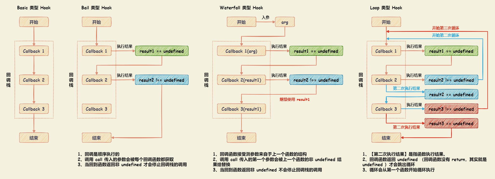

# Webpack 原理

Webpack 本质上是一种事件流机制。通过事件流将各种插件串联起来，最终完成 Webpack 的全流程。实现事件流机制的核心是 `Tapable` 模块。Webpack 负责编译的 `Compiler` 和创建 Bundle 的 `Compilation` 都是继承自 `Tapable` 。

## Tapable

`Tapable` 和 Node.js 中的 `EventEmitter` 类似，包括多种类型，通过事件的注册和监听，触发 Webpack 生命周期中的函数方法。

``` javascript
const {
  SyncHook,
  SyncBailHook,
  SyncWaterfallHook,
  SyncLoopHook,
  AsyncParallelHook,
  AsyncParallelBailHook,
  AsyncSeriesHook,
  AsyncSeriesBailHook,
  AsyncSeriesWaterfallHook,
} = require('tapable');
```

### Hook 同步与异步分类

Hook 类型可以分为同步（Sync）和异步（Async），异步又分为并行和串行

+ 同步 Hook
  + `SyncHook` - 串行
  + `SyncBailHook` - 串行
  + `SyncWaterfallHook` - 串行
  + `SyncLoopHook` - 循环
+ 异步 Hook
  + `AsyncSeries*` 串行
    + `AsyncSeriesHook`
    + `AsyncSeriesBailHook`
    + `AsyncSeriesWaterfallHook`
  + `AsyncParallel*` 并行
    + `AsyncParallelHook`
    + `AsyncParallelBailHook`

### Hook 使用方式分类

+ Basic ： 基础类型，不关心函数的返回值，不根据返回值做事情，会一直执行到底。包括 `SyncHook` 、 `AsyncParallelHook` 、 `AsyncSeriesHook` 。
+ Bail ： 按回调栈顺序依次执行回调，但是如果其中一个回调函数返回结果 `result !== undefined` ，则退出回调栈调。包括 `SyncBailHook` 、`AsyncSeriesBailHook` 、`AsyncParallelBailHook` 。
+ Waterfal ： 瀑布式，如果上一个回调函数的结果 `result !== undefined`，则会被作为下一个回调函数的第一个参数。包括 `SyncWaterfallHook` 、 `AsyncSeriesWaterfallHook` 。
+ Loop ： 循环类型，如果该监听函数返回 `true` ，则这个监听函数会反复执行；如果返回 `undefined` 则退出循环。包括 `SyncLoopHook` 。



### Tapable 原理解析

Tapable 的执行流程可以分为四步：

1. 使用 `tap*` 对事件进行注册绑定。根据类型不同，提供三种绑定的方式：`tap` 、 `tapPromise` 、 `tapAsync` ，其中 `tapPromise` 、 `tapAsync` 为异步类 Hook 的绑定方法；
2. 使用 `call*` 对事件进行触发，根据类型不同，也提供了三种触发的方式： `call` 、 `promise` 、 `callAsync` ；
3. 生成对应类型的代码片段（要执行的代码实际是拼字符串拼出来的）；
4. 生成第三步生成的代码片段。

## Compiler 和 Compilation

`Compiler` 和 `Compilation` 都是继承自 `Tapable`

+ `Compiler` ： 每个 Webpack 的配置，对应一个 `Compiler` 对象，记录着整个 Webpack 的生命周期。webpack 启动后会创建 `compiler` 对象，该对象一直存活知道结束退出。
+ `Compilation` ： 在构建的过程中，每次构建都会产生一次 `Compilation`， `Compilation` 是构建周期的产物。

### Compiler

整个 `Compiler` 完整地展现了 Webpack 的构建流程：

+ 准备阶段 ： `make` 之前做的事情都属于准备阶段，这阶段的 callback 入参以 `compiler` 为主；
+ 编译阶段 ： 该阶段以 `compilation` 的钩子为主，callback 入参以 `compilation` 为主；
+ 产出阶段 ： 该阶段从 `compilation` 开始，最后回到 `Compiler` 钩子上，callback 传入参数是跟结果相关的数据，包括 `stats`、`error`。

#### Compiler 钩子

|        钩子名        |   Tapable 类型    | 触发时机                                                   |      传入 callback 的参数      |
| :------------------: | :---------------: | :--------------------------------------------------------- | :----------------------------: |
|     entryOption      |   SyncBailHook    | 在 webpack 中的 entry 配置处理过之后                       |         context，entry         |
|     afterPlugins     |     SyncHook      | 初始化完内置插件之后                                       |            compiler            |
|    afterResolvers    |     SyncHook      | resolver 完成之后（后面解释resolver是什么）                |            compiler            |
|     environment      |     SyncHook      | 准备编译环境，webpack plugins配置初始化完成之后            |            compiler            |
|   afterEnvironment   |     SyncHook      | 编译环境准备好之后                                         |            compiler            |
|      beforeRun       |  AsyncSeriesHook  | 开始正式编译之前                                           |            compiler            |
|         run          |  AsyncSeriesHook  | 开始编译之后，读取 records 之前；监听模式触发watch-run     |            compiler            |
|       watchRun       |  AsyncSeriesHook  | 监听模式下，一个新的编译触发之后                           |            compiler            |
| normalModuleFactory  |     SyncHook      | NormalModuleFactory 创建之后                               |    normalModuleFactory实例     |
| contextModuleFactory |     SyncHook      | ContextModuleFactory 创建之后                              |    contextModuleFactory实例    |
|    beforeCompile     |  AsyncSeriesHook  | compilation 实例化需要的参数创建完毕之后                   |       compilationParams        |
|       compile        |     SyncHook      | 一次 compilation 编译创建之前                              |       compilationParams        |
|   thisCompilation    |     SyncHook      | 触发 compilation 事件之前执行compilation，                 |       compilationParams        |
|     compilation      |     SyncHook      | compilation创建成功之后                                    | compilation，compilationParams |
|         make         | AsyncParallelHook | 完成编译之前                                               |          compilation           |
|     afterCompile     |  AsyncSeriesHook  | 完成编译和封存（seal）编译产出之后                         |          compilation           |
|      shouldEmit      |   SyncBailHook    | 发布构建后资源之前触发，回调必须返回true/false，true则继续 |          compilation           |
|         emit         |  AsyncSeriesHook  | 生成资源到 output 目录之前                                 |          compilation           |
|      afterEmit       |  AsyncSeriesHook  | 生成资源到 output 目录之后                                 |          compilation           |
|         done         |  AsyncSeriesHook  | compilation完成之后                                        |             stats              |
|        failed        |     SyncHook      | compilation失败                                            |             error              |
|       invalid        |     SyncHook      | 监听模式下，编译无效时                                     |      fileName，changeTime      |
|      watchClose      |     SyncHook      | 监听模式停止                                               |               无               |

### Compilation

在 `Compilation` 阶段，模块会被 **加载(loaded)** 、 **封存(sealed)** 、 **优化(optimized)** 、 **分块(chunked)** 、 **哈希(hashed)** 和 **重新创建(restored)**。

`Compilation` 对象包含了当前的模块资源、编译生成资源、变化的文件等。当 Webpack 以监听（watch）模式运行时，每当检测到一个文件变化，一次新的 `Compilation` 将被创建。`Compilation` 对象也提供了很多事件回调供插件做扩展，通过 `Compilation` 也能读取到 `Compiler` 对象。

在 `Compilation` 中处理的对象分别是 `module`、`chunk`、`asset`，由 `modules` 组成`chunks`，由 `chunks` 生成 `assets`，处理顺序是：**`module` → `modules` → `chunks` → `assets`**（先从单个 `module` 开始处理，查找依赖关系，最后完成单个 `module` `处理，完成全部modules` 之后，开始 `chunks` 阶段处理，最后在根据优化配置，按需生成 `assets`）。

#### Compilation 钩子

|          钩子名           |   Tapable 类型    | 触发时机                                                                      |            传入 callback 的参数            |
| :-----------------------: | :---------------: | :---------------------------------------------------------------------------- | :----------------------------------------: |
|        buildModule        |     SyncHook      | 在模块构建开始之前触发                                                        |                   module                   |
|       rebuildModule       |     SyncHook      | 在重新构建一个模块之前触发                                                    |                   module                   |
|       failedModule        |     SyncHook      | 模块构建失败时执行                                                            |               module，error                |
|       succeedModule       |     SyncHook      | 模块构建成功时执行                                                            |                   module                   |
|       finishModules       |     SyncHook      | 所有模块都完成构建                                                            |                   module                   |
|  finishRebuildingModule   |     SyncHook      | 一个模块完成重新构建                                                          |                   module                   |
|           seal            |     SyncHook      | **★编译（compilation）停止接收新模块时触发**                                  |                   module                   |
|          unseal           |     SyncHook      | 编译（compilation）开始接收新模块时触发                                       |                   module                   |
|   optimizeDependencies    |   SyncBailHook    | 依赖优化开始时触发                                                            |                  modules                   |
| afterOptimizeDependencies |     SyncHook      | 依赖优化结束时触发                                                            |                  modules                   |
|         optimize          |     SyncHook      | **★优化阶段开始时触发**                                                       |                  modules                   |
|      optimizeModules      |   SyncBailHook    | **★模块的优化**                                                               |                  modules                   |
|   afterOptimizeModules    |     SyncHook      | 模块优化结束时触发                                                            |                  modules                   |
|      optimizeChunks       |   SyncBailHook    | **★优化 chunks**                                                              |                   chunks                   |
|    afterOptimizeChunks    |     SyncHook      | chunk 优化完成之后触发                                                        |                   chunks                   |
|       optimizeTree        |  AsyncSeriesHook  | 异步优化依赖树                                                                |              chunks，modules               |
|     afterOptimizeTree     |     SyncHook      | 异步优化依赖树完成时                                                          |              chunks，modules               |
|   optimizeChunkModules    |   SyncBailHook    | 优化单个chunk中的 modules 开始                                                |                   chunks                   |
| afterOptimizeChunkModules |     SyncHook      | 优化单个chunk中的 modules 结束                                                |                   chunks                   |
|       shouldRecord        |     SyncHook      |                                                                               |                   chunks                   |
|       reviveModules       |     SyncHook      | 从 records 中恢复模块信息                                                     |              modules，records              |
|    optimizeModuleOrder    |     SyncHook      | 将模块从最重要的到最不重要的进行排序                                          |                   chunks                   |
|      beforeModuleIds      |     SyncHook      | 处理 modulesId 之前                                                           |                  modules                   |
|         moduleIds         |     SyncHook      | 处理 modulesId                                                                |                  modules                   |
|     optimizeModuleIds     |     SyncHook      | 优化 modulesId                                                                |                   chunks                   |
|  afterOptimizeModuleIds   |     SyncHook      | 优化 modulesId之后                                                            |                   chunks                   |
|       reviveChunks        |     SyncHook      | 从 records 中恢复 chunk 信息                                                  |              modules，records              |
|    optimizeChunkOrder     |     SyncHook      | 将 chunk 从最重要的到最不重要的进行排序                                       |                   chunks                   |
|  beforeOptimizeChunkIds   |     SyncHook      | chunk id 优化之前触发                                                         |                   chunks                   |
|     optimizeChunkIds      |     SyncHook      | chunk id 优化开始触发                                                         |                   chunks                   |
|   afterOptimizeChunkIds   |     SyncHook      | chunk id 优化结束触发                                                         |                   chunks                   |
|       recordModules       |     SyncHook      | 将模块信息存储到 records                                                      |              modules，records              |
|       recordChunks        |     SyncHook      | 将 chunk 信息存储到 records                                                   |              chunks，records               |
|        beforeHash         |     SyncHook      | 在编译被哈希（hashed）之前                                                    |                     -                      |
|         afterHash         |     SyncHook      | 在编译被哈希（hashed）之后                                                    |                     -                      |
|          record           |     SyncHook      | 将 compilation 相关信息存储到 records 中                                      |            compilation，records            |
|     beforeChunkAssets     |     SyncHook      | 在创建 chunk 资源（asset）之前                                                |                   chunks                   |
|   additionalChunkAssets   |     SyncHook      | 为 chunk 创建附加资源（asset）                                                |                   chunks                   |
|     additionalAssets      |  AsyncSeriesHook  | **★为编译（compilation）创建附加资源（asset）**                               |                     -                      |
|    optimizeChunkAssets    |  AsyncSeriesHook  | **★优化所有 chunk 资源（asset）**                                             |                   chunks                   |
| afterOptimizeChunkAssets  |     SyncHook      | chunk 资源（asset）已经被优化                                                 |                   chunks                   |
|      optimizeAssets       |  AsyncSeriesHook  | **★优化存储在 compilation.assets 中的所有资源（asset）**                      |                   assets                   |
|    afterOptimizeAssets    |     SyncHook      | 优化compilation.assets 中的所有资源（asset）之后                              |                   assets                   |
|        moduleAsset        |     SyncHook      | 一个模块中的一个资源被添加到编译中                                            |              module，filename              |
|        chunkAsset         |     SyncHook      | 一个 chunk 中的一个资源被添加到编译中                                         |              chunk，filename               |
|         assetPath         | SyncWaterfallHook | asset 路径确认之后                                                            |               filename，data               |
|       childCompiler       |     SyncHook      | 子编译（compiler）触发                                                        | childCompiler，compilerName，compilerIndex |
|    normalModuleLoader     |     SyncHook      | **★普通模块 loader，真正（一个接一个地）加载模块图（graph）中所有模块的函数** |           loaderContext，module            |

#### Stats 对象

在 Webpack 的回调函数中会得到 `stats` 对象。这个对象实际来自于 `Compilation.getStats()`，返回的是主要含有 `modules`、`chunks` 和 `assets` 三个属性值的对象。

+ `modules` ：记录了所有解析后的模块。在每个 `module` 中，包含如下信息：
  + 基本信息：包括最基本的内容、大小、`id`；
  + 依赖关系：`module.reasons` 对象描述了这个模块被加入依赖图表的理由，包含了引入的方式、引入的 `module` 信息及其对应代码在第几行第几列等，可以通过这个计算出 `module` 之间的依赖关系图表（`graph`）；
  + `chunks` 和 `assets` 关系：`module.chunks` 和 `module.assets` 包含到 `chunks` 和 `assets` 中的对应 `id` 等；
  + 被 webpack 处理的后的信息：包含 `module.failed`、`module.errors`、`module.warnings`等。
+ `chunks` ：记录了所有 `chunk`；在每个 `chunk` 中，包含如下信息：
  + 基本信息：包括最基本的内容、大小、`id`；
  + 来源：`chunk.origins` 对象描述了这个模块被加入的理由，包含了引入的方式、引入的 `module` 信息及其对应代码在第几行第几列等，可以通过这个计算出 `module` 之间的依赖关系图表（`graph`）；
  + 引用关系：`chunk.parents` 和 `chunk.children` 被引用和引用的 `ids`；
  + 包含和被包含：`chunk.files` 和 `chunk.modules` 包含到 `assets` 和自己包含 `modules` 中信息等。
+ `assets` ：记录了所有要生成的文件。

  ``` javascript
  {
    "chunkNames": [], // 这个 asset 包含的 chunk
    "chunks": [10, 6], // 这个 asset 包含的 chunk 的 id
    "emitted": true, // 表示这个 asset 是否会让它输出到 output 目录
    "name": "10.web.js", // 输出的文件名
    "size": 1058 // 文件的大小
  }
  ```

`Stats` 对象本质上来自于 `lib/Stats.js` 的类实例，常用的方法：

+ `stats.hasWarnings()`
+ `stats.hasErrors()`
+ `stats.toJson()`
+ `stats.toString()`

## Webpack 工作流程

1. 初始化阶段：
   + **初始化参数**：从配置文件、 配置对象、Shell 参数中读取，与默认配置结合得出最终的参数
   + **创建编译器对象**：用上一步得到的参数创建 `Compiler` 对象
   + **初始化编译环境**：包括注入内置插件、注册各种模块工厂、初始化 `RuleSet` 集合、加载配置的插件等
   + **开始编译**：执行 `compiler` 对象的 `run` 方法
   + **确定入口**：根据配置中的 `entry` 找出所有的入口文件，调用 `compilition.addEntry` 将入口文件转换为 `dependence` 对象（依赖对象，webpack 基于该类型记录模块间依赖关系）
2. 构建阶段：
   + **编译模块(make)**：根据 `entry` 对应的 `dependence` 创建 `module` 对象，调用 `loader` 将模块转译为标准 JS 内容，调用 JS 解释器将内容转换为 `AST` 对象，从中找出该模块依赖的模块，再 递归 本步骤直到所有入口依赖的文件都经过了本步骤的处理
   + **完成模块编译**：上一步递归处理所有能触达到的模块后，得到了每个模块被翻译后的内容以及它们之间的 依赖关系图
3. 生成阶段：
   + **输出资源(seal)**：根据入口和模块之间的依赖关系，组装成一个个包含多个模块的 `Chunk`，再把每个 `Chunk` 转换成一个单独的文件加入到输出列表，这步是可以修改输出内容的最后机会
   + **写入文件系统(emitAssets)**：在确定好输出内容后，根据配置确定输出的路径和文件名，把文件内容写入到文件系统


1. 初始化阶段
   + 将 `process.args + webpack.config.js` 合并成用户配置
   + 调用 `validateSchema` 校验配置
   + 调用 `getNormalizedWebpackOptions + applyWebpackOptionsBaseDefaults` 合并出最终配置
   + 创建 `compiler` 对象
   + 遍历用户定义的 `plugins` 集合，执行插件的 `apply` 方法
   + 调用 `new WebpackOptionsApply().process` 方法，加载各种内置插件

      主要逻辑集中在 `WebpackOptionsApply` 类，webpack 内置了数百个插件，这些插件并不需要我们手动配置，`WebpackOptionsApply` 会在初始化阶段根据配置内容动态注入对应的插件，包括：

     + 注入 `EntryOptionPlugin` 插件，处理 `entry` 配置
     + 根据 `devtool` 值判断后续用那个插件处理 `sourcemap`，可选值：`EvalSourceMapDevToolPlugin`、`SourceMapDevToolPlugin`、`EvalDevToolModulePlugin`
     + 注入 `RuntimePlugin` ，用于根据代码内容动态注入 webpack 运行时
   + 启动 webpack ，触发 `lib/webpack.js` 文件中 `createCompiler` 方法
   + `createCompiler` 方法内部调用 `WebpackOptionsApply` 插件
   + `WebpackOptionsApply` 定义在 `lib/WebpackOptionsApply.js` 文件，内部根据 `entry` 配置决定注入 `entry` 相关的插件，包括：`DllEntryPlugin`、`DynamicEntryPlugin`、`EntryPlugin`、`PrefetchPlugin`、`ProgressPlugin`、`ContainerPlugin`
   + `Entry` 相关插件，如 `lib/EntryPlugin.js` 的 `EntryPlugin` 监听 `compiler.make` 钩子
   + `lib/compiler.js` 的 `compile` 函数内调用 `this.hooks.make.callAsync`
   + 触发 `EntryPlugin` 的 `make` 回调，在回调中执行 `compilation.addEntry` 函数
   + `compilation.addEntry` 函数内部经过一坨与主流程无关的 hook 之后，再调用 `handleModuleCreate` 函数，正式开始构建内容
2. 构建阶段
   + 调用 `handleModuleCreate` ，根据文件类型构建 `module` 子类
   + 调用 `loader-runner` 仓库的 `runLoaders` 转译 `module` 内容，通常是从各类资源类型转译为 JavaScript 文本
   + 调用 `acorn` 将 JS 文本解析为 `AST`
   + 遍历 `AST`，触发各种钩子
   + 在 `HarmonyExportDependencyParserPlugin` 插件监听 `exportImportSpecifier` 钩子，解读 JS 文本对应的资源依赖
   + 调用 `module` 对象的 `addDependency` 将依赖对象加入到 `module` 依赖列表中
   + AST 遍历完毕后，调用 `module.handleParseResult` 处理模块依赖
   + 对于 `module` 新增的依赖，调用 `handleModuleCreate` ，控制流回到第一步
   + 所有依赖都解析完毕后，构建阶段结束
3. 生成阶段
   + 构建本次编译的 `ChunkGraph` 对象；
   + 遍历 `compilation.modules` 集合，将 `module` 按 `entry/动态引入` 的规则分配给不同的 Chunk 对象；
   + `compilation.modules` 集合遍历完毕后，得到完整的 `chunks` 集合对象，调用 `createXxxAssets` 方法
   + `createXxxAssets` 遍历 `module/chunk` ，调用 `compilation.emitAssets` 方法将资 `assets` 信息记录到 `compilation.assets` 对象中
   + 触发 `seal` 回调，控制流回到 `compiler` 对象

      这一步的关键逻辑是将 `module` 按规则组织成 `chunks` ，webpack 内置的 `chunk` 封装规则比较简单：

     + `entry` 及 `entry` 触达到的模块，组合成一个 `chunk`
     + 使用动态引入语句引入的模块，各自组合成一个 `chunk`
     + `chunk` 是输出的基本单位，默认情况下这些 `chunks` 与最终输出的资源一一对应，而通过动态引入语句引入的模块，也对应会打包出相应的资源。

## 参考

+ [万字总结 一文吃透 Webpack 核心原理](https://mp.weixin.qq.com/s/SbJNbSVzSPSKBe2YStn2Zw)
+ [Webpack 从零入门到工程化实战](https://www.imooc.com/read/29)
