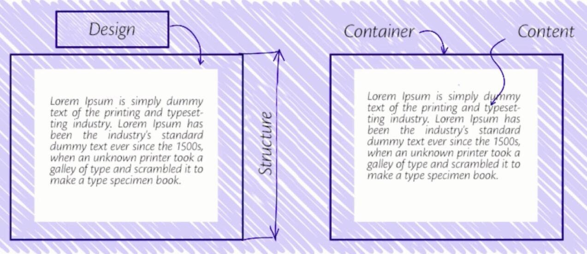
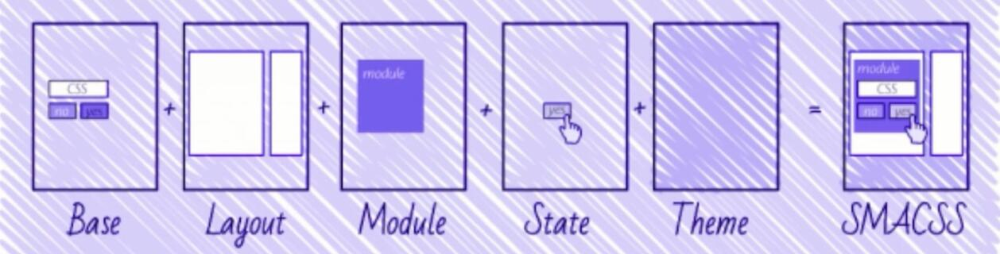
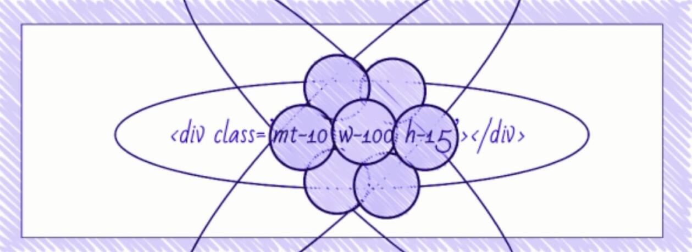
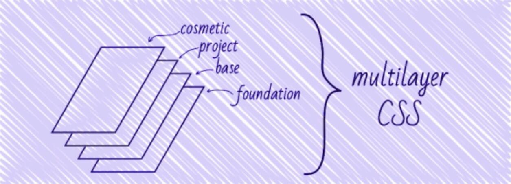
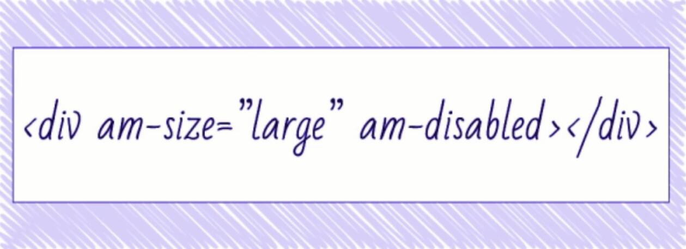
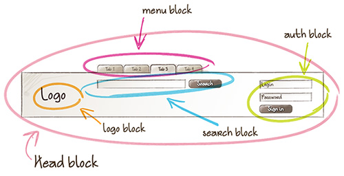
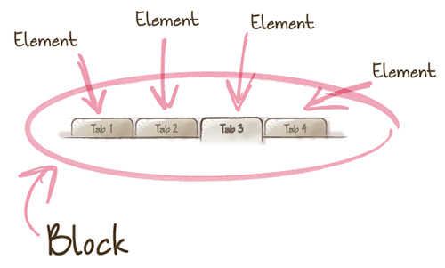

# CSS模块化

## OOCSS（面向对象的CSS）

两大原则：**结构和设计分离，容器和内容分离**。即不要把结构和设计以及内容进行强耦合，而是相互独立，所要达到的目标是更易复用和组合，可以选择使用，选择引用等。

优点：通过复用来减少代码量(DRY原则)

缺点：维护非常困难(复杂)。当你修改某一个具体的元素的样式的时候，大部分情况下，除了修改CSS本身(因为多数的CSS类是通用的)，你还不得不添加更多的标记类(markup)。



## SMACSS（可扩展和模块化结构的 CSS）

- `Base`（基础）：基本规则，为网址的主要元素设置样式，如`body`，`input`，`button`，`ul`，`ol`等。在这一步中，主要使用 HTML标签 和 属性选择器，在特殊情况下，使用CSS类。
- `Layout`（布局）：布局规则，主要是些全局元素，顶部，页脚，边栏等模块的大小。
- `Module`（模块）：模块规则，模块(类似于卡片布局)可以在一个页面中使用多次。对于模块CSS类，不建议使用ID和tag选择器(为了方便重用以及上下文独立)。
- `State`（状态）：状态规则，页面中的某些元素会需要响应不同的状态，比如，可用、不可用、已用、过期、警告等等。这是唯一允许使用 `!important` 的地方。



## Atomic CSS（原子CSS）

基于视觉功能的小的，单用途CSS类。允许您通过重用声明来最大程度地减少您的CSS代码数量，并且也能很轻松的更改模块。

比如：`w-100` 表示宽为 `100px`，`h-15` 表示高为 `15px`。一个 `div` 应用 `w-100` 和 `h-15` 样式，这两个共同组成了div的宽高。

缺点：CSS 类名是属性名称的描述，而不是元素的自然语义。直接在HTML中进行显示设置 Atomic CSS 在各种框架中被用于校正元素样式以及某些层(layers)的其他方法



## MCSS（多层CSS）

建议将样式分成多个部分，每个部分称为层(layers)。

- `第0层或基础`(Zero layer or foundation)：负责重置浏览器样式的代码(如: `reset.css` 或者 `normalize.css`);
- `基层`(Base layer)：包括可重用元素的样式，buttons，input，hints等等；
- `项目层`(Project layer)：包括单独的模块和"上下文" - 根据用户端浏览器或用于浏览的设备，用户权限等对元素的样式进行调整。
- `装饰层`(Cosmetic layer)：使用 OOCSS 风格来书写样式,，对元素外观做微小的调整.。建议仅留下影响外观的风格,，而不能破坏网站的布局(例如颜色和非关键缩进等)。

层与层之间的交互层次是非常重要的：

- 在`基层`(Base layer)中定义中性的样式，并且不影响其它层
- `基层`(Base layer)中的元素只能影响基层的CSS类
- `项目层`(Project layer)中的元素可以影响基层和项目层
- `装饰层`(Cosmetic layer)是以描述性 OOCSS类("atomic"类) 的形式进行设计，不会影响其他CSS代码，而是在标记中有选择的使用



## AMCSS（属性模块CSS）

针对熟悉的CSS设计，比如：`am-size="large"`，`am-disabled`。



## BEM

核心如下：`Block`（块）、`Element`（元素）、`Modifier`（修饰符）。

- `Block` 是页面中独立存在的区块，可以在不同场合下被重用。每个页面都可以看做是多个 `Block` 组成。

  

- `Element` 是构成 `Block` 的元素，只有在对应 `Block` 内部才具有意义，是依赖于 `Block` 的存在。

  

- `Modifier` 是描述 `Block` 或 `Element` 的属性或状态。同一 `Block` 或 `Element` 可以有多个 `Modifier` 。

优点：能够使得我们仅通过类名就知道哪些代码是属于一个模块内，以及在模块中所起的作用。

书写规范：

- `Block` 作为起始开头不同 `Block` 和 `Element` 用 `__` 两个底线区隔开来
- 不同的 `Modifier` 则用 `–` 两个 dash 区隔。至于 `-` 一个 dash 则表示这个 class 不依赖任何 `Block` 或 `Element`，是个独立的存在，例如：`.page-container` 或 `.article-wrapper`。如:

  ```css
  .sidebar {
    .sidebar--left__section {
      .sidebar--left__section--header {}
      .sidebar--left__section--footer {}
    }
  }
  ```

示例

- Block（块）：header，container，menu，checkbox，input
- Element（元素）：menu item，list item，checkbox caption，head title
- Modifier（修饰符）：disabled，highlighted，checked，fixed，size big，color yellow
