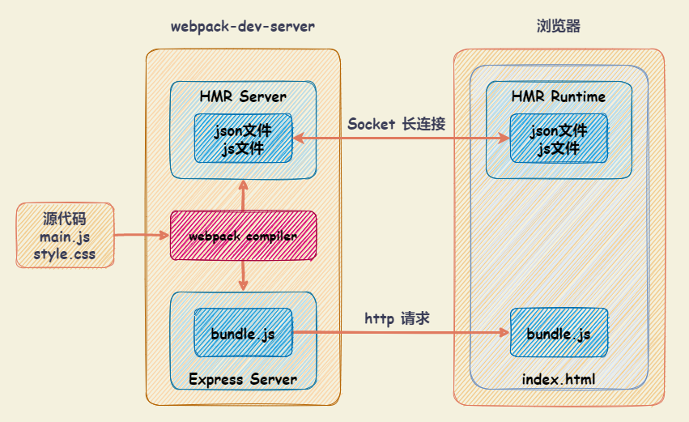

# Webpack Dev Server 本地开发服务

`webpack-dev-server` 是一个基于 Express 的本地开发服务器。它使用 `webpack-dev-middleware` 中间件来为通过 Webpack 打包生成的资源文件提供 Web 服务。它还有一个通过 Socket IO 连接着 `webpack-dev-server` 服务器的小型运行时程序。`webpack-dev-server` 发送关于编译状态的消息到客户端，客户端根据消息作出响应。

## 常用配置

### devServer.publicPath

`devServer.publicPath` ：指定本地服务所在的文件夹。

- 默认值为 `/`，直接访问端口，即可访问其中的资源。（eg: `http://localhost:8080`）
- 设置为 `/abc`，则需要通过 `http://localhost:8080/abc` 才可访问到对应打包后的资源。此时，必须将 `output.publicPath` 也设置为 `/abc`
- 建议 `devServer.publicPath` 与 `output.publicPath` 相同

`output.path` ：webpack 资源输出路径。

`output.publicPath` ：是指定 `index.html` 文件打包引用的一个基本路径。（指定在浏览器中所引用的 **此输出目录对应的公开 URL**。）

- 默认值为 `''`（空字符串）
- 开发过程中，设置为 `/`，则访问资源路径为 `/bundle.js`。浏览器根据 **所在的域名+路径** 请求对应资源
- 如希望在本地直接打开 html 文件来运行，则设置为 `./`，访问资源路径为 `./bundle.js`，可以根据相对路径查找资源。

### devServer.contentBase

`devServer.contentBase` ：如果打包后的资源，又依赖于其他的一些资源，那么就需要指定从哪里来查找。

在 `index.html` 中，依赖 `abc.js` 文件，文件存放于 `public/` 文件夹中。在 `index.html` 中，通过 `<script src="/abc.js"></script>` 引入文件。此时，设置 `devServer.contentBase` 即可。

### devServer.hotOnly

`devServer.hotOnly` ：当代码编译失败时，是否刷新整个页面

- 默认情况下，当代码编译失败修复后，会重新刷新整个页面
- 如果不希望重新刷新整个页面，可以设置 `hotOnly` 为 `true`

### devServer.host

`devServer.host` ：指定 host，默认值为 `localhost`，使用 `0.0.0.0` 可以让局域网内访问。

`localhost` 和 `0.0.0.0` 的区别：

- `localhost` ：本质上是一个域名，通常情况下会被解析成 `127.0.0.1`
- `127.0.0.1` ：回环地址(Loop Back Address)，指主机自己发出去的包，直接被自己接收
  - 正常的数据库包经过：应用层 - 传输层 - 网络层 - 数据链路层 - 物理层
  - 回环地址，是在网络层直接就被获取到了，是不会经过数据链路层和物理层的;
  - 监听 `127.0.0.1` 时，在同一个网段下的主机中，通过 IP地址 是不能访问的
- `0.0.0.0` ：监听 IPV4上所有的地址，再根据端口找到不同的应用程序。
  - 监听 `0.0.0.0` 时，在同一个网段下的主机中，通过 IP地址 是可以访问的

### devServer.port

`devServer.port` ：监听端口号，默认 `8080`

### devServer.open

`devServer.open` ：启动后，是否自动使用浏览器打开首页。默认值为 `false`

### devServer.compress

`devServer.compress` ：是否启用 gzip 压缩。默认值为 `false`

### devServer.proxy

`devServer.proxy` ：设置代理，可用来解决跨域访问的问题。常用设置如下：

- `proxy.target` ：表示的是代理到的目标地址，比如 `/api/moment` 会被代理到 `http://localhost:8888/api/moment`
- `proxy.pathRewrite` ：默认情况下，设置的 `/api` 也会被写入到 URL 中，如果希望删除，可以使用 `pathRewrite`
- `proxy.secure` ：默认情况下，不接受在 HTTPS 上运行且证书无效的后端服务器，如果需要，可以设置为 `false`
- `proxy.changeOrigin` ：表示是否更新代理后请求的 `headers` 中 `host` 地址
- `proxy.bypass` ：如果不想代理所有内容。可以基于函数的返回值绕过代理。
  - 返回 `null` 或 `undefined` ，继续使用代理处理请求
  - 返回 `false` ，为请求产生 404 错误
  - 返回提供服务的路径，而不是继续代理请求

```javascript
module.exports = {
  //...
  devServer: {
    proxy: {
      '/api': {
        target: 'http://localhost:8888',
        pathRewrite: { '^/api': '' },
        secure: false,
        // 对于浏览器请求，想要提供 HTML 页面，但是对于 API 请求，想要代理它。
        bypass: function (req, res, proxyOptions) {
          if (req.headers.accept.indexOf('html') !== -1) {
            console.log('Skipping proxy for browser request.');
            return '/index.html';
          }
        },
      },
    },
  },
};
```

### devServer.historyApiFallback

`devServer.historyApiFallback`：解决 SPA 页面在路由跳转之后，进行页面刷新时，返回 404 的错误。即：配置如果找不到页面就默认显示的页面。

- Boolean 值：默认为 `false` 。设置为 `true`，在刷新时，返回 404 错误时，会自动返回 `index.html` 的内容
- Object 值，可以配置 `rewrites` 属性，通过配置 `from` 来匹配路径，决定要跳转到哪一个页面

  ```javascript
  module.exports = {
    //...
    devServer: {
      historyApiFallback: {
        rewrites: [
          { from: /^\/$/, to: '/views/landing.html' },
          { from: /^\/subpage/, to: '/views/subpage.html' },
          { from: /./, to: '/views/404.html' },
        ],
      },
    },
  };
  ```

注：事实上 `devServer` 中实现 `historyApiFallback` 功能，是通过 `connect-history-api-fallback` 库实现的

### 其他

- `devServer.inline`：模式切换，默认为内联模式，使用 `false` 切换到 `iframe` 模式；
- `devServer.openPage`：启动后，自动使用浏览器打开设置的页面；
- `devServer.overlay`：是否允许使用全屏覆盖的方式显示编译错误，默认不允许；
- `devServer.staticOptions`：为 Expressjs 的 `express.static` 配置参数，参考文档： <http://expressjs.com/en/4x/api.html#express.static>
- `devServer.clientLogLevel`：在 `inline` 模式下用于控制在浏览器中打印的 log 级别，如`error`, `warning`, `info` or `none`；
- `devServer.quiet`：静默模式，设置为 `true` ，则不在控制台输出 log；
- `devServer.noInfo`：不输出启动 log；
- `devServer.lazy`: 不监听文件变化，而是当请求来的时候再重新编译；
- `devServer.watchOptions`：watch 相关配置，可以用于控制间隔多少秒检测文件的变化；
- `devServer.headers`：自定义请求头，例如自定义 `userAgent` 等；
- `devServer.https`：`https` 需要的证书签名等配置。

## HMR（Hot Module Replacement，模块热替换）

`HMR`（Hot Module Replacement，模块热替换） ：在应用程序运行过程中，替换、添加、删除模块，而无需重新刷新整个页面。

Webpack 可以通过配置 `webpack.HotModuleReplacementPlugin` 插件来开启全局的 `HMR` 能力，开启后 `bundle` 文件会变大一些，因为它加入了一个小型的 `HMR` 运行时（runtime），当在运行的时候，Webpack 监听到文件变更并重新打包模块时，HMR 会判断这些模块是否接受 update，若允许，则发信号通知应用进行热替换。

### HMR 配置

```javascript
const webpack = require('webpack');

module.exports = {
  entry: {
    app: './src/index.js',
  },
  devServer: {
    port: 8888,
    hot: true, // 开启 HMR 支持
  },
  plugins: [
    // 添加 HMR plugin
    new webpack.HotModuleReplacementPlugin(),
  ],
};
```

### HRM原理

`webpack-dev-server` 会创建两个服务：提供静态资源的服务（`express`）和 Socket 服务（`net.Socket`）

- `express server` ：负责直接提供静态资源的服务（打包后的资源直接被浏览器请求和解析）
- `HMR Socket Server`，是一个 socket 的长连接：
  - **长连接**的好处是：建立连接后双方可以通信（服务器可以直接发送文件到客户端）；
  - 当服务器监听到对应的模块发生变化时，会生成两个文件 `.json` （manifest文件）和 `.js` 文件（update chunk）；
  - 通过长连接，可以直接将这两个文件主动发送给客户端（浏览器）；
  - 浏览器拿到两个新的文件后，通过 `HMR runtime` 机制，加载这两个文件，并且针对修改的模块进行更新


