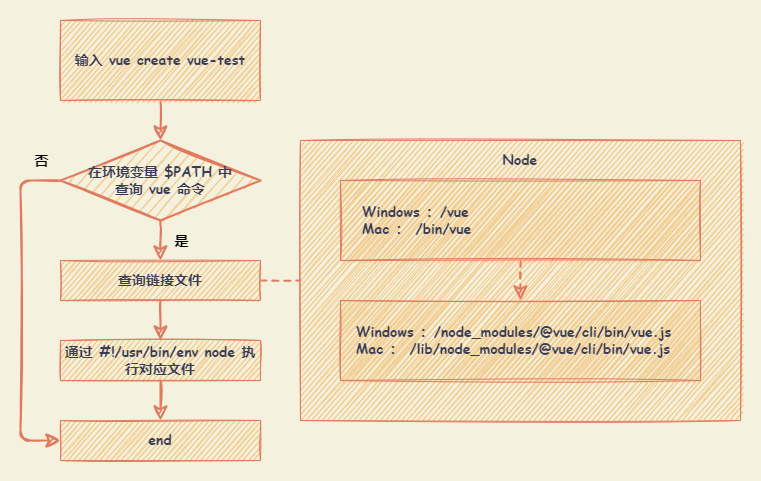

# 脚手架

脚手架本质是操作系统的客户端，用于快速构建项目的工具。

## 环境变量

环境变量（environment variables）一般是指在操作系统中用来指定操作系统运行环境的一些参数，如：临时文件夹位置和系统文件夹位置等。

在 Windows 和 DOS 操作系统中的 path 环境变量，当要求系统运行一个程序而没有告诉它程序所在的完整路径时，系统除了在当前目录下面寻找此程序外，还应到 path 中指定的路径去找。

## 脚手架执行过程

`#!/usr/bin/env node` ： 表示让系统动态的查找 node 执行脚本文件。

- `#!` ： Shebang ，通常在 Unix 系统的基本中第一行开头中出现，用于指明这个脚本文件的解释程序。
- `/usr/bin/env` ： 表示系统可以在 PATH 目录中查找。
