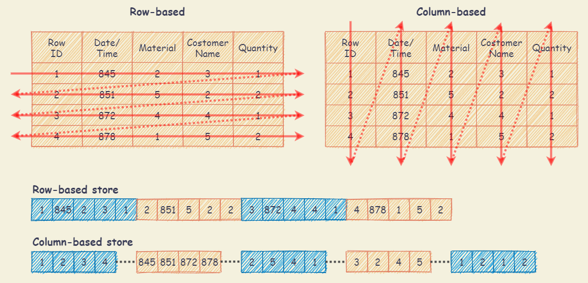
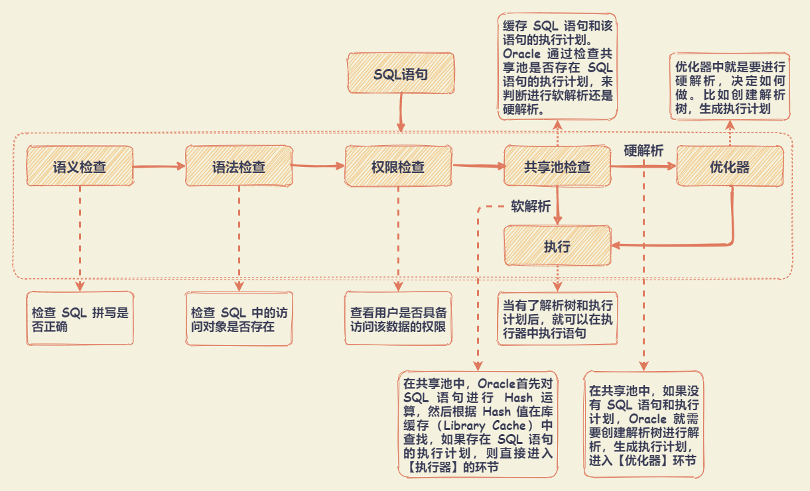
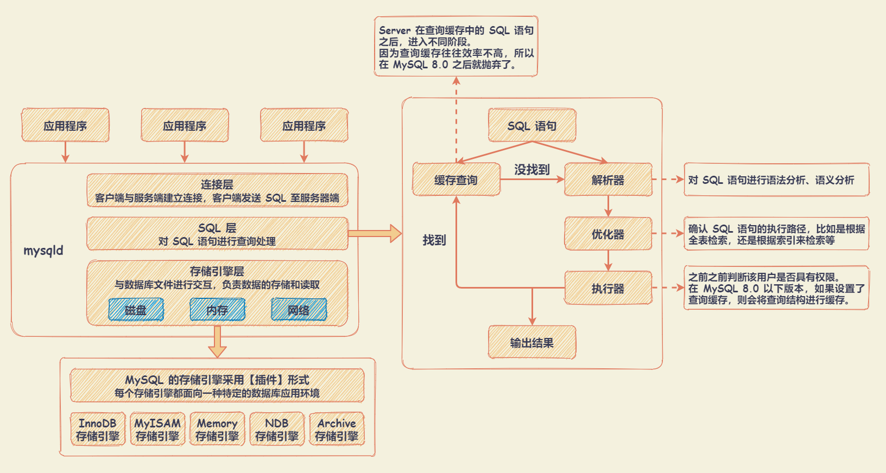

# SQL

## SQL 相关知识

SQL 语言按照功能可划分为：

- `DDL` （Data Definition Language，数据定义语言）：用于定义数据库对象，包括数据库、数据表和列。可创建、删除和修改数据库和表结构。
- `DML` （Data Manipulation Language，数据操作语言）：用于操作和数据库相关的记录，比如增加、删除、修改数据库表中的记录。
- `DCL` （Data Control Language，数据控制语言）：用于定义访问权限和安全级别。
- `DQL` （Data Query Language，数据查询语言）：用于查询记录。

`DB`、 `DBS` 、 `DBMS` 的区别：

- `DB` （DataBase，数据库）：数据库是存储数据的集合。
- `DBS` （DataBase System，数据库系统）：包括了数据库、数据库管理系统以及数据库管理人员（DBA）。
- `DBMS` （DataBase Management System，数据库管理系统）：可对多个数据库进行管理，`DBMS = 多个数据库（DB） + 管理程序`。

关系型数据库与非关系型数据：

- 关系型数据库（RDBMS）：建立在关系模型基础上的数据库。
- 非关系型数据库（NoSQL）：包括键值型数据库、文档型数据库、搜索引擎和列存储等，还包括图形数据库。
  - 键值型数据库：通过 `Key-Value` 键值的方式来存储数据。`Key` 作为唯一的标识符，优点是查找速度快，但是无法像关系型数据库一样使用条件过滤。键值型数据库典型的使用场景是作为内容缓存。Redis 是最流行的键值型数据库。
  - 文档型数据库：用来管理文档，在数据库中文档作为处理信息的基本单位，一个文档就相当于一条记录，MongoDB 是最流行的文档型数据库。
  - 搜索引擎：常见的全文搜索引擎有 Elasticsearch、Splunk 和 Solr。搜索引擎的优势在于采用了全文搜索的技术，核心原理是“倒排索引”。
  - 列式数据库：将数据按照列存储到数据库中，可以大量降低系统的 I/O，适合于分布式文件系统，不足在于功能相对有限。
  - 图形数据库：利用图这种数据结构存储实体（对象）之间的关系。数据模型主要是以节点和边（关系）来实现，特点在于能高效地解决复杂的关系问题。

注：

- 列式数据库：将数据按照列进行存储，因为每列的数据格式是相同的，在存储过程时，可以使用有效的压缩算法进行压缩存储，在读取时，可以只读取需要的列到内存中，可以大量降低系统的 I/O。
- 行式数据库：将一行的数据都串起来进行存储，然后再存储下一行。在读取时，需要将整行数据读入内存中。Oracle、MySQL、SQL Server 等数据库都是采用的行式存储（Row-based）。

## Oracle中的SQL如何执行

共享池是 Oracle 中的术语，包括了库缓存，数据字典缓冲区等。

- 库缓存区主要缓存 SQL 语句和执行计划。决定了 SQL 语句是否需要进行硬解析。
- 数据字典缓冲区存储的是 Oracle 中的对象定义，比如表、视图、索引等对象。当对 SQL 语句进行解析的时候，如果需要相关的数据，会从数据字典缓冲区中提取。

为了提升 SQL 的执行效率，需要尽量避免硬解析，使用软解析，可以通过使用 **绑定变量**（在 SQL 语句中使用变量，通过不同的变量取值来改变 SQL 的执行结果）。可以提升软解析的可能性，不足之处在于可能会导致生成的执行计划不够优化，因此是否需要绑定变量还需要视情况而定。

## MySQL中的SQL如何执行

