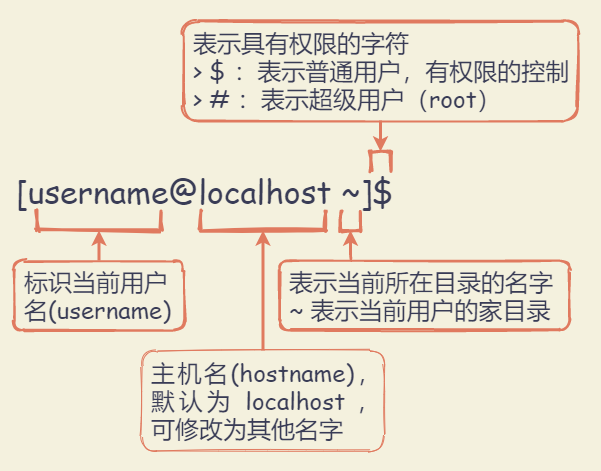
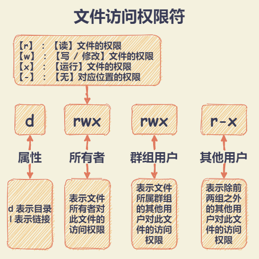
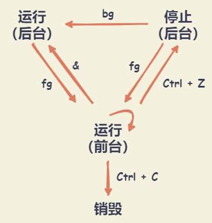

# Linux基础知识和命令

## 基础知识

### 命令行提示符



``` shell
# 获取当前的用户名
[lrh@localhost ~]$ whoami

# 切换为超级用户（root）
# 命令提示符也会随之变化为 [root@localhost ~]#
[lrh@localhost ~]$ sudo su

# 退出 root 身份，或使用 Ctrl + D
[root@localhost ~]# exit
```

### 命令参数

写在命令之后的一些补充选项。命令和参数之间用空格隔开。

+ 短参数：可以用空格隔开多个短参数，多个短参数可以合并在一起。区分大小写。
  + 格式示例：`ls -a`
  + 赋值形式通常为: `command -p 10`
+ 长参数：只能以空格隔开多个长参数。可以组合使用短参数和长参数。
  + 格式示例： `ls --all`
  + 赋值形式通常为: `command --parameter=10`

## 查找命令与命令的历史记录

### 补充命令

+ `Tab键`：可以补充命令、文件名、路径名
+ `↑ 向上键`: 按时间顺序向前查找用过的命令
+ `↓ 向下键`：按时间顺序想后查找用过的命令
+ `Ctrl + R`: 用于查找使用过的命令。输入相关命令，则可进行查找，回车运行
+ `history` - 显示与操纵历史命令
  
  ``` shell
  # 列出之前使用过的所有命令,
  # 使用 [!编号] 的格式重新运行对应编号命令
  [lrh@localhost ~]$ history
  ```

### 实用快捷键

+ `Ctrl + l`：用于清理终端的内容，清屏。同 `clear` 命令
+ `Ctrl + d`：给终端传递 EOF （End Of File, 文件结束符）
+ `Shift + PgUp`：用于向上滚屏，与鼠标的滚轮向上滚屏是一个效果
+ `Shift + PgDn`：用于向下滚屏，与鼠标的滚轮向下滚屏是一个效果
+ `Ctrl + a`：光标跳到一行命令的开头。 `Home键` 有同样的效果
+ `Ctrl + e`：光标跳到一行命令的结尾。 `End键` 有同样的效果
+ `Ctrl + u`：用于删除光标左侧所有的字符
+ `Ctrl + k`：用于删除光标右侧所有的字符
+ `Ctrl + w`：删除光标左侧的一个“单词”
+ `Ctrl + y`：用于粘贴用 `Ctrl + u` 、`Ctrl + k` 或 `Ctrl + w` “删除”的字符串

## 文件和目录组织命令

### 文件和目录组织

Linux 中一切都是文件。用斜杠 `/` 来标明目录的层级与包含关系.

``` md
/
| --- bin: binary，表示【二进制文件】：包含会被所有用户使用的可执行程序
| --- boot: boot，表示【启动】：包含与 Linux 启动密切相关的文件
| --- dev: device，表示【设备】：包含外设。它里面的子目录，每一个对应一个外设
| --- etc: et cetera,表示【...等等】：包含系统的配置文件
| --- home: home，表示【家】：用户的私人目录
| --- lib: library，表示【库】：包含被程序所调用的库文件，示例：.so 结尾的文件，Windows 下库文件是以 .dll 结尾
| --- media: media，表示【媒体】：可移动的外设（USB盘、SD卡、DVD等）插入电脑时，Linux可通过 media 的子目录来访问这些外设中的内容
| --- mnt: mount，表示【挂载】：类似 【media】 目录，但一般用于临时挂载一些装置
| --- opt: optional application software package，表示【可选的应用软件包】：用于安装多数第三方软件和插件
| --- root: root，表示【根】：超级用户 root 的家目录，一般用户的家目录位于 /home 下
| --- sbin: system binary，表示【系统二进制文件】：包含系统级的重要可执行程序
| --- srv: service，表示【服务】：包含一些网络服务启动之后所需要取用的数据
| --- tmp: temporary，表示【临时的】：普通用户和程序存放临时文件的地方
| --- usr: Unix Software Resource，表示【Unix操作系统软件资源】：安装了大部分用户要调用的程序
| --- var: variable，表示【动态的，可变的】：包含程序的数据，比如 log（日志） 文件，log文件记录电脑中发生了什么事
```

注：[Linux文件系统结构图](https://linuxtoy.org/archives/linux-file-structure.html)

### 目录基本命令

Liunx 下，每一条命令其实对应了一个可执行程序。在终端输入命令执行，其实执行了对应程序。例如 `pwd` 命令就是对应的 pwd 程序就存在于 Liunx 中。

#### pwd - 显示当前路径

``` shell
[lrh@localhost ~]$ pwd
```

#### which - 查找文件

在PATH变量指定的路径中，搜索某个系统命令的位置，并且返回第一个搜索结果。

**语法格式**：`which [参数] [文件]`

| 参数  | 说明                                                           |
| :---: | :------------------------------------------------------------- |
|  -n   | 指定文件名长度，指定的长度必须大于或等于所有文件中最长的文件名 |
|  -p   | 与-n参数相同，但此处的<文件名长度>包括了文件的路径             |
|  -w   | 指定输出时栏位的宽度                                           |
|  -V   | 显示版本信息                                                   |

``` shell
# 获取 pwd 命令的可执行文件的位置
[lrh@localhost ~]$ which pwd
```

#### ls - 显示指定工作目录下的内容及属性信息

**语法格式**：`ls [选项] [文件]`

|  参数   | 说明                                            |
| :-----: | :---------------------------------------------- |
|   -a    | 显示所有文件及目录 (包括以“.”开头的隐藏文件)    |
|   -l    | 使用长格式列出文件及目录信息                    |
|   -h    | 以 K、M、G 的形式显示文件大小                   |
|   -t    | 根据最后的修改时间排序                          |
|   -i    | 显示文件的 inode                                |
|   -A    | 同 -a，但不列出 . 和 .. 两个文件                |
|   -S    | 根据文件大小排序                                |
|   -R    | 递归列出所有子目录                              |
| --color | 赋值为 auto 为开启颜色标注，none 为关闭颜色标准 |

CentOS 终端默认颜色标注：目录（蓝色）；可执行文件（绿色）；压缩文件（红色）；链接文件（浅蓝色）；其他文件（灰色）

``` shell
# 以长格式的方式列出当前目录下的内容，并以 K、M、G 的形式显示文件大小
# 长格式详细信息依次为：
# 文件权限 链接数目 所有者名称 所在群组 文件大小 最后一次修改时间 目录或文件的名字
[lrh@localhost ~]$ ls -lh
drwxr-xr-x 9 1169 1169   12K Sep 23 23:32 pcre-8.35

# 列出当前工作目录下所有名称是 “s” 开头的文件
[lrh@localhost ~]$ ls -ltr s*
```

#### cd - 切换目录

+ 相对路径：相对于当前目录的一个路径表示法
+ 绝对路径：不因当前目录而改变一个路径表示法，总是以 `/`（表示根目录） 开头

**语法格式**：`cd [参数] [目录名`

| 参数  | 说明                                                            |
| :---: | :-------------------------------------------------------------- |
|  --   | 仅使用”-“选项时，当前目录将被切换到环境变量”OLDPWD”对应值的目录 |
|   ~   | 切换至当前用户家目录                                            |
|  ..   | 切换至当前目录的上一级目录                                      |

``` shell
# 切换至当前用户家目录的三种方法
[lrh@localhost ~]$ cd /home/lrh
[lrh@localhost ~]$ cd ~
[lrh@localhost ~]$ cd
```

#### du - 查看空间

对文件和目录磁盘使用的空间的查看，而不是某个分区。相比于 `ls -l` 命令，`du` 命令统计的才是真正的文件大小

**语法格式**：`du [参数] [文件]`

| 参数  | 说明                             |
| :---: | :------------------------------- |
|  -a   | 显示目录中所有文件大小           |
|  -h   | 以 KB、MB、GB 的形式显示文件大小 |
|  -s   | 仅显示当前目录的总大小           |

### 文件基本命令

#### cat - 显示文件内容

适用于查看内容较少的纯文本文件。文件内容较大时，文本内容会在屏幕快速滚动，`Ctrl + S` 停止滚屏，`Ctrl + Q` 可以恢复滚屏，`Ctrl + C` 终止命令执行。对于大文件，可使用 `more` 命令。

**语法格式**：`cat [参数] [文件]`

| 参数  | 说明                                    |
| :---: | :-------------------------------------- |
|  -n   | 显示行数（空行也编号）                  |
|  -s   | 显示行数（多个空行算一个编号）          |
|  -b   | 显示行数（空行不编号）                  |
|  -E   | 每行结束处显示$符号                     |
|  -T   | 将TAB字符显示为 ^I符号                  |
|  -v   | 使用 ^ 和 M- 引用，除了 LFD 和 TAB 之外 |
|  -e   | 等价于”-vE”组合                         |
|  -t   | 等价于”-vT”组合                         |
|  -A   | 等价于 -vET组合                         |

``` shell
# 查看文件内容
[lrh@localhost ~]$ cat filename.txt

# 查看文件内容，并添加行数编号后输出到另外一个文件中
[lrh@localhost ~]$ cat -n filename.log > otherfilename.log

# 持续写入文件内容，碰到EOF符后结束并保存
[lrh@localhost ~]$ cat > filename.txt <<EOF
> Hello, World 
> Linux!
> EOF

# 将软盘设备制作成镜像文
[lrh@localhost ~]$ cat /dev/fd0 > fdisk.iso
```

#### more - 示文本文件内容

**语法格式**：`more [参数] [文件]`

|   参数    | 说明                                                                            |
| :-------: | :------------------------------------------------------------------------------ |
|   -num    | 指定每屏显示的行数                                                              |
|    -l     | more在通常情况下把 ^L 当作特殊字符, 遇到这个字符就会暂停,-l选项可以阻止这种特性 |
|    -f     | 计算实际的行数，而非自动换行的行数                                              |
|    -p     | 先清除屏幕再显示文本文件的剩余内容                                              |
|    -c     | 与-p相似，不滚屏，先显示内容再清除旧内容                                        |
|    -s     | 多个空行压缩成一行显示                                                          |
|    -u     | 禁止下划线                                                                      |
| +/pattern | 在每个文档显示前搜寻该字(pattern)，然后从该字串之后开始显示                     |
|   +num    | 从第 num 行开始显示                                                             |

快捷键

+ `Space键`：显示文本的下一屏内容
+ `Enter键`：向下n行，需要定义，默认为1行
+ `斜线符 \`：接着输入一个模式，可以在文本中寻找下一个相匹配的模式
+ `H 键`：显示帮助屏
+ `B 键`：显示上一屏内容
+ `Q 键`：退出more命令
+ `Ctrl+F` / `空格键`：向下滚动一屏
+ `Ctrl+B`：返回上一屏
+ `=`： 输出当前的行号
+ `:f`：输出文件名和当前的行号
+ `V`：调用vi编辑器
+ `!`：调用Shell，并执行命令

``` shell
# 显示文件file的内容，显示之前先清屏，附已显示的百分比
[lrh@localhost ~]$ more -dc file 

# 显示文件file的内容，每10行显示一次，而且在显示之前先清屏
[lrh@localhost ~]$ more -c -10 file

# 显示文件file的内容，每5行显示一次，而且在显示之后再清
[lrh@localhost ~]$ more -p -5 file
```

#### less - 分页显示

**语法格式**：`less [参数] [文件]`

| 参数  | 说明                                                 |
| :---: | :--------------------------------------------------- |
|  -f   | 强迫打开特殊文件，例如外围设备代号、目录和二进制文件 |
|  -g   | 只标志最后搜索的关键词                               |
|  -i   | 忽略搜索时的大小写                                   |
|  -N   | 显示每行的行号                                       |
|  -o   | 将less 输出的内容在指定文件中保存起来                |

快捷键：

+ `Space 空格键`: 文件内容读取下一个终端屏幕的行数，相当于前进一个屏幕（页），与键盘上的 PageDown（下一页） 效果一样
+ `Enter 回车键`: 文件内容读取下一行，前进一行。
+ `= 号`: 显示正处在文件中的什么位置。会显示当前页面的内容是文件的第几行到第几行，整个文件所含的行数，所含字符数，整个文件所含字符数
+ `/ （斜杠）`: 进入搜索模式，正则表达式也可以用在搜索内容中。按 `n 键` 跳转到下一个， `N 键（shift + n键）` 跳转到上一个
+ `d 键`: 前进半页（半个屏幕）
+ `b 键`: 后退一页。与键盘上的 PageUp（上一页） 效果一样
+ `y 键`: 后退一行。与键盘上的向上键效果一样
+ `u 键`: 后退半页（半个屏幕）
+ `q 键`: 停止读取文件，中止 less 命令
+ `h 键`: 显示帮助文档。按 `q 键` 退出帮助文档

注意：此处为 小写字母 快捷键，大写字母则需要 `shift + 对应字母`。在 Linux 中，通常来说都区分大小写

``` shell
# 浏览多个文件
[lrh@localhost ~]$ less log01.log log02.log

# ps查看进程信息并通过less分页显示
[lrh@localhost ~]$ ps -ef |less 
```

#### head - 显示文件开头内容

**语法格式**：`head [参数] [文件]`

| 参数  | 说明                     |
| :---: | :----------------------- |
|  -n   | 后面接数字，代表显示几行 |
|  -c   | 指定显示头部内容的字符数 |
|  -v   | 总是显示文件名的头信息   |
|  -q   | 不显示文件名的头信息     |

#### tail - 查看文件尾部内容

**语法格式**：`tail [参数] [文件]`

| 参数  | 说明                                 |
| :---: | :----------------------------------- |
|  -n   | 指定显示的行数                       |
|  -f   | 实时追踪文件的更新。默认更新频率 1秒 |
|  -s   | 定间隔检查更新的秒数                 |

``` shell
# 显示文件filename的内容，从第20行至文件末尾
[lrh@localhost ~]$ tail +20 filename

# 显示文件filename的最后10个字符
[lrh@localhost ~]$ tail -c 10 filename

# 一直变化的文件总是显示后10行
[lrh@localhost ~]$ tail -f 10 filename
```

#### touch - 创建文件

创建文件时，文件名中如果需要加空格，则给文件名加上双引号。

注：

+ 事实上，Linux 没有用来创建空白文件的命令。`touch` 命令设计的初衷是修改文件的创建时间或修改时间，如果文件不存在，就会新建一个空白文件。
+ 在修改文件的时间属性的时候，用户必须是文件的属主，或拥有写文件的访问权限。

**语法格式**：`touch [参数] [文件]`

|    参数     | 说明                                   |
| :---------: | :------------------------------------- |
|     -a      | 改变档案的读取时间记录                 |
|     -m      | 改变档案的修改时间记录                 |
|     -c      | 不创建新文件                           |
|     -d      | 设定时间与日期，可以使用各种不同的格式 |
| --no-create | 不创建新文件                           |

#### mkdir - 创建目录

创建目录时，目录名中如果需要加空格，则给目录名加上双引号。

**语法格式**：`mkdir [参数] [文件]`

| 参数  | 说明                         |
| :---: | :--------------------------- |
|  -p   | 递归创建多级目录             |
|  -m   | 建立目录的同时设置目录的权限 |
|  -z   | 设置安全上下文               |
|  -v   | 显示目录的创建过程           |

``` shell
# 在目录 /usr/linux 下建立子目录dir
# 并且设置文件属主有读、写和执行权限，其他人无权访问
[lrh@localhost ~]$ mkdir -m 700 /usr/linux/dir

# 同时创建子目录 dir1，dir2，dir3
[lrh@localhost ~]$ mkdir dir1 dir2 dir3

# 递归创建多级目录
[lrh@localhost ~]$ mkdir -p linux/dir
```

#### cp - 复制文件或目录

**语法格式**：`cp [参数] [文件]`

| 参数  | 说明                                   |
| :---: | :------------------------------------- |
|  -f   | 若目标文件已存在，则会直接覆盖原文件   |
|  -i   | 若目标文件已存在，则会询问是否覆盖     |
|  -p   | 保留源文件或目录的所有属性             |
|  -r   | 递归复制文件和目录                     |
|  -b   | 覆盖已存在的目标文件前，将目标文件备份 |
|  -a   | 等价于 -dpr                            |

``` shell
# 将文件 test1 改名为 test2
[lrh@localhost ~]$ cp -f test1 test2

# 复制多个文件
[lrh@localhost ~]$ cp -r file1 file2 file3 dir

# 复制目录
[lrh@localhost ~]$ cp -R dir1 dir2/

# 将目录 /usr/linux 中的所有 .js 文件复制到目录 dir 中
[lrh@localhost ~]$ cp -r /usr/linux/*.js dir
```

#### mv - 移动或改名文件

**语法格式**：`mv [参数] [文件]`

| 参数  | 说明                                                         |
| :---: | :----------------------------------------------------------- |
|  -i   | 若存在同名文件，则向用户询问是否覆盖                         |
|  -f   | 覆盖已有文件时，不进行任何提示                               |
|  -b   | 当文件存在时，覆盖前为其创建一个备份                         |
|  -u   | 当源文件比目标文件新，或者目标文件不存在时，才执行移动此操作 |

注：事实上，Linux 中没有用于重命名文件的命令。`mv` 命令可以重命名文件，归因于它的机制：移动文件之后，原始文件变成了新的名字的文件。

``` shell
# 将文件 file_1 重命名为 file_2
[lrh@localhost ~]$ mv file_1 file_2

# 将目录 dir1 下的文件移动到当前目录下
[lrh@localhost ~]$ mv /dir1/* .

# 将文件file移动到目录dir
[lrh@localhost ~]$ mv file /dir
```

#### rm - 移除文件或目录

**语法格式**：`rm [参数] [文件]`

| 参数  | 说明                                       |
| :---: | :----------------------------------------- |
|  -i   | 已交互式方式删除，终端都会询问是否确定删除 |
|  -f   | 忽略不存在的文件，不会出现警告信息         |
|  -i   | 删除前会询问用户是否操作                   |
| -r/R  | 递归删除                                   |
|  -v   | 显示指令的详细执行过程                     |

``` shell
# 直接删除，不会有任何提示
[lrh@localhost ~]$ rm -f filename.txt

# 递归删除目录及目录下所有文件
[lrh@localhost ~]$ rm -rf /data/log

# 删除当前目录下所有文
[lrh@localhost ~]$ rm -rf *

# 清空系统中所有的文件
[lrh@localhost ~]$ rm -rf /*
```

#### ln - 为文件创建链接

文件在硬盘上存储时，大致来说每个文件有两部分：文件名和文件内容。文件名的列表是储存在硬盘的其他地方的，和文件内容分开存放，方便Linux管理。（其实，每个文件有三个部分：文件名、权限和文件内容）

每个文件的文件内容被分配到一个标示号码，就是 inode。每个文件名都绑定到它的文件内容（用 inode 标识）

Linux 链接类型：

+ Symbolic link（符号链接或软链接）
  + 符号链接以路径的形式存在，类似于Windows操作系统中的快捷方式
  + 符号链接可以跨文件系统 ，硬链接不可以
  + 符号链接可以对一个不存在的文件名进行链接，硬链接不可以
  + 符号链接可以对目录进行链接，硬链接不可以
+ Physical link（物理链接或硬链接）：使链接的两个文件共享同样文件内容，有同样的 inode。
  + 硬链接以文件副本的形式存在，但不占用实际空间
  + 硬链接不允许给目录创建硬链接
  + 硬链接只有在同一个文件系统中才能创建
  + 修改意一方的文件，修改的是共同的文件内容
  + 删除任意一方的文件，共同指向的文件内容并不会从硬盘上被删除


**语法格式**： `ln [参数] [源文件或目录] [目标文件或目录]`

| 参数  | 说明                                                 |
| :---: | :--------------------------------------------------- |
|  -b   | 为每个已存在的目标文件创建备份文件                   |
|  -d   | 此选项允许“root”用户建立目录的硬链接                 |
|  -f   | 强制创建链接，即使目标文件已经存在                   |
|  -n   | 把指向目录的符号链接视为一个普通文件                 |
|  -i   | 交互模式，若目标文件已经存在，则提示用户确认进行覆盖 |
|  -s   | 对源文件建立符号链接，而非硬链接                     |
|  -v   | 详细信息模式，输出指令的详细执行过程                 |

``` shell
# 为源文件 file.txt 创建硬链接 file_1
[lrh@localhost ~]$ ln /root/dir/file.txt ./file_1

# 使用 ln 命令的 -s 参数来创建目录的符号链接
[lrh@localhost ~]$ ln -s dir file

# 创建目标文件的备份文件，并使用 ls 命令来查看
[lrh@localhost ~]$ ln -b /root/dir/file.txt ./file_1
[lrh@localhost ~]$ ls
```

## 用户和权限

### 切换为 root 身份

#### su - 切换用户

用于切换当前用户身份到指定用户或者以指定用户的身份执行命令或程序。

+ 普通用户 → root用户：`su --` / `su root`（必须输入 root 密码才能切换）
+ root用户 → 普通用户：`su username`（不需要输入密码即可切换）

**语法格式**: `su [选项] [用户名]`

| 参数  | 说明                                                                               |
| :---: | :--------------------------------------------------------------------------------- |
|  -c   | 执行完指定的指令后，立即恢复原来的身份                                             |
|  -l   | 改变身份时，也同时变更工作目录，以及HOME,SHELL,USER,logname,此外，也会变更PATH变量 |
|  -m   | 变更身份时，不要变更环境变量                                                       |
|  -s   | 指定要执行的shell                                                                  |

``` shell
# 切换到 lrh 用户，但环境变量仍然是 root 用户的
[root@localhost ~]# su lrh

# 切换到 lrh 用户，并改变为 lrh 用户环境变量
[lrh@localhost ~]# su - lrh
```

#### sudo - 以系统管理者的身份执行指令

允许一个已授权用户以超级用户或者其它用户的角色运行一个命令。具体权限可以通过安全策略来指定，默认的安全策略记录在 /etc/sudoers 文件中。

安全策略可能需要用户通过密码来验证身份。也就是在用户执行 sudo 命令时要求用户输入自己账号的密码。如果验证失败，sudo 命令将会退出。

**语法格式**：`sudo [参数]`

``` shell
# 切换到 root 用户，可使用 exit 命令或 Ctrl + D 快捷键退出
[lrh@localhost ~]$ sudo su

# 指定用户执行命令
[lrh@localhost ~]$ sudo -u userb ls -l

# 以 root 权限执行上一条命令
[lrh@localhost ~]$ sudo !!

# 列出目前的权限
[lrh@localhost ~]$ sudo -l
```

### 用户相关操作

#### useradd - 创建用户

使用 `useradd` 创建用户账号，创建之后，再使用 `passwd` 设定账号密码。使用 `useradd` 建立的帐号，实际上是保存在 /etc/passwd 文本文件中。

**语法格式**：`useradd [参数] [用户名]`

| 参数  | 说明                                                                                |
| :---: | :---------------------------------------------------------------------------------- |
|  -D   | 改变新建用户的预设值                                                                |
|  -c   | 添加备注文字                                                                        |
|  -d   | 新用户每次登陆时所使用的家目录                                                      |
|  -e   | 用户终止日期，日期的格式为YYYY-MM-DD                                                |
|  -f   | 用户过期几日后永久停权。当值为0时用户立即被停权，而值为-1时则关闭此功能，预设值为-1 |
|  -g   | 指定用户对应的用户组                                                                |
|  -G   | 定义此用户为多个不同组的成员                                                        |
|  -m   | 用户目录不存在时则自动创建                                                          |
|  -M   | 不建立用户家目录，优先于/etc/login.defs文件设定                                     |
|  -n   | 取消建立以用户名称为名的群组                                                        |
|  -r   | 建立系统帐号                                                                        |
|  -u   | 指定用户id                                                                          |

``` shell
# 添加新用户 lrh
[root@localhost ~]# useradd lrh

# 不创建家目录，并且禁止登陆
[root@localhost ~]# useradd -M -s /sbin/nologin lrh

# 添加新用户 lrh，指定 UID 为888，指定归属用户组为 root 成员，其 shell 类型为 /bin/sh
[root@localhost ~]# useradd -u 888 -s /bin/sh -G root lrh

# 添加新用户 lrh，设置家目录为 /tmp/lrh，用户过期时间为 2019/05/01，过期后两天停权
[root@localhost ~]# useradd -e "2019/05/01" -f 2 -d /tmp/lrh lrh
```

#### passwd - 修改用户账户密码

**语法格式**：`passwd [参数]`

| 参数  | 说明                                 |
| :---: | :----------------------------------- |
|  -d   | 删除密码                             |
|  -l   | 锁定用户密码，无法被用户自行修改     |
|  -u   | 解开已锁定用户密码，允许用户自行修改 |
|  -e   | 密码立即过期，下次登陆强制修改密码   |
|  -k   | 保留即将过期的用户在期满后能仍能使用 |
|  -S   | 查询密码状态                         |

``` shell
# 修改当前登陆的账户密码
[root@localhost ~]# passwd

# 修改其他用户密码
[root@localhost ~]# passwd lrh
```

#### userdel – 删除用户

`userdel` 实际上是修改了系统的用户账号文件 /etc/passwd、/etc/shadow 以及 /etc/group 文件。

如果有该要删除用户相关的进程正在运行，`userdel` 通常不会删除一个用户账号。如果确实必须要删除，可以先终止用户进程，然后再执行 `userdel` 进行删除。或者使用 -f 强制删除。

**语法格式**：`userdel [参数] [用户名]`

| 参数  | 说明                           |
| :---: | :----------------------------- |
|  -f   | 强制删除用户账号               |
|  -r   | 删除用户主目录及其中的任何文件 |

``` shell
# 删除用户，但不删除其家目录及文件
[root@localhost ~]# userdel lrh

# 删除用户，并将其家目录及文件一并删除
[root@localhost ~]# userdel -r lrh
```

### 群组管理

Linux 中每一个用户都属于一个特定的群组。如果不设置用户的群组，默认会创建一个和它的用户名一样的群组，并把用户划归到这个群组。

#### groupadd - 新建工作组

**语法格式**：`groupadd [参数]`

| 参数  | 说明                                    |
| :---: | :-------------------------------------- |
|  -g   | 指定新建工作组的id                      |
|  -r   | 创建系统工作组，系统工作组的组ID小于500 |
|  -K   | 覆盖配置文件“/ect/login.defs”           |
|  -o   | 允许添加组ID号不唯一的工作组            |

``` shell
# 新建 lrh 工作组名，1005 是工作组id
[root@localhost ~]# groupadd -g 1005 lrh

# 创建系统工作组
[root@localhost ~]# groupadd -r -g 368 lrh
```

#### usermod - 修改用户账号

**语法格式**：`usermod [参数]`

|     参数      | 说明                               |
| :-----------: | :--------------------------------- |
|   -c <备注>   | 修改用户账号的备注文字             |
| -d <登入目录> | 修改用户登入时的目录               |
| -e <有效期限> | 修改账号的有效期限                 |
| -f <缓冲天数> | 修改在密码过期后多少天即关闭该账号 |
|   -g <群组>   | 修改用户所属的群组                 |
|   -G <群组>   | 修改用户所属的附加群组             |
| -l <账号名称> | 修改用户账号名称                   |
|      -L       | 锁定用户密码，使密码无效           |
|  -s \<shell>  | 修改用户登入后所使用的shell        |
|   -u \<uid>   | 修改用户ID                         |
|      -U       | 解除密码锁定                       |

``` shell
# 将 lrh 用户放到创建的 friends 群组，并从原来的数组中剔除
[root@localhost ~]# usermod -g friends lrh

# 将 lrh 用户放到创建的 friends、happy 群组，并从原来的数组中剔除
# 群组直接需要用逗号分隔。
[root@localhost ~]# usermod -G friends,happy lrh

# 将 lrh 用户追加到 good 群组中
[root@localhost ~]# usermod -aG good lrh
```

#### groups - 输出指定用户

**语法格式**：`groups [参数] [用户]`

``` shell
# 显示 lrh 用户所属的组
[root@localhost ~]# groups lrh
```

#### groupdel - 删除用户组

`userdel` 修改系统账户文件，删除与 GROUP 相关的所有项目。给出的组名必须存在。若该群组中仍包括某些用户，则必须先删除这些用户后，方能删除群组。

**语法格式**：`groupdel [参数] [群组名称]`

``` shell
# 删除 lrh 工作组
[root@localhost ~]# groupdel lrh

# 查看 lrh 组是否删除成功
# 通过查看 /etc/group 配置文件里面不存在 lrh 组，说明已经被删除了
[root@localhost ~]# more /etc/group|grep lrh
```

#### chown - 改变文件或目录用户和用户组

需要 root 身份才能运行，改变文件的所有者。

**语法格式**：`chown [参数]`

| 参数  | 说明                                               |
| :---: | :------------------------------------------------- |
|  -R   | 对目前目录下的所有文件与子目录进行相同的拥有者变更 |

``` shell
# 将 file.txt 文件的所有者改为 thomas，群组为 friends
[root@localhost ~]# chown thomas:friends file.txt
```

#### chgrp - 更改文件用户组

**语法格式**: `chgrp [参数] [目录]`

| 参数  | 说明                                             |
| :---: | :----------------------------------------------- |
|  -R   | 递归处理，将指定目录下的所有文件及子目录一并处理 |
|  -v   | 显示指令执行过程                                 |

``` shell
# 改变文件的群组属性
[root@localhost ~]# chgrp -v lrh file

# 将 /usr/lrh 及其子目录下的所有文件的用户组改为 lrh
[root@localhost ~]# chgrp -R lrh /usr/lrh
```

### 文件权限管理

Linux 系统里，每个文件和目录都有一列权限属性，访问权限指明了读写、修改、运行的权限。



#### chmod - 改变文件或目录权限

只有文件的所有者和超级用户 root 才能修改文件访问权限。修改方式：

+ 采用数字。
  
  Linux 对每种权限分配了对数字：**读（r） - 4**、**写/修改（w） - 2**、**运行（x） - 1**、**无权限（-） - 0**

  + 需要合并权限，只要将对应的数字相加。
    | 权限  | 数字  |   计算    |
    | :---: | :---: | :-------: |
    |  ---  |   0   | 0 + 0 + 0 |
    |  r--  |   4   | 4 + 0 + 0 |
    |  -w-  |   2   | 0 + 2 + 0 |
    |  rw-  |   6   | 4 + 2 + 0 |
    |  -wx  |   3   | 0 + 2 + 1 |
    |  r-x  |   5   | 4 + 0 + 1 |
    |  rwx  |   7   | 4 + 2 + 1 |
  + 对于三组访问权限（所有者、群组用户、其他用户），则分别做加法，将数值连接起来。
    + `777`（最宽泛的权限） - 表示所有者、群组用户、其他用户都具有读、写和运行的权限
    + `000` - 表示没有人能对文件做什么
+ 采用权限字母和操作符表达式
  | 字母与操作符 |           含义            |
  | :----------: | :-----------------------: |
  |      u       |  user(用户)，表示所有者   |
  |      g       | group(群组)，表示群组用户 |
  |      o       | other(其他)，表示其他用户 |
  |      +       |     表示【添加】权限      |
  |      -       |     表示【去除】权限      |
  |      =       |     表示【分配】权限      |

**语法格式**：`chmod [参数] [文件]`

| 参数  | 说明                                                                     |
| :---: | :----------------------------------------------------------------------- |
|  -c   | 若该文件权限确实已经更改，才显示其更改动作                               |
|  -f   | 若该文件权限无法被更改也不显示错误讯息                                   |
|  -v   | 显示权限变更的详细资料                                                   |
|  -R   | 对目前目录下的所有文件与子目录进行相同的权限变更(即以递回的方式逐个变更) |

``` shell
# 将文件 filename.txt 设为所有人皆可读
[root@localhost ~]# chmod a+r filename.txt

# 将目前目录下的所有文件与子目录皆设为任何人可读取
[root@localhost ~]# chmod -R a+r *

# 移除其他用户对文件 filename.txt 的可读权限
[root@localhost ~]# chmod o-r filename.txt

# 增加群组其他用户对文件 filename.txt 的可读权限，移除其他用户的可读的权限
[root@localhost ~]# chmod g+r o-r filename.txt

# 移除群组其他用户与其他用户对文件 filename.txt 的可读权限
[root@localhost ~]# chmod go-r filename.txt

# 增加所有用户对文件 filename.txt 的可运行权限
[root@localhost ~]# chmod +x filename.txt

# 分配文件 filename.txt 权限
# 分配所有者可读、写/修改、运行权限；分配群组其他用户可读权限；其他用户无任何权限
[root@localhost ~]# chmod u=rwx,g=r,o=- filename.txt
```

## 文本编辑器 - Nano

Linux终端文本编辑器：Nano、Vim、Emacs、Gedit、Sublime、Atom等

### Nano

[Nano](https://www.nano-editor.org)是一个文本编辑器（可以编辑和查看文本文件，不能对文字做格式处理），不是文本处理器（不仅可以编辑和查看文档，而且可以对其文字进行格式处理，只能在图形界面下使用）

可以配置 `.nanorc` 和 `.bashrc` 文件，分别配置 Nano 和 终端

**语法格式**：`nano [参数] [文件]`

| 参数  | 说明                                                       |
| :---: | :--------------------------------------------------------- |
|  -m   | 激活鼠标                                                   |
|  -i   | 激活自动缩进的功能                                         |
|  -A   | 激活智能 Home 键的功能（会根据一行的开始处有无缩进来跳转） |

``` shell
# 打开 Nano 文本编辑器
[root@localhost ~]# nano filename.txt

# 禁用自动换行
[root@localhost ~]# nano -w filename.txt
```

### Nano 快捷键

Nano 编辑器界面下有两行帮助文档。`^` - 表示 `Ctrl` 键，`^X` - 表示 Exit 退出 Nano。

+ `Ctrl + G`: 显示帮助文档
+ `Ctrl + O`: 保存文件
+ `Ctrl + R`: 打开其他文件
+ `Ctrl + Y`: 上一个屏幕，同 PaUp 键
+ `Ctrl + V`: 下一个屏幕，同 PaDn 键
+ `Ctrl + K`: 剪切当前一行
+ `Ctrl + X`: 退出
+ `Ctrl + W`: 查找
+ `Ctrl + U`: 粘贴刚剪切的内容
+ `Ctrl + \`: 替换
+ `Ctrl + F`: 向前移动一格光标
+ `Ctrl + B`: 向后移动一格光标
+ `Ctrl + P`: 向上移动一行
+ `Ctrl + N`: 向下移动一行
+ `↑ ↓ ← →`: 控制光标移动
+ `ESC键 --> X键`: 显示/隐藏 帮助文档

### 配置 Nano

#### 通过 .nanorc 来配置 Nano
  
Linux 中的配置文件大多以 `.` 开头，而且多以 `rc` 结尾。Linux 或 Unix 的许多程序在启动时，都需要 `rc`（runcomm，即:`run command` - 运行命令） 后缀的初始文件或者配置文件。
  
`rc` 是很多脚本类文件的后缀，通常在 Linux 系统启动和在程序的启动阶段被调用。而 `.bashrc` 是当 Linux 的 Bash shell 启动后所运行的脚本。

`.nanorc` 是一个隐藏文件，需要通过 `ls -a` 才能显示出来。可以在用户的家目录创建 `.nanorc` 文件，每次启动 Nano 前，都会读取此配置文件

``` shell
# 使用 Nano 创建 .nanorc 配置文件
[root@localhost ~]# nano .nanorc
```

配置语句以 set 或 unset 开头。set: 用于激活；unset: 用于关闭。

+ `set mouse`： 激活鼠标。相当于 `-m` 参数的作用
+ `set autoindent`: 激活自动缩进，相当于 `-i` 参数的作用
+ `set smarthome`: 激活智能 Home 键

#### 配置全局的 nanorc
  
Nano 全局配置文件，为系统上所有用户所公共调用。在 /etc/nanorc 中，只能被 root 用户修改。

#### 通过 .bashrc 配置终端
  
终端配置文件（.bashrc）,位于 /home/lrh/.bashrc ，一般来说默认存在。
  
Bash 是一种常用的 shell 程序（外壳程序，是一个用户跟操作系统之间的一个命令解释器），`.bashrc` 就是 Bash 这个 shell 程序的配置文件。`.bashrc` 本身的语法也是 Bash 的语法，是一种脚本语言。

+ Bash 配置文件：该配置文件是不用用户登录的终端。也就是一直在使用的终端形式，图形化的终端的情况。终端的 Bash 的全局配置文件位于: `/etc/bashrc`。家目录 `/home/lrh/.bashrc` 文件的优先级比系统的 `/etc/bashrc` 文件高
+ profile 配置文件：使用 `tty2 - tty6` 这5个命令行终端，没有图形界面，分别通过 `Ctrl + Alt + F2 - F6` 进入。profile 是需要登录的，非图形界面的终端的配置文件。终端的 profile 全局配置文件位于: /etc/profile。

注：

+ profile 文件会调用 `.bashrc`，修改了 `.bashrc` 也就是间接修改了 profile 文件。profile 文件会用 profile 本身的配置再加上 `.bashrc` 配置。
+ 修改了 `.bashrc` 和 `.profile` 文件后，默认需要在用户下次登录系统时才生效。可以使用 `source` 命令来使用改动立即生效：`source .bashrc` / `source .profile`

## 软件安装

软件包（Package）是软件的所有文件的压缩包。二进制形式，包含了安装软件的所有指令。

+ Red Hat 一族（CentOS等）里，软件包的后缀是 `.rpm` （Red Hat Package Manager，表示红帽软件包管理器）
+ Debian 一族（Ubuntu，Debian等）里，软件包的后缀是 `.deb`

软件包的管理包括了**依赖关系**（一个软件依赖其他程序）的管理，不需要通过搜索引擎来找到并下载。几乎所有 `.rpm` 软件包存放在相同地方，称为软件仓库（repository）。用户可以选择软件仓库进行安装软件。

+ 通常来说，很少有一个软件可以单独在 Linux 上运行，也就是它不依赖于其他程序。
+ 一个软件经常需要使用其他程序或者其他程序的片段（称之为库）

CentOS 系统使用的软件仓库的列表是记录在 `/etc/yum.repos.d/CentOS-Base.repo` 中。这个文件是系统文件，只能被 root 用户修改。

[CentOS 官方源列表](https://www.centos.org/download/mirros/)

[修改CentOS默认yum源为国内yum镜像源](https://blog.csdn.net/inslow/article/details/54177191)

### yum - 基于RPM的软件包管理器

**语法格式**：`yum [参数]`

|     参数     | 说明                                    |
| :----------: | :-------------------------------------- |
|   install    | 安装rpm软件包                           |
|    update    | 更新rpm软件包                           |
| check-update | 检查是否有可用的更新rpm软件包           |
|    remove    | 删除指定的rpm软件包                     |
|     list     | 显示软件包的信息                        |
|    search    | 检查软件包的信息                        |
|     info     | 显示指定的rpm软件包的描述信息和概要信息 |
|    clean     | 清理yum过期的缓存                       |
|    shell     | 进入yum的shell提示符                    |
|  resolvedep  | 显示rpm软件包的依赖关系                 |
| localinstall | 安装本地的rpm软件包                     |
| localupdate  | 显示本地rpm软件包进行更新               |
|   deplist    | 显示rpm软件包的所有依赖关系             |

``` shell
# 更新软件包，不删除旧包。对软件进行升级，也对内核进行升级
[root@localhost ~]# yum update

# 更新软件包，删除旧包。对软件进行升级，也对内核进行升级
[root@localhost ~]# yum updatec
```

### rpm - RPM软件包管理器

**语法格式**：`rpm [参数] [软件包]`

|     参数      | 说明                         |
| :-----------: | :--------------------------- |
|      -a       | 查询所有的软件包             |
|  -e或--erase  | 卸载软件包                   |
|      -f       | 查询文件或命令属于哪个软件包 |
|  -h或--hash   | 安装软件包时列出标记         |
|      -i       | 显示软件包的相关信息         |
|   --install   | 安装软件包                   |
|      -l       | 显示软件包的文件列表         |
|      -q       | 查询软件包                   |
|      -R       | 显示软件包的依赖关系         |
| -U或--upgrade | 升级软件包                   |

## RTFM阅读手册

### man - 查看命令帮助信息

`man` 命令会列出一份完整的说明。其内容包括命令语法、各选项的意义及相关命令。手册页文件存放在 `/usr/share/man` 目录下。内容组成包括：

+ 可执行程序或 Shell 命令
+ 系统调用（Linux内核提供的函数）
+ 库调用（程序库中的函数）
+ 文件（例如：/etc/passwd）
+ 特殊文件（通常在 /dev 下）
+ 游戏
+ 杂项（例如: man(7)， groff(7)）
+ 系统管理命令（通常只能被 root 用户使用）
+ 内核子程序

**语法格式**：`man [命令]`

| 参数  | 说明                      |
| :---: | :------------------------ |
|  -a   | 在所有的man帮助手册中搜索 |
|  -w   | 显示文件所在位置          |

``` shell
# 安装 man 手册
[root@localhost ~]# sudo yum install -y man-pages

# 补全 man 手册，更新到最新版
[root@localhost ~]# sudo mandb

# 查看cp命令的帮助信息
[root@localhost ~]# man cp

# 查看/etc/passwd文件的信息
[root@localhost ~]# man man /etc/passwd

# 查看 passwd 命令所在位置
[root@localhost ~]# man -w passwd
```

手册页快捷键：

+ `↑键 / ↓键`：实现上一行 / 下一行的跳转
+ `PgUp键 / PgDn键（或空格键）`：实现上一页 / 下一页的跳转
+ `Home键 / End键`：实现开始 / 结尾的跳转
+ `/键（斜杠）`：实现搜索
+ `q键`：退出手册页

手册页的不同区域表示含义

+ `NAME`：表示”名字“。手册页对应的命令或函数名字，后接简单描述
+ `SYNOPSIS`：表示“概要，大意，摘要”。使用此命令的所有方法。SYNOPSIS 语法解释：
  + `粗体文字`：表示要原封不动的输入
  + `下划线的部分`：表示要用实际的内容替换
  + `[-hvc]`：-h，-v 和 -c 选项都是可选的，非强制性的
  + `[a|b]`：可以输入 a 或者 b 选项，但不能同时输入 a 和 b
  + `[OPTION]`：表示“选择”。可选的，中括号中的内容表示可选，不一定要添加选项参数
  + `option...`：省略号表示前面的内容可以输入任意多个
+ `DESCRIPTION`：表示“描述”。命令更深入的描述，包括所有参数及其用法
+ `AUTHOR`：表示“作者”。命令的作者
+ `COPYRIGHT`：表示“版权”。版权，使用的许可证（Licence）
+ `SEE ALSO`：表示“另见”。与此命令有关的其他命令。扩展阅读

+ `apropos` 命令：表示“关于...”。命令后接关键字，根据手册中的关键字来找到命令

### apropos - 在whatis数据库中查找字符串

**语法格式**：`apropos [参数] [关键字]`

| 参数  | 说明                                   |
| :---: | :------------------------------------- |
|  -d   | 输出调试信息                           |
|  -l   | 不根据终端宽度缩减输出                 |
|  -w   | 将每个keyword作为shell样式的通配符解释 |

``` shell
# 查找手册页名字和描述中包含emacs和vi的手册页
[root@localhost ~]# apropos -a emacs vi

# 查找包含who的关键字
[root@localhost ~]# apropos wh
```

## 查找文件

### locate – 快速查找文件或目录

`locate` 命令其实是 `find -nam`e 的另一种写法，但是要比后者快得多。原因在于它不搜索具体目录，而是搜索一个数据库 `/var/lib/locatedb`。值得注意的是：版本不同，会有所不同。有的版本位置是 `/var/lib/mlocate/mlocatedb` ，还有的是 `/var/lib/slocate/slocate.db` ，这个数据库中含有本地所有文件信息。

Linux系统一般每天会更新一次文件数据库，只需要隔24小时再用 `locate` 命令查找，就可以找到了。可以使用 `updatedb` 命令（只能有 root 用户执行）强制系统立即更新文件数据库，然后使用 `locate` 命令查找。

**语法格式**：`locate [参数] [文件]`

|            参数             | 说明                 |
| :-------------------------: | :------------------- |
| -d<目录>或--database=<目录> | 指定数据库所在的目录 |

``` shell
# 搜索 /etc 目录下所有以 sh 开头的文件
[root@localhost ~]# locate /etc/sh
```

### find – 查找和搜索文件

`find` 命令不会再文件数据库中查找文件记录，而是遍历实际硬盘查找。不加任何参数，表示查找当前路径下的所有文件和目录。

**语法格式**：`find [何处] [参数] [何物] [做什么]`

|  参数  | 说明       |
| :----: | :--------- |
| -name  | 按名称查找 |
| -size  | 按大小查找 |
| -user  | 按属性查找 |
| -type  | 按类型查找 |
| -iname | 忽略大小写 |

``` shell
# 列出当前目录及子目录下所有文件和文件夹
[root@localhost ~]# find .

# 查找 /var/log 中所有以 syslog 关键字开头的文件
[root@localhost ~]# find /var/log -name "syslog*

# 查找 /var 中大小超过10M的文件（查找小于文件大小的，使用 -（减号））
[root@localhost ~]# find /var -size +10M

# 查找当前目录下近七天以 .txt 结尾的文件（-（减号） 表示小于）
[root@localhost ~]# find -name "*.txt" -atime -7

# 查找超过七天内被访问过的所有文件
# -type d 表示只查找目录
# -type f 表示只查找文件
[root@localhost ~]# find . -type f -atime +7

# 查找当前目录下所有以 .txt 结尾的文件，并按照格式打印
# -printf 表示格式化打印：%u 表示文件的所有者；\n 表示换行
[root@localhost ~]# find -name "*.txt" -printf "%p - %u\n"

# 查找当前目录下所有以 .jpg 结尾的文件，并删除
[root@localhost ~]# find -name "*.jpg" -delete

# 查找在 one 目录下所有已 .txt 结尾的文件，并修改访问权限为 600
# {} 会用查找到的每个文件来替换
# \ 必须的结尾
# 如果添加 -ok 参数，则对每一个查找到的文件，进程操作时都做确认提示
[root@localhost ~]# find one -name ".txt" -exec chmod 600 {} \
```

## 高级操作

### 数据操作

#### grep – 文本搜索工具

Globally search a Regular Expression and Print，表示“全局搜索一个正则表达式，并且打印”。在文件中查找关键字，并显示关键字所在的行。

**语法格式**：`grep [参数]`

| 参数  | 说明                                       |
| :---: | :----------------------------------------- |
|  -i   | 搜索时，忽略大小写                         |
|  -c   | 只输出匹配行的数量                         |
|  -l   | 只列出符合匹配的文件名，不列出具体的匹配行 |
|  -n   | 列出所有的匹配行，显示行号                 |
|  -h   | 查询多文件时不显示文件名                   |
|  -s   | 不显示不存在、没有匹配文本的错误信息       |
|  -v   | 显示不包含匹配文本的所有行                 |
|  -w   | 匹配整词                                   |
|  -x   | 匹配整行                                   |
|  -r   | 递归搜索                                   |

``` shell
# 在 /etc/hosts 目录下，以 file_ 开头的文件中，查找 lrh 关键字
[root@localhost ~]# grep lrh file_* /etc/hosts

# 递归搜索，不仅搜索当前目录，还搜索子目录
[root@localhost ~]# grep -r lrh filename *

# 匹配任意或重复字符用“.”或“*”符号来实现
[root@localhost ~]# grep ^z.x filename
[root@localhost ~]# grep ^z* filename
```

#### sort – 排序文件并输出

**语法格式**：`sort [参数] [文件]`

|     参数      | 说明                                 |
| :-----------: | :----------------------------------- |
|      -n       | 依照数值的大小排序，按照从小到大排序 |
| -o <输出文件> | 将排序后的结果存入制定的文件         |
|      -r       | 倒序排列                             |
|      -R       | 随机排序                             |
| -t <分隔字符> | 指定排序时所用的栏位分隔字符         |

#### wc - 统计文件的字节数、字数、行数

**语法格式**：`wc [参数] [文件]`

| 参数  | 说明                                                                              |
| :---: | :-------------------------------------------------------------------------------- |
|  -w   | 统计字数，或--words：只显示字数。一个字被定义为由空白、跳格或换行字符分隔的字符串 |
|  -c   | 统计字节数，或--bytes或--chars：只显示Bytes数                                     |
|  -l   | 统计行数，或--lines：只显示列数                                                   |
|  -m   | 统计字符数                                                                        |

#### uniq – 去除文件中的重复行

+ `sort`：只要有重复行，它就去除。
+ `uniq`：重复行必须要连续。

**语法格式**：`uniq [参数] [文件]`

| 参数  | 说明                                       |
| :---: | :----------------------------------------- |
|  -c   | 打印每行在文本中重复出现的次数             |
|  -d   | 只显示有重复的纪录，每个重复纪录只出现一次 |
|  -u   | 只显示没有重复的纪录                       |

#### cut – 连接文件并打印到标准输出设备上

cut命令有两个主要的功能：

+ 显示文件内容
+ 连接多个或多个文件

**语法格式**：`cut [参数] [文件]`

| 参数  | 说明                                              |
| :---: | :------------------------------------------------ |
|  -b   | 以字节为单位进行分割,仅显示行中指定直接范围的内容 |
|  -c   | 以字符为单位进行分割,仅显示行中指定范围的字符     |
|  -d   | 自定义分隔符，默认为制表符”TAB”                   |
|  -f   | 显示指定字段的内容 , 与 -d 一起使用               |

``` shell
# 使用 -d 选项指定字段分隔符
[root@localhost ~]# cat student.txt
No;Name;Mark;Percent
01;tom;69;91
02;jack;71;87
03;alex;68;98
[root@linuxcool ~]# cut -f2 -d";" student.txt
Name
tom
jack
alex

# N- ：从第 N 个字节、字符、字段到结尾
# N-M ：从第 N 个字节、字符、字段到第 M 个（包括 M 在内）字节、字符、
# -M ：从第 1 个字节、字符、字段到第 M 个（包括 M 在内）字节、字符、字段
# 打印每行的第 1 个到第 3 个字符
[root@localhost ~]# cut -c 1-3 test.txt
```

### 重定向

重定向：把本来要显示在终端的命令结果，输送到文件中或者作为其他命令的输入（命令的链接，或者叫命令管道）。通过在命令间插入特定的符号实现（这些符号可以被称为“重定向流”符号）。

管道（pipeline）：把两个命令连起来使用，一个命令的输入作为另一个命令的输入

流：在计算机及科学中，流是时间上可用的一系列数据元素，可以把流比喻成传送带上的物件，每个时间点传输一个，而不是多个打包传输。

#### 输出重定向符号

+ `>`：重定向到新的文件，可以将命令的输出结果重定向到选择的文件中。输出的文件如果不存在，则会新建；如果存在，则会把文件内容覆盖掉。不会进行提示。

  ``` shell
  # 将 note.csv 文件以 `,` 分隔
  # 剪切下 第1块区域到最后一块区域 的内容，重定向输出到 students.txt 文件中
  [root@localhost ~]# cut -d , -f 1- note.csv > students.txt
  ```

+ `>>`：重定向的内容写入到文件末尾，起到追加的作用。如果文件不存在，则会创建。
+ `2>`：重定向错误输出。标准错误输出的文件描述符是 2，则 2 表示标准错误输出。

  ``` shell
  # 将标准输出重定向到 results.txt 文件中
  # 并将标准错误输出重定向到 errors.log 文件中
  [root@localhost ~]# cat not_exist_file.csv > results.txt 2> errors.log
  ```

+ `2>>`：将标准错误输出重定向到文件末尾。
+ `2>&1`：将标准错误输出重定向到与标准输出相同的地方。

  ``` shell
  # 将标准错误输出重定向到与标准输出都重定向 results.txt 中
  [root@localhost ~]# cat not_exist_file.csv > results.txt 2>&1

  # 将标准错误输出重定向到与标准输出都追加到 results.txt 的末尾
  [root@localhost ~]# cat not_exist_file.csv >> results.txt 2>&1
  ```

#### 输入重定向符号

+ `<`：用于指定命令的输入。

  ``` shell
  # cat 接受的输入是：notes.csv 文件的内容
  # cat 命令只负责将其内容打印，打开文件并将文件传递给 cat 命令的工作交给终端完成
  # 等同于 cat notes.csv
  # 但是原理不一样，cat notes.csv - 首先打开 notes.csv 文件，然后打印出文件内容
  [root@localhost ~]# cat < notes.csv
  ```

+ `<<`：将键盘的输入重定向为某个命令的输入。

  ``` shell
  # 输入命令之后，回车，终端进入键盘输入模式
  # END 为结束输入字符串，可以替换为其他的
  [root@localhost ~]# sort -n << END
  ```

  ``` shell
  # 将键盘的输入重定向为 sort 命令的输入，并从小到大排序，以 END 为结束字符串，停止输入
  # 将标准错误输出与标准输出重定向到 numbers_sorted.txt 文件中
  [root@localhost ~]# sort -n << END > numbers_sorted.txt 2>&1
  ```

+ `|` 管道：建立命令管道，也算是重定向流的一种。将一个命令的输入作为另一个命令的输入。

  ``` shell
  # 遍历 /var/log 这个目录及其子目录，列出所有包含 log 这个关键字的行（-I 参数用于排除二进制文件。-r 参数用于递归遍历）
  # sudo grep log -Ir /var/log
  # 从上一个命令的输入结果中，只剪切出文件名那一列（由冒号分给的第一个区域）
  # cut -d : -f 1
  # 将文件名列以首字母的字典顺序进行排序
  # sort
  # 去除重复文件名
  # uniq
  [root@localhost ~]# sudo grep log -Ir /var/log | cut -d : -f 1 | sort | uniq
  ```

#### 相关知识点

+ CSV：Comma Separated Values，表示“逗号分隔值”。其后缀名是 .csv，通常可以被 Excel 等软件打开。
+ “黑洞”文件（`/dev/null`）
  
  一个特殊的文件，不是目录。此文件具有唯一的属性：它总是空的。能使发送到 `/dev/null` 的任何数据作废
+ 文件描述符（File Descriptor，简称 fd）
  
  用于表述指向文件的引用的抽象化概念。在形式上是一个非负整数。实际上，它是一个索引值，指向操作系统内核为每一个进程所维护的该进程打开文件的记录值。当程序打开一个现有文件或者创建一个新文件时，内核向进程返回一个文件描述符。
+ 标准输入流（standard input，stdin）

  指从键盘向终端输入数据。终端接收键盘输入的命令，会产生两种输出：标准输出（stdout）和标准错误输出（stderr）。
  程序要求以读（read）操作来传输数据，并非所有程序都要求输入。如 `ls` 命令运行时不用任何输入。除非重定向，输入是预期由键盘获取的。标准输入的文件描述符为 0（零）
+ 标准输出流（standard out，stdout）
  
  指程序输出的数据，不包括错误信息。程序要求数据传输使用写的运算，并非所有程序都要求输出。如 `mv` 命令在成功时是没有输出的。除非重定向，输出是预期显示在终端上的，标准输出的文件描述符为 1（一）

+ 标准错误输出流（standard error，stderr）

  另一个输出流，用于输出错误消息或诊断。它独立于标准输出，且标准输出和标准错误输出可以分别被重定向。标准错误输出的文件描述符为 2（二）。

### 进程和系统监测

Linux是多任务多用户的操作系统。多用户可以同时在不同地方通过网络连接到同一个Linux系统。

多用户多任务的隐患：可能某个用户或者某个任务（运行着的程序），在某时让Linux系统过载了。

#### w命令 – 显示已登录用户

**语法格式**：`w [参数]`

|      参数       | 说明                                |
| :-------------: | :---------------------------------- |
| -h/--no-header  | 不打印头信息                        |
| -u/--no-current | 当显示当前进程和cpu时间时忽略用户名 |
|   -s/--short    | 使用短输出格式                      |
|    -f/--from    | 显示用户从哪登录                    |
| -o/--old-style  | 老式输出                            |
|  -i/--ip-addr   | 显示IP地址而不是主机名（如果可能）  |
|     --help      | 显示此帮助并退出                    |
|  -V/--version   | 显示版本信息                        |

``` shell
# 显示已登录用户
[root@localhost ~]# w
# 展示含义如下：
# 运行时间 运行正常时间， 用户数， 平均负载：1分钟之内的，5分钟之内，15分钟之内
# 用户名  登陆终端名称  主机名（IP地址）  连接系统的时间  空闲时间  使用CPU时间  CPU执行当前程序消耗时间  当前运行程序
 18:59:10 up 8 days, 23:53,  1 user,  load average: 0.00, 0.00, 0.00
USER     TTY      FROM             LOGIN@   IDLE   JCPU   PCPU WHAT
root     pts/0    110.53.212.170   12:03    0.00s  0.01s  0.00s w

# TTY：登陆终端名称。pts - pseudo terminal slave，表示“伪终端从属”；:0 - 指本地
# JCPU：该终端所有相关的进程使用的CPU（处理器）时间，每当进程结束就停止计时，开始新的进程则会重新计时
# PCPU：表示CPU（处理器）执行当前程序所消耗的时间，当前进程就是在 WHAT 列里面显示的进程
```

#### ps – 显示进程状态

Process Status。用于显示当前系统中的进程的静态列表（不会随时间而更新，只是运行 `ps` 命令当时的那个状态，类似于快照）。

进程，加载到内存中运行的程序，大多数程序运行时都只在内存中启动一个进程。

**语法格式**：`ps [参数]`

|      参数       | 说明                                               |
| :-------------: | :------------------------------------------------- |
|       -a        | 显示所有终端机下执行的程序，除了阶段作业领导者之外 |
|        -        | 显示所有程序                                       |
|       -e        | 显示所有程序                                       |
|       -f        | 显示UID,PPIP,C与STIME栏位                          |
|       -H        | 显示树状结构，表示程序间的相互关系                 |
| -u <用户识别码> | 列出属于该用户的程序的状况，也可使用用户名称来指定 |
|        x        | 显示所有程序，不以终端机来区分                     |

``` shell
# 显示进程状态
[root@localhost ~]# ps
# 依次展示含义为：
# 进程号  进程运行所在的终端  进程运行时间  进程对应的程序名
  PID  TTY      TIME     CMD
116570 pts/0    00:00:00 bash
120590 pts/0    00:00:00 ps

# 分页显示进程
# UID：运行进程的用户； PPID：程序的父进程号  
[root@localhost ~]# ps -ef | less
# 运行进程的用户  进程号  程序的父进程号  
UID          PID    PPID  C STIME TTY          TIME CMD
root           2       0  0 Dec03 ?        00:00:00 [kthreadd]

# 按照乔木状列出进程
[root@localhost ~]# ps -efH

# 显示所有进程
[root@localhost ~]# ps -aux

# 分页显示根据 CPU使用率 降序排列的结果
[root@localhost ~]# ps -aux --sort -pcpu | less

# 分页显示根据 内存使用率 降序排列的结果
[root@localhost ~]# ps -aux --sort -pmem | less

# 将CPU和内存参数合并在一起，并通过管道显示前10个结果
[root@localhost ~]# ps -aux --sort -pcpu,+pmem | head
```

#### pstree - 以树状图显示进程

**语法格式**： `pstree [参数]`

| 参数  | 说明                                                     |
| :---: | :------------------------------------------------------- |
|  -a   | 显示每个程序的完整指令，包含路径，参数或是常驻服务的标示 |
|  -c   | 不使用精简标示法                                         |
|  -G   | 使用VT100终端机的列绘图字符                              |
|  -h   | 列出树状图时，特别标明现在执行的程序                     |

``` shell
# 以树状图显示进程，效果与 ps -axjf 类似
[root@localhost ~]# pstree
```

#### top - 实时显示进程动态

**语法格式**：`top [参数]`

| 参数  | 说明                                                                                   |
| :---: | :------------------------------------------------------------------------------------- |
|  -d   | 改变显示的更新速度，或是在交谈式指令列(interactive command)按 s                        |
|  -q   | 没有任何延迟的显示速度，如果使用者是有 superuser 的权限，则 top 将会以最高的优先序执行 |
|  -c   | 切换显示模式                                                                           |
|  -s   | 安全模式，将交谈式指令取消, 避免潜在的危机                                             |
|  -i   | 不显示任何闲置 (idle) 或无用 (zombie) 的行程                                           |
|  -n   | 更新的次数，完成后将会退出 top                                                         |
|  -b   | 批次档模式，搭配 “n” 参数一起使用，可以用来将 top 的结果输出到档案内                   |

``` shell
# 显示进程信息
[root@localhost ~]# top

# 显示完整的进程信息
[root@localhost ~]# top -c

# 以批处理模式显示程序信息
[root@localhost ~]# top -b

# 设置信息更新次数
[root@localhost ~]# top -n 2
```

相关快捷键

+ `q 键`：退出 top 进程列表
+ `按下任意键返回`：q键回到 top 命令的主界面
+ `b 键`：加速某些信息
+ `f/F 键`：在进程列表中添加或删除某些列，或者改变进程列表排序所参照的列，默认按照 %CPU 一列来排序
+ `u 键`：依照用户来过滤显示
+ `k 键`：结束某个进程
+ `s 键`：改变刷新页面的时间，默认页面每隔3秒刷新一次
+ `h 键`：显示帮助文档

Linux中停止进程的方法

+ `Ctrl + C`：停止终端中正在运行的进程，只在终端中会这样执行。终端中复制/粘贴快捷键 - `Ctrl + Shift + C` / `Ctrl + Shift + V`
+ `kill` 命令：命令后接需要结束的进程号（PID）。可以用空格隔开，结束多个进程。
+ `killall` 命令：用于结束全部要结束的进程，命令后接程序名。同一个程序运行时可能启动多个进程。
+ `halt` 命令：关闭系统，需要以 root 身份运行
+ `reboot` 命令：重启系统，需要以 root 身份运行。`halt` 命令和 `reboot` 命令都调用了 `shutdown` 命令
+ `poweroff` 命令：用于关机，不需要以 root 身份运行

系统监控软件：glances、htop

### 管理前后台进程

+ 前后台进程
  + 前台进程：默认情况下，用户创建的进程都是前台进程，前台进程从键盘读取数据，并把处理结果输出到显示器
  + 后台进程：不必等待程序运行结束，就可以输入其他命令
+ 5种常见的进程状态
  | 进程状态 | 说明                                                                            | 状态码                             |
  | :------: | :------------------------------------------------------------------------------ | :--------------------------------- |
  |   运行   | 正在运行或在运行队列中等待                                                      | R（runnable（no run queue）        |
  |   中断   | 休眠中，受阻，当某个条件形成后或接受到信号时，则脱离该状态                      | S（sleeping）                      |
  | 不可中断 | 进程不响应系统异步信号，即使用 kill 命令也不能使其中断                          | D（uninterruptible sleep）         |
  |   僵死   | 进程已终止，但进程描述符依然存在，直到父进程调用 `wait4()` 系统函数后将进程释放 | Z（a defunct（“zombie”） process） |
  |   停止   | 进程收到 SIGSTOP, SIGSTP, SIGTIN, SIGTOU 等停止信号后停止运行                   | T（traced or stopped）             |
+ HUP：当用户注销（logout）或者网络断开时，终端会受到 HUP（hangup，表示“挂断”）信号，从而关闭其所有子进程，终端被关闭时也会关闭其子进程。



#### & 符号 - 在后台运行进

在运行的命令最后加上 `&` 符号。存在的缺陷是：后台进程与终端相关联，如果关闭终端或者用户登出，进程也会自动结束。

``` shell
# 在后台运行查找根目录下以 .log 结束的文件
# 虽然在后台运行，但是前台还是会显示查找到的结果
[root@localhost ~]# sudo find / -name "*.log" &

# 为了避免在查找过程中前端不断输出结果，可以使用重定向
# 将标准错误输出与标准输出，重定向到 output_find 文件中
[root@localhost ~]# sudo find / -name "*.log" > output_find 2>&1 &
```

#### nohup - 后端运行程序

以将程序以忽略挂起信号的方式运行起来，被运行的程序的输出信息将不会显示到终端。

无论是否将 `nohup` 命令的输出重定向到终端，输出都将附加到当前目录的 nohup.out 文件中。如果当前目录的 nohup.out 文件不可写，输出重定向到 $HOME/nohup.out 文件中。

**语法格式**：`nohup [参数]`

``` shell
# 使用nohup命令在后台运行程序
[root@localhost ~]# nohup bash linux.sh &

# 指定输出文件，输出被重定向到 linux.com 文件中
[root@localhost ~]# nohup command > linuxcool.com 2>&1
```

#### bg – 将作业放到后台运行

**语法格式**：`bg [参数]`

|   参数   | 说明                         |
| :------: | :--------------------------- |
| 作业标识 | 指定需要放到后台的作业标识号 |

``` shell
# 不加任何参数，默认作用于最近的一个后台进程
[root@localhost ~]# bg

# 携带类似 %1、%2 的参数（也可直接使用 1、2），则作用于指定标号的进程
[root@localhost ~]# bg 1
```

使一个命令成为后台进程，而忘记加 & 符号，按照以下顺序使此进程转为后台运行：

1. `Ctrl + Z`：使进程转为后台暂停
2. 使用 `bg` 命令，使进程转为后台运行

#### jobs - 显示shell的作业信息

该命令可以显示任务号及其对应的进程号，其中，任务号是以普通用户的角度进行的，而进程号则是从系统管理员的角度来看的。一个任务可以对应一个或者多个进程号。

**语法格式**: `jobs [参数] [目录]`

| 参数  | 说明                                 |
| :---: | :----------------------------------- |
|  -l   | 显示作业列表时包括进程号             |
|  -n   | 显示上次使用jobs后状态发生变化的作业 |
|  -p   | 显示作业列表时仅显示其对应的进程号   |
|  -r   | 仅显示运行的（running）作业          |
|  -s   | 仅显示暂停的（stopped）作业          |

#### fg - 将作业放到前台运行

**语法格式**：`fg [参数]`

|   参数   | 说明                       |
| :------: | :------------------------- |
| 作业标识 | 指定要放到前台的作业标识号 |

### 任务的定时和延期

#### date – 显示日期与时间

`date` 命令用于显示或设定系统的日期与时间。若是不以加号作为开头，则表示要设定时间。时间格式为 `MMDDhhmm[[CC]YY][.ss]`。（MM 为月份，DD 为日，hh 为小时，mm 为分钟，CC 为年份前两位数字，YY 为年份后两位数字，ss 为秒数）

**语法格式**：`date [选项] [+输出形式]`

|    参数    | 说明                                     |
| :--------: | :--------------------------------------- |
| -d datestr | 显示 datestr 中所设定的时间 (非系统时间) |
| -s datestr | 将系统时间设为 datestr 中所设定的时间    |
|     -u     | 显示目前的格林威治时间                   |

``` shell
# 显示当前时间
[root@localhost ~]# date '+%c'
Sat 12 Dec 2020 11:26:11 PM CST

# 按照格式输出
[root@localhost ~]# date '+usr_time: $1:%M %P -hey'
usr_time: $1:28 pm -hey

# 显示日期与设定时间(12:34:56)
[root@localhost ~]# date --date '12:34:56'
```

#### at – 一次性定时计划任务

设定一个程序的执行时间。注意，只能让程序执行一次。

**语法格式**：`at [参数]`

| 参数  | 说明                                 |
| :---: | :----------------------------------- |
|  atq  | 查看系统中的等待作业                 |
|  -d   | 删除系统中的等待作业(等效于atrm命令) |
|  -c   | 打印任务的内容                       |
|  -q   | 使用指定的列队                       |
|  -f   | 将指定文件提交等待作业               |
|  -t   | 以时间的形式提交运行作业             |

``` shell
# 查看系统中的等待作业
[root@localhost ~]# atq

# 使用 at -d 或者 atrm (二者同效)指定id来删除系统中的等待作业
# id为 atq 命令输出的第一行顺序数字
[root@localhost ~]# at -d 1
[root@localhost ~]# atrm 1

# 立即运行 linux.sh 脚本
[root@localhost ~]# at -f linuxcool.sh now

# 在25分钟之后运行 linux.sh 脚本
[root@localhost ~]# at -f linux.sh now+25 min

# 在10:11运行 linux.sh 脚本
[root@localhost ~]# at -f linux.sh 10:11
```

在指定时刻执行程序，使用 `at` 命令顺序如下：

1. 使用 `at` 命令，后接程序执行的确定时刻：`at 22:10 tomorrow`
2. 输入需要在以上指定时刻执行的命令
3. 使用 `Ctrl + D` 结束输入并退出 `at` 命令。`at` 会显示 `<EOT>`，表示传输结束

#### atq - 显示用户待执行任务列表

+ root 用户运行 `atq` 命令，则显示系统所有用户的任务列表
+ 普通用户运行，则显示当前用户的任务列表

``` shell
# 显示所有用户的待执行任务列表
[root@localhost ~]# atq

# 查询 b 队列中的待执行任务列表
[root@localhost ~]# atq -q b
```

#### atrm – 删除待执行的任务

**语法格式**：`atrm [参数] [任务号]`

|     参数     | 说明                           |
| :----------: | :----------------------------- |
| -d<任务编号> | 将指定任务编号的待执行任务删除 |

``` shell
# 先使用 atq 查询待执行任务列表以显示任务号
# 再使用 atrm 删除具体任务
# 删除1、2、3号任务
[root@localhost ~]# atrm 1 2 3

# 删除指定编号任务
[root@localhost ~]# atrm -d 055
```

#### sleep – 延迟当前命令的执行

**语法格式**：`sleep [参数]`

|  参数  | 说明                                  |
| :----: | :------------------------------------ |
| number | 时间长度，后面可接 s、m、h 或 d       |
|  smhd  | s 为秒，m 为 分钟，h 为小时，d 为日数 |

``` shell
# 休眠5分钟
[root@localhost ~]# sleep 5m

# 显示目前时间后延迟 1 分钟，再次显示时间
[root@localhost ~]# date ; sleep 1m ; date
```

#### crontab – 定时执行任务

Linux下的任务调度分为两类：系统任务调度和用户任务调度。

+ 系统任务调度：系统周期性所要执行的工作，比如写缓存数据到硬盘、日志清理等。`/etc/crontab` 文件是系统任务调度的配置文件。
+ 用户任务调度：用户定期要执行的工作，比如用户数据备份、定时邮件提醒等。

`crontab` 命令被用来提交和管理用户的需要周期性执行的任务。crond 进程每分钟会定期检查是否有要执行的任务，如果有要执行的任务，则自动执行该任务。

所有用户定义的 crontab 文件都被保存在 `/var/spool/cron` 目录中。其文件名与用户名一致。

+ 安装 `crontab`
  
  ``` shell
  # 适用于CentOS（Red Hat 一族）
  # 安装 Crontab
  [root@localhost ~]# sudo yum insall vixie-cron crontabs
  # 设为开机自启动
  [root@localhost ~]# chkconfig crond on
  # 启动 Crontab
  [root@localhost ~]# service crond start

  # 适用于Ubuntu（Debian 一族）
  # 安装 Crontab
  [root@localhost ~]# sudo apt install cron
  # 启动 Crontab
  [root@localhost ~]# service cron restart
  # 重启 Crontab
  [root@localhost ~]# restart cron
  ```

+ 配置 `crontab`

  ``` shell
  # 将默认文本编辑器修改为 Nano
  [root@localhost ~]# echo "export EDITOR=nano" >> ~/.bashrc
  # 使修改立即生效
  [root@localhost ~]# source .bashrc
  ```

**语法格式**：`crontab [参数]`

| 参数  | 说明                       |
| :---: | :------------------------- |
|  -e   | 编辑当前用户的计时器设置   |
|  -l   | 列出当前用户的计时器设置   |
|  -r   | 删除当前用户的计时器设置   |
|  -u   | 指定要设定计时器的用户名称 |

``` shell
# 查看当前计划任务
[root@localhost ~]# crontab -l

# 创建、编辑计划任务
[root@localhost ~]# crontab -e

# 删除某条计划任务
[root@localhost ~]# crontab -r
```

``` shell
# 设置任务的参数格式：分 时 日 月 周 命令
# 如果对应字段没有设置，则需要使用星号 * 占位
# 格式顺序为：minute hour day month week command
# minute - 表示分钟，是从0到59之间的任何整数
# hour - 表示小时，是从0到23之间的任何整数
# day - 表示日期，是从1到31之间的任何整数
# month - 表示月份，是从1到12之间的任何整数
# week - 表示星期，是从0到7之间的任何整数，其中0或7代表星期日
# command - 要执行的命令，可以是系统命令，也可以是编写的脚本文件
[root@localhost ~]# crontab -e
# 每天的22点10分都在家目录下创建 file.txt 文件
10 22 * * * touch ~/file.txt
```

#### 相关知识点（&&、||、;）

+ `&&` 符号：`&&` 符号前的命令执行成功，才会执行后面的命令
+ `||` 符号：`||` 符号前的命令执行失败，才会执行后面的命令
+ `;` 符号：不论分号前的命令执行成功与否，都执行分号后的命令

### 文件的解压和压缩

+ 打包：将多个文件变成一个总的文件（archive，“存档，归档”）
+ 压缩：将一个大文件通过压缩算法压缩成一个小文件

使用顺序：

+ 用 tar 命令将多个文件归档为一个总的文件，称为 archive 。
+ 用 gzip 或 bzip2 命令将 archive 压缩为更小的文件

#### tar - 打包和备份的归档工具

**语法格式**：`tar [参数] [文件或目录]`

|     参数     | 说明                                                |
| :----------: | :-------------------------------------------------- |
|      -c      | 建立新的备份文件                                    |
| -f<备份文件> | 指定备份文件                                        |
|      -t      | 列出备份文件的内容                                  |
|      -r      | 添加文件到已经压缩的文件                            |
|      -v      | 显示操作过程                                        |
|      -x      | 从归档文件中提取文件                                |
|      -z      | 通过gzip指令压缩/解压缩文件，文件名最好为*.tar.gz   |
|      -j      | 通过bzip2指令压缩/解压缩文件，文件名最好为*.tar.bz2 |

``` shell
# 创建一个 tar 归档
[root@localhost ~]# tar -cvf sorting.tar sorting/

# 将 file01.txt file02.txt file03.txt 归档为 archive.tar
[root@localhost ~]# tar -cvf archive.tar file01.txt file02.txt file03.txt

# 显示归档里的内容，并不解开归档
[root@localhost ~]# tar -tf sorting.tar

# 将 file_extra.txt 文件追加到 archive.tar 归档
[root@localhost ~]# tar -rvf archive.tar file_extra.txt

# 将生成的归档解开
[root@localhost ~]# tar -xvf sorting.tar

# 将 sorting 归档，并使用 gzip 压缩归档为 sorting.tar.gz
[root@localhost ~]# tar -zcvf sorting.tar.gz sorting

# 解压归档文件 sorting.tar.gz
[root@localhost ~]# tar -zxvf sorting.tar.gz

# 将 sorting 归档，并使用 bzip2 压缩归档为 sorting.tar.gz
[root@localhost ~]# tar -jcvf sorting.tar.bz2 sorting

# 解压归档文件 sorting.tar.gz
[root@localhost ~]# tar -jxvf sorting.tar.bz2
```

#### gzip -  压缩和解压文件

`.tar.gz` 为使用 gzip 命令压缩后的文件后缀名

**语法格式**：`gzip [参数]`

| 参数  | 说明                                               |
| :---: | :------------------------------------------------- |
|  -c   | 把压缩后的文件输出到标准输出设备，不去更动原始文件 |
|  -d   | 解开压缩文件                                       |
|  -f   | 强行压缩文件                                       |
|  -l   | 列出压缩文件的相关信息                             |
|  -r   | 递归处理，将指定目录下的所有文件及子目录一并处理   |

``` shell
# 压缩 sorting.tar 归档文件，压缩之后变为 sorting.tar.gz
[root@localhost ~]# gzip sorting.tar

# 将当前目录下的每个文件压缩成 .g z文件
[root@localhost ~]# gzip *

# 递归地解压目录
[root@localhost ~]# gzip -dr archive.gz
```

#### bzip2 – bz2文件的压缩程序

**语法格式**：`bzip2 [参数] 文件系统`

| 参数  | 说明                                                                                          |
| :---: | :-------------------------------------------------------------------------------------------- |
|  -c   | 将压缩与解压缩的结果送到标准输出                                                              |
|  -d   | 执行解压缩                                                                                    |
|  -f   | bzip2在压缩或解压缩时，若输出文件与现有文件同名，预设不会覆盖现有文件。若要覆盖，则使用此参数 |
|  -k   | bzip2在压缩或解压缩后，会删除原始的文件。若要保留原始文件，则使用此参数                       |
|  -t   | 测试.bz2压缩文件的完整                                                                        |
|  -v   | 压缩或解压缩文件时，显示详细的信息                                                            |
|  -z   | 强制执行压缩                                                                                  |

``` shell
# 压缩 sorting.tar 归档文件，压缩之后变为 sorting.tar.bz2
[root@localhost ~]# bzip sorting.tar
```

#### gunzip – 解压文件

**语法格式**：`gunzip [参数]`

|      参数       | 说明                                                                     |
| :-------------: | :----------------------------------------------------------------------- |
|  -f 或 -force   | 强行解开压缩文件，不理会文件名称或硬连接是否存在以及该文件是否为符号连接 |
|  -l 或 --list   | 列出压缩文件的相关信息                                                   |
| -r或--recursive | 递归处理，将指定目录下的所有文件及子目录一并处理                         |

``` shell
# 解压文件
[root@localhost ~]# gunzip sorting.gz

# 解压，显示详细执行过程
[root@localhost ~]# gunzip -v sorting.gz
```

#### bunzip2 – bz2文件的解压缩程序

**语法格式**：`bunzip2 [参数]`

| 参数  | 说明                                                                                 |
| :---: | :----------------------------------------------------------------------------------- |
|  -f   | 解压缩时，若输出的文件与现有文件名时，预设不会覆盖现有的文件。若要覆盖，则使用此参数 |
|  -k   | 在解压缩后，预设会删除原来的压缩文件。若要保留压缩文件，则使用此参数                 |
|  -v   | 解压缩文件时，显示详细的信息                                                         |

``` shell
# 解压，显示详细执行过程
[root@localhost ~]# bunzip2 -v sorting.gz
```

#### zcat - 查看压缩文件的内容

**语法格式**：`zcat [参数]`

| 参数  | 说明                   |
| :---: | :--------------------- |
|  -c   | 将文件内容写到标注输出 |
|  -d   | 执行解压缩操作         |
|  -l   | 显示压缩包中文件的列表 |
|  -r   | 在目录上执行递归操作   |

``` shell
# 不解压缩文件的情况下，显示压缩包中文件的内容
[root@localhost ~]# zcat sorting.gz

# 查看多个压缩文件
[root@localhost ~]# zcat sorting01.gz sorting02.gz
```

#### bzcat - 读取bzip2压缩文件的内容

**语法格式**：`bzcat [命令]`

``` shell
# 创建bzip2文件
[root@localhost ~]# bzip2 -z test.txt

# 显示 test.txt.bz2 解压缩之后的文件内容
[root@localhost ~]# bzcat test.txt.bz2
```

#### zip – 压缩文件

**语法格式**：`zip [参数] [文件]`

|      参数      | 说明                                             |
| :------------: | :----------------------------------------------- |
|       -q       | 不显示指令执行过程                               |
|       -r       | 递归处理，将指定目录下的所有文件和子目录一并处理 |
|       -z       | 替压缩文件加上注释                               |
|       -v       | 显示指令执行过程或显示版本信息                   |
| -n<字尾字符串> | 不压缩具有特定字尾字符串的文件                   |

``` shell
# 将 /home/html/ 目录下所有文件和文件夹打包为当前目录下的 html.zip
[root@localhost ~]# zip -q -r html.zip /home/html

# 压缩文件 cp.zip 中删除文件 a.c
[root@localhost ~]# zip -dv cp.zip a.c 

# 把 /home 目录下面的 abc 文件夹和 123.txt 压缩成为 abc123.zip
[root@localhost ~]# zip -r abc123.zip abc 123.txt
```

#### unzip – 解压缩zip文件

**语法格式**：`unzip [参数] [文件]`

| 参数  | 说明                                             |
| :---: | :----------------------------------------------- |
|  -l   | 显示压缩文件内所包含的文件                       |
|  -v   | 执行时显示详细的信息                             |
|  -c   | 将解压缩的结果显示到屏幕上，并对字符做适当的转换 |
|  -n   | 解压缩时不要覆盖原有的文件                       |
|  -j   | 不处理压缩文件中原有的目录路径                   |

``` shell
# 把 /home 目录下面的 mydata.zip 解压到 mydatabak 目录里面
[root@localhost ~]# unzip mydata.zip -d mydatabak

# 把 /home 目录下面的 abc12.zip、abc23.zip、abc34.zip 同时解压到 /home 目录里面
[root@localhost ~]# unzip abc\*.zip

# 把 /home 目录下面的 abc 文件夹和 123.txt 压缩成为 abc123.zip
[root@localhost ~]# zip -r abc123.zip abc 123.txt
```

#### unrar – 解压提取文件

**语法格式**：`unrar [选项] [参数]`

| 参数  | 说明                   |
| :---: | :--------------------- |
|  -e   | 将文件解压缩到当前目录 |
|  -l   | 列出存档内容           |
|  -p   | 将文件打印到标准输出   |
|  -t   | 测试存档文件           |
|  -v   | 详细列出存档           |
|  -x   | 使用完整路径提取文件   |

``` shell
# 将压缩文件 text.rar 在当前目录下解压缩,并解压完整路径
[root@localhost ~]# unrar x test.rar

# 查看 rar 包中的内容
[root@localhost ~]# unrar l test.rar
```

#### 显示压缩文件内容相关命令

+ `zmore` 命令 – 查看压缩文件（可以查看 gzip、zip、compress 压缩文件）
+ `bzmore` 命令 – 查看 bzip2 压缩过的文本文件的内容
+ `zless` 命令 – 查看 zip 压缩文件
+ `bzless` 命令 – 查看 bzip2 压缩过的文本文件的内容

### 编译安装软件

#### wget – 文件下载

**语法格式**：`wget [参数]`

| 参数  | 说明                            |
| :---: | :------------------------------ |
|  -b   | –-background 启动后转入后台执行 |

``` shell
# 使用 wget下载单个文件
[root@localhost ~]# wget http://www.Linux.com/testfile.zip

# 下载并以不同的文件名保
[root@localhost ~]# wget -O test.zip http://www.Linux.com

# wget限速下载
[root@localhost ~]# wget --limit-rate=300k http://www.linux.com/test.zip

# 使用 wget 断点续传
[root@localhost ~]# wget -c http://www.linuxcool.com/test.zip
```

#### 编译安装

+ Red Hat 一族的操作系统（包括 CentOS）的安装包后缀为 .rpm。安装命令：`sudo yum install app_name`
+ Debian 一族（包括 Ubuntu 和 Debian）的安装包后缀为 .deb。安装命令：`sudo apt install app_name`

当无法找到安装包的时候，可使用编译安装，执行步骤如下：

+ 下载程序的源代码（通常被打包压缩为 .tar.gz 的格式）
+ 解压压缩包：`tar -zxvf xxx.tar.gz`
+ 运行解压之后的文件夹中 configure 文件：`./configure`
+ 运行 `make` 进行编译
+ 运行 `sudo make install` 完成安装
